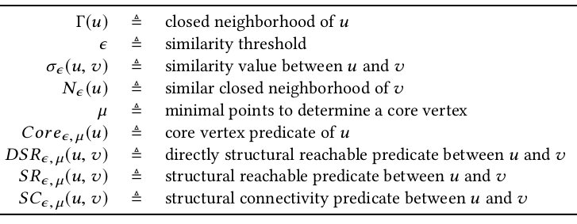

# ppScan

## Overview

SCAN notations

 

relations

def type | figure
--- | ---
input/output | 
eps-neighborhood |  
core |  
cluster |  
hub, outlier |  

## Project 

description | folder link
--- | ---
pSCAN-fork-optimization | [pSCAN-refactor](pSCAN-refactor)
pSCAN-fork-statistics | [pSCAN-statistics](pSCAN-statistics)
python scripts during study | [python_playground](python_playground)
python experiments | [python_experiments](python_experiments)
related projects | [related_projects](related_projects)
