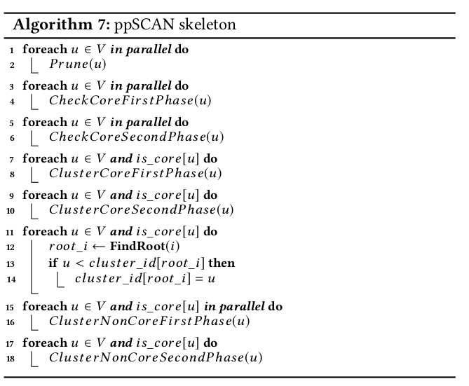

# ppScan

## Related Work

[SCAN Preliminaries](scan_preliminary.md)

## Design

skeleton:

data to operate with:

data | type | functionality
--- | --- | --- 
`min_cn` | edge property array  | at beginning, min common neighbors to be similar, then `similar(-1)` or `not similar(-2)` indicator. some of them not evaluated by pruning
`is_core` | vertex property array | at begining, bloom filter, after checking core second phase, the result of cores status for all vertices
`is_non_core` | vertex property array | bloom filter, used in check core second phase
`disjoint-set` | union-find set | inside two arrays, `parent` and `rank`, union-by-rank, compress-in-find-root, each tree represent a set
`cluster_id` | vertex property array | for looking up min core vertex id in this cluster represented by root. in other words, `cluster_id[FindRoot(u)]` is this cluster id

intentions in each phase:

* Prune: initialize some values in `min_cn`, which can be easily computated with arithmetic operations instead of 
set-intersection computations. There are two types, first is definitely not similar two vertices, second is defintely 
similar two vertices.

* CheckCoreFirstPhase: evaluate similarities for relationships from source vertex `u` to 
destination vertex `v` for all `u<v` and update corresponding similarity from source vertex `v` to destination vertex `u`. 
Min-max pruning is applied in this phase. Mark definite cores and definite non-cores with `is_core` and `is_non_core` array.

* CheckCoreSecondPhase: since the existence of min-max pruning, some vertices can not be determined by two bloom filters, `is_core` and `is_non_core`, thus similarities sourcing from these vertices that are not evaluated 
are evaluated and relationship is established for reversed edge.

* ClusterCoreFirstPhase: without further evaluation of similarities, union similar core-cores.

* ClusterCoreSecondPhase: some similarity predicates of core-cores are not know, evaluate them only when they are not in the same tree in the disjoint-set yet, 
if they are similar, union them.

* Trivial Preparing: Line 11 to 14 is for initializing `cluster_id` for looking up `cluster_id[FindRoot(u)]`.

* ClusterNonCoreFirstPhase: evaluate some unknow similarities among cores and non-co res.

* ClusterNonCoreSecondPhase: cluster non-cores when they are similar to cores 

## Project 

description | folder link
--- | ---
pSCAN-fork-optimization | [pSCAN-refactor](pSCAN-refactor)
pSCAN-fork-statistics | [pSCAN-statistics](pSCAN-statistics)
python scripts during study | [python_playground](python_playground)
python experiments | [python_experiments](python_experiments)
related projects | [related_projects](related_projects)
