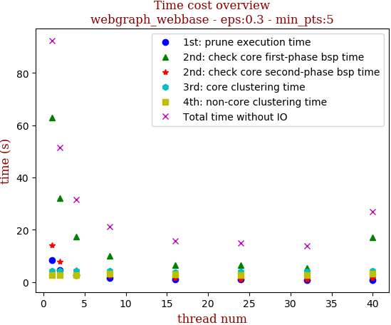
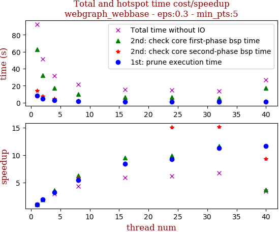
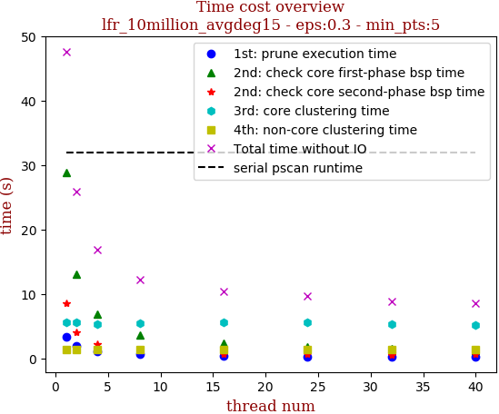
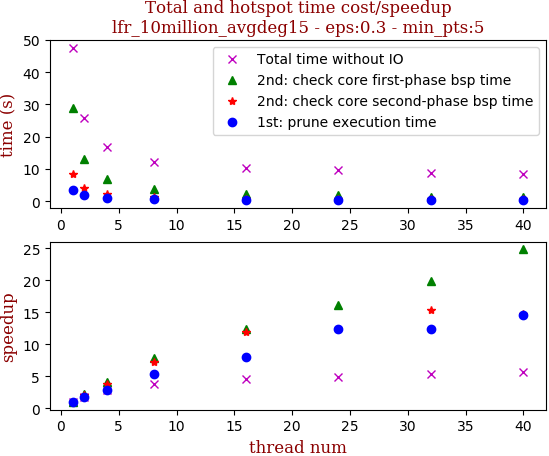

# Experiments
## Case Study 0

see [figures/figures-case-study0](figures/figures-case-study0), parameter setting: `eps:0.3`, `min_pts:5`
 on 9 graphs.

## Scalability
### Plan

runtime part, add state-of-art pscan runtime as a horizontal line to show parallel algorithm's contribution.

### Problem

* need to interpret the performance degradation in webbase.

overview | speedup
--- | ---
 | 

* need to analyze why lfr benchmark incurs more cost in union-find disjoint-set operation

overview | speedup
--- | ---
 | 

reason: zero-pruning in both prune0 and prune1

```
int size:4
n:10000001, m:152826874
read degree file time:210 ms
read adjacency list file time:6301 ms
check input graph file time:305 ms

Total input cost:7336 ms
with google perf start------------
1st: prune execution time:2250 ms
2nd: check core first-phase bsp time:22887 ms
2nd: check core second-phase bsp time:6086 ms
3rd: core clustering time:5106 ms
4th: non-core clustering time:1288 ms

prune0 definitely not reachable:0
prune1 definitely reachable:0
intersection times:76413437
cmp0:247555261
cmp1:1283030908
equal cmp:318549472
max portion:47
with google perf end--------------
Total time without IO:37632 ms
Total output cost:9880 ms
```

* need to elaborate on why it is not worthwhile to parallelize clustering phase(core clustering and non-core clustering), mention io cost

e.g, lfr-10million-avg15 synthetic graph, i/o cost is much bigger than 3rd/4th serial part

```zsh
int size:4
n:10000001, m:152826874
read degree file time:40 ms
read adjacency list file time:5120 ms
check input graph file time:298 ms

Total input cost:5938 ms
1st: prune execution time:194 ms
2nd: check core first-phase bsp time:1181 ms
2nd: check core second-phase bsp time:623 ms
3rd: core clustering time:5292 ms
4th: non-core clustering time:1289 ms
Total time without IO:8580 ms
Total output cost:10649 ms
```

* need to elaborate on comparison difference and union-find operation difference, implement more about statistics, give detailed information for workloads

* need to interpret the speedup difference among different input graphs, add some statistics about union-find operations


### Deprecated

[scalability_figure.py](scalability_figure.py)

```python

# deprecated
def post_process_and_display_tag(statistics_dic, tag_str, title_append_txt=''):
    def post_process():
        sorted_info_lst = sorted(statistics_dic.items(), key=lambda pair: pair[0])

        thread_lst = map(lambda pair: pair[0], sorted_info_lst)
        time_info_lst = map(lambda pair: pair[1], sorted_info_lst)

        time_lst = map(lambda my_dict: my_dict[tag_str], time_info_lst)
        print 'thread list:', thread_lst
        print 'tag time info list:', time_lst
        return thread_lst, time_lst

    # init parameters
    thread_lst, time_lst = post_process()
    tag_list = [prune_time_tag, first_bsp_time_tag, second_bsp_time_tag, core_cluster_time_tag,
                non_core_cluster_time_tag, total_time_tag]
    shape_color_lst = ['bo', 'g^', 'r*', 'ch', 'ys', 'mx']
    shape_color_dict = dict(zip(tag_list, shape_color_lst))

    # draw figures
    plt.plot(thread_lst, time_lst, shape_color_dict[tag_str])
    plt.legend(tag_list)
    font = {'family': 'serif', 'color': 'darkred', 'weight': 'normal', 'size': 12, }
    plt.title('Time cost' + '\n ' +
              title_append_txt if title_append_txt != '' else 'Time cost\n' + tag_str, fontdict=font)
    plt.xlabel('thread num', fontdict=font)
    plt.ylabel('time (ms)', fontdict=font)
    plt.show()
```
