# Scalability Case Study

parameter setting: `eps:0.3`, `min_pts:5`

## Statistics

* **eval comparison table**
 on 9 graphs.

algorithm | dblp | pokec | livejournal | orkut | uk | webbase | twitter | frienster | lfr10m
--- | --- | --- | --- | --- | --- | --- | --- | --- | ---
pscan   | 0.6177 | 0.8520 | 0.7243 | 0.8265	| **0.2439** | **0.2874** | 0.4471 | 0.8566 | **0.5192**
pscan+  | 0.7370 | 0.9209 | 0.8740 | 0.9278 | **0.5175** | **0.5238** | 0.4866 | 0.8764 | **1.0000**

* **`cmp`/`intersection_times` table** 

algorithm | dblp | pokec | livejournal | orkut | uk | webbase | twitter | frienster | lfr10m
--- | --- | --- | --- | --- | --- | --- | --- | --- | ---
pscan | 24.707 | 70.888 | 106.707 | 275.800 | 111.962 | **63.901** | 1841.663 | 385.317 | **22.978**
pscan+ | 23.422 | 67.641 | 101.258 | 264.468 | 146.264 | **88.889** | 1849.282 | 377.788 | **24.199**

## Observations

* webbase requires much fewer computations from **eval comparison table** and **`cmp`/`intersection_times` table** 

* dblp, webbase, check core 1st bsp(parallel eval) speedup degradation in 40 threads, but the runtime is still acceptable, since much less than i/o time

* webbase, check core 2nd bsp(binary search) speedup degradation in 40 threads, but the runtime is still acceptable, since much less than i/o time

* parallel prune speedup scales well vertically

## Need to Explanation

### Problems to Solve

dataset | detail
--- | ---
**dblp** | 16->40, prune not improve any more, check core 1st phase bsp becomes slower
pokec | 32->40, prune and check core 2nd phase becomes slower
livejournal | 24->32->40, check core 2nd phase bsp slower and faster
orkut | 32->40, check core 2nd phase bsp slower
**webbase** | 24->32->40, check core 1st and 2nd bsp slower

### Explanations

* dblp: casued by ``, from vtune report, system call cost, probably due to small tasks influencing behaviors of the thread pool, same problem with webbase

* webbase: task grain differs a lot, it seems 64 vertex as a task too small for check core 1st phase comp

* pokec, livejournal, orkut: maybe the same, we are required to assign tasks based on real work load, considering pruning, different degree of vertices, different degree of dst vertices

### Trade-off Problem

* Task too large: load imbalance, cache locality issue

* Task too small: system call overheads, queue access concurrency issue, memory cost for more function objects(maybe okay)

## Speedup Overview

computation and io portion

with 40 full logical threads | with best thread num
--- | ---
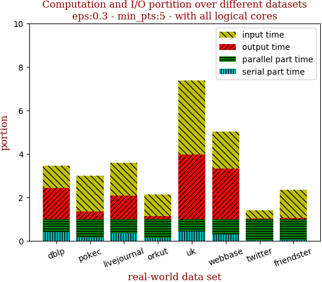 | 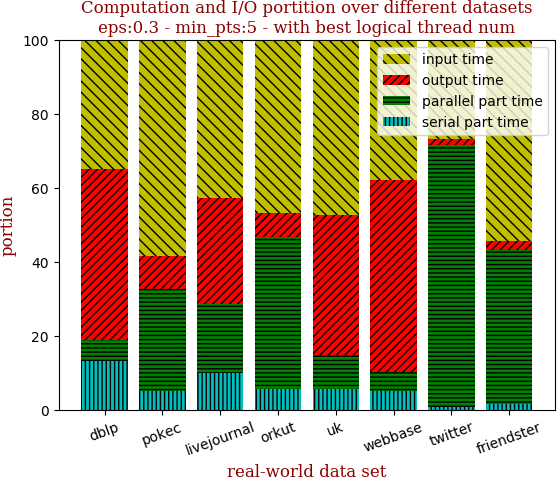

with 40 full logical threads | with best thread num
--- | ---
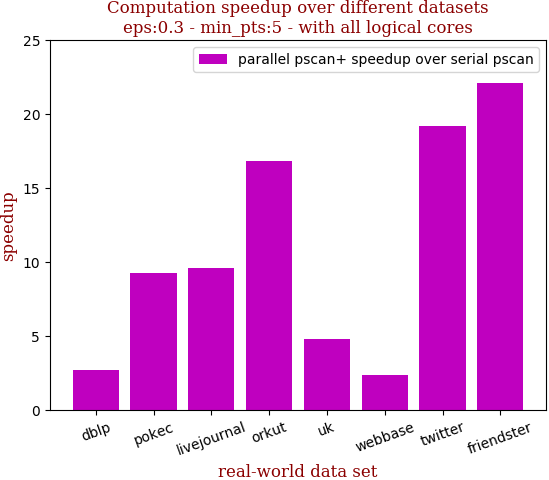 | 

```zsh
best performance thread_num_lst: [16, 32, 40, 40, 40, 32, 40, 40]
```

dataset | edge num | pscan runtime | pscan+ 40 logical-core full speedup | pscan+ best thread_num speedup | thread_num choice
--- | --- | --- | --- | --- | ---
dblp | 2,099,732 | 0.555s | **2.656** | **4.173** | 16
pokec | 30,282,866 | 8.597s | 9.234 | 9.792 | 32
livejournal | 69,362,378 | 21.846s | 9.561 | 9.561 | 40
orkut | 234,370,166 | 164.248s | 16.836 | 16.836 | 40
uk | 301,136,554 | 18.498s | **4.769** | 4.769 | 40
webbase | 1,050,026,736 | 63.705s | **2.372** | **4.632** | 32
twitter | 1,369,000,750 | 2487.317s | 19.218 | 19.218 | 40
friendster | 3,612,134,270 | 3726.302s | 22.067 | 22.067 | 40

## Small: Dblp

name | n | m 
--- | --- | ---
dblp        | 425,957       | 2,099,732

overview | speedup
--- | ---
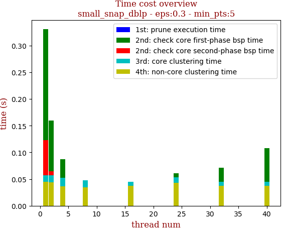 | 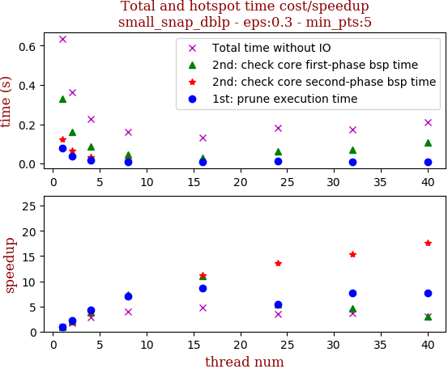

thread_num | prune | check-core 1st bsp | check-core 2nd bsp | cluster-core | cluster-non-core | total | total speedup
--- | --- | --- | --- | --- | --- | --- | ---
1 | 0.077s | 0.331s | 0.123s | 0.057s | 0.045s | 0.635s | 1.000
2 | 0.036s | 0.16s | 0.065s | 0.057s | 0.044s | 0.364s | 1.745
4 | 0.018s | 0.087s | 0.032s | 0.052s | 0.036s | 0.227s | 2.797
8 | 0.011s | 0.045s | 0.018s | 0.048s | 0.035s | 0.16s | 3.969
16 | 0.009s | 0.03s | 0.011s | 0.045s | 0.037s | 0.133s | 4.774
24 | 0.014s | 0.061s | 0.009s | 0.053s | 0.043s | 0.182s | 3.489
32 | 0.01s | 0.071s | 0.008s | 0.045s | 0.037s | 0.173s | 3.671
40 | 0.01s | 0.108s | 0.007s | 0.045s | 0.037s | 0.209s | 3.038

algo | egde num | prune0 | prune1 | eval | cmp0 | cmp1 | equ cmp | total time
--- | --- | --- | --- | --- | --- | --- | --- | ---
pscan | 1049866 | 0.0692 | 0.1938 | 0.6177 | 3240962 | 10910275 | 1872596 | 0.555s
pscan+ | 1049866 | 0.0692 | 0.1938 | 0.7370 | 10965872 | 4267180 | 2890571 | 0.562s 

## Medium: Pokec

name | n | m 
--- | --- | ---
pokec       | 1,632,804     | 30,282,866

overview | speedup
--- | ---
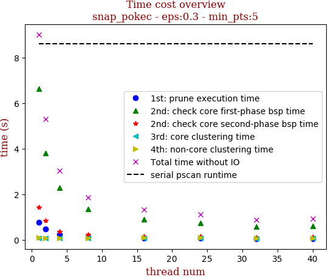 | 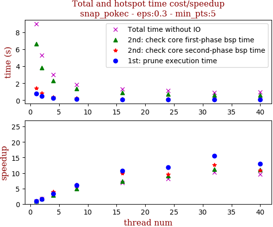

thread_num | prune | check-core 1st bsp | check-core 2nd bsp | cluster-core | cluster-non-core | total | total speedup
--- | --- | --- | --- | --- | --- | --- | ---
1 | 0.779s | 6.626s | 1.439s | 0.066s | 0.094s | 9.006s | 1.000
2 | 0.481s | 3.813s | 0.849s | 0.064s | 0.082s | 5.291s | 1.702
4 | 0.237s | 2.283s | 0.357s | 0.065s | 0.084s | 3.029s | 2.973
8 | 0.129s | 1.346s | 0.229s | 0.062s | 0.083s | 1.852s | 4.863
16 | 0.073s | 0.907s | 0.144s | 0.077s | 0.114s | 1.317s | 6.838
24 | 0.066s | 0.73s | 0.151s | 0.07s | 0.093s | 1.112s | 8.099
32 | 0.05s | 0.591s | 0.114s | 0.052s | 0.069s | 0.878s | 10.257
40 | 0.06s | 0.599s | 0.132s | 0.064s | 0.074s | 0.931s | 9.673

algo | egde num | prune0 | prune1 | eval | cmp0 | cmp1 | equ cmp | total time
--- | --- | --- | --- | --- | --- | --- | --- | ---
pscan | 15141433 | 0.0612 | 0.0179 | 0.8520 | 283087397 | 596798365 | 34622506 | 8.597s
pscan+ | 15141433 | 0.0612 | 0.0179 | 0.9209 | 518686746 | 388412047 | 36101066 | 8.388s 

## Medium: LiveJournal

name | n | m 
--- | --- | ---
livejournal | 4,036,538     | 69,362,378

overview | speedup
--- | ---
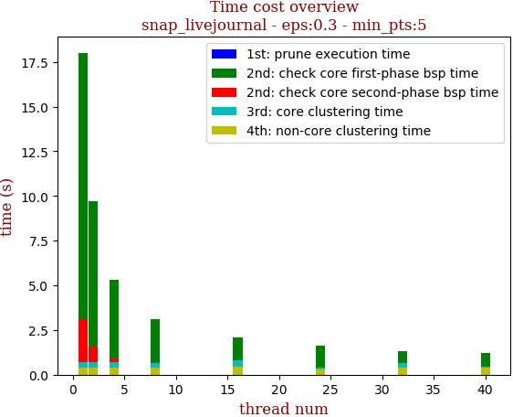 | 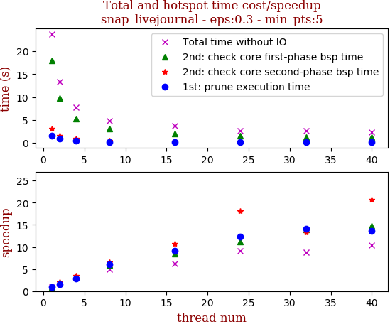

thread_num | prune | check-core 1st bsp | check-core 2nd bsp | cluster-core | cluster-non-core | total | total speedup
--- | --- | --- | --- | --- | --- | --- | ---
1 | 1.503s | 18.016s | 3.093s | 0.713s | 0.404s | 23.731s | 1.000
2 | 0.924s | 9.717s | 1.557s | 0.677s | 0.399s | 13.276s | 1.788
4 | 0.516s | 5.298s | 0.887s | 0.705s | 0.406s | 7.814s | 3.037
8 | 0.247s | 3.084s | 0.471s | 0.658s | 0.4s | 4.862s | 4.881
16 | 0.165s | 2.107s | 0.29s | 0.803s | 0.426s | 3.793s | 6.257
24 | 0.122s | 1.611s | 0.171s | 0.376s | 0.307s | 2.589s | 9.166
32 | 0.107s | 1.299s | 0.232s | 0.654s | 0.408s | 2.702s | 8.783
40 | 0.111s | 1.221s | 0.15s | 0.431s | 0.371s | 2.285s | 10.386

algo | egde num | prune0 | prune1 | eval | cmp0 | cmp1 | equ cmp | total time
--- | --- | --- | --- | --- | --- | --- | --- | ---
pscan | 34681189 | 0.0972 | 0.0289 | 0.7243 | 715186245 | 1810587638 | 154770513 | 21.846s
pscan+ | 34681189 | 0.0972 | 0.0289 | 0.8740 | 1776486141 | 994831588 | 297801180 | 21.634s 

## Medium: Orkut

name | n | m 
--- | --- | ---
orkut       | 3,072,627     | 234,370,166

overview | speedup
--- | ---
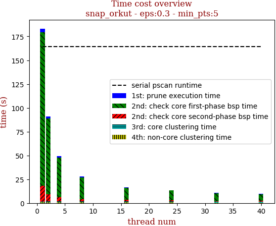 | 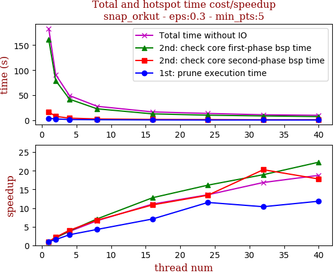

thread_num | prune | check-core 1st bsp | check-core 2nd bsp | cluster-core | cluster-non-core | total | total speedup
--- | --- | --- | --- | --- | --- | --- | ---
1 | 3.75s | 161.28s | 16.501s | 0.93s | 0.743s | 183.205s | 1.000
2 | 2.454s | 79.316s | 7.606s | 1.08s | 0.73s | 91.19s | 2.009
4 | 1.32s | 41.962s | 4.078s | 1.059s | 0.754s | 49.175s | 3.726
8 | 0.88s | 22.718s | 2.444s | 0.97s | 0.751s | 27.764s | 6.599
16 | 0.531s | 12.631s | 1.522s | 1.057s | 0.805s | 16.548s | 11.071
24 | 0.326s | 9.988s | 1.227s | 0.948s | 1.016s | 13.507s | 13.564
32 | 0.362s | 8.509s | 0.813s | 0.587s | 0.594s | 10.869s | 16.856
40 | 0.317s | 7.231s | 0.927s | 0.652s | 0.627s | 9.756s | 18.779

algo | egde num | prune0 | prune1 | eval | cmp0 | cmp1 | equ cmp | total time
--- | --- | --- | --- | --- | --- | --- | --- | ---
pscan | 117185083 | 0.0721 | 0.0002 | 0.8265 | 8115508516 | 17562443634 | 1033761851 | 164.248s
pscan+ | 117185083 | 0.0721 | 0.0002 | 0.9278 | 16230884108 | 11146323371 | 1375991912 | 171.835s 

## Medium: Uk

name | n | m 
--- | --- | ---
uk          | 18,520,343    | 301,136,554

overview | speedup
--- | ---
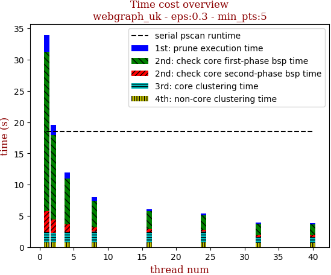 | 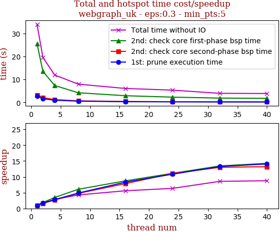

thread_num | prune | check-core 1st bsp | check-core 2nd bsp | cluster-core | cluster-non-core | total | total speedup
--- | --- | --- | --- | --- | --- | --- | ---
1 | 2.728s | 25.529s | 3.286s | 1.677s | 0.754s | 33.977s | 1.000
2 | 1.642s | 13.549s | 2.084s | 1.557s | 0.744s | 19.578s | 1.735
4 | 0.976s | 7.348s | 1.222s | 1.638s | 0.746s | 11.931s | 2.848
8 | 0.561s | 4.215s | 0.689s | 1.722s | 0.765s | 7.955s | 4.271
16 | 0.328s | 2.927s | 0.419s | 1.633s | 0.769s | 6.079s | 5.589
24 | 0.252s | 2.299s | 0.297s | 1.714s | 0.787s | 5.352s | 6.348
32 | 0.206s | 1.9s | 0.253s | 0.972s | 0.633s | 3.967s | 8.565
40 | 0.194s | 1.791s | 0.249s | 1.009s | 0.634s | 3.879s | 8.759

algo | egde num | prune0 | prune1 | eval | cmp0 | cmp1 | equ cmp | total time
--- | --- | --- | --- | --- | --- | --- | --- | ---
pscan | 150568277 | 0.4493 | 0.0332 | 0.2439 | 232732652 | 3562856847 | 315608563 | 18.498s
pscan+ | 150568277 | 0.4493 | 0.0332 | 0.5175 | 588466397 | 8695675975 | 2111915924 | 31.241s 

## Large: Webbase

name | n | m 
--- | --- | ---
webbase     | 118,142,143   | 1,050,026,736

overview | speedup
--- | ---
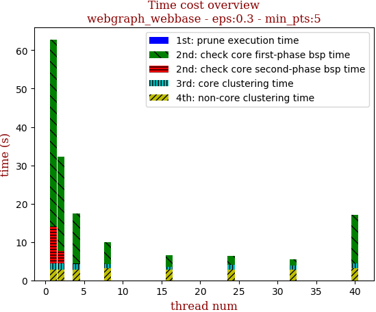 | 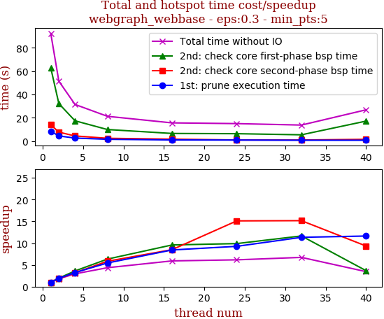

thread_num | prune | check-core 1st bsp | check-core 2nd bsp | cluster-core | cluster-non-core | total | total speedup
--- | --- | --- | --- | --- | --- | --- | ---
1 | 8.416s | 62.804s | 14.063s | 4.361s | 2.742s | 92.388s | 1.000
2 | 4.433s | 32.174s | 7.679s | 4.374s | 2.742s | 51.404s | 1.797
4 | 2.607s | 17.421s | 4.414s | 4.253s | 2.741s | 31.438s | 2.939
8 | 1.55s | 9.935s | 2.414s | 4.299s | 3.074s | 21.275s | 4.343
16 | 0.999s | 6.56s | 1.656s | 3.568s | 2.844s | 15.628s | 5.912
24 | 0.909s | 6.352s | 0.931s | 4.063s | 2.748s | 15.006s | 6.157
32 | 0.743s | 5.394s | 0.928s | 3.944s | 2.742s | 13.753s | 6.718
40 | 0.724s | 17.167s | 1.508s | 4.324s | 3.128s | 26.854s | 3.440

algo | egde num | prune0 | prune1 | eval | cmp0 | cmp1 | equ cmp | total time
--- | --- | --- | --- | --- | --- | --- | --- | ---
pscan | 525013368 | 0.3883 | 0.0878 | 0.2874 | 1020798101 | 7772394167 | 847450383 | 63.705s
pscan+ | 525013368 | 0.3883 | 0.0878 | 0.5238 | 2061408067 | 15685059958 | 6698684510 | 85.054s 

## Large: Twitter

name | n | m 
--- | --- | ---
twitter     | 41,652,230    | 1,369,000,750

overview | speedup
--- | ---
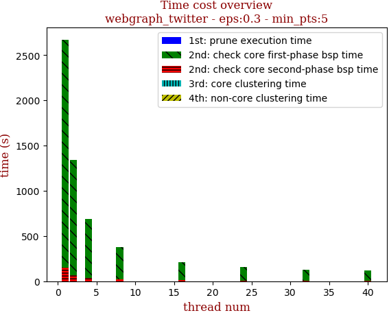 | 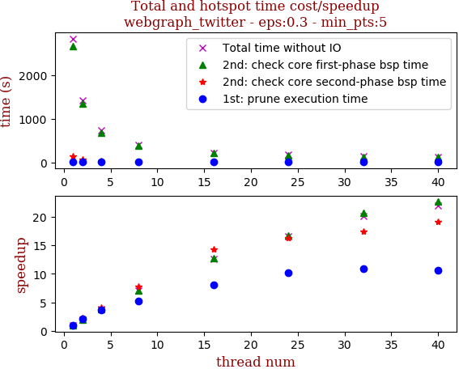

thread_num | prune | check-core 1st bsp | check-core 2nd bsp | cluster-core | cluster-non-core | total | total speedup
--- | --- | --- | --- | --- | --- | --- | ---
1 | 17.42s | 2670.844s | 149.719s | 0.805s | 1.21s | 2840.002s | 1.000
2 | 8.141s | 1342.299s | 65.191s | 0.959s | 1.074s | 1417.667s | 2.003
4 | 4.635s | 684.949s | 36.339s | 0.85s | 1.097s | 727.872s | 3.902
8 | 3.321s | 377.744s | 19.278s | 0.93s | 1.099s | 402.375s | 7.058
16 | 2.148s | 209.769s | 10.508s | 0.58s | 1.191s | 224.198s | 12.667
24 | 1.714s | 159.254s | 9.195s | 0.489s | 1.028s | 171.683s | 16.542
32 | 1.604s | 129.201s | 8.592s | 0.813s | 1.017s | 141.229s | 20.109
40 | 1.649s | 118.153s | 7.845s | 0.56s | 1.219s | 129.427s | 21.943

algo | egde num | prune0 | prune1 | eval | cmp0 | cmp1 | equ cmp | total time
--- | --- | --- | --- | --- | --- | --- | --- | ---
pscan | 684500375 | 0.5063 | 0.0071 | 0.4471 | 143132655618 | 391170393366 | 29341665477 | 2487.317s
pscan+ | 684500375 | 0.5063 | 0.0071 | 0.4866 | 305687955207 | 270084254384 | 40209354722 | 2777.732s 

## Large: Fridenster

name | n | m 
--- | --- | ---
friendster  | 124,836,180   | 3,612,134,270

overview | speedup
--- | ---
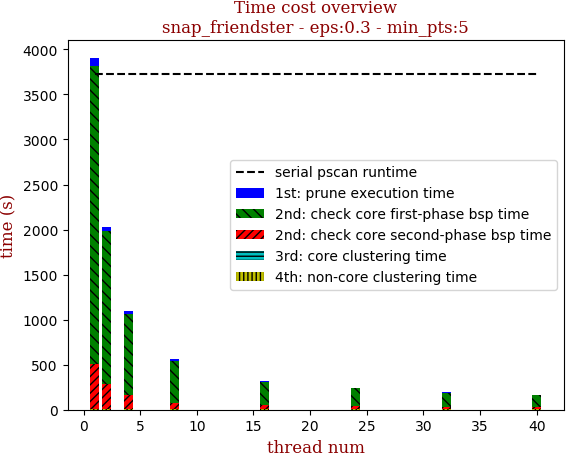 | 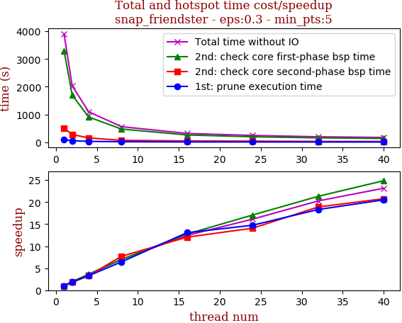

thread_num | prune | check-core 1st bsp | check-core 2nd bsp | cluster-core | cluster-non-core | total | total speedup
--- | --- | --- | --- | --- | --- | --- | ---
1 | 94.69s | 3300.112s | 505.722s | 2.072s | 5.12s | 3907.722s | 1.000
2 | 51.892s | 1697.725s | 274.799s | 2.294s | 3.964s | 2030.68s | 1.924
4 | 28.763s | 907.392s | 153.025s | 2.265s | 4.225s | 1095.677s | 3.566
8 | 14.744s | 472.934s | 65.818s | 1.996s | 3.502s | 558.998s | 6.991
16 | 7.252s | 258.949s | 41.999s | 1.887s | 4.156s | 314.246s | 12.435
24 | 6.421s | 193.434s | 35.944s | 2.349s | 4.177s | 242.329s | 16.126
32 | 5.172s | 154.929s | 26.779s | 1.883s | 4.134s | 192.901s | 20.258
40 | 4.617s | 132.803s | 24.353s | 1.707s | 5.382s | 168.866s | 23.141

algo | egde num | prune0 | prune1 | eval | cmp0 | cmp1 | equ cmp | total time
--- | --- | --- | --- | --- | --- | --- | --- | ---
pscan | 1806067135 | 0.1206 | 0.0030 | 0.8566 | 189028022634 | 399383776139 | 7711211516 | 3726.302s
pscan+ | 1806067135 | 0.1206 | 0.0030 | 0.8764 | 344733547542 | 245393023242 | 7835707712 | 3862.694s 

## LFR: 10million-avgdeg15-maxdeg50

name | n | m
--- | --- | --- 
lfr-avg15-max50 | 10,000,001  | 152,826,874 

overview | speedup
--- | ---
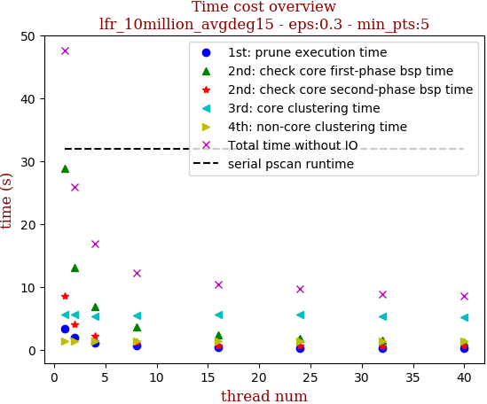 | 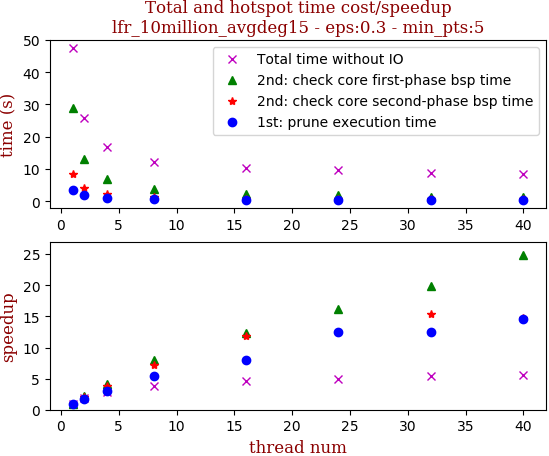

thread_num | prune | check-core 1st bsp | check-core 2nd bsp | cluster-core | cluster-non-core | total | total speedup
--- | --- | --- | --- | --- | --- | --- | ---
1 | 3.335s | 28.883s | 8.464s | 5.589s | 1.308s | 47.581s | 1.000
2 | 1.87s | 13.076s | 4.047s | 5.56s | 1.304s | 25.859s | 1.840
4 | 1.125s | 6.864s | 2.245s | 5.314s | 1.295s | 16.845s | 2.825
8 | 0.613s | 3.647s | 1.176s | 5.491s | 1.3s | 12.229s | 3.891
16 | 0.414s | 2.331s | 0.71s | 5.569s | 1.289s | 10.315s | 4.613
24 | 0.267s | 1.784s | 0.679s | 5.616s | 1.297s | 9.646s | 4.933
32 | 0.267s | 1.452s | 0.548s | 5.233s | 1.312s | 8.815s | 5.398
40 | 0.228s | 1.162s | 0.573s | 5.218s | 1.281s | 8.464s | 5.622

algo | egde num | prune0 | prune1 | eval | cmp0 | cmp1 | equ cmp | total time
--- | --- | --- | --- | --- | --- | --- | --- | ---
pscan | 76413437 | 0.0000 | 0.0000 | 0.5192 | 159121647 | 644629816 | 107880042 | 31.884s
pscan+ | 76413437 | 0.0000 | 0.0000 | 1.0000 | 247555261 | 1283030908 | 318549472 | 37.591s 