# Workload Case Study

parameter setting: `min_pts:5`, varying `eps`

green triangle: pscan+ eval number

read square: pscan eval number

## Observations

* eps from `0.3` to `0.8`, `pscan+/pscan runtime` is within 2, in all experimental datasets

* eps `0.1`, `0.2`, except webbase, uk, twitter, `pscan+/pscan runtime` is within 2

* eps `0.9`, workload is not heavy at all, due to the effect of pruning 0, definitely not reachable

* in all except lfr graph, from eps `0.2` to larger, workload and runtime decreases, lfr from eps `0.5` to larger,

## Small: Dblp

workload | runtime
--- | ---
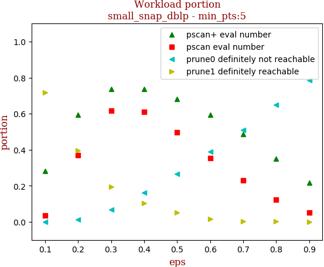 | 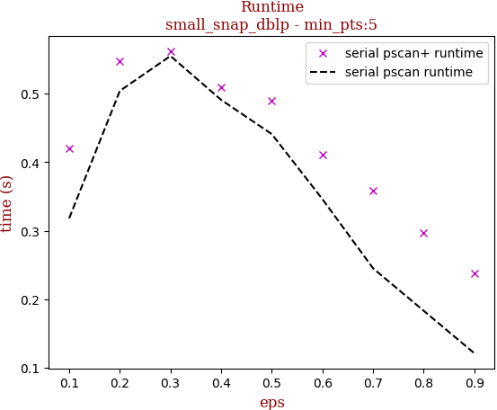

tag | eps-0.1 | eps-0.2 | eps-0.3 | eps-0.4 | eps-0.5 | eps-0.6 | eps-0.7 | eps-0.8 | eps-0.9
--- | --- | --- | --- | --- | --- | --- | --- | --- | ---
prune0 definitely not reachable | 0.0000 | 0.0120 | 0.0692 | 0.1618 | 0.2660 | 0.3901 | 0.5088 | 0.6480 | 0.7839
prune1 definitely reachable | 0.7171 | 0.3955 | 0.1938 | 0.1028 | 0.0514 | 0.0170 | 0.0040 | 0.0016 | 0.0000
pscan eval number | 0.0367 | 0.3695 | 0.6177 | 0.6097 | 0.4960 | 0.3524 | 0.2301 | 0.1227 | 0.0514
pscan+ eval number | 0.2828 | 0.5925 | 0.7370 | 0.7355 | 0.6826 | 0.5930 | 0.4871 | 0.3504 | 0.2161
serial pscan runtime | 0.3180 | 0.5040 | 0.5550 | 0.4910 | 0.4410 | 0.3460 | 0.2450 | 0.1830 | 0.1210
serial pscan+ runtime | 0.4200 | 0.5480 | 0.5620 | 0.5100 | 0.4900 | 0.4110 | 0.3580 | 0.2970 | 0.2380
pscan+/pscan eval | 7.7008 | 1.6035 | 1.1931 | 1.2062 | 1.3762 | 1.6828 | 2.1173 | 2.8545 | 4.2089
pscan+/pscan runtime | 1.3208 | 1.0873 | 1.0126 | 1.0387 | 1.1111 | 1.1879 | 1.4612 | 1.6230 | 1.9669

## Medium: Pokec

workload | runtime
--- | ---
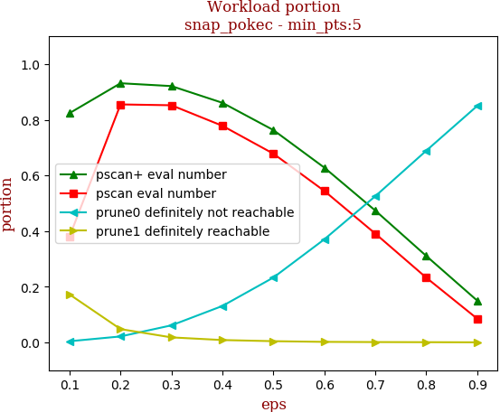 | 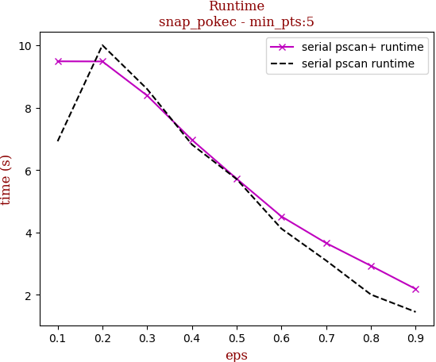

tag | eps-0.1 | eps-0.2 | eps-0.3 | eps-0.4 | eps-0.5 | eps-0.6 | eps-0.7 | eps-0.8 | eps-0.9
--- | --- | --- | --- | --- | --- | --- | --- | --- | ---
prune0 definitely not reachable | 0.0040 | 0.0213 | 0.0612 | 0.1309 | 0.2329 | 0.3704 | 0.5254 | 0.6889 | 0.8499
prune1 definitely reachable | 0.1722 | 0.0476 | 0.0179 | 0.0083 | 0.0042 | 0.0018 | 0.0011 | 0.0006 | 0.0002
pscan eval number | 0.3805 | 0.8551 | 0.8520 | 0.7782 | 0.6780 | 0.5441 | 0.3907 | 0.2324 | 0.0849
pscan+ eval number | 0.8238 | 0.9311 | 0.9209 | 0.8608 | 0.7628 | 0.6278 | 0.4735 | 0.3105 | 0.1499
serial pscan runtime | 6.9250 | 10.0040 | 8.5970 | 6.8200 | 5.7090 | 4.1220 | 3.0980 | 2.0090 | 1.4530
serial pscan+ runtime | 9.4870 | 9.4830 | 8.3880 | 6.9690 | 5.7220 | 4.5140 | 3.6590 | 2.9310 | 2.1880
pscan+/pscan eval | 2.1653 | 1.0890 | 1.0809 | 1.1062 | 1.1252 | 1.1540 | 1.2120 | 1.3358 | 1.7650
pscan+/pscan runtime | 1.3700 | 0.9479 | 0.9757 | 1.0218 | 1.0023 | 1.0951 | 1.1811 | 1.4589 | 1.5058

## Medium: LiveJournal

workload | runtime
--- | ---
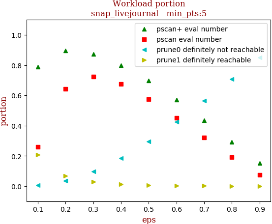 | 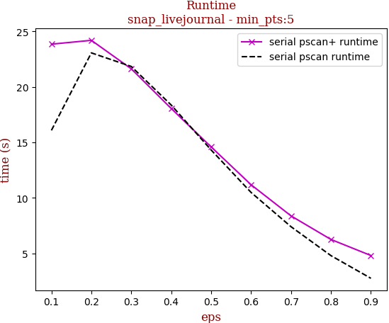

tag | eps-0.1 | eps-0.2 | eps-0.3 | eps-0.4 | eps-0.5 | eps-0.6 | eps-0.7 | eps-0.8 | eps-0.9
--- | --- | --- | --- | --- | --- | --- | --- | --- | ---
prune0 definitely not reachable | 0.0063 | 0.0361 | 0.0972 | 0.1859 | 0.2950 | 0.4258 | 0.5639 | 0.7064 | 0.8489
prune1 definitely reachable | 0.2065 | 0.0693 | 0.0289 | 0.0142 | 0.0075 | 0.0029 | 0.0016 | 0.0008 | 0.0000
pscan eval number | 0.2609 | 0.6435 | 0.7243 | 0.6758 | 0.5759 | 0.4504 | 0.3196 | 0.1916 | 0.0760
pscan+ eval number | 0.7872 | 0.8947 | 0.8740 | 0.7998 | 0.6975 | 0.5712 | 0.4346 | 0.2928 | 0.1511
serial pscan runtime | 16.0880 | 23.0720 | 21.8460 | 18.3700 | 14.3170 | 10.4900 | 7.4040 | 4.7970 | 2.7530
serial pscan+ runtime | 23.8560 | 24.2030 | 21.6340 | 18.0540 | 14.5930 | 11.1850 | 8.3790 | 6.2530 | 4.8080
pscan+/pscan eval | 3.0168 | 1.3904 | 1.2066 | 1.1836 | 1.2111 | 1.2684 | 1.3597 | 1.5281 | 1.9886
pscan+/pscan runtime | 1.4828 | 1.0490 | 0.9903 | 0.9828 | 1.0193 | 1.0663 | 1.1317 | 1.3035 | 1.7465

## Medium: Orkut

workload | runtime
--- | ---
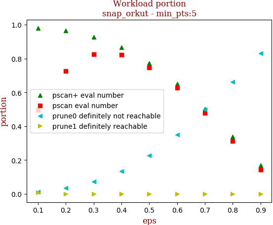 | 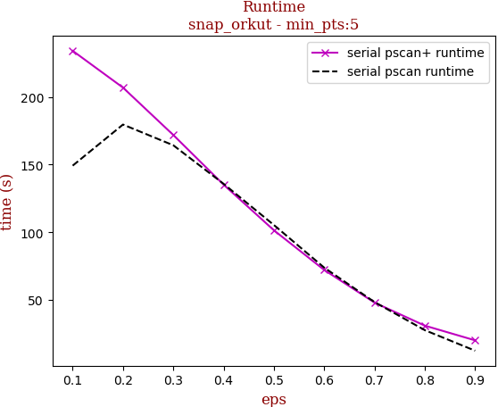

tag | eps-0.1 | eps-0.2 | eps-0.3 | eps-0.4 | eps-0.5 | eps-0.6 | eps-0.7 | eps-0.8 | eps-0.9
--- | --- | --- | --- | --- | --- | --- | --- | --- | ---
prune0 definitely not reachable | 0.0104 | 0.0337 | 0.0721 | 0.1346 | 0.2266 | 0.3498 | 0.4975 | 0.6610 | 0.8313
prune1 definitely reachable | 0.0093 | 0.0008 | 0.0002 | 0.0000 | 0.0000 | 0.0000 | 0.0000 | 0.0000 | 0.0000
pscan eval number | 0.4950 | 0.7267 | 0.8265 | 0.8218 | 0.7459 | 0.6261 | 0.4782 | 0.3134 | 0.1424
pscan+ eval number | 0.9802 | 0.9654 | 0.9278 | 0.8653 | 0.7734 | 0.6502 | 0.5025 | 0.3390 | 0.1687
serial pscan runtime | 149.2070 | 179.5500 | 164.2480 | 135.7720 | 105.3600 | 73.8870 | 48.4600 | 27.7080 | 12.5350
serial pscan+ runtime | 234.0170 | 206.8320 | 171.8350 | 135.1640 | 101.4630 | 72.1790 | 48.0690 | 31.0410 | 20.1800
pscan+/pscan eval | 1.9804 | 1.3285 | 1.1225 | 1.0529 | 1.0369 | 1.0384 | 1.0508 | 1.0818 | 1.1851
pscan+/pscan runtime | 1.5684 | 1.1519 | 1.0462 | 0.9955 | 0.9630 | 0.9769 | 0.9919 | 1.1203 | 1.6099

## Medium: Uk

workload | runtime
--- | ---
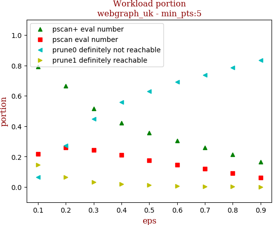 | 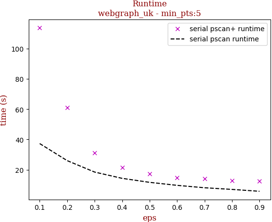

tag | eps-0.1 | eps-0.2 | eps-0.3 | eps-0.4 | eps-0.5 | eps-0.6 | eps-0.7 | eps-0.8 | eps-0.9
--- | --- | --- | --- | --- | --- | --- | --- | --- | ---
prune0 definitely not reachable | 0.0639 | 0.2715 | 0.4493 | 0.5580 | 0.6307 | 0.6897 | 0.7381 | 0.7854 | 0.8332
prune1 definitely reachable | 0.1443 | 0.0637 | 0.0332 | 0.0195 | 0.0117 | 0.0051 | 0.0030 | 0.0018 | 0.0004
pscan eval number | 0.2170 | 0.2607 | 0.2439 | 0.2115 | 0.1766 | 0.1451 | 0.1184 | 0.0903 | 0.0628
pscan+ eval number | 0.7917 | 0.6648 | 0.5175 | 0.4224 | 0.3576 | 0.3053 | 0.2589 | 0.2128 | 0.1663
serial pscan runtime | 37.3000 | 26.0480 | 18.4980 | 14.3560 | 11.7210 | 9.7370 | 8.1520 | 7.0540 | 5.8140
serial pscan+ runtime | 113.7460 | 61.0280 | 31.2410 | 21.3860 | 17.3220 | 14.9250 | 14.2340 | 12.8760 | 12.3960
pscan+/pscan eval | 3.6486 | 2.5498 | 2.1219 | 1.9970 | 2.0248 | 2.1037 | 2.1870 | 2.3565 | 2.6476
pscan+/pscan runtime | 3.0495 | 2.3429 | 1.6889 | 1.4897 | 1.4779 | 1.5328 | 1.7461 | 1.8253 | 2.1321

## Large: Webbase

workload | runtime
--- | ---
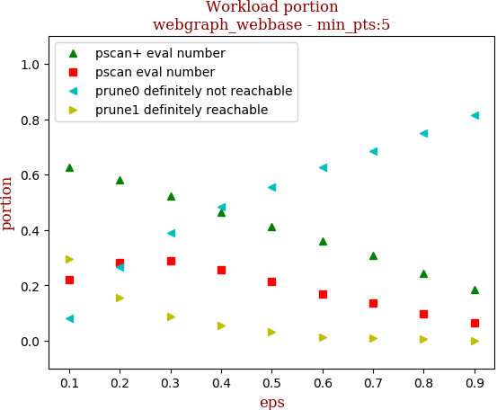 | 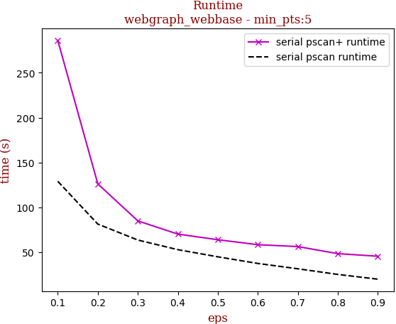

tag | eps-0.1 | eps-0.2 | eps-0.3 | eps-0.4 | eps-0.5 | eps-0.6 | eps-0.7 | eps-0.8 | eps-0.9
--- | --- | --- | --- | --- | --- | --- | --- | --- | ---
prune0 definitely not reachable | 0.0802 | 0.2647 | 0.3883 | 0.4822 | 0.5548 | 0.6250 | 0.6837 | 0.7507 | 0.8133
prune1 definitely reachable | 0.2940 | 0.1546 | 0.0878 | 0.0545 | 0.0328 | 0.0142 | 0.0083 | 0.0049 | 0.0011
pscan eval number | 0.2202 | 0.2815 | 0.2874 | 0.2556 | 0.2150 | 0.1701 | 0.1352 | 0.0974 | 0.0648
pscan+ eval number | 0.6257 | 0.5807 | 0.5238 | 0.4634 | 0.4124 | 0.3607 | 0.3080 | 0.2444 | 0.1856
serial pscan runtime | 129.0710 | 81.4750 | 63.7050 | 52.9780 | 45.0060 | 37.6240 | 31.6750 | 25.3990 | 20.0910
serial pscan+ runtime | 286.0120 | 126.2550 | 85.0540 | 70.3280 | 64.0460 | 58.5190 | 56.4140 | 48.5360 | 45.6610
pscan+/pscan eval | 2.8419 | 2.0629 | 1.8228 | 1.8126 | 1.9184 | 2.1213 | 2.2780 | 2.5109 | 2.8661
pscan+/pscan runtime | 2.2159 | 1.5496 | 1.3351 | 1.3275 | 1.4231 | 1.5554 | 1.7810 | 1.9109 | 2.2727

## Large: Twitter

workload | runtime
--- | ---
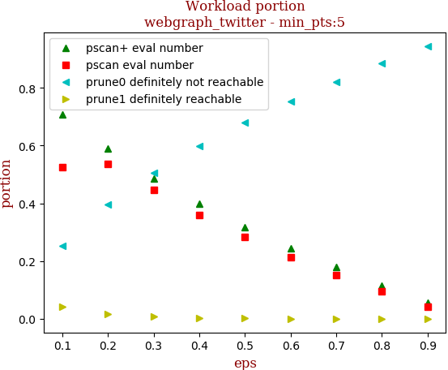 | 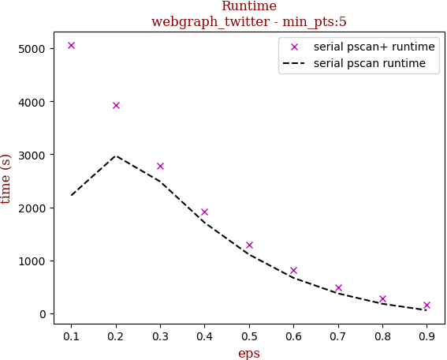

tag | eps-0.1 | eps-0.2 | eps-0.3 | eps-0.4 | eps-0.5 | eps-0.6 | eps-0.7 | eps-0.8 | eps-0.9
--- | --- | --- | --- | --- | --- | --- | --- | --- | ---
prune0 definitely not reachable | 0.2514 | 0.3947 | 0.5063 | 0.5987 | 0.6795 | 0.7537 | 0.8213 | 0.8848 | 0.9442
prune1 definitely reachable | 0.0410 | 0.0157 | 0.0071 | 0.0036 | 0.0018 | 0.0007 | 0.0004 | 0.0002 | 0.0000
pscan eval number | 0.5248 | 0.5365 | 0.4471 | 0.3591 | 0.2822 | 0.2131 | 0.1513 | 0.0946 | 0.0423
pscan+ eval number | 0.7075 | 0.5896 | 0.4866 | 0.3977 | 0.3187 | 0.2456 | 0.1783 | 0.1150 | 0.0558
serial pscan runtime | 2223.3160 | 2973.8690 | 2487.3170 | 1712.8150 | 1112.0270 | 671.1030 | 378.6620 | 183.0120 | 61.5780
serial pscan+ runtime | 5060.2820 | 3929.8320 | 2777.7320 | 1922.4830 | 1287.9490 | 819.5970 | 489.6790 | 280.0960 | 166.5680
pscan+/pscan eval | 1.3481 | 1.0991 | 1.0884 | 1.1075 | 1.1292 | 1.1529 | 1.1784 | 1.2152 | 1.3186
pscan+/pscan runtime | 2.2760 | 1.3215 | 1.1168 | 1.1224 | 1.1582 | 1.2213 | 1.2932 | 1.5305 | 2.7050

## Large: Fridenster

workload | runtime
--- | ---
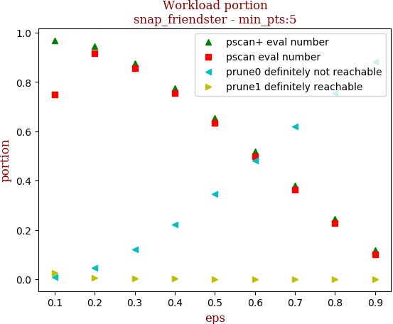 | 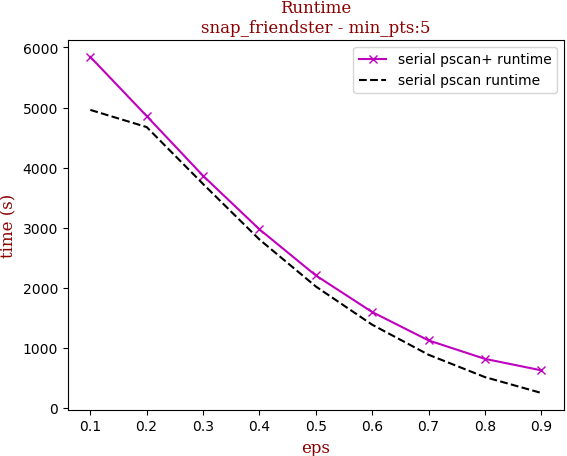

tag | eps-0.1 | eps-0.2 | eps-0.3 | eps-0.4 | eps-0.5 | eps-0.6 | eps-0.7 | eps-0.8 | eps-0.9
--- | --- | --- | --- | --- | --- | --- | --- | --- | ---
prune0 definitely not reachable | 0.0072 | 0.0471 | 0.1206 | 0.2231 | 0.3458 | 0.4812 | 0.6192 | 0.7544 | 0.8818
prune1 definitely reachable | 0.0243 | 0.0068 | 0.0030 | 0.0016 | 0.0010 | 0.0004 | 0.0002 | 0.0001 | 0.0000
pscan eval number | 0.7487 | 0.9163 | 0.8566 | 0.7546 | 0.6329 | 0.4989 | 0.3619 | 0.2277 | 0.1017
pscan+ eval number | 0.9686 | 0.9461 | 0.8764 | 0.7753 | 0.6532 | 0.5184 | 0.3805 | 0.2455 | 0.1182
serial pscan runtime | 4959.7340 | 4673.8800 | 3726.3020 | 2801.6070 | 2019.3340 | 1382.4930 | 881.8610 | 509.7330 | 245.7020
serial pscan+ runtime | 5842.4790 | 4857.3320 | 3862.6940 | 2971.0850 | 2203.1410 | 1593.2370 | 1120.5860 | 813.1940 | 622.2720
pscan+/pscan eval | 1.2937 | 1.0326 | 1.0231 | 1.0274 | 1.0322 | 1.0391 | 1.0515 | 1.0779 | 1.1621
pscan+/pscan runtime | 1.1780 | 1.0393 | 1.0366 | 1.0605 | 1.0910 | 1.1524 | 1.2707 | 1.5953 | 2.5326

## LFR: 10million-avgdeg15-maxdeg50

workload | runtime
--- | ---
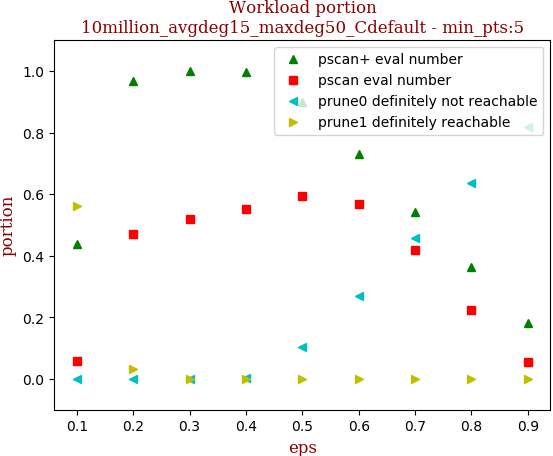 | 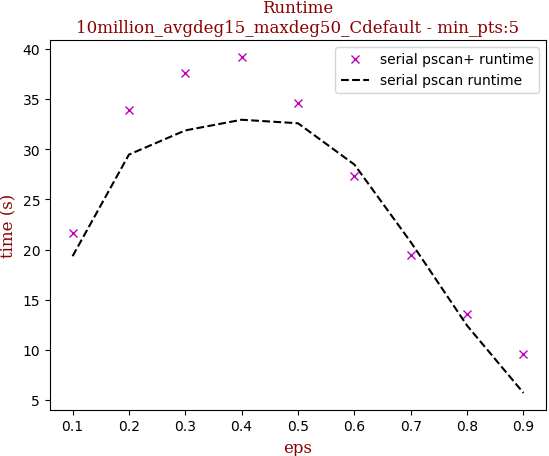

tag | eps-0.1 | eps-0.2 | eps-0.3 | eps-0.4 | eps-0.5 | eps-0.6 | eps-0.7 | eps-0.8 | eps-0.9
--- | --- | --- | --- | --- | --- | --- | --- | --- | ---
prune0 definitely not reachable | 0.0000 | 0.0000 | 0.0000 | 0.0022 | 0.1024 | 0.2705 | 0.4575 | 0.6374 | 0.8174
prune1 definitely reachable | 0.5617 | 0.0319 | 0.0000 | 0.0000 | 0.0000 | 0.0000 | 0.0000 | 0.0000 | 0.0000
pscan eval number | 0.0572 | 0.4705 | 0.5192 | 0.5528 | 0.5955 | 0.5689 | 0.4174 | 0.2250 | 0.0550
pscan+ eval number | 0.4383 | 0.9681 | 1.0000 | 0.9978 | 0.8976 | 0.7295 | 0.5425 | 0.3626 | 0.1826
serial pscan runtime | 19.3410 | 29.4730 | 31.8840 | 32.9470 | 32.5950 | 28.4800 | 20.7540 | 12.4160 | 5.7070
serial pscan+ runtime | 21.6570 | 33.8900 | 37.5910 | 39.2120 | 34.5810 | 27.3400 | 19.4900 | 13.5310 | 9.5710
pscan+/pscan eval | 7.6595 | 2.0573 | 1.9260 | 1.8052 | 1.5073 | 1.2823 | 1.2997 | 1.6115 | 3.3231
pscan+/pscan runtime | 1.1197 | 1.1499 | 1.1790 | 1.1902 | 1.0609 | 0.9600 | 0.9391 | 1.0898 | 1.6771
