dataset | scalability link
--- | ---
small_snap_dblp | [small_snap_dblp.md](small_snap_dblp.md)
snap_pokec | [snap_pokec.md](snap_pokec.md)
snap_livejournal | [snap_livejournal.md](snap_livejournal.md)
snap_orkut | [snap_orkut.md](snap_orkut.md)

## eps:0.1

with 40 full logical threads | with best thread num
--- | ---
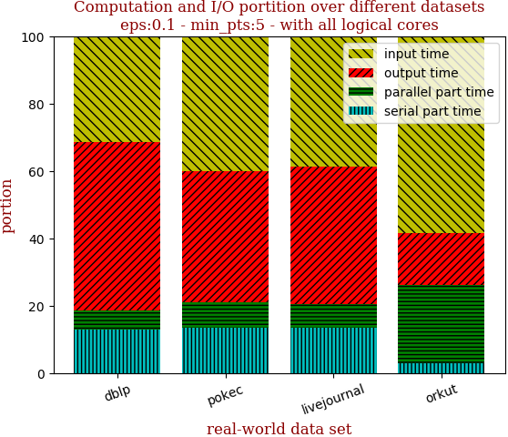 | 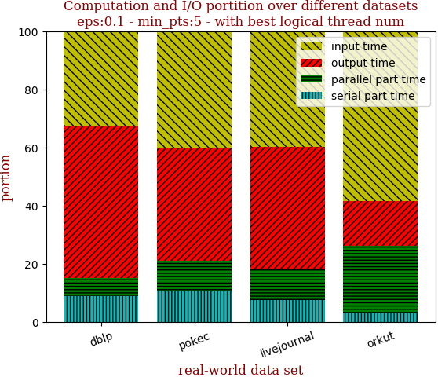

with 40 full logical threads | with best thread num
--- | ---
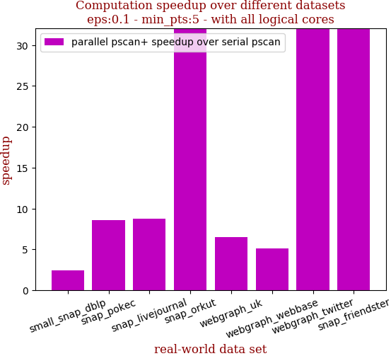 | 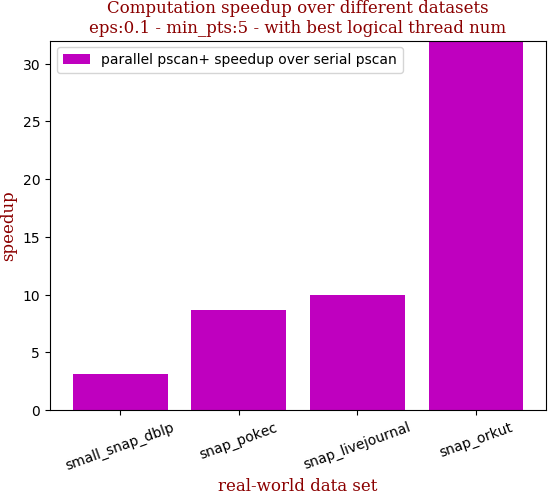

```zsh
best performance thread_num_lst:[8, 24, 16, 40]
```

dataset | edge num | pscan runtime | pscan+ 40 logical-core full speedup | pscan+ best thread_num speedup | thread_num choice
--- | --- | --- | --- | --- | ---
small_snap_dblp | 2,099,732 | 0.318s | 2.427 | 3.118 | 8
snap_pokec | 30,282,866 | 6.925s | 8.592 | 8.656 | 24
snap_livejournal | 69,362,378 | 16.088s | 8.786 | 10.005 | 16
snap_orkut | 234,370,166 | 149.207s | 34.230 | 34.230 | 40

## eps:0.2

with 40 full logical threads | with best thread num
--- | ---
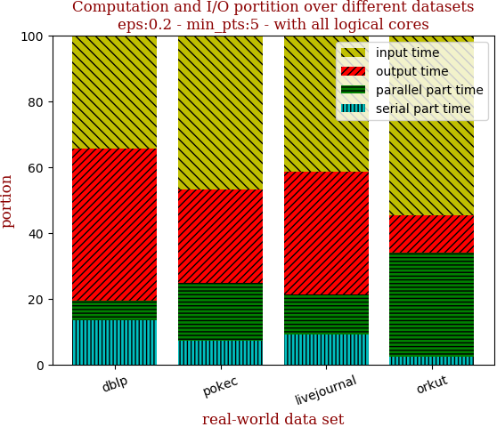 | 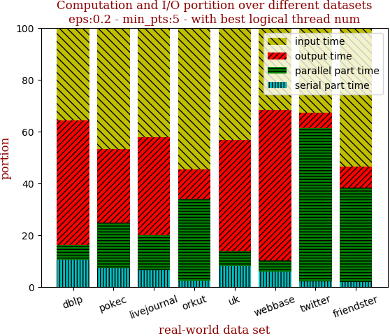

with 40 full logical threads | with best thread num
--- | ---
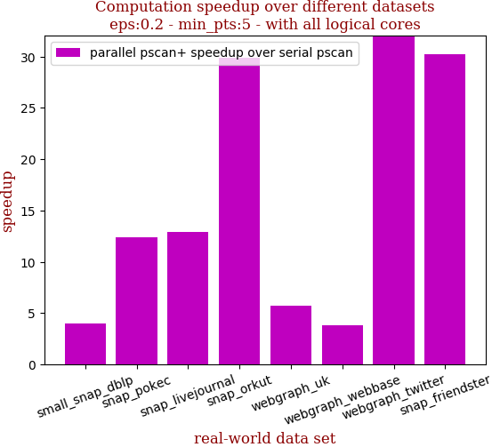 | 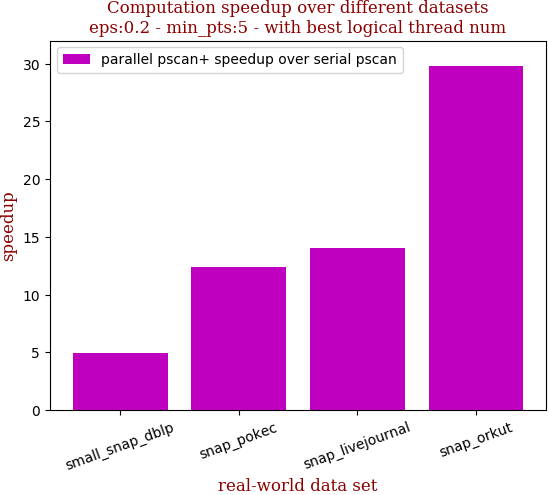

```zsh
best performance thread_num_lst:[16, 40, 32, 40]
```

dataset | edge num | pscan runtime | pscan+ 40 logical-core full speedup | pscan+ best thread_num speedup | thread_num choice
--- | --- | --- | --- | --- | ---
small_snap_dblp | 2,099,732 | 0.504s | 4.000 | 4.990 | 16
snap_pokec | 30,282,866 | 10.004s | 12.397 | 12.397 | 40
snap_livejournal | 69,362,378 | 23.072s | 12.933 | 14.043 | 32
snap_orkut | 234,370,166 | 179.55s | 29.835 | 29.835 | 40

## eps:0.3

with 40 full logical threads | with best thread num
--- | ---
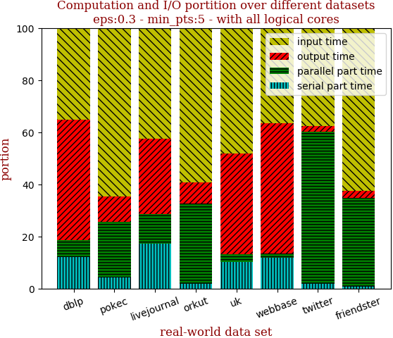 | 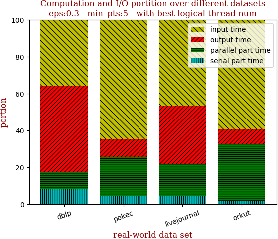

with 40 full logical threads | with best thread num
--- | ---
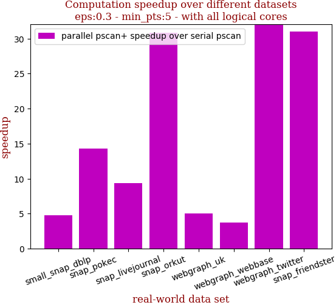 | 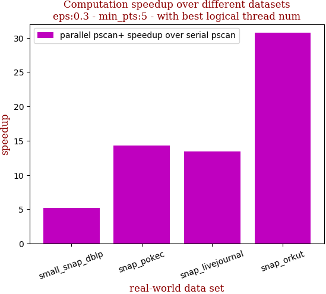

```zsh
best performance thread_num_lst:[8, 40, 24, 40]
```

dataset | edge num | pscan runtime | pscan+ 40 logical-core full speedup | pscan+ best thread_num speedup | thread_num choice
--- | --- | --- | --- | --- | ---
small_snap_dblp | 2,099,732 | 0.555s | 4.744 | 5.187 | 8
snap_pokec | 30,282,866 | 8.597s | 14.257 | 14.257 | 40
snap_livejournal | 69,362,378 | 21.846s | 9.376 | 13.419 | 24
snap_orkut | 234,370,166 | 164.248s | 30.787 | 30.787 | 40

## eps:0.4

with 40 full logical threads | with best thread num
--- | ---
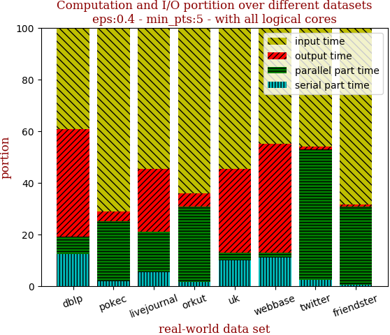 | 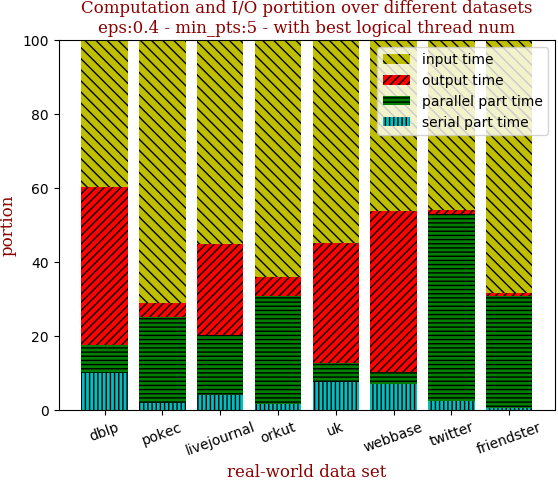

with 40 full logical threads | with best thread num
--- | ---
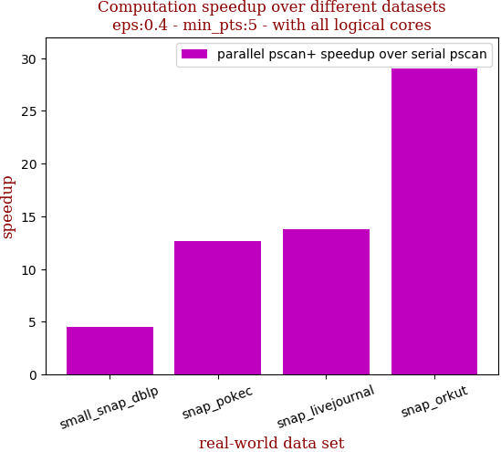 | 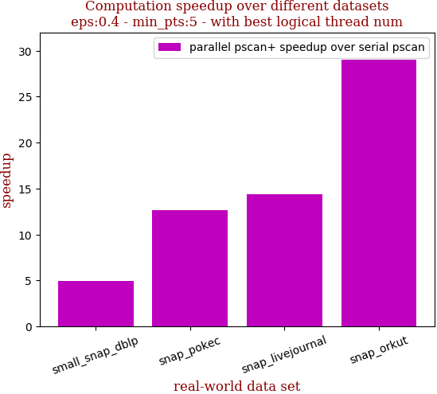

```zsh
best performance thread_num_lst:[16, 40, 32, 40]
```

dataset | edge num | pscan runtime | pscan+ 40 logical-core full speedup | pscan+ best thread_num speedup | thread_num choice
--- | --- | --- | --- | --- | ---
small_snap_dblp | 2,099,732 | 0.491s | 4.505 | 4.960 | 16
snap_pokec | 30,282,866 | 6.82s | 12.653 | 12.653 | 40
snap_livejournal | 69,362,378 | 18.37s | 13.791 | 14.385 | 32
snap_orkut | 234,370,166 | 135.772s | 29.036 | 29.036 | 40

## eps:0.5

with 40 full logical threads | with best thread num
--- | ---
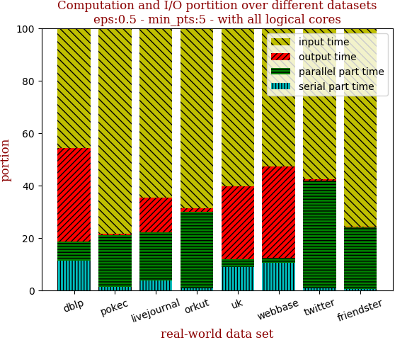 | 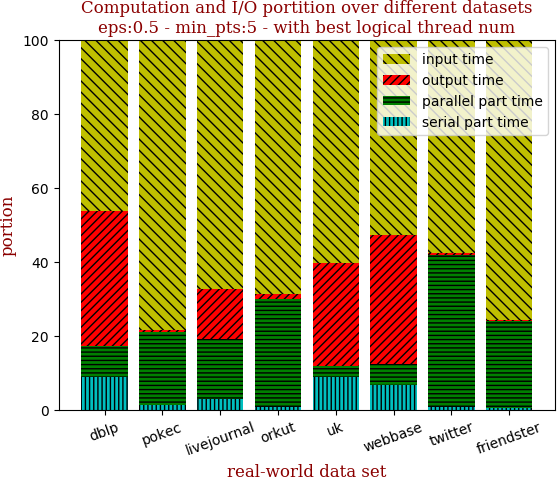

with 40 full logical threads | with best thread num
--- | ---
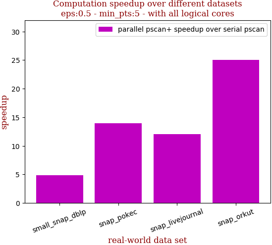 | 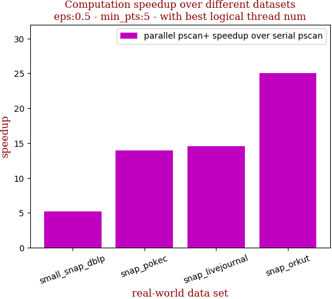

```zsh
best performance thread_num_lst:[16, 40, 32, 40]
```

dataset | edge num | pscan runtime | pscan+ 40 logical-core full speedup | pscan+ best thread_num speedup | thread_num choice
--- | --- | --- | --- | --- | ---
small_snap_dblp | 2,099,732 | 0.441s | 4.900 | 5.250 | 16
snap_pokec | 30,282,866 | 5.709s | 13.958 | 13.958 | 40
snap_livejournal | 69,362,378 | 14.317s | 12.072 | 14.579 | 32
snap_orkut | 234,370,166 | 105.36s | 24.996 | 24.996 | 40

## eps:0.6

with 40 full logical threads | with best thread num
--- | ---
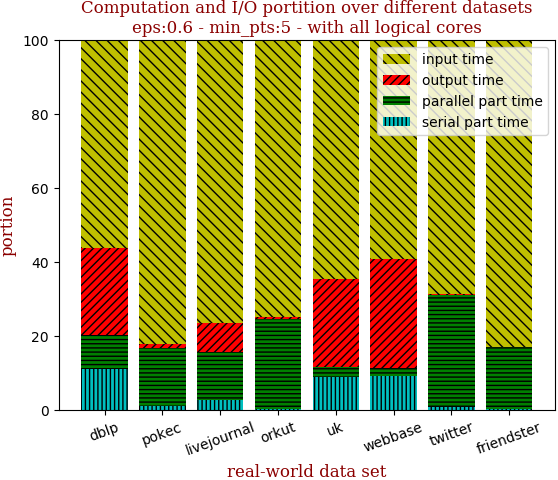 | 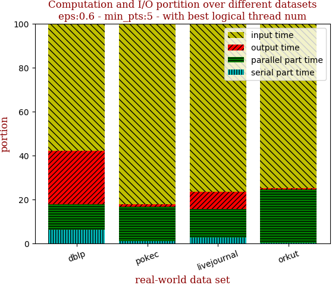

with 40 full logical threads | with best thread num
--- | ---
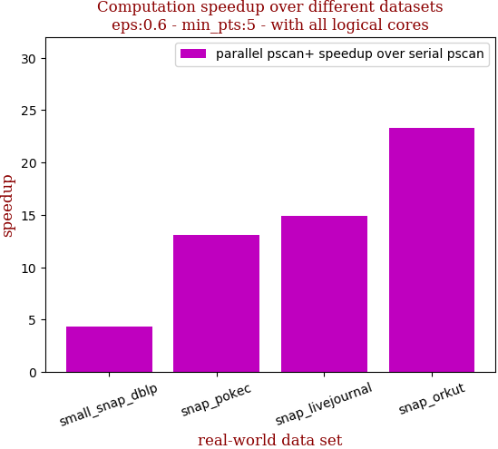 | 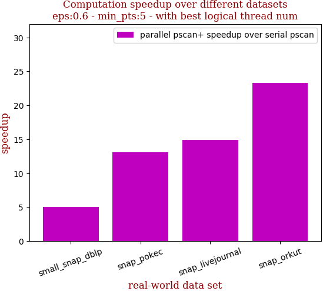

```zsh
best performance thread_num_lst:[8, 40, 40, 40]
```

dataset | edge num | pscan runtime | pscan+ 40 logical-core full speedup | pscan+ best thread_num speedup | thread_num choice
--- | --- | --- | --- | --- | ---
small_snap_dblp | 2,099,732 | 0.346s | 4.325 | 5.014 | 8
snap_pokec | 30,282,866 | 4.122s | 13.127 | 13.127 | 40
snap_livejournal | 69,362,378 | 10.49s | 14.901 | 14.901 | 40
snap_orkut | 234,370,166 | 73.887s | 23.286 | 23.286 | 40

## eps:0.7

with 40 full logical threads | with best thread num
--- | ---
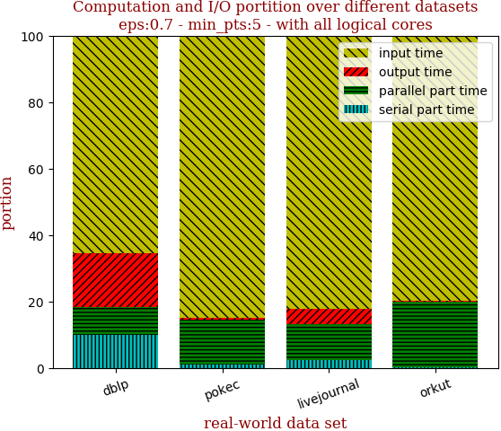 | 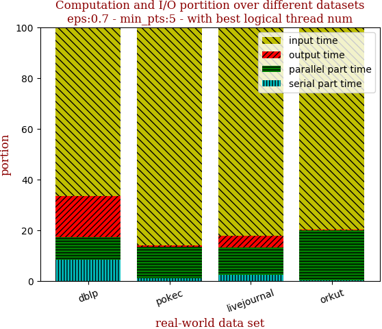

with 40 full logical threads | with best thread num
--- | ---
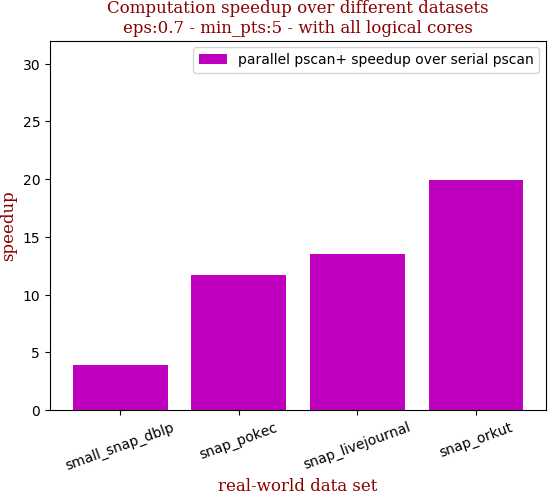 | 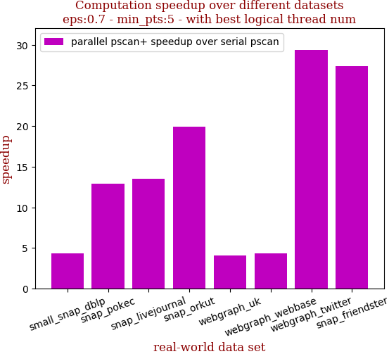

```zsh
best performance thread_num_lst:[16, 32, 40, 40]
```

dataset | edge num | pscan runtime | pscan+ 40 logical-core full speedup | pscan+ best thread_num speedup | thread_num choice
--- | --- | --- | --- | --- | ---
small_snap_dblp | 2,099,732 | 0.245s | 3.889 | 4.298 | 16
snap_pokec | 30,282,866 | 3.098s | 11.735 | 12.908 | 32
snap_livejournal | 69,362,378 | 7.404s | 13.486 | 13.486 | 40
snap_orkut | 234,370,166 | 48.46s | 19.885 | 19.885 | 40

## eps:0.8

with 40 full logical threads | with best thread num
--- | ---
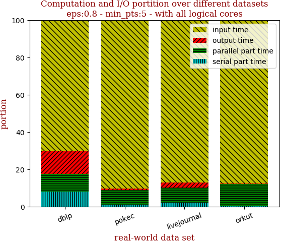 | 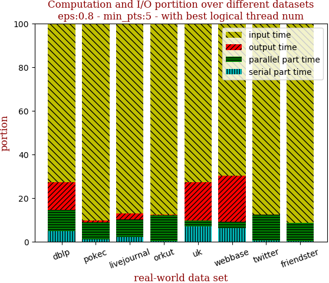

with 40 full logical threads | with best thread num
--- | ---
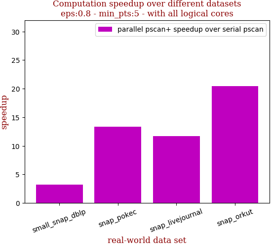 | 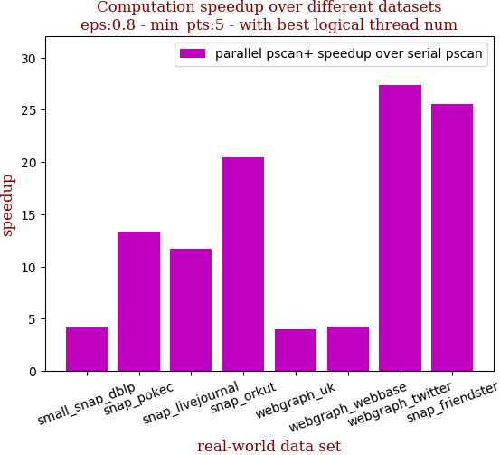

```zsh
best performance thread_num_lst:[8, 40, 40, 40]
```

dataset | edge num | pscan runtime | pscan+ 40 logical-core full speedup | pscan+ best thread_num speedup | thread_num choice
--- | --- | --- | --- | --- | ---
small_snap_dblp | 2,099,732 | 0.183s | 3.211 | 4.159 | 8
snap_pokec | 30,282,866 | 2.009s | 13.305 | 13.305 | 40
snap_livejournal | 69,362,378 | 4.797s | 11.700 | 11.700 | 40
snap_orkut | 234,370,166 | 27.708s | 20.449 | 20.449 | 40

## eps:0.9

with 40 full logical threads | with best thread num
--- | ---
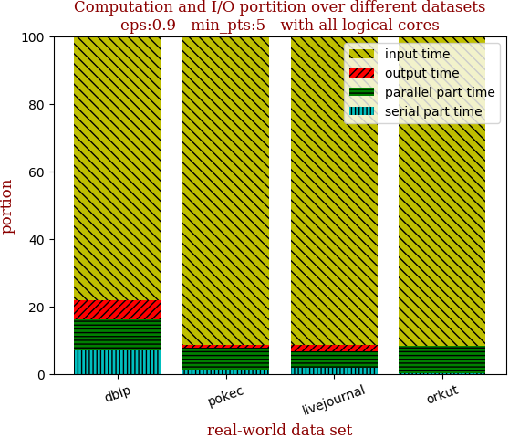 | 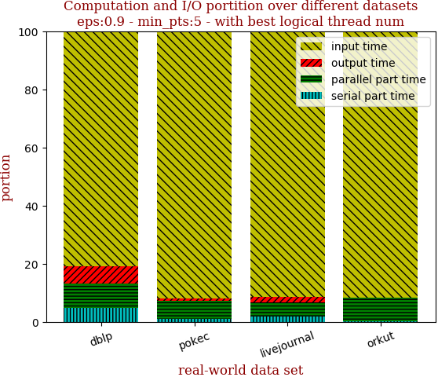

with 40 full logical threads | with best thread num
--- | ---
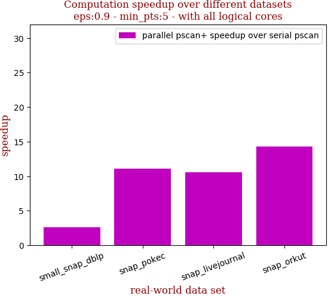 | 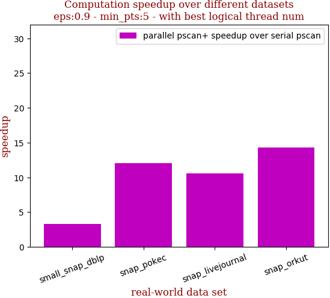

```zsh
best performance thread_num_lst:[16, 32, 40, 40]
```

dataset | edge num | pscan runtime | pscan+ 40 logical-core full speedup | pscan+ best thread_num speedup | thread_num choice
--- | --- | --- | --- | --- | ---
small_snap_dblp | 2,099,732 | 0.121s | 2.574 | 3.270 | 16
snap_pokec | 30,282,866 | 1.453s | 11.092 | 12.008 | 32
snap_livejournal | 69,362,378 | 2.753s | 10.548 | 10.548 | 40
snap_orkut | 234,370,166 | 12.535s | 14.293 | 14.293 | 40

