## eps:0.1

overview | speedup
--- | ---
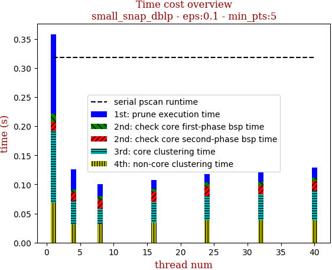 | 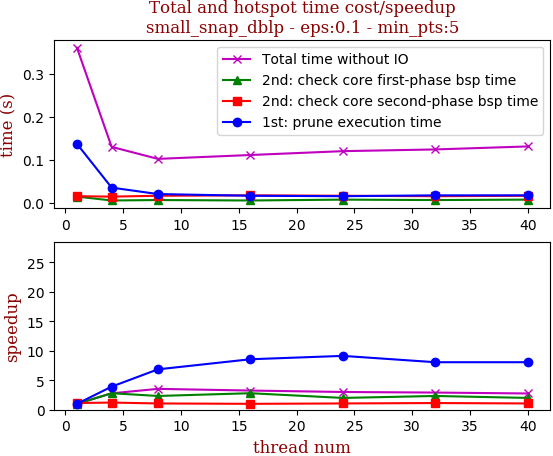

thread_num | prune | check-core 1st bsp | check-core 2nd bsp | cluster-core | cluster-non-core | total | total speedup
--- | --- | --- | --- | --- | --- | --- | ---
1 | 0.137s | 0.014s | 0.015s | 0.123s | 0.069s | 0.361s | 1.000
4 | 0.035s | 0.005s | 0.014s | 0.041s | 0.031s | 0.13s | 2.777
8 | 0.02s | 0.006s | 0.016s | 0.026s | 0.032s | 0.102s | 3.539
16 | 0.016s | 0.005s | 0.017s | 0.036s | 0.034s | 0.111s | 3.252
24 | 0.015s | 0.007s | 0.016s | 0.042s | 0.038s | 0.12s | 3.008
32 | 0.017s | 0.006s | 0.015s | 0.045s | 0.038s | 0.124s | 2.911
40 | 0.017s | 0.007s | 0.016s | 0.051s | 0.038s | 0.131s | 2.756

## eps:0.2

overview | speedup
--- | ---
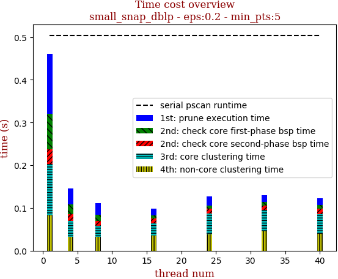 | 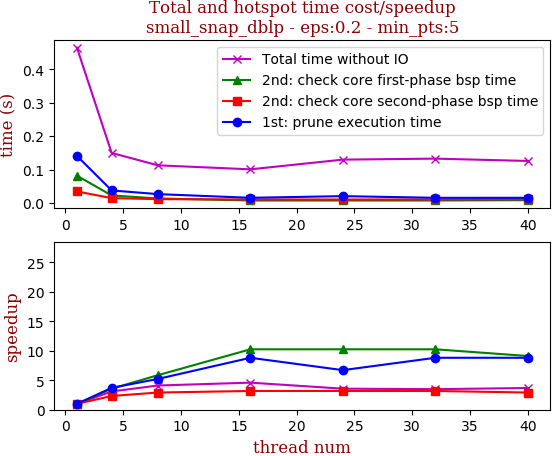

thread_num | prune | check-core 1st bsp | check-core 2nd bsp | cluster-core | cluster-non-core | total | total speedup
--- | --- | --- | --- | --- | --- | --- | ---
1 | 0.141s | 0.082s | 0.035s | 0.121s | 0.082s | 0.464s | 1.000
4 | 0.038s | 0.023s | 0.015s | 0.037s | 0.033s | 0.15s | 3.093
8 | 0.027s | 0.014s | 0.012s | 0.026s | 0.032s | 0.113s | 4.106
16 | 0.016s | 0.008s | 0.011s | 0.029s | 0.035s | 0.101s | 4.594
24 | 0.021s | 0.008s | 0.011s | 0.049s | 0.038s | 0.13s | 3.569
32 | 0.016s | 0.008s | 0.011s | 0.05s | 0.045s | 0.133s | 3.489
40 | 0.016s | 0.009s | 0.012s | 0.047s | 0.039s | 0.126s | 3.683

## eps:0.3

overview | speedup
--- | ---
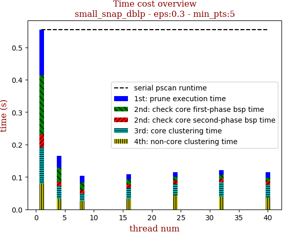 | 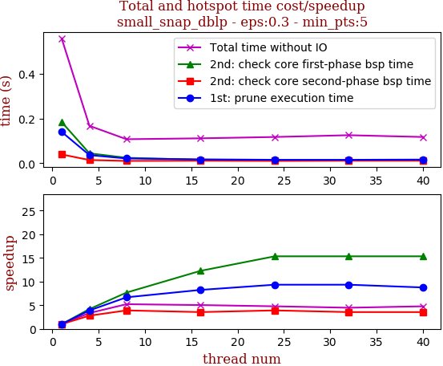

thread_num | prune | check-core 1st bsp | check-core 2nd bsp | cluster-core | cluster-non-core | total | total speedup
--- | --- | --- | --- | --- | --- | --- | ---
1 | 0.14s | 0.184s | 0.039s | 0.112s | 0.08s | 0.558s | 1.000
4 | 0.036s | 0.044s | 0.014s | 0.038s | 0.033s | 0.167s | 3.341
8 | 0.021s | 0.024s | 0.01s | 0.022s | 0.027s | 0.107s | 5.215
16 | 0.017s | 0.015s | 0.011s | 0.033s | 0.033s | 0.111s | 5.027
24 | 0.015s | 0.012s | 0.01s | 0.035s | 0.043s | 0.117s | 4.769
32 | 0.015s | 0.012s | 0.011s | 0.044s | 0.039s | 0.125s | 4.464
40 | 0.016s | 0.012s | 0.011s | 0.039s | 0.036s | 0.117s | 4.769

## eps:0.4

overview | speedup
--- | ---
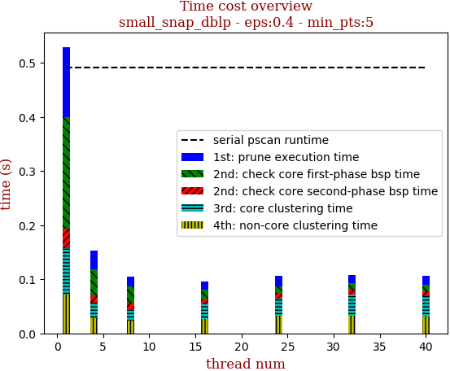 | 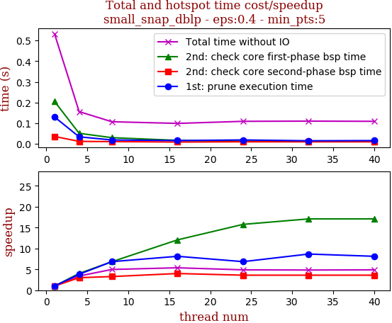

thread_num | prune | check-core 1st bsp | check-core 2nd bsp | cluster-core | cluster-non-core | total | total speedup
--- | --- | --- | --- | --- | --- | --- | ---
1 | 0.13s | 0.205s | 0.036s | 0.087s | 0.071s | 0.532s | 1.000
4 | 0.034s | 0.051s | 0.012s | 0.028s | 0.028s | 0.156s | 3.410
8 | 0.019s | 0.03s | 0.011s | 0.021s | 0.024s | 0.107s | 4.972
16 | 0.016s | 0.017s | 0.009s | 0.027s | 0.027s | 0.099s | 5.374
24 | 0.019s | 0.013s | 0.01s | 0.032s | 0.032s | 0.109s | 4.881
32 | 0.015s | 0.012s | 0.01s | 0.038s | 0.033s | 0.11s | 4.836
40 | 0.016s | 0.012s | 0.01s | 0.037s | 0.031s | 0.109s | 4.881

## eps:0.5

overview | speedup
--- | ---
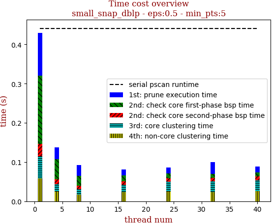 | 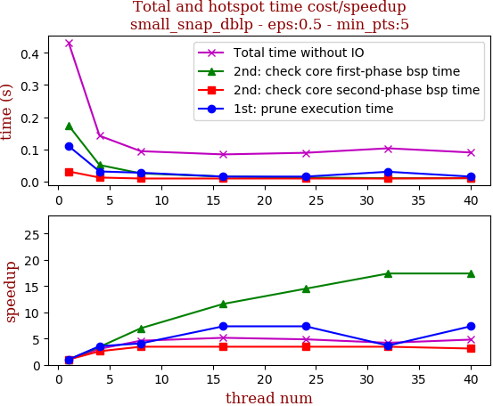

thread_num | prune | check-core 1st bsp | check-core 2nd bsp | cluster-core | cluster-non-core | total | total speedup
--- | --- | --- | --- | --- | --- | --- | ---
1 | 0.11s | 0.174s | 0.031s | 0.057s | 0.058s | 0.432s | 1.000
4 | 0.031s | 0.051s | 0.012s | 0.019s | 0.025s | 0.142s | 3.042
8 | 0.027s | 0.025s | 0.009s | 0.014s | 0.017s | 0.094s | 4.596
16 | 0.015s | 0.015s | 0.009s | 0.018s | 0.024s | 0.084s | 5.143
24 | 0.015s | 0.012s | 0.009s | 0.025s | 0.025s | 0.089s | 4.854
32 | 0.03s | 0.01s | 0.009s | 0.027s | 0.024s | 0.103s | 4.194
40 | 0.015s | 0.01s | 0.01s | 0.028s | 0.026s | 0.09s | 4.800

## eps:0.6

overview | speedup
--- | ---
 | 

thread_num | prune | check-core 1st bsp | check-core 2nd bsp | cluster-core | cluster-non-core | total | total speedup
--- | --- | --- | --- | --- | --- | --- | ---
1 | 0.103s | 0.129s | 0.026s | 0.036s | 0.038s | 0.335s | 1.000
4 | 0.032s | 0.035s | 0.009s | 0.013s | 0.016s | 0.106s | 3.160
8 | 0.016s | 0.019s | 0.009s | 0.009s | 0.014s | 0.069s | 4.855
16 | 0.013s | 0.012s | 0.009s | 0.017s | 0.019s | 0.072s | 4.653
24 | 0.016s | 0.009s | 0.009s | 0.021s | 0.019s | 0.077s | 4.351
32 | 0.014s | 0.009s | 0.009s | 0.018s | 0.019s | 0.072s | 4.653
40 | 0.017s | 0.009s | 0.009s | 0.021s | 0.022s | 0.08s | 4.188

## eps:0.7

overview | speedup
--- | ---
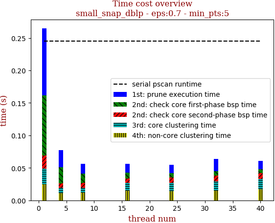 | 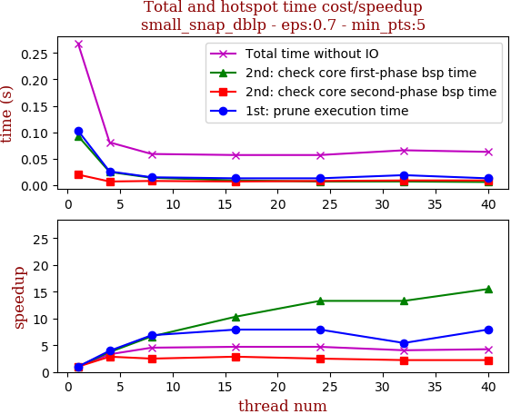

thread_num | prune | check-core 1st bsp | check-core 2nd bsp | cluster-core | cluster-non-core | total | total speedup
--- | --- | --- | --- | --- | --- | --- | ---
1 | 0.103s | 0.093s | 0.02s | 0.024s | 0.025s | 0.268s | 1.000
4 | 0.026s | 0.025s | 0.007s | 0.008s | 0.011s | 0.081s | 3.309
8 | 0.015s | 0.014s | 0.008s | 0.007s | 0.012s | 0.059s | 4.542
16 | 0.013s | 0.009s | 0.007s | 0.012s | 0.015s | 0.057s | 4.702
24 | 0.013s | 0.007s | 0.008s | 0.013s | 0.014s | 0.057s | 4.702
32 | 0.019s | 0.007s | 0.009s | 0.014s | 0.015s | 0.066s | 4.061
40 | 0.013s | 0.006s | 0.009s | 0.016s | 0.017s | 0.063s | 4.254

## eps:0.8

overview | speedup
--- | ---
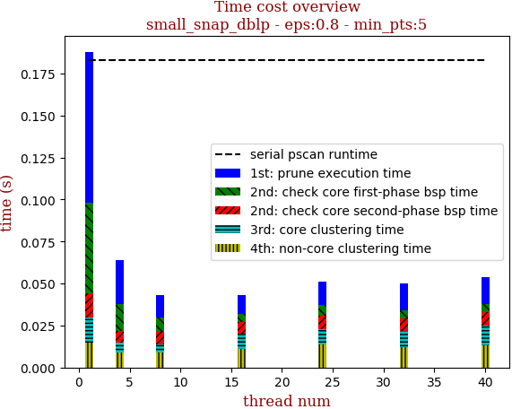 | 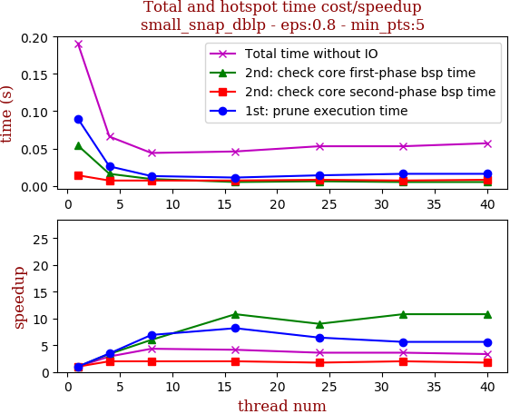

thread_num | prune | check-core 1st bsp | check-core 2nd bsp | cluster-core | cluster-non-core | total | total speedup
--- | --- | --- | --- | --- | --- | --- | ---
1 | 0.09s | 0.054s | 0.014s | 0.015s | 0.015s | 0.191s | 1.000
4 | 0.026s | 0.016s | 0.007s | 0.006s | 0.009s | 0.066s | 2.894
8 | 0.013s | 0.009s | 0.007s | 0.005s | 0.009s | 0.044s | 4.341
16 | 0.011s | 0.005s | 0.007s | 0.009s | 0.011s | 0.046s | 4.152
24 | 0.014s | 0.006s | 0.008s | 0.009s | 0.014s | 0.053s | 3.604
32 | 0.016s | 0.005s | 0.007s | 0.01s | 0.012s | 0.053s | 3.604
40 | 0.016s | 0.005s | 0.008s | 0.012s | 0.013s | 0.057s | 3.351

## eps:0.9

overview | speedup
--- | ---
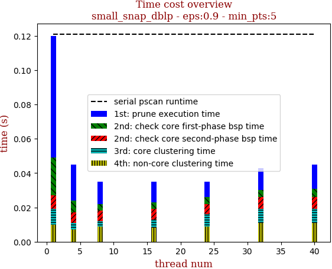 | 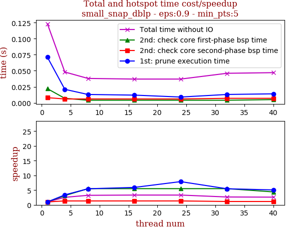

thread_num | prune | check-core 1st bsp | check-core 2nd bsp | cluster-core | cluster-non-core | total | total speedup
--- | --- | --- | --- | --- | --- | --- | ---
1 | 0.071s | 0.022s | 0.008s | 0.009s | 0.01s | 0.123s | 1.000
4 | 0.021s | 0.007s | 0.006s | 0.004s | 0.007s | 0.048s | 2.562
8 | 0.013s | 0.004s | 0.006s | 0.003s | 0.009s | 0.038s | 3.237
16 | 0.012s | 0.004s | 0.006s | 0.005s | 0.008s | 0.037s | 3.324
24 | 0.009s | 0.004s | 0.006s | 0.007s | 0.009s | 0.037s | 3.324
32 | 0.013s | 0.004s | 0.007s | 0.008s | 0.011s | 0.046s | 2.674
40 | 0.014s | 0.005s | 0.007s | 0.008s | 0.011s | 0.047s | 2.617

