## eps:0.1

overview | speedup
--- | ---
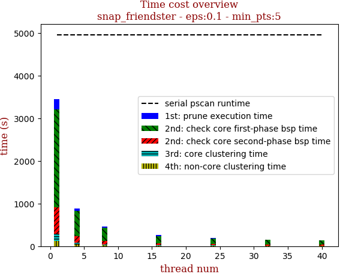 | 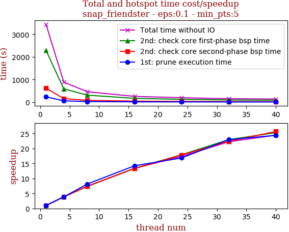

thread_num | prune | check-core 1st bsp | check-core 2nd bsp | cluster-core | cluster-non-core | total | total speedup
--- | --- | --- | --- | --- | --- | --- | ---
1 | 236.467s | 2291.115s | 620.83s | 175.586s | 119.714s | 3443.715s | 1.000
4 | 61.624s | 592.539s | 160.68s | 41.231s | 32.457s | 888.533s | 3.876
8 | 28.99s | 312.358s | 83.751s | 21.283s | 18.56s | 464.946s | 7.407
16 | 16.624s | 171.104s | 46.578s | 12.104s | 11.34s | 257.757s | 13.360
24 | 14.037s | 127.885s | 34.812s | 11.717s | 9.818s | 198.271s | 17.369
32 | 10.304s | 99.901s | 27.747s | 8.627s | 8.227s | 154.816s | 22.244
40 | 9.698s | 90.572s | 24.19s | 8.331s | 8.13s | 140.932s | 24.435

## eps:0.2

overview | speedup
--- | ---
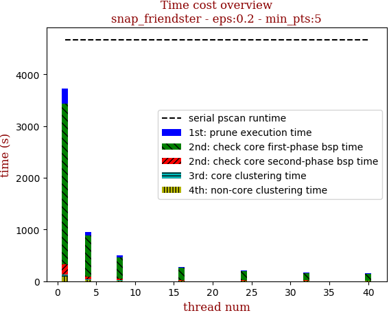 | 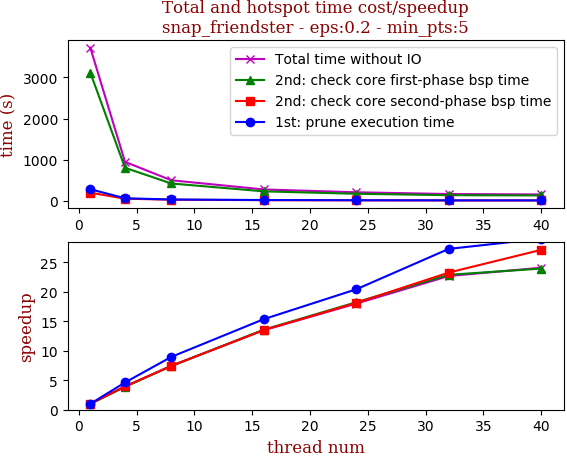

thread_num | prune | check-core 1st bsp | check-core 2nd bsp | cluster-core | cluster-non-core | total | total speedup
--- | --- | --- | --- | --- | --- | --- | ---
1 | 280.825s | 3115.755s | 197.916s | 35.799s | 90.714s | 3721.014s | 1.000
4 | 60.786s | 802.43s | 50.097s | 9.574s | 24.17s | 947.06s | 3.929
8 | 31.35s | 421.013s | 26.697s | 5.671s | 14.12s | 498.862s | 7.459
16 | 18.28s | 229.498s | 14.651s | 3.539s | 9.757s | 275.737s | 13.495
24 | 13.747s | 170.875s | 10.925s | 3.071s | 8.068s | 206.698s | 18.002
32 | 10.293s | 136.137s | 8.507s | 2.033s | 7.083s | 164.056s | 22.681
40 | 9.68s | 130.127s | 7.297s | 1.818s | 5.536s | 154.464s | 24.090

## eps:0.3

overview | speedup
--- | ---
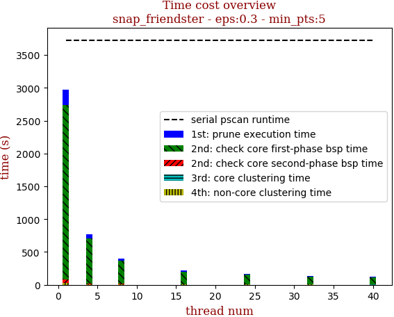 | 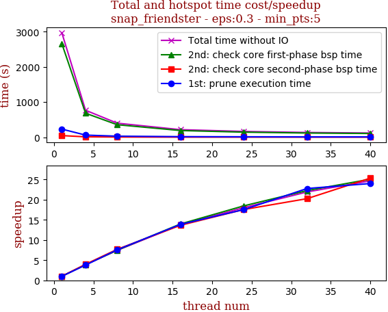

thread_num | prune | check-core 1st bsp | check-core 2nd bsp | cluster-core | cluster-non-core | total | total speedup
--- | --- | --- | --- | --- | --- | --- | ---
1 | 231.63s | 2662.206s | 46.966s | 5.801s | 24.284s | 2970.901s | 1.000
4 | 61.182s | 682.857s | 11.815s | 2.443s | 8.542s | 766.849s | 3.874
8 | 30.56s | 356.186s | 6.103s | 1.525s | 5.473s | 399.859s | 7.430
16 | 16.697s | 190.464s | 3.441s | 0.643s | 4.273s | 215.527s | 13.784
24 | 13.206s | 144.171s | 2.675s | 0.76s | 4.064s | 164.887s | 18.018
32 | 10.173s | 119.603s | 2.319s | 0.63s | 2.853s | 135.589s | 21.911
40 | 9.649s | 106.172s | 1.853s | 0.422s | 2.257s | 120.358s | 24.684

## eps:0.4

overview | speedup
--- | ---
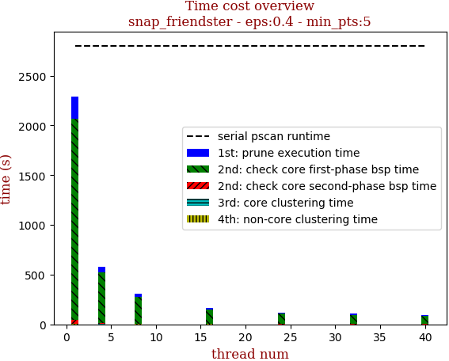 | 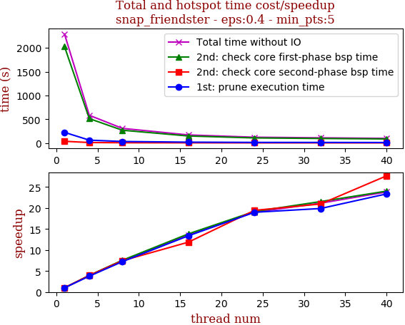

thread_num | prune | check-core 1st bsp | check-core 2nd bsp | cluster-core | cluster-non-core | total | total speedup
--- | --- | --- | --- | --- | --- | --- | ---
1 | 223.0s | 2025.989s | 34.905s | 1.035s | 5.845s | 2290.781s | 1.000
4 | 59.117s | 511.998s | 8.855s | 0.54s | 1.708s | 582.222s | 3.935
8 | 30.864s | 268.074s | 4.689s | 0.409s | 2.797s | 306.836s | 7.466
16 | 16.662s | 146.318s | 2.941s | 0.355s | 2.493s | 168.773s | 13.573
24 | 11.751s | 105.698s | 1.796s | 0.35s | 1.067s | 120.666s | 18.984
32 | 11.22s | 94.125s | 1.666s | 0.234s | 1.072s | 108.319s | 21.148
40 | 9.548s | 84.338s | 1.262s | 0.209s | 0.848s | 96.209s | 23.810

## eps:0.5

overview | speedup
--- | ---
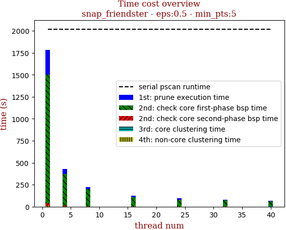 | 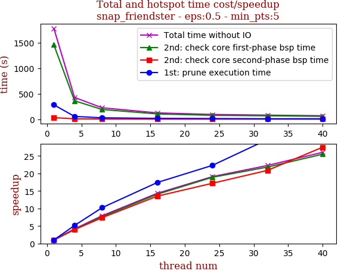

thread_num | prune | check-core 1st bsp | check-core 2nd bsp | cluster-core | cluster-non-core | total | total speedup
--- | --- | --- | --- | --- | --- | --- | ---
1 | 282.574s | 1459.446s | 31.347s | 0.475s | 7.963s | 1781.808s | 1.000
4 | 54.865s | 362.28s | 7.905s | 0.331s | 1.836s | 427.219s | 4.171
8 | 27.629s | 190.807s | 4.251s | 0.304s | 1.66s | 224.654s | 7.931
16 | 16.232s | 103.813s | 2.319s | 0.308s | 1.692s | 124.367s | 14.327
24 | 12.673s | 77.186s | 1.823s | 0.127s | 1.519s | 93.33s | 19.091
32 | 9.519s | 66.907s | 1.501s | 0.14s | 1.911s | 79.982s | 22.278
40 | 8.715s | 57.236s | 1.14s | 0.141s | 1.195s | 68.429s | 26.039

## eps:0.6

overview | speedup
--- | ---
 | 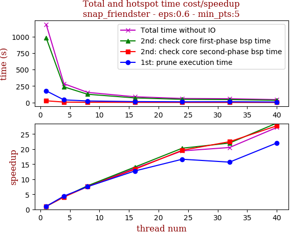

thread_num | prune | check-core 1st bsp | check-core 2nd bsp | cluster-core | cluster-non-core | total | total speedup
--- | --- | --- | --- | --- | --- | --- | ---
1 | 176.941s | 981.201s | 26.21s | 0.333s | 1.62s | 1186.31s | 1.000
4 | 40.075s | 237.839s | 6.396s | 0.297s | 0.664s | 285.274s | 4.158
8 | 23.474s | 125.211s | 3.472s | 0.29s | 1.202s | 153.652s | 7.721
16 | 13.871s | 69.855s | 1.968s | 0.114s | 1.449s | 87.26s | 13.595
24 | 10.633s | 48.331s | 1.336s | 0.172s | 0.613s | 61.088s | 19.420
32 | 11.286s | 44.576s | 1.167s | 0.285s | 0.46s | 57.777s | 20.533
40 | 8.026s | 34.249s | 0.945s | 0.12s | 0.291s | 43.634s | 27.188

## eps:0.7

overview | speedup
--- | ---
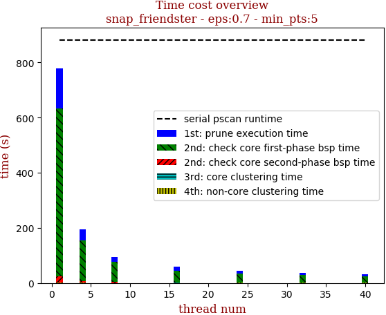 | 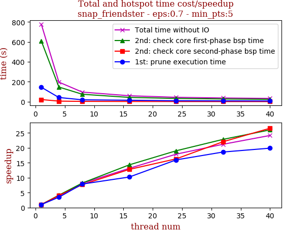

thread_num | prune | check-core 1st bsp | check-core 2nd bsp | cluster-core | cluster-non-core | total | total speedup
--- | --- | --- | --- | --- | --- | --- | ---
1 | 144.607s | 609.063s | 21.057s | 0.292s | 2.439s | 777.461s | 1.000
4 | 41.608s | 146.616s | 5.216s | 0.277s | 2.155s | 195.876s | 3.969
8 | 18.365s | 74.081s | 2.742s | 0.137s | 0.289s | 95.616s | 8.131
16 | 14.145s | 42.589s | 1.648s | 0.279s | 0.533s | 59.196s | 13.134
24 | 9.057s | 32.028s | 1.291s | 0.286s | 0.803s | 43.468s | 17.886
32 | 7.775s | 26.674s | 0.955s | 0.273s | 0.996s | 36.676s | 21.198
40 | 7.27s | 23.42s | 0.793s | 0.112s | 0.608s | 32.207s | 24.140

## eps:0.8

overview | speedup
--- | ---
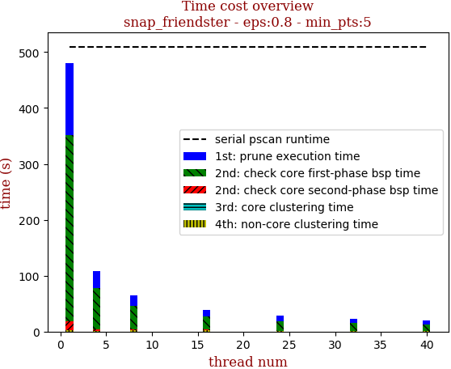 | 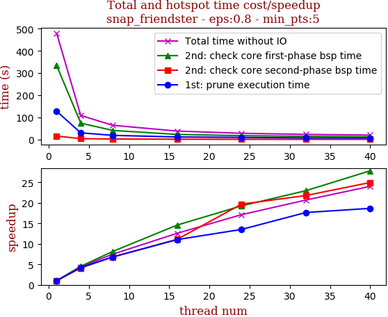

thread_num | prune | check-core 1st bsp | check-core 2nd bsp | cluster-core | cluster-non-core | total | total speedup
--- | --- | --- | --- | --- | --- | --- | ---
1 | 127.683s | 334.168s | 15.733s | 0.28s | 1.922s | 479.789s | 1.000
4 | 30.042s | 73.865s | 3.837s | 0.268s | 0.513s | 108.528s | 4.421
8 | 18.752s | 40.94s | 2.309s | 0.275s | 1.785s | 64.064s | 7.489
16 | 11.565s | 22.905s | 1.416s | 0.27s | 1.962s | 38.121s | 12.586
24 | 9.444s | 17.34s | 0.799s | 0.115s | 0.323s | 28.023s | 17.121
32 | 7.235s | 14.547s | 0.722s | 0.173s | 0.508s | 23.188s | 20.691
40 | 6.842s | 12.008s | 0.63s | 0.113s | 0.371s | 19.967s | 24.029

## eps:0.9

overview | speedup
--- | ---
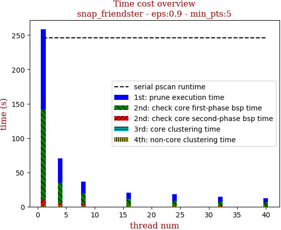 | 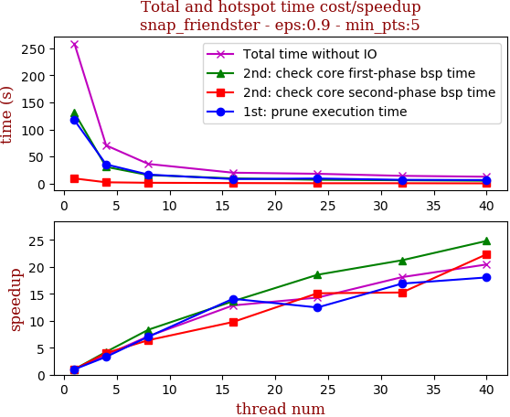

thread_num | prune | check-core 1st bsp | check-core 2nd bsp | cluster-core | cluster-non-core | total | total speedup
--- | --- | --- | --- | --- | --- | --- | ---
1 | 117.062s | 130.707s | 9.469s | 0.272s | 1.084s | 258.596s | 1.000
4 | 35.414s | 30.843s | 2.352s | 0.271s | 1.7s | 70.583s | 3.664
8 | 16.608s | 15.665s | 1.479s | 0.152s | 2.33s | 36.237s | 7.136
16 | 8.316s | 9.597s | 0.969s | 0.281s | 0.961s | 20.127s | 12.848
24 | 9.387s | 7.051s | 0.627s | 0.108s | 0.912s | 18.087s | 14.297
32 | 6.928s | 6.158s | 0.621s | 0.154s | 0.429s | 14.292s | 18.094
40 | 6.489s | 5.268s | 0.424s | 0.124s | 0.342s | 12.649s | 20.444

