## eps:0.1

overview | speedup
--- | ---
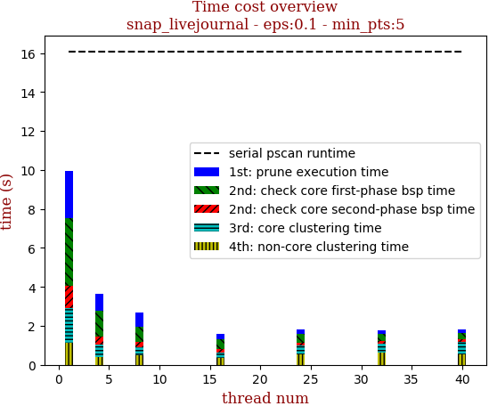 | 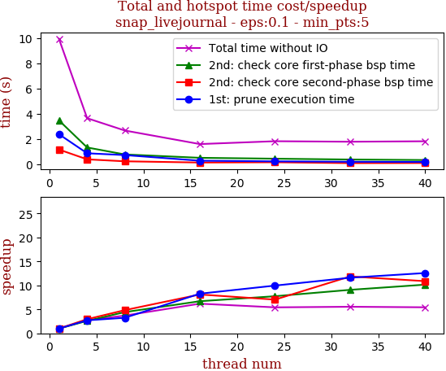

thread_num | prune | check-core 1st bsp | check-core 2nd bsp | cluster-core | cluster-non-core | total | total speedup
--- | --- | --- | --- | --- | --- | --- | ---
1 | 2.39s | 3.484s | 1.175s | 1.764s | 1.128s | 9.947s | 1.000
4 | 0.879s | 1.339s | 0.398s | 0.655s | 0.381s | 3.659s | 2.719
8 | 0.737s | 0.787s | 0.243s | 0.424s | 0.486s | 2.684s | 3.706
16 | 0.289s | 0.52s | 0.145s | 0.291s | 0.355s | 1.608s | 6.186
24 | 0.24s | 0.45s | 0.167s | 0.429s | 0.544s | 1.835s | 5.421
32 | 0.206s | 0.384s | 0.099s | 0.469s | 0.633s | 1.794s | 5.545
40 | 0.19s | 0.343s | 0.108s | 0.659s | 0.527s | 1.831s | 5.433

## eps:0.2

overview | speedup
--- | ---
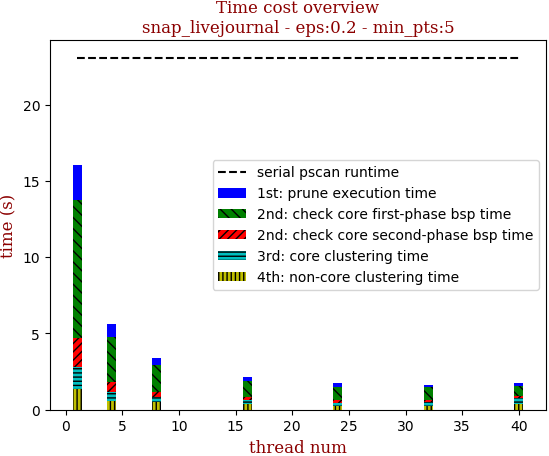 | 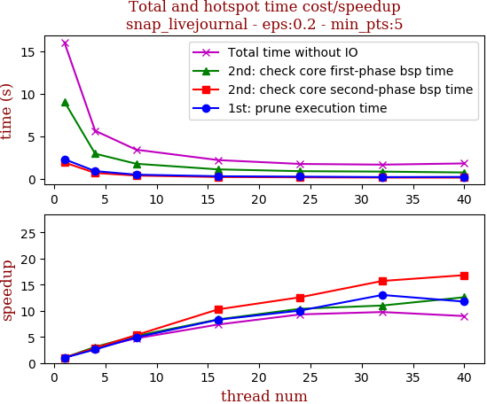

thread_num | prune | check-core 1st bsp | check-core 2nd bsp | cluster-core | cluster-non-core | total | total speedup
--- | --- | --- | --- | --- | --- | --- | ---
1 | 2.28s | 9.056s | 1.901s | 1.424s | 1.37s | 16.037s | 1.000
4 | 0.881s | 2.932s | 0.661s | 0.595s | 0.558s | 5.632s | 2.847
8 | 0.464s | 1.745s | 0.355s | 0.335s | 0.495s | 3.4s | 4.717
16 | 0.275s | 1.084s | 0.185s | 0.243s | 0.382s | 2.176s | 7.370
24 | 0.227s | 0.872s | 0.151s | 0.202s | 0.267s | 1.723s | 9.308
32 | 0.175s | 0.823s | 0.121s | 0.248s | 0.273s | 1.643s | 9.761
40 | 0.194s | 0.719s | 0.113s | 0.353s | 0.401s | 1.784s | 8.989

## eps:0.3

overview | speedup
--- | ---
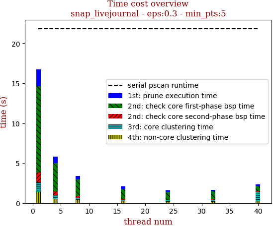 | 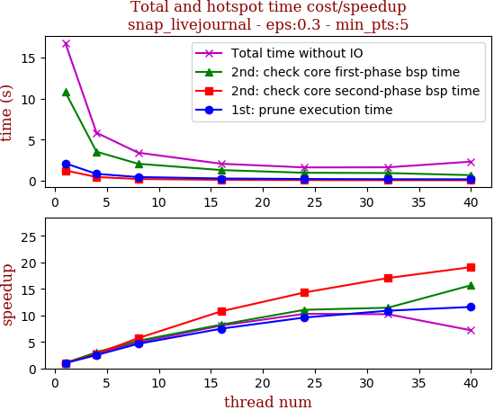

thread_num | prune | check-core 1st bsp | check-core 2nd bsp | cluster-core | cluster-non-core | total | total speedup
--- | --- | --- | --- | --- | --- | --- | ---
1 | 2.122s | 10.791s | 1.261s | 1.159s | 1.426s | 16.763s | 1.000
4 | 0.842s | 3.54s | 0.459s | 0.447s | 0.549s | 5.842s | 2.869
8 | 0.458s | 2.07s | 0.221s | 0.243s | 0.423s | 3.421s | 4.900
16 | 0.283s | 1.306s | 0.117s | 0.163s | 0.201s | 2.073s | 8.086
24 | 0.221s | 0.976s | 0.088s | 0.156s | 0.186s | 1.628s | 10.297
32 | 0.195s | 0.943s | 0.074s | 0.249s | 0.177s | 1.64s | 10.221
40 | 0.183s | 0.688s | 0.066s | 1.135s | 0.255s | 2.33s | 7.194

## eps:0.4

overview | speedup
--- | ---
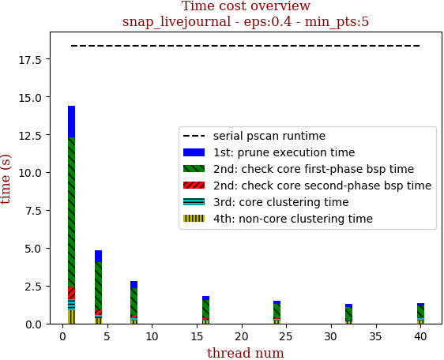 | 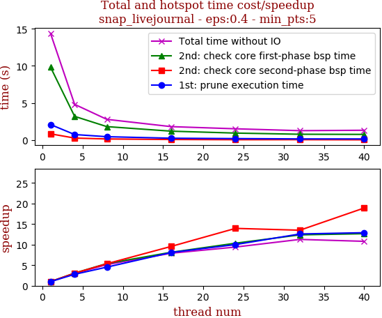

thread_num | prune | check-core 1st bsp | check-core 2nd bsp | cluster-core | cluster-non-core | total | total speedup
--- | --- | --- | --- | --- | --- | --- | ---
1 | 2.103s | 9.837s | 0.851s | 0.695s | 0.896s | 14.387s | 1.000
4 | 0.756s | 3.202s | 0.279s | 0.237s | 0.34s | 4.82s | 2.985
8 | 0.465s | 1.824s | 0.159s | 0.144s | 0.206s | 2.801s | 5.136
16 | 0.26s | 1.209s | 0.089s | 0.083s | 0.174s | 1.82s | 7.905
24 | 0.21s | 0.951s | 0.061s | 0.126s | 0.177s | 1.529s | 9.409
32 | 0.167s | 0.795s | 0.063s | 0.116s | 0.131s | 1.277s | 11.266
40 | 0.163s | 0.777s | 0.045s | 0.16s | 0.185s | 1.332s | 10.801

## eps:0.5

overview | speedup
--- | ---
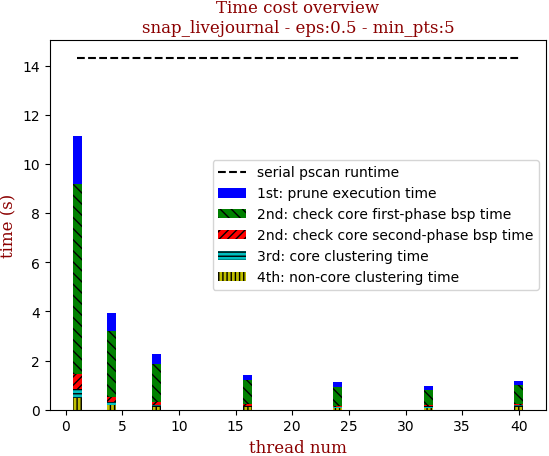 | 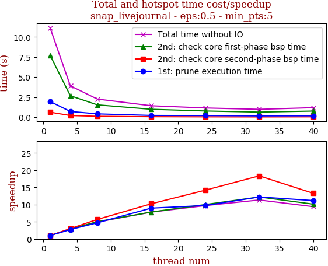

thread_num | prune | check-core 1st bsp | check-core 2nd bsp | cluster-core | cluster-non-core | total | total speedup
--- | --- | --- | --- | --- | --- | --- | ---
1 | 1.954s | 7.725s | 0.624s | 0.339s | 0.488s | 11.133s | 1.000
4 | 0.714s | 2.678s | 0.207s | 0.121s | 0.194s | 3.917s | 2.842
8 | 0.415s | 1.539s | 0.11s | 0.075s | 0.12s | 2.262s | 4.922
16 | 0.218s | 0.987s | 0.061s | 0.062s | 0.095s | 1.426s | 7.807
24 | 0.201s | 0.772s | 0.044s | 0.056s | 0.07s | 1.147s | 9.706
32 | 0.16s | 0.633s | 0.034s | 0.075s | 0.079s | 0.982s | 11.337
40 | 0.175s | 0.763s | 0.047s | 0.097s | 0.101s | 1.186s | 9.387

## eps:0.6

overview | speedup
--- | ---
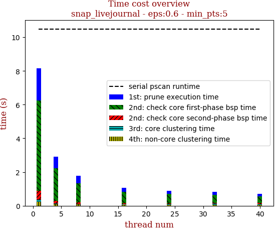 | 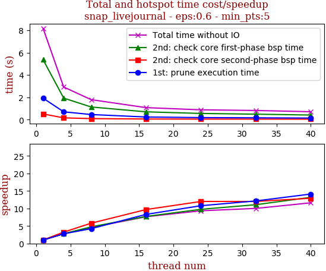

thread_num | prune | check-core 1st bsp | check-core 2nd bsp | cluster-core | cluster-non-core | total | total speedup
--- | --- | --- | --- | --- | --- | --- | ---
1 | 1.92s | 5.369s | 0.504s | 0.151s | 0.228s | 8.175s | 1.000
4 | 0.695s | 1.925s | 0.155s | 0.06s | 0.082s | 2.92s | 2.800
8 | 0.453s | 1.13s | 0.087s | 0.042s | 0.072s | 1.787s | 4.575
16 | 0.231s | 0.695s | 0.052s | 0.034s | 0.056s | 1.071s | 7.633
24 | 0.178s | 0.55s | 0.042s | 0.047s | 0.056s | 0.875s | 9.343
32 | 0.158s | 0.485s | 0.042s | 0.071s | 0.059s | 0.816s | 10.018
40 | 0.136s | 0.407s | 0.039s | 0.057s | 0.062s | 0.704s | 11.612

## eps:0.7

overview | speedup
--- | ---
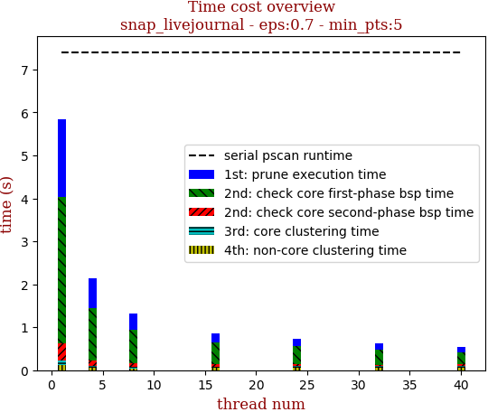 | 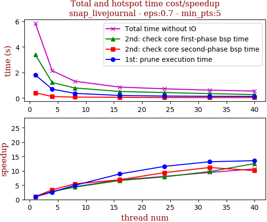

thread_num | prune | check-core 1st bsp | check-core 2nd bsp | cluster-core | cluster-non-core | total | total speedup
--- | --- | --- | --- | --- | --- | --- | ---
1 | 1.813s | 3.402s | 0.412s | 0.108s | 0.11s | 5.849s | 1.000
4 | 0.703s | 1.218s | 0.123s | 0.046s | 0.051s | 2.144s | 2.728
8 | 0.369s | 0.793s | 0.076s | 0.033s | 0.043s | 1.317s | 4.441
16 | 0.204s | 0.515s | 0.06s | 0.03s | 0.047s | 0.858s | 6.817
24 | 0.157s | 0.431s | 0.044s | 0.036s | 0.056s | 0.727s | 8.045
32 | 0.138s | 0.35s | 0.037s | 0.042s | 0.05s | 0.621s | 9.419
40 | 0.134s | 0.272s | 0.041s | 0.048s | 0.052s | 0.549s | 10.654

## eps:0.8

overview | speedup
--- | ---
 | 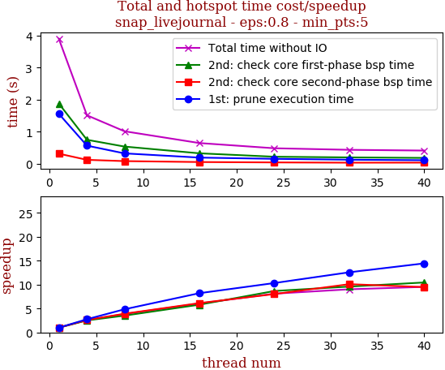

thread_num | prune | check-core 1st bsp | check-core 2nd bsp | cluster-core | cluster-non-core | total | total speedup
--- | --- | --- | --- | --- | --- | --- | ---
1 | 1.56s | 1.881s | 0.313s | 0.08s | 0.069s | 3.907s | 1.000
4 | 0.564s | 0.747s | 0.12s | 0.04s | 0.039s | 1.513s | 2.582
8 | 0.322s | 0.535s | 0.08s | 0.032s | 0.042s | 1.014s | 3.853
16 | 0.19s | 0.324s | 0.051s | 0.025s | 0.051s | 0.645s | 6.057
24 | 0.151s | 0.217s | 0.039s | 0.023s | 0.049s | 0.482s | 8.106
32 | 0.124s | 0.196s | 0.031s | 0.03s | 0.048s | 0.433s | 9.023
40 | 0.108s | 0.18s | 0.033s | 0.038s | 0.048s | 0.41s | 9.529

## eps:0.9

overview | speedup
--- | ---
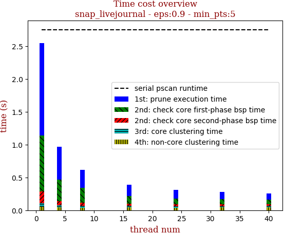 | 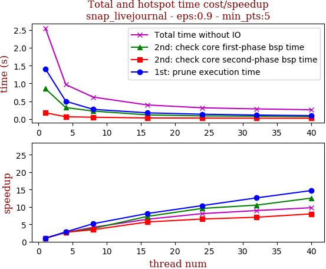

thread_num | prune | check-core 1st bsp | check-core 2nd bsp | cluster-core | cluster-non-core | total | total speedup
--- | --- | --- | --- | --- | --- | --- | ---
1 | 1.412s | 0.852s | 0.176s | 0.057s | 0.052s | 2.552s | 1.000
4 | 0.5s | 0.322s | 0.065s | 0.035s | 0.042s | 0.967s | 2.639
8 | 0.273s | 0.224s | 0.051s | 0.026s | 0.04s | 0.617s | 4.136
16 | 0.174s | 0.117s | 0.031s | 0.026s | 0.044s | 0.395s | 6.461
24 | 0.136s | 0.089s | 0.027s | 0.021s | 0.04s | 0.316s | 8.076
32 | 0.112s | 0.081s | 0.025s | 0.022s | 0.042s | 0.285s | 8.954
40 | 0.096s | 0.068s | 0.022s | 0.026s | 0.045s | 0.261s | 9.778

