## eps:0.1

overview | speedup
--- | ---
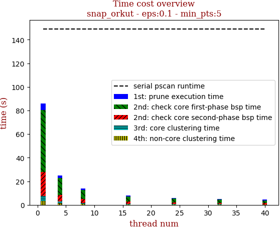 | 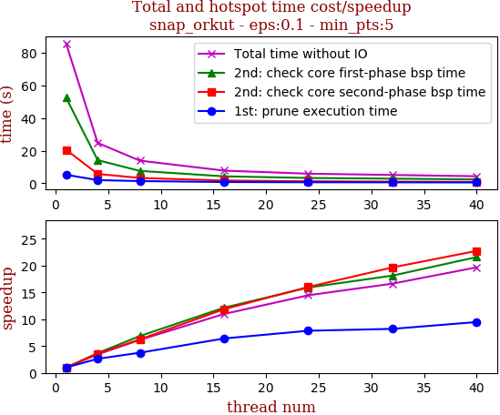

thread_num | prune | check-core 1st bsp | check-core 2nd bsp | cluster-core | cluster-non-core | total | total speedup
--- | --- | --- | --- | --- | --- | --- | ---
1 | 5.26s | 52.501s | 20.625s | 4.103s | 3.277s | 85.772s | 1.000
4 | 1.999s | 14.249s | 5.778s | 1.451s | 1.301s | 24.785s | 3.461
8 | 1.401s | 7.648s | 3.305s | 0.879s | 0.702s | 13.942s | 6.152
16 | 0.82s | 4.321s | 1.738s | 0.506s | 0.419s | 7.812s | 10.980
24 | 0.67s | 3.301s | 1.288s | 0.35s | 0.313s | 5.929s | 14.467
32 | 0.641s | 2.895s | 1.049s | 0.295s | 0.27s | 5.156s | 16.635
40 | 0.555s | 2.432s | 0.907s | 0.238s | 0.222s | 4.359s | 19.677

## eps:0.2

overview | speedup
--- | ---
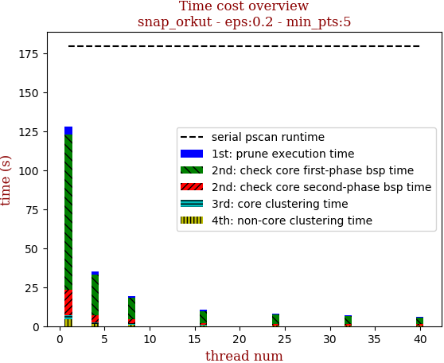 | 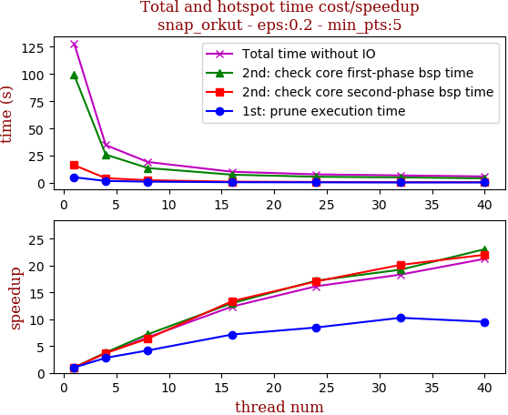

thread_num | prune | check-core 1st bsp | check-core 2nd bsp | cluster-core | cluster-non-core | total | total speedup
--- | --- | --- | --- | --- | --- | --- | ---
1 | 5.298s | 99.135s | 16.422s | 2.875s | 4.238s | 127.973s | 1.000
4 | 1.889s | 26.073s | 4.442s | 0.995s | 1.405s | 34.809s | 3.676
8 | 1.266s | 13.76s | 2.575s | 0.643s | 1.036s | 19.287s | 6.635
16 | 0.741s | 7.631s | 1.228s | 0.3s | 0.444s | 10.35s | 12.365
24 | 0.626s | 5.767s | 0.963s | 0.234s | 0.332s | 7.925s | 16.148
32 | 0.516s | 5.154s | 0.816s | 0.199s | 0.295s | 6.986s | 18.318
40 | 0.556s | 4.3s | 0.746s | 0.167s | 0.246s | 6.018s | 21.265

## eps:0.3

overview | speedup
--- | ---
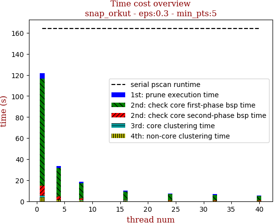 | 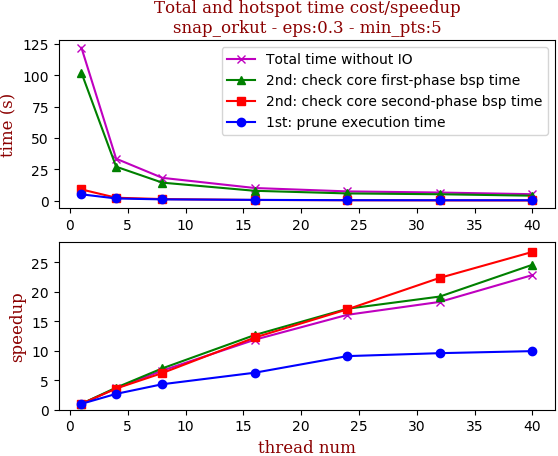

thread_num | prune | check-core 1st bsp | check-core 2nd bsp | cluster-core | cluster-non-core | total | total speedup
--- | --- | --- | --- | --- | --- | --- | ---
1 | 5.239s | 101.975s | 9.129s | 1.958s | 3.529s | 121.834s | 1.000
4 | 1.947s | 27.219s | 2.536s | 0.68s | 1.197s | 33.583s | 3.628
8 | 1.211s | 14.522s | 1.466s | 0.378s | 0.763s | 18.344s | 6.642
16 | 0.834s | 8.042s | 0.745s | 0.209s | 0.419s | 10.254s | 11.882
24 | 0.576s | 5.952s | 0.536s | 0.148s | 0.351s | 7.567s | 16.101
32 | 0.546s | 5.311s | 0.408s | 0.15s | 0.241s | 6.66s | 18.293
40 | 0.527s | 4.147s | 0.341s | 0.107s | 0.211s | 5.335s | 22.837

## eps:0.4

overview | speedup
--- | ---
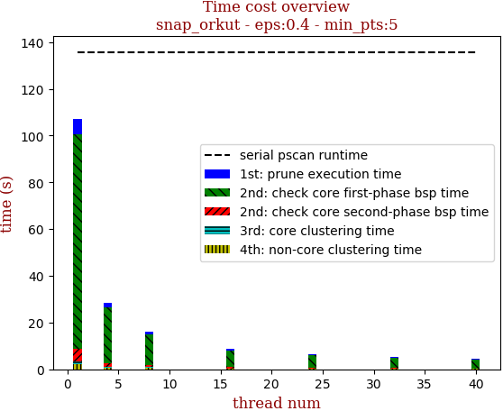 | 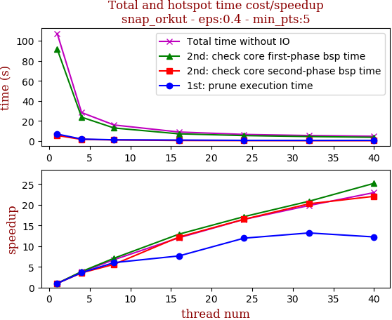

thread_num | prune | check-core 1st bsp | check-core 2nd bsp | cluster-core | cluster-non-core | total | total speedup
--- | --- | --- | --- | --- | --- | --- | ---
1 | 6.862s | 91.672s | 5.445s | 1.148s | 2.163s | 107.294s | 1.000
4 | 1.903s | 23.738s | 1.536s | 0.347s | 0.831s | 28.36s | 3.783
8 | 1.14s | 12.928s | 0.971s | 0.228s | 0.666s | 15.937s | 6.732
16 | 0.898s | 7.101s | 0.446s | 0.122s | 0.344s | 8.914s | 12.037
24 | 0.575s | 5.349s | 0.33s | 0.088s | 0.168s | 6.514s | 16.471
32 | 0.52s | 4.395s | 0.269s | 0.075s | 0.151s | 5.413s | 19.822
40 | 0.561s | 3.64s | 0.247s | 0.056s | 0.168s | 4.676s | 22.946

## eps:0.5

overview | speedup
--- | ---
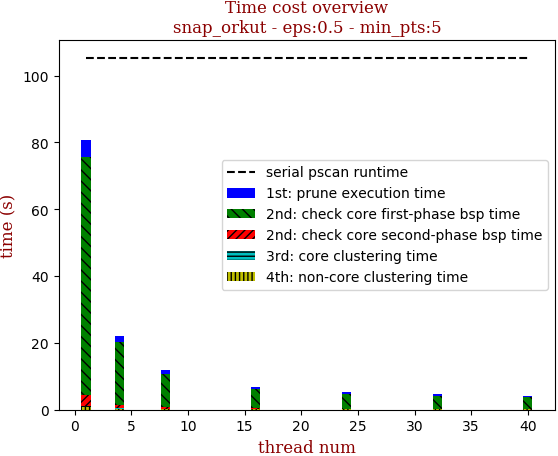 | 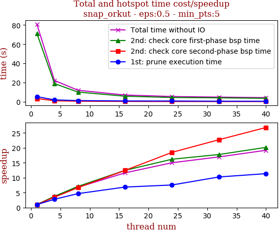

thread_num | prune | check-core 1st bsp | check-core 2nd bsp | cluster-core | cluster-non-core | total | total speedup
--- | --- | --- | --- | --- | --- | --- | ---
1 | 5.247s | 71.229s | 3.272s | 0.253s | 0.856s | 80.861s | 1.000
4 | 1.884s | 18.865s | 0.942s | 0.088s | 0.315s | 22.098s | 3.659
8 | 1.124s | 10.028s | 0.49s | 0.055s | 0.192s | 11.893s | 6.799
16 | 0.765s | 5.718s | 0.263s | 0.048s | 0.155s | 6.953s | 11.630
24 | 0.694s | 4.401s | 0.177s | 0.029s | 0.083s | 5.387s | 15.010
32 | 0.512s | 4.01s | 0.144s | 0.028s | 0.071s | 4.768s | 16.959
40 | 0.462s | 3.534s | 0.122s | 0.018s | 0.075s | 4.215s | 19.184

## eps:0.6

overview | speedup
--- | ---
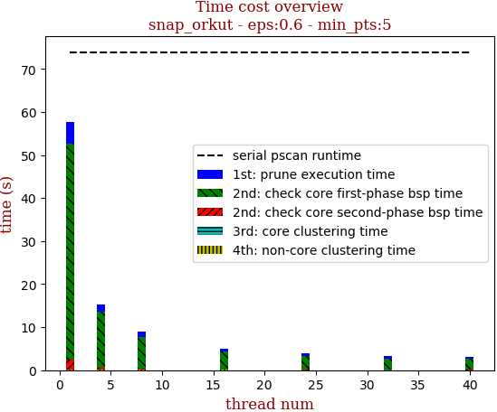 | 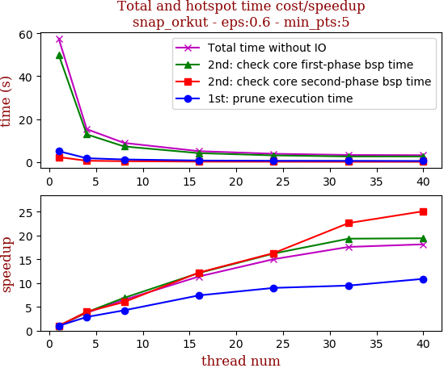

thread_num | prune | check-core 1st bsp | check-core 2nd bsp | cluster-core | cluster-non-core | total | total speedup
--- | --- | --- | --- | --- | --- | --- | ---
1 | 5.042s | 50.041s | 2.284s | 0.047s | 0.17s | 57.586s | 1.000
4 | 1.752s | 12.889s | 0.574s | 0.019s | 0.072s | 15.308s | 3.762
8 | 1.18s | 7.248s | 0.38s | 0.019s | 0.06s | 8.891s | 6.477
16 | 0.68s | 4.129s | 0.187s | 0.011s | 0.047s | 5.057s | 11.387
24 | 0.561s | 3.086s | 0.14s | 0.009s | 0.033s | 3.832s | 15.028
32 | 0.532s | 2.588s | 0.101s | 0.009s | 0.039s | 3.272s | 17.600
40 | 0.463s | 2.577s | 0.091s | 0.01s | 0.029s | 3.173s | 18.149

## eps:0.7

overview | speedup
--- | ---
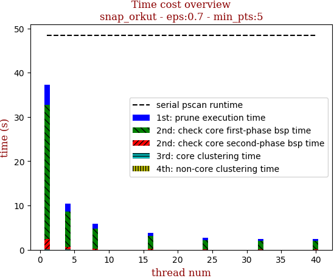 | 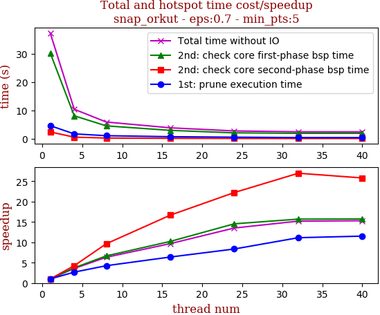

thread_num | prune | check-core 1st bsp | check-core 2nd bsp | cluster-core | cluster-non-core | total | total speedup
--- | --- | --- | --- | --- | --- | --- | ---
1 | 4.597s | 30.226s | 2.4s | 0.011s | 0.03s | 37.267s | 1.000
4 | 1.716s | 8.086s | 0.563s | 0.01s | 0.021s | 10.399s | 3.584
8 | 1.08s | 4.537s | 0.249s | 0.009s | 0.018s | 5.896s | 6.321
16 | 0.72s | 2.958s | 0.144s | 0.01s | 0.018s | 3.852s | 9.675
24 | 0.55s | 2.078s | 0.108s | 0.006s | 0.013s | 2.758s | 13.512
32 | 0.413s | 1.926s | 0.089s | 0.007s | 0.014s | 2.451s | 15.205
40 | 0.399s | 1.922s | 0.093s | 0.006s | 0.015s | 2.437s | 15.292

## eps:0.8

overview | speedup
--- | ---
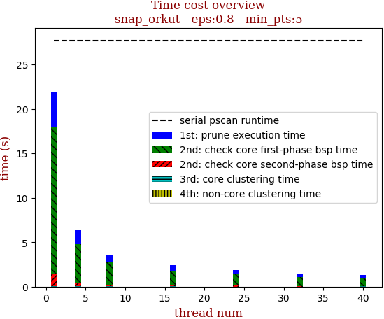 | 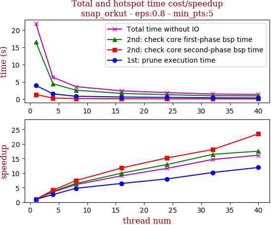

thread_num | prune | check-core 1st bsp | check-core 2nd bsp | cluster-core | cluster-non-core | total | total speedup
--- | --- | --- | --- | --- | --- | --- | ---
1 | 3.971s | 16.542s | 1.34s | 0.008s | 0.013s | 21.876s | 1.000
4 | 1.532s | 4.454s | 0.325s | 0.008s | 0.013s | 6.335s | 3.453
8 | 0.831s | 2.587s | 0.181s | 0.007s | 0.014s | 3.624s | 6.036
16 | 0.617s | 1.657s | 0.114s | 0.009s | 0.016s | 2.415s | 9.058
24 | 0.496s | 1.278s | 0.088s | 0.005s | 0.011s | 1.881s | 11.630
32 | 0.389s | 1.006s | 0.074s | 0.006s | 0.011s | 1.489s | 14.692
40 | 0.333s | 0.943s | 0.057s | 0.006s | 0.012s | 1.355s | 16.145

## eps:0.9

overview | speedup
--- | ---
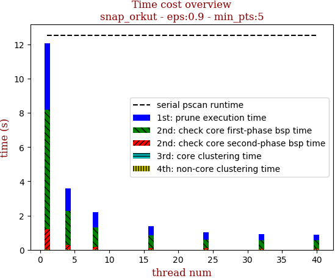 | 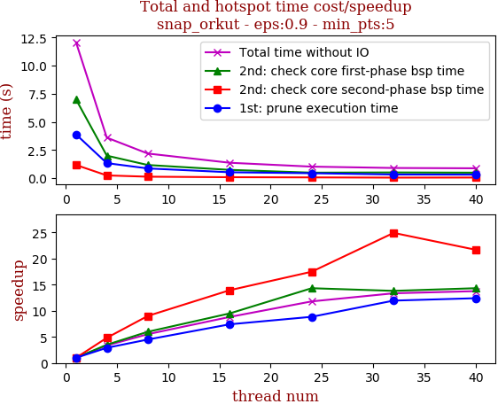

thread_num | prune | check-core 1st bsp | check-core 2nd bsp | cluster-core | cluster-non-core | total | total speedup
--- | --- | --- | --- | --- | --- | --- | ---
1 | 3.883s | 6.989s | 1.171s | 0.007s | 0.014s | 12.067s | 1.000
4 | 1.335s | 2.0s | 0.243s | 0.007s | 0.012s | 3.6s | 3.352
8 | 0.864s | 1.169s | 0.13s | 0.008s | 0.013s | 2.187s | 5.518
16 | 0.524s | 0.736s | 0.084s | 0.007s | 0.013s | 1.368s | 8.821
24 | 0.439s | 0.488s | 0.067s | 0.011s | 0.015s | 1.023s | 11.796
32 | 0.325s | 0.506s | 0.047s | 0.012s | 0.011s | 0.904s | 13.348
40 | 0.313s | 0.488s | 0.054s | 0.007s | 0.013s | 0.877s | 13.759

