## eps:0.1

overview | speedup
--- | ---
 | 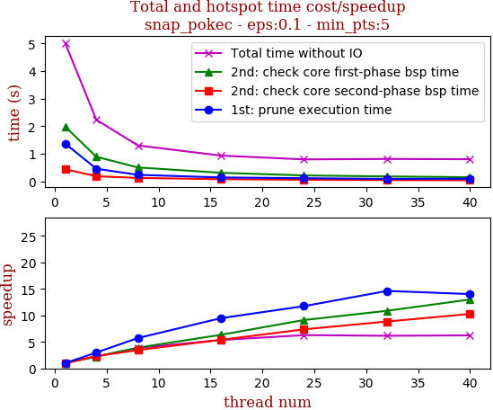

thread_num | prune | check-core 1st bsp | check-core 2nd bsp | cluster-core | cluster-non-core | total | total speedup
--- | --- | --- | --- | --- | --- | --- | ---
1 | 1.374s | 1.989s | 0.442s | 0.687s | 0.526s | 5.023s | 1.000
4 | 0.46s | 0.896s | 0.19s | 0.371s | 0.316s | 2.238s | 2.244
8 | 0.24s | 0.508s | 0.128s | 0.259s | 0.165s | 1.306s | 3.846
16 | 0.145s | 0.314s | 0.082s | 0.175s | 0.22s | 0.938s | 5.355
24 | 0.117s | 0.218s | 0.06s | 0.164s | 0.237s | 0.8s | 6.279
32 | 0.094s | 0.183s | 0.05s | 0.224s | 0.262s | 0.816s | 6.156
40 | 0.098s | 0.153s | 0.043s | 0.242s | 0.266s | 0.806s | 6.232

## eps:0.2

overview | speedup
--- | ---
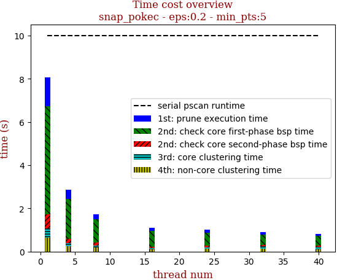 | 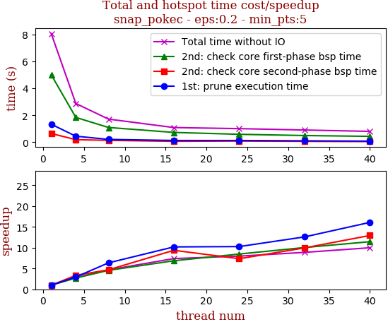

thread_num | prune | check-core 1st bsp | check-core 2nd bsp | cluster-core | cluster-non-core | total | total speedup
--- | --- | --- | --- | --- | --- | --- | ---
1 | 1.335s | 5.002s | 0.647s | 0.422s | 0.651s | 8.06s | 1.000
4 | 0.451s | 1.845s | 0.193s | 0.138s | 0.249s | 2.879s | 2.800
8 | 0.21s | 1.097s | 0.138s | 0.094s | 0.177s | 1.719s | 4.689
16 | 0.131s | 0.729s | 0.069s | 0.057s | 0.102s | 1.091s | 7.388
24 | 0.13s | 0.59s | 0.088s | 0.079s | 0.121s | 1.011s | 7.972
32 | 0.106s | 0.498s | 0.065s | 0.113s | 0.123s | 0.908s | 8.877
40 | 0.083s | 0.437s | 0.05s | 0.125s | 0.108s | 0.807s | 9.988

## eps:0.3

overview | speedup
--- | ---
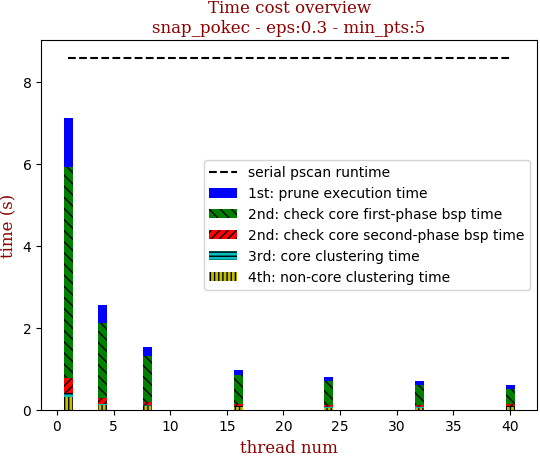 | 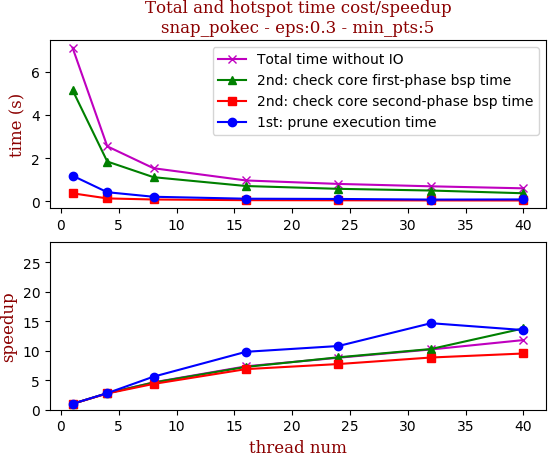

thread_num | prune | check-core 1st bsp | check-core 2nd bsp | cluster-core | cluster-non-core | total | total speedup
--- | --- | --- | --- | --- | --- | --- | ---
1 | 1.189s | 5.159s | 0.372s | 0.103s | 0.299s | 7.126s | 1.000
4 | 0.423s | 1.847s | 0.135s | 0.036s | 0.109s | 2.553s | 2.791
8 | 0.212s | 1.12s | 0.085s | 0.026s | 0.089s | 1.536s | 4.639
16 | 0.121s | 0.71s | 0.054s | 0.02s | 0.06s | 0.968s | 7.362
24 | 0.11s | 0.58s | 0.048s | 0.022s | 0.045s | 0.808s | 8.819
32 | 0.081s | 0.501s | 0.042s | 0.026s | 0.045s | 0.697s | 10.224
40 | 0.088s | 0.374s | 0.039s | 0.036s | 0.064s | 0.603s | 11.818

## eps:0.4

overview | speedup
--- | ---
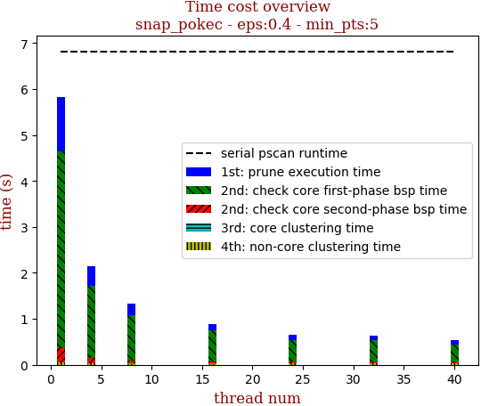 | 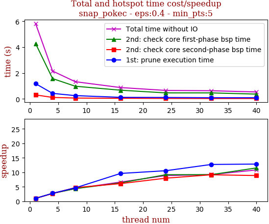

thread_num | prune | check-core 1st bsp | check-core 2nd bsp | cluster-core | cluster-non-core | total | total speedup
--- | --- | --- | --- | --- | --- | --- | ---
1 | 1.182s | 4.283s | 0.311s | 0.013s | 0.044s | 5.835s | 1.000
4 | 0.429s | 1.574s | 0.116s | 0.007s | 0.028s | 2.157s | 2.705
8 | 0.256s | 0.983s | 0.066s | 0.005s | 0.02s | 1.333s | 4.377
16 | 0.123s | 0.674s | 0.051s | 0.007s | 0.022s | 0.879s | 6.638
24 | 0.112s | 0.467s | 0.039s | 0.01s | 0.027s | 0.657s | 8.881
32 | 0.093s | 0.466s | 0.034s | 0.01s | 0.027s | 0.634s | 9.203
40 | 0.092s | 0.372s | 0.035s | 0.011s | 0.027s | 0.539s | 10.826

## eps:0.5

overview | speedup
--- | ---
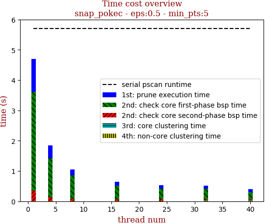 | 

thread_num | prune | check-core 1st bsp | check-core 2nd bsp | cluster-core | cluster-non-core | total | total speedup
--- | --- | --- | --- | --- | --- | --- | ---
1 | 1.076s | 3.274s | 0.328s | 0.005s | 0.012s | 4.697s | 1.000
4 | 0.429s | 1.305s | 0.104s | 0.004s | 0.01s | 1.855s | 2.532
8 | 0.196s | 0.773s | 0.063s | 0.005s | 0.011s | 1.051s | 4.469
16 | 0.121s | 0.468s | 0.036s | 0.005s | 0.012s | 0.644s | 7.293
24 | 0.107s | 0.36s | 0.04s | 0.006s | 0.012s | 0.528s | 8.896
32 | 0.089s | 0.369s | 0.033s | 0.007s | 0.016s | 0.517s | 9.085
40 | 0.096s | 0.256s | 0.031s | 0.008s | 0.015s | 0.409s | 11.484

## eps:0.6

overview | speedup
--- | ---
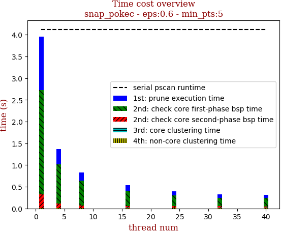 | 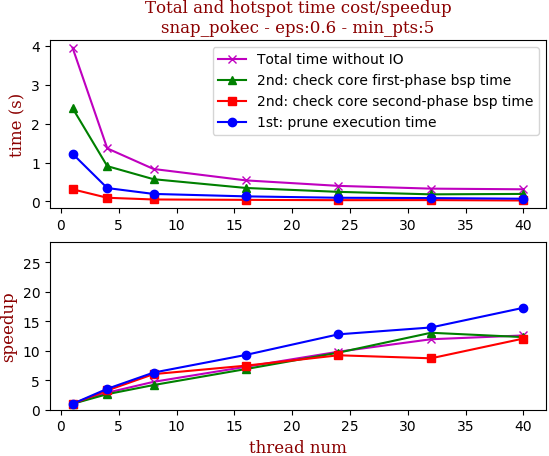

thread_num | prune | check-core 1st bsp | check-core 2nd bsp | cluster-core | cluster-non-core | total | total speedup
--- | --- | --- | --- | --- | --- | --- | ---
1 | 1.228s | 2.402s | 0.314s | 0.004s | 0.007s | 3.957s | 1.000
4 | 0.346s | 0.91s | 0.096s | 0.004s | 0.008s | 1.367s | 2.895
8 | 0.195s | 0.574s | 0.052s | 0.004s | 0.009s | 0.837s | 4.728
16 | 0.132s | 0.348s | 0.042s | 0.005s | 0.012s | 0.543s | 7.287
24 | 0.096s | 0.248s | 0.034s | 0.006s | 0.016s | 0.402s | 9.843
32 | 0.088s | 0.184s | 0.036s | 0.006s | 0.013s | 0.331s | 11.955
40 | 0.071s | 0.195s | 0.026s | 0.007s | 0.012s | 0.314s | 12.602

## eps:0.7

overview | speedup
--- | ---
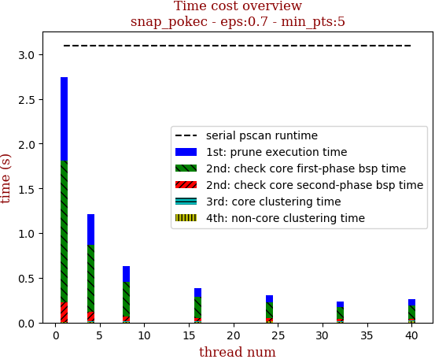 | 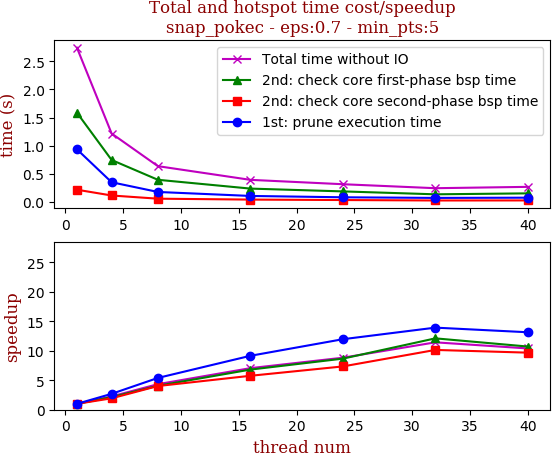

thread_num | prune | check-core 1st bsp | check-core 2nd bsp | cluster-core | cluster-non-core | total | total speedup
--- | --- | --- | --- | --- | --- | --- | ---
1 | 0.933s | 1.586s | 0.213s | 0.003s | 0.006s | 2.744s | 1.000
4 | 0.346s | 0.743s | 0.11s | 0.004s | 0.009s | 1.215s | 2.258
8 | 0.173s | 0.39s | 0.053s | 0.004s | 0.01s | 0.633s | 4.335
16 | 0.102s | 0.233s | 0.037s | 0.005s | 0.01s | 0.389s | 7.054
24 | 0.078s | 0.183s | 0.029s | 0.006s | 0.012s | 0.311s | 8.823
32 | 0.067s | 0.131s | 0.021s | 0.009s | 0.01s | 0.24s | 11.433
40 | 0.071s | 0.148s | 0.022s | 0.007s | 0.013s | 0.264s | 10.394

## eps:0.8

overview | speedup
--- | ---
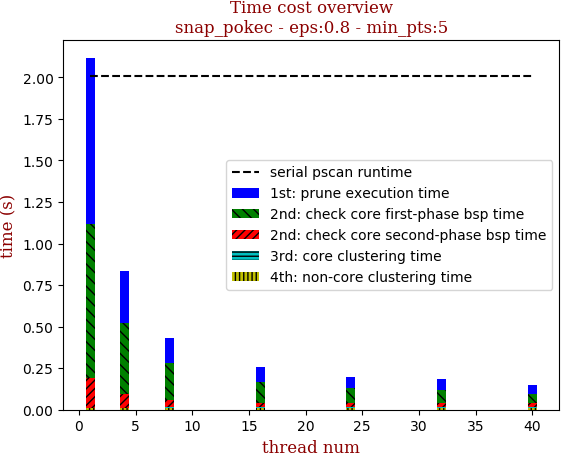 | 

thread_num | prune | check-core 1st bsp | check-core 2nd bsp | cluster-core | cluster-non-core | total | total speedup
--- | --- | --- | --- | --- | --- | --- | ---
1 | 1.002s | 0.927s | 0.178s | 0.003s | 0.008s | 2.121s | 1.000
4 | 0.316s | 0.424s | 0.084s | 0.004s | 0.009s | 0.84s | 2.525
8 | 0.148s | 0.222s | 0.045s | 0.004s | 0.01s | 0.432s | 4.910
16 | 0.09s | 0.123s | 0.028s | 0.005s | 0.01s | 0.259s | 8.189
24 | 0.066s | 0.091s | 0.024s | 0.005s | 0.011s | 0.2s | 10.605
32 | 0.064s | 0.081s | 0.02s | 0.006s | 0.013s | 0.186s | 11.403
40 | 0.053s | 0.057s | 0.019s | 0.007s | 0.012s | 0.151s | 14.046

## eps:0.9

overview | speedup
--- | ---
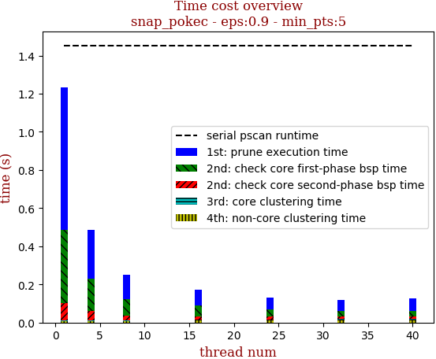 | 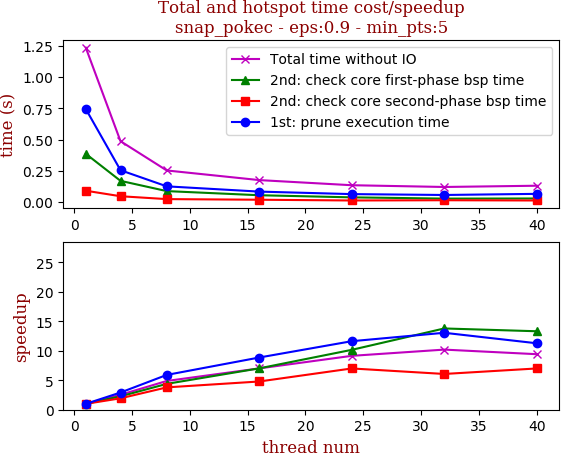

thread_num | prune | check-core 1st bsp | check-core 2nd bsp | cluster-core | cluster-non-core | total | total speedup
--- | --- | --- | --- | --- | --- | --- | ---
1 | 0.744s | 0.386s | 0.091s | 0.003s | 0.008s | 1.234s | 1.000
4 | 0.255s | 0.17s | 0.047s | 0.003s | 0.009s | 0.487s | 2.534
8 | 0.126s | 0.088s | 0.024s | 0.004s | 0.008s | 0.253s | 4.877
16 | 0.084s | 0.055s | 0.019s | 0.004s | 0.01s | 0.176s | 7.011
24 | 0.064s | 0.038s | 0.013s | 0.005s | 0.012s | 0.135s | 9.141
32 | 0.057s | 0.028s | 0.015s | 0.006s | 0.012s | 0.121s | 10.198
40 | 0.066s | 0.029s | 0.013s | 0.007s | 0.013s | 0.131s | 9.420

