## eps:0.1

overview | speedup
--- | ---
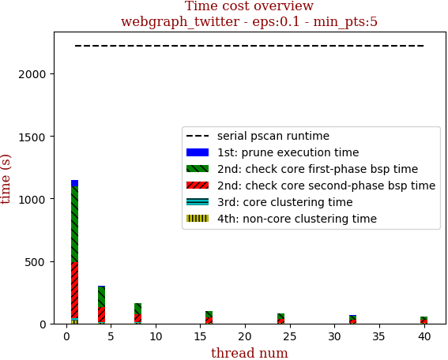 | 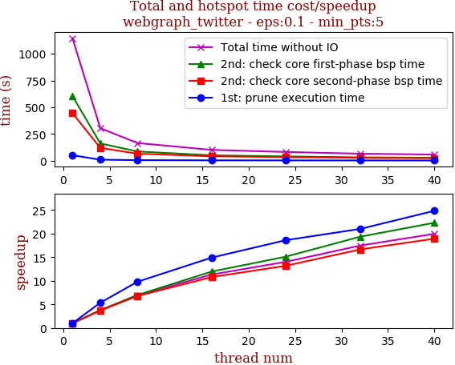

thread_num | prune | check-core 1st bsp | check-core 2nd bsp | cluster-core | cluster-non-core | total | total speedup
--- | --- | --- | --- | --- | --- | --- | ---
1 | 51.035s | 604.631s | 444.431s | 22.345s | 22.71s | 1145.155s | 1.000
4 | 9.54s | 161.217s | 120.18s | 6.057s | 6.972s | 303.968s | 3.767
8 | 5.212s | 86.521s | 65.649s | 3.296s | 4.834s | 165.515s | 6.919
16 | 3.423s | 50.59s | 41.218s | 2.108s | 3.782s | 101.124s | 11.324
24 | 2.743s | 40.003s | 33.72s | 1.914s | 3.319s | 81.702s | 14.016
32 | 2.432s | 31.267s | 26.708s | 1.601s | 3.579s | 65.59s | 17.459
40 | 2.056s | 27.123s | 23.493s | 1.384s | 3.334s | 57.393s | 19.953

## eps:0.2

overview | speedup
--- | ---
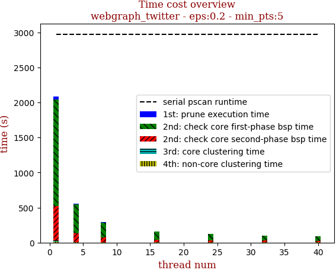 | 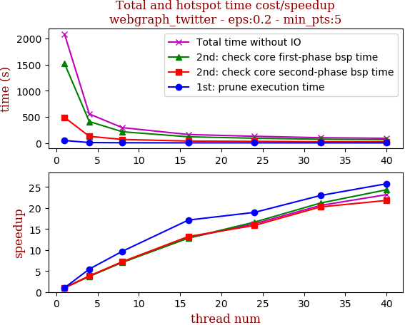

thread_num | prune | check-core 1st bsp | check-core 2nd bsp | cluster-core | cluster-non-core | total | total speedup
--- | --- | --- | --- | --- | --- | --- | ---
1 | 47.404s | 1521.794s | 490.191s | 9.683s | 17.652s | 2086.736s | 1.000
4 | 8.682s | 410.71s | 127.752s | 2.848s | 5.649s | 555.649s | 3.755
8 | 4.89s | 215.353s | 67.889s | 1.802s | 4.021s | 293.962s | 7.099
16 | 2.768s | 118.447s | 37.079s | 1.124s | 2.784s | 162.208s | 12.865
24 | 2.501s | 91.482s | 30.928s | 1.241s | 2.331s | 128.492s | 16.240
32 | 2.063s | 71.859s | 24.196s | 0.808s | 2.296s | 101.228s | 20.614
40 | 1.839s | 62.517s | 22.489s | 0.765s | 2.423s | 90.039s | 23.176

## eps:0.3

overview | speedup
--- | ---
 | 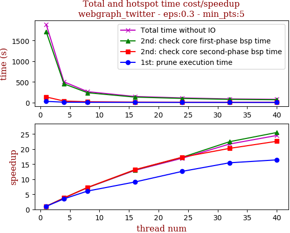

thread_num | prune | check-core 1st bsp | check-core 2nd bsp | cluster-core | cluster-non-core | total | total speedup
--- | --- | --- | --- | --- | --- | --- | ---
1 | 27.812s | 1715.079s | 134.519s | 3.568s | 9.624s | 1890.606s | 1.000
4 | 7.978s | 452.572s | 35.671s | 1.23s | 3.453s | 500.909s | 3.774
8 | 4.572s | 236.496s | 18.456s | 0.712s | 2.375s | 262.615s | 7.199
16 | 3.062s | 130.975s | 10.212s | 0.363s | 1.454s | 146.069s | 12.943
24 | 2.205s | 99.248s | 7.767s | 0.431s | 1.743s | 111.397s | 16.972
32 | 1.799s | 76.358s | 6.645s | 0.433s | 1.932s | 87.171s | 21.688
40 | 1.693s | 67.201s | 5.952s | 0.325s | 1.899s | 77.073s | 24.530

## eps:0.4

overview | speedup
--- | ---
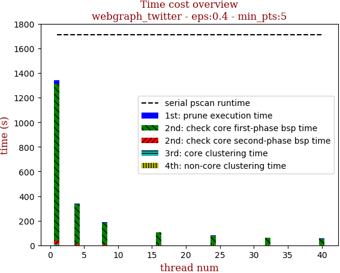 | 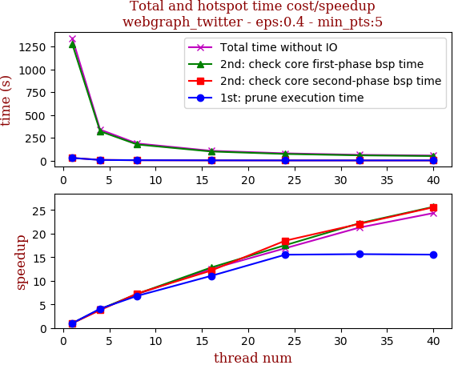

thread_num | prune | check-core 1st bsp | check-core 2nd bsp | cluster-core | cluster-non-core | total | total speedup
--- | --- | --- | --- | --- | --- | --- | ---
1 | 28.821s | 1275.42s | 29.337s | 2.522s | 4.75s | 1340.854s | 1.000
4 | 7.073s | 321.33s | 7.771s | 1.352s | 2.069s | 339.598s | 3.948
8 | 4.243s | 176.516s | 4.017s | 1.001s | 1.635s | 187.415s | 7.154
16 | 2.611s | 99.516s | 2.413s | 1.169s | 1.601s | 107.315s | 12.495
24 | 1.856s | 72.701s | 1.586s | 1.708s | 1.492s | 79.346s | 16.899
32 | 1.842s | 57.482s | 1.33s | 0.851s | 1.511s | 63.019s | 21.277
40 | 1.854s | 49.682s | 1.147s | 0.817s | 1.576s | 55.079s | 24.344

## eps:0.5

overview | speedup
--- | ---
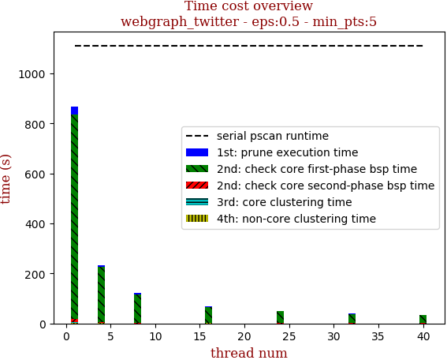 | 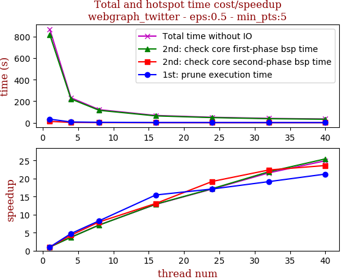

thread_num | prune | check-core 1st bsp | check-core 2nd bsp | cluster-core | cluster-non-core | total | total speedup
--- | --- | --- | --- | --- | --- | --- | ---
1 | 33.087s | 819.555s | 12.443s | 0.845s | 3.441s | 869.374s | 1.000
4 | 6.972s | 221.011s | 2.894s | 0.243s | 0.92s | 232.042s | 3.747
8 | 3.985s | 115.346s | 1.559s | 0.105s | 0.507s | 121.504s | 7.155
16 | 2.142s | 63.561s | 0.95s | 0.154s | 0.878s | 67.689s | 12.844
24 | 1.934s | 47.648s | 0.648s | 0.147s | 0.451s | 50.833s | 17.103
32 | 1.728s | 37.439s | 0.556s | 0.08s | 0.5s | 40.306s | 21.569
40 | 1.558s | 32.202s | 0.527s | 0.08s | 0.487s | 34.857s | 24.941

## eps:0.6

overview | speedup
--- | ---
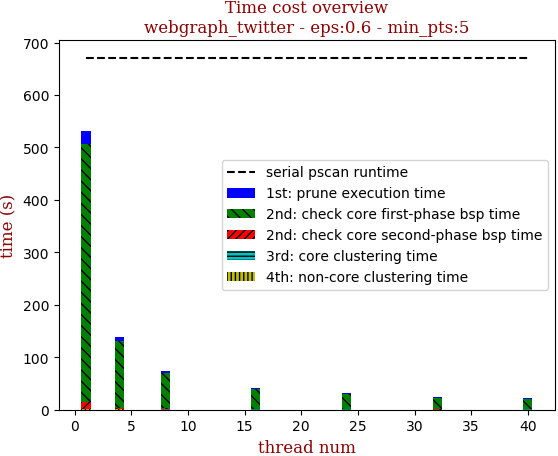 | 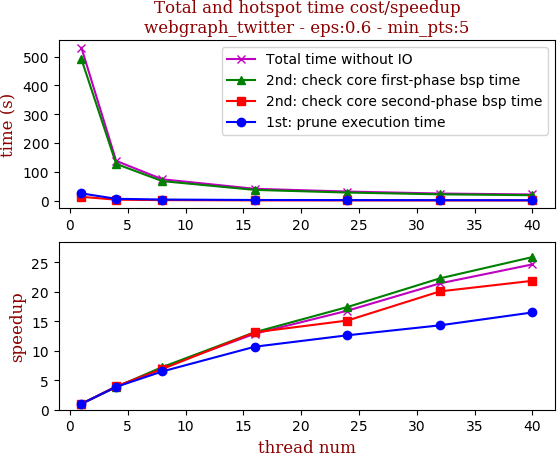

thread_num | prune | check-core 1st bsp | check-core 2nd bsp | cluster-core | cluster-non-core | total | total speedup
--- | --- | --- | --- | --- | --- | --- | ---
1 | 25.179s | 491.132s | 13.449s | 0.351s | 0.856s | 530.969s | 1.000
4 | 6.496s | 127.655s | 3.384s | 0.166s | 0.446s | 138.15s | 3.843
8 | 3.874s | 67.871s | 1.946s | 0.137s | 0.382s | 74.213s | 7.155
16 | 2.355s | 37.34s | 1.024s | 0.122s | 0.325s | 41.168s | 12.898
24 | 1.994s | 28.196s | 0.889s | 0.125s | 0.404s | 31.612s | 16.796
32 | 1.759s | 22.039s | 0.67s | 0.061s | 0.243s | 24.775s | 21.432
40 | 1.526s | 18.968s | 0.615s | 0.067s | 0.361s | 21.54s | 24.650

## eps:0.7

overview | speedup
--- | ---
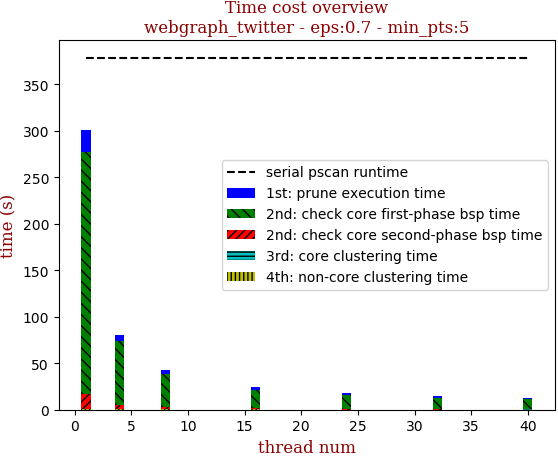 | 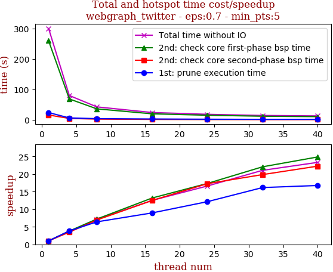

thread_num | prune | check-core 1st bsp | check-core 2nd bsp | cluster-core | cluster-non-core | total | total speedup
--- | --- | --- | --- | --- | --- | --- | ---
1 | 23.792s | 260.061s | 15.8s | 0.366s | 0.564s | 300.586s | 1.000
4 | 6.216s | 68.678s | 4.53s | 0.145s | 0.388s | 79.961s | 3.759
8 | 3.709s | 36.019s | 2.274s | 0.121s | 0.343s | 42.469s | 7.078
16 | 2.658s | 19.722s | 1.265s | 0.109s | 0.262s | 24.019s | 12.515
24 | 1.959s | 15.009s | 0.915s | 0.053s | 0.162s | 18.101s | 16.606
32 | 1.472s | 11.787s | 0.796s | 0.052s | 0.165s | 14.274s | 21.058
40 | 1.42s | 10.459s | 0.71s | 0.053s | 0.239s | 12.885s | 23.328

## eps:0.8

overview | speedup
--- | ---
 | 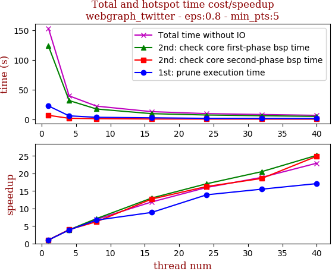

thread_num | prune | check-core 1st bsp | check-core 2nd bsp | cluster-core | cluster-non-core | total | total speedup
--- | --- | --- | --- | --- | --- | --- | ---
1 | 22.564s | 123.491s | 6.722s | 0.143s | 0.358s | 153.281s | 1.000
4 | 5.857s | 31.634s | 1.694s | 0.107s | 0.272s | 39.567s | 3.874
8 | 3.382s | 17.337s | 1.08s | 0.101s | 0.271s | 22.173s | 6.913
16 | 2.545s | 9.52s | 0.53s | 0.099s | 0.228s | 12.925s | 11.859
24 | 1.623s | 7.239s | 0.413s | 0.093s | 0.215s | 9.585s | 15.992
32 | 1.455s | 6.022s | 0.362s | 0.081s | 0.2s | 8.123s | 18.870
40 | 1.32s | 4.906s | 0.27s | 0.043s | 0.146s | 6.687s | 22.922

## eps:0.9

overview | speedup
--- | ---
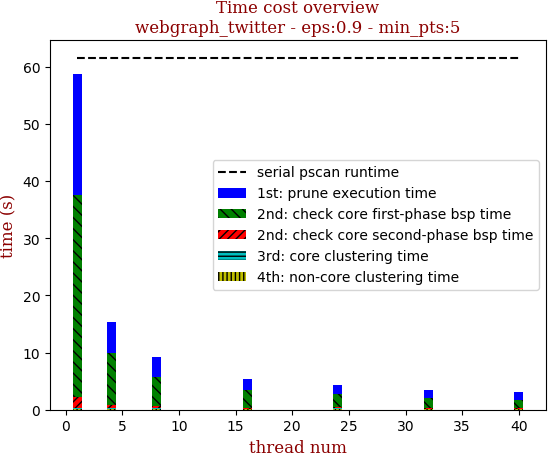 | 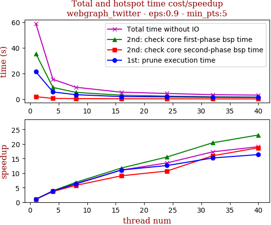

thread_num | prune | check-core 1st bsp | check-core 2nd bsp | cluster-core | cluster-non-core | total | total speedup
--- | --- | --- | --- | --- | --- | --- | ---
1 | 21.271s | 35.342s | 1.851s | 0.111s | 0.211s | 58.789s | 1.000
4 | 5.525s | 9.067s | 0.503s | 0.098s | 0.193s | 15.388s | 3.820
8 | 3.404s | 5.19s | 0.321s | 0.096s | 0.177s | 9.19s | 6.397
16 | 1.923s | 3.01s | 0.204s | 0.054s | 0.129s | 5.323s | 11.044
24 | 1.688s | 2.274s | 0.173s | 0.043s | 0.174s | 4.354s | 13.502
32 | 1.4s | 1.73s | 0.116s | 0.045s | 0.104s | 3.397s | 17.306
40 | 1.3s | 1.53s | 0.099s | 0.045s | 0.106s | 3.082s | 19.075

