## eps:0.1

overview | speedup
--- | ---
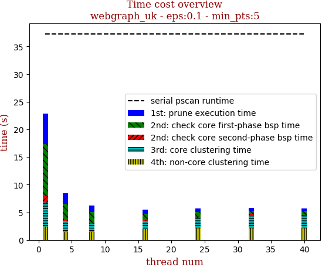 | 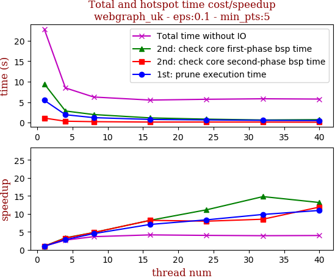

thread_num | prune | check-core 1st bsp | check-core 2nd bsp | cluster-core | cluster-non-core | total | total speedup
--- | --- | --- | --- | --- | --- | --- | ---
1 | 5.451s | 9.458s | 1.106s | 4.379s | 2.426s | 22.822s | 1.000
4 | 1.929s | 2.834s | 0.341s | 1.879s | 1.482s | 8.468s | 2.695
8 | 1.214s | 1.968s | 0.231s | 1.325s | 1.505s | 6.246s | 3.654
16 | 0.773s | 1.154s | 0.135s | 1.417s | 2.023s | 5.504s | 4.146
24 | 0.654s | 0.85s | 0.139s | 1.941s | 2.107s | 5.695s | 4.007
32 | 0.554s | 0.639s | 0.13s | 2.366s | 2.124s | 5.818s | 3.923
40 | 0.498s | 0.719s | 0.093s | 2.295s | 2.137s | 5.746s | 3.972

## eps:0.2

overview | speedup
--- | ---
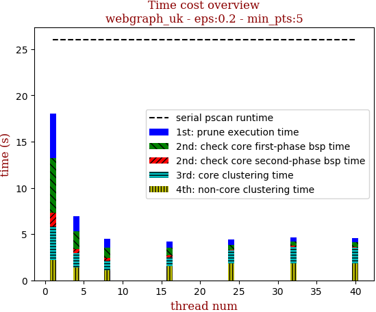 | 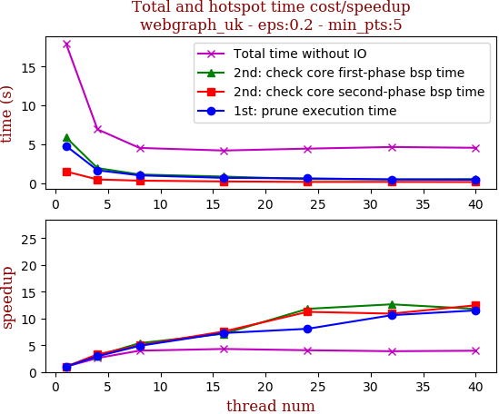

thread_num | prune | check-core 1st bsp | check-core 2nd bsp | cluster-core | cluster-non-core | total | total speedup
--- | --- | --- | --- | --- | --- | --- | ---
1 | 4.788s | 5.879s | 1.483s | 3.657s | 2.196s | 18.008s | 1.000
4 | 1.637s | 1.92s | 0.45s | 1.528s | 1.375s | 6.915s | 2.604
8 | 0.98s | 1.092s | 0.297s | 1.043s | 1.103s | 4.517s | 3.987
16 | 0.658s | 0.823s | 0.196s | 0.944s | 1.559s | 4.185s | 4.303
24 | 0.593s | 0.498s | 0.132s | 1.404s | 1.799s | 4.43s | 4.065
32 | 0.451s | 0.465s | 0.136s | 1.747s | 1.834s | 4.637s | 3.884
40 | 0.416s | 0.499s | 0.119s | 1.679s | 1.82s | 4.536s | 3.970

## eps:0.3

overview | speedup
--- | ---
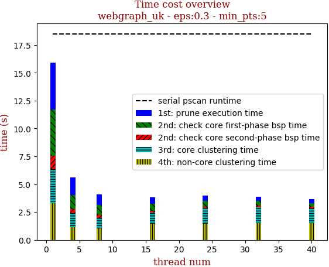 | 

thread_num | prune | check-core 1st bsp | check-core 2nd bsp | cluster-core | cluster-non-core | total | total speedup
--- | --- | --- | --- | --- | --- | --- | ---
1 | 4.203s | 4.156s | 1.218s | 3.023s | 3.305s | 15.907s | 1.000
4 | 1.532s | 1.272s | 0.396s | 1.268s | 1.117s | 5.59s | 2.846
8 | 0.974s | 0.882s | 0.23s | 0.939s | 1.062s | 4.092s | 3.887
16 | 0.563s | 0.655s | 0.173s | 0.973s | 1.462s | 3.831s | 4.152
24 | 0.485s | 0.492s | 0.117s | 1.439s | 1.448s | 3.985s | 3.992
32 | 0.375s | 0.447s | 0.129s | 1.41s | 1.533s | 3.897s | 4.082
40 | 0.362s | 0.352s | 0.123s | 1.313s | 1.521s | 3.676s | 4.327

## eps:0.4

overview | speedup
--- | ---
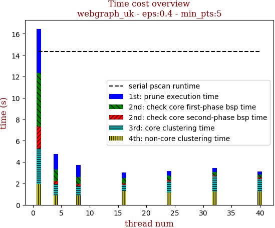 | 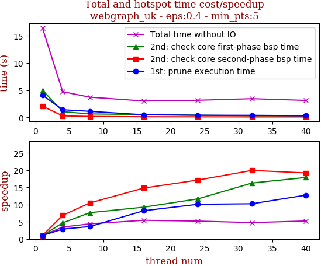

thread_num | prune | check-core 1st bsp | check-core 2nd bsp | cluster-core | cluster-non-core | total | total speedup
--- | --- | --- | --- | --- | --- | --- | ---
1 | 4.106s | 5.026s | 2.073s | 3.285s | 1.963s | 16.455s | 1.000
4 | 1.427s | 1.074s | 0.302s | 1.038s | 0.896s | 4.74s | 3.472
8 | 1.137s | 0.658s | 0.198s | 0.85s | 0.895s | 3.741s | 4.399
16 | 0.5s | 0.543s | 0.14s | 0.553s | 1.288s | 3.027s | 5.436
24 | 0.407s | 0.431s | 0.121s | 1.041s | 1.164s | 3.168s | 5.194
32 | 0.401s | 0.309s | 0.104s | 1.39s | 1.25s | 3.457s | 4.760
40 | 0.322s | 0.281s | 0.108s | 1.202s | 1.226s | 3.143s | 5.235

## eps:0.5

overview | speedup
--- | ---
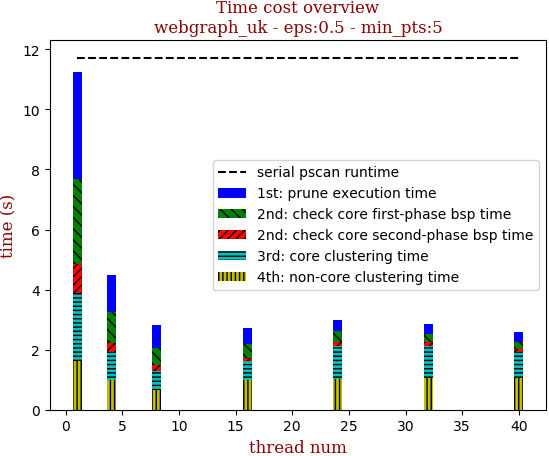 | 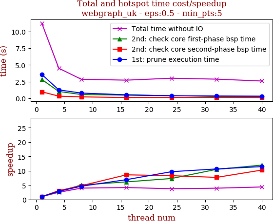

thread_num | prune | check-core 1st bsp | check-core 2nd bsp | cluster-core | cluster-non-core | total | total speedup
--- | --- | --- | --- | --- | --- | --- | ---
1 | 3.563s | 2.813s | 0.962s | 2.261s | 1.636s | 11.243s | 1.000
4 | 1.253s | 1.016s | 0.313s | 0.926s | 0.984s | 4.502s | 2.497
8 | 0.772s | 0.558s | 0.201s | 0.649s | 0.654s | 2.843s | 3.955
16 | 0.516s | 0.459s | 0.112s | 0.641s | 0.977s | 2.71s | 4.149
24 | 0.368s | 0.385s | 0.116s | 1.09s | 1.039s | 3.001s | 3.746
32 | 0.335s | 0.268s | 0.125s | 1.065s | 1.064s | 2.86s | 3.931
40 | 0.311s | 0.235s | 0.094s | 0.896s | 1.04s | 2.582s | 4.354

## eps:0.6

overview | speedup
--- | ---
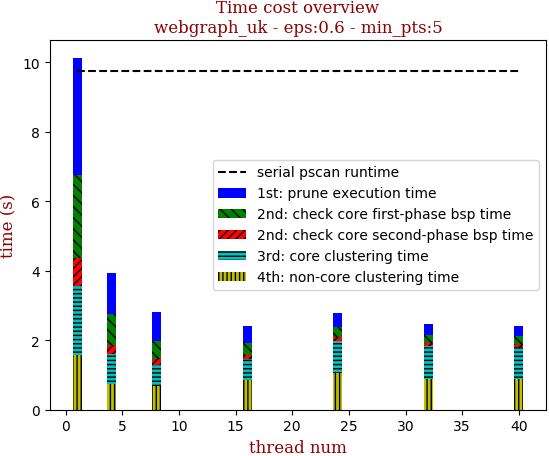 | 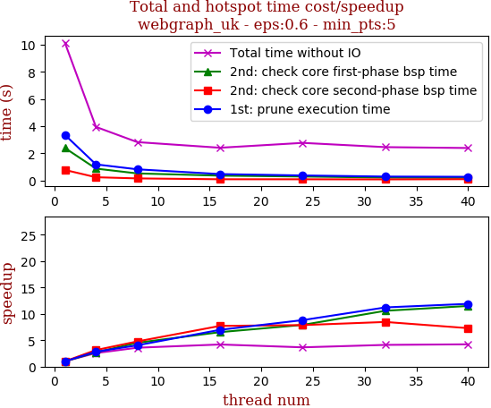

thread_num | prune | check-core 1st bsp | check-core 2nd bsp | cluster-core | cluster-non-core | total | total speedup
--- | --- | --- | --- | --- | --- | --- | ---
1 | 3.367s | 2.403s | 0.787s | 1.991s | 1.584s | 10.141s | 1.000
4 | 1.196s | 0.887s | 0.251s | 0.866s | 0.744s | 3.953s | 2.565
8 | 0.834s | 0.532s | 0.165s | 0.608s | 0.684s | 2.834s | 3.578
16 | 0.483s | 0.368s | 0.102s | 0.605s | 0.856s | 2.419s | 4.192
24 | 0.382s | 0.304s | 0.1s | 0.928s | 1.057s | 2.777s | 3.652
32 | 0.3s | 0.227s | 0.093s | 0.967s | 0.872s | 2.464s | 4.116
40 | 0.283s | 0.209s | 0.108s | 0.899s | 0.897s | 2.4s | 4.225

## eps:0.7

overview | speedup
--- | ---
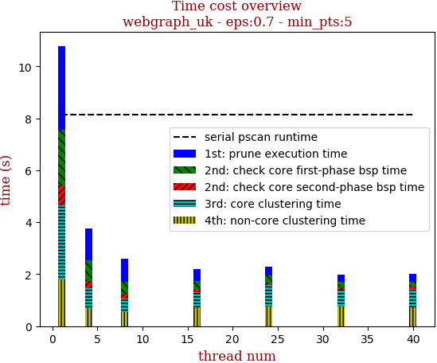 | 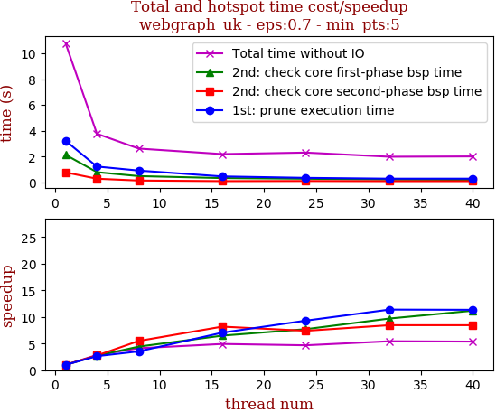

thread_num | prune | check-core 1st bsp | check-core 2nd bsp | cluster-core | cluster-non-core | total | total speedup
--- | --- | --- | --- | --- | --- | --- | ---
1 | 3.22s | 2.134s | 0.769s | 2.873s | 1.786s | 10.788s | 1.000
4 | 1.223s | 0.787s | 0.279s | 0.771s | 0.696s | 3.766s | 2.865
8 | 0.912s | 0.482s | 0.14s | 0.523s | 0.552s | 2.617s | 4.122
16 | 0.457s | 0.329s | 0.094s | 0.576s | 0.729s | 2.189s | 4.928
24 | 0.346s | 0.277s | 0.104s | 0.812s | 0.762s | 2.305s | 4.680
32 | 0.283s | 0.22s | 0.091s | 0.629s | 0.759s | 1.985s | 5.435
40 | 0.284s | 0.191s | 0.091s | 0.728s | 0.712s | 2.009s | 5.370

## eps:0.8

overview | speedup
--- | ---
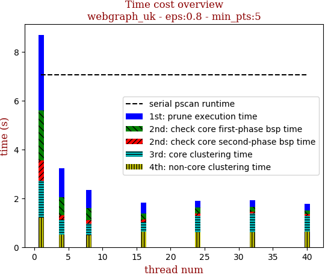 | 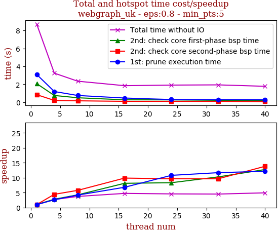

thread_num | prune | check-core 1st bsp | check-core 2nd bsp | cluster-core | cluster-non-core | total | total speedup
--- | --- | --- | --- | --- | --- | --- | ---
1 | 3.085s | 2.063s | 0.829s | 1.504s | 1.216s | 8.703s | 1.000
4 | 1.182s | 0.739s | 0.187s | 0.595s | 0.524s | 3.234s | 2.691
8 | 0.739s | 0.485s | 0.144s | 0.476s | 0.484s | 2.335s | 3.727
16 | 0.454s | 0.254s | 0.084s | 0.391s | 0.647s | 1.834s | 4.745
24 | 0.286s | 0.248s | 0.086s | 0.667s | 0.613s | 1.901s | 4.578
32 | 0.264s | 0.201s | 0.086s | 0.763s | 0.606s | 1.925s | 4.521
40 | 0.254s | 0.162s | 0.06s | 0.648s | 0.637s | 1.765s | 4.931

## eps:0.9

overview | speedup
--- | ---
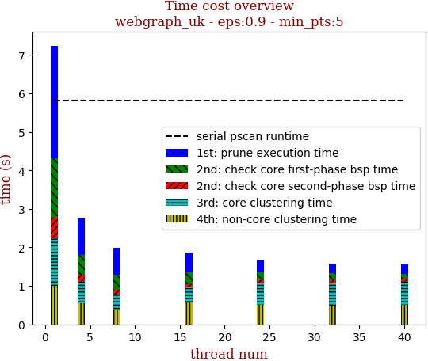 | 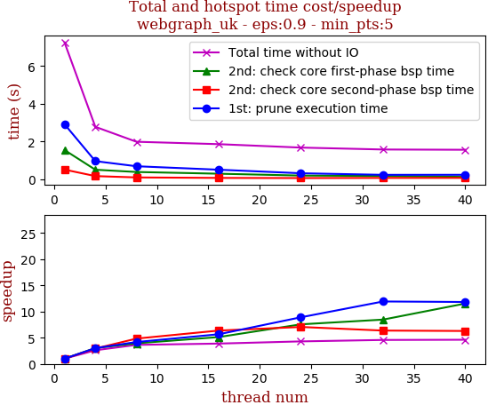

thread_num | prune | check-core 1st bsp | check-core 2nd bsp | cluster-core | cluster-non-core | total | total speedup
--- | --- | --- | --- | --- | --- | --- | ---
1 | 2.921s | 1.557s | 0.522s | 1.244s | 0.997s | 7.245s | 1.000
4 | 0.969s | 0.515s | 0.178s | 0.557s | 0.557s | 2.783s | 2.603
8 | 0.699s | 0.396s | 0.108s | 0.39s | 0.394s | 1.993s | 3.635
16 | 0.516s | 0.304s | 0.082s | 0.401s | 0.561s | 1.867s | 3.881
24 | 0.328s | 0.206s | 0.074s | 0.575s | 0.499s | 1.685s | 4.300
32 | 0.245s | 0.184s | 0.082s | 0.593s | 0.478s | 1.584s | 4.574
40 | 0.247s | 0.135s | 0.083s | 0.597s | 0.504s | 1.57s | 4.615

