## eps:0.1

overview | speedup
--- | ---
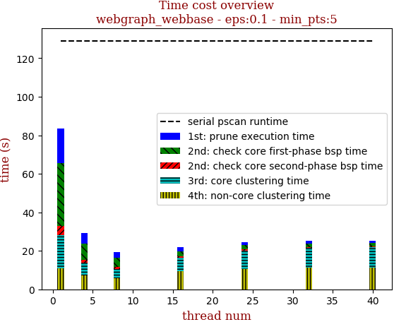 | 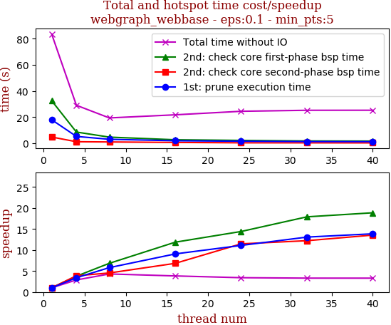

thread_num | prune | check-core 1st bsp | check-core 2nd bsp | cluster-core | cluster-non-core | total | total speedup
--- | --- | --- | --- | --- | --- | --- | ---
1 | 18.056s | 32.588s | 4.838s | 17.243s | 10.849s | 83.58s | 1.000
4 | 5.308s | 8.647s | 1.25s | 6.772s | 7.134s | 29.116s | 2.871
8 | 3.11s | 4.768s | 1.067s | 4.591s | 5.908s | 19.449s | 4.297
16 | 1.991s | 2.748s | 0.709s | 6.769s | 9.592s | 21.823s | 3.830
24 | 1.628s | 2.262s | 0.422s | 9.848s | 10.353s | 24.521s | 3.409
32 | 1.381s | 1.821s | 0.396s | 10.503s | 11.17s | 25.285s | 3.306
40 | 1.303s | 1.728s | 0.357s | 10.534s | 11.388s | 25.322s | 3.301

## eps:0.2

overview | speedup
--- | ---
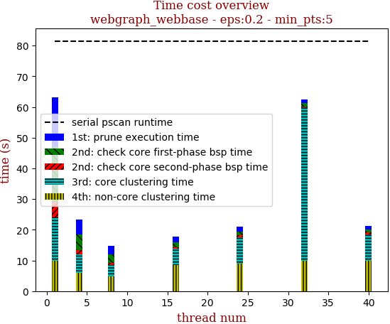 | 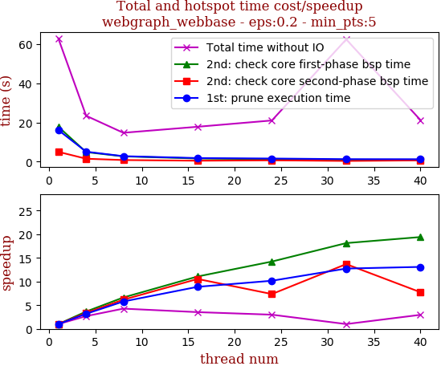

thread_num | prune | check-core 1st bsp | check-core 2nd bsp | cluster-core | cluster-non-core | total | total speedup
--- | --- | --- | --- | --- | --- | --- | ---
1 | 16.16s | 17.855s | 5.009s | 14.061s | 9.926s | 63.02s | 1.000
4 | 5.08s | 4.874s | 1.483s | 6.103s | 5.885s | 23.434s | 2.689
8 | 2.796s | 2.694s | 0.813s | 3.567s | 4.871s | 14.744s | 4.274
16 | 1.819s | 1.613s | 0.475s | 5.336s | 8.57s | 17.825s | 3.535
24 | 1.589s | 1.255s | 0.681s | 8.509s | 9.001s | 21.042s | 2.995
32 | 1.268s | 0.985s | 0.366s | 49.991s | 9.873s | 62.487s | 1.009
40 | 1.234s | 0.92s | 0.647s | 8.51s | 9.915s | 21.235s | 2.968

## eps:0.3

overview | speedup
--- | ---
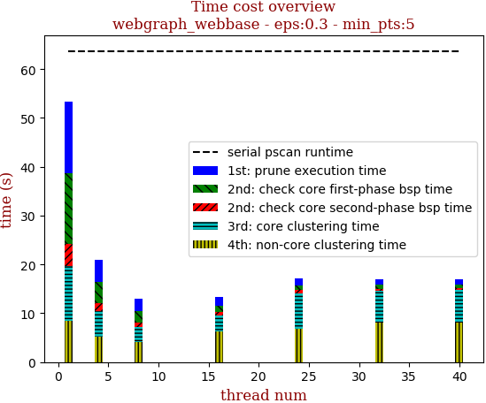 | 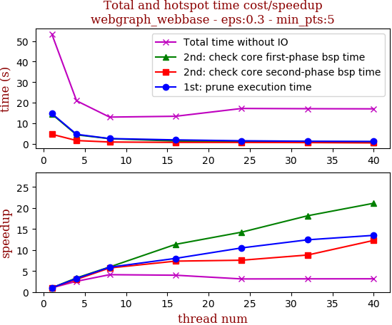

thread_num | prune | check-core 1st bsp | check-core 2nd bsp | cluster-core | cluster-non-core | total | total speedup
--- | --- | --- | --- | --- | --- | --- | ---
1 | 14.692s | 14.434s | 4.573s | 11.285s | 8.433s | 53.426s | 1.000
4 | 4.55s | 4.3s | 1.52s | 5.269s | 5.242s | 20.884s | 2.558
8 | 2.488s | 2.422s | 0.799s | 3.06s | 4.171s | 12.942s | 4.128
16 | 1.835s | 1.272s | 0.622s | 3.269s | 6.349s | 13.351s | 4.002
24 | 1.399s | 1.013s | 0.604s | 7.325s | 6.805s | 17.149s | 3.115
32 | 1.182s | 0.795s | 0.519s | 6.358s | 8.179s | 17.036s | 3.136
40 | 1.089s | 0.683s | 0.372s | 6.763s | 8.054s | 16.965s | 3.149

## eps:0.4

overview | speedup
--- | ---
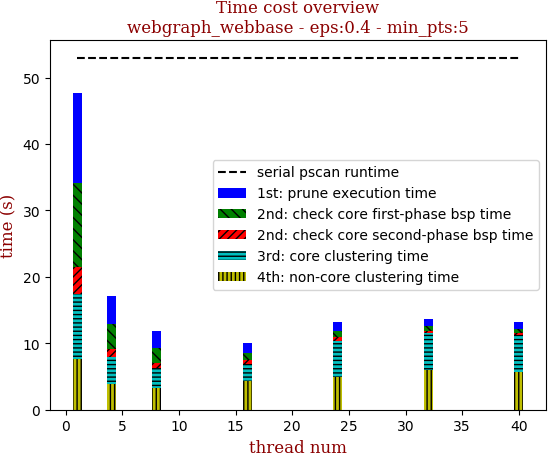 | 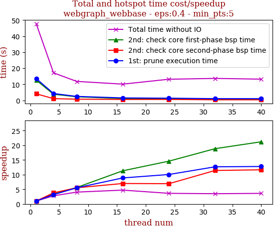

thread_num | prune | check-core 1st bsp | check-core 2nd bsp | cluster-core | cluster-non-core | total | total speedup
--- | --- | --- | --- | --- | --- | --- | ---
1 | 13.588s | 12.607s | 4.087s | 9.793s | 7.618s | 47.696s | 1.000
4 | 4.273s | 3.811s | 1.079s | 4.128s | 3.861s | 17.155s | 2.780
8 | 2.472s | 2.25s | 0.741s | 3.028s | 3.322s | 11.816s | 4.037
16 | 1.532s | 1.115s | 0.586s | 2.544s | 4.323s | 10.105s | 4.720
24 | 1.353s | 0.864s | 0.592s | 5.478s | 4.874s | 13.164s | 3.623
32 | 1.073s | 0.669s | 0.358s | 5.656s | 5.908s | 13.672s | 3.489
40 | 1.064s | 0.595s | 0.351s | 5.553s | 5.644s | 13.21s | 3.611

## eps:0.5

overview | speedup
--- | ---
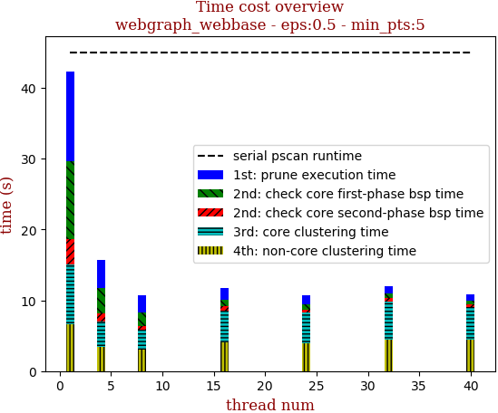 | 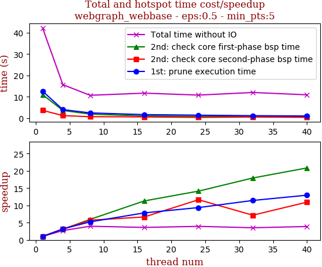

thread_num | prune | check-core 1st bsp | check-core 2nd bsp | cluster-core | cluster-non-core | total | total speedup
--- | --- | --- | --- | --- | --- | --- | ---
1 | 12.606s | 11.012s | 3.609s | 8.458s | 6.605s | 42.293s | 1.000
4 | 3.96s | 3.552s | 1.144s | 3.597s | 3.408s | 15.663s | 2.700
8 | 2.41s | 1.854s | 0.633s | 2.789s | 2.996s | 10.688s | 3.957
16 | 1.611s | 0.975s | 0.543s | 4.56s | 4.005s | 11.698s | 3.615
24 | 1.346s | 0.779s | 0.31s | 4.343s | 3.99s | 10.782s | 3.923
32 | 1.103s | 0.614s | 0.504s | 5.397s | 4.382s | 12.002s | 3.524
40 | 0.973s | 0.528s | 0.33s | 4.681s | 4.382s | 10.908s | 3.877

## eps:0.6

overview | speedup
--- | ---
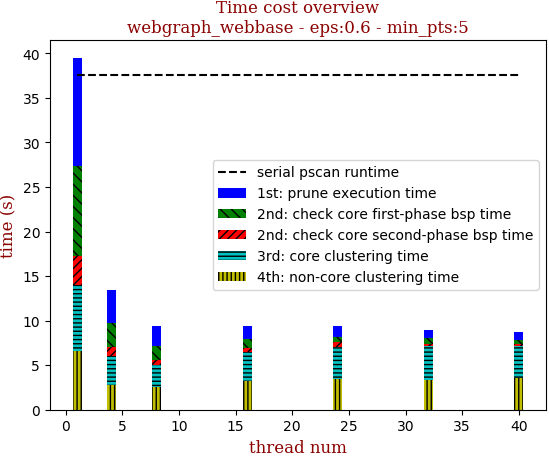 | 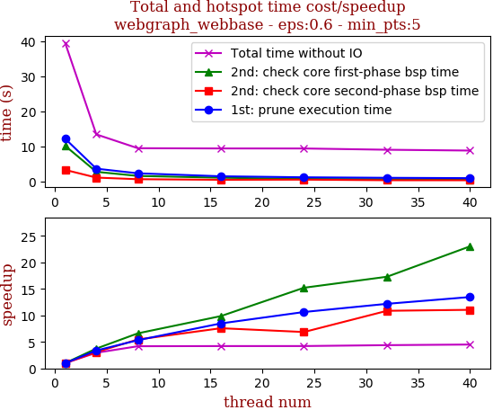

thread_num | prune | check-core 1st bsp | check-core 2nd bsp | cluster-core | cluster-non-core | total | total speedup
--- | --- | --- | --- | --- | --- | --- | ---
1 | 12.159s | 10.134s | 3.26s | 7.311s | 6.647s | 39.513s | 1.000
4 | 3.607s | 2.711s | 1.058s | 3.234s | 2.781s | 13.394s | 2.950
8 | 2.284s | 1.532s | 0.598s | 2.458s | 2.571s | 9.449s | 4.182
16 | 1.433s | 1.027s | 0.43s | 3.244s | 3.236s | 9.381s | 4.212
24 | 1.143s | 0.666s | 0.475s | 3.62s | 3.457s | 9.372s | 4.216
32 | 0.998s | 0.586s | 0.3s | 3.791s | 3.329s | 9.011s | 4.385
40 | 0.903s | 0.44s | 0.295s | 3.582s | 3.55s | 8.778s | 4.501

## eps:0.7

overview | speedup
--- | ---
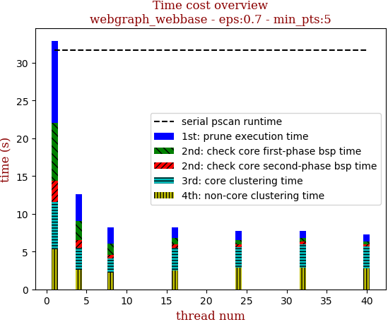 | 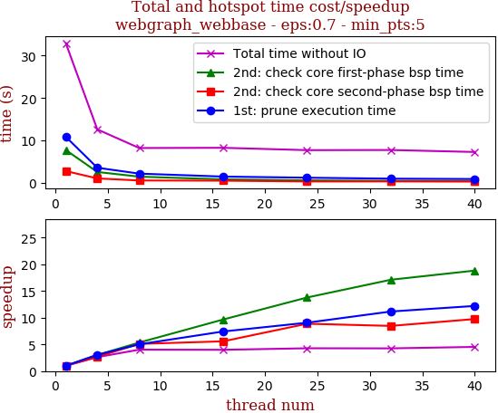

thread_num | prune | check-core 1st bsp | check-core 2nd bsp | cluster-core | cluster-non-core | total | total speedup
--- | --- | --- | --- | --- | --- | --- | ---
1 | 10.837s | 7.718s | 2.759s | 6.285s | 5.303s | 32.913s | 1.000
4 | 3.551s | 2.553s | 1.027s | 2.847s | 2.619s | 12.599s | 2.612
8 | 2.16s | 1.444s | 0.542s | 1.825s | 2.224s | 8.2s | 4.014
16 | 1.461s | 0.799s | 0.495s | 2.977s | 2.512s | 8.252s | 3.988
24 | 1.196s | 0.56s | 0.311s | 2.794s | 2.83s | 7.698s | 4.276
32 | 0.971s | 0.451s | 0.326s | 3.088s | 2.89s | 7.733s | 4.256
40 | 0.888s | 0.41s | 0.283s | 2.919s | 2.759s | 7.264s | 4.531

## eps:0.8

overview | speedup
--- | ---
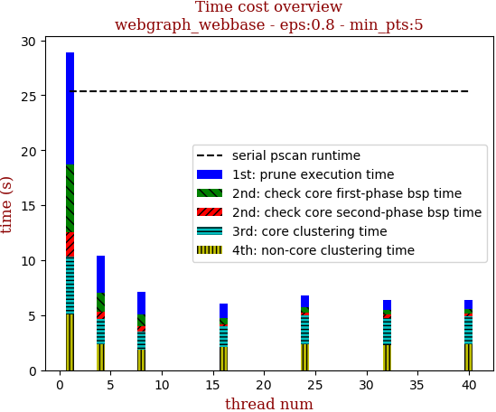 | 

thread_num | prune | check-core 1st bsp | check-core 2nd bsp | cluster-core | cluster-non-core | total | total speedup
--- | --- | --- | --- | --- | --- | --- | ---
1 | 10.204s | 6.149s | 2.2s | 5.322s | 5.05s | 28.932s | 1.000
4 | 3.361s | 1.736s | 0.607s | 2.33s | 2.367s | 10.408s | 2.780
8 | 2.038s | 1.08s | 0.469s | 1.638s | 1.875s | 7.104s | 4.073
16 | 1.261s | 0.584s | 0.226s | 1.855s | 2.11s | 6.037s | 4.792
24 | 1.063s | 0.49s | 0.314s | 2.563s | 2.394s | 6.826s | 4.238
32 | 0.91s | 0.416s | 0.272s | 2.476s | 2.303s | 6.38s | 4.535
40 | 0.822s | 0.421s | 0.258s | 2.496s | 2.4s | 6.399s | 4.521

## eps:0.9

overview | speedup
--- | ---
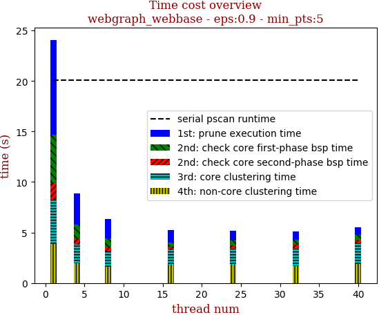 | 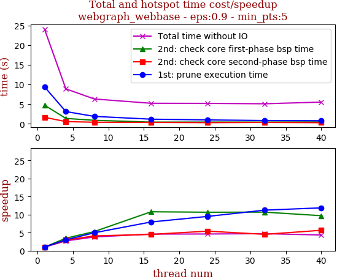

thread_num | prune | check-core 1st bsp | check-core 2nd bsp | cluster-core | cluster-non-core | total | total speedup
--- | --- | --- | --- | --- | --- | --- | ---
1 | 9.395s | 4.745s | 1.652s | 4.397s | 3.878s | 24.07s | 1.000
4 | 3.118s | 1.372s | 0.564s | 1.908s | 1.931s | 8.901s | 2.704
8 | 1.89s | 0.896s | 0.403s | 1.474s | 1.655s | 6.321s | 3.808
16 | 1.181s | 0.44s | 0.366s | 1.441s | 1.794s | 5.226s | 4.606
24 | 0.988s | 0.445s | 0.305s | 1.621s | 1.835s | 5.197s | 4.632
32 | 0.836s | 0.444s | 0.365s | 1.763s | 1.689s | 5.1s | 4.720
40 | 0.791s | 0.489s | 0.292s | 2.079s | 1.875s | 5.529s | 4.353

