dataset | scalability link
--- | ---
small_snap_dblp | [small_snap_dblp.md](small_snap_dblp.md)
snap_pokec | [snap_pokec.md](snap_pokec.md)
snap_livejournal | [snap_livejournal.md](snap_livejournal.md)
snap_orkut | [snap_orkut.md](snap_orkut.md)
webgraph_uk | [webgraph_uk.md](webgraph_uk.md)
webgraph_webbase | [webgraph_webbase.md](webgraph_webbase.md)
webgraph_twitter | [webgraph_twitter.md](webgraph_twitter.md)

## eps:0.1

with 40 full logical threads | with best thread num
--- | ---
 | 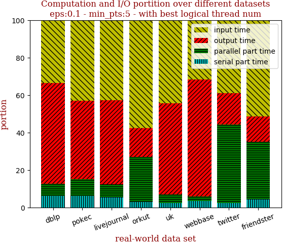

with 40 full logical threads | with best thread num
--- | ---
 | 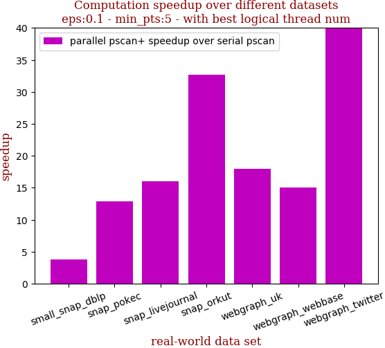

```zsh
best performance thread_num_lst:[24, 40, 40, 40, 40, 40, 40]
```

dataset | edge num | pscan runtime | pscan+ 40 logical-core full speedup | pscan+ best thread_num speedup | thread_num choice
--- | --- | --- | --- | --- | ---
small_snap_dblp | 2,099,732 | 0.318s | 3.741 | 3.831 | 24
snap_pokec | 30,282,866 | 6.925s | 12.920 | 12.920 | 40
snap_livejournal | 69,362,378 | 16.088s | 15.992 | 15.992 | 40
snap_orkut | 234,370,166 | 149.207s | 32.642 | 32.642 | 40
webgraph_uk | 301,136,554 | 37.3s | 17.967 | 17.967 | 40
webgraph_webbase | 1,050,026,736 | 129.071s | 15.071 | 15.071 | 40
webgraph_twitter | 1,369,000,750 | 2223.316s | 40.751 | 40.751 | 40

## eps:0.2

with 40 full logical threads | with best thread num
--- | ---
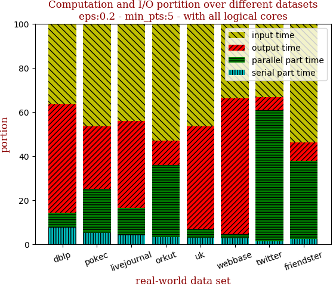 | 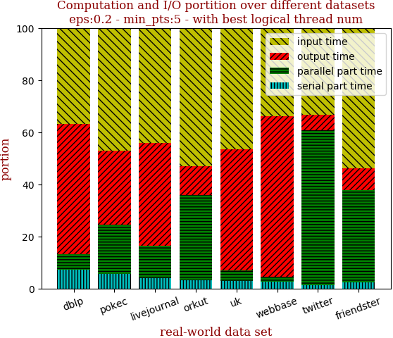

with 40 full logical threads | with best thread num
--- | ---
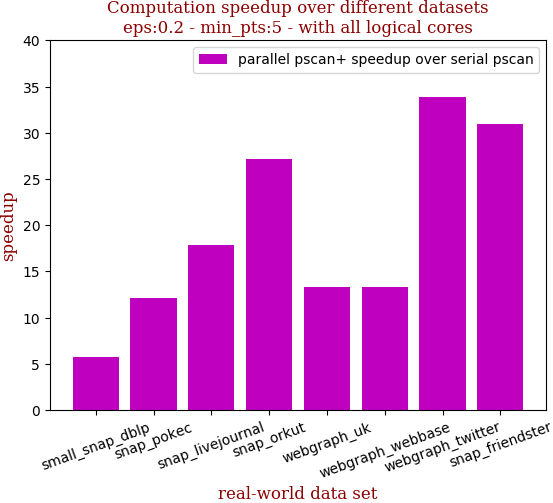 | 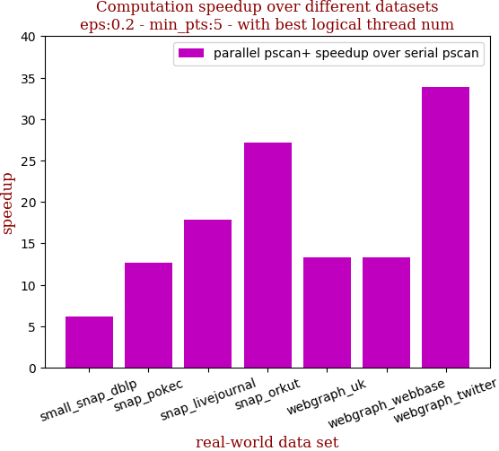

```zsh
best performance thread_num_lst:[24, 32, 40, 40, 40, 40, 40]
```

dataset | edge num | pscan runtime | pscan+ 40 logical-core full speedup | pscan+ best thread_num speedup | thread_num choice
--- | --- | --- | --- | --- | ---
small_snap_dblp | 2,099,732 | 0.504s | 5.793 | 6.222 | 24
snap_pokec | 30,282,866 | 10.004s | 12.097 | 12.647 | 32
snap_livejournal | 69,362,378 | 23.072s | 17.844 | 17.844 | 40
snap_orkut | 234,370,166 | 179.55s | 27.196 | 27.196 | 40
webgraph_uk | 301,136,554 | 26.048s | 13.276 | 13.276 | 40
webgraph_webbase | 1,050,026,736 | 81.475s | 13.326 | 13.326 | 40
webgraph_twitter | 1,369,000,750 | 2973.869s | 33.900 | 33.900 | 40

## eps:0.3

with 40 full logical threads | with best thread num
--- | ---
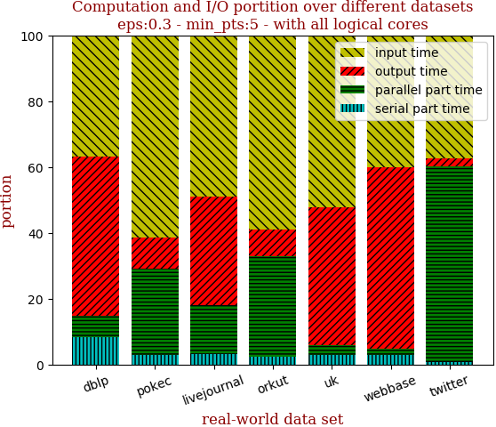 | 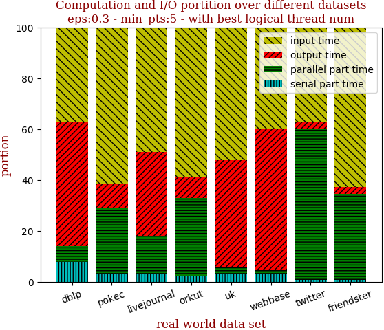

with 40 full logical threads | with best thread num
--- | ---
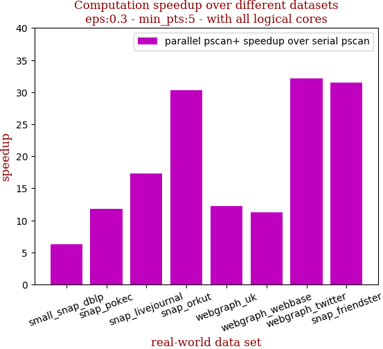 | 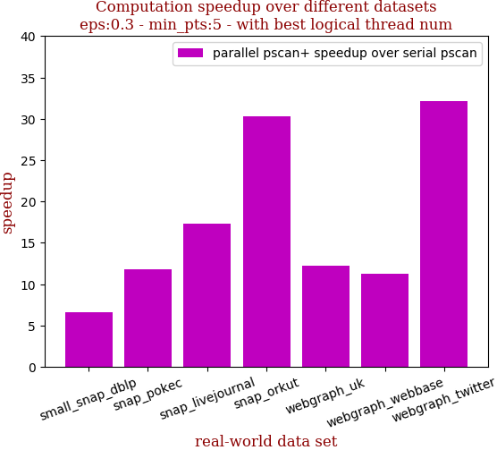

```zsh
best performance thread_num_lst:[24, 32, 40, 40, 40, 40, 40]
```

dataset | edge num | pscan runtime | pscan+ 40 logical-core full speedup | pscan+ best thread_num speedup | thread_num choice
--- | --- | --- | --- | --- | ---
small_snap_dblp | 2,099,732 | 0.555s | 6.236 | 6.607 | 24
snap_pokec | 30,282,866 | 8.597s | 11.809 | 11.842 | 32
snap_livejournal | 69,362,378 | 21.846s | 17.283 | 17.283 | 40
snap_orkut | 234,370,166 | 164.248s | 30.293 | 30.293 | 40
webgraph_uk | 301,136,554 | 18.498s | 12.234 | 12.234 | 40
webgraph_webbase | 1,050,026,736 | 63.705s | 11.279 | 11.279 | 40
webgraph_twitter | 1,369,000,750 | 2487.317s | 32.185 | 32.185 | 40

## eps:0.4

with 40 full logical threads | with best thread num
--- | ---
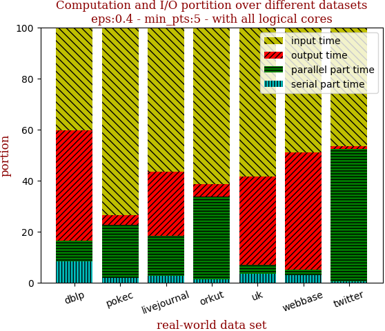 | 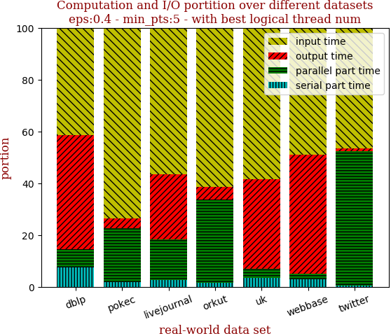

with 40 full logical threads | with best thread num
--- | ---
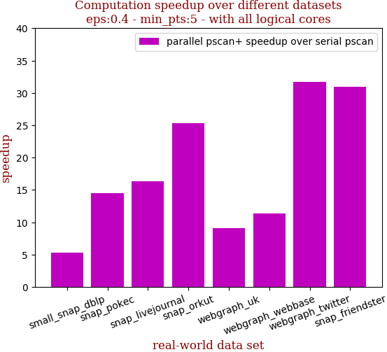 | 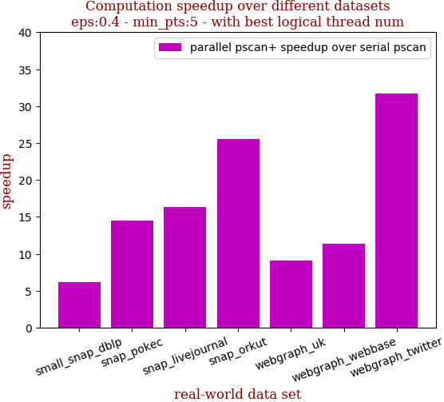

```zsh
best performance thread_num_lst:[32, 40, 40, 32, 40, 40, 40]
```

dataset | edge num | pscan runtime | pscan+ 40 logical-core full speedup | pscan+ best thread_num speedup | thread_num choice
--- | --- | --- | --- | --- | ---
small_snap_dblp | 2,099,732 | 0.491s | 5.337 | 6.215 | 32
snap_pokec | 30,282,866 | 6.82s | 14.542 | 14.542 | 40
snap_livejournal | 69,362,378 | 18.37s | 16.314 | 16.314 | 40
snap_orkut | 234,370,166 | 135.772s | 25.350 | 25.497 | 32
webgraph_uk | 301,136,554 | 14.356s | 9.127 | 9.127 | 40
webgraph_webbase | 1,050,026,736 | 52.978s | 11.415 | 11.415 | 40
webgraph_twitter | 1,369,000,750 | 1712.815s | 31.727 | 31.727 | 40

## eps:0.5

with 40 full logical threads | with best thread num
--- | ---
 | 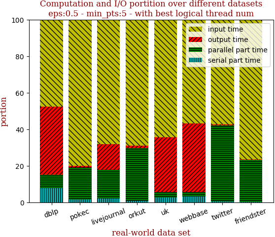

with 40 full logical threads | with best thread num
--- | ---
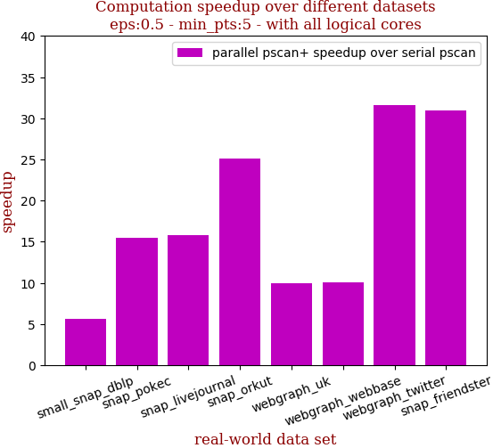 | 

```zsh
best performance thread_num_lst:[24, 40, 40, 40, 40, 40, 40]
```

dataset | edge num | pscan runtime | pscan+ 40 logical-core full speedup | pscan+ best thread_num speedup | thread_num choice
--- | --- | --- | --- | --- | ---
small_snap_dblp | 2,099,732 | 0.441s | 5.654 | 6.125 | 24
snap_pokec | 30,282,866 | 5.709s | 15.472 | 15.472 | 40
snap_livejournal | 69,362,378 | 14.317s | 15.768 | 15.768 | 40
snap_orkut | 234,370,166 | 105.36s | 25.122 | 25.122 | 40
webgraph_uk | 301,136,554 | 11.721s | 10.001 | 10.001 | 40
webgraph_webbase | 1,050,026,736 | 45.006s | 10.071 | 10.071 | 40
webgraph_twitter | 1,369,000,750 | 1112.027s | 31.627 | 31.627 | 40

## eps:0.6

with 40 full logical threads | with best thread num
--- | ---
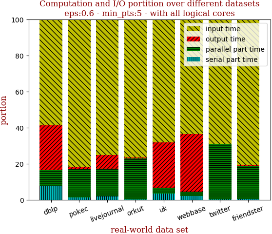 | 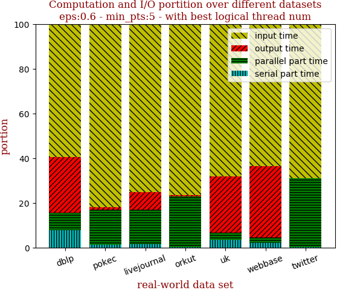

with 40 full logical threads | with best thread num
--- | ---
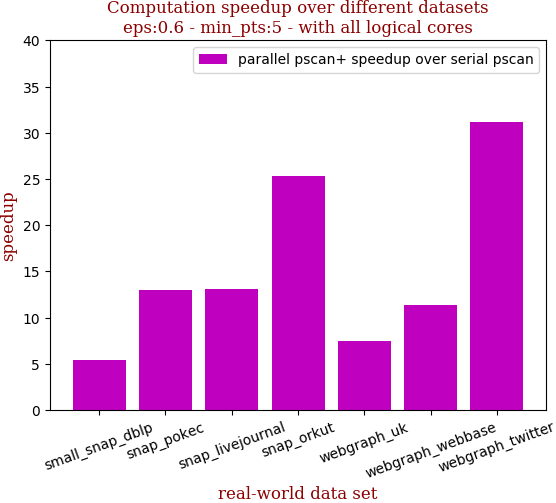 | 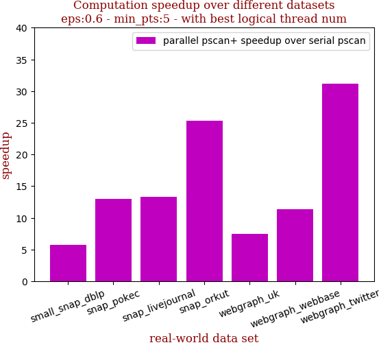

```zsh
best performance thread_num_lst:[24, 40, 32, 40, 40, 40, 40]
```

dataset | edge num | pscan runtime | pscan+ 40 logical-core full speedup | pscan+ best thread_num speedup | thread_num choice
--- | --- | --- | --- | --- | ---
small_snap_dblp | 2,099,732 | 0.346s | 5.406 | 5.767 | 24
snap_pokec | 30,282,866 | 4.122s | 13.003 | 13.003 | 40
snap_livejournal | 69,362,378 | 10.49s | 13.112 | 13.363 | 32
snap_orkut | 234,370,166 | 73.887s | 25.365 | 25.365 | 40
webgraph_uk | 301,136,554 | 9.737s | 7.496 | 7.496 | 40
webgraph_webbase | 1,050,026,736 | 37.624s | 11.353 | 11.353 | 40
webgraph_twitter | 1,369,000,750 | 671.103s | 31.200 | 31.200 | 40

## eps:0.7

with 40 full logical threads | with best thread num
--- | ---
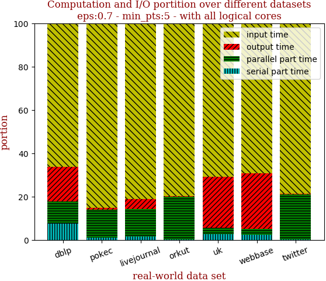 | 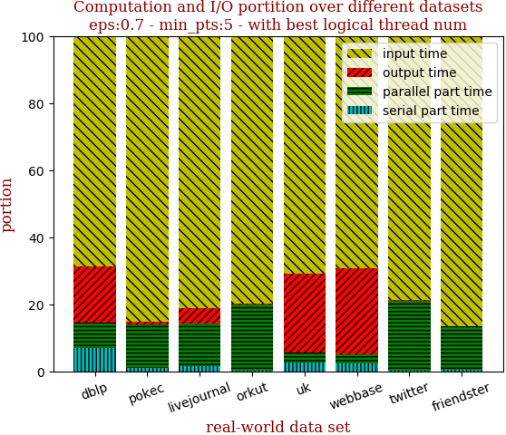

with 40 full logical threads | with best thread num
--- | ---
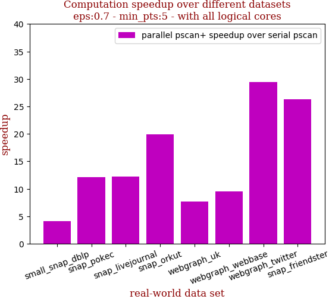 | 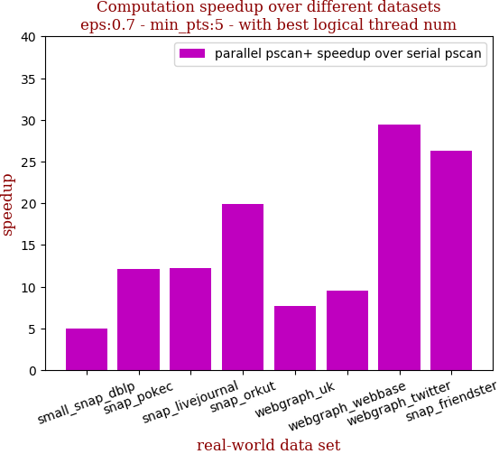

```zsh
best performance thread_num_lst:[24, 40, 40, 40, 40, 40, 40]
```

dataset | edge num | pscan runtime | pscan+ 40 logical-core full speedup | pscan+ best thread_num speedup | thread_num choice
--- | --- | --- | --- | --- | ---
small_snap_dblp | 2,099,732 | 0.245s | 4.083 | 5.000 | 24
snap_pokec | 30,282,866 | 3.098s | 12.149 | 12.149 | 40
snap_livejournal | 69,362,378 | 7.404s | 12.238 | 12.238 | 40
snap_orkut | 234,370,166 | 48.46s | 19.951 | 19.951 | 40
webgraph_uk | 301,136,554 | 8.152s | 7.647 | 7.647 | 40
webgraph_webbase | 1,050,026,736 | 31.675s | 9.538 | 9.538 | 40
webgraph_twitter | 1,369,000,750 | 378.662s | 29.459 | 29.459 | 40

## eps:0.8

with 40 full logical threads | with best thread num
--- | ---
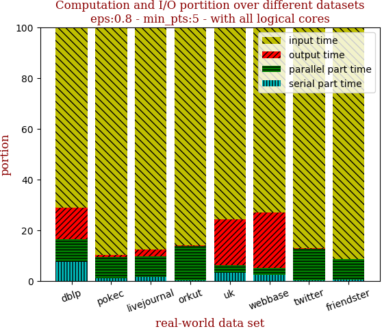 | 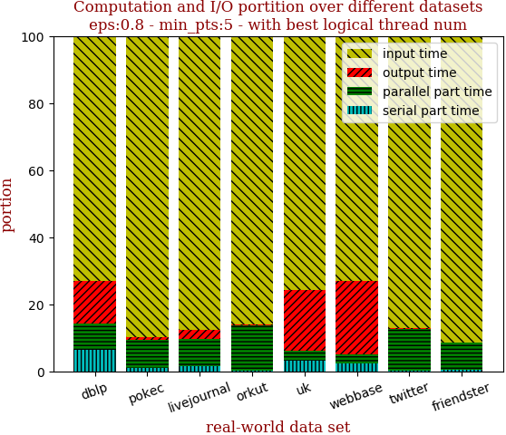

with 40 full logical threads | with best thread num
--- | ---
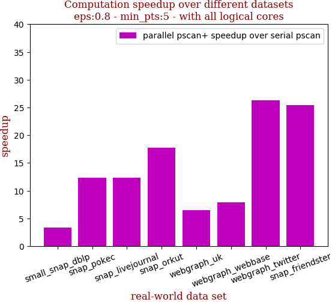 | 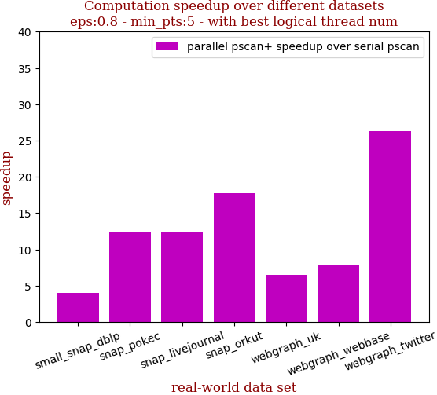

```zsh
best performance thread_num_lst:[32, 40, 40, 40, 40, 40, 40]
```

dataset | edge num | pscan runtime | pscan+ 40 logical-core full speedup | pscan+ best thread_num speedup | thread_num choice
--- | --- | --- | --- | --- | ---
small_snap_dblp | 2,099,732 | 0.183s | 3.389 | 3.978 | 32
snap_pokec | 30,282,866 | 2.009s | 12.325 | 12.325 | 40
snap_livejournal | 69,362,378 | 4.797s | 12.395 | 12.395 | 40
snap_orkut | 234,370,166 | 27.708s | 17.762 | 17.762 | 40
webgraph_uk | 301,136,554 | 7.054s | 6.525 | 6.525 | 40
webgraph_webbase | 1,050,026,736 | 25.399s | 7.915 | 7.915 | 40
webgraph_twitter | 1,369,000,750 | 183.012s | 26.352 | 26.352 | 40

## eps:0.9

with 40 full logical threads | with best thread num
--- | ---
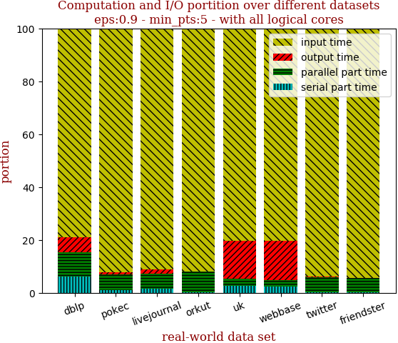 | 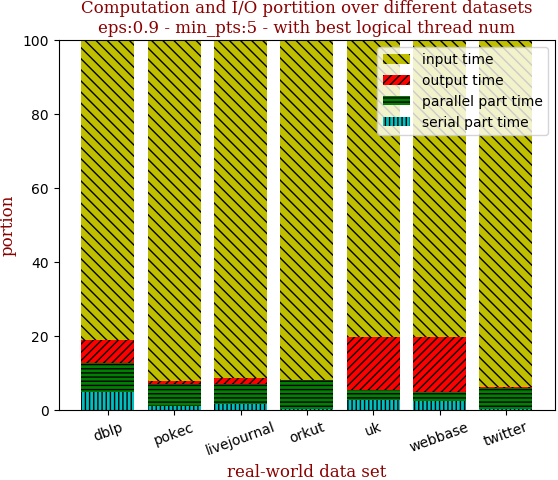

with 40 full logical threads | with best thread num
--- | ---
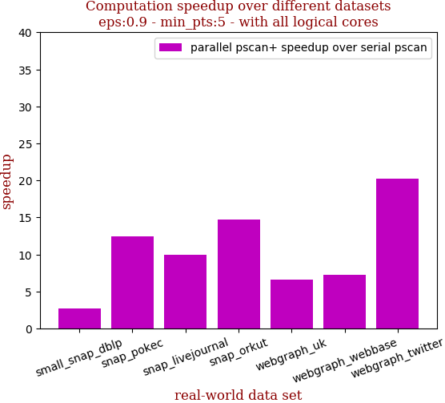 | 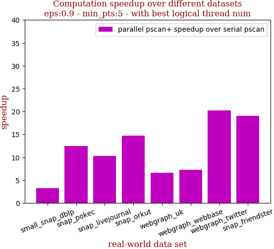

```zsh
best performance thread_num_lst:[16, 40, 32, 40, 40, 40, 40]
```

dataset | edge num | pscan runtime | pscan+ 40 logical-core full speedup | pscan+ best thread_num speedup | thread_num choice
--- | --- | --- | --- | --- | ---
small_snap_dblp | 2,099,732 | 0.121s | 2.689 | 3.270 | 16
snap_pokec | 30,282,866 | 1.453s | 12.419 | 12.419 | 40
snap_livejournal | 69,362,378 | 2.753s | 9.975 | 10.311 | 32
snap_orkut | 234,370,166 | 12.535s | 14.678 | 14.678 | 40
webgraph_uk | 301,136,554 | 5.814s | 6.660 | 6.660 | 40
webgraph_webbase | 1,050,026,736 | 20.091s | 7.271 | 7.271 | 40
webgraph_twitter | 1,369,000,750 | 61.578s | 20.249 | 20.249 | 40

