## eps:0.1

overview | speedup
--- | ---
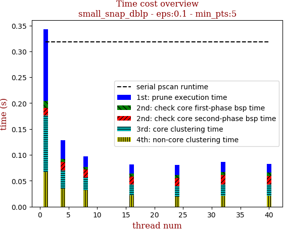 | 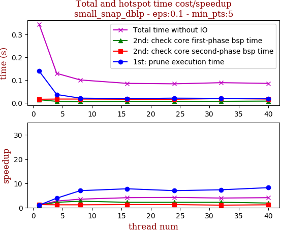

thread_num | prune | check-core 1st bsp | check-core 2nd bsp | cluster-core | cluster-non-core | total | total speedup
--- | --- | --- | --- | --- | --- | --- | ---
1 | 0.139s | 0.013s | 0.015s | 0.109s | 0.067s | 0.345s | 1.000
4 | 0.036s | 0.006s | 0.016s | 0.035s | 0.035s | 0.129s | 2.674
8 | 0.02s | 0.005s | 0.016s | 0.024s | 0.032s | 0.1s | 3.450
16 | 0.018s | 0.006s | 0.015s | 0.021s | 0.022s | 0.085s | 4.059
24 | 0.02s | 0.006s | 0.015s | 0.021s | 0.019s | 0.083s | 4.157
32 | 0.019s | 0.006s | 0.018s | 0.022s | 0.021s | 0.088s | 3.920
40 | 0.017s | 0.007s | 0.016s | 0.022s | 0.021s | 0.085s | 4.059

## eps:0.2

overview | speedup
--- | ---
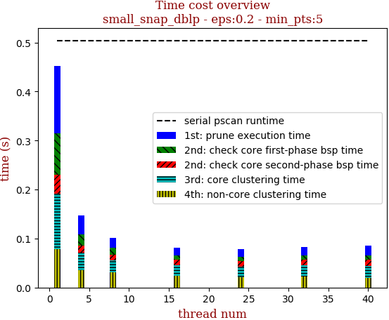 | 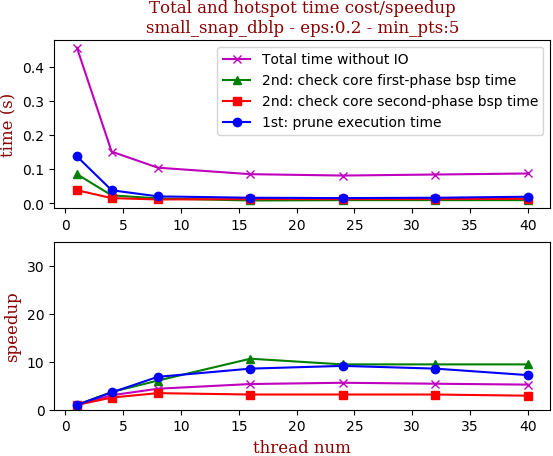

thread_num | prune | check-core 1st bsp | check-core 2nd bsp | cluster-core | cluster-non-core | total | total speedup
--- | --- | --- | --- | --- | --- | --- | ---
1 | 0.137s | 0.085s | 0.038s | 0.113s | 0.079s | 0.455s | 1.000
4 | 0.038s | 0.023s | 0.015s | 0.035s | 0.036s | 0.151s | 3.013
8 | 0.02s | 0.014s | 0.011s | 0.025s | 0.031s | 0.104s | 4.375
16 | 0.016s | 0.008s | 0.012s | 0.021s | 0.024s | 0.085s | 5.353
24 | 0.015s | 0.009s | 0.012s | 0.021s | 0.021s | 0.081s | 5.617
32 | 0.016s | 0.009s | 0.012s | 0.023s | 0.022s | 0.084s | 5.417
40 | 0.019s | 0.009s | 0.013s | 0.024s | 0.02s | 0.087s | 5.230

## eps:0.3

overview | speedup
--- | ---
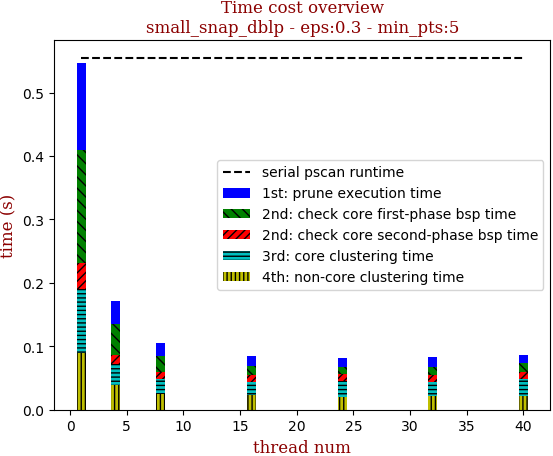 | 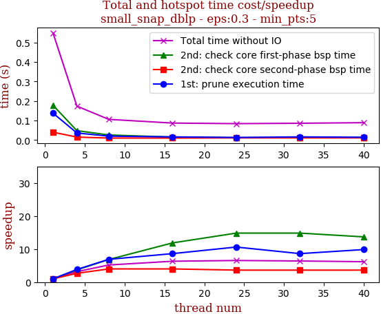

thread_num | prune | check-core 1st bsp | check-core 2nd bsp | cluster-core | cluster-non-core | total | total speedup
--- | --- | --- | --- | --- | --- | --- | ---
1 | 0.138s | 0.178s | 0.04s | 0.102s | 0.089s | 0.55s | 1.000
4 | 0.036s | 0.048s | 0.015s | 0.033s | 0.039s | 0.174s | 3.161
8 | 0.02s | 0.026s | 0.01s | 0.024s | 0.025s | 0.106s | 5.189
16 | 0.016s | 0.015s | 0.01s | 0.021s | 0.023s | 0.087s | 6.322
24 | 0.013s | 0.012s | 0.011s | 0.025s | 0.02s | 0.084s | 6.548
32 | 0.016s | 0.012s | 0.011s | 0.022s | 0.022s | 0.086s | 6.395
40 | 0.014s | 0.013s | 0.011s | 0.027s | 0.022s | 0.089s | 6.180

## eps:0.4

overview | speedup
--- | ---
 | 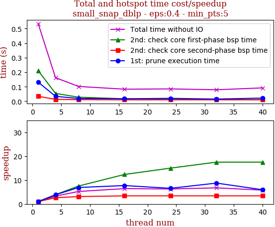

thread_num | prune | check-core 1st bsp | check-core 2nd bsp | cluster-core | cluster-non-core | total | total speedup
--- | --- | --- | --- | --- | --- | --- | ---
1 | 0.131s | 0.21s | 0.034s | 0.078s | 0.078s | 0.533s | 1.000
4 | 0.034s | 0.054s | 0.013s | 0.028s | 0.03s | 0.162s | 3.290
8 | 0.019s | 0.028s | 0.011s | 0.019s | 0.022s | 0.102s | 5.225
16 | 0.017s | 0.017s | 0.01s | 0.018s | 0.019s | 0.083s | 6.422
24 | 0.02s | 0.014s | 0.01s | 0.019s | 0.019s | 0.085s | 6.271
32 | 0.015s | 0.012s | 0.01s | 0.02s | 0.019s | 0.079s | 6.747
40 | 0.022s | 0.012s | 0.01s | 0.024s | 0.02s | 0.092s | 5.793

## eps:0.5

overview | speedup
--- | ---
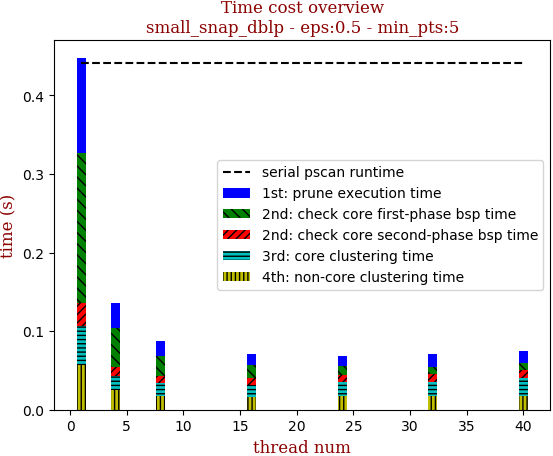 | 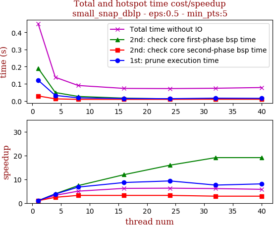

thread_num | prune | check-core 1st bsp | check-core 2nd bsp | cluster-core | cluster-non-core | total | total speedup
--- | --- | --- | --- | --- | --- | --- | ---
1 | 0.121s | 0.191s | 0.029s | 0.05s | 0.057s | 0.451s | 1.000
4 | 0.032s | 0.049s | 0.012s | 0.018s | 0.025s | 0.138s | 3.268
8 | 0.018s | 0.026s | 0.009s | 0.016s | 0.018s | 0.09s | 5.011
16 | 0.014s | 0.016s | 0.009s | 0.016s | 0.016s | 0.073s | 6.178
24 | 0.013s | 0.012s | 0.009s | 0.017s | 0.018s | 0.072s | 6.264
32 | 0.016s | 0.01s | 0.01s | 0.017s | 0.018s | 0.074s | 6.095
40 | 0.015s | 0.01s | 0.01s | 0.022s | 0.018s | 0.078s | 5.782

## eps:0.6

overview | speedup
--- | ---
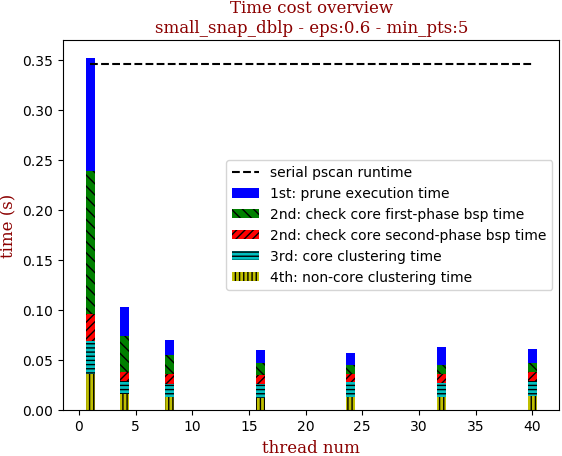 | 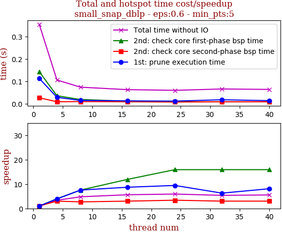

thread_num | prune | check-core 1st bsp | check-core 2nd bsp | cluster-core | cluster-non-core | total | total speedup
--- | --- | --- | --- | --- | --- | --- | ---
1 | 0.113s | 0.143s | 0.027s | 0.033s | 0.036s | 0.354s | 1.000
4 | 0.029s | 0.036s | 0.009s | 0.013s | 0.016s | 0.106s | 3.340
8 | 0.015s | 0.019s | 0.01s | 0.013s | 0.013s | 0.074s | 4.784
16 | 0.013s | 0.012s | 0.009s | 0.014s | 0.012s | 0.063s | 5.619
24 | 0.012s | 0.009s | 0.008s | 0.015s | 0.013s | 0.06s | 5.900
32 | 0.018s | 0.009s | 0.009s | 0.014s | 0.013s | 0.066s | 5.364
40 | 0.014s | 0.009s | 0.009s | 0.015s | 0.014s | 0.064s | 5.531

## eps:0.7

overview | speedup
--- | ---
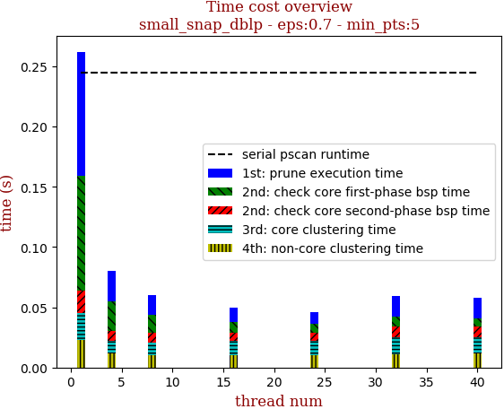 | 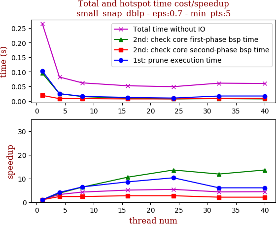

thread_num | prune | check-core 1st bsp | check-core 2nd bsp | cluster-core | cluster-non-core | total | total speedup
--- | --- | --- | --- | --- | --- | --- | ---
1 | 0.103s | 0.095s | 0.019s | 0.022s | 0.023s | 0.265s | 1.000
4 | 0.025s | 0.025s | 0.008s | 0.01s | 0.012s | 0.082s | 3.232
8 | 0.016s | 0.015s | 0.008s | 0.011s | 0.01s | 0.062s | 4.274
16 | 0.012s | 0.009s | 0.007s | 0.012s | 0.01s | 0.052s | 5.096
24 | 0.01s | 0.007s | 0.007s | 0.012s | 0.01s | 0.049s | 5.408
32 | 0.017s | 0.008s | 0.009s | 0.014s | 0.011s | 0.061s | 4.344
40 | 0.017s | 0.007s | 0.009s | 0.013s | 0.012s | 0.06s | 4.417

## eps:0.8

overview | speedup
--- | ---
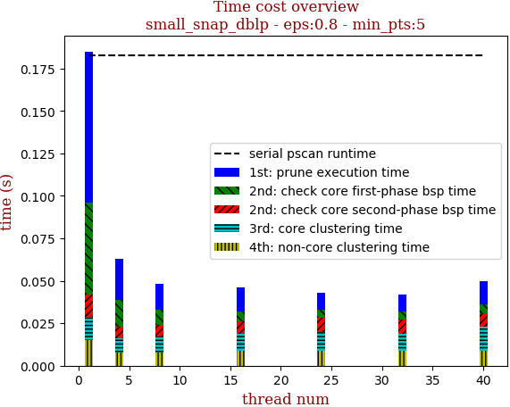 | 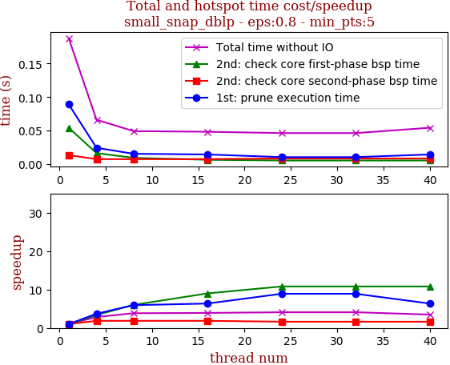

thread_num | prune | check-core 1st bsp | check-core 2nd bsp | cluster-core | cluster-non-core | total | total speedup
--- | --- | --- | --- | --- | --- | --- | ---
1 | 0.089s | 0.054s | 0.013s | 0.014s | 0.015s | 0.188s | 1.000
4 | 0.024s | 0.016s | 0.007s | 0.008s | 0.008s | 0.066s | 2.848
8 | 0.015s | 0.009s | 0.007s | 0.009s | 0.008s | 0.049s | 3.837
16 | 0.014s | 0.006s | 0.007s | 0.01s | 0.009s | 0.048s | 3.917
24 | 0.01s | 0.005s | 0.008s | 0.011s | 0.009s | 0.046s | 4.087
32 | 0.01s | 0.005s | 0.008s | 0.01s | 0.009s | 0.046s | 4.087
40 | 0.014s | 0.005s | 0.008s | 0.014s | 0.009s | 0.054s | 3.481

## eps:0.9

overview | speedup
--- | ---
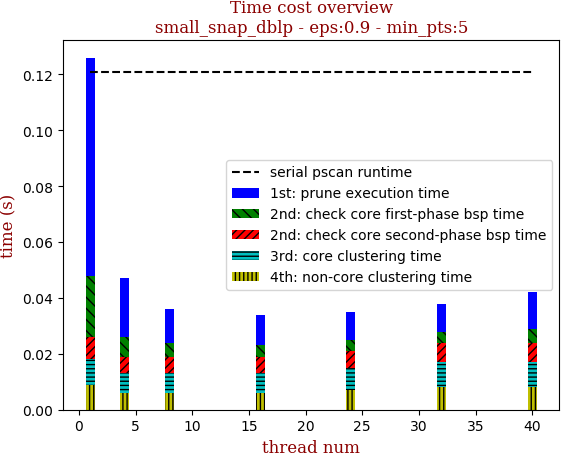 | 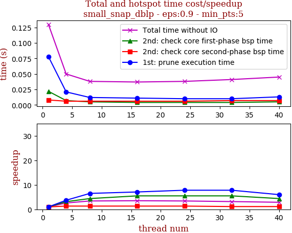

thread_num | prune | check-core 1st bsp | check-core 2nd bsp | cluster-core | cluster-non-core | total | total speedup
--- | --- | --- | --- | --- | --- | --- | ---
1 | 0.078s | 0.022s | 0.008s | 0.009s | 0.009s | 0.13s | 1.000
4 | 0.021s | 0.007s | 0.006s | 0.007s | 0.006s | 0.05s | 2.600
8 | 0.012s | 0.005s | 0.006s | 0.007s | 0.006s | 0.038s | 3.421
16 | 0.011s | 0.004s | 0.006s | 0.007s | 0.006s | 0.037s | 3.514
24 | 0.01s | 0.004s | 0.006s | 0.008s | 0.007s | 0.038s | 3.421
32 | 0.01s | 0.004s | 0.007s | 0.009s | 0.008s | 0.041s | 3.171
40 | 0.013s | 0.005s | 0.007s | 0.009s | 0.008s | 0.045s | 2.889

