## eps:0.1

overview | speedup
--- | ---
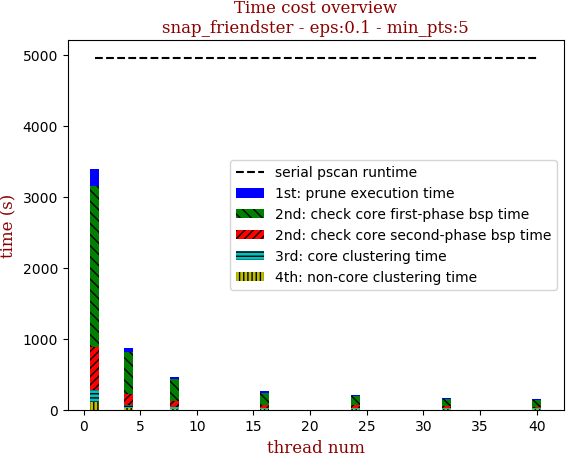 | 

thread_num | prune | check-core 1st bsp | check-core 2nd bsp | cluster-core | cluster-non-core | total | total speedup
--- | --- | --- | --- | --- | --- | --- | ---
1 | 236.451s | 2260.726s | 608.214s | 170.05s | 111.497s | 3386.941s | 1.000
4 | 52.676s | 585.039s | 155.913s | 39.904s | 30.919s | 864.456s | 3.918
8 | 30.4s | 307.68s | 82.331s | 20.685s | 16.051s | 457.151s | 7.409
16 | 17.277s | 168.864s | 45.706s | 15.413s | 10.134s | 257.398s | 13.158
24 | 13.915s | 127.074s | 34.508s | 11.952s | 13.69s | 201.153s | 16.838
32 | 10.576s | 106.306s | 27.457s | 8.777s | 9.875s | 163.0s | 20.779
40 | 9.6s | 95.502s | 23.415s | 9.391s | 8.884s | 146.804s | 23.071

## eps:0.2

overview | speedup
--- | ---
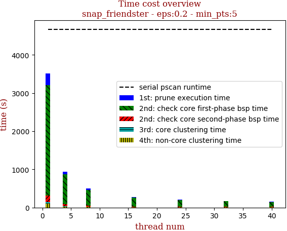 | 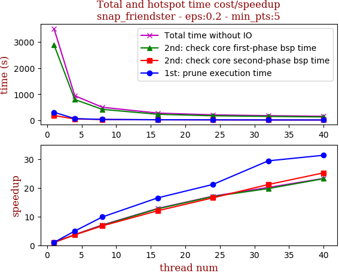

thread_num | prune | check-core 1st bsp | check-core 2nd bsp | cluster-core | cluster-non-core | total | total speedup
--- | --- | --- | --- | --- | --- | --- | ---
1 | 304.591s | 2894.114s | 178.942s | 35.591s | 100.148s | 3513.389s | 1.000
4 | 61.461s | 793.829s | 49.227s | 9.611s | 25.939s | 940.076s | 3.737
8 | 30.874s | 416.016s | 26.411s | 5.836s | 16.694s | 495.839s | 7.086
16 | 18.455s | 228.013s | 14.883s | 3.167s | 9.506s | 274.034s | 12.821
24 | 14.378s | 170.527s | 10.827s | 2.878s | 6.785s | 205.399s | 17.105
32 | 10.363s | 146.64s | 8.461s | 2.334s | 6.64s | 174.441s | 20.141
40 | 9.721s | 124.87s | 7.097s | 1.999s | 7.264s | 150.962s | 23.273

## eps:0.3

overview | speedup
--- | ---
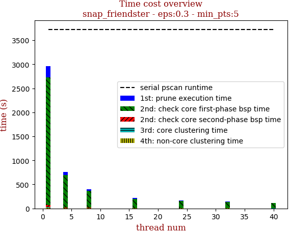 | 

thread_num | prune | check-core 1st bsp | check-core 2nd bsp | cluster-core | cluster-non-core | total | total speedup
--- | --- | --- | --- | --- | --- | --- | ---
1 | 232.781s | 2651.962s | 46.258s | 5.842s | 20.248s | 2957.095s | 1.000
4 | 60.897s | 675.066s | 11.672s | 2.189s | 7.376s | 757.206s | 3.905
8 | 30.01s | 356.01s | 6.448s | 1.439s | 6.694s | 400.603s | 7.382
16 | 16.543s | 193.838s | 3.515s | 1.027s | 4.988s | 219.914s | 13.447
24 | 13.144s | 144.264s | 2.6s | 0.897s | 4.568s | 165.476s | 17.870
32 | 10.218s | 125.032s | 2.234s | 0.784s | 3.052s | 141.324s | 20.924
40 | 9.302s | 104.898s | 1.678s | 0.38s | 2.021s | 118.281s | 25.001

## eps:0.4

overview | speedup
--- | ---
 | 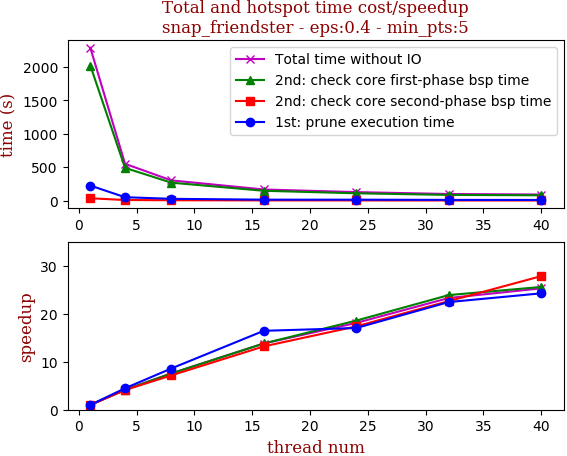

thread_num | prune | check-core 1st bsp | check-core 2nd bsp | cluster-core | cluster-non-core | total | total speedup
--- | --- | --- | --- | --- | --- | --- | ---
1 | 224.201s | 2018.778s | 34.258s | 1.079s | 6.012s | 2284.333s | 1.000
4 | 50.183s | 488.818s | 8.359s | 0.58s | 2.029s | 549.973s | 4.154
8 | 26.111s | 267.63s | 4.789s | 0.515s | 2.759s | 301.808s | 7.569
16 | 13.638s | 146.326s | 2.597s | 0.421s | 2.623s | 165.61s | 13.793
24 | 13.172s | 108.715s | 1.973s | 0.19s | 2.26s | 126.315s | 18.084
32 | 9.996s | 84.532s | 1.514s | 0.335s | 1.775s | 98.156s | 23.272
40 | 9.246s | 78.926s | 1.231s | 0.179s | 0.768s | 90.353s | 25.282

## eps:0.5

overview | speedup
--- | ---
 | 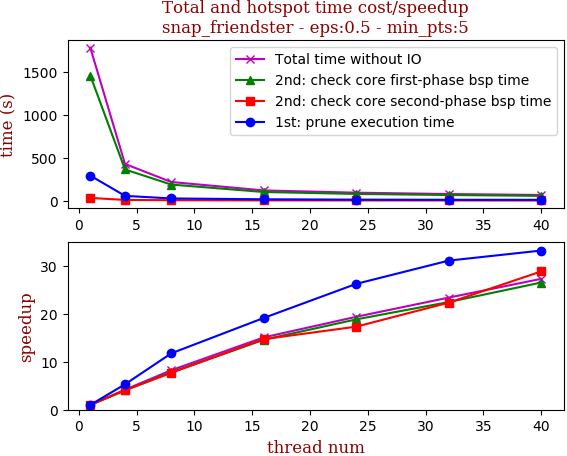

thread_num | prune | check-core 1st bsp | check-core 2nd bsp | cluster-core | cluster-non-core | total | total speedup
--- | --- | --- | --- | --- | --- | --- | ---
1 | 290.352s | 1454.909s | 30.803s | 0.521s | 1.368s | 1777.956s | 1.000
4 | 54.818s | 362.006s | 7.558s | 0.385s | 1.175s | 425.945s | 4.174
8 | 24.719s | 186.367s | 4.012s | 0.36s | 0.72s | 216.181s | 8.224
16 | 15.186s | 99.825s | 2.095s | 0.344s | 0.534s | 117.986s | 15.069
24 | 11.073s | 77.299s | 1.78s | 0.343s | 1.327s | 91.827s | 19.362
32 | 9.346s | 64.856s | 1.381s | 0.183s | 0.342s | 76.112s | 23.360
40 | 8.756s | 54.9s | 1.069s | 0.143s | 0.335s | 65.206s | 27.267

## eps:0.6

overview | speedup
--- | ---
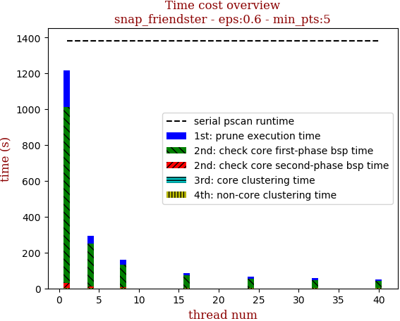 | 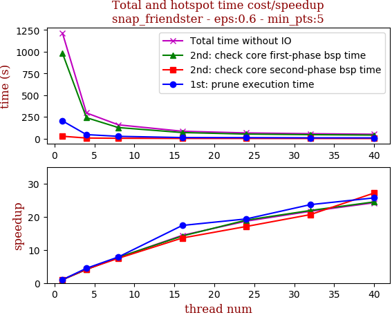

thread_num | prune | check-core 1st bsp | check-core 2nd bsp | cluster-core | cluster-non-core | total | total speedup
--- | --- | --- | --- | --- | --- | --- | ---
1 | 203.471s | 982.12s | 26.715s | 0.384s | 2.082s | 1214.775s | 1.000
4 | 45.74s | 240.584s | 6.422s | 0.342s | 2.169s | 295.259s | 4.114
8 | 25.875s | 126.683s | 3.578s | 0.336s | 1.582s | 158.057s | 7.686
16 | 11.714s | 69.23s | 1.967s | 0.34s | 1.141s | 84.394s | 14.394
24 | 10.523s | 51.744s | 1.566s | 0.343s | 0.909s | 65.088s | 18.664
32 | 8.607s | 44.901s | 1.295s | 0.176s | 1.185s | 56.166s | 21.628
40 | 7.923s | 40.134s | 0.984s | 0.16s | 0.968s | 50.171s | 24.213

## eps:0.7

overview | speedup
--- | ---
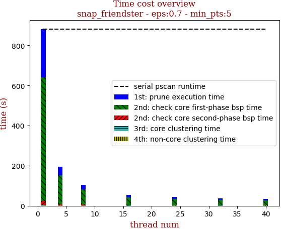 | 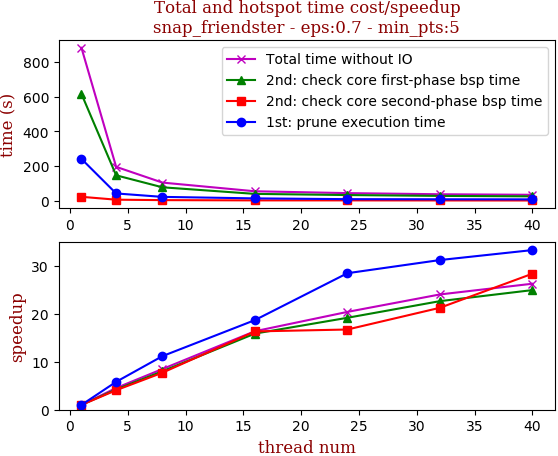

thread_num | prune | check-core 1st bsp | check-core 2nd bsp | cluster-core | cluster-non-core | total | total speedup
--- | --- | --- | --- | --- | --- | --- | ---
1 | 240.622s | 615.481s | 21.957s | 0.344s | 3.022s | 881.429s | 1.000
4 | 41.406s | 145.914s | 5.408s | 0.327s | 1.706s | 194.764s | 4.526
8 | 21.56s | 76.832s | 2.849s | 0.336s | 2.425s | 104.006s | 8.475
16 | 12.89s | 38.808s | 1.346s | 0.344s | 0.519s | 53.91s | 16.350
24 | 8.461s | 32.136s | 1.314s | 0.326s | 1.014s | 43.254s | 20.378
32 | 7.717s | 27.211s | 1.034s | 0.223s | 0.517s | 36.705s | 24.014
40 | 7.235s | 24.697s | 0.775s | 0.136s | 0.733s | 33.58s | 26.249

## eps:0.8

overview | speedup
--- | ---
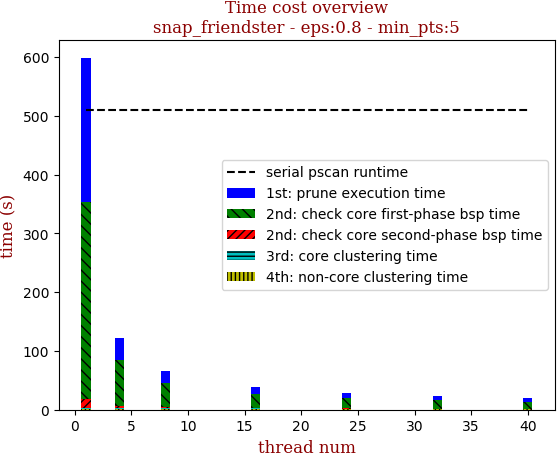 | 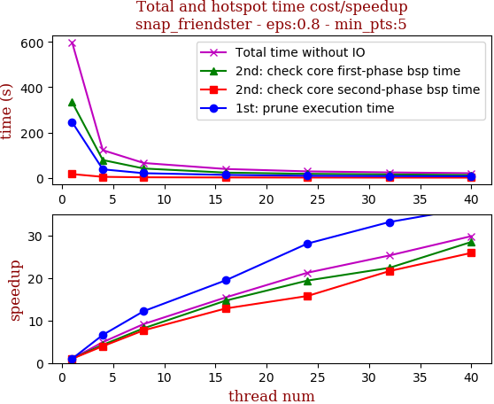

thread_num | prune | check-core 1st bsp | check-core 2nd bsp | cluster-core | cluster-non-core | total | total speedup
--- | --- | --- | --- | --- | --- | --- | ---
1 | 245.96s | 334.277s | 16.233s | 0.33s | 1.798s | 598.6s | 1.000
4 | 37.235s | 78.367s | 4.11s | 0.335s | 1.905s | 121.955s | 4.908
8 | 20.165s | 40.873s | 2.111s | 0.325s | 1.801s | 65.278s | 9.170
16 | 12.656s | 22.795s | 1.266s | 0.327s | 1.777s | 38.824s | 15.418
24 | 8.757s | 17.24s | 1.03s | 0.338s | 0.825s | 28.192s | 21.233
32 | 7.42s | 14.937s | 0.751s | 0.133s | 0.429s | 23.674s | 25.285
40 | 6.737s | 11.745s | 0.627s | 0.135s | 0.825s | 20.071s | 29.824

## eps:0.9

overview | speedup
--- | ---
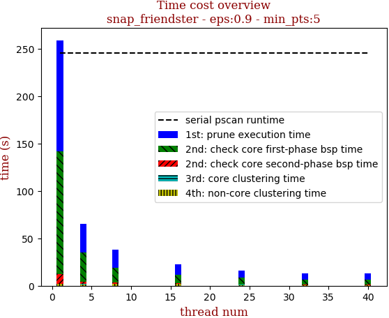 | 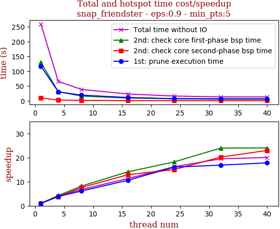

thread_num | prune | check-core 1st bsp | check-core 2nd bsp | cluster-core | cluster-non-core | total | total speedup
--- | --- | --- | --- | --- | --- | --- | ---
1 | 116.774s | 130.095s | 9.662s | 0.325s | 1.961s | 258.821s | 1.000
4 | 30.323s | 30.775s | 2.55s | 0.321s | 1.398s | 65.37s | 3.959
8 | 19.09s | 15.91s | 1.278s | 0.325s | 1.644s | 38.25s | 6.767
16 | 11.039s | 9.243s | 0.75s | 0.136s | 1.754s | 22.925s | 11.290
24 | 7.274s | 7.148s | 0.643s | 0.323s | 0.582s | 15.973s | 16.204
32 | 6.932s | 5.435s | 0.479s | 0.131s | 0.325s | 13.304s | 19.454
40 | 6.555s | 5.422s | 0.421s | 0.132s | 0.388s | 12.92s | 20.033

