## eps:0.1

overview | speedup
--- | ---
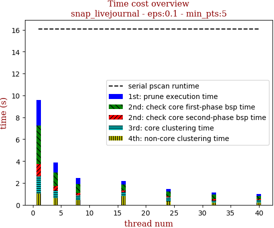 | 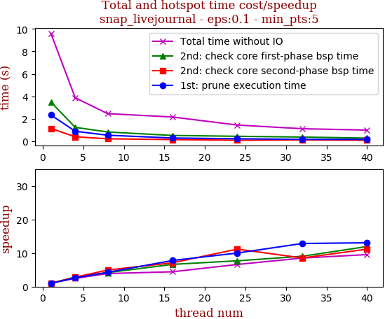

thread_num | prune | check-core 1st bsp | check-core 2nd bsp | cluster-core | cluster-non-core | total | total speedup
--- | --- | --- | --- | --- | --- | --- | ---
1 | 2.351s | 3.499s | 1.151s | 1.576s | 1.017s | 9.597s | 1.000
4 | 0.903s | 1.248s | 0.41s | 0.68s | 0.633s | 3.877s | 2.475
8 | 0.551s | 0.838s | 0.233s | 0.403s | 0.44s | 2.467s | 3.890
16 | 0.302s | 0.528s | 0.162s | 0.35s | 0.823s | 2.169s | 4.425
24 | 0.235s | 0.455s | 0.103s | 0.336s | 0.322s | 1.454s | 6.600
32 | 0.183s | 0.387s | 0.135s | 0.22s | 0.199s | 1.128s | 8.508
40 | 0.18s | 0.293s | 0.103s | 0.217s | 0.21s | 1.006s | 9.540

## eps:0.2

overview | speedup
--- | ---
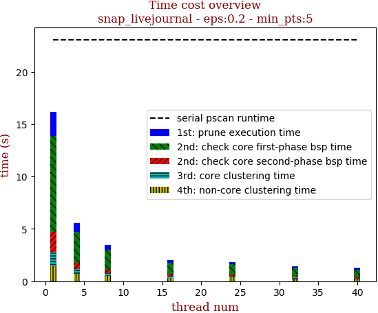 | 

thread_num | prune | check-core 1st bsp | check-core 2nd bsp | cluster-core | cluster-non-core | total | total speedup
--- | --- | --- | --- | --- | --- | --- | ---
1 | 2.285s | 9.162s | 1.884s | 1.365s | 1.458s | 16.157s | 1.000
4 | 0.871s | 2.931s | 0.58s | 0.479s | 0.699s | 5.564s | 2.904
8 | 0.469s | 1.883s | 0.324s | 0.287s | 0.488s | 3.454s | 4.678
16 | 0.296s | 1.047s | 0.192s | 0.199s | 0.299s | 2.036s | 7.936
24 | 0.202s | 0.962s | 0.14s | 0.137s | 0.376s | 1.82s | 8.877
32 | 0.189s | 0.758s | 0.123s | 0.174s | 0.207s | 1.455s | 11.104
40 | 0.179s | 0.688s | 0.112s | 0.14s | 0.17s | 1.293s | 12.496

## eps:0.3

overview | speedup
--- | ---
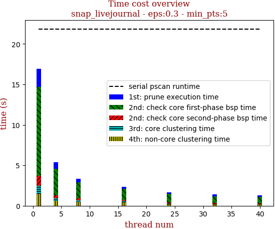 | 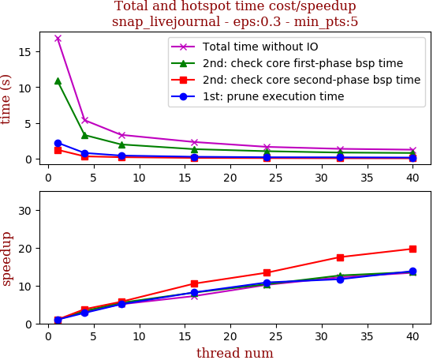

thread_num | prune | check-core 1st bsp | check-core 2nd bsp | cluster-core | cluster-non-core | total | total speedup
--- | --- | --- | --- | --- | --- | --- | ---
1 | 2.254s | 10.944s | 1.261s | 1.008s | 1.451s | 16.92s | 1.000
4 | 0.808s | 3.314s | 0.334s | 0.341s | 0.593s | 5.393s | 3.137
8 | 0.444s | 2.001s | 0.22s | 0.218s | 0.456s | 3.343s | 5.061
16 | 0.275s | 1.342s | 0.12s | 0.155s | 0.448s | 2.342s | 7.225
24 | 0.208s | 1.055s | 0.094s | 0.102s | 0.198s | 1.66s | 10.193
32 | 0.193s | 0.864s | 0.072s | 0.092s | 0.162s | 1.386s | 12.208
40 | 0.163s | 0.805s | 0.064s | 0.09s | 0.14s | 1.264s | 13.386

## eps:0.4

overview | speedup
--- | ---
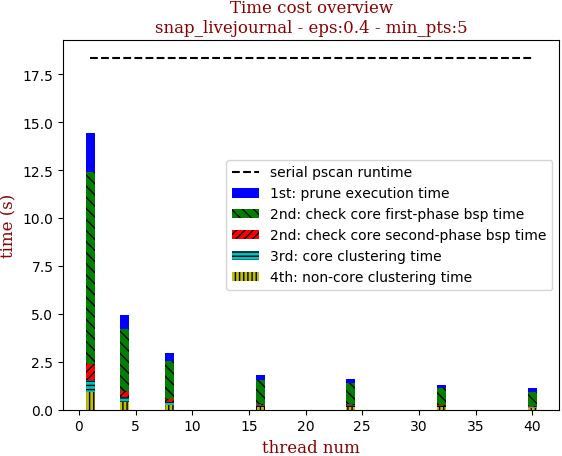 | 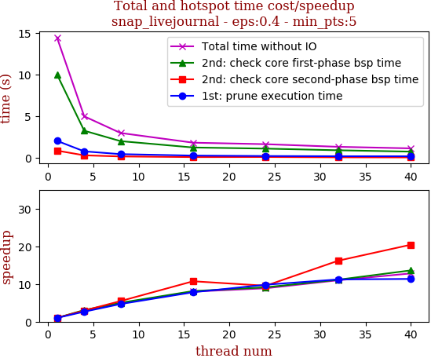

thread_num | prune | check-core 1st bsp | check-core 2nd bsp | cluster-core | cluster-non-core | total | total speedup
--- | --- | --- | --- | --- | --- | --- | ---
1 | 2.03s | 9.992s | 0.858s | 0.631s | 0.906s | 14.42s | 1.000
4 | 0.767s | 3.243s | 0.291s | 0.237s | 0.429s | 4.97s | 2.901
8 | 0.434s | 1.994s | 0.157s | 0.126s | 0.255s | 2.97s | 4.855
16 | 0.26s | 1.23s | 0.08s | 0.077s | 0.157s | 1.807s | 7.980
24 | 0.207s | 1.096s | 0.09s | 0.071s | 0.16s | 1.627s | 8.863
32 | 0.181s | 0.897s | 0.053s | 0.06s | 0.118s | 1.312s | 10.991
40 | 0.179s | 0.734s | 0.042s | 0.061s | 0.107s | 1.126s | 12.806

## eps:0.5

overview | speedup
--- | ---
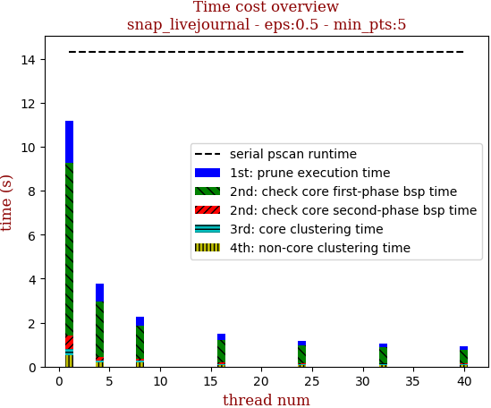 | 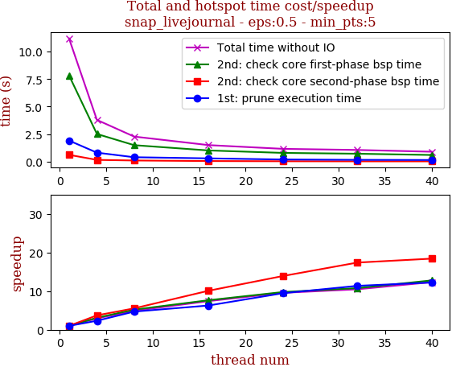

thread_num | prune | check-core 1st bsp | check-core 2nd bsp | cluster-core | cluster-non-core | total | total speedup
--- | --- | --- | --- | --- | --- | --- | ---
1 | 1.921s | 7.833s | 0.626s | 0.302s | 0.502s | 11.186s | 1.000
4 | 0.824s | 2.52s | 0.168s | 0.092s | 0.187s | 3.795s | 2.948
8 | 0.409s | 1.504s | 0.113s | 0.057s | 0.198s | 2.283s | 4.900
16 | 0.306s | 1.024s | 0.062s | 0.04s | 0.073s | 1.509s | 7.413
24 | 0.203s | 0.802s | 0.045s | 0.035s | 0.082s | 1.17s | 9.561
32 | 0.169s | 0.727s | 0.036s | 0.046s | 0.088s | 1.068s | 10.474
40 | 0.157s | 0.613s | 0.034s | 0.03s | 0.071s | 0.908s | 12.319

## eps:0.6

overview | speedup
--- | ---
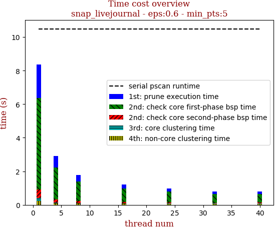 | 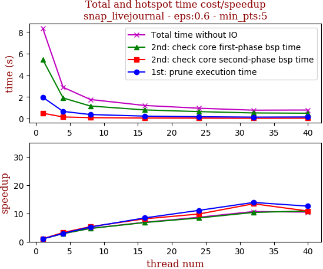

thread_num | prune | check-core 1st bsp | check-core 2nd bsp | cluster-core | cluster-non-core | total | total speedup
--- | --- | --- | --- | --- | --- | --- | ---
1 | 1.983s | 5.47s | 0.509s | 0.165s | 0.233s | 8.363s | 1.000
4 | 0.672s | 1.915s | 0.157s | 0.064s | 0.091s | 2.902s | 2.882
8 | 0.383s | 1.171s | 0.096s | 0.044s | 0.076s | 1.773s | 4.717
16 | 0.236s | 0.808s | 0.063s | 0.034s | 0.077s | 1.22s | 6.855
24 | 0.179s | 0.652s | 0.052s | 0.03s | 0.051s | 0.967s | 8.648
32 | 0.143s | 0.529s | 0.038s | 0.03s | 0.043s | 0.785s | 10.654
40 | 0.158s | 0.504s | 0.047s | 0.033s | 0.055s | 0.8s | 10.454

## eps:0.7

overview | speedup
--- | ---
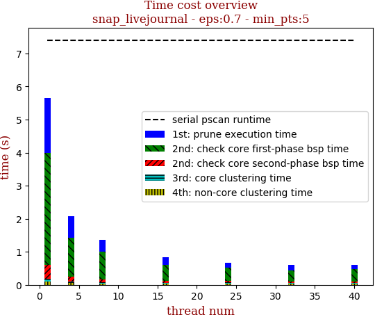 | 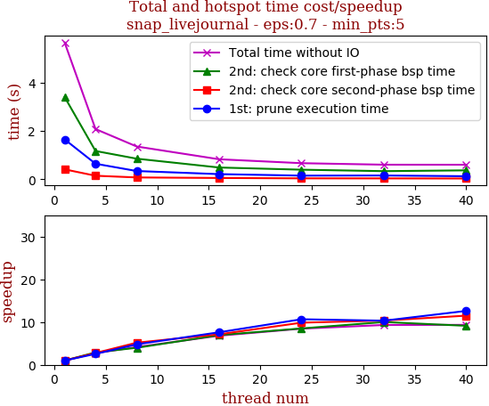

thread_num | prune | check-core 1st bsp | check-core 2nd bsp | cluster-core | cluster-non-core | total | total speedup
--- | --- | --- | --- | --- | --- | --- | ---
1 | 1.652s | 3.403s | 0.414s | 0.087s | 0.096s | 5.655s | 1.000
4 | 0.646s | 1.173s | 0.15s | 0.045s | 0.062s | 2.079s | 2.720
8 | 0.345s | 0.855s | 0.08s | 0.034s | 0.04s | 1.358s | 4.164
16 | 0.217s | 0.49s | 0.058s | 0.027s | 0.035s | 0.831s | 6.805
24 | 0.155s | 0.4s | 0.042s | 0.028s | 0.041s | 0.669s | 8.453
32 | 0.16s | 0.34s | 0.04s | 0.026s | 0.038s | 0.607s | 9.316
40 | 0.131s | 0.373s | 0.036s | 0.025s | 0.037s | 0.605s | 9.347

## eps:0.8

overview | speedup
--- | ---
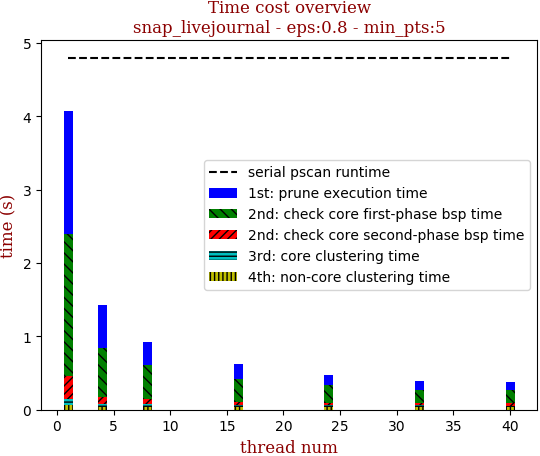 | 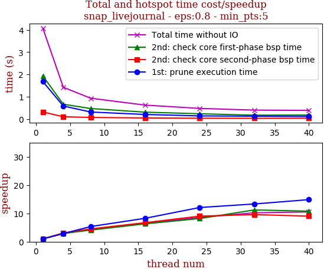

thread_num | prune | check-core 1st bsp | check-core 2nd bsp | cluster-core | cluster-non-core | total | total speedup
--- | --- | --- | --- | --- | --- | --- | ---
1 | 1.679s | 1.93s | 0.316s | 0.076s | 0.07s | 4.073s | 1.000
4 | 0.583s | 0.663s | 0.102s | 0.035s | 0.038s | 1.424s | 2.860
8 | 0.314s | 0.47s | 0.07s | 0.033s | 0.042s | 0.932s | 4.370
16 | 0.203s | 0.306s | 0.047s | 0.026s | 0.037s | 0.623s | 6.538
24 | 0.139s | 0.236s | 0.035s | 0.026s | 0.037s | 0.475s | 8.575
32 | 0.126s | 0.172s | 0.033s | 0.026s | 0.039s | 0.399s | 10.208
40 | 0.113s | 0.179s | 0.035s | 0.024s | 0.033s | 0.387s | 10.525

## eps:0.9

overview | speedup
--- | ---
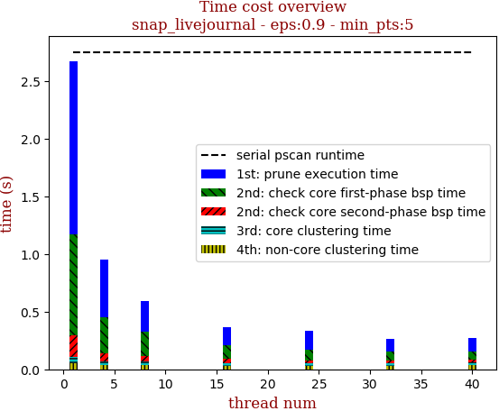 | 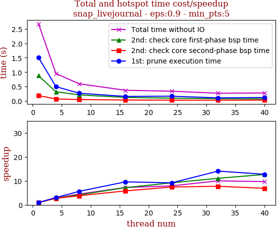

thread_num | prune | check-core 1st bsp | check-core 2nd bsp | cluster-core | cluster-non-core | total | total speedup
--- | --- | --- | --- | --- | --- | --- | ---
1 | 1.505s | 0.874s | 0.186s | 0.055s | 0.053s | 2.674s | 1.000
4 | 0.497s | 0.318s | 0.068s | 0.032s | 0.035s | 0.952s | 2.809
8 | 0.268s | 0.209s | 0.049s | 0.029s | 0.037s | 0.595s | 4.494
16 | 0.157s | 0.122s | 0.032s | 0.024s | 0.032s | 0.37s | 7.227
24 | 0.164s | 0.095s | 0.025s | 0.02s | 0.032s | 0.338s | 7.911
32 | 0.107s | 0.079s | 0.024s | 0.022s | 0.033s | 0.267s | 10.015
40 | 0.118s | 0.069s | 0.027s | 0.024s | 0.034s | 0.276s | 9.688

