## eps:0.1

overview | speedup
--- | ---
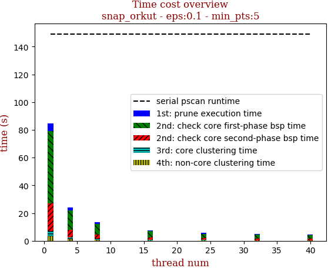 | 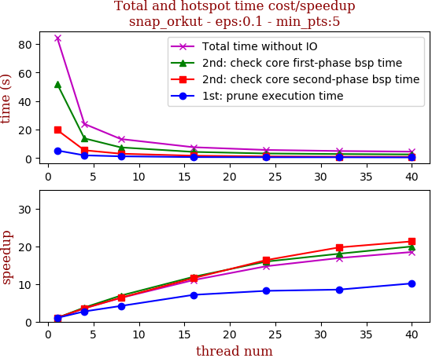

thread_num | prune | check-core 1st bsp | check-core 2nd bsp | cluster-core | cluster-non-core | total | total speedup
--- | --- | --- | --- | --- | --- | --- | ---
1 | 5.378s | 52.128s | 19.77s | 3.893s | 3.317s | 84.49s | 1.000
4 | 1.98s | 13.858s | 5.534s | 1.387s | 1.217s | 23.979s | 3.523
8 | 1.29s | 7.532s | 3.115s | 0.673s | 0.789s | 13.401s | 6.305
16 | 0.755s | 4.377s | 1.71s | 0.406s | 0.401s | 7.652s | 11.042
24 | 0.657s | 3.267s | 1.209s | 0.317s | 0.287s | 5.741s | 14.717
32 | 0.632s | 2.892s | 1.003s | 0.263s | 0.21s | 5.003s | 16.888
40 | 0.53s | 2.612s | 0.928s | 0.305s | 0.194s | 4.571s | 18.484

## eps:0.2

overview | speedup
--- | ---
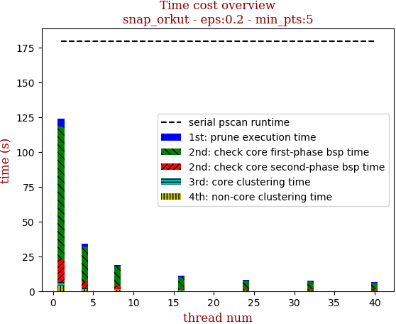 | 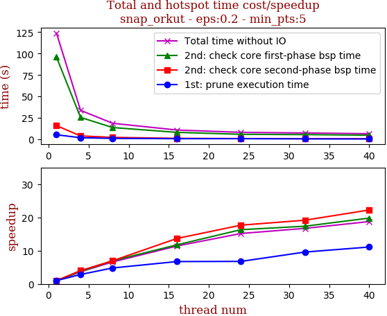

thread_num | prune | check-core 1st bsp | check-core 2nd bsp | cluster-core | cluster-non-core | total | total speedup
--- | --- | --- | --- | --- | --- | --- | ---
1 | 5.359s | 95.769s | 16.004s | 2.535s | 4.12s | 123.79s | 1.000
4 | 1.886s | 25.579s | 3.991s | 0.874s | 1.468s | 33.801s | 3.662
8 | 1.117s | 13.761s | 2.3s | 0.561s | 0.975s | 18.717s | 6.614
16 | 0.797s | 8.159s | 1.172s | 0.275s | 0.467s | 10.872s | 11.386
24 | 0.791s | 5.872s | 0.906s | 0.239s | 0.352s | 8.163s | 15.165
32 | 0.559s | 5.519s | 0.835s | 0.196s | 0.298s | 7.411s | 16.704
40 | 0.483s | 4.837s | 0.72s | 0.232s | 0.327s | 6.602s | 18.750

## eps:0.3

overview | speedup
--- | ---
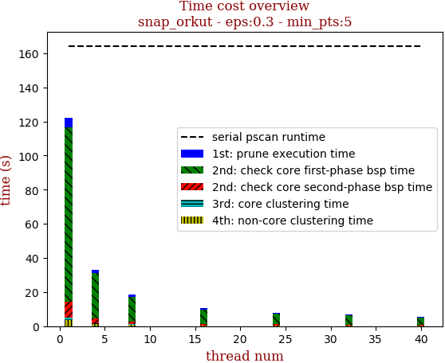 | 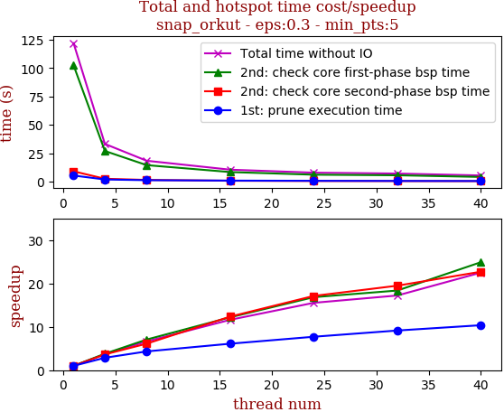

thread_num | prune | check-core 1st bsp | check-core 2nd bsp | cluster-core | cluster-non-core | total | total speedup
--- | --- | --- | --- | --- | --- | --- | ---
1 | 5.351s | 102.492s | 9.059s | 1.648s | 3.429s | 121.982s | 1.000
4 | 1.869s | 26.969s | 2.486s | 0.594s | 1.27s | 33.192s | 3.675
8 | 1.236s | 14.505s | 1.48s | 0.357s | 0.783s | 18.364s | 6.642
16 | 0.876s | 8.403s | 0.733s | 0.172s | 0.31s | 10.496s | 11.622
24 | 0.694s | 6.087s | 0.529s | 0.166s | 0.374s | 7.852s | 15.535
32 | 0.585s | 5.581s | 0.465s | 0.116s | 0.332s | 7.083s | 17.222
40 | 0.516s | 4.117s | 0.399s | 0.168s | 0.219s | 5.422s | 22.498

## eps:0.4

overview | speedup
--- | ---
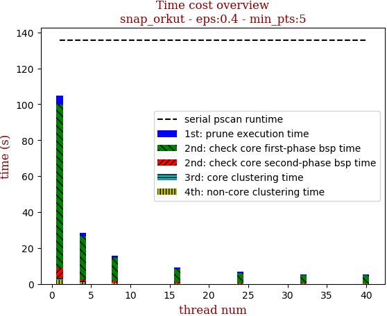 | 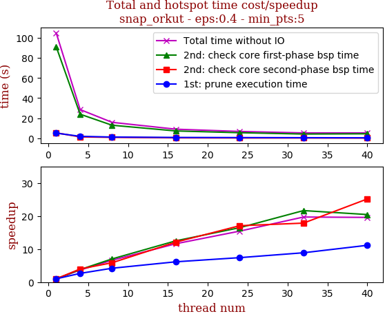

thread_num | prune | check-core 1st bsp | check-core 2nd bsp | cluster-core | cluster-non-core | total | total speedup
--- | --- | --- | --- | --- | --- | --- | ---
1 | 5.127s | 91.138s | 5.411s | 1.056s | 2.166s | 104.9s | 1.000
4 | 1.933s | 23.969s | 1.36s | 0.378s | 0.937s | 28.579s | 3.671
8 | 1.22s | 12.984s | 0.923s | 0.214s | 0.521s | 15.865s | 6.612
16 | 0.833s | 7.29s | 0.447s | 0.112s | 0.345s | 9.03s | 11.617
24 | 0.692s | 5.533s | 0.317s | 0.083s | 0.171s | 6.798s | 15.431
32 | 0.577s | 4.21s | 0.303s | 0.072s | 0.161s | 5.325s | 19.700
40 | 0.46s | 4.457s | 0.215s | 0.089s | 0.131s | 5.356s | 19.586

## eps:0.5

overview | speedup
--- | ---
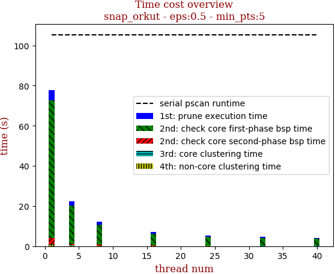 | 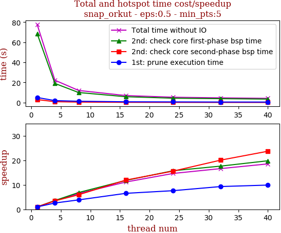

thread_num | prune | check-core 1st bsp | check-core 2nd bsp | cluster-core | cluster-non-core | total | total speedup
--- | --- | --- | --- | --- | --- | --- | ---
1 | 5.058s | 68.657s | 3.01s | 0.251s | 0.766s | 77.744s | 1.000
4 | 1.952s | 19.035s | 0.868s | 0.091s | 0.28s | 22.23s | 3.497
8 | 1.312s | 10.011s | 0.506s | 0.055s | 0.167s | 12.054s | 6.450
16 | 0.774s | 5.82s | 0.252s | 0.029s | 0.097s | 6.974s | 11.148
24 | 0.664s | 4.357s | 0.193s | 0.023s | 0.067s | 5.307s | 14.649
32 | 0.544s | 3.895s | 0.15s | 0.023s | 0.063s | 4.679s | 16.616
40 | 0.511s | 3.465s | 0.127s | 0.023s | 0.065s | 4.194s | 18.537

## eps:0.6

overview | speedup
--- | ---
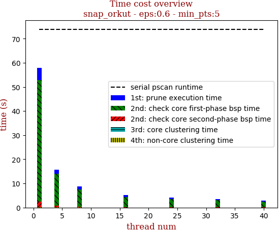 | 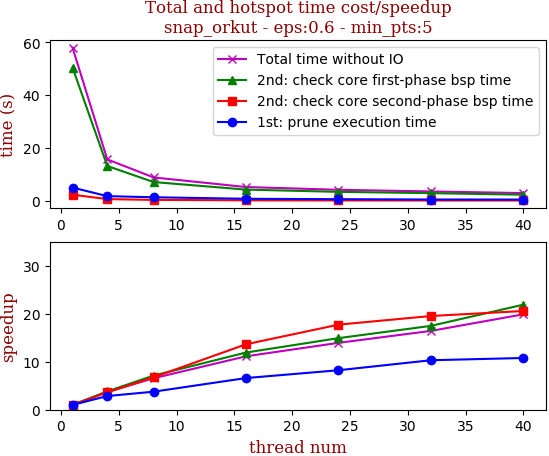

thread_num | prune | check-core 1st bsp | check-core 2nd bsp | cluster-core | cluster-non-core | total | total speedup
--- | --- | --- | --- | --- | --- | --- | ---
1 | 5.001s | 50.39s | 2.304s | 0.047s | 0.178s | 57.922s | 1.000
4 | 1.755s | 13.182s | 0.636s | 0.022s | 0.08s | 15.677s | 3.695
8 | 1.332s | 7.094s | 0.341s | 0.018s | 0.053s | 8.842s | 6.551
16 | 0.758s | 4.229s | 0.169s | 0.011s | 0.034s | 5.203s | 11.132
24 | 0.608s | 3.379s | 0.13s | 0.01s | 0.027s | 4.157s | 13.934
32 | 0.485s | 2.884s | 0.118s | 0.012s | 0.026s | 3.527s | 16.422
40 | 0.464s | 2.302s | 0.112s | 0.01s | 0.023s | 2.913s | 19.884

## eps:0.7

overview | speedup
--- | ---
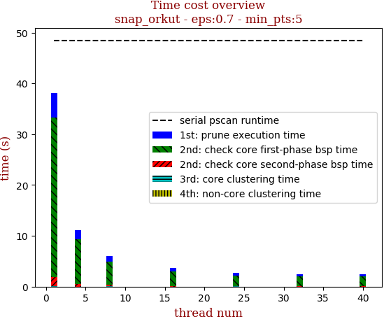 | 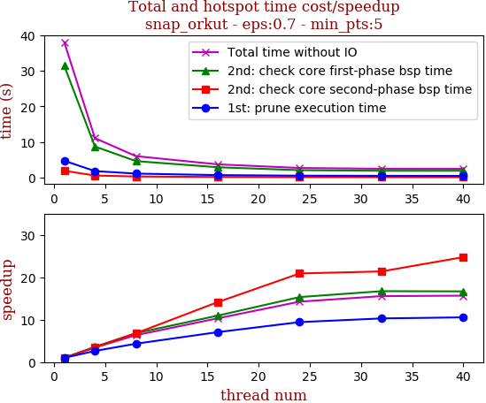

thread_num | prune | check-core 1st bsp | check-core 2nd bsp | cluster-core | cluster-non-core | total | total speedup
--- | --- | --- | --- | --- | --- | --- | ---
1 | 4.705s | 31.415s | 1.881s | 0.012s | 0.028s | 38.045s | 1.000
4 | 1.79s | 8.699s | 0.543s | 0.011s | 0.019s | 11.065s | 3.438
8 | 1.085s | 4.604s | 0.277s | 0.011s | 0.02s | 6.0s | 6.341
16 | 0.666s | 2.867s | 0.133s | 0.007s | 0.011s | 3.687s | 10.319
24 | 0.499s | 2.049s | 0.09s | 0.013s | 0.018s | 2.67s | 14.249
32 | 0.457s | 1.879s | 0.088s | 0.008s | 0.011s | 2.446s | 15.554
40 | 0.446s | 1.884s | 0.076s | 0.008s | 0.014s | 2.429s | 15.663

## eps:0.8

overview | speedup
--- | ---
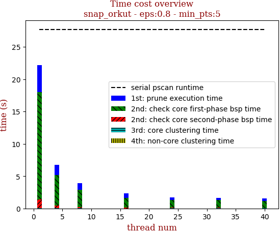 | 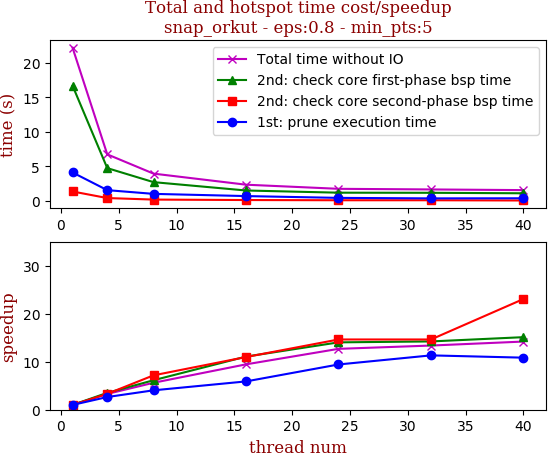

thread_num | prune | check-core 1st bsp | check-core 2nd bsp | cluster-core | cluster-non-core | total | total speedup
--- | --- | --- | --- | --- | --- | --- | ---
1 | 4.11s | 16.659s | 1.361s | 0.009s | 0.013s | 22.155s | 1.000
4 | 1.554s | 4.742s | 0.411s | 0.009s | 0.014s | 6.733s | 3.291
8 | 1.017s | 2.713s | 0.19s | 0.01s | 0.013s | 3.946s | 5.615
16 | 0.697s | 1.505s | 0.124s | 0.006s | 0.01s | 2.344s | 9.452
24 | 0.436s | 1.187s | 0.093s | 0.011s | 0.016s | 1.747s | 12.682
32 | 0.363s | 1.171s | 0.093s | 0.011s | 0.017s | 1.657s | 13.371
40 | 0.379s | 1.102s | 0.059s | 0.007s | 0.011s | 1.56s | 14.202

## eps:0.9

overview | speedup
--- | ---
 | 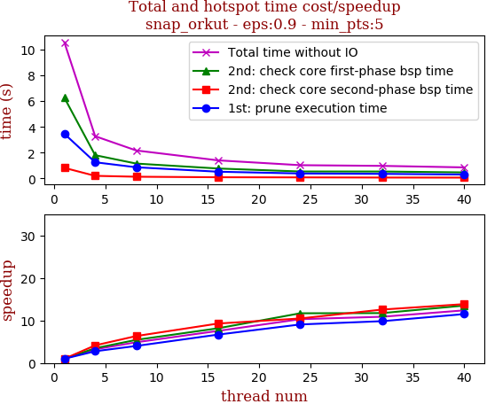

thread_num | prune | check-core 1st bsp | check-core 2nd bsp | cluster-core | cluster-non-core | total | total speedup
--- | --- | --- | --- | --- | --- | --- | ---
1 | 3.463s | 6.267s | 0.817s | 0.009s | 0.014s | 10.573s | 1.000
4 | 1.253s | 1.803s | 0.197s | 0.009s | 0.012s | 3.278s | 3.225
8 | 0.864s | 1.152s | 0.129s | 0.009s | 0.013s | 2.17s | 4.872
16 | 0.518s | 0.767s | 0.088s | 0.01s | 0.014s | 1.4s | 7.552
24 | 0.382s | 0.536s | 0.078s | 0.011s | 0.016s | 1.026s | 10.305
32 | 0.352s | 0.534s | 0.065s | 0.007s | 0.012s | 0.972s | 10.878
40 | 0.301s | 0.464s | 0.059s | 0.012s | 0.015s | 0.854s | 12.381

