## eps:0.1

overview | speedup
--- | ---
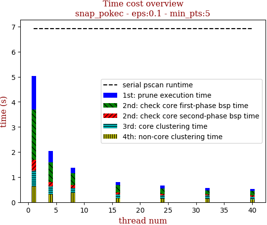 | 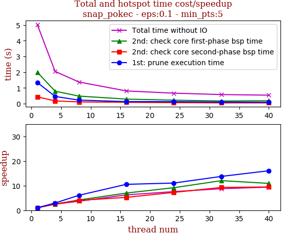

thread_num | prune | check-core 1st bsp | check-core 2nd bsp | cluster-core | cluster-non-core | total | total speedup
--- | --- | --- | --- | --- | --- | --- | ---
1 | 1.347s | 1.996s | 0.435s | 0.635s | 0.62s | 5.036s | 1.000
4 | 0.457s | 0.791s | 0.17s | 0.316s | 0.314s | 2.05s | 2.457
8 | 0.222s | 0.479s | 0.109s | 0.194s | 0.371s | 1.377s | 3.657
16 | 0.128s | 0.286s | 0.083s | 0.162s | 0.145s | 0.806s | 6.248
24 | 0.122s | 0.218s | 0.06s | 0.126s | 0.135s | 0.665s | 7.573
32 | 0.098s | 0.166s | 0.047s | 0.125s | 0.138s | 0.576s | 8.743
40 | 0.084s | 0.183s | 0.046s | 0.107s | 0.113s | 0.536s | 9.396

## eps:0.2

overview | speedup
--- | ---
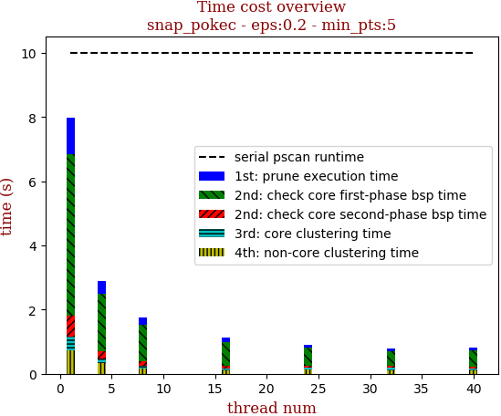 | 

thread_num | prune | check-core 1st bsp | check-core 2nd bsp | cluster-core | cluster-non-core | total | total speedup
--- | --- | --- | --- | --- | --- | --- | ---
1 | 1.14s | 5.035s | 0.645s | 0.428s | 0.724s | 7.975s | 1.000
4 | 0.403s | 1.767s | 0.234s | 0.152s | 0.328s | 2.887s | 2.762
8 | 0.237s | 1.124s | 0.14s | 0.093s | 0.157s | 1.753s | 4.549
16 | 0.129s | 0.751s | 0.071s | 0.065s | 0.106s | 1.125s | 7.089
24 | 0.095s | 0.568s | 0.063s | 0.062s | 0.127s | 0.918s | 8.687
32 | 0.095s | 0.443s | 0.071s | 0.066s | 0.114s | 0.791s | 10.082
40 | 0.085s | 0.514s | 0.057s | 0.06s | 0.107s | 0.827s | 9.643

## eps:0.3

overview | speedup
--- | ---
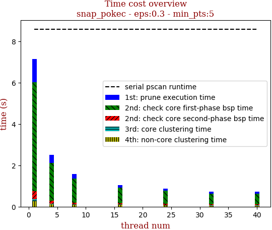 | 

thread_num | prune | check-core 1st bsp | check-core 2nd bsp | cluster-core | cluster-non-core | total | total speedup
--- | --- | --- | --- | --- | --- | --- | ---
1 | 1.108s | 5.289s | 0.376s | 0.102s | 0.266s | 7.143s | 1.000
4 | 0.392s | 1.821s | 0.147s | 0.036s | 0.109s | 2.508s | 2.848
8 | 0.215s | 1.173s | 0.072s | 0.024s | 0.099s | 1.586s | 4.504
16 | 0.128s | 0.769s | 0.04s | 0.02s | 0.094s | 1.053s | 6.783
24 | 0.113s | 0.615s | 0.055s | 0.022s | 0.072s | 0.88s | 8.117
32 | 0.092s | 0.512s | 0.045s | 0.023s | 0.052s | 0.726s | 9.839
40 | 0.086s | 0.528s | 0.037s | 0.022s | 0.053s | 0.728s | 9.812

## eps:0.4

overview | speedup
--- | ---
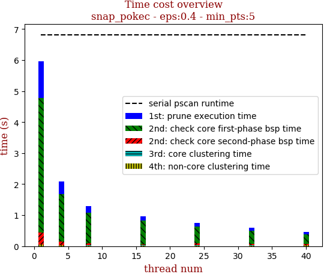 | 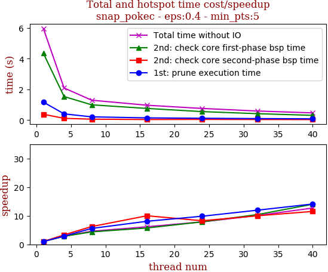

thread_num | prune | check-core 1st bsp | check-core 2nd bsp | cluster-core | cluster-non-core | total | total speedup
--- | --- | --- | --- | --- | --- | --- | ---
1 | 1.171s | 4.347s | 0.38s | 0.013s | 0.045s | 5.958s | 1.000
4 | 0.405s | 1.532s | 0.114s | 0.01s | 0.024s | 2.089s | 2.852
8 | 0.21s | 0.993s | 0.061s | 0.009s | 0.019s | 1.294s | 4.604
16 | 0.145s | 0.758s | 0.038s | 0.008s | 0.016s | 0.967s | 6.161
24 | 0.119s | 0.552s | 0.046s | 0.015s | 0.022s | 0.757s | 7.871
32 | 0.098s | 0.417s | 0.038s | 0.012s | 0.022s | 0.59s | 10.098
40 | 0.083s | 0.31s | 0.033s | 0.015s | 0.025s | 0.469s | 12.704

## eps:0.5

overview | speedup
--- | ---
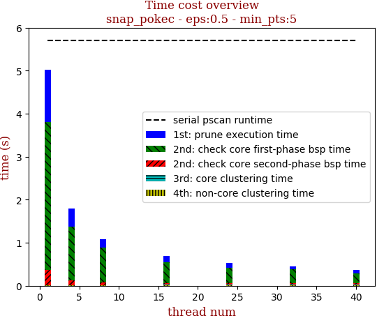 | 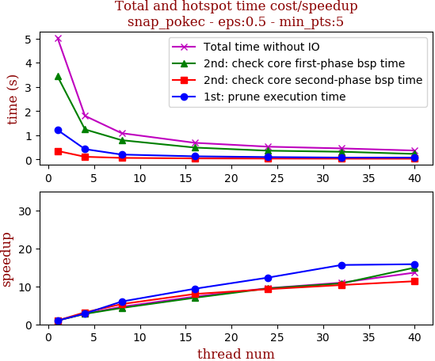

thread_num | prune | check-core 1st bsp | check-core 2nd bsp | cluster-core | cluster-non-core | total | total speedup
--- | --- | --- | --- | --- | --- | --- | ---
1 | 1.219s | 3.437s | 0.352s | 0.005s | 0.011s | 5.028s | 1.000
4 | 0.427s | 1.242s | 0.111s | 0.006s | 0.013s | 1.802s | 2.790
8 | 0.203s | 0.797s | 0.066s | 0.006s | 0.012s | 1.087s | 4.626
16 | 0.13s | 0.491s | 0.044s | 0.007s | 0.013s | 0.688s | 7.308
24 | 0.099s | 0.363s | 0.038s | 0.009s | 0.015s | 0.528s | 9.523
32 | 0.078s | 0.319s | 0.034s | 0.009s | 0.015s | 0.458s | 10.978
40 | 0.077s | 0.23s | 0.031s | 0.01s | 0.018s | 0.369s | 13.626

## eps:0.6

overview | speedup
--- | ---
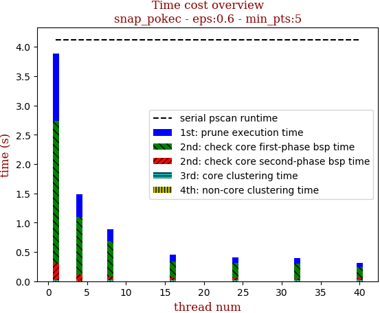 | 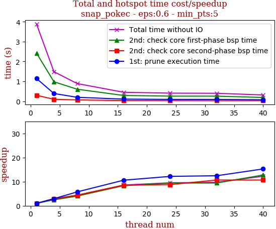

thread_num | prune | check-core 1st bsp | check-core 2nd bsp | cluster-core | cluster-non-core | total | total speedup
--- | --- | --- | --- | --- | --- | --- | ---
1 | 1.146s | 2.426s | 0.299s | 0.008s | 0.008s | 3.889s | 1.000
4 | 0.39s | 0.981s | 0.101s | 0.005s | 0.008s | 1.488s | 2.614
8 | 0.199s | 0.605s | 0.068s | 0.005s | 0.011s | 0.89s | 4.370
16 | 0.108s | 0.291s | 0.035s | 0.006s | 0.01s | 0.452s | 8.604
24 | 0.094s | 0.258s | 0.034s | 0.007s | 0.013s | 0.408s | 9.532
32 | 0.092s | 0.257s | 0.028s | 0.008s | 0.012s | 0.401s | 9.698
40 | 0.075s | 0.19s | 0.028s | 0.008s | 0.014s | 0.317s | 12.268

## eps:0.7

overview | speedup
--- | ---
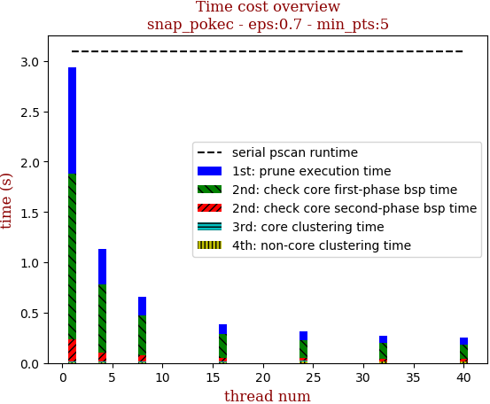 | 

thread_num | prune | check-core 1st bsp | check-core 2nd bsp | cluster-core | cluster-non-core | total | total speedup
--- | --- | --- | --- | --- | --- | --- | ---
1 | 1.056s | 1.645s | 0.226s | 0.004s | 0.008s | 2.941s | 1.000
4 | 0.353s | 0.681s | 0.089s | 0.005s | 0.007s | 1.137s | 2.587
8 | 0.183s | 0.399s | 0.061s | 0.005s | 0.01s | 0.66s | 4.456
16 | 0.093s | 0.237s | 0.037s | 0.006s | 0.01s | 0.385s | 7.639
24 | 0.087s | 0.177s | 0.029s | 0.007s | 0.013s | 0.315s | 9.337
32 | 0.072s | 0.153s | 0.024s | 0.007s | 0.012s | 0.271s | 10.852
40 | 0.074s | 0.138s | 0.021s | 0.008s | 0.011s | 0.255s | 11.533

## eps:0.8

overview | speedup
--- | ---
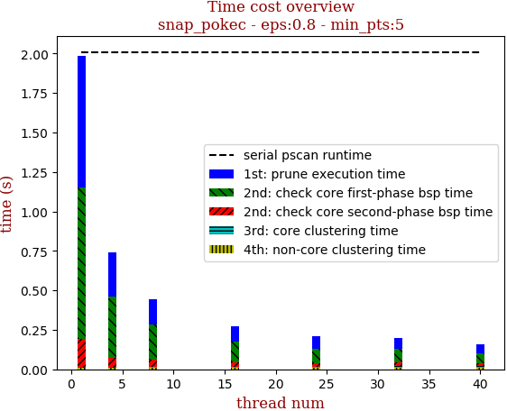 | 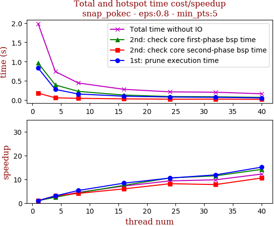

thread_num | prune | check-core 1st bsp | check-core 2nd bsp | cluster-core | cluster-non-core | total | total speedup
--- | --- | --- | --- | --- | --- | --- | ---
1 | 0.83s | 0.962s | 0.179s | 0.004s | 0.008s | 1.986s | 1.000
4 | 0.276s | 0.392s | 0.058s | 0.004s | 0.008s | 0.74s | 2.684
8 | 0.157s | 0.225s | 0.044s | 0.005s | 0.01s | 0.443s | 4.483
16 | 0.099s | 0.129s | 0.03s | 0.005s | 0.011s | 0.278s | 7.144
24 | 0.079s | 0.091s | 0.022s | 0.006s | 0.012s | 0.213s | 9.324
32 | 0.07s | 0.084s | 0.023s | 0.011s | 0.012s | 0.203s | 9.783
40 | 0.055s | 0.068s | 0.017s | 0.007s | 0.012s | 0.163s | 12.184

## eps:0.9

overview | speedup
--- | ---
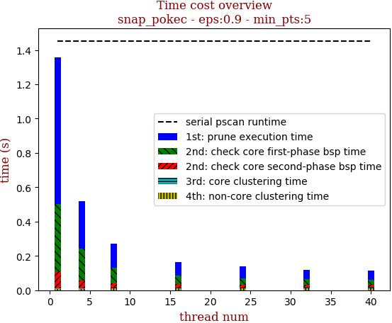 | 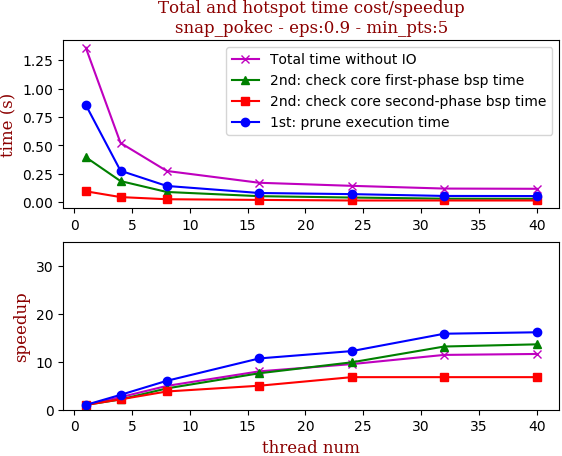

thread_num | prune | check-core 1st bsp | check-core 2nd bsp | cluster-core | cluster-non-core | total | total speedup
--- | --- | --- | --- | --- | --- | --- | ---
1 | 0.855s | 0.395s | 0.095s | 0.004s | 0.008s | 1.359s | 1.000
4 | 0.276s | 0.185s | 0.044s | 0.004s | 0.009s | 0.521s | 2.608
8 | 0.142s | 0.089s | 0.025s | 0.004s | 0.011s | 0.274s | 4.960
16 | 0.08s | 0.052s | 0.019s | 0.005s | 0.01s | 0.17s | 7.994
24 | 0.07s | 0.04s | 0.014s | 0.006s | 0.011s | 0.143s | 9.503
32 | 0.054s | 0.03s | 0.014s | 0.007s | 0.012s | 0.119s | 11.420
40 | 0.053s | 0.029s | 0.014s | 0.007s | 0.011s | 0.117s | 11.615

