## eps:0.1

overview | speedup
--- | ---
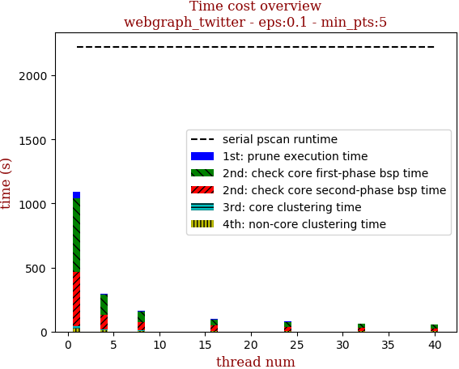 | 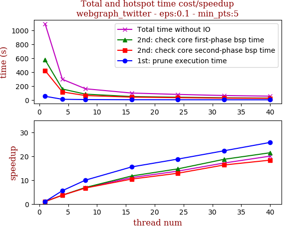

thread_num | prune | check-core 1st bsp | check-core 2nd bsp | cluster-core | cluster-non-core | total | total speedup
--- | --- | --- | --- | --- | --- | --- | ---
1 | 52.722s | 574.545s | 421.179s | 20.548s | 23.321s | 1092.32s | 1.000
4 | 9.481s | 156.628s | 114.852s | 5.61s | 9.27s | 295.845s | 3.692
8 | 5.286s | 83.218s | 63.137s | 3.354s | 5.31s | 160.309s | 6.814
16 | 3.4s | 49.065s | 40.437s | 2.396s | 3.638s | 98.94s | 11.040
24 | 2.808s | 39.138s | 32.774s | 1.401s | 3.35s | 79.474s | 13.744
32 | 2.369s | 30.761s | 25.825s | 1.245s | 3.567s | 63.77s | 17.129
40 | 2.047s | 26.807s | 22.963s | 0.983s | 1.755s | 54.559s | 20.021

## eps:0.2

overview | speedup
--- | ---
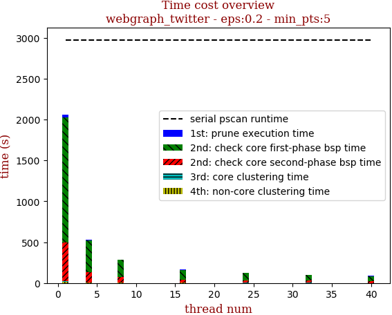 | 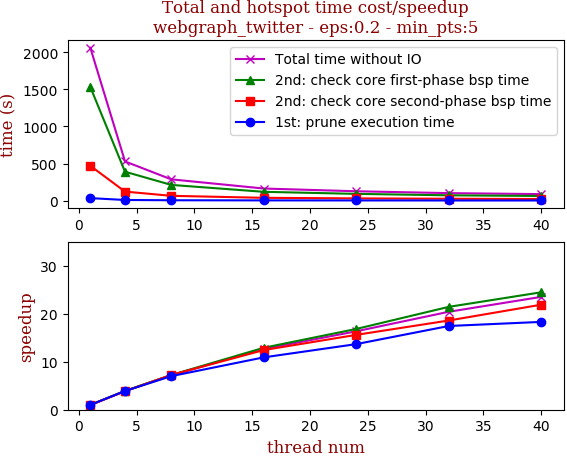

thread_num | prune | check-core 1st bsp | check-core 2nd bsp | cluster-core | cluster-non-core | total | total speedup
--- | --- | --- | --- | --- | --- | --- | ---
1 | 33.65s | 1532.875s | 469.595s | 8.846s | 17.213s | 2062.182s | 1.000
4 | 8.636s | 389.923s | 121.872s | 2.758s | 5.587s | 528.778s | 3.900
8 | 4.81s | 211.969s | 64.86s | 1.901s | 3.555s | 287.098s | 7.183
16 | 3.085s | 118.77s | 37.794s | 1.019s | 2.446s | 163.116s | 12.642
24 | 2.462s | 91.104s | 30.111s | 0.867s | 1.658s | 126.205s | 16.340
32 | 1.929s | 71.537s | 25.267s | 0.512s | 1.819s | 101.067s | 20.404
40 | 1.839s | 62.654s | 21.461s | 0.432s | 1.335s | 87.724s | 23.508

## eps:0.3

overview | speedup
--- | ---
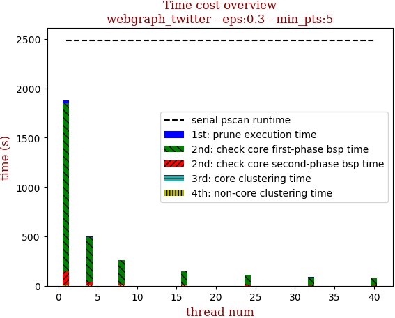 | 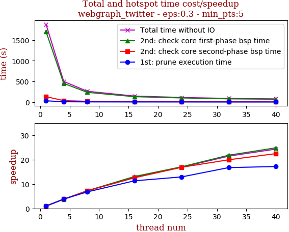

thread_num | prune | check-core 1st bsp | check-core 2nd bsp | cluster-core | cluster-non-core | total | total speedup
--- | --- | --- | --- | --- | --- | --- | ---
1 | 30.991s | 1703.366s | 131.483s | 3.551s | 9.877s | 1879.272s | 1.000
4 | 8.074s | 451.896s | 34.443s | 1.289s | 3.456s | 499.16s | 3.765
8 | 4.569s | 235.238s | 18.23s | 0.788s | 2.119s | 260.946s | 7.202
16 | 2.738s | 130.186s | 10.471s | 0.462s | 1.834s | 145.693s | 12.899
24 | 2.4s | 99.866s | 7.799s | 0.286s | 0.951s | 111.304s | 16.884
32 | 1.852s | 78.112s | 6.594s | 0.222s | 0.939s | 87.722s | 21.423
40 | 1.806s | 68.599s | 5.856s | 0.194s | 0.825s | 77.283s | 24.317

## eps:0.4

overview | speedup
--- | ---
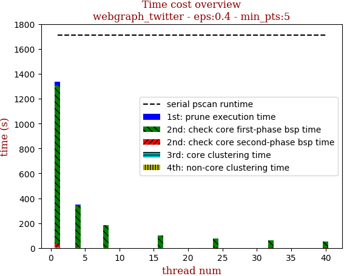 | 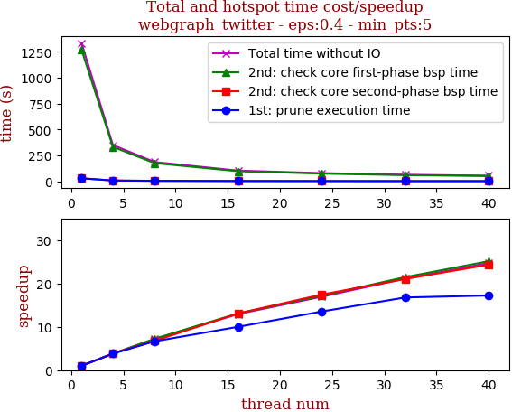

thread_num | prune | check-core 1st bsp | check-core 2nd bsp | cluster-core | cluster-non-core | total | total speedup
--- | --- | --- | --- | --- | --- | --- | ---
1 | 28.589s | 1269.789s | 29.116s | 2.532s | 4.734s | 1334.764s | 1.000
4 | 7.519s | 332.366s | 7.515s | 1.02s | 1.879s | 350.301s | 3.810
8 | 4.291s | 175.285s | 4.309s | 0.638s | 1.187s | 185.713s | 7.187
16 | 2.86s | 96.893s | 2.225s | 0.39s | 0.765s | 103.136s | 12.942
24 | 2.113s | 73.993s | 1.669s | 0.36s | 0.669s | 78.807s | 16.937
32 | 1.705s | 59.151s | 1.385s | 0.317s | 0.656s | 63.216s | 21.114
40 | 1.66s | 50.524s | 1.197s | 0.228s | 0.374s | 53.986s | 24.724

## eps:0.5

overview | speedup
--- | ---
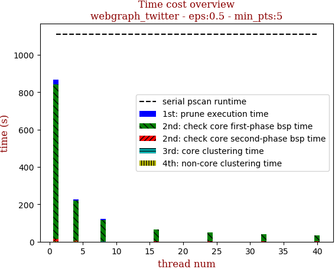 | 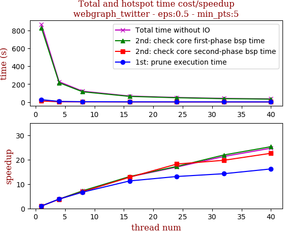

thread_num | prune | check-core 1st bsp | check-core 2nd bsp | cluster-core | cluster-non-core | total | total speedup
--- | --- | --- | --- | --- | --- | --- | ---
1 | 26.721s | 827.089s | 11.817s | 0.595s | 1.665s | 867.89s | 1.000
4 | 6.954s | 215.954s | 3.131s | 0.263s | 0.802s | 227.107s | 3.822
8 | 3.999s | 114.506s | 1.727s | 0.181s | 0.54s | 120.955s | 7.175
16 | 2.37s | 63.207s | 0.923s | 0.159s | 0.38s | 67.042s | 12.945
24 | 2.042s | 48.082s | 0.65s | 0.153s | 0.248s | 51.179s | 16.958
32 | 1.878s | 37.764s | 0.599s | 0.142s | 0.387s | 40.773s | 21.286
40 | 1.651s | 32.694s | 0.523s | 0.077s | 0.214s | 35.161s | 24.683

## eps:0.6

overview | speedup
--- | ---
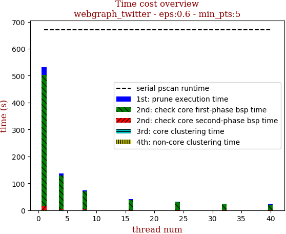 | 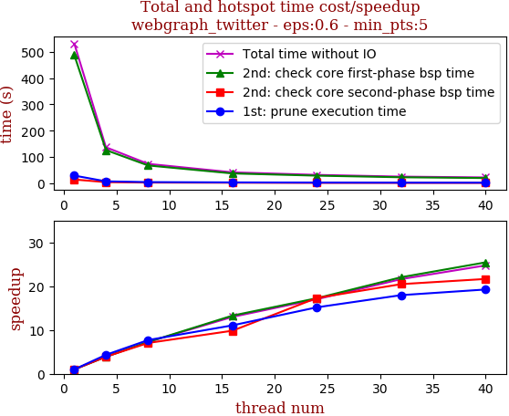

thread_num | prune | check-core 1st bsp | check-core 2nd bsp | cluster-core | cluster-non-core | total | total speedup
--- | --- | --- | --- | --- | --- | --- | ---
1 | 28.488s | 488.286s | 13.555s | 0.366s | 1.522s | 532.219s | 1.000
4 | 6.577s | 125.827s | 3.474s | 0.184s | 0.418s | 136.483s | 3.900
8 | 3.699s | 67.199s | 1.926s | 0.152s | 0.324s | 73.304s | 7.260
16 | 2.576s | 36.748s | 1.378s | 0.097s | 0.161s | 40.963s | 12.993
24 | 1.877s | 28.286s | 0.783s | 0.067s | 0.23s | 31.246s | 17.033
32 | 1.586s | 22.142s | 0.662s | 0.073s | 0.148s | 24.613s | 21.623
40 | 1.48s | 19.19s | 0.626s | 0.067s | 0.144s | 21.51s | 24.743

## eps:0.7

overview | speedup
--- | ---
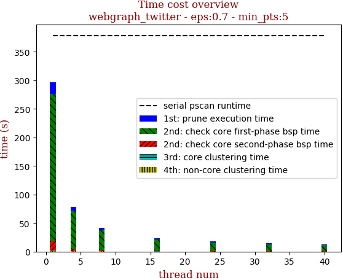 | 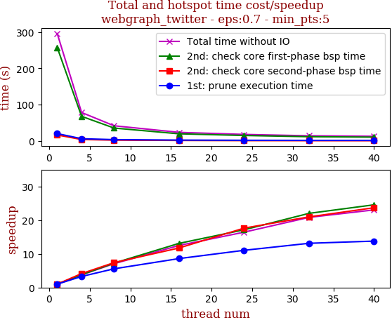

thread_num | prune | check-core 1st bsp | check-core 2nd bsp | cluster-core | cluster-non-core | total | total speedup
--- | --- | --- | --- | --- | --- | --- | ---
1 | 20.34s | 257.842s | 16.484s | 0.267s | 1.308s | 296.244s | 1.000
4 | 6.185s | 67.875s | 3.977s | 0.156s | 0.287s | 78.483s | 3.775
8 | 3.658s | 35.557s | 2.23s | 0.14s | 0.246s | 41.834s | 7.081
16 | 2.367s | 19.675s | 1.404s | 0.13s | 0.137s | 23.716s | 12.491
24 | 1.841s | 15.048s | 0.935s | 0.084s | 0.12s | 18.031s | 16.430
32 | 1.549s | 11.711s | 0.786s | 0.062s | 0.116s | 14.227s | 20.823
40 | 1.476s | 10.5s | 0.696s | 0.061s | 0.118s | 12.854s | 23.047

## eps:0.8

overview | speedup
--- | ---
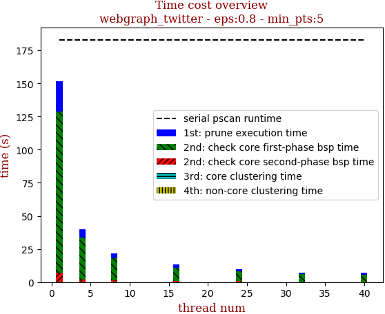 | 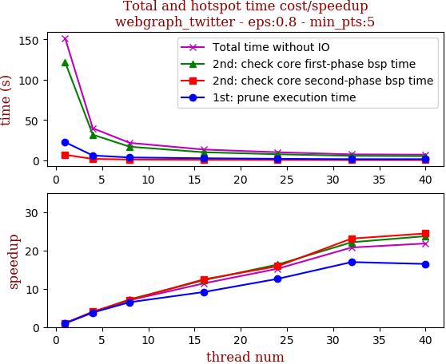

thread_num | prune | check-core 1st bsp | check-core 2nd bsp | cluster-core | cluster-non-core | total | total speedup
--- | --- | --- | --- | --- | --- | --- | ---
1 | 22.436s | 121.765s | 6.766s | 0.159s | 0.36s | 151.489s | 1.000
4 | 5.914s | 31.723s | 1.676s | 0.122s | 0.249s | 39.685s | 3.817
8 | 3.46s | 16.804s | 0.957s | 0.123s | 0.228s | 21.573s | 7.022
16 | 2.455s | 9.963s | 0.544s | 0.115s | 0.217s | 13.296s | 11.394
24 | 1.783s | 7.464s | 0.426s | 0.116s | 0.155s | 9.947s | 15.230
32 | 1.323s | 5.503s | 0.293s | 0.054s | 0.114s | 7.295s | 20.766
40 | 1.362s | 5.133s | 0.277s | 0.051s | 0.119s | 6.945s | 21.813

## eps:0.9

overview | speedup
--- | ---
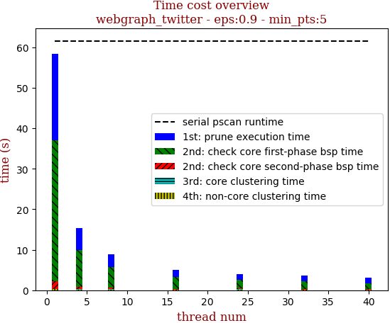 | 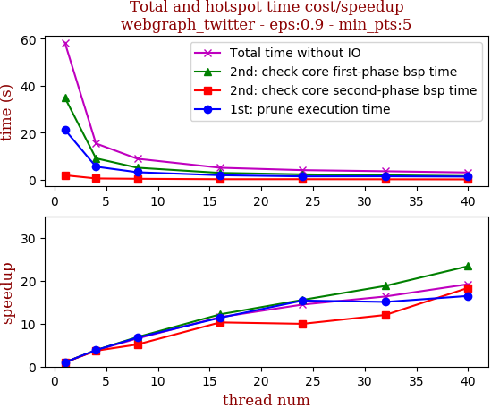

thread_num | prune | check-core 1st bsp | check-core 2nd bsp | cluster-core | cluster-non-core | total | total speedup
--- | --- | --- | --- | --- | --- | --- | ---
1 | 21.249s | 34.888s | 1.852s | 0.127s | 0.218s | 58.338s | 1.000
4 | 5.525s | 9.082s | 0.501s | 0.116s | 0.193s | 15.418s | 3.784
8 | 3.155s | 5.079s | 0.36s | 0.121s | 0.192s | 8.91s | 6.547
16 | 1.87s | 2.869s | 0.18s | 0.051s | 0.096s | 5.068s | 11.511
24 | 1.382s | 2.246s | 0.186s | 0.116s | 0.106s | 4.039s | 14.444
32 | 1.411s | 1.856s | 0.154s | 0.052s | 0.098s | 3.574s | 16.323
40 | 1.292s | 1.492s | 0.101s | 0.05s | 0.104s | 3.041s | 19.184

