## eps:0.1

overview | speedup
--- | ---
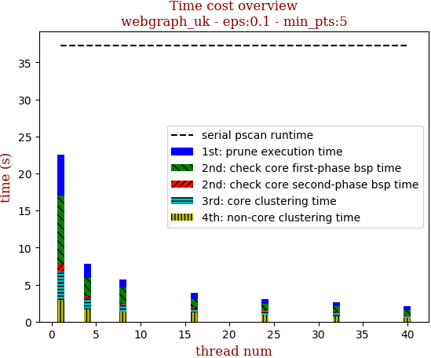 | 

thread_num | prune | check-core 1st bsp | check-core 2nd bsp | cluster-core | cluster-non-core | total | total speedup
--- | --- | --- | --- | --- | --- | --- | ---
1 | 5.453s | 9.226s | 1.083s | 3.78s | 2.962s | 22.507s | 1.000
4 | 1.869s | 2.435s | 0.338s | 1.451s | 1.705s | 7.803s | 2.884
8 | 1.102s | 2.054s | 0.243s | 0.932s | 1.39s | 5.725s | 3.931
16 | 0.918s | 1.036s | 0.134s | 0.578s | 1.243s | 3.912s | 5.753
24 | 0.64s | 0.865s | 0.128s | 0.495s | 0.957s | 3.091s | 7.281
32 | 0.557s | 0.689s | 0.133s | 0.498s | 0.73s | 2.611s | 8.620
40 | 0.513s | 0.728s | 0.092s | 0.287s | 0.453s | 2.076s | 10.842

## eps:0.2

overview | speedup
--- | ---
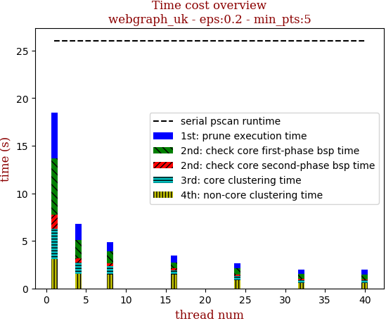 | 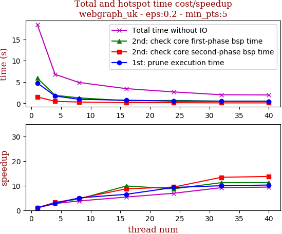

thread_num | prune | check-core 1st bsp | check-core 2nd bsp | cluster-core | cluster-non-core | total | total speedup
--- | --- | --- | --- | --- | --- | --- | ---
1 | 4.78s | 5.898s | 1.498s | 3.203s | 3.07s | 18.453s | 1.000
4 | 1.721s | 1.891s | 0.472s | 1.199s | 1.499s | 6.785s | 2.720
8 | 0.955s | 1.292s | 0.313s | 0.847s | 1.483s | 4.896s | 3.769
16 | 0.738s | 0.599s | 0.172s | 0.436s | 1.491s | 3.439s | 5.366
24 | 0.516s | 0.677s | 0.159s | 0.427s | 0.888s | 2.672s | 6.906
32 | 0.48s | 0.526s | 0.112s | 0.314s | 0.577s | 2.011s | 9.176
40 | 0.467s | 0.524s | 0.109s | 0.301s | 0.558s | 1.962s | 9.405

## eps:0.3

overview | speedup
--- | ---
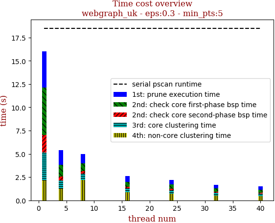 | 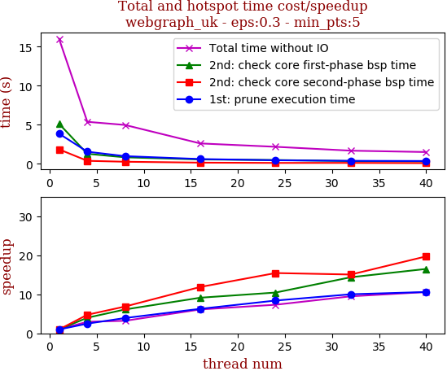

thread_num | prune | check-core 1st bsp | check-core 2nd bsp | cluster-core | cluster-non-core | total | total speedup
--- | --- | --- | --- | --- | --- | --- | ---
1 | 3.864s | 5.13s | 1.853s | 2.991s | 2.159s | 16.001s | 1.000
4 | 1.555s | 1.283s | 0.389s | 0.911s | 1.24s | 5.382s | 2.973
8 | 0.985s | 0.839s | 0.27s | 0.696s | 2.186s | 4.98s | 3.213
16 | 0.615s | 0.562s | 0.156s | 0.411s | 0.865s | 2.613s | 6.124
24 | 0.46s | 0.491s | 0.12s | 0.385s | 0.725s | 2.184s | 7.326
32 | 0.386s | 0.357s | 0.123s | 0.279s | 0.535s | 1.687s | 9.485
40 | 0.365s | 0.311s | 0.094s | 0.279s | 0.456s | 1.512s | 10.583

## eps:0.4

overview | speedup
--- | ---
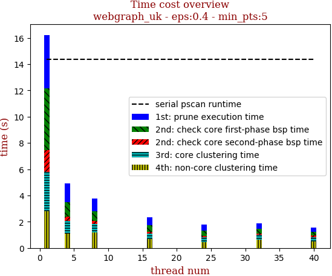 | 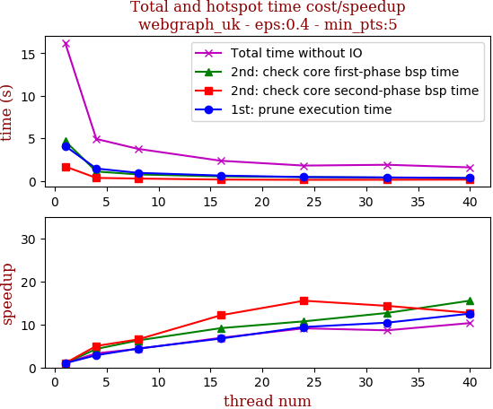

thread_num | prune | check-core 1st bsp | check-core 2nd bsp | cluster-core | cluster-non-core | total | total speedup
--- | --- | --- | --- | --- | --- | --- | ---
1 | 4.092s | 4.673s | 1.675s | 2.982s | 2.804s | 16.23s | 1.000
4 | 1.435s | 1.086s | 0.335s | 0.955s | 1.107s | 4.921s | 3.298
8 | 0.931s | 0.744s | 0.257s | 0.615s | 1.205s | 3.755s | 4.322
16 | 0.609s | 0.511s | 0.138s | 0.409s | 0.679s | 2.351s | 6.903
24 | 0.435s | 0.436s | 0.108s | 0.334s | 0.466s | 1.784s | 9.098
32 | 0.393s | 0.369s | 0.117s | 0.359s | 0.639s | 1.879s | 8.638
40 | 0.327s | 0.301s | 0.132s | 0.326s | 0.483s | 1.573s | 10.318

## eps:0.5

overview | speedup
--- | ---
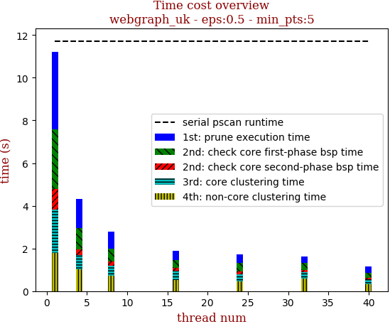 | 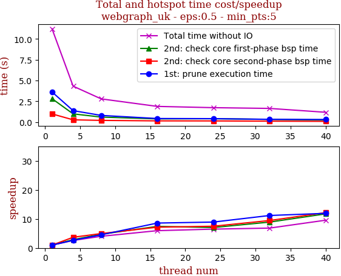

thread_num | prune | check-core 1st bsp | check-core 2nd bsp | cluster-core | cluster-non-core | total | total speedup
--- | --- | --- | --- | --- | --- | --- | ---
1 | 3.613s | 2.807s | 0.974s | 2.02s | 1.794s | 11.211s | 1.000
4 | 1.37s | 0.98s | 0.264s | 0.681s | 1.02s | 4.317s | 2.597
8 | 0.796s | 0.594s | 0.196s | 0.483s | 0.713s | 2.785s | 4.025
16 | 0.421s | 0.377s | 0.136s | 0.426s | 0.517s | 1.88s | 5.963
24 | 0.405s | 0.398s | 0.13s | 0.328s | 0.463s | 1.727s | 6.492
32 | 0.323s | 0.315s | 0.103s | 0.317s | 0.576s | 1.637s | 6.849
40 | 0.303s | 0.239s | 0.08s | 0.205s | 0.339s | 1.172s | 9.566

## eps:0.6

overview | speedup
--- | ---
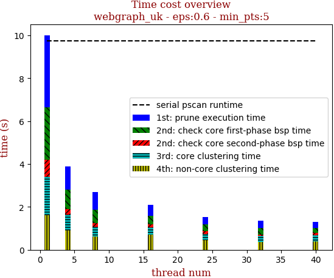 | 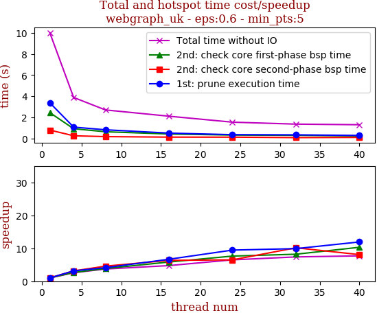

thread_num | prune | check-core 1st bsp | check-core 2nd bsp | cluster-core | cluster-non-core | total | total speedup
--- | --- | --- | --- | --- | --- | --- | ---
1 | 3.375s | 2.443s | 0.792s | 1.77s | 1.625s | 10.009s | 1.000
4 | 1.073s | 0.92s | 0.252s | 0.737s | 0.895s | 3.881s | 2.579
8 | 0.82s | 0.634s | 0.173s | 0.463s | 0.606s | 2.7s | 3.707
16 | 0.506s | 0.419s | 0.125s | 0.344s | 0.706s | 2.107s | 4.750
24 | 0.357s | 0.32s | 0.122s | 0.291s | 0.447s | 1.542s | 6.491
32 | 0.341s | 0.298s | 0.078s | 0.263s | 0.37s | 1.356s | 7.381
40 | 0.283s | 0.237s | 0.098s | 0.281s | 0.398s | 1.299s | 7.705

## eps:0.7

overview | speedup
--- | ---
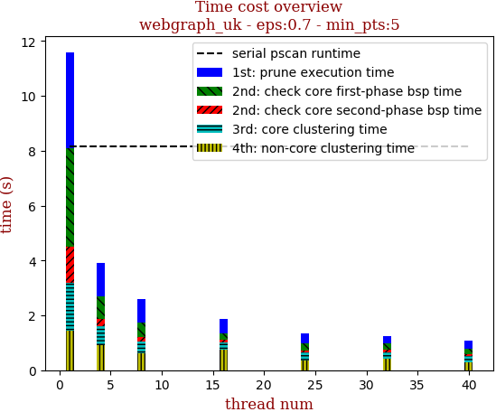 | 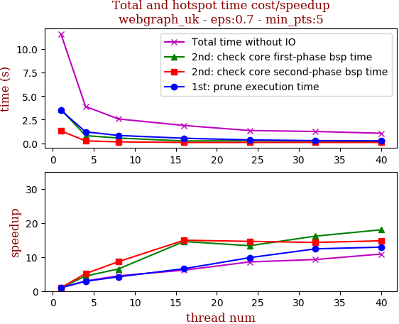

thread_num | prune | check-core 1st bsp | check-core 2nd bsp | cluster-core | cluster-non-core | total | total speedup
--- | --- | --- | --- | --- | --- | --- | ---
1 | 3.495s | 3.596s | 1.313s | 1.757s | 1.433s | 11.597s | 1.000
4 | 1.213s | 0.815s | 0.256s | 0.696s | 0.919s | 3.902s | 2.972
8 | 0.831s | 0.554s | 0.152s | 0.43s | 0.612s | 2.582s | 4.491
16 | 0.532s | 0.247s | 0.088s | 0.284s | 0.733s | 1.887s | 6.146
24 | 0.356s | 0.27s | 0.09s | 0.277s | 0.357s | 1.354s | 8.565
32 | 0.282s | 0.223s | 0.092s | 0.247s | 0.406s | 1.252s | 9.263
40 | 0.271s | 0.2s | 0.089s | 0.213s | 0.292s | 1.066s | 10.879

## eps:0.8

overview | speedup
--- | ---
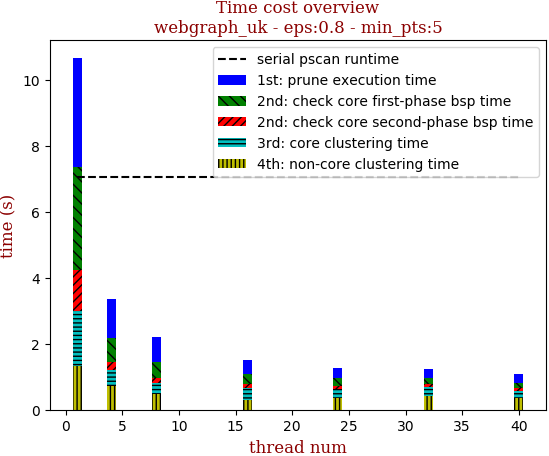 | 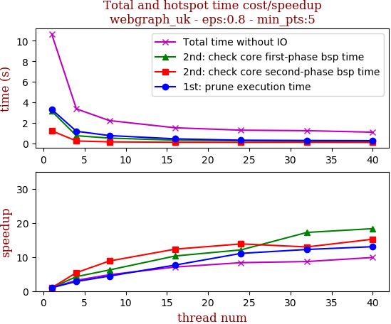

thread_num | prune | check-core 1st bsp | check-core 2nd bsp | cluster-core | cluster-non-core | total | total speedup
--- | --- | --- | --- | --- | --- | --- | ---
1 | 3.31s | 3.132s | 1.218s | 1.691s | 1.312s | 10.666s | 1.000
4 | 1.172s | 0.738s | 0.225s | 0.502s | 0.716s | 3.358s | 3.176
8 | 0.751s | 0.505s | 0.138s | 0.352s | 0.465s | 2.215s | 4.815
16 | 0.433s | 0.304s | 0.099s | 0.366s | 0.304s | 1.511s | 7.059
24 | 0.299s | 0.259s | 0.088s | 0.268s | 0.361s | 1.278s | 8.346
32 | 0.271s | 0.182s | 0.094s | 0.249s | 0.429s | 1.23s | 8.672
40 | 0.254s | 0.171s | 0.08s | 0.213s | 0.36s | 1.081s | 9.867

## eps:0.9

overview | speedup
--- | ---
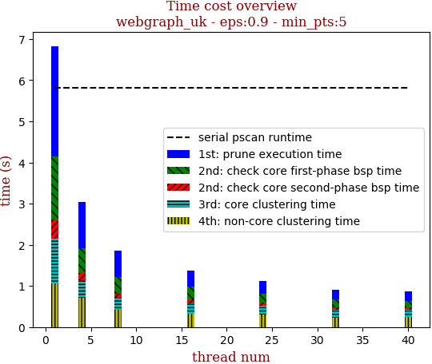 | 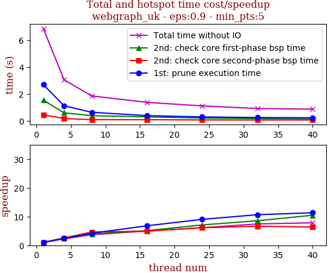

thread_num | prune | check-core 1st bsp | check-core 2nd bsp | cluster-core | cluster-non-core | total | total speedup
--- | --- | --- | --- | --- | --- | --- | ---
1 | 2.683s | 1.538s | 0.458s | 1.084s | 1.065s | 6.831s | 1.000
4 | 1.123s | 0.601s | 0.18s | 0.427s | 0.71s | 3.044s | 2.244
8 | 0.64s | 0.392s | 0.099s | 0.302s | 0.415s | 1.85s | 3.692
16 | 0.395s | 0.301s | 0.093s | 0.266s | 0.317s | 1.376s | 4.964
24 | 0.297s | 0.217s | 0.075s | 0.221s | 0.301s | 1.114s | 6.132
32 | 0.252s | 0.18s | 0.069s | 0.181s | 0.234s | 0.919s | 7.433
40 | 0.237s | 0.147s | 0.072s | 0.165s | 0.248s | 0.873s | 7.825

