## eps:0.1

overview | speedup
--- | ---
 | 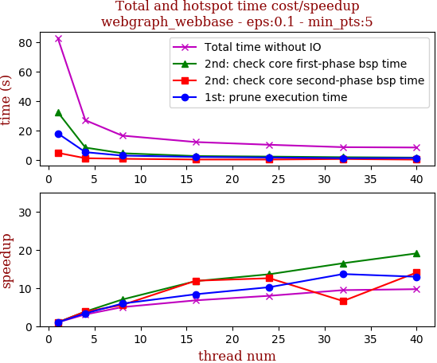

thread_num | prune | check-core 1st bsp | check-core 2nd bsp | cluster-core | cluster-non-core | total | total speedup
--- | --- | --- | --- | --- | --- | --- | ---
1 | 18.168s | 32.576s | 4.945s | 14.277s | 12.966s | 82.936s | 1.000
4 | 5.409s | 8.509s | 1.296s | 5.119s | 6.761s | 27.1s | 3.060
8 | 3.078s | 4.675s | 0.894s | 3.28s | 4.717s | 16.648s | 4.982
16 | 2.174s | 2.762s | 0.416s | 1.806s | 5.101s | 12.273s | 6.758
24 | 1.781s | 2.397s | 0.394s | 1.765s | 4.079s | 10.431s | 7.951
32 | 1.332s | 1.978s | 0.752s | 1.96s | 2.766s | 8.796s | 9.429
40 | 1.405s | 1.71s | 0.352s | 1.488s | 3.596s | 8.564s | 9.684

## eps:0.2

overview | speedup
--- | ---
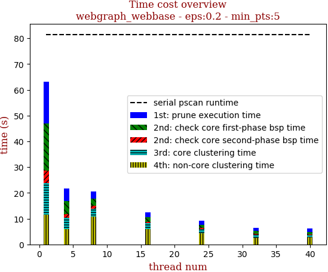 | 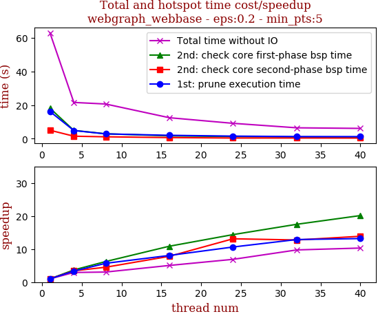

thread_num | prune | check-core 1st bsp | check-core 2nd bsp | cluster-core | cluster-non-core | total | total speedup
--- | --- | --- | --- | --- | --- | --- | ---
1 | 16.186s | 18.148s | 5.024s | 12.194s | 11.481s | 63.043s | 1.000
4 | 4.859s | 4.924s | 1.468s | 4.302s | 6.03s | 21.593s | 2.920
8 | 2.841s | 2.911s | 1.114s | 2.928s | 10.845s | 20.65s | 3.053
16 | 2.004s | 1.67s | 0.643s | 2.112s | 6.053s | 12.484s | 5.050
24 | 1.523s | 1.262s | 0.383s | 1.542s | 4.42s | 9.14s | 6.897
32 | 1.256s | 1.037s | 0.394s | 1.257s | 2.516s | 6.47s | 9.744
40 | 1.228s | 0.901s | 0.362s | 0.976s | 2.64s | 6.114s | 10.311

## eps:0.3

overview | speedup
--- | ---
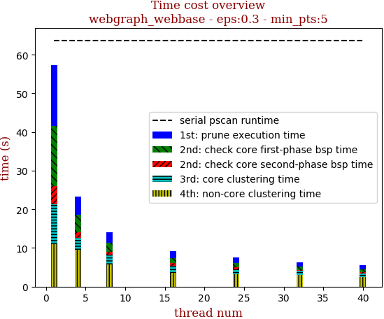 | 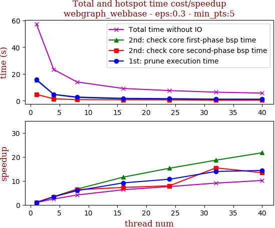

thread_num | prune | check-core 1st bsp | check-core 2nd bsp | cluster-core | cluster-non-core | total | total speedup
--- | --- | --- | --- | --- | --- | --- | ---
1 | 15.886s | 15.509s | 4.671s | 10.264s | 11.061s | 57.402s | 1.000
4 | 4.713s | 4.541s | 1.391s | 3.181s | 9.471s | 23.3s | 2.464
8 | 2.685s | 2.367s | 0.74s | 2.531s | 5.664s | 13.991s | 4.103
16 | 1.733s | 1.342s | 0.643s | 1.832s | 3.548s | 9.101s | 6.307
24 | 1.487s | 1.016s | 0.587s | 1.303s | 3.144s | 7.541s | 7.612
32 | 1.142s | 0.833s | 0.303s | 1.087s | 2.964s | 6.332s | 9.065
40 | 1.108s | 0.714s | 0.349s | 1.016s | 2.457s | 5.648s | 10.163

## eps:0.4

overview | speedup
--- | ---
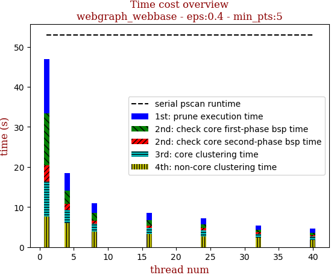 | 

thread_num | prune | check-core 1st bsp | check-core 2nd bsp | cluster-core | cluster-non-core | total | total speedup
--- | --- | --- | --- | --- | --- | --- | ---
1 | 13.518s | 12.92s | 4.157s | 8.752s | 7.568s | 46.918s | 1.000
4 | 4.248s | 3.428s | 1.415s | 3.377s | 5.938s | 18.409s | 2.549
8 | 2.371s | 1.996s | 0.67s | 2.058s | 3.844s | 10.942s | 4.288
16 | 1.774s | 1.341s | 0.575s | 1.475s | 3.335s | 8.504s | 5.517
24 | 1.427s | 0.923s | 0.589s | 1.48s | 2.711s | 7.133s | 6.578
32 | 1.074s | 0.696s | 0.357s | 0.863s | 2.433s | 5.433s | 8.636
40 | 1.049s | 0.61s | 0.365s | 0.78s | 1.833s | 4.641s | 10.109

## eps:0.5

overview | speedup
--- | ---
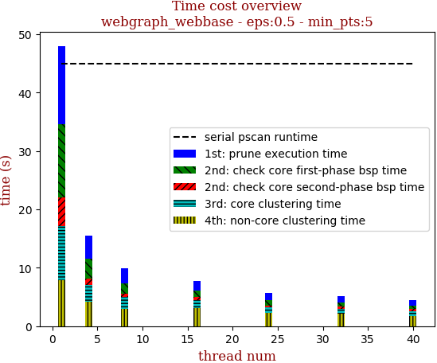 | 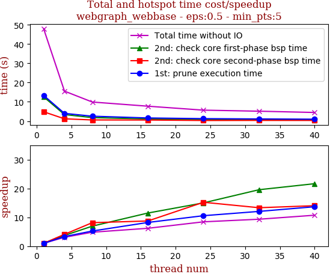

thread_num | prune | check-core 1st bsp | check-core 2nd bsp | cluster-core | cluster-non-core | total | total speedup
--- | --- | --- | --- | --- | --- | --- | ---
1 | 13.355s | 12.612s | 4.843s | 9.292s | 7.895s | 48.001s | 1.000
4 | 4.007s | 3.382s | 1.178s | 2.851s | 4.139s | 15.561s | 3.085
8 | 2.54s | 1.816s | 0.594s | 1.944s | 3.0s | 9.902s | 4.848
16 | 1.623s | 1.097s | 0.554s | 1.343s | 3.111s | 7.732s | 6.208
24 | 1.263s | 0.84s | 0.318s | 1.032s | 2.22s | 5.68s | 8.451
32 | 1.107s | 0.644s | 0.363s | 0.859s | 2.146s | 5.133s | 9.351
40 | 0.976s | 0.582s | 0.345s | 0.797s | 1.763s | 4.469s | 10.741

## eps:0.6

overview | speedup
--- | ---
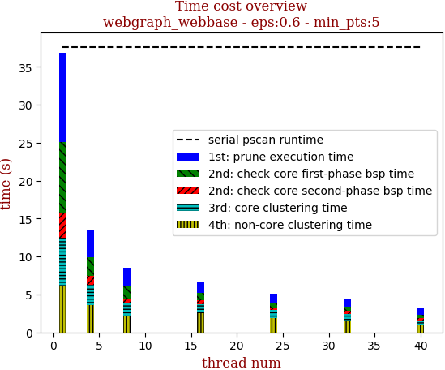 | 

thread_num | prune | check-core 1st bsp | check-core 2nd bsp | cluster-core | cluster-non-core | total | total speedup
--- | --- | --- | --- | --- | --- | --- | ---
1 | 11.821s | 9.341s | 3.228s | 6.405s | 6.071s | 36.88s | 1.000
4 | 3.629s | 2.509s | 1.147s | 2.624s | 3.655s | 13.568s | 2.718
8 | 2.273s | 1.704s | 0.594s | 1.661s | 2.251s | 8.494s | 4.342
16 | 1.452s | 0.992s | 0.516s | 1.229s | 2.514s | 6.713s | 5.494
24 | 1.166s | 0.651s | 0.376s | 1.002s | 1.929s | 5.129s | 7.190
32 | 1.001s | 0.543s | 0.347s | 0.851s | 1.623s | 4.375s | 8.430
40 | 0.951s | 0.479s | 0.299s | 0.547s | 1.033s | 3.314s | 11.129

## eps:0.7

overview | speedup
--- | ---
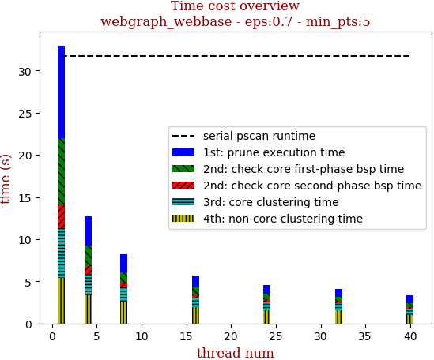 | 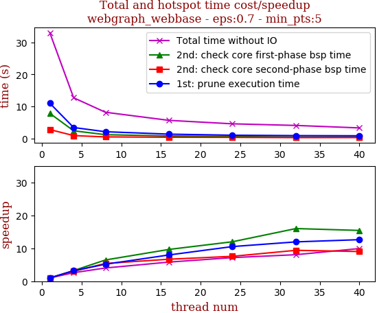

thread_num | prune | check-core 1st bsp | check-core 2nd bsp | cluster-core | cluster-non-core | total | total speedup
--- | --- | --- | --- | --- | --- | --- | ---
1 | 11.015s | 7.849s | 2.806s | 5.86s | 5.428s | 32.964s | 1.000
4 | 3.447s | 2.426s | 0.928s | 2.524s | 3.381s | 12.709s | 2.594
8 | 2.134s | 1.216s | 0.52s | 1.732s | 2.588s | 8.198s | 4.021
16 | 1.381s | 0.813s | 0.42s | 1.142s | 1.913s | 5.675s | 5.809
24 | 1.047s | 0.655s | 0.371s | 0.942s | 1.577s | 4.597s | 7.171
32 | 0.922s | 0.491s | 0.299s | 0.802s | 1.572s | 4.091s | 8.058
40 | 0.873s | 0.509s | 0.311s | 0.614s | 1.011s | 3.321s | 9.926

## eps:0.8

overview | speedup
--- | ---
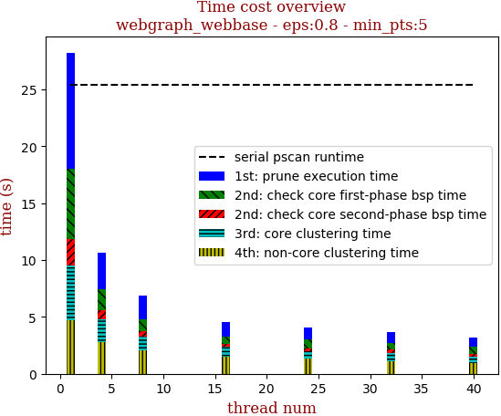 | 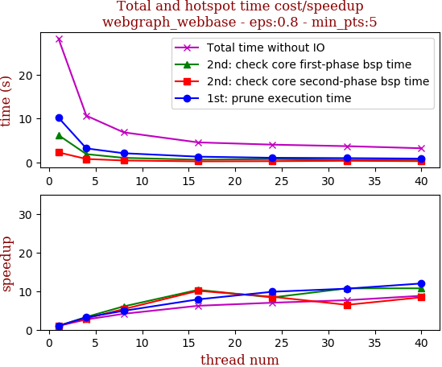

thread_num | prune | check-core 1st bsp | check-core 2nd bsp | cluster-core | cluster-non-core | total | total speedup
--- | --- | --- | --- | --- | --- | --- | ---
1 | 10.183s | 6.208s | 2.269s | 4.835s | 4.718s | 28.217s | 1.000
4 | 3.173s | 1.87s | 0.77s | 2.048s | 2.757s | 10.626s | 2.655
8 | 2.079s | 1.027s | 0.425s | 1.211s | 2.091s | 6.837s | 4.127
16 | 1.294s | 0.601s | 0.225s | 0.932s | 1.489s | 4.545s | 6.208
24 | 1.035s | 0.742s | 0.266s | 0.649s | 1.335s | 4.03s | 7.002
32 | 0.957s | 0.579s | 0.352s | 0.704s | 1.093s | 3.687s | 7.653
40 | 0.85s | 0.579s | 0.27s | 0.601s | 0.907s | 3.209s | 8.793

## eps:0.9

overview | speedup
--- | ---
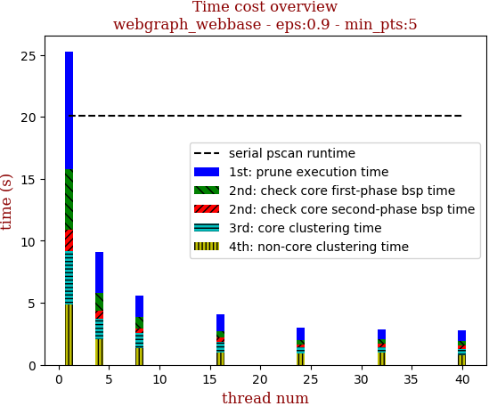 | 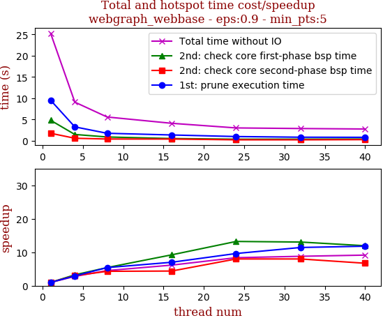

thread_num | prune | check-core 1st bsp | check-core 2nd bsp | cluster-core | cluster-non-core | total | total speedup
--- | --- | --- | --- | --- | --- | --- | ---
1 | 9.53s | 4.815s | 1.759s | 4.287s | 4.882s | 25.277s | 1.000
4 | 3.263s | 1.479s | 0.586s | 1.707s | 2.041s | 9.083s | 2.783
8 | 1.759s | 0.888s | 0.408s | 1.171s | 1.36s | 5.589s | 4.523
16 | 1.36s | 0.522s | 0.401s | 0.824s | 0.996s | 4.106s | 6.156
24 | 0.99s | 0.364s | 0.22s | 0.519s | 0.92s | 3.017s | 8.378
32 | 0.834s | 0.369s | 0.22s | 0.481s | 0.967s | 2.874s | 8.795
40 | 0.807s | 0.403s | 0.262s | 0.526s | 0.762s | 2.763s | 9.148

