## small_snap_dblp

workload | runtime
--- | ---
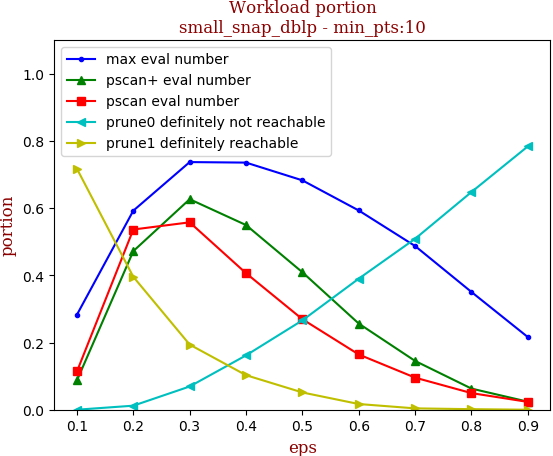 | 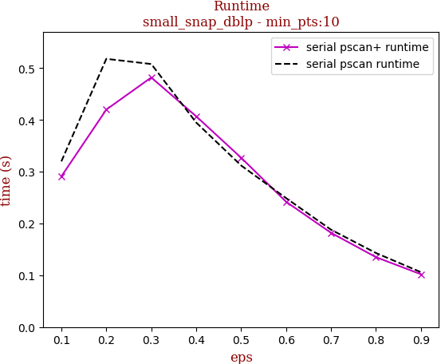

tag | eps-0.1 | eps-0.2 | eps-0.3 | eps-0.4 | eps-0.5 | eps-0.6 | eps-0.7 | eps-0.8 | eps-0.9
--- | --- | --- | --- | --- | --- | --- | --- | --- | ---
prune0 definitely not reachable | 0.000 | 0.012 | 0.069 | 0.162 | 0.266 | 0.390 | 0.509 | 0.648 | 0.784
prune1 definitely reachable | 0.717 | 0.396 | 0.194 | 0.103 | 0.051 | 0.017 | 0.004 | 0.002 | 0.000
max eval number | 0.283 | 0.592 | 0.737 | 0.735 | 0.683 | 0.593 | 0.487 | 0.350 | 0.216
pscan eval number | 0.114 | 0.536 | 0.558 | 0.406 | 0.269 | 0.164 | 0.095 | 0.049 | 0.023
pscan+ eval number | 0.087 | 0.472 | 0.627 | 0.550 | 0.409 | 0.256 | 0.145 | 0.063 | 0.024
serial pscan runtime | 0.320 | 0.518 | 0.508 | 0.395 | 0.312 | 0.249 | 0.188 | 0.143 | 0.106
serial pscan+ runtime | 0.291 | 0.420 | 0.482 | 0.407 | 0.327 | 0.242 | 0.182 | 0.135 | 0.102

## snap_pokec

workload | runtime
--- | ---
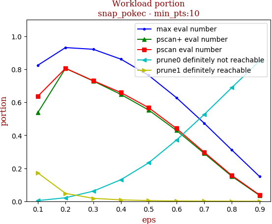 | 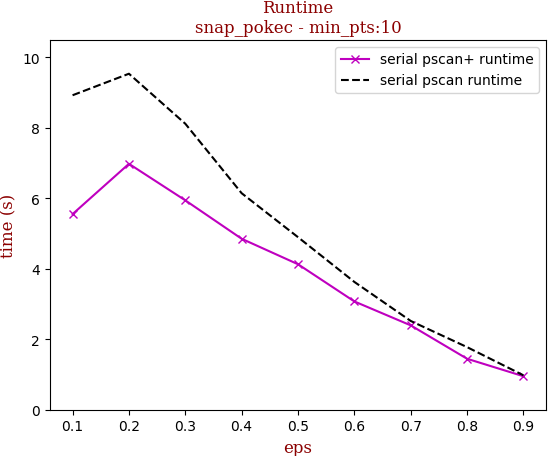

tag | eps-0.1 | eps-0.2 | eps-0.3 | eps-0.4 | eps-0.5 | eps-0.6 | eps-0.7 | eps-0.8 | eps-0.9
--- | --- | --- | --- | --- | --- | --- | --- | --- | ---
prune0 definitely not reachable | 0.004 | 0.021 | 0.061 | 0.131 | 0.233 | 0.370 | 0.525 | 0.689 | 0.850
prune1 definitely reachable | 0.172 | 0.048 | 0.018 | 0.008 | 0.004 | 0.002 | 0.001 | 0.001 | 0.000
max eval number | 0.824 | 0.931 | 0.921 | 0.861 | 0.763 | 0.628 | 0.473 | 0.310 | 0.150
pscan eval number | 0.636 | 0.806 | 0.730 | 0.659 | 0.567 | 0.441 | 0.298 | 0.156 | 0.038
pscan+ eval number | 0.537 | 0.805 | 0.729 | 0.647 | 0.553 | 0.430 | 0.291 | 0.151 | 0.035
serial pscan runtime | 8.926 | 9.537 | 8.118 | 6.145 | 4.897 | 3.627 | 2.519 | 1.776 | 0.976
serial pscan+ runtime | 5.553 | 6.980 | 5.943 | 4.852 | 4.129 | 3.073 | 2.394 | 1.446 | 0.950

## snap_livejournal

workload | runtime
--- | ---
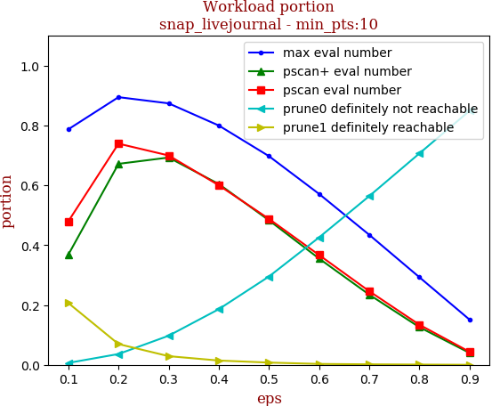 | 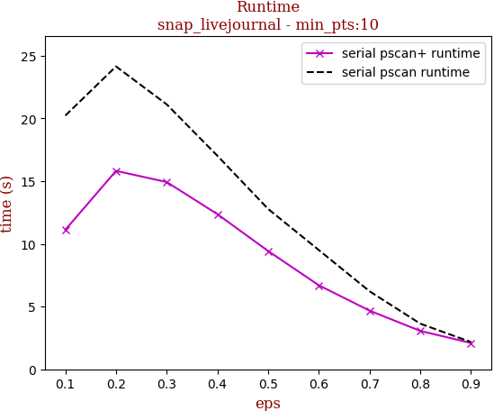

tag | eps-0.1 | eps-0.2 | eps-0.3 | eps-0.4 | eps-0.5 | eps-0.6 | eps-0.7 | eps-0.8 | eps-0.9
--- | --- | --- | --- | --- | --- | --- | --- | --- | ---
prune0 definitely not reachable | 0.006 | 0.036 | 0.097 | 0.186 | 0.295 | 0.426 | 0.564 | 0.706 | 0.849
prune1 definitely reachable | 0.206 | 0.069 | 0.029 | 0.014 | 0.007 | 0.003 | 0.002 | 0.001 | 0.000
max eval number | 0.787 | 0.895 | 0.874 | 0.800 | 0.698 | 0.571 | 0.435 | 0.293 | 0.151
pscan eval number | 0.480 | 0.739 | 0.700 | 0.600 | 0.488 | 0.367 | 0.246 | 0.134 | 0.043
pscan+ eval number | 0.368 | 0.672 | 0.693 | 0.604 | 0.483 | 0.355 | 0.235 | 0.126 | 0.040
serial pscan runtime | 20.219 | 24.138 | 21.115 | 17.014 | 12.777 | 9.500 | 6.216 | 3.634 | 2.169
serial pscan+ runtime | 11.115 | 15.814 | 14.924 | 12.361 | 9.426 | 6.693 | 4.673 | 3.058 | 2.094

## snap_orkut

workload | runtime
--- | ---
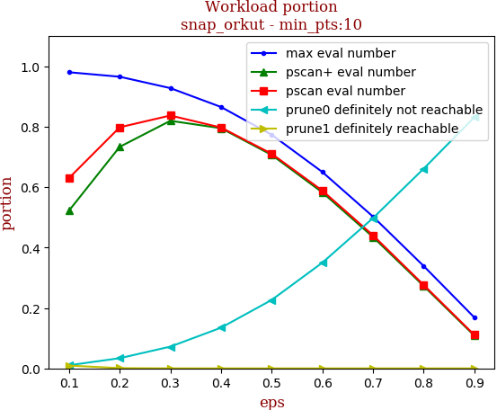 | 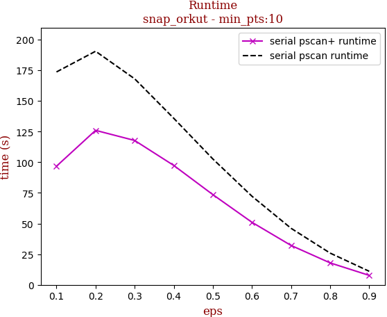

tag | eps-0.1 | eps-0.2 | eps-0.3 | eps-0.4 | eps-0.5 | eps-0.6 | eps-0.7 | eps-0.8 | eps-0.9
--- | --- | --- | --- | --- | --- | --- | --- | --- | ---
prune0 definitely not reachable | 0.010 | 0.034 | 0.072 | 0.135 | 0.227 | 0.350 | 0.497 | 0.661 | 0.831
prune1 definitely reachable | 0.009 | 0.001 | 0.000 | 0.000 | 0.000 | 0.000 | 0.000 | 0.000 | 0.000
max eval number | 0.980 | 0.965 | 0.928 | 0.865 | 0.773 | 0.650 | 0.503 | 0.339 | 0.169
pscan eval number | 0.630 | 0.798 | 0.837 | 0.797 | 0.710 | 0.588 | 0.441 | 0.276 | 0.111
pscan+ eval number | 0.522 | 0.733 | 0.820 | 0.795 | 0.707 | 0.583 | 0.435 | 0.273 | 0.109
serial pscan runtime | 173.592 | 190.470 | 167.988 | 135.801 | 102.643 | 72.265 | 46.120 | 25.886 | 11.039
serial pscan+ runtime | 96.737 | 125.970 | 117.716 | 97.349 | 73.557 | 51.008 | 32.130 | 17.894 | 7.706

## webgraph_uk

workload | runtime
--- | ---
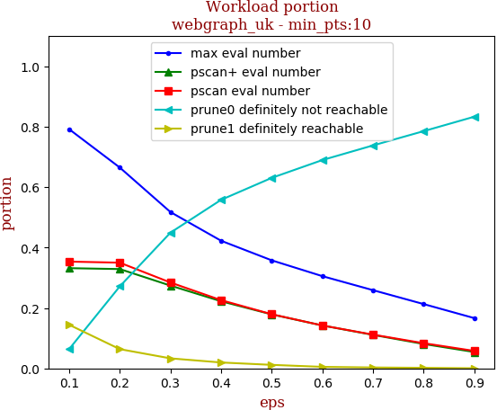 | 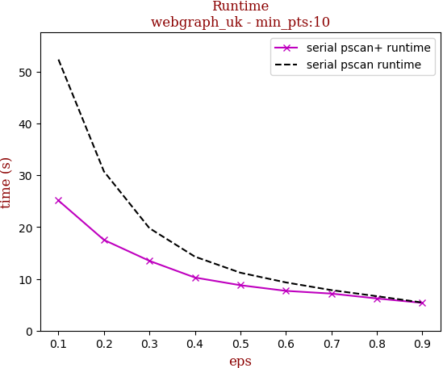

tag | eps-0.1 | eps-0.2 | eps-0.3 | eps-0.4 | eps-0.5 | eps-0.6 | eps-0.7 | eps-0.8 | eps-0.9
--- | --- | --- | --- | --- | --- | --- | --- | --- | ---
prune0 definitely not reachable | 0.064 | 0.272 | 0.449 | 0.558 | 0.631 | 0.690 | 0.738 | 0.785 | 0.833
prune1 definitely reachable | 0.144 | 0.064 | 0.033 | 0.020 | 0.012 | 0.005 | 0.003 | 0.002 | 0.000
max eval number | 0.792 | 0.665 | 0.517 | 0.422 | 0.358 | 0.305 | 0.259 | 0.213 | 0.166
pscan eval number | 0.353 | 0.350 | 0.284 | 0.226 | 0.179 | 0.142 | 0.112 | 0.083 | 0.058
pscan+ eval number | 0.332 | 0.329 | 0.274 | 0.222 | 0.179 | 0.142 | 0.111 | 0.081 | 0.054
serial pscan runtime | 52.331 | 30.725 | 19.778 | 14.284 | 11.183 | 9.310 | 7.827 | 6.650 | 5.427
serial pscan+ runtime | 25.113 | 17.509 | 13.473 | 10.251 | 8.768 | 7.680 | 7.153 | 6.212 | 5.358

## webgraph_webbase

workload | runtime
--- | ---
 | 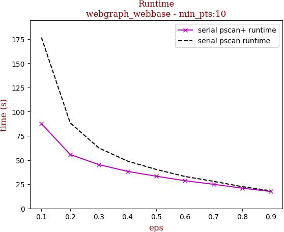

tag | eps-0.1 | eps-0.2 | eps-0.3 | eps-0.4 | eps-0.5 | eps-0.6 | eps-0.7 | eps-0.8 | eps-0.9
--- | --- | --- | --- | --- | --- | --- | --- | --- | ---
prune0 definitely not reachable | 0.080 | 0.265 | 0.388 | 0.482 | 0.555 | 0.625 | 0.684 | 0.751 | 0.813
prune1 definitely reachable | 0.294 | 0.155 | 0.088 | 0.054 | 0.033 | 0.014 | 0.008 | 0.005 | 0.001
max eval number | 0.626 | 0.581 | 0.524 | 0.463 | 0.412 | 0.361 | 0.308 | 0.244 | 0.186
pscan eval number | 0.343 | 0.366 | 0.311 | 0.244 | 0.192 | 0.147 | 0.113 | 0.079 | 0.053
pscan+ eval number | 0.325 | 0.349 | 0.316 | 0.262 | 0.214 | 0.166 | 0.126 | 0.085 | 0.053
serial pscan runtime | 176.553 | 88.455 | 62.502 | 48.931 | 40.284 | 33.055 | 28.006 | 22.489 | 18.274
serial pscan+ runtime | 87.540 | 55.764 | 45.246 | 38.321 | 33.311 | 28.709 | 24.942 | 20.967 | 17.497

## webgraph_twitter

workload | runtime
--- | ---
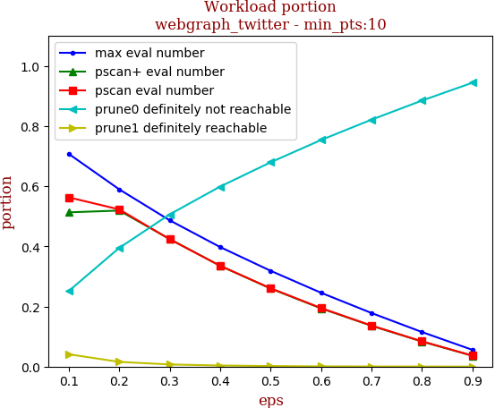 | 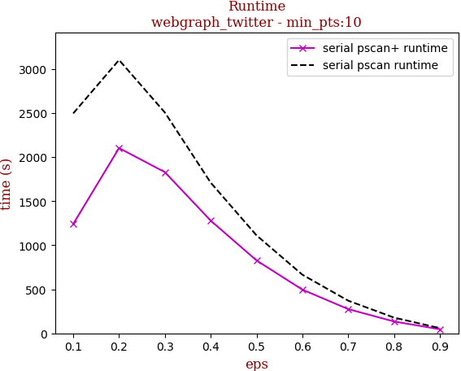

tag | eps-0.1 | eps-0.2 | eps-0.3 | eps-0.4 | eps-0.5 | eps-0.6 | eps-0.7 | eps-0.8 | eps-0.9
--- | --- | --- | --- | --- | --- | --- | --- | --- | ---
prune0 definitely not reachable | 0.251 | 0.395 | 0.506 | 0.599 | 0.679 | 0.754 | 0.821 | 0.885 | 0.944
prune1 definitely reachable | 0.041 | 0.016 | 0.007 | 0.004 | 0.002 | 0.001 | 0.000 | 0.000 | 0.000
max eval number | 0.708 | 0.590 | 0.487 | 0.398 | 0.319 | 0.246 | 0.178 | 0.115 | 0.056
pscan eval number | 0.563 | 0.523 | 0.424 | 0.335 | 0.261 | 0.195 | 0.137 | 0.084 | 0.036
pscan+ eval number | 0.513 | 0.519 | 0.424 | 0.335 | 0.260 | 0.194 | 0.136 | 0.083 | 0.036
serial pscan runtime | 2496.162 | 3102.021 | 2505.708 | 1709.792 | 1111.877 | 665.625 | 370.735 | 178.761 | 58.856
serial pscan+ runtime | 1241.059 | 2102.837 | 1828.919 | 1278.996 | 827.329 | 496.229 | 275.167 | 134.680 | 46.480

## snap_friendster

workload | runtime
--- | ---
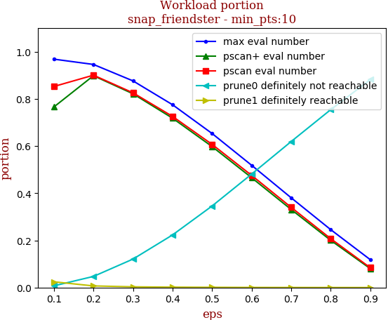 | 

tag | eps-0.1 | eps-0.2 | eps-0.3 | eps-0.4 | eps-0.5 | eps-0.6 | eps-0.7 | eps-0.8 | eps-0.9
--- | --- | --- | --- | --- | --- | --- | --- | --- | ---
prune0 definitely not reachable | 0.007 | 0.047 | 0.121 | 0.223 | 0.346 | 0.481 | 0.619 | 0.754 | 0.882
prune1 definitely reachable | 0.024 | 0.007 | 0.003 | 0.002 | 0.001 | 0.000 | 0.000 | 0.000 | 0.000
max eval number | 0.969 | 0.946 | 0.876 | 0.775 | 0.653 | 0.518 | 0.381 | 0.245 | 0.118
pscan eval number | 0.853 | 0.901 | 0.826 | 0.726 | 0.607 | 0.476 | 0.340 | 0.207 | 0.084
pscan+ eval number | 0.766 | 0.898 | 0.822 | 0.718 | 0.598 | 0.466 | 0.331 | 0.200 | 0.080
serial pscan runtime | 5282.049 | 4679.658 | 3687.915 | 2788.635 | 2000.328 | 1354.731 | 863.778 | 486.023 | 230.492
serial pscan+ runtime | 3431.670 | 3291.382 | 2605.923 | 1968.284 | 1414.988 | 951.416 | 600.978 | 342.110 | 170.117

## 10million_avgdeg15_maxdeg50_Cdefault

workload | runtime
--- | ---
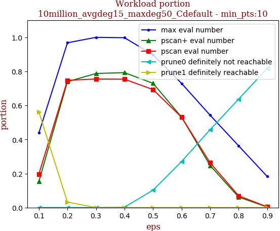 | 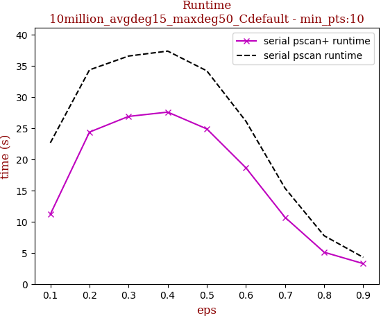

tag | eps-0.1 | eps-0.2 | eps-0.3 | eps-0.4 | eps-0.5 | eps-0.6 | eps-0.7 | eps-0.8 | eps-0.9
--- | --- | --- | --- | --- | --- | --- | --- | --- | ---
prune0 definitely not reachable | 0.000 | 0.000 | 0.000 | 0.002 | 0.102 | 0.270 | 0.457 | 0.637 | 0.817
prune1 definitely reachable | 0.562 | 0.032 | 0.000 | 0.000 | 0.000 | 0.000 | 0.000 | 0.000 | 0.000
max eval number | 0.438 | 0.968 | 1.000 | 0.998 | 0.898 | 0.730 | 0.543 | 0.363 | 0.183
pscan eval number | 0.197 | 0.748 | 0.755 | 0.754 | 0.693 | 0.531 | 0.263 | 0.069 | 0.004
pscan+ eval number | 0.153 | 0.740 | 0.788 | 0.793 | 0.730 | 0.531 | 0.246 | 0.062 | 0.003
serial pscan runtime | 22.652 | 34.348 | 36.568 | 37.362 | 34.191 | 26.098 | 15.356 | 7.731 | 4.265
serial pscan+ runtime | 11.188 | 24.367 | 26.882 | 27.570 | 24.876 | 18.631 | 10.681 | 5.086 | 3.259

