## small_snap_dblp

workload | runtime
--- | ---
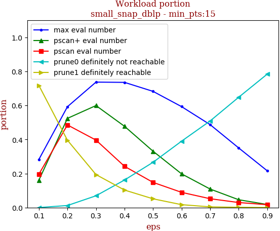 | 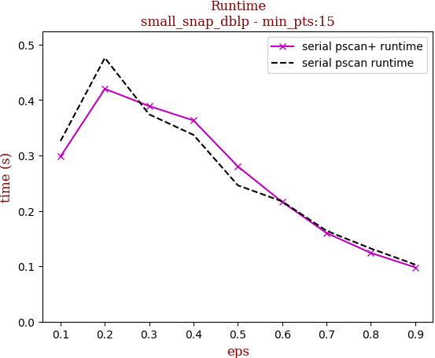

tag | eps-0.1 | eps-0.2 | eps-0.3 | eps-0.4 | eps-0.5 | eps-0.6 | eps-0.7 | eps-0.8 | eps-0.9
--- | --- | --- | --- | --- | --- | --- | --- | --- | ---
prune0 definitely not reachable | 0.000 | 0.012 | 0.069 | 0.162 | 0.266 | 0.390 | 0.509 | 0.648 | 0.784
prune1 definitely reachable | 0.717 | 0.396 | 0.194 | 0.103 | 0.051 | 0.017 | 0.004 | 0.002 | 0.000
max eval number | 0.283 | 0.592 | 0.737 | 0.735 | 0.683 | 0.593 | 0.487 | 0.350 | 0.216
pscan eval number | 0.196 | 0.485 | 0.396 | 0.242 | 0.148 | 0.089 | 0.052 | 0.030 | 0.017
pscan+ eval number | 0.161 | 0.524 | 0.599 | 0.477 | 0.331 | 0.198 | 0.109 | 0.046 | 0.018
serial pscan runtime | 0.326 | 0.476 | 0.374 | 0.337 | 0.246 | 0.217 | 0.164 | 0.132 | 0.103
serial pscan+ runtime | 0.298 | 0.420 | 0.389 | 0.363 | 0.280 | 0.216 | 0.160 | 0.124 | 0.098

## snap_pokec

workload | runtime
--- | ---
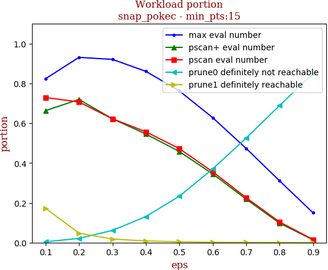 | 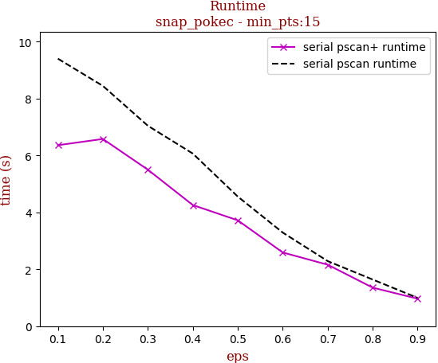

tag | eps-0.1 | eps-0.2 | eps-0.3 | eps-0.4 | eps-0.5 | eps-0.6 | eps-0.7 | eps-0.8 | eps-0.9
--- | --- | --- | --- | --- | --- | --- | --- | --- | ---
prune0 definitely not reachable | 0.004 | 0.021 | 0.061 | 0.131 | 0.233 | 0.370 | 0.525 | 0.689 | 0.850
prune1 definitely reachable | 0.172 | 0.048 | 0.018 | 0.008 | 0.004 | 0.002 | 0.001 | 0.001 | 0.000
max eval number | 0.824 | 0.931 | 0.921 | 0.861 | 0.763 | 0.628 | 0.473 | 0.310 | 0.150
pscan eval number | 0.729 | 0.707 | 0.622 | 0.557 | 0.472 | 0.356 | 0.226 | 0.104 | 0.015
pscan+ eval number | 0.663 | 0.720 | 0.622 | 0.546 | 0.458 | 0.345 | 0.218 | 0.098 | 0.014
serial pscan runtime | 9.399 | 8.443 | 7.043 | 6.065 | 4.554 | 3.289 | 2.286 | 1.639 | 0.993
serial pscan+ runtime | 6.359 | 6.578 | 5.499 | 4.256 | 3.719 | 2.590 | 2.159 | 1.354 | 0.965

## snap_livejournal

workload | runtime
--- | ---
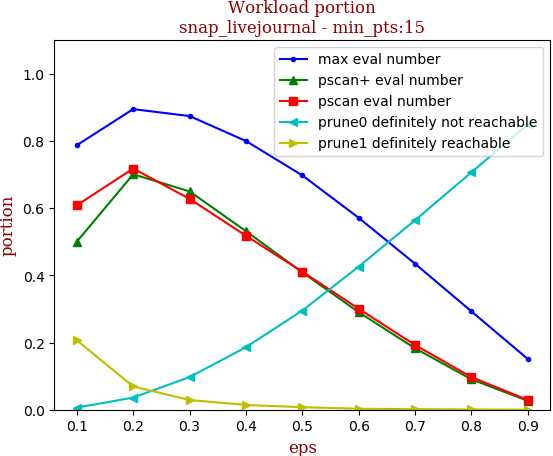 | 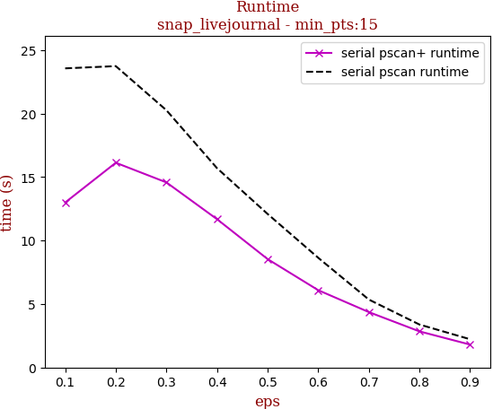

tag | eps-0.1 | eps-0.2 | eps-0.3 | eps-0.4 | eps-0.5 | eps-0.6 | eps-0.7 | eps-0.8 | eps-0.9
--- | --- | --- | --- | --- | --- | --- | --- | --- | ---
prune0 definitely not reachable | 0.006 | 0.036 | 0.097 | 0.186 | 0.295 | 0.426 | 0.564 | 0.706 | 0.849
prune1 definitely reachable | 0.206 | 0.069 | 0.029 | 0.014 | 0.007 | 0.003 | 0.002 | 0.001 | 0.000
max eval number | 0.787 | 0.895 | 0.874 | 0.800 | 0.698 | 0.571 | 0.435 | 0.293 | 0.151
pscan eval number | 0.608 | 0.718 | 0.628 | 0.518 | 0.411 | 0.301 | 0.193 | 0.097 | 0.029
pscan+ eval number | 0.500 | 0.701 | 0.650 | 0.531 | 0.409 | 0.290 | 0.183 | 0.091 | 0.026
serial pscan runtime | 23.551 | 23.727 | 20.255 | 15.693 | 12.087 | 8.636 | 5.348 | 3.382 | 2.224
serial pscan+ runtime | 12.990 | 16.120 | 14.573 | 11.677 | 8.534 | 6.086 | 4.361 | 2.843 | 1.803

## snap_orkut

workload | runtime
--- | ---
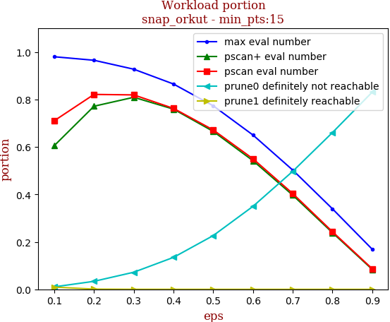 | 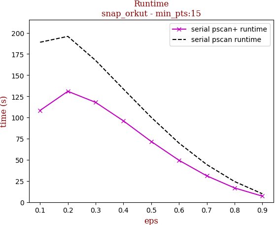

tag | eps-0.1 | eps-0.2 | eps-0.3 | eps-0.4 | eps-0.5 | eps-0.6 | eps-0.7 | eps-0.8 | eps-0.9
--- | --- | --- | --- | --- | --- | --- | --- | --- | ---
prune0 definitely not reachable | 0.010 | 0.034 | 0.072 | 0.135 | 0.227 | 0.350 | 0.497 | 0.661 | 0.831
prune1 definitely reachable | 0.009 | 0.001 | 0.000 | 0.000 | 0.000 | 0.000 | 0.000 | 0.000 | 0.000
max eval number | 0.980 | 0.965 | 0.928 | 0.865 | 0.773 | 0.650 | 0.503 | 0.339 | 0.169
pscan eval number | 0.711 | 0.822 | 0.819 | 0.763 | 0.672 | 0.550 | 0.404 | 0.243 | 0.087
pscan+ eval number | 0.606 | 0.772 | 0.809 | 0.759 | 0.666 | 0.542 | 0.397 | 0.238 | 0.084
serial pscan runtime | 188.927 | 195.843 | 167.395 | 133.601 | 100.275 | 69.823 | 44.429 | 24.399 | 9.932
serial pscan+ runtime | 108.404 | 130.976 | 117.880 | 96.032 | 71.728 | 49.495 | 31.108 | 16.824 | 7.137

## webgraph_uk

workload | runtime
--- | ---
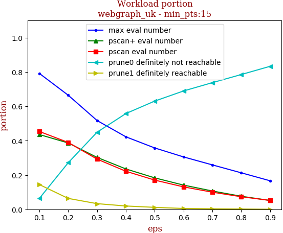 | 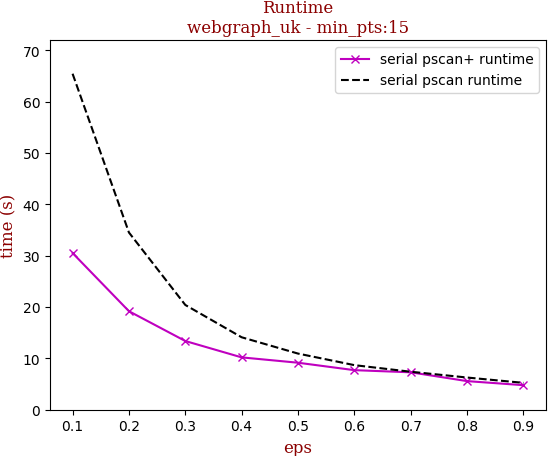

tag | eps-0.1 | eps-0.2 | eps-0.3 | eps-0.4 | eps-0.5 | eps-0.6 | eps-0.7 | eps-0.8 | eps-0.9
--- | --- | --- | --- | --- | --- | --- | --- | --- | ---
prune0 definitely not reachable | 0.064 | 0.272 | 0.449 | 0.558 | 0.631 | 0.690 | 0.738 | 0.785 | 0.833
prune1 definitely reachable | 0.144 | 0.064 | 0.033 | 0.020 | 0.012 | 0.005 | 0.003 | 0.002 | 0.000
max eval number | 0.792 | 0.665 | 0.517 | 0.422 | 0.358 | 0.305 | 0.259 | 0.213 | 0.166
pscan eval number | 0.454 | 0.390 | 0.293 | 0.222 | 0.170 | 0.131 | 0.100 | 0.073 | 0.052
pscan+ eval number | 0.436 | 0.387 | 0.303 | 0.235 | 0.183 | 0.141 | 0.107 | 0.076 | 0.052
serial pscan runtime | 65.441 | 34.515 | 20.404 | 14.110 | 10.934 | 8.682 | 7.397 | 6.270 | 5.233
serial pscan+ runtime | 30.516 | 19.188 | 13.381 | 10.193 | 9.153 | 7.705 | 7.289 | 5.571 | 4.780

## webgraph_webbase

workload | runtime
--- | ---
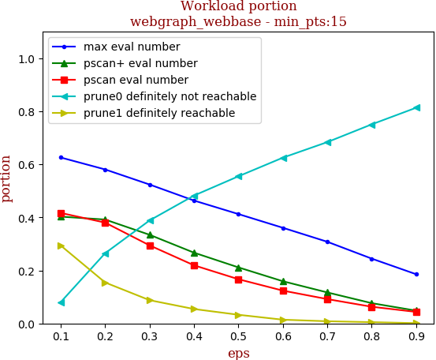 | 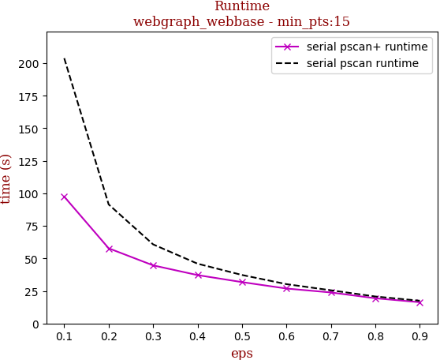

tag | eps-0.1 | eps-0.2 | eps-0.3 | eps-0.4 | eps-0.5 | eps-0.6 | eps-0.7 | eps-0.8 | eps-0.9
--- | --- | --- | --- | --- | --- | --- | --- | --- | ---
prune0 definitely not reachable | 0.080 | 0.265 | 0.388 | 0.482 | 0.555 | 0.625 | 0.684 | 0.751 | 0.813
prune1 definitely reachable | 0.294 | 0.155 | 0.088 | 0.054 | 0.033 | 0.014 | 0.008 | 0.005 | 0.001
max eval number | 0.626 | 0.581 | 0.524 | 0.463 | 0.412 | 0.361 | 0.308 | 0.244 | 0.186
pscan eval number | 0.417 | 0.380 | 0.295 | 0.219 | 0.167 | 0.124 | 0.092 | 0.063 | 0.044
pscan+ eval number | 0.403 | 0.392 | 0.334 | 0.267 | 0.211 | 0.159 | 0.117 | 0.077 | 0.048
serial pscan runtime | 203.836 | 91.456 | 60.776 | 45.936 | 37.262 | 30.218 | 25.514 | 20.725 | 17.475
serial pscan+ runtime | 97.456 | 57.767 | 44.651 | 37.172 | 31.783 | 26.847 | 23.828 | 19.366 | 16.331

## 10million_avgdeg15_maxdeg50_Cdefault

workload | runtime
--- | ---
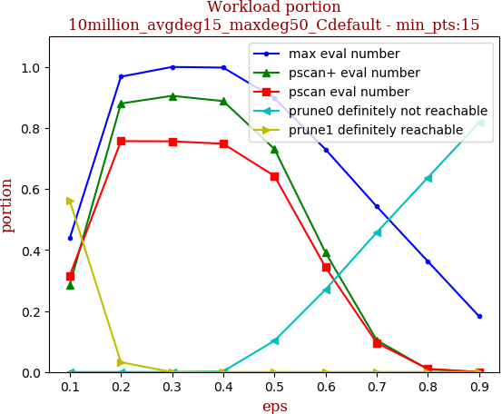 | 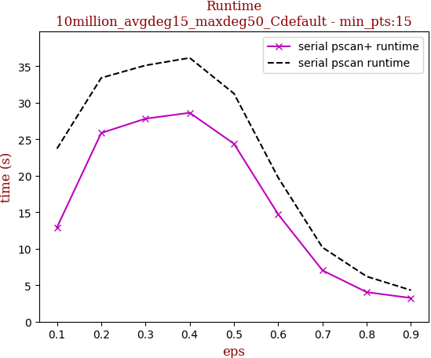

tag | eps-0.1 | eps-0.2 | eps-0.3 | eps-0.4 | eps-0.5 | eps-0.6 | eps-0.7 | eps-0.8 | eps-0.9
--- | --- | --- | --- | --- | --- | --- | --- | --- | ---
prune0 definitely not reachable | 0.000 | 0.000 | 0.000 | 0.002 | 0.102 | 0.270 | 0.457 | 0.637 | 0.817
prune1 definitely reachable | 0.562 | 0.032 | 0.000 | 0.000 | 0.000 | 0.000 | 0.000 | 0.000 | 0.000
max eval number | 0.438 | 0.968 | 1.000 | 0.998 | 0.898 | 0.730 | 0.543 | 0.363 | 0.183
pscan eval number | 0.316 | 0.757 | 0.756 | 0.748 | 0.643 | 0.343 | 0.096 | 0.010 | 0.000
pscan+ eval number | 0.285 | 0.880 | 0.905 | 0.888 | 0.731 | 0.391 | 0.104 | 0.009 | 0.000
serial pscan runtime | 23.710 | 33.403 | 35.114 | 36.143 | 31.257 | 19.734 | 10.176 | 6.194 | 4.311
serial pscan+ runtime | 12.920 | 25.850 | 27.814 | 28.621 | 24.377 | 14.698 | 7.028 | 4.042 | 3.243

