## small_snap_dblp

workload | runtime
--- | ---
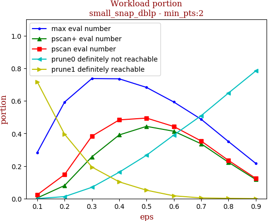 | 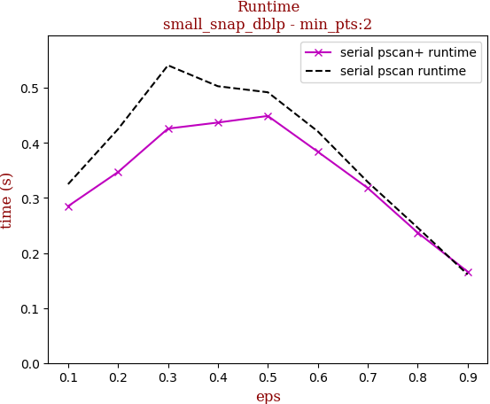

tag | eps-0.1 | eps-0.2 | eps-0.3 | eps-0.4 | eps-0.5 | eps-0.6 | eps-0.7 | eps-0.8 | eps-0.9
--- | --- | --- | --- | --- | --- | --- | --- | --- | ---
prune0 definitely not reachable | 0.000 | 0.012 | 0.069 | 0.162 | 0.266 | 0.390 | 0.509 | 0.648 | 0.784
prune1 definitely reachable | 0.717 | 0.396 | 0.194 | 0.103 | 0.051 | 0.017 | 0.004 | 0.002 | 0.000
max eval number | 0.283 | 0.592 | 0.737 | 0.735 | 0.683 | 0.593 | 0.487 | 0.350 | 0.216
pscan eval number | 0.023 | 0.147 | 0.383 | 0.483 | 0.494 | 0.443 | 0.354 | 0.234 | 0.124
pscan+ eval number | 0.004 | 0.080 | 0.256 | 0.391 | 0.443 | 0.413 | 0.337 | 0.223 | 0.117
serial pscan runtime | 0.325 | 0.425 | 0.541 | 0.503 | 0.492 | 0.421 | 0.329 | 0.246 | 0.161
serial pscan+ runtime | 0.285 | 0.347 | 0.426 | 0.437 | 0.449 | 0.384 | 0.318 | 0.237 | 0.166

## snap_pokec

workload | runtime
--- | ---
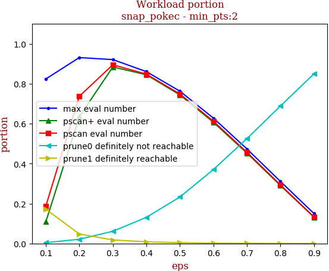 | 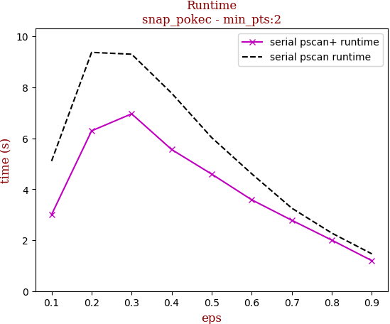

tag | eps-0.1 | eps-0.2 | eps-0.3 | eps-0.4 | eps-0.5 | eps-0.6 | eps-0.7 | eps-0.8 | eps-0.9
--- | --- | --- | --- | --- | --- | --- | --- | --- | ---
prune0 definitely not reachable | 0.004 | 0.021 | 0.061 | 0.131 | 0.233 | 0.370 | 0.525 | 0.689 | 0.850
prune1 definitely reachable | 0.172 | 0.048 | 0.018 | 0.008 | 0.004 | 0.002 | 0.001 | 0.001 | 0.000
max eval number | 0.824 | 0.931 | 0.921 | 0.861 | 0.763 | 0.628 | 0.473 | 0.310 | 0.150
pscan eval number | 0.186 | 0.737 | 0.895 | 0.848 | 0.749 | 0.612 | 0.457 | 0.293 | 0.133
pscan+ eval number | 0.108 | 0.635 | 0.884 | 0.845 | 0.744 | 0.607 | 0.452 | 0.290 | 0.131
serial pscan runtime | 5.104 | 9.370 | 9.299 | 7.768 | 6.024 | 4.604 | 3.256 | 2.277 | 1.462
serial pscan+ runtime | 3.001 | 6.291 | 6.958 | 5.556 | 4.592 | 3.583 | 2.781 | 2.001 | 1.196

## snap_livejournal

workload | runtime
--- | ---
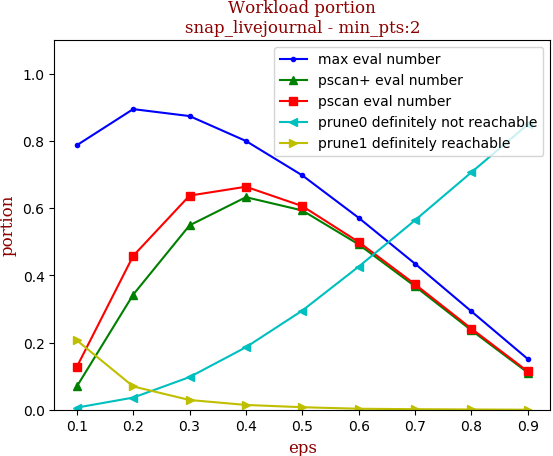 | 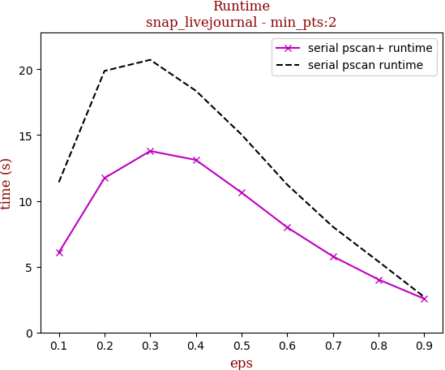

tag | eps-0.1 | eps-0.2 | eps-0.3 | eps-0.4 | eps-0.5 | eps-0.6 | eps-0.7 | eps-0.8 | eps-0.9
--- | --- | --- | --- | --- | --- | --- | --- | --- | ---
prune0 definitely not reachable | 0.006 | 0.036 | 0.097 | 0.186 | 0.295 | 0.426 | 0.564 | 0.706 | 0.849
prune1 definitely reachable | 0.206 | 0.069 | 0.029 | 0.014 | 0.007 | 0.003 | 0.002 | 0.001 | 0.000
max eval number | 0.787 | 0.895 | 0.874 | 0.800 | 0.698 | 0.571 | 0.435 | 0.293 | 0.151
pscan eval number | 0.128 | 0.458 | 0.637 | 0.664 | 0.606 | 0.499 | 0.373 | 0.241 | 0.114
pscan+ eval number | 0.069 | 0.342 | 0.549 | 0.633 | 0.593 | 0.492 | 0.367 | 0.236 | 0.111
serial pscan runtime | 11.417 | 19.879 | 20.721 | 18.368 | 15.037 | 11.231 | 8.030 | 5.382 | 2.691
serial pscan+ runtime | 6.073 | 11.737 | 13.790 | 13.112 | 10.628 | 7.984 | 5.781 | 4.020 | 2.560

## snap_orkut

workload | runtime
--- | ---
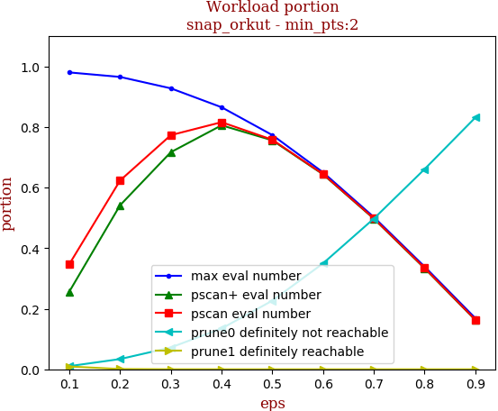 | 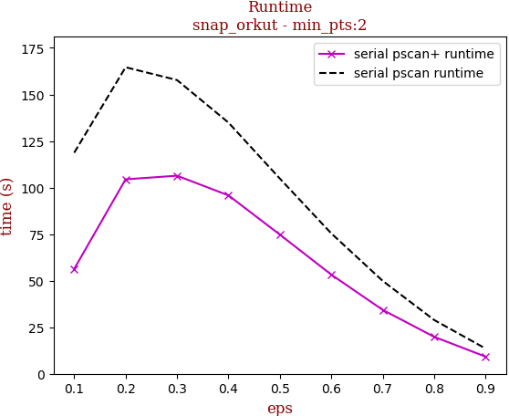

tag | eps-0.1 | eps-0.2 | eps-0.3 | eps-0.4 | eps-0.5 | eps-0.6 | eps-0.7 | eps-0.8 | eps-0.9
--- | --- | --- | --- | --- | --- | --- | --- | --- | ---
prune0 definitely not reachable | 0.010 | 0.034 | 0.072 | 0.135 | 0.227 | 0.350 | 0.497 | 0.661 | 0.831
prune1 definitely reachable | 0.009 | 0.001 | 0.000 | 0.000 | 0.000 | 0.000 | 0.000 | 0.000 | 0.000
max eval number | 0.980 | 0.965 | 0.928 | 0.865 | 0.773 | 0.650 | 0.503 | 0.339 | 0.169
pscan eval number | 0.347 | 0.623 | 0.773 | 0.816 | 0.758 | 0.644 | 0.498 | 0.335 | 0.164
pscan+ eval number | 0.256 | 0.542 | 0.717 | 0.806 | 0.756 | 0.644 | 0.497 | 0.333 | 0.163
serial pscan runtime | 118.697 | 164.593 | 157.721 | 134.895 | 104.830 | 75.400 | 49.903 | 28.908 | 13.578
serial pscan+ runtime | 56.289 | 104.416 | 106.361 | 95.811 | 74.732 | 53.252 | 34.324 | 19.860 | 9.222

## webgraph_uk

workload | runtime
--- | ---
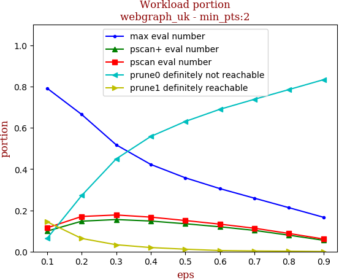 | 

tag | eps-0.1 | eps-0.2 | eps-0.3 | eps-0.4 | eps-0.5 | eps-0.6 | eps-0.7 | eps-0.8 | eps-0.9
--- | --- | --- | --- | --- | --- | --- | --- | --- | ---
prune0 definitely not reachable | 0.064 | 0.272 | 0.449 | 0.558 | 0.631 | 0.690 | 0.738 | 0.785 | 0.833
prune1 definitely reachable | 0.144 | 0.064 | 0.033 | 0.020 | 0.012 | 0.005 | 0.003 | 0.002 | 0.000
max eval number | 0.792 | 0.665 | 0.517 | 0.422 | 0.358 | 0.305 | 0.259 | 0.213 | 0.166
pscan eval number | 0.115 | 0.170 | 0.177 | 0.167 | 0.151 | 0.133 | 0.113 | 0.088 | 0.061
pscan+ eval number | 0.099 | 0.147 | 0.155 | 0.148 | 0.135 | 0.120 | 0.103 | 0.079 | 0.055
serial pscan runtime | 25.200 | 21.590 | 17.070 | 13.845 | 11.764 | 10.000 | 8.713 | 7.157 | 5.910
serial pscan+ runtime | 14.658 | 13.282 | 11.458 | 10.804 | 9.545 | 8.329 | 7.930 | 6.716 | 6.085

## webgraph_webbase

workload | runtime
--- | ---
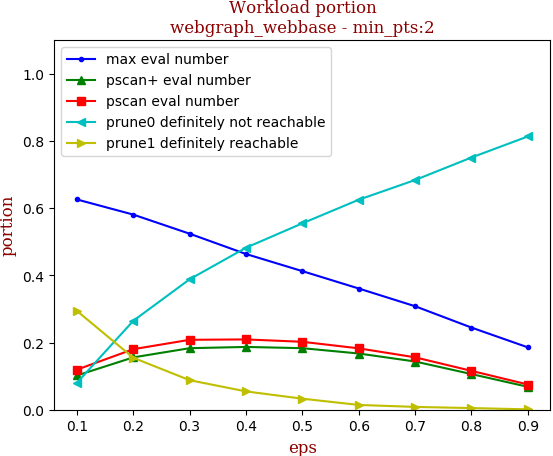 | 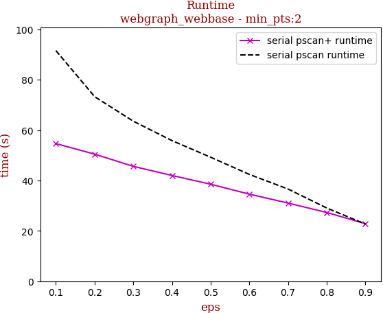

tag | eps-0.1 | eps-0.2 | eps-0.3 | eps-0.4 | eps-0.5 | eps-0.6 | eps-0.7 | eps-0.8 | eps-0.9
--- | --- | --- | --- | --- | --- | --- | --- | --- | ---
prune0 definitely not reachable | 0.080 | 0.265 | 0.388 | 0.482 | 0.555 | 0.625 | 0.684 | 0.751 | 0.813
prune1 definitely reachable | 0.294 | 0.155 | 0.088 | 0.054 | 0.033 | 0.014 | 0.008 | 0.005 | 0.001
max eval number | 0.626 | 0.581 | 0.524 | 0.463 | 0.412 | 0.361 | 0.308 | 0.244 | 0.186
pscan eval number | 0.119 | 0.180 | 0.208 | 0.209 | 0.202 | 0.183 | 0.156 | 0.116 | 0.075
pscan+ eval number | 0.102 | 0.156 | 0.183 | 0.187 | 0.183 | 0.167 | 0.144 | 0.106 | 0.068
serial pscan runtime | 91.544 | 73.273 | 63.532 | 55.822 | 49.220 | 42.408 | 36.601 | 29.070 | 22.685
serial pscan+ runtime | 54.628 | 50.457 | 45.602 | 41.980 | 38.508 | 34.572 | 31.029 | 27.286 | 22.854

## webgraph_twitter

workload | runtime
--- | ---
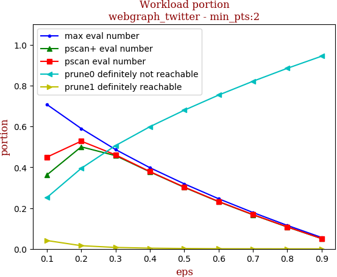 | 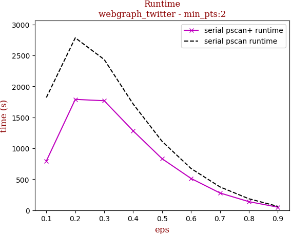

tag | eps-0.1 | eps-0.2 | eps-0.3 | eps-0.4 | eps-0.5 | eps-0.6 | eps-0.7 | eps-0.8 | eps-0.9
--- | --- | --- | --- | --- | --- | --- | --- | --- | ---
prune0 definitely not reachable | 0.251 | 0.395 | 0.506 | 0.599 | 0.679 | 0.754 | 0.821 | 0.885 | 0.944
prune1 definitely reachable | 0.041 | 0.016 | 0.007 | 0.004 | 0.002 | 0.001 | 0.000 | 0.000 | 0.000
max eval number | 0.708 | 0.590 | 0.487 | 0.398 | 0.319 | 0.246 | 0.178 | 0.115 | 0.056
pscan eval number | 0.450 | 0.528 | 0.461 | 0.379 | 0.303 | 0.232 | 0.168 | 0.108 | 0.051
pscan+ eval number | 0.362 | 0.500 | 0.457 | 0.377 | 0.301 | 0.231 | 0.167 | 0.107 | 0.050
serial pscan runtime | 1820.739 | 2785.254 | 2435.128 | 1716.330 | 1113.661 | 675.017 | 377.830 | 185.596 | 63.310
serial pscan+ runtime | 795.956 | 1791.406 | 1769.003 | 1282.867 | 832.651 | 514.151 | 279.539 | 139.022 | 50.273

## snap_friendster

workload | runtime
--- | ---
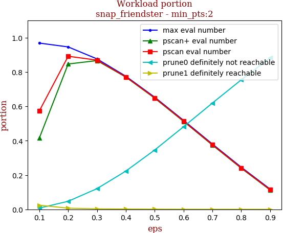 | 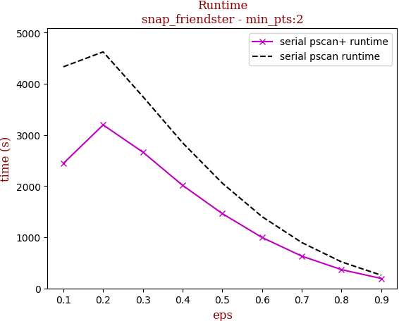

tag | eps-0.1 | eps-0.2 | eps-0.3 | eps-0.4 | eps-0.5 | eps-0.6 | eps-0.7 | eps-0.8 | eps-0.9
--- | --- | --- | --- | --- | --- | --- | --- | --- | ---
prune0 definitely not reachable | 0.007 | 0.047 | 0.121 | 0.223 | 0.346 | 0.481 | 0.619 | 0.754 | 0.882
prune1 definitely reachable | 0.024 | 0.007 | 0.003 | 0.002 | 0.001 | 0.000 | 0.000 | 0.000 | 0.000
max eval number | 0.969 | 0.946 | 0.876 | 0.775 | 0.653 | 0.518 | 0.381 | 0.245 | 0.118
pscan eval number | 0.573 | 0.892 | 0.869 | 0.771 | 0.649 | 0.514 | 0.376 | 0.241 | 0.114
pscan+ eval number | 0.415 | 0.847 | 0.866 | 0.770 | 0.648 | 0.513 | 0.375 | 0.240 | 0.113
serial pscan runtime | 4334.217 | 4624.757 | 3751.524 | 2847.271 | 2057.627 | 1402.844 | 896.716 | 518.555 | 258.791
serial pscan+ runtime | 2445.085 | 3197.330 | 2664.771 | 2015.359 | 1462.844 | 995.519 | 631.533 | 367.241 | 194.245

## 10million_avgdeg15_maxdeg50_Cdefault

workload | runtime
--- | ---
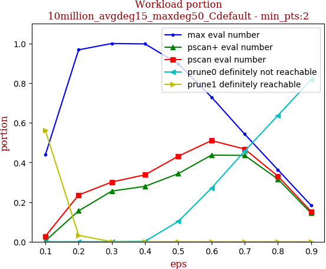 | 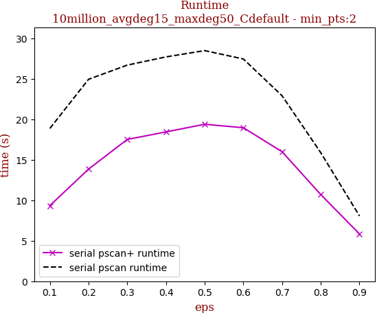

tag | eps-0.1 | eps-0.2 | eps-0.3 | eps-0.4 | eps-0.5 | eps-0.6 | eps-0.7 | eps-0.8 | eps-0.9
--- | --- | --- | --- | --- | --- | --- | --- | --- | ---
prune0 definitely not reachable | 0.000 | 0.000 | 0.000 | 0.002 | 0.102 | 0.270 | 0.457 | 0.637 | 0.817
prune1 definitely reachable | 0.562 | 0.032 | 0.000 | 0.000 | 0.000 | 0.000 | 0.000 | 0.000 | 0.000
max eval number | 0.438 | 0.968 | 1.000 | 0.998 | 0.898 | 0.730 | 0.543 | 0.363 | 0.183
pscan eval number | 0.027 | 0.236 | 0.301 | 0.338 | 0.431 | 0.510 | 0.467 | 0.330 | 0.152
pscan+ eval number | 0.004 | 0.155 | 0.256 | 0.279 | 0.343 | 0.437 | 0.435 | 0.316 | 0.144
serial pscan runtime | 18.852 | 24.921 | 26.671 | 27.684 | 28.462 | 27.427 | 22.893 | 15.862 | 8.057
serial pscan+ runtime | 9.328 | 13.836 | 17.498 | 18.429 | 19.373 | 18.943 | 15.986 | 10.695 | 5.836

