## small_snap_dblp

workload | runtime
--- | ---
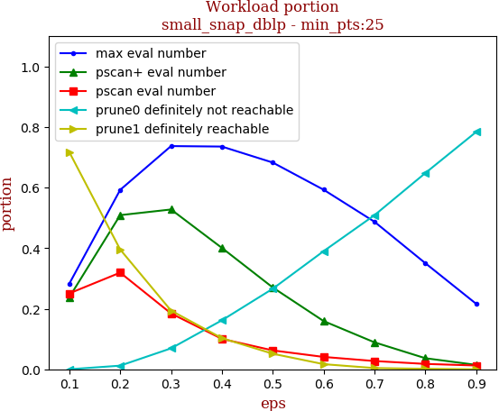 | 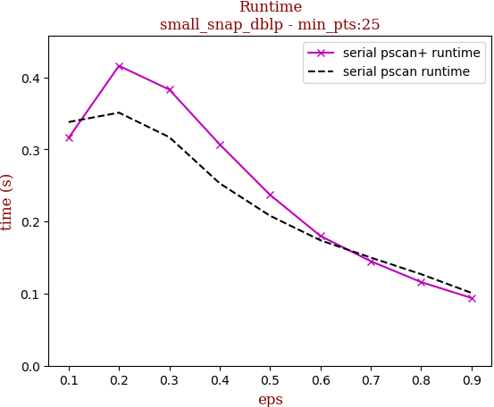

tag | eps-0.1 | eps-0.2 | eps-0.3 | eps-0.4 | eps-0.5 | eps-0.6 | eps-0.7 | eps-0.8 | eps-0.9
--- | --- | --- | --- | --- | --- | --- | --- | --- | ---
prune0 definitely not reachable | 0.000 | 0.012 | 0.069 | 0.162 | 0.266 | 0.390 | 0.509 | 0.648 | 0.784
prune1 definitely reachable | 0.717 | 0.396 | 0.194 | 0.103 | 0.051 | 0.017 | 0.004 | 0.002 | 0.000
max eval number | 0.283 | 0.592 | 0.737 | 0.735 | 0.683 | 0.593 | 0.487 | 0.350 | 0.216
pscan eval number | 0.251 | 0.319 | 0.184 | 0.100 | 0.062 | 0.041 | 0.027 | 0.018 | 0.013
pscan+ eval number | 0.238 | 0.509 | 0.528 | 0.401 | 0.270 | 0.159 | 0.089 | 0.037 | 0.015
serial pscan runtime | 0.338 | 0.351 | 0.317 | 0.253 | 0.208 | 0.174 | 0.150 | 0.127 | 0.101
serial pscan+ runtime | 0.316 | 0.416 | 0.383 | 0.307 | 0.237 | 0.180 | 0.145 | 0.116 | 0.094

## snap_pokec

workload | runtime
--- | ---
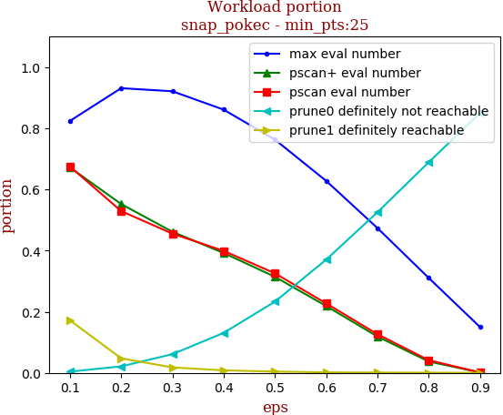 | 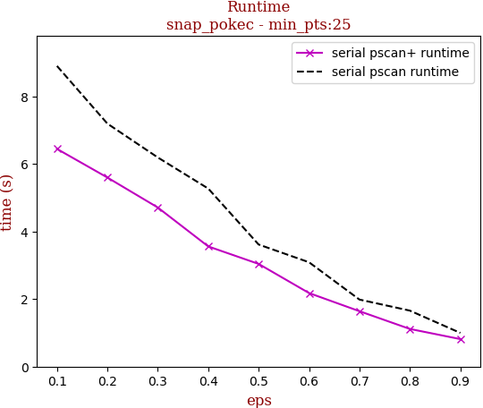

tag | eps-0.1 | eps-0.2 | eps-0.3 | eps-0.4 | eps-0.5 | eps-0.6 | eps-0.7 | eps-0.8 | eps-0.9
--- | --- | --- | --- | --- | --- | --- | --- | --- | ---
prune0 definitely not reachable | 0.004 | 0.021 | 0.061 | 0.131 | 0.233 | 0.370 | 0.525 | 0.689 | 0.850
prune1 definitely reachable | 0.172 | 0.048 | 0.018 | 0.008 | 0.004 | 0.002 | 0.001 | 0.001 | 0.000
max eval number | 0.824 | 0.931 | 0.921 | 0.861 | 0.763 | 0.628 | 0.473 | 0.310 | 0.150
pscan eval number | 0.675 | 0.529 | 0.455 | 0.399 | 0.326 | 0.227 | 0.126 | 0.042 | 0.002
pscan+ eval number | 0.672 | 0.552 | 0.461 | 0.392 | 0.314 | 0.219 | 0.119 | 0.037 | 0.001
serial pscan runtime | 8.895 | 7.189 | 6.188 | 5.268 | 3.612 | 3.087 | 1.983 | 1.656 | 0.997
serial pscan+ runtime | 6.441 | 5.594 | 4.707 | 3.556 | 3.038 | 2.176 | 1.639 | 1.114 | 0.814

## snap_livejournal

workload | runtime
--- | ---
 | 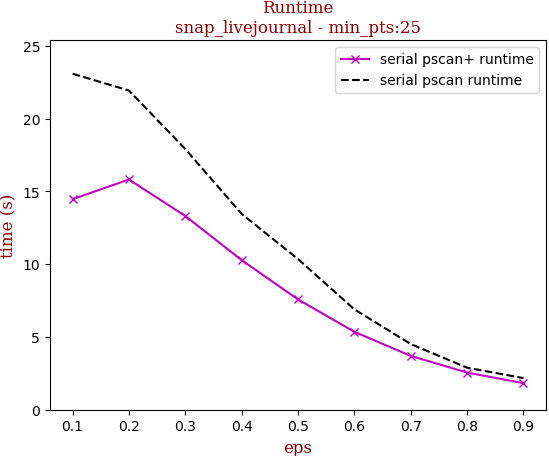

tag | eps-0.1 | eps-0.2 | eps-0.3 | eps-0.4 | eps-0.5 | eps-0.6 | eps-0.7 | eps-0.8 | eps-0.9
--- | --- | --- | --- | --- | --- | --- | --- | --- | ---
prune0 definitely not reachable | 0.006 | 0.036 | 0.097 | 0.186 | 0.295 | 0.426 | 0.564 | 0.706 | 0.849
prune1 definitely reachable | 0.206 | 0.069 | 0.029 | 0.014 | 0.007 | 0.003 | 0.002 | 0.001 | 0.000
max eval number | 0.787 | 0.895 | 0.874 | 0.800 | 0.698 | 0.571 | 0.435 | 0.293 | 0.151
pscan eval number | 0.656 | 0.603 | 0.488 | 0.387 | 0.297 | 0.208 | 0.124 | 0.057 | 0.018
pscan+ eval number | 0.607 | 0.653 | 0.540 | 0.412 | 0.302 | 0.203 | 0.118 | 0.054 | 0.017
serial pscan runtime | 23.086 | 21.932 | 17.912 | 13.454 | 10.351 | 6.895 | 4.511 | 2.886 | 2.172
serial pscan+ runtime | 14.463 | 15.819 | 13.313 | 10.278 | 7.579 | 5.355 | 3.698 | 2.553 | 1.824

## snap_orkut

workload | runtime
--- | ---
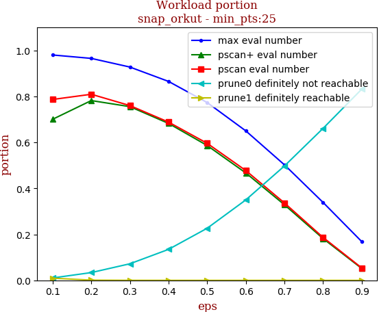 | 

tag | eps-0.1 | eps-0.2 | eps-0.3 | eps-0.4 | eps-0.5 | eps-0.6 | eps-0.7 | eps-0.8 | eps-0.9
--- | --- | --- | --- | --- | --- | --- | --- | --- | ---
prune0 definitely not reachable | 0.010 | 0.034 | 0.072 | 0.135 | 0.227 | 0.350 | 0.497 | 0.661 | 0.831
prune1 definitely reachable | 0.009 | 0.001 | 0.000 | 0.000 | 0.000 | 0.000 | 0.000 | 0.000 | 0.000
max eval number | 0.980 | 0.965 | 0.928 | 0.865 | 0.773 | 0.650 | 0.503 | 0.339 | 0.169
pscan eval number | 0.787 | 0.809 | 0.760 | 0.688 | 0.596 | 0.478 | 0.337 | 0.187 | 0.054
pscan+ eval number | 0.701 | 0.782 | 0.756 | 0.683 | 0.587 | 0.467 | 0.329 | 0.182 | 0.052
serial pscan runtime | 204.781 | 196.639 | 163.510 | 128.631 | 95.384 | 65.610 | 40.586 | 21.607 | 8.577
serial pscan+ runtime | 121.850 | 134.250 | 116.006 | 93.769 | 68.018 | 46.504 | 28.457 | 14.766 | 5.882

## webgraph_uk

workload | runtime
--- | ---
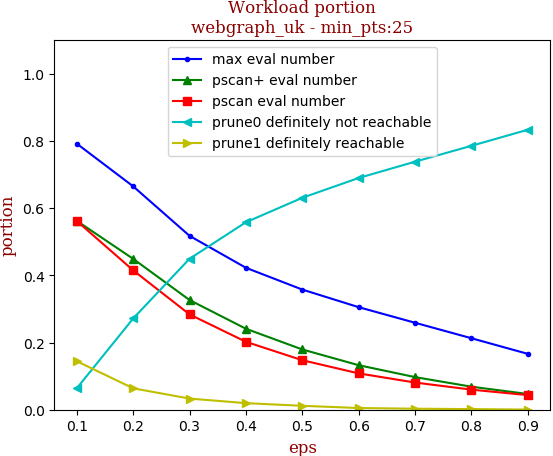 | 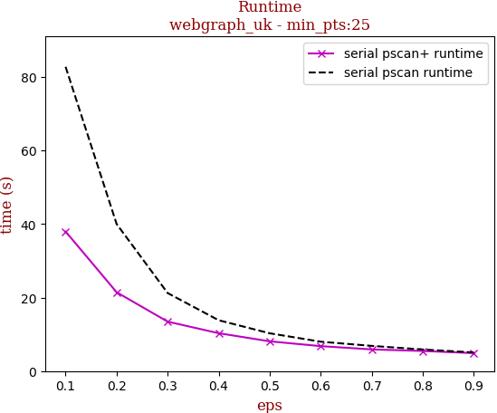

tag | eps-0.1 | eps-0.2 | eps-0.3 | eps-0.4 | eps-0.5 | eps-0.6 | eps-0.7 | eps-0.8 | eps-0.9
--- | --- | --- | --- | --- | --- | --- | --- | --- | ---
prune0 definitely not reachable | 0.064 | 0.272 | 0.449 | 0.558 | 0.631 | 0.690 | 0.738 | 0.785 | 0.833
prune1 definitely reachable | 0.144 | 0.064 | 0.033 | 0.020 | 0.012 | 0.005 | 0.003 | 0.002 | 0.000
max eval number | 0.792 | 0.665 | 0.517 | 0.422 | 0.358 | 0.305 | 0.259 | 0.213 | 0.166
pscan eval number | 0.562 | 0.415 | 0.284 | 0.202 | 0.147 | 0.108 | 0.081 | 0.060 | 0.043
pscan+ eval number | 0.562 | 0.449 | 0.326 | 0.241 | 0.179 | 0.133 | 0.097 | 0.069 | 0.047
serial pscan runtime | 82.772 | 40.017 | 21.229 | 13.832 | 10.283 | 7.992 | 6.856 | 5.874 | 5.076
serial pscan+ runtime | 37.968 | 21.452 | 13.453 | 10.305 | 8.095 | 6.788 | 5.899 | 5.474 | 4.884

## webgraph_webbase

workload | runtime
--- | ---
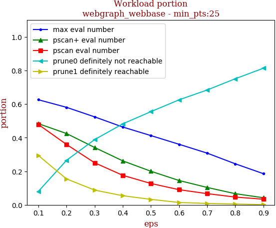 | 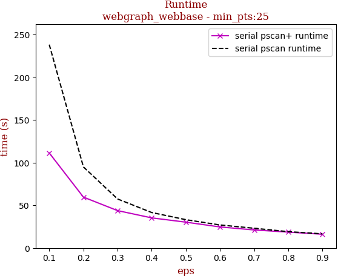

tag | eps-0.1 | eps-0.2 | eps-0.3 | eps-0.4 | eps-0.5 | eps-0.6 | eps-0.7 | eps-0.8 | eps-0.9
--- | --- | --- | --- | --- | --- | --- | --- | --- | ---
prune0 definitely not reachable | 0.080 | 0.265 | 0.388 | 0.482 | 0.555 | 0.625 | 0.684 | 0.751 | 0.813
prune1 definitely reachable | 0.294 | 0.155 | 0.088 | 0.054 | 0.033 | 0.014 | 0.008 | 0.005 | 0.001
max eval number | 0.626 | 0.581 | 0.524 | 0.463 | 0.412 | 0.361 | 0.308 | 0.244 | 0.186
pscan eval number | 0.479 | 0.360 | 0.251 | 0.176 | 0.127 | 0.090 | 0.067 | 0.046 | 0.034
pscan+ eval number | 0.484 | 0.425 | 0.342 | 0.262 | 0.200 | 0.145 | 0.104 | 0.067 | 0.042
serial pscan runtime | 238.055 | 94.912 | 57.408 | 41.511 | 33.153 | 26.962 | 23.091 | 19.125 | 16.574
serial pscan+ runtime | 111.231 | 59.563 | 43.770 | 35.250 | 30.246 | 24.646 | 21.134 | 18.601 | 16.125

## webgraph_twitter

workload | runtime
--- | ---
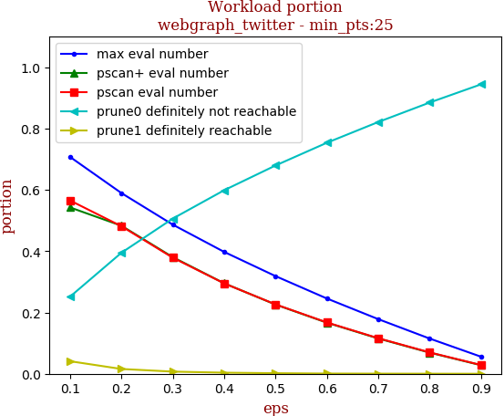 | 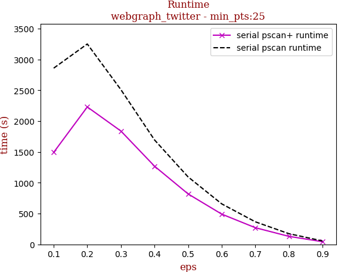

tag | eps-0.1 | eps-0.2 | eps-0.3 | eps-0.4 | eps-0.5 | eps-0.6 | eps-0.7 | eps-0.8 | eps-0.9
--- | --- | --- | --- | --- | --- | --- | --- | --- | ---
prune0 definitely not reachable | 0.251 | 0.395 | 0.506 | 0.599 | 0.679 | 0.754 | 0.821 | 0.885 | 0.944
prune1 definitely reachable | 0.041 | 0.016 | 0.007 | 0.004 | 0.002 | 0.001 | 0.000 | 0.000 | 0.000
max eval number | 0.708 | 0.590 | 0.487 | 0.398 | 0.319 | 0.246 | 0.178 | 0.115 | 0.056
pscan eval number | 0.565 | 0.481 | 0.379 | 0.295 | 0.226 | 0.168 | 0.116 | 0.070 | 0.029
pscan+ eval number | 0.543 | 0.483 | 0.381 | 0.295 | 0.226 | 0.167 | 0.115 | 0.069 | 0.028
serial pscan runtime | 2860.032 | 3252.393 | 2511.063 | 1695.777 | 1095.116 | 657.993 | 366.783 | 173.943 | 56.294
serial pscan+ runtime | 1493.378 | 2230.281 | 1839.794 | 1269.776 | 819.306 | 491.544 | 271.187 | 130.462 | 44.139

## 10million_avgdeg15_maxdeg50_Cdefault

workload | runtime
--- | ---
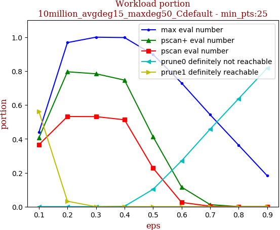 | 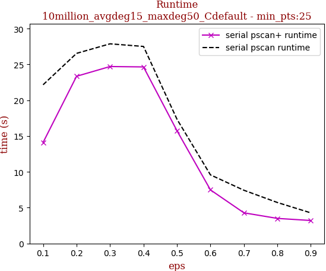

tag | eps-0.1 | eps-0.2 | eps-0.3 | eps-0.4 | eps-0.5 | eps-0.6 | eps-0.7 | eps-0.8 | eps-0.9
--- | --- | --- | --- | --- | --- | --- | --- | --- | ---
prune0 definitely not reachable | 0.000 | 0.000 | 0.000 | 0.002 | 0.102 | 0.270 | 0.457 | 0.637 | 0.817
prune1 definitely reachable | 0.562 | 0.032 | 0.000 | 0.000 | 0.000 | 0.000 | 0.000 | 0.000 | 0.000
max eval number | 0.438 | 0.968 | 1.000 | 0.998 | 0.898 | 0.730 | 0.543 | 0.363 | 0.183
pscan eval number | 0.366 | 0.532 | 0.531 | 0.513 | 0.227 | 0.025 | 0.003 | 0.000 | 0.000
pscan+ eval number | 0.406 | 0.796 | 0.784 | 0.747 | 0.413 | 0.115 | 0.012 | 0.000 | 0.000
serial pscan runtime | 22.166 | 26.552 | 27.886 | 27.518 | 17.358 | 9.584 | 7.436 | 5.725 | 4.276
serial pscan+ runtime | 14.112 | 23.354 | 24.714 | 24.659 | 15.752 | 7.488 | 4.284 | 3.504 | 3.212

