## small_snap_dblp

workload | runtime
--- | ---
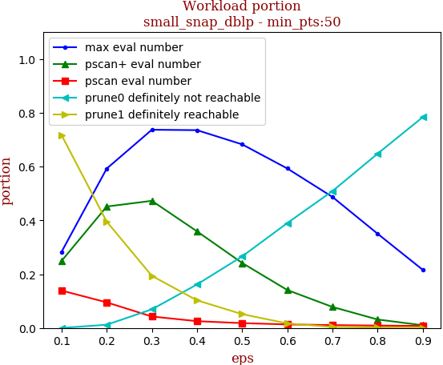 | 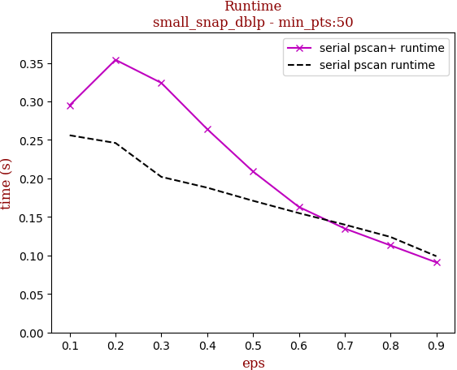

tag | eps-0.1 | eps-0.2 | eps-0.3 | eps-0.4 | eps-0.5 | eps-0.6 | eps-0.7 | eps-0.8 | eps-0.9
--- | --- | --- | --- | --- | --- | --- | --- | --- | ---
prune0 definitely not reachable | 0.000 | 0.012 | 0.069 | 0.162 | 0.266 | 0.390 | 0.509 | 0.648 | 0.784
prune1 definitely reachable | 0.717 | 0.396 | 0.194 | 0.103 | 0.051 | 0.017 | 0.004 | 0.002 | 0.000
max eval number | 0.283 | 0.592 | 0.737 | 0.735 | 0.683 | 0.593 | 0.487 | 0.350 | 0.216
pscan eval number | 0.139 | 0.095 | 0.043 | 0.025 | 0.018 | 0.013 | 0.011 | 0.009 | 0.007
pscan+ eval number | 0.249 | 0.451 | 0.473 | 0.359 | 0.242 | 0.141 | 0.078 | 0.032 | 0.010
serial pscan runtime | 0.256 | 0.246 | 0.202 | 0.188 | 0.171 | 0.155 | 0.140 | 0.124 | 0.099
serial pscan+ runtime | 0.295 | 0.354 | 0.324 | 0.264 | 0.209 | 0.163 | 0.135 | 0.113 | 0.091

## snap_pokec

workload | runtime
--- | ---
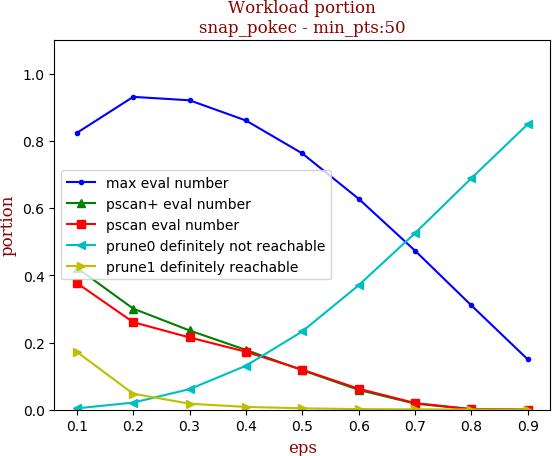 | 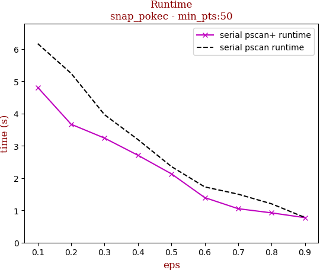

tag | eps-0.1 | eps-0.2 | eps-0.3 | eps-0.4 | eps-0.5 | eps-0.6 | eps-0.7 | eps-0.8 | eps-0.9
--- | --- | --- | --- | --- | --- | --- | --- | --- | ---
prune0 definitely not reachable | 0.004 | 0.021 | 0.061 | 0.131 | 0.233 | 0.370 | 0.525 | 0.689 | 0.850
prune1 definitely reachable | 0.172 | 0.048 | 0.018 | 0.008 | 0.004 | 0.002 | 0.001 | 0.001 | 0.000
max eval number | 0.824 | 0.931 | 0.921 | 0.861 | 0.763 | 0.628 | 0.473 | 0.310 | 0.150
pscan eval number | 0.377 | 0.261 | 0.215 | 0.173 | 0.119 | 0.062 | 0.020 | 0.002 | 0.000
pscan+ eval number | 0.422 | 0.301 | 0.236 | 0.178 | 0.118 | 0.059 | 0.018 | 0.002 | 0.000
serial pscan runtime | 6.167 | 5.245 | 3.964 | 3.193 | 2.359 | 1.726 | 1.501 | 1.202 | 0.778
serial pscan+ runtime | 4.811 | 3.668 | 3.239 | 2.707 | 2.133 | 1.395 | 1.051 | 0.922 | 0.773

## snap_livejournal

workload | runtime
--- | ---
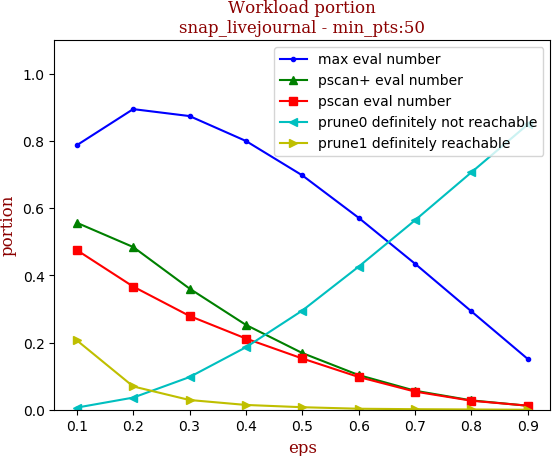 | 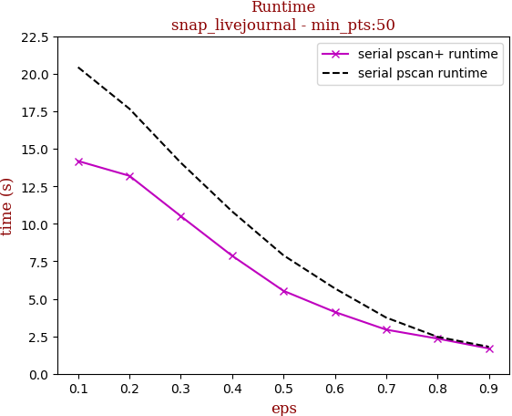

tag | eps-0.1 | eps-0.2 | eps-0.3 | eps-0.4 | eps-0.5 | eps-0.6 | eps-0.7 | eps-0.8 | eps-0.9
--- | --- | --- | --- | --- | --- | --- | --- | --- | ---
prune0 definitely not reachable | 0.006 | 0.036 | 0.097 | 0.186 | 0.295 | 0.426 | 0.564 | 0.706 | 0.849
prune1 definitely reachable | 0.206 | 0.069 | 0.029 | 0.014 | 0.007 | 0.003 | 0.002 | 0.001 | 0.000
max eval number | 0.787 | 0.895 | 0.874 | 0.800 | 0.698 | 0.571 | 0.435 | 0.293 | 0.151
pscan eval number | 0.475 | 0.367 | 0.279 | 0.212 | 0.152 | 0.097 | 0.054 | 0.027 | 0.012
pscan+ eval number | 0.556 | 0.484 | 0.360 | 0.253 | 0.169 | 0.103 | 0.057 | 0.028 | 0.012
serial pscan runtime | 20.441 | 17.673 | 14.078 | 10.827 | 7.901 | 5.694 | 3.748 | 2.463 | 1.798
serial pscan+ runtime | 14.188 | 13.203 | 10.515 | 7.870 | 5.532 | 4.121 | 2.943 | 2.347 | 1.689

## snap_orkut

workload | runtime
--- | ---
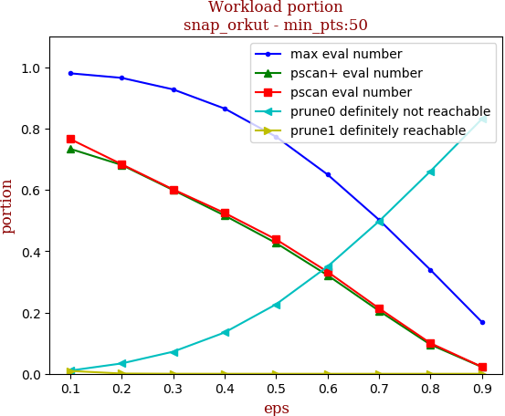 | 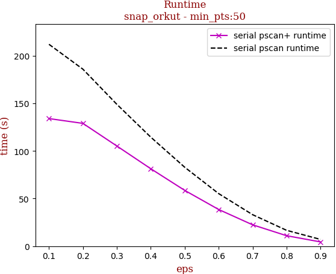

tag | eps-0.1 | eps-0.2 | eps-0.3 | eps-0.4 | eps-0.5 | eps-0.6 | eps-0.7 | eps-0.8 | eps-0.9
--- | --- | --- | --- | --- | --- | --- | --- | --- | ---
prune0 definitely not reachable | 0.010 | 0.034 | 0.072 | 0.135 | 0.227 | 0.350 | 0.497 | 0.661 | 0.831
prune1 definitely reachable | 0.009 | 0.001 | 0.000 | 0.000 | 0.000 | 0.000 | 0.000 | 0.000 | 0.000
max eval number | 0.980 | 0.965 | 0.928 | 0.865 | 0.773 | 0.650 | 0.503 | 0.339 | 0.169
pscan eval number | 0.766 | 0.684 | 0.602 | 0.525 | 0.438 | 0.333 | 0.214 | 0.100 | 0.023
pscan+ eval number | 0.734 | 0.681 | 0.599 | 0.516 | 0.427 | 0.322 | 0.205 | 0.095 | 0.022
serial pscan runtime | 212.005 | 185.874 | 148.972 | 114.493 | 82.892 | 55.228 | 33.104 | 16.681 | 7.124
serial pscan+ runtime | 134.002 | 128.972 | 105.217 | 81.342 | 58.606 | 38.544 | 22.464 | 11.025 | 4.508

## webgraph_uk

workload | runtime
--- | ---
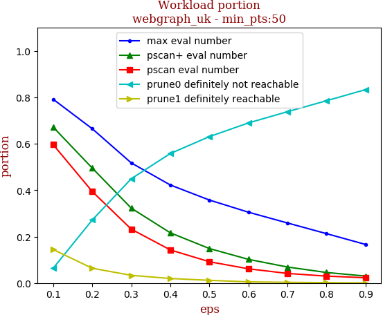 | 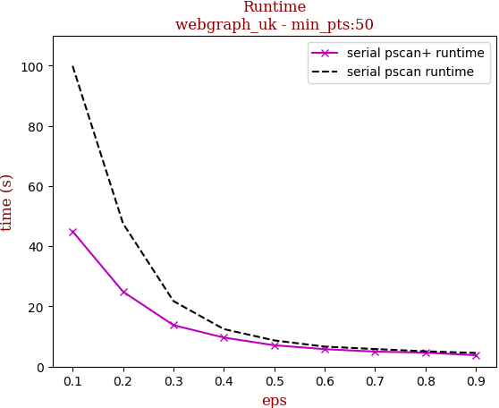

tag | eps-0.1 | eps-0.2 | eps-0.3 | eps-0.4 | eps-0.5 | eps-0.6 | eps-0.7 | eps-0.8 | eps-0.9
--- | --- | --- | --- | --- | --- | --- | --- | --- | ---
prune0 definitely not reachable | 0.064 | 0.272 | 0.449 | 0.558 | 0.631 | 0.690 | 0.738 | 0.785 | 0.833
prune1 definitely reachable | 0.144 | 0.064 | 0.033 | 0.020 | 0.012 | 0.005 | 0.003 | 0.002 | 0.000
max eval number | 0.792 | 0.665 | 0.517 | 0.422 | 0.358 | 0.305 | 0.259 | 0.213 | 0.166
pscan eval number | 0.596 | 0.394 | 0.232 | 0.143 | 0.092 | 0.061 | 0.041 | 0.030 | 0.023
pscan+ eval number | 0.672 | 0.495 | 0.323 | 0.216 | 0.149 | 0.102 | 0.069 | 0.045 | 0.030
serial pscan runtime | 99.900 | 47.570 | 21.779 | 12.463 | 8.704 | 6.646 | 5.834 | 5.087 | 4.533
serial pscan+ runtime | 44.934 | 24.899 | 13.768 | 9.649 | 7.090 | 5.790 | 4.982 | 4.645 | 3.793

## webgraph_webbase

workload | runtime
--- | ---
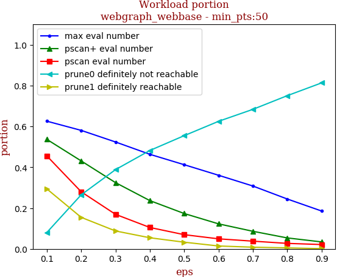 | 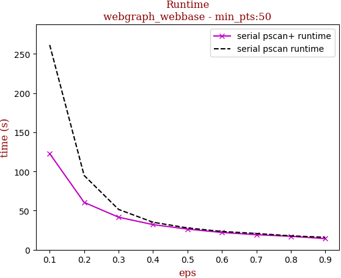

tag | eps-0.1 | eps-0.2 | eps-0.3 | eps-0.4 | eps-0.5 | eps-0.6 | eps-0.7 | eps-0.8 | eps-0.9
--- | --- | --- | --- | --- | --- | --- | --- | --- | ---
prune0 definitely not reachable | 0.080 | 0.265 | 0.388 | 0.482 | 0.555 | 0.625 | 0.684 | 0.751 | 0.813
prune1 definitely reachable | 0.294 | 0.155 | 0.088 | 0.054 | 0.033 | 0.014 | 0.008 | 0.005 | 0.001
max eval number | 0.626 | 0.581 | 0.524 | 0.463 | 0.412 | 0.361 | 0.308 | 0.244 | 0.186
pscan eval number | 0.456 | 0.280 | 0.169 | 0.105 | 0.070 | 0.049 | 0.038 | 0.027 | 0.021
pscan+ eval number | 0.537 | 0.431 | 0.325 | 0.237 | 0.173 | 0.123 | 0.086 | 0.054 | 0.034
serial pscan runtime | 261.467 | 94.836 | 51.510 | 35.152 | 27.903 | 23.390 | 20.817 | 17.760 | 15.957
serial pscan+ runtime | 122.760 | 60.512 | 41.597 | 32.137 | 26.420 | 22.089 | 19.235 | 17.226 | 14.209

## webgraph_twitter

workload | runtime
--- | ---
 | 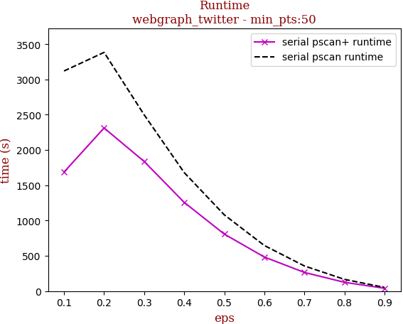

tag | eps-0.1 | eps-0.2 | eps-0.3 | eps-0.4 | eps-0.5 | eps-0.6 | eps-0.7 | eps-0.8 | eps-0.9
--- | --- | --- | --- | --- | --- | --- | --- | --- | ---
prune0 definitely not reachable | 0.251 | 0.395 | 0.506 | 0.599 | 0.679 | 0.754 | 0.821 | 0.885 | 0.944
prune1 definitely reachable | 0.041 | 0.016 | 0.007 | 0.004 | 0.002 | 0.001 | 0.000 | 0.000 | 0.000
max eval number | 0.708 | 0.590 | 0.487 | 0.398 | 0.319 | 0.246 | 0.178 | 0.115 | 0.056
pscan eval number | 0.536 | 0.436 | 0.336 | 0.260 | 0.199 | 0.146 | 0.099 | 0.058 | 0.022
pscan+ eval number | 0.526 | 0.438 | 0.337 | 0.260 | 0.198 | 0.144 | 0.098 | 0.057 | 0.021
serial pscan runtime | 3120.366 | 3384.021 | 2499.168 | 1680.452 | 1081.517 | 646.819 | 356.713 | 166.792 | 52.468
serial pscan+ runtime | 1687.482 | 2312.825 | 1837.907 | 1257.922 | 808.666 | 483.227 | 264.797 | 125.186 | 40.382

## 10million_avgdeg15_maxdeg50_Cdefault

workload | runtime
--- | ---
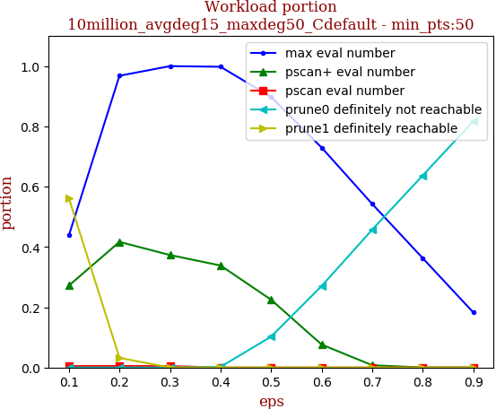 | 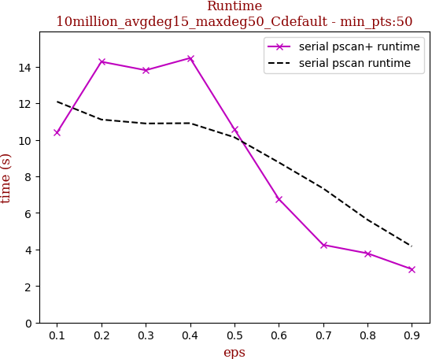

tag | eps-0.1 | eps-0.2 | eps-0.3 | eps-0.4 | eps-0.5 | eps-0.6 | eps-0.7 | eps-0.8 | eps-0.9
--- | --- | --- | --- | --- | --- | --- | --- | --- | ---
prune0 definitely not reachable | 0.000 | 0.000 | 0.000 | 0.002 | 0.102 | 0.270 | 0.457 | 0.637 | 0.817
prune1 definitely reachable | 0.562 | 0.032 | 0.000 | 0.000 | 0.000 | 0.000 | 0.000 | 0.000 | 0.000
max eval number | 0.438 | 0.968 | 1.000 | 0.998 | 0.898 | 0.730 | 0.543 | 0.363 | 0.183
pscan eval number | 0.005 | 0.005 | 0.005 | 0.000 | 0.000 | 0.000 | 0.000 | 0.000 | 0.000
pscan+ eval number | 0.272 | 0.417 | 0.373 | 0.338 | 0.225 | 0.076 | 0.008 | 0.000 | 0.000
serial pscan runtime | 12.090 | 11.109 | 10.895 | 10.910 | 10.140 | 8.766 | 7.343 | 5.628 | 4.172
serial pscan+ runtime | 10.397 | 14.275 | 13.809 | 14.475 | 10.577 | 6.763 | 4.254 | 3.788 | 2.923

