dataset | scalability link
--- | ---
snap_orkut | [snap_orkut.md](snap_orkut.md)
webgraph_webbase | [webgraph_webbase.md](webgraph_webbase.md)
webgraph_twitter | [webgraph_twitter.md](webgraph_twitter.md)

## eps:0.1

with 40 full logical threads | with best thread num
--- | ---
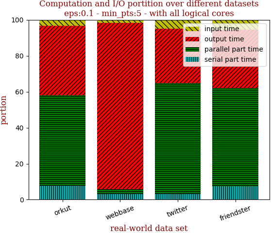 | 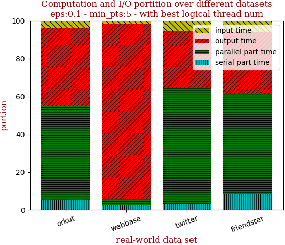

with 40 full logical threads | with best thread num
--- | ---
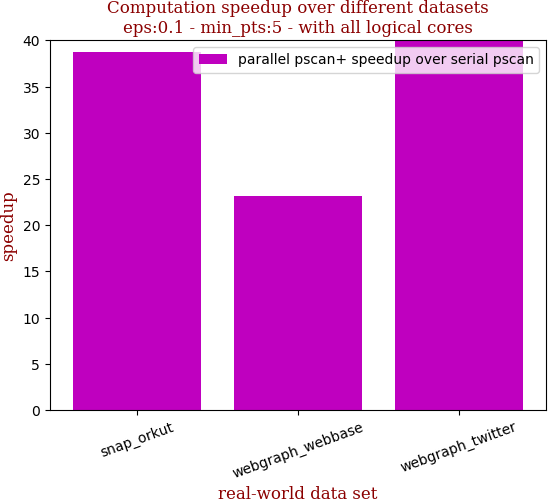 | 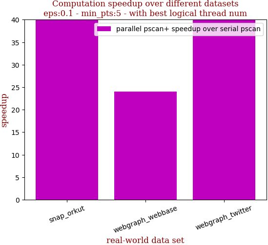

```zsh
best performance thread_num_lst:[64, 32, 64]
```

dataset | edge num | pscan runtime | pscan+ 40 logical-core full speedup | pscan+ best thread_num speedup | thread_num choice
--- | --- | --- | --- | --- | ---
snap_orkut | 2,099,732 | 149.207s | 38.785 | 44.223 | 64
webgraph_webbase | 30,282,866 | 129.071s | 23.123 | 23.986 | 32
webgraph_twitter | 69,362,378 | 2223.316s | 49.476 | 50.929 | 64

## eps:0.2

with 40 full logical threads | with best thread num
--- | ---
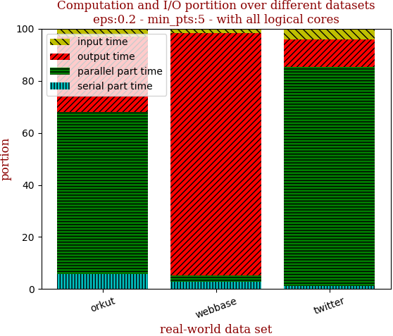 | 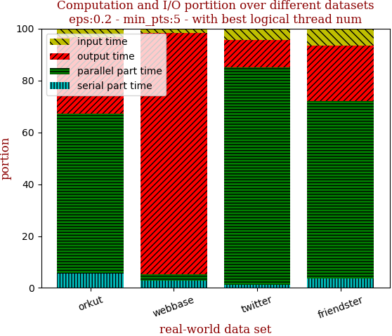

with 40 full logical threads | with best thread num
--- | ---
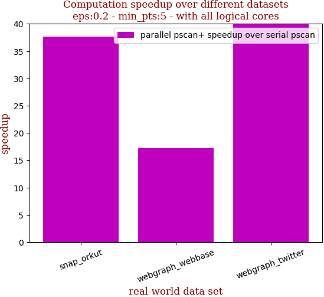 | 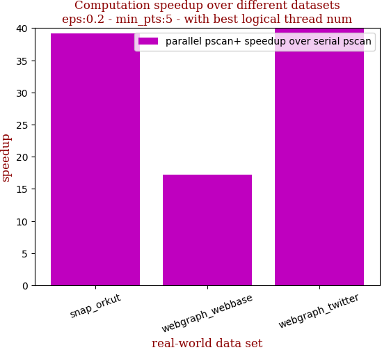

```zsh
best performance thread_num_lst:[64, 40, 64]
```

dataset | edge num | pscan runtime | pscan+ 40 logical-core full speedup | pscan+ best thread_num speedup | thread_num choice
--- | --- | --- | --- | --- | ---
snap_orkut | 2,099,732 | 179.55s | 37.618 | 39.212 | 64
webgraph_webbase | 30,282,866 | 81.475s | 17.192 | 17.192 | 40
webgraph_twitter | 69,362,378 | 2973.869s | 41.814 | 43.178 | 64

## eps:0.3

with 40 full logical threads | with best thread num
--- | ---
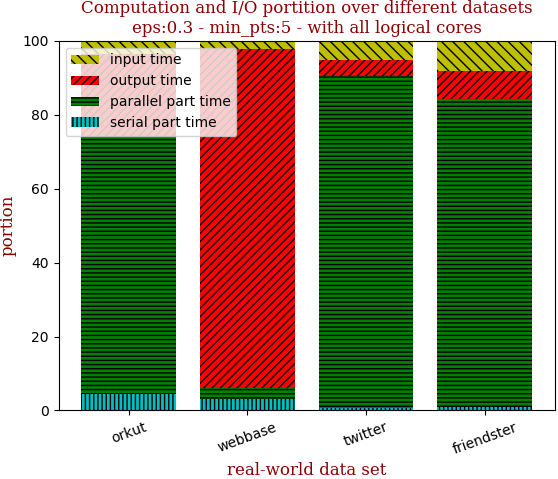 | 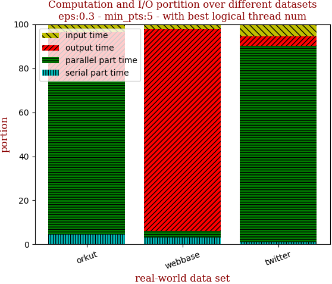

with 40 full logical threads | with best thread num
--- | ---
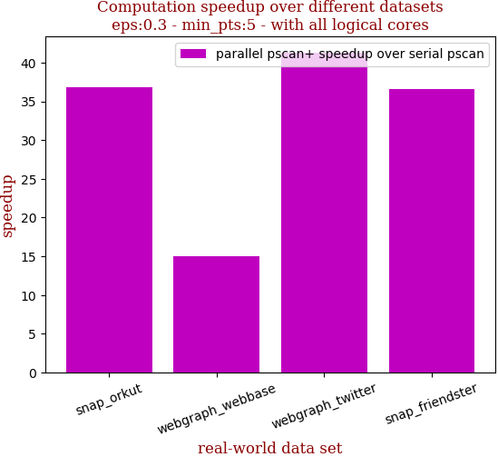 | 

```zsh
best performance thread_num_lst:[40, 40, 64]
```

dataset | edge num | pscan runtime | pscan+ 40 logical-core full speedup | pscan+ best thread_num speedup | thread_num choice
--- | --- | --- | --- | --- | ---
snap_orkut | 2,099,732 | 164.248s | 36.835 | 36.835 | 40
webgraph_webbase | 30,282,866 | 63.705s | 14.965 | 14.965 | 40
webgraph_twitter | 69,362,378 | 2487.317s | 41.267 | 42.664 | 64

## eps:0.4

with 40 full logical threads | with best thread num
--- | ---
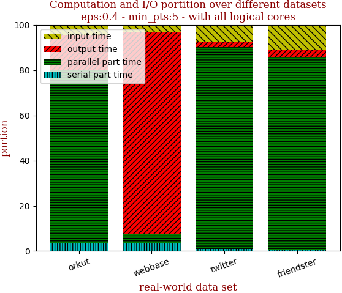 | 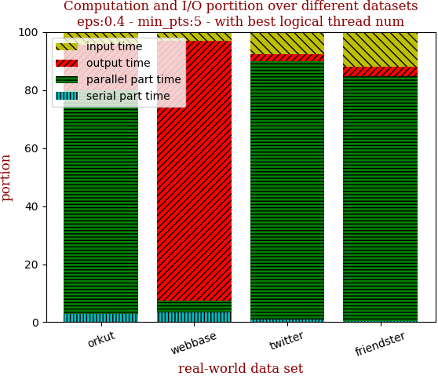

with 40 full logical threads | with best thread num
--- | ---
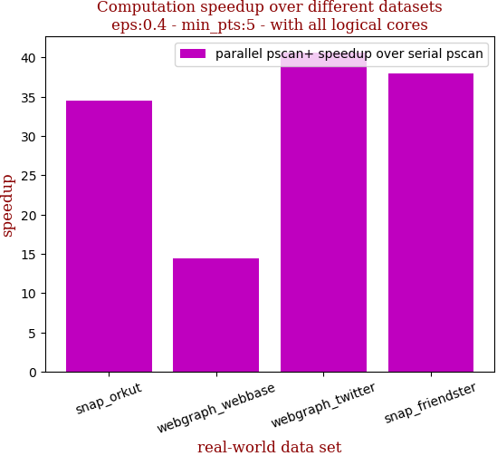 | 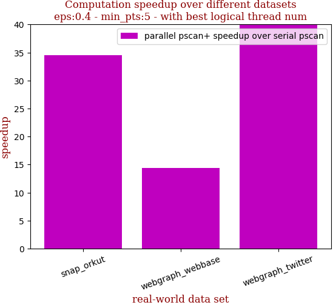

```zsh
best performance thread_num_lst:[64, 40, 64]
```

dataset | edge num | pscan runtime | pscan+ 40 logical-core full speedup | pscan+ best thread_num speedup | thread_num choice
--- | --- | --- | --- | --- | ---
snap_orkut | 2,099,732 | 135.772s | 34.539 | 34.583 | 64
webgraph_webbase | 30,282,866 | 52.978s | 14.424 | 14.424 | 40
webgraph_twitter | 69,362,378 | 1712.815s | 40.610 | 41.938 | 64

## eps:0.5

with 40 full logical threads | with best thread num
--- | ---
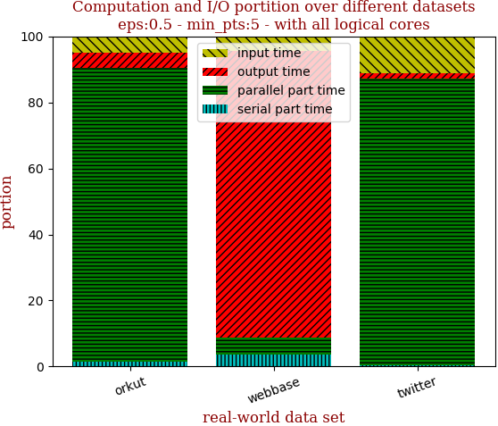 | 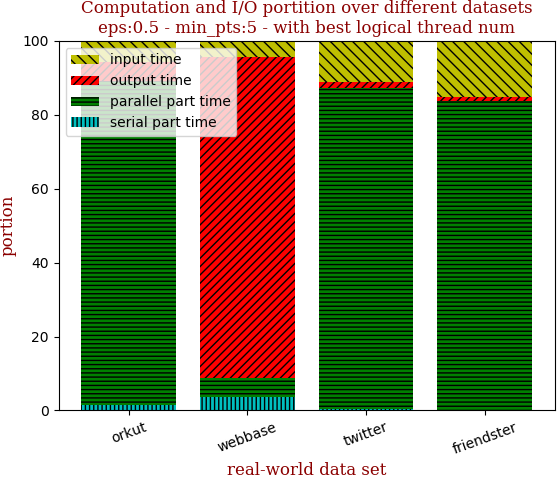

with 40 full logical threads | with best thread num
--- | ---
 | 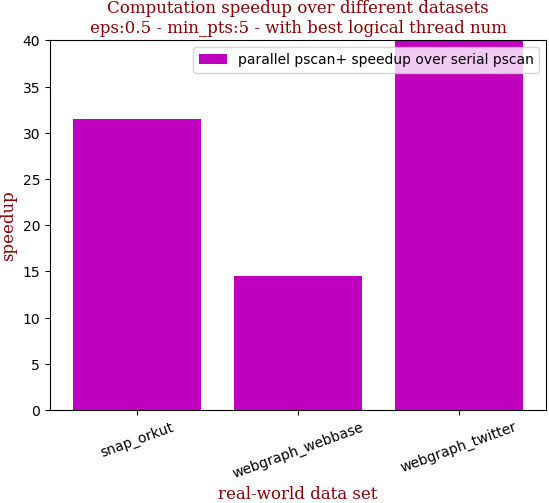

```zsh
best performance thread_num_lst:[64, 40, 40]
```

dataset | edge num | pscan runtime | pscan+ 40 logical-core full speedup | pscan+ best thread_num speedup | thread_num choice
--- | --- | --- | --- | --- | ---
snap_orkut | 2,099,732 | 105.36s | 26.479 | 31.535 | 64
webgraph_webbase | 30,282,866 | 45.006s | 14.490 | 14.490 | 40
webgraph_twitter | 69,362,378 | 1112.027s | 41.358 | 41.358 | 40

## eps:0.6

with 40 full logical threads | with best thread num
--- | ---
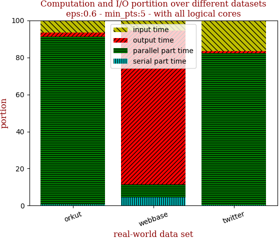 | 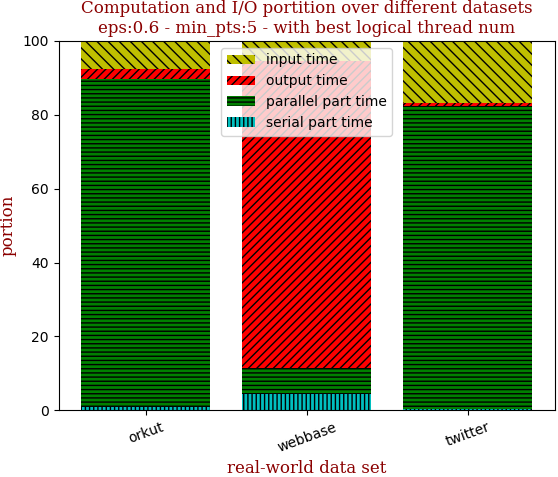

with 40 full logical threads | with best thread num
--- | ---
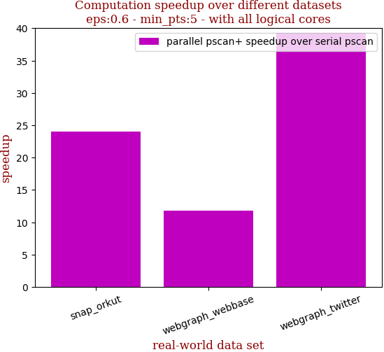 | 

```zsh
best performance thread_num_lst:[64, 40, 64]
```

dataset | edge num | pscan runtime | pscan+ 40 logical-core full speedup | pscan+ best thread_num speedup | thread_num choice
--- | --- | --- | --- | --- | ---
snap_orkut | 2,099,732 | 73.887s | 24.005 | 28.975 | 64
webgraph_webbase | 30,282,866 | 37.624s | 11.817 | 11.817 | 40
webgraph_twitter | 69,362,378 | 671.103s | 39.308 | 39.684 | 64

## eps:0.7

with 40 full logical threads | with best thread num
--- | ---
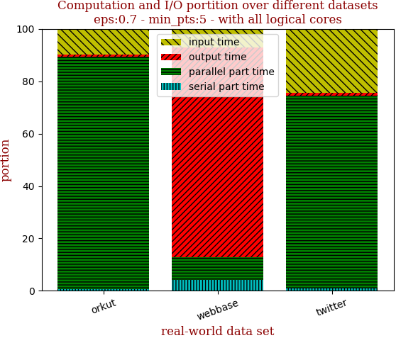 | 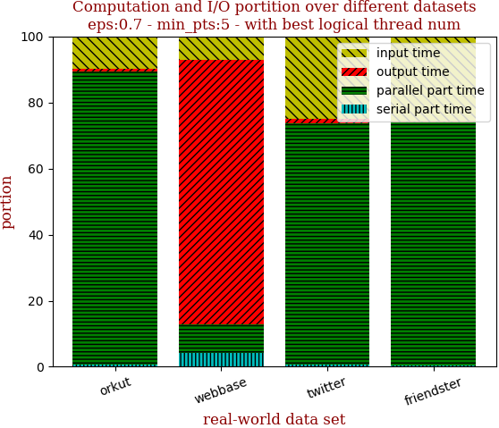

with 40 full logical threads | with best thread num
--- | ---
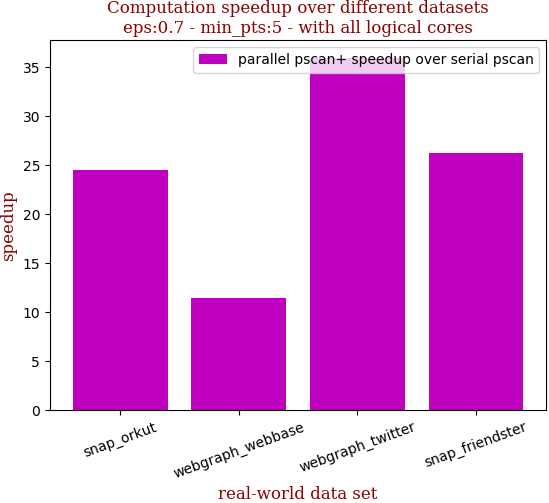 | 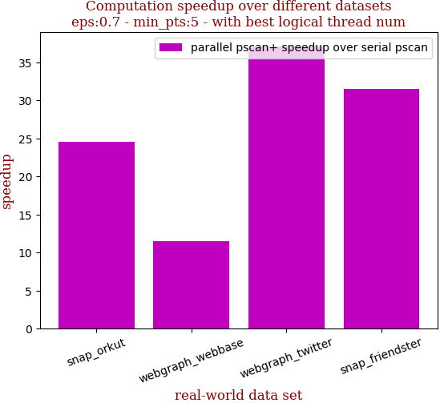

```zsh
best performance thread_num_lst:[40, 40, 64]
```

dataset | edge num | pscan runtime | pscan+ 40 logical-core full speedup | pscan+ best thread_num speedup | thread_num choice
--- | --- | --- | --- | --- | ---
snap_orkut | 2,099,732 | 48.46s | 24.562 | 24.562 | 40
webgraph_webbase | 30,282,866 | 31.675s | 11.481 | 11.481 | 40
webgraph_twitter | 69,362,378 | 378.662s | 35.940 | 37.084 | 64

## eps:0.8

with 40 full logical threads | with best thread num
--- | ---
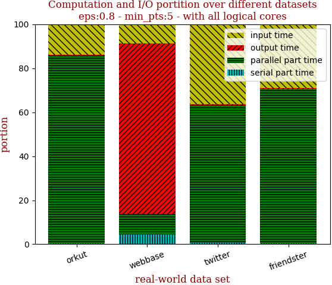 | 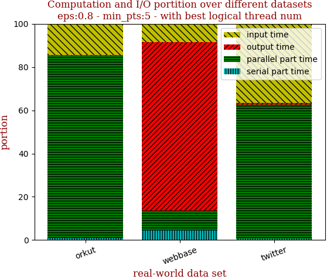

with 40 full logical threads | with best thread num
--- | ---
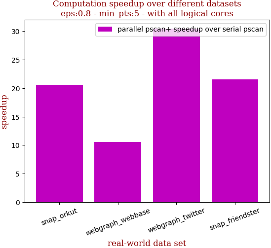 | 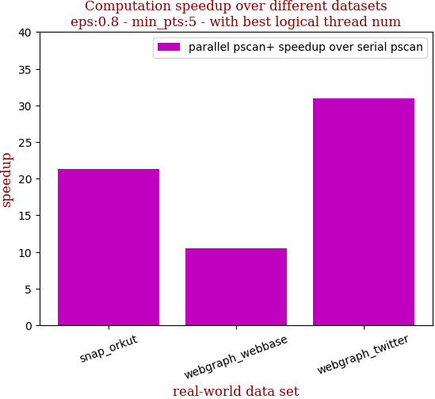

```zsh
best performance thread_num_lst:[64, 40, 64]
```

dataset | edge num | pscan runtime | pscan+ 40 logical-core full speedup | pscan+ best thread_num speedup | thread_num choice
--- | --- | --- | --- | --- | ---
snap_orkut | 2,099,732 | 27.708s | 20.555 | 21.297 | 64
webgraph_webbase | 30,282,866 | 25.399s | 10.552 | 10.552 | 40
webgraph_twitter | 69,362,378 | 183.012s | 30.436 | 30.961 | 64

## eps:0.9

with 40 full logical threads | with best thread num
--- | ---
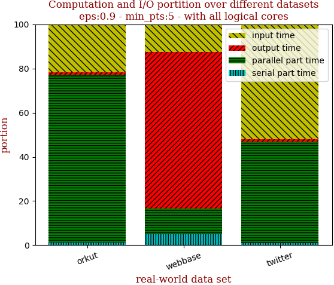 | 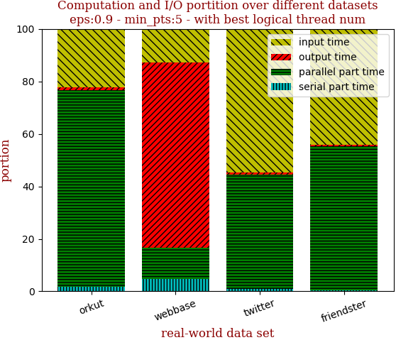

with 40 full logical threads | with best thread num
--- | ---
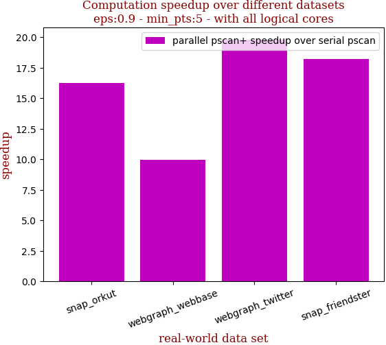 | 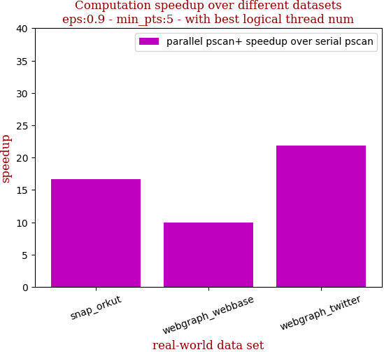

```zsh
best performance thread_num_lst:[64, 40, 64]
```

dataset | edge num | pscan runtime | pscan+ 40 logical-core full speedup | pscan+ best thread_num speedup | thread_num choice
--- | --- | --- | --- | --- | ---
snap_orkut | 2,099,732 | 12.535s | 16.258 | 16.713 | 64
webgraph_webbase | 30,282,866 | 20.091s | 9.951 | 9.951 | 40
webgraph_twitter | 69,362,378 | 61.578s | 19.775 | 21.883 | 64

