## eps:0.1

overview | speedup
--- | ---
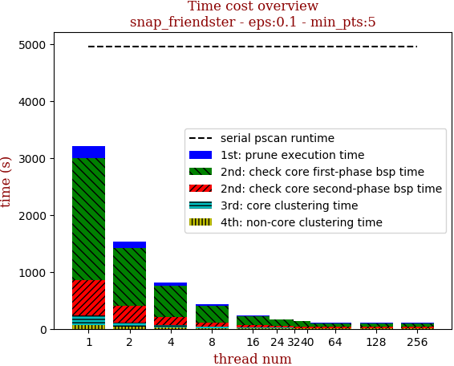 | 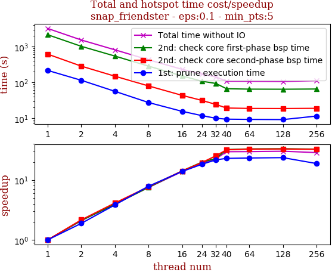

thread_num | prune | check-core 1st bsp | check-core 2nd bsp | cluster-core | cluster-non-core | total | total speedup
--- | --- | --- | --- | --- | --- | --- | ---
1 | 216.166s | 2147.933s | 615.545s | 161.949s | 72.105s | 3213.703s | 1.000
2 | 114.519s | 1018.757s | 284.737s | 76.463s | 37.128s | 1531.61s | 2.098
4 | 56.304s | 544.508s | 148.942s | 43.04s | 20.766s | 813.565s | 3.950
8 | 27.432s | 285.214s | 79.771s | 23.468s | 12.265s | 428.155s | 7.506
16 | 15.548s | 151.549s | 43.43s | 13.73s | 7.983s | 232.245s | 13.838
24 | 11.832s | 108.128s | 31.469s | 11.94s | 7.42s | 170.793s | 18.816
32 | 9.973s | 93.771s | 24.317s | 9.201s | 5.233s | 142.501s | 22.552
40 | 9.405s | 66.636s | 19.247s | 8.673s | 4.339s | 108.307s | 29.672
64 | 9.266s | 64.898s | 18.752s | 7.947s | 7.017s | 107.885s | 29.788
128 | 9.148s | 64.526s | 18.667s | 8.063s | 5.927s | 106.336s | 30.222
256 | 11.475s | 65.421s | 18.886s | 9.516s | 6.585s | 111.886s | 28.723

## eps:0.2

overview | speedup
--- | ---
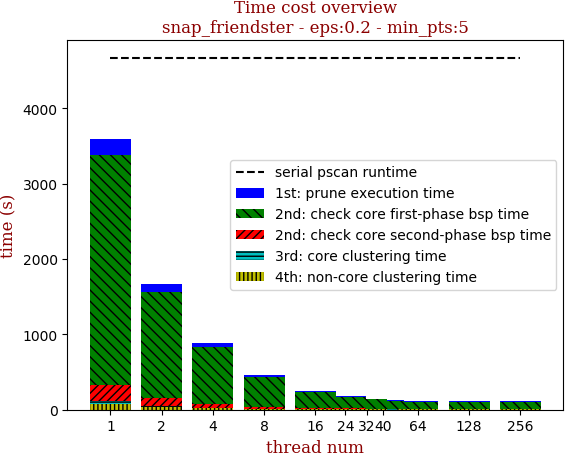 | 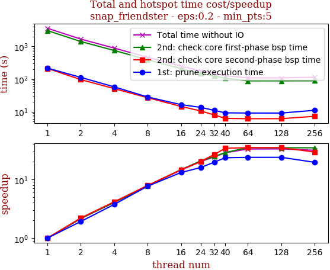

thread_num | prune | check-core 1st bsp | check-core 2nd bsp | cluster-core | cluster-non-core | total | total speedup
--- | --- | --- | --- | --- | --- | --- | ---
1 | 216.679s | 3054.69s | 212.568s | 35.832s | 80.648s | 3600.42s | 1.000
2 | 112.871s | 1413.466s | 96.482s | 17.011s | 35.692s | 1675.525s | 2.149
4 | 57.823s | 752.336s | 51.124s | 9.813s | 19.461s | 890.56s | 4.043
8 | 28.333s | 393.531s | 26.952s | 5.051s | 10.313s | 464.184s | 7.756
16 | 16.576s | 208.793s | 14.583s | 3.538s | 6.373s | 249.866s | 14.409
24 | 13.649s | 148.422s | 10.598s | 3.02s | 4.016s | 179.708s | 20.035
32 | 11.029s | 124.344s | 7.97s | 2.067s | 3.465s | 148.879s | 24.184
40 | 9.287s | 106.831s | 6.289s | 1.828s | 2.942s | 127.18s | 28.310
64 | 9.156s | 88.278s | 6.135s | 1.728s | 4.428s | 109.729s | 32.812
128 | 9.138s | 88.548s | 6.154s | 1.796s | 3.591s | 109.23s | 32.962
256 | 11.115s | 88.702s | 7.269s | 2.266s | 5.639s | 114.994s | 31.310

## eps:0.3

overview | speedup
--- | ---
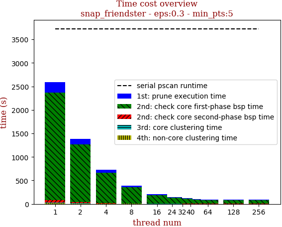 | 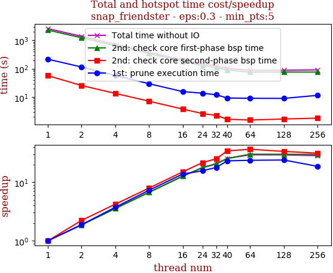

thread_num | prune | check-core 1st bsp | check-core 2nd bsp | cluster-core | cluster-non-core | total | total speedup
--- | --- | --- | --- | --- | --- | --- | ---
1 | 215.991s | 2288.016s | 57.057s | 5.538s | 21.344s | 2587.947s | 1.000
2 | 114.801s | 1229.063s | 25.622s | 3.441s | 10.49s | 1383.42s | 1.871
4 | 57.873s | 645.707s | 13.53s | 2.146s | 5.958s | 725.217s | 3.569
8 | 29.652s | 342.299s | 7.193s | 1.296s | 3.203s | 383.645s | 6.746
16 | 15.655s | 181.147s | 3.791s | 0.932s | 2.004s | 203.532s | 12.715
24 | 13.778s | 128.12s | 2.642s | 0.737s | 1.862s | 147.143s | 17.588
32 | 12.067s | 110.006s | 2.264s | 0.585s | 1.276s | 126.201s | 20.507
40 | 9.312s | 89.707s | 1.662s | 0.368s | 0.75s | 101.802s | 25.421
64 | 9.109s | 76.009s | 1.562s | 0.348s | 0.973s | 88.003s | 29.407
128 | 9.014s | 76.194s | 1.697s | 0.377s | 0.947s | 88.233s | 29.331
256 | 11.562s | 76.34s | 1.82s | 0.401s | 1.065s | 91.19s | 28.380

## eps:0.4

overview | speedup
--- | ---
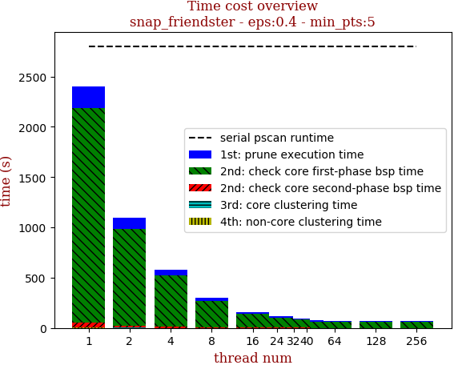 | 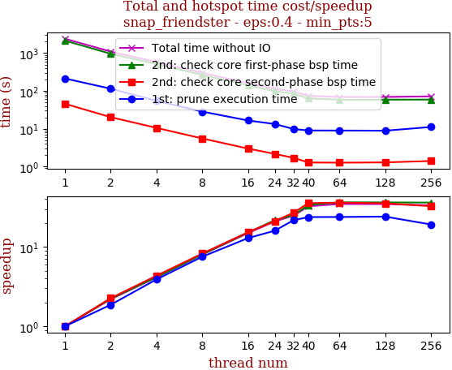

thread_num | prune | check-core 1st bsp | check-core 2nd bsp | cluster-core | cluster-non-core | total | total speedup
--- | --- | --- | --- | --- | --- | --- | ---
1 | 213.698s | 2138.556s | 45.75s | 1.091s | 2.909s | 2402.007s | 1.000
2 | 114.509s | 960.171s | 20.227s | 0.664s | 1.703s | 1097.278s | 2.189
4 | 54.814s | 514.065s | 10.546s | 0.45s | 1.219s | 581.096s | 4.134
8 | 28.427s | 265.632s | 5.543s | 0.368s | 0.671s | 300.645s | 7.990
16 | 16.55s | 140.676s | 2.987s | 0.326s | 0.306s | 160.847s | 14.933
24 | 13.348s | 98.58s | 2.167s | 0.299s | 0.224s | 114.621s | 20.956
32 | 9.827s | 84.877s | 1.691s | 0.19s | 0.219s | 96.806s | 24.813
40 | 8.992s | 63.352s | 1.284s | 0.132s | 0.136s | 73.9s | 32.503
64 | 8.968s | 58.656s | 1.266s | 0.134s | 0.139s | 69.166s | 34.728
128 | 8.871s | 58.787s | 1.29s | 0.147s | 0.178s | 69.276s | 34.673
256 | 11.143s | 59.081s | 1.403s | 0.15s | 0.141s | 71.922s | 33.397

## eps:0.5

overview | speedup
--- | ---
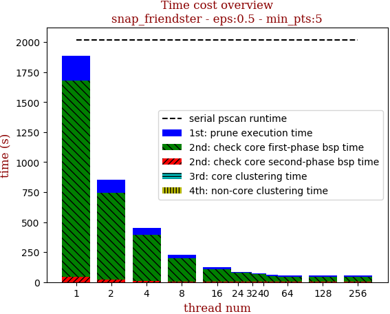 | 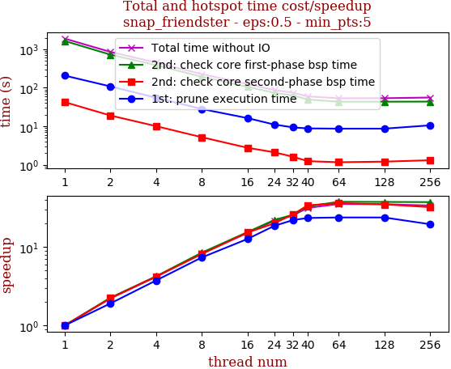

thread_num | prune | check-core 1st bsp | check-core 2nd bsp | cluster-core | cluster-non-core | total | total speedup
--- | --- | --- | --- | --- | --- | --- | ---
1 | 206.085s | 1634.461s | 42.149s | 0.411s | 0.699s | 1883.807s | 1.000
2 | 107.923s | 722.771s | 18.946s | 0.336s | 0.458s | 850.437s | 2.215
4 | 54.956s | 385.617s | 10.024s | 0.283s | 0.211s | 451.093s | 4.176
8 | 27.979s | 192.619s | 5.174s | 0.268s | 0.122s | 226.166s | 8.329
16 | 16.256s | 105.27s | 2.753s | 0.117s | 0.057s | 124.456s | 15.136
24 | 11.073s | 73.8s | 2.105s | 0.154s | 0.052s | 87.187s | 21.607
32 | 9.31s | 63.154s | 1.608s | 0.111s | 0.039s | 74.225s | 25.380
40 | 8.767s | 49.384s | 1.235s | 0.104s | 0.033s | 59.526s | 31.647
64 | 8.632s | 43.186s | 1.158s | 0.105s | 0.033s | 53.116s | 35.466
128 | 8.64s | 43.374s | 1.201s | 0.112s | 0.053s | 53.382s | 35.289
256 | 10.532s | 43.572s | 1.304s | 0.155s | 0.042s | 55.608s | 33.877

## eps:0.6

overview | speedup
--- | ---
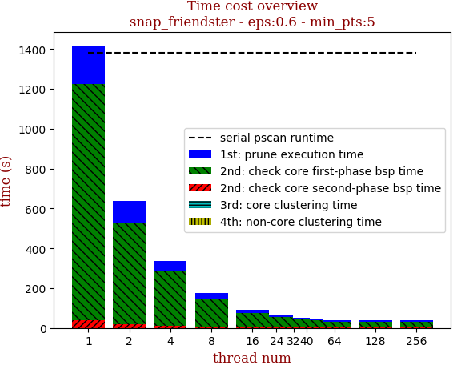 | 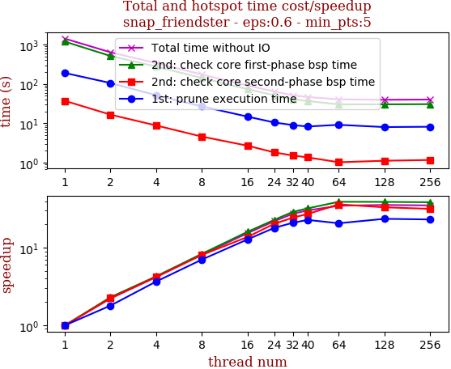

thread_num | prune | check-core 1st bsp | check-core 2nd bsp | cluster-core | cluster-non-core | total | total speedup
--- | --- | --- | --- | --- | --- | --- | ---
1 | 190.028s | 1186.999s | 37.293s | 0.28s | 0.258s | 1414.86s | 1.000
2 | 105.6s | 513.944s | 16.602s | 0.263s | 0.189s | 636.601s | 2.223
4 | 51.743s | 276.489s | 8.834s | 0.239s | 0.099s | 337.407s | 4.193
8 | 26.986s | 142.044s | 4.612s | 0.096s | 0.098s | 173.84s | 8.139
16 | 14.83s | 73.894s | 2.707s | 0.234s | 0.028s | 91.695s | 15.430
24 | 10.53s | 51.854s | 1.833s | 0.135s | 0.03s | 64.384s | 21.975
32 | 9.018s | 40.706s | 1.519s | 0.103s | 0.025s | 51.374s | 27.540
40 | 8.306s | 36.812s | 1.365s | 0.101s | 0.019s | 46.606s | 30.358
64 | 9.169s | 30.282s | 1.028s | 0.105s | 0.016s | 40.604s | 34.845
128 | 8.041s | 30.368s | 1.121s | 0.109s | 0.022s | 39.664s | 35.671
256 | 8.187s | 30.688s | 1.173s | 0.106s | 0.045s | 40.2s | 35.196

## eps:0.7

overview | speedup
--- | ---
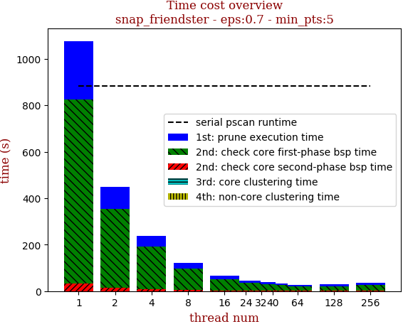 | 

thread_num | prune | check-core 1st bsp | check-core 2nd bsp | cluster-core | cluster-non-core | total | total speedup
--- | --- | --- | --- | --- | --- | --- | ---
1 | 251.458s | 793.189s | 31.608s | 0.248s | 0.185s | 1076.69s | 1.000
2 | 96.248s | 338.673s | 13.92s | 0.237s | 0.144s | 449.225s | 2.397
4 | 47.257s | 182.602s | 7.535s | 0.223s | 0.067s | 237.686s | 4.530
8 | 23.677s | 93.053s | 3.762s | 0.232s | 0.038s | 120.765s | 8.916
16 | 14.646s | 49.095s | 2.24s | 0.225s | 0.034s | 66.243s | 16.254
24 | 9.538s | 33.973s | 1.537s | 0.233s | 0.019s | 45.302s | 23.767
32 | 8.172s | 29.624s | 1.285s | 0.098s | 0.018s | 39.2s | 27.467
40 | 7.352s | 24.928s | 1.16s | 0.099s | 0.017s | 33.558s | 32.084
64 | 7.366s | 19.654s | 0.874s | 0.101s | 0.014s | 28.012s | 38.437
128 | 7.503s | 19.711s | 0.987s | 0.098s | 0.022s | 28.323s | 38.015
256 | 9.209s | 25.905s | 1.069s | 0.104s | 0.048s | 36.337s | 29.631

## eps:0.8

overview | speedup
--- | ---
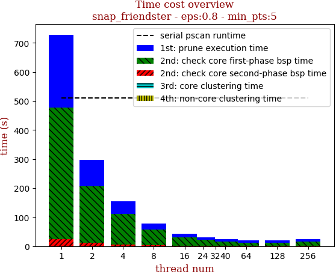 | 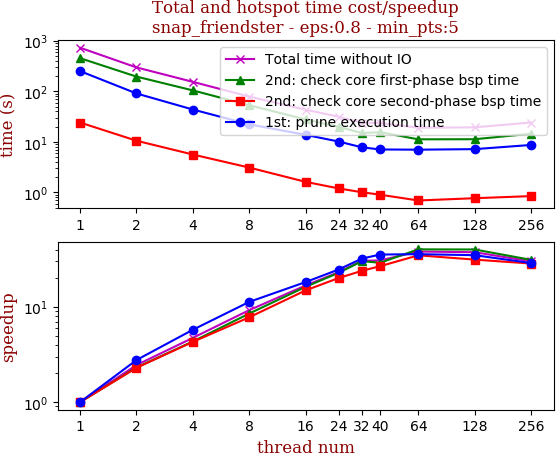

thread_num | prune | check-core 1st bsp | check-core 2nd bsp | cluster-core | cluster-non-core | total | total speedup
--- | --- | --- | --- | --- | --- | --- | ---
1 | 251.306s | 452.615s | 24.161s | 0.231s | 0.148s | 728.464s | 1.000
2 | 90.845s | 195.769s | 10.548s | 0.231s | 0.122s | 297.518s | 2.448
4 | 43.7s | 104.444s | 5.629s | 0.227s | 0.063s | 154.066s | 4.728
8 | 22.267s | 53.187s | 3.107s | 0.222s | 0.035s | 78.82s | 9.242
16 | 13.791s | 27.878s | 1.622s | 0.12s | 0.018s | 43.432s | 16.773
24 | 10.183s | 19.859s | 1.203s | 0.221s | 0.015s | 31.483s | 23.138
32 | 7.813s | 14.978s | 1.01s | 0.096s | 0.02s | 23.919s | 30.455
40 | 7.087s | 15.561s | 0.903s | 0.095s | 0.015s | 23.663s | 30.785
64 | 7.022s | 11.258s | 0.694s | 0.105s | 0.012s | 19.094s | 38.151
128 | 7.196s | 11.297s | 0.77s | 0.123s | 0.034s | 19.422s | 37.507
256 | 8.704s | 14.511s | 0.847s | 0.101s | 0.042s | 24.208s | 30.092

## eps:0.9

overview | speedup
--- | ---
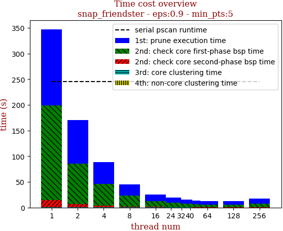 | 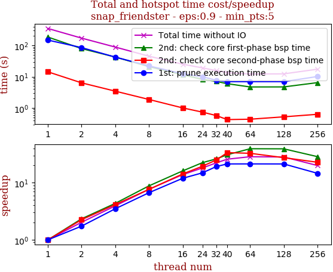

thread_num | prune | check-core 1st bsp | check-core 2nd bsp | cluster-core | cluster-non-core | total | total speedup
--- | --- | --- | --- | --- | --- | --- | ---
1 | 148.017s | 184.718s | 14.333s | 0.223s | 0.103s | 347.397s | 1.000
2 | 85.133s | 79.116s | 6.362s | 0.219s | 0.125s | 170.957s | 2.032
4 | 42.288s | 42.475s | 3.455s | 0.22s | 0.064s | 88.504s | 3.925
8 | 22.148s | 20.995s | 1.876s | 0.227s | 0.04s | 45.288s | 7.671
16 | 12.406s | 11.485s | 1.008s | 0.225s | 0.019s | 25.146s | 13.815
24 | 9.961s | 8.248s | 0.74s | 0.218s | 0.017s | 19.187s | 18.106
32 | 7.719s | 7.078s | 0.573s | 0.217s | 0.018s | 15.608s | 22.258
40 | 6.956s | 5.993s | 0.427s | 0.096s | 0.016s | 13.49s | 25.752
64 | 6.947s | 4.708s | 0.439s | 0.098s | 0.016s | 12.21s | 28.452
128 | 6.961s | 4.725s | 0.523s | 0.093s | 0.032s | 12.338s | 28.157
256 | 10.151s | 6.474s | 0.63s | 0.102s | 0.048s | 17.408s | 19.956

