## eps:0.1

overview | speedup
--- | ---
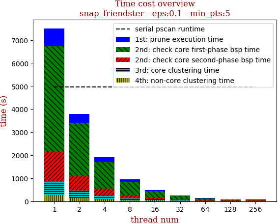 | 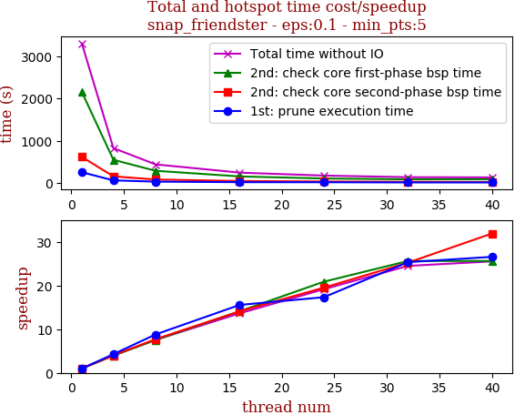

thread_num | prune | check-core 1st bsp | check-core 2nd bsp | cluster-core | cluster-non-core | total | total speedup
--- | --- | --- | --- | --- | --- | --- | ---
1 | 251.756s | 2151.177s | 614.416s | 167.661s | 114.91s | 3299.925s | 1.000
4 | 58.793s | 545.903s | 153.543s | 36.405s | 27.857s | 822.515s | 4.012
8 | 28.637s | 285.979s | 79.633s | 24.499s | 18.87s | 437.623s | 7.541
16 | 16.184s | 152.556s | 43.559s | 15.766s | 14.005s | 242.084s | 13.631
24 | 14.534s | 103.071s | 31.487s | 12.54s | 10.698s | 172.335s | 19.148
32 | 9.931s | 83.988s | 24.351s | 9.182s | 7.267s | 134.729s | 24.493
40 | 9.478s | 83.962s | 19.252s | 9.202s | 7.396s | 129.295s | 25.522

## eps:0.2

overview | speedup
--- | ---
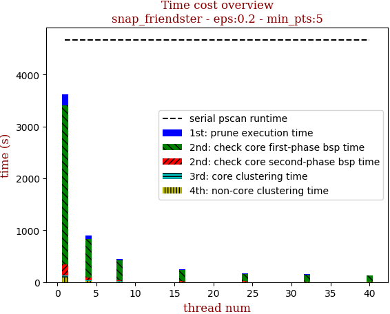 | 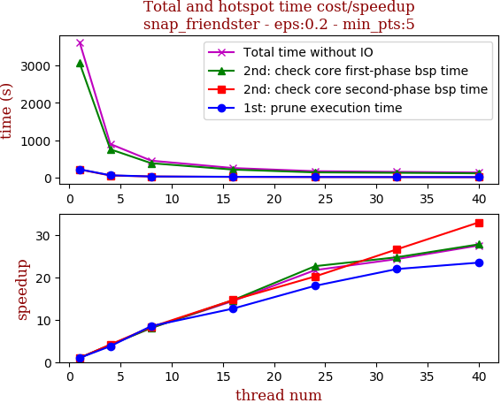

thread_num | prune | check-core 1st bsp | check-core 2nd bsp | cluster-core | cluster-non-core | total | total speedup
--- | --- | --- | --- | --- | --- | --- | ---
1 | 216.69s | 3064.182s | 212.998s | 35.451s | 92.452s | 3621.784s | 1.000
4 | 57.903s | 753.313s | 51.4s | 9.697s | 22.879s | 895.196s | 4.046
8 | 25.516s | 380.669s | 25.722s | 5.017s | 11.94s | 448.875s | 8.069
16 | 17.172s | 209.681s | 14.553s | 3.143s | 6.736s | 251.299s | 14.412
24 | 12.049s | 135.49s | 10.553s | 2.745s | 6.221s | 167.064s | 21.679
32 | 9.875s | 123.984s | 8.013s | 2.276s | 4.914s | 149.066s | 24.297
40 | 9.242s | 110.383s | 6.468s | 1.987s | 3.662s | 131.75s | 27.490

## eps:0.3

overview | speedup
--- | ---
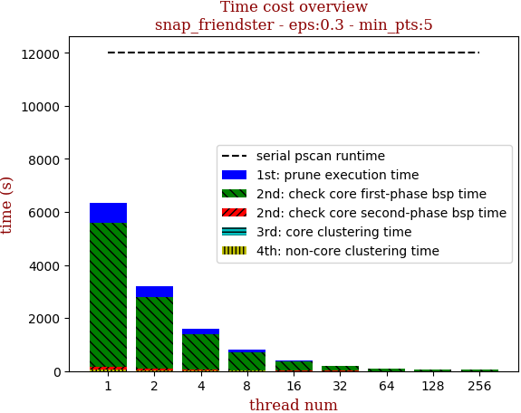 | 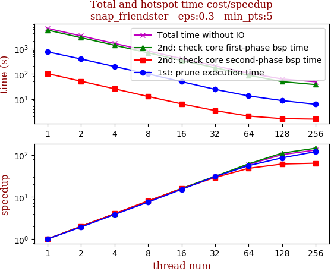

thread_num | prune | check-core 1st bsp | check-core 2nd bsp | cluster-core | cluster-non-core | total | total speedup
--- | --- | --- | --- | --- | --- | --- | ---
1 | 214.312s | 2690.313s | 56.22s | 5.702s | 22.991s | 2989.544s | 1.000
4 | 56.411s | 642.348s | 13.055s | 2.007s | 6.037s | 719.862s | 4.153
8 | 26.749s | 341.278s | 7.209s | 1.067s | 3.578s | 379.887s | 7.870
16 | 15.125s | 182.238s | 3.814s | 0.601s | 2.021s | 203.801s | 14.669
24 | 11.976s | 127.939s | 2.712s | 0.607s | 1.674s | 144.913s | 20.630
32 | 9.351s | 108.118s | 1.979s | 0.392s | 1.172s | 121.015s | 24.704
40 | 13.227s | 78.029s | 1.619s | 0.403s | 1.154s | 94.441s | 31.655

## eps:0.4

overview | speedup
--- | ---
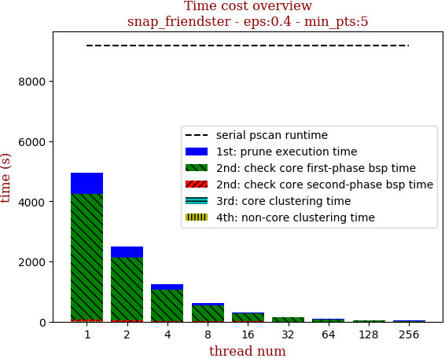 | 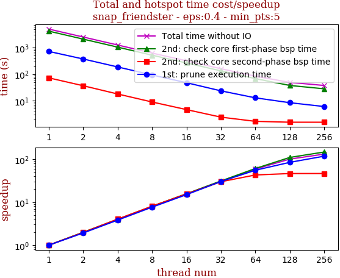

thread_num | prune | check-core 1st bsp | check-core 2nd bsp | cluster-core | cluster-non-core | total | total speedup
--- | --- | --- | --- | --- | --- | --- | ---
1 | 262.503s | 1755.059s | 46.318s | 0.949s | 3.017s | 2067.851s | 1.000
4 | 56.083s | 514.746s | 11.036s | 0.484s | 1.342s | 583.696s | 3.543
8 | 24.807s | 253.891s | 5.246s | 0.2s | 0.572s | 284.719s | 7.263
16 | 15.337s | 134.235s | 2.999s | 0.231s | 0.33s | 153.134s | 13.504
24 | 12.734s | 99.096s | 2.147s | 0.19s | 0.225s | 114.395s | 18.076
32 | 10.799s | 85.217s | 1.784s | 0.291s | 0.204s | 98.298s | 21.037
40 | 8.878s | 58.611s | 1.309s | 0.164s | 0.151s | 69.121s | 29.916

## eps:0.5

overview | speedup
--- | ---
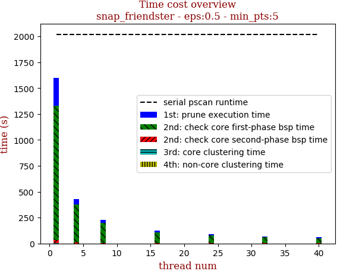 | 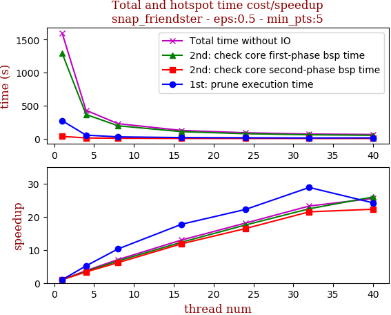

thread_num | prune | check-core 1st bsp | check-core 2nd bsp | cluster-core | cluster-non-core | total | total speedup
--- | --- | --- | --- | --- | --- | --- | ---
1 | 271.042s | 1293.092s | 33.226s | 0.449s | 0.87s | 1598.682s | 1.000
4 | 52.356s | 365.313s | 9.917s | 0.288s | 0.234s | 428.11s | 3.734
8 | 26.39s | 194.248s | 5.405s | 0.124s | 0.118s | 226.287s | 7.065
16 | 15.278s | 104.869s | 2.804s | 0.109s | 0.064s | 123.127s | 12.984
24 | 12.211s | 73.88s | 2.022s | 0.244s | 0.054s | 88.413s | 18.082
32 | 9.403s | 57.738s | 1.547s | 0.103s | 0.052s | 68.847s | 23.221
40 | 11.207s | 49.822s | 1.493s | 0.112s | 0.045s | 62.682s | 25.505

## eps:0.6

overview | speedup
--- | ---
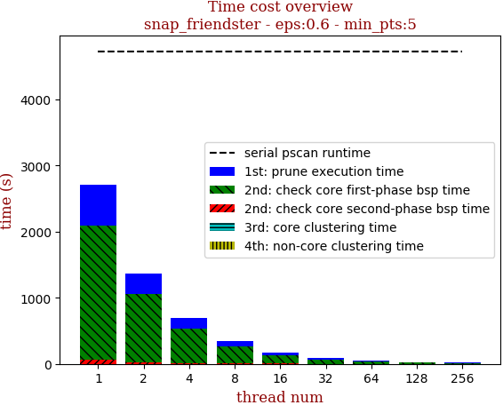 | 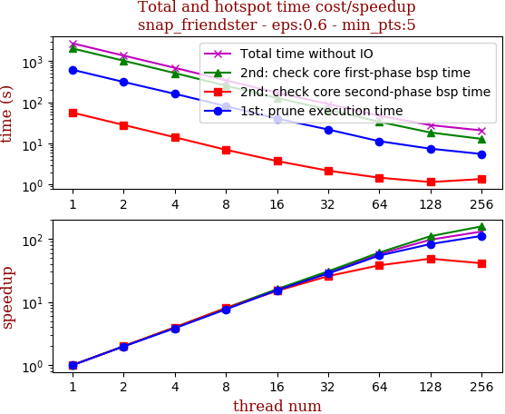

thread_num | prune | check-core 1st bsp | check-core 2nd bsp | cluster-core | cluster-non-core | total | total speedup
--- | --- | --- | --- | --- | --- | --- | ---
1 | 190.304s | 1191.689s | 37.397s | 0.282s | 0.25s | 1419.925s | 1.000
4 | 53.503s | 276.605s | 9.0s | 0.247s | 0.101s | 339.458s | 4.183
8 | 24.921s | 142.885s | 4.572s | 0.242s | 0.072s | 172.694s | 8.222
16 | 14.917s | 73.048s | 2.446s | 0.101s | 0.033s | 90.549s | 15.681
24 | 10.901s | 52.125s | 1.816s | 0.229s | 0.029s | 65.103s | 21.810
32 | 8.984s | 39.515s | 1.52s | 0.23s | 0.058s | 50.31s | 28.224
40 | 8.053s | 37.059s | 1.195s | 0.241s | 0.024s | 46.575s | 30.487

## eps:0.7

overview | speedup
--- | ---
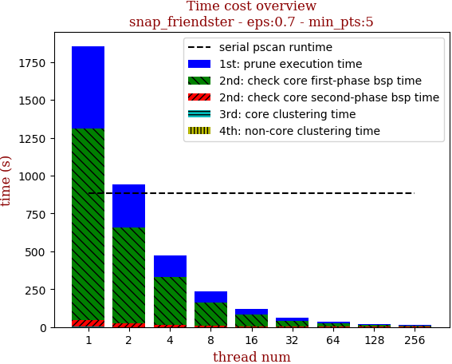 | 

thread_num | prune | check-core 1st bsp | check-core 2nd bsp | cluster-core | cluster-non-core | total | total speedup
--- | --- | --- | --- | --- | --- | --- | ---
1 | 273.838s | 794.934s | 31.603s | 0.255s | 0.134s | 1100.767s | 1.000
4 | 38.772s | 172.206s | 6.92s | 0.225s | 0.076s | 218.202s | 5.045
8 | 22.851s | 92.15s | 3.856s | 0.232s | 0.039s | 119.131s | 9.240
16 | 14.052s | 49.289s | 2.066s | 0.233s | 0.019s | 65.661s | 16.764
24 | 10.174s | 34.19s | 1.516s | 0.224s | 0.021s | 46.127s | 23.864
32 | 8.129s | 29.387s | 1.214s | 0.094s | 0.02s | 38.848s | 28.335
40 | 7.464s | 25.072s | 0.971s | 0.098s | 0.022s | 33.63s | 32.732

## eps:0.8

overview | speedup
--- | ---
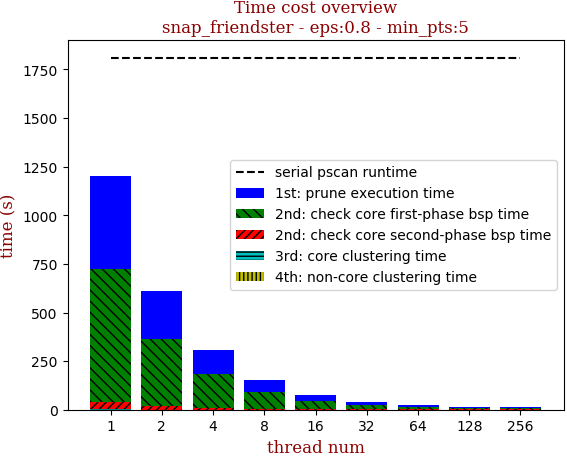 | 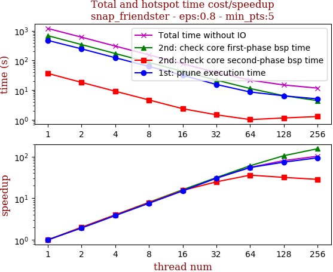

thread_num | prune | check-core 1st bsp | check-core 2nd bsp | cluster-core | cluster-non-core | total | total speedup
--- | --- | --- | --- | --- | --- | --- | ---
1 | 272.314s | 453.627s | 24.218s | 0.225s | 0.113s | 750.499s | 1.000
4 | 35.87s | 97.069s | 5.48s | 0.228s | 0.066s | 138.717s | 5.410
8 | 21.912s | 52.925s | 2.918s | 0.228s | 0.035s | 78.021s | 9.619
16 | 13.117s | 27.901s | 1.385s | 0.235s | 0.022s | 42.668s | 17.589
24 | 10.094s | 19.819s | 1.182s | 0.229s | 0.016s | 31.342s | 23.945
32 | 7.889s | 17.078s | 0.929s | 0.092s | 0.018s | 26.008s | 28.856
40 | 7.019s | 15.044s | 0.712s | 0.091s | 0.018s | 22.887s | 32.791

## eps:0.9

overview | speedup
--- | ---
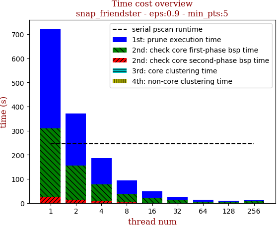 | 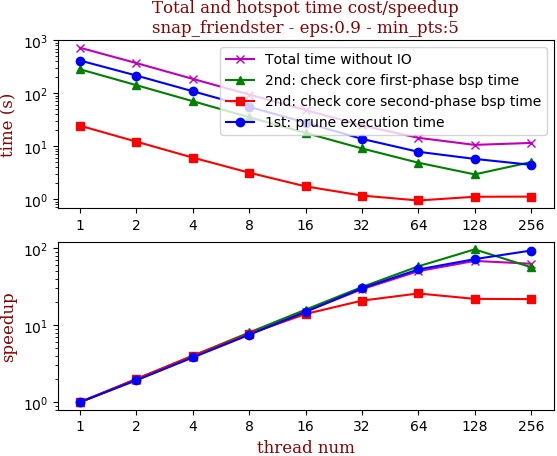

thread_num | prune | check-core 1st bsp | check-core 2nd bsp | cluster-core | cluster-non-core | total | total speedup
--- | --- | --- | --- | --- | --- | --- | ---
1 | 147.957s | 185.049s | 14.39s | 0.221s | 0.105s | 347.725s | 1.000
4 | 34.005s | 39.316s | 3.202s | 0.217s | 0.064s | 76.806s | 4.527
8 | 20.304s | 21.622s | 1.778s | 0.221s | 0.035s | 43.961s | 7.910
16 | 12.429s | 11.686s | 1.088s | 0.223s | 0.019s | 25.448s | 13.664
24 | 10.37s | 8.306s | 0.706s | 0.221s | 0.019s | 19.625s | 17.718
32 | 7.56s | 7.44s | 0.542s | 0.09s | 0.02s | 15.655s | 22.212
40 | 6.988s | 6.508s | 0.558s | 0.09s | 0.016s | 14.164s | 24.550

