## eps:0.1

overview | speedup
--- | ---
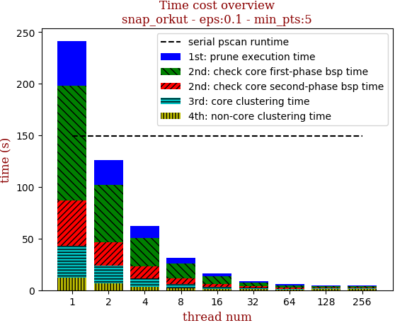 | 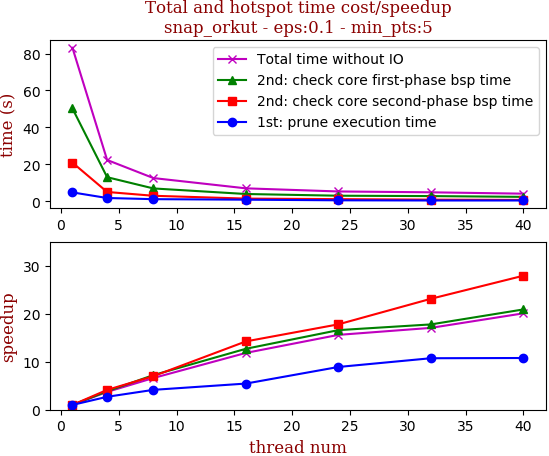

thread_num | prune | check-core 1st bsp | check-core 2nd bsp | cluster-core | cluster-non-core | total | total speedup
--- | --- | --- | --- | --- | --- | --- | ---
1 | 4.827s | 50.245s | 20.937s | 3.826s | 3.289s | 83.127s | 1.000
4 | 1.792s | 13.056s | 5.063s | 1.333s | 1.128s | 22.375s | 3.715
8 | 1.166s | 6.969s | 2.994s | 0.796s | 0.659s | 12.587s | 6.604
16 | 0.886s | 3.958s | 1.471s | 0.395s | 0.31s | 7.024s | 11.835
24 | 0.542s | 3.03s | 1.177s | 0.319s | 0.261s | 5.331s | 15.593
32 | 0.45s | 2.827s | 0.906s | 0.442s | 0.245s | 4.875s | 17.052
40 | 0.448s | 2.405s | 0.75s | 0.352s | 0.182s | 4.14s | 20.079

## eps:0.2

overview | speedup
--- | ---
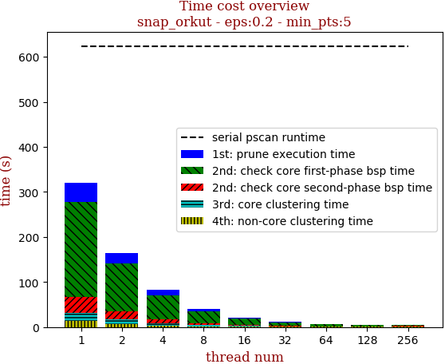 | 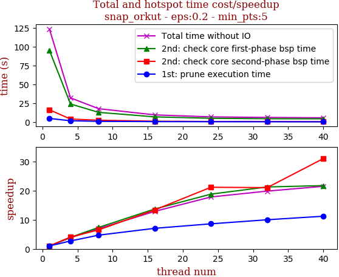

thread_num | prune | check-core 1st bsp | check-core 2nd bsp | cluster-core | cluster-non-core | total | total speedup
--- | --- | --- | --- | --- | --- | --- | ---
1 | 4.875s | 95.201s | 16.384s | 2.664s | 4.264s | 123.391s | 1.000
4 | 1.792s | 24.074s | 4.052s | 0.871s | 1.33s | 32.122s | 3.841
8 | 1.036s | 12.949s | 2.512s | 0.535s | 0.783s | 17.818s | 6.925
16 | 0.691s | 6.96s | 1.225s | 0.317s | 0.387s | 9.583s | 12.876
24 | 0.567s | 5.068s | 0.775s | 0.267s | 0.25s | 6.929s | 17.808
32 | 0.488s | 4.483s | 0.78s | 0.222s | 0.25s | 6.226s | 19.819
40 | 0.435s | 4.385s | 0.529s | 0.192s | 0.209s | 5.752s | 21.452

## eps:0.3

overview | speedup
--- | ---
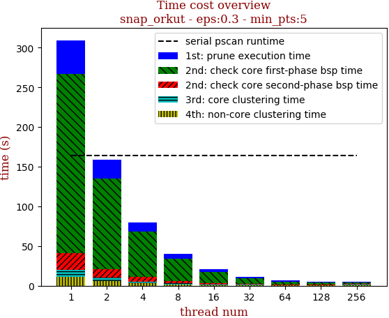 | 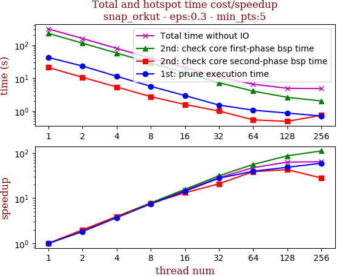

thread_num | prune | check-core 1st bsp | check-core 2nd bsp | cluster-core | cluster-non-core | total | total speedup
--- | --- | --- | --- | --- | --- | --- | ---
1 | 4.977s | 91.981s | 10.285s | 2.479s | 4.805s | 114.529s | 1.000
4 | 1.834s | 26.014s | 2.693s | 0.556s | 1.197s | 32.297s | 3.546
8 | 1.036s | 13.334s | 1.544s | 0.392s | 0.637s | 16.947s | 6.758
16 | 0.714s | 7.521s | 0.729s | 0.192s | 0.334s | 9.493s | 12.065
24 | 0.554s | 5.303s | 0.515s | 0.152s | 0.247s | 6.774s | 16.907
32 | 0.486s | 4.434s | 0.415s | 0.13s | 0.169s | 5.637s | 20.317
40 | 0.493s | 3.794s | 0.32s | 0.119s | 0.158s | 4.888s | 23.431

## eps:0.4

overview | speedup
--- | ---
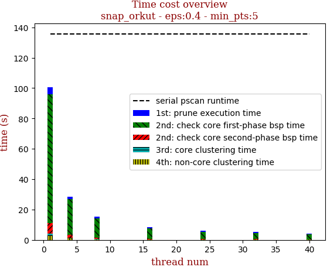 | 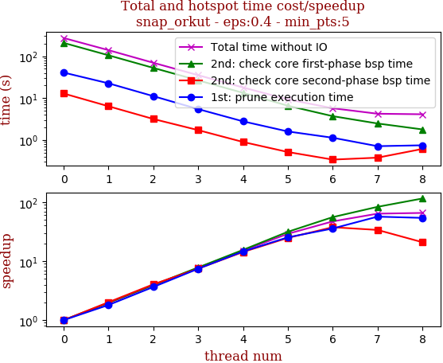

thread_num | prune | check-core 1st bsp | check-core 2nd bsp | cluster-core | cluster-non-core | total | total speedup
--- | --- | --- | --- | --- | --- | --- | ---
1 | 4.92s | 84.611s | 7.163s | 1.574s | 2.489s | 100.76s | 1.000
4 | 1.66s | 23.49s | 1.972s | 0.402s | 0.858s | 28.385s | 3.550
8 | 1.069s | 12.653s | 0.914s | 0.217s | 0.457s | 15.313s | 6.580
16 | 0.637s | 6.914s | 0.451s | 0.11s | 0.218s | 8.332s | 12.093
24 | 0.619s | 4.836s | 0.319s | 0.08s | 0.153s | 6.009s | 16.768
32 | 0.504s | 4.098s | 0.307s | 0.084s | 0.141s | 5.138s | 19.611
40 | 0.427s | 3.228s | 0.257s | 0.078s | 0.09s | 4.083s | 24.678

## eps:0.5

overview | speedup
--- | ---
 | 

thread_num | prune | check-core 1st bsp | check-core 2nd bsp | cluster-core | cluster-non-core | total | total speedup
--- | --- | --- | --- | --- | --- | --- | ---
1 | 6.052s | 67.849s | 4.824s | 0.456s | 1.183s | 80.367s | 1.000
4 | 1.806s | 18.868s | 1.052s | 0.087s | 0.363s | 22.179s | 3.624
8 | 1.115s | 10.36s | 0.634s | 0.054s | 0.17s | 12.336s | 6.515
16 | 0.724s | 5.635s | 0.302s | 0.033s | 0.126s | 6.823s | 11.779
24 | 0.595s | 4.003s | 0.207s | 0.023s | 0.059s | 4.889s | 16.438
32 | 0.502s | 3.244s | 0.154s | 0.02s | 0.069s | 3.991s | 20.137
40 | 0.41s | 3.311s | 0.133s | 0.018s | 0.054s | 3.93s | 20.450

## eps:0.6

overview | speedup
--- | ---
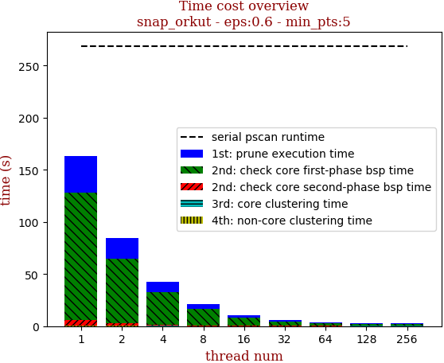 | 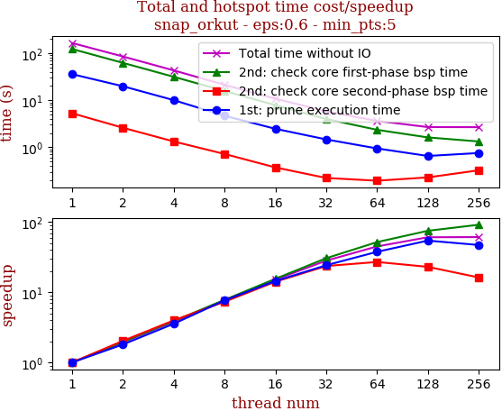

thread_num | prune | check-core 1st bsp | check-core 2nd bsp | cluster-core | cluster-non-core | total | total speedup
--- | --- | --- | --- | --- | --- | --- | ---
1 | 4.785s | 55.741s | 3.333s | 0.045s | 0.232s | 64.138s | 1.000
4 | 1.788s | 13.709s | 0.831s | 0.019s | 0.07s | 16.421s | 3.906
8 | 1.114s | 7.485s | 0.486s | 0.015s | 0.039s | 9.142s | 7.016
16 | 0.775s | 4.24s | 0.233s | 0.01s | 0.02s | 5.28s | 12.147
24 | 0.496s | 2.921s | 0.141s | 0.009s | 0.014s | 3.584s | 17.896
32 | 0.414s | 2.725s | 0.133s | 0.013s | 0.018s | 3.305s | 19.406
40 | 0.429s | 2.592s | 0.116s | 0.01s | 0.019s | 3.169s | 20.239

## eps:0.7

overview | speedup
--- | ---
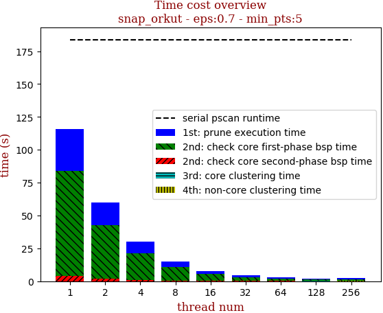 | 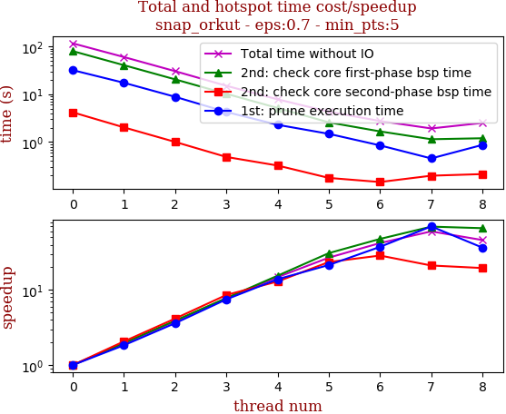

thread_num | prune | check-core 1st bsp | check-core 2nd bsp | cluster-core | cluster-non-core | total | total speedup
--- | --- | --- | --- | --- | --- | --- | ---
1 | 5.031s | 32.645s | 3.288s | 0.014s | 0.026s | 41.007s | 1.000
4 | 1.729s | 9.615s | 0.747s | 0.009s | 0.007s | 12.11s | 3.386
8 | 0.997s | 5.009s | 0.328s | 0.012s | 0.009s | 6.358s | 6.450
16 | 0.684s | 2.812s | 0.192s | 0.009s | 0.006s | 3.707s | 11.062
24 | 0.518s | 2.258s | 0.139s | 0.007s | 0.008s | 2.933s | 13.981
32 | 0.42s | 2.091s | 0.111s | 0.014s | 0.008s | 2.647s | 15.492
40 | 0.385s | 1.554s | 0.093s | 0.007s | 0.006s | 2.048s | 20.023

## eps:0.8

overview | speedup
--- | ---
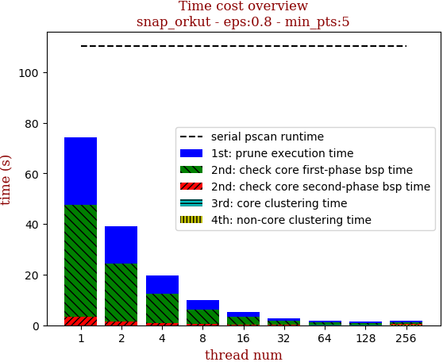 | 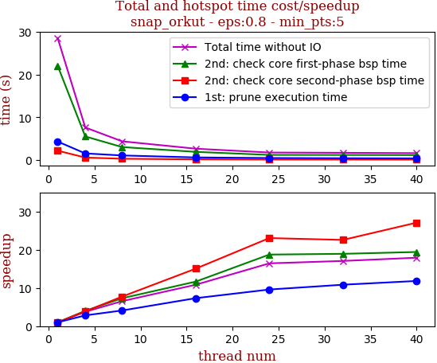

thread_num | prune | check-core 1st bsp | check-core 2nd bsp | cluster-core | cluster-non-core | total | total speedup
--- | --- | --- | --- | --- | --- | --- | ---
1 | 4.306s | 22.054s | 2.167s | 0.006s | 0.003s | 28.538s | 1.000
4 | 1.526s | 5.5s | 0.559s | 0.007s | 0.002s | 7.597s | 3.756
8 | 1.05s | 3.019s | 0.28s | 0.007s | 0.002s | 4.36s | 6.545
16 | 0.588s | 1.892s | 0.144s | 0.004s | 0.002s | 2.633s | 10.839
24 | 0.449s | 1.177s | 0.094s | 0.008s | 0.003s | 1.736s | 16.439
32 | 0.397s | 1.165s | 0.096s | 0.006s | 0.005s | 1.672s | 17.068
40 | 0.364s | 1.136s | 0.08s | 0.005s | 0.005s | 1.593s | 17.915

## eps:0.9

overview | speedup
--- | ---
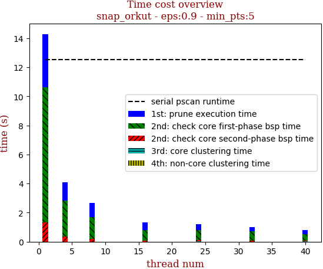 | 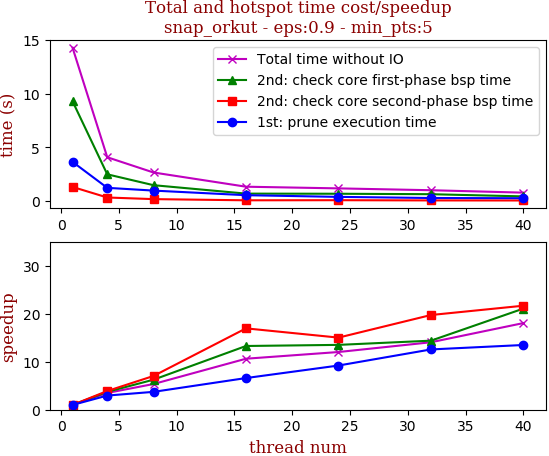

thread_num | prune | check-core 1st bsp | check-core 2nd bsp | cluster-core | cluster-non-core | total | total speedup
--- | --- | --- | --- | --- | --- | --- | ---
1 | 3.655s | 9.294s | 1.322s | 0.006s | 0.002s | 14.282s | 1.000
4 | 1.239s | 2.498s | 0.339s | 0.006s | 0.001s | 4.087s | 3.494
8 | 0.982s | 1.486s | 0.188s | 0.007s | 0.002s | 2.667s | 5.355
16 | 0.554s | 0.7s | 0.078s | 0.007s | 0.002s | 1.344s | 10.626
24 | 0.397s | 0.688s | 0.088s | 0.009s | 0.004s | 1.188s | 12.022
32 | 0.291s | 0.646s | 0.067s | 0.006s | 0.003s | 1.016s | 14.057
40 | 0.271s | 0.441s | 0.061s | 0.009s | 0.005s | 0.791s | 18.056

