## eps:0.1

overview | speedup
--- | ---
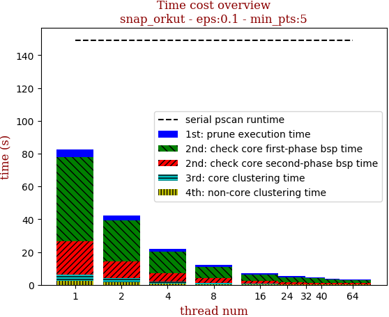 | 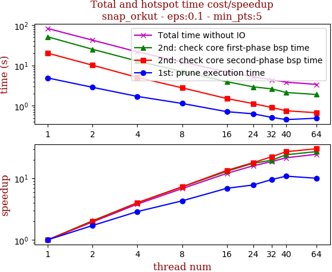

thread_num | prune | check-core 1st bsp | check-core 2nd bsp | cluster-core | cluster-non-core | total | total speedup
--- | --- | --- | --- | --- | --- | --- | ---
1 | 4.886s | 51.3s | 20.179s | 3.985s | 2.305s | 82.659s | 1.000
2 | 2.861s | 25.141s | 10.118s | 2.524s | 1.722s | 42.369s | 1.951
4 | 1.7s | 12.825s | 5.044s | 1.358s | 0.82s | 21.75s | 3.800
8 | 1.137s | 7.084s | 2.779s | 0.704s | 0.453s | 12.16s | 6.798
16 | 0.711s | 3.946s | 1.505s | 0.454s | 0.268s | 6.887s | 12.002
24 | 0.629s | 2.933s | 1.127s | 0.299s | 0.202s | 5.194s | 15.914
32 | 0.513s | 2.619s | 0.905s | 0.271s | 0.121s | 4.432s | 18.650
40 | 0.452s | 2.129s | 0.748s | 0.385s | 0.129s | 3.847s | 21.487
64 | 0.489s | 1.896s | 0.67s | 0.208s | 0.108s | 3.374s | 24.499

## eps:0.2

overview | speedup
--- | ---
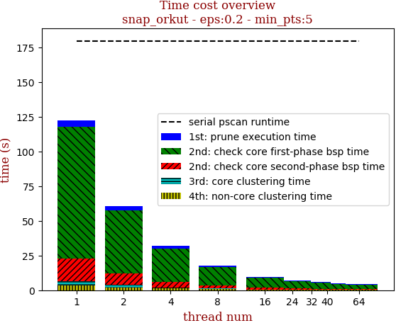 | 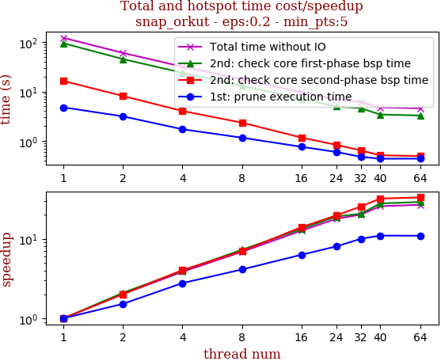

thread_num | prune | check-core 1st bsp | check-core 2nd bsp | cluster-core | cluster-non-core | total | total speedup
--- | --- | --- | --- | --- | --- | --- | ---
1 | 4.783s | 95.061s | 16.359s | 2.75s | 3.544s | 122.5s | 1.000
2 | 3.144s | 45.459s | 8.129s | 1.826s | 2.0s | 60.56s | 2.023
4 | 1.724s | 23.967s | 4.042s | 0.938s | 1.191s | 31.865s | 3.844
8 | 1.163s | 13.062s | 2.342s | 0.575s | 0.714s | 17.858s | 6.860
16 | 0.76s | 7.137s | 1.169s | 0.315s | 0.302s | 9.685s | 12.648
24 | 0.597s | 4.992s | 0.831s | 0.234s | 0.22s | 6.877s | 17.813
32 | 0.478s | 4.597s | 0.642s | 0.185s | 0.183s | 6.088s | 20.122
40 | 0.436s | 3.424s | 0.511s | 0.259s | 0.14s | 4.773s | 25.665
64 | 0.438s | 3.274s | 0.494s | 0.208s | 0.162s | 4.579s | 26.753

## eps:0.3

overview | speedup
--- | ---
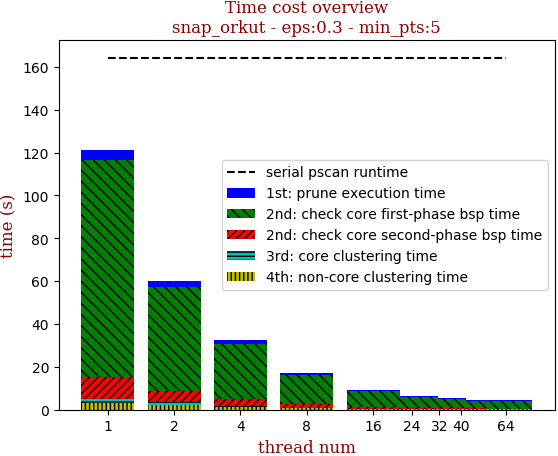 | 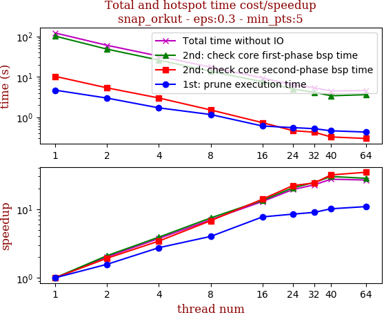

thread_num | prune | check-core 1st bsp | check-core 2nd bsp | cluster-core | cluster-non-core | total | total speedup
--- | --- | --- | --- | --- | --- | --- | ---
1 | 4.683s | 101.448s | 10.269s | 1.715s | 3.177s | 121.295s | 1.000
2 | 2.981s | 48.336s | 5.341s | 1.356s | 2.145s | 60.161s | 2.016
4 | 1.709s | 25.992s | 3.0s | 0.707s | 1.116s | 32.526s | 3.729
8 | 1.171s | 13.658s | 1.518s | 0.321s | 0.655s | 17.324s | 7.002
16 | 0.609s | 7.562s | 0.737s | 0.208s | 0.28s | 9.4s | 12.904
24 | 0.555s | 4.978s | 0.468s | 0.126s | 0.181s | 6.311s | 19.220
32 | 0.523s | 4.157s | 0.428s | 0.12s | 0.149s | 5.38s | 22.546
40 | 0.464s | 3.405s | 0.327s | 0.117s | 0.143s | 4.459s | 27.202
64 | 0.431s | 3.617s | 0.299s | 0.108s | 0.124s | 4.581s | 26.478

## eps:0.4

overview | speedup
--- | ---
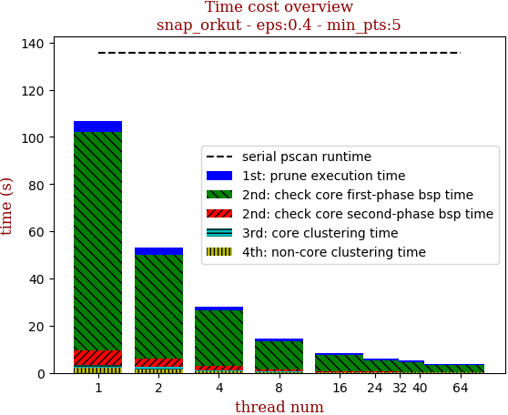 | 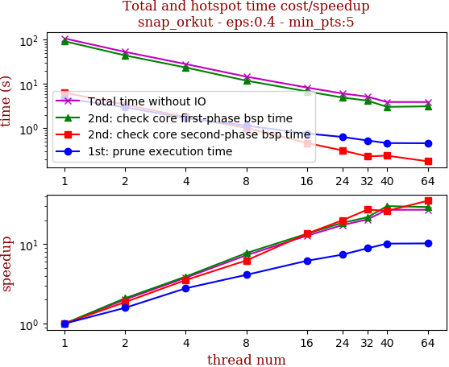

thread_num | prune | check-core 1st bsp | check-core 2nd bsp | cluster-core | cluster-non-core | total | total speedup
--- | --- | --- | --- | --- | --- | --- | ---
1 | 4.736s | 92.371s | 6.372s | 1.155s | 2.131s | 106.767s | 1.000
2 | 2.991s | 44.158s | 3.414s | 0.912s | 1.593s | 53.071s | 2.012
4 | 1.699s | 23.584s | 1.799s | 0.363s | 0.727s | 28.175s | 3.789
8 | 1.15s | 11.918s | 1.02s | 0.225s | 0.361s | 14.677s | 7.274
16 | 0.765s | 6.819s | 0.469s | 0.099s | 0.188s | 8.342s | 12.799
24 | 0.64s | 4.959s | 0.318s | 0.076s | 0.13s | 6.124s | 17.434
32 | 0.532s | 4.223s | 0.233s | 0.063s | 0.137s | 5.192s | 20.564
40 | 0.465s | 3.054s | 0.242s | 0.077s | 0.09s | 3.931s | 27.160
64 | 0.462s | 3.137s | 0.18s | 0.057s | 0.088s | 3.926s | 27.195

## eps:0.5

overview | speedup
--- | ---
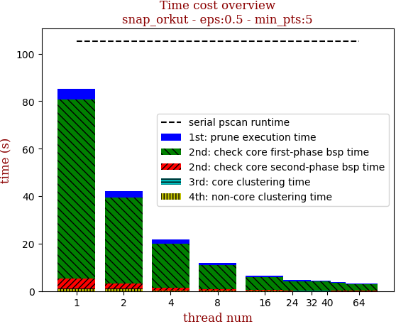 | 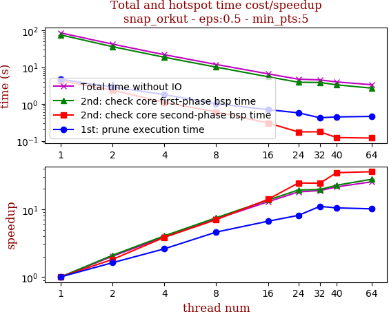

thread_num | prune | check-core 1st bsp | check-core 2nd bsp | cluster-core | cluster-non-core | total | total speedup
--- | --- | --- | --- | --- | --- | --- | ---
1 | 4.684s | 75.314s | 4.287s | 0.269s | 0.804s | 85.361s | 1.000
2 | 2.889s | 36.036s | 2.363s | 0.214s | 0.767s | 42.272s | 2.019
4 | 1.801s | 18.591s | 1.115s | 0.085s | 0.247s | 21.842s | 3.908
8 | 1.018s | 10.043s | 0.61s | 0.05s | 0.144s | 11.868s | 7.193
16 | 0.703s | 5.49s | 0.305s | 0.031s | 0.067s | 6.6s | 12.933
24 | 0.576s | 3.899s | 0.175s | 0.02s | 0.045s | 4.719s | 18.089
32 | 0.424s | 3.84s | 0.176s | 0.02s | 0.047s | 4.51s | 18.927
40 | 0.446s | 3.318s | 0.123s | 0.017s | 0.049s | 3.979s | 21.453
64 | 0.461s | 2.701s | 0.119s | 0.017s | 0.04s | 3.341s | 25.550

## eps:0.6

overview | speedup
--- | ---
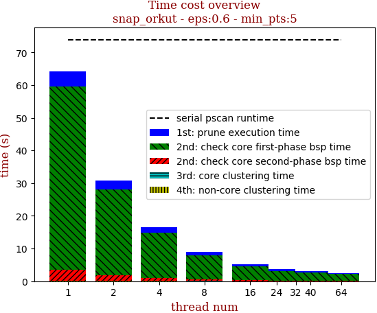 | 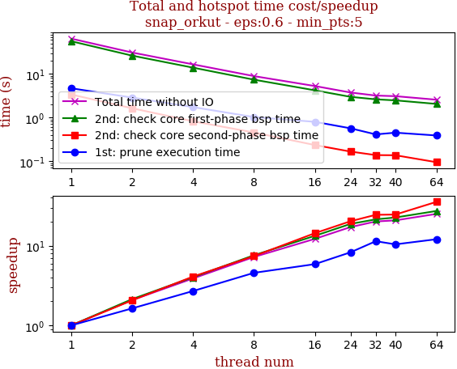

thread_num | prune | check-core 1st bsp | check-core 2nd bsp | cluster-core | cluster-non-core | total | total speedup
--- | --- | --- | --- | --- | --- | --- | ---
1 | 4.668s | 55.898s | 3.355s | 0.044s | 0.198s | 64.166s | 1.000
2 | 2.854s | 26.142s | 1.624s | 0.036s | 0.176s | 30.835s | 2.081
4 | 1.727s | 13.863s | 0.817s | 0.022s | 0.063s | 16.495s | 3.890
8 | 1.021s | 7.348s | 0.452s | 0.015s | 0.033s | 8.872s | 7.232
16 | 0.794s | 4.192s | 0.233s | 0.013s | 0.018s | 5.253s | 12.215
24 | 0.564s | 2.97s | 0.165s | 0.015s | 0.018s | 3.735s | 17.180
32 | 0.409s | 2.603s | 0.137s | 0.013s | 0.013s | 3.178s | 20.191
40 | 0.448s | 2.467s | 0.136s | 0.009s | 0.014s | 3.078s | 20.847
64 | 0.386s | 2.041s | 0.094s | 0.01s | 0.017s | 2.55s | 25.163

## eps:0.7

overview | speedup
--- | ---
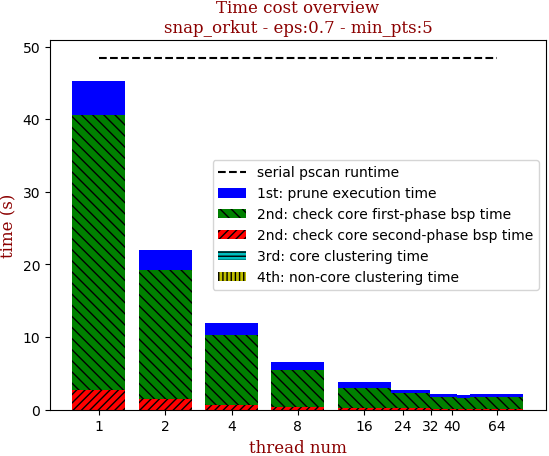 | 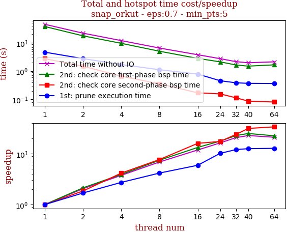

thread_num | prune | check-core 1st bsp | check-core 2nd bsp | cluster-core | cluster-non-core | total | total speedup
--- | --- | --- | --- | --- | --- | --- | ---
1 | 4.676s | 37.738s | 2.75s | 0.01s | 0.02s | 45.196s | 1.000
2 | 2.765s | 17.676s | 1.485s | 0.009s | 0.013s | 21.95s | 2.059
4 | 1.71s | 9.611s | 0.66s | 0.009s | 0.008s | 11.999s | 3.767
8 | 1.119s | 5.042s | 0.356s | 0.009s | 0.008s | 6.536s | 6.915
16 | 0.786s | 2.821s | 0.171s | 0.009s | 0.007s | 3.796s | 11.906
24 | 0.458s | 2.125s | 0.157s | 0.007s | 0.005s | 2.755s | 16.405
32 | 0.386s | 1.65s | 0.114s | 0.006s | 0.006s | 2.165s | 20.876
40 | 0.37s | 1.501s | 0.087s | 0.007s | 0.006s | 1.973s | 22.907
64 | 0.365s | 1.668s | 0.081s | 0.008s | 0.007s | 2.132s | 21.199

## eps:0.8

overview | speedup
--- | ---
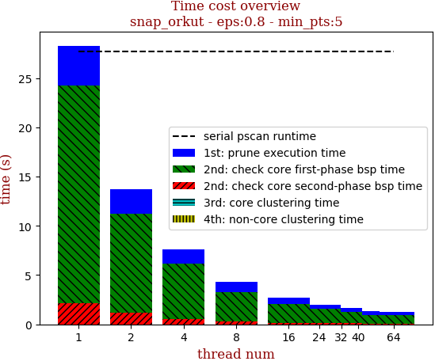 | 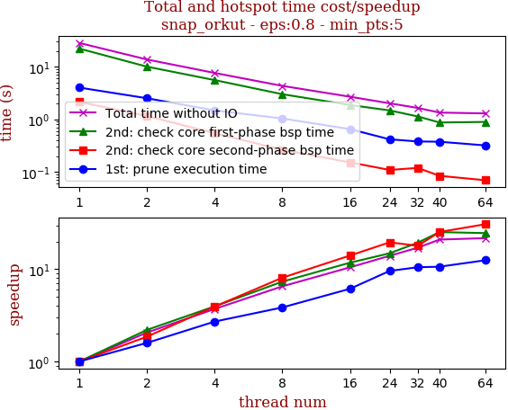

thread_num | prune | check-core 1st bsp | check-core 2nd bsp | cluster-core | cluster-non-core | total | total speedup
--- | --- | --- | --- | --- | --- | --- | ---
1 | 4.019s | 22.096s | 2.155s | 0.006s | 0.003s | 28.282s | 1.000
2 | 2.523s | 10.032s | 1.158s | 0.006s | 0.004s | 13.726s | 2.060
4 | 1.483s | 5.577s | 0.547s | 0.007s | 0.002s | 7.619s | 3.712
8 | 1.042s | 3.01s | 0.266s | 0.007s | 0.002s | 4.33s | 6.532
16 | 0.654s | 1.875s | 0.153s | 0.007s | 0.003s | 2.695s | 10.494
24 | 0.419s | 1.483s | 0.11s | 0.004s | 0.003s | 2.022s | 13.987
32 | 0.382s | 1.139s | 0.12s | 0.005s | 0.004s | 1.652s | 17.120
40 | 0.377s | 0.874s | 0.085s | 0.005s | 0.003s | 1.348s | 20.981
64 | 0.321s | 0.896s | 0.07s | 0.007s | 0.005s | 1.301s | 21.739

## eps:0.9

overview | speedup
--- | ---
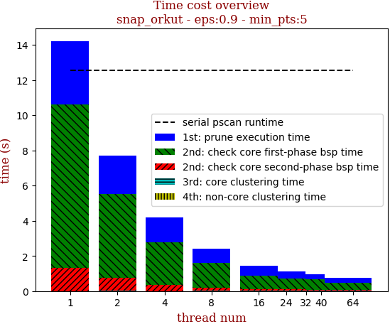 | 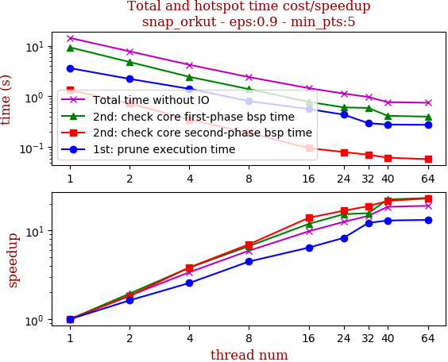

thread_num | prune | check-core 1st bsp | check-core 2nd bsp | cluster-core | cluster-non-core | total | total speedup
--- | --- | --- | --- | --- | --- | --- | ---
1 | 3.611s | 9.264s | 1.333s | 0.006s | 0.002s | 14.218s | 1.000
2 | 2.216s | 4.765s | 0.728s | 0.006s | 0.003s | 7.72s | 1.842
4 | 1.412s | 2.436s | 0.348s | 0.006s | 0.001s | 4.206s | 3.380
8 | 0.809s | 1.391s | 0.191s | 0.009s | 0.001s | 2.404s | 5.914
16 | 0.564s | 0.782s | 0.096s | 0.007s | 0.003s | 1.455s | 9.772
24 | 0.438s | 0.608s | 0.08s | 0.008s | 0.003s | 1.139s | 12.483
32 | 0.297s | 0.592s | 0.071s | 0.008s | 0.003s | 0.974s | 14.598
40 | 0.279s | 0.415s | 0.062s | 0.008s | 0.003s | 0.771s | 18.441
64 | 0.275s | 0.399s | 0.058s | 0.011s | 0.005s | 0.75s | 18.957

