## eps:0.1

overview | speedup
--- | ---
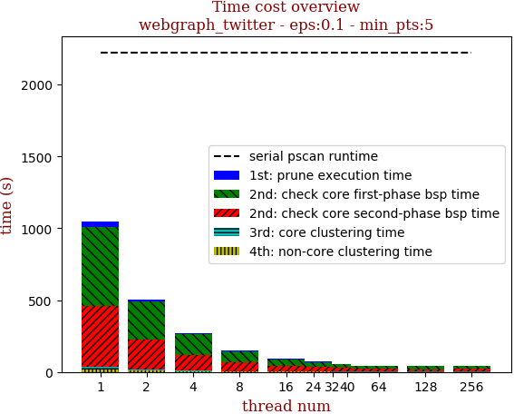 | 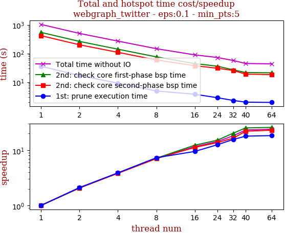

thread_num | prune | check-core 1st bsp | check-core 2nd bsp | cluster-core | cluster-non-core | total | total speedup
--- | --- | --- | --- | --- | --- | --- | ---
1 | 36.013s | 549.53s | 422.168s | 21.115s | 15.912s | 1044.741s | 1.000
2 | 17.085s | 266.032s | 202.527s | 11.271s | 8.858s | 505.777s | 2.066
4 | 9.254s | 142.169s | 110.383s | 5.955s | 4.815s | 272.579s | 3.833
8 | 4.927s | 76.68s | 59.742s | 3.597s | 3.057s | 148.007s | 7.059
16 | 3.789s | 44.607s | 37.59s | 1.813s | 2.095s | 89.897s | 11.622
24 | 2.868s | 36.237s | 30.776s | 1.459s | 1.561s | 72.905s | 14.330
32 | 2.302s | 27.031s | 25.599s | 1.297s | 0.967s | 57.199s | 18.265
40 | 2.005s | 21.724s | 19.152s | 0.988s | 1.066s | 44.937s | 23.249
64 | 1.959s | 21.262s | 18.359s | 1.036s | 1.036s | 43.655s | 23.932
128 | 2.006s | 21.433s | 18.42s | 0.981s | 0.951s | 43.793s | 23.856
256 | 2.796s | 21.914s | 18.488s | 1.138s | 1.066s | 45.405s | 23.009

## eps:0.2

overview | speedup
--- | ---
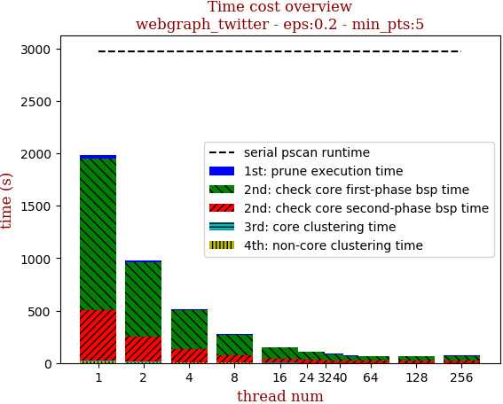 | 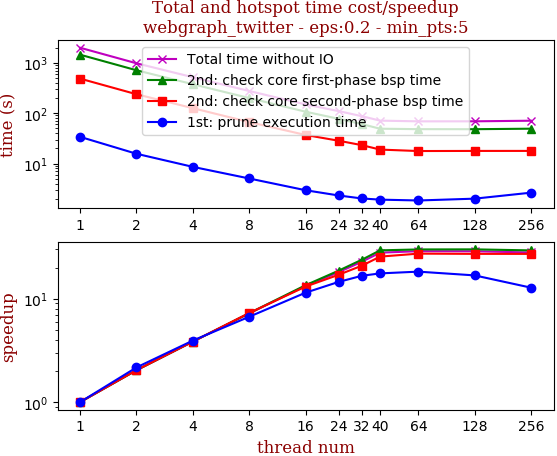

thread_num | prune | check-core 1st bsp | check-core 2nd bsp | cluster-core | cluster-non-core | total | total speedup
--- | --- | --- | --- | --- | --- | --- | ---
1 | 33.894s | 1444.655s | 484.402s | 8.217s | 13.785s | 1984.956s | 1.000
2 | 15.659s | 709.951s | 237.5s | 5.022s | 8.155s | 976.292s | 2.033
4 | 8.61s | 375.365s | 125.66s | 2.805s | 4.01s | 516.452s | 3.843
8 | 5.064s | 199.377s | 66.583s | 1.759s | 2.468s | 275.254s | 7.211
16 | 2.962s | 106.934s | 36.962s | 0.991s | 1.464s | 149.317s | 13.294
24 | 2.332s | 77.364s | 28.431s | 0.764s | 1.094s | 109.988s | 18.047
32 | 2.032s | 60.535s | 23.191s | 0.46s | 0.771s | 86.991s | 22.818
40 | 1.928s | 49.177s | 18.963s | 0.397s | 0.654s | 71.122s | 27.909
64 | 1.854s | 48.198s | 17.741s | 0.41s | 0.669s | 68.874s | 28.820
128 | 2.016s | 48.108s | 17.835s | 0.432s | 0.587s | 68.981s | 28.775
256 | 2.65s | 49.238s | 17.847s | 0.501s | 0.623s | 70.861s | 28.012

## eps:0.3

overview | speedup
--- | ---
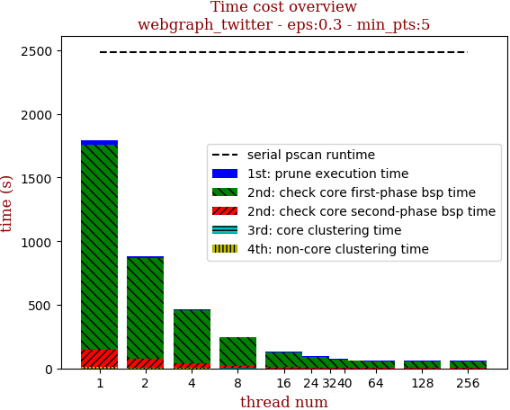 | 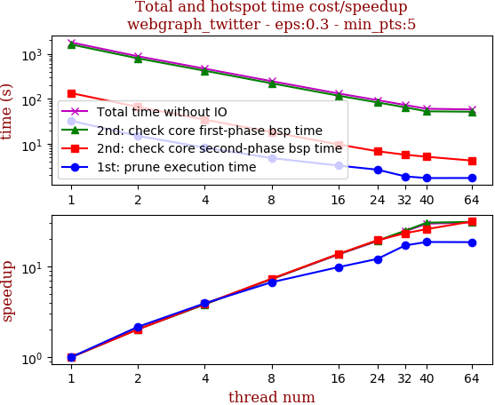

thread_num | prune | check-core 1st bsp | check-core 2nd bsp | cluster-core | cluster-non-core | total | total speedup
--- | --- | --- | --- | --- | --- | --- | ---
1 | 32.514s | 1613.095s | 134.074s | 3.42s | 8.832s | 1791.938s | 1.000
2 | 15.022s | 792.531s | 66.161s | 2.323s | 5.048s | 881.087s | 2.034
4 | 8.274s | 421.204s | 34.559s | 1.231s | 2.611s | 467.881s | 3.830
8 | 4.845s | 221.444s | 18.269s | 0.76s | 1.548s | 246.869s | 7.259
16 | 3.299s | 117.646s | 9.739s | 0.332s | 0.777s | 131.794s | 13.597
24 | 2.676s | 83.335s | 6.858s | 0.255s | 0.546s | 93.673s | 19.130
32 | 1.898s | 64.87s | 5.744s | 0.209s | 0.408s | 73.131s | 24.503
40 | 1.741s | 52.846s | 5.176s | 0.169s | 0.339s | 60.274s | 29.730
64 | 1.747s | 51.765s | 4.26s | 0.199s | 0.327s | 58.3s | 30.737
128 | 1.958s | 52.098s | 4.302s | 0.192s | 0.387s | 58.94s | 30.403
256 | 2.476s | 52.806s | 4.393s | 0.208s | 0.394s | 60.279s | 29.727

## eps:0.4

overview | speedup
--- | ---
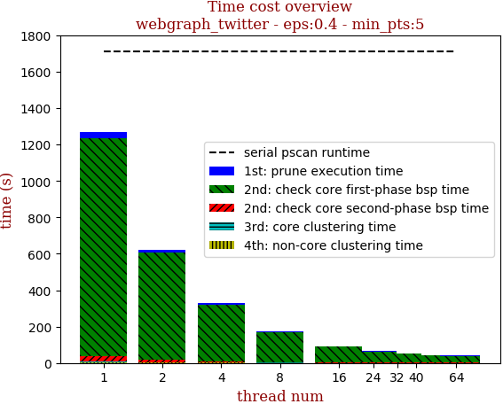 | 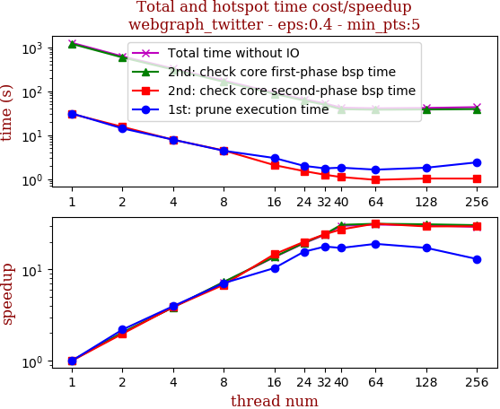

thread_num | prune | check-core 1st bsp | check-core 2nd bsp | cluster-core | cluster-non-core | total | total speedup
--- | --- | --- | --- | --- | --- | --- | ---
1 | 31.102s | 1199.63s | 30.349s | 2.519s | 4.205s | 1267.808s | 1.000
2 | 14.191s | 588.561s | 15.387s | 1.691s | 3.216s | 623.049s | 2.035
4 | 7.864s | 312.123s | 7.823s | 0.907s | 1.38s | 330.099s | 3.841
8 | 4.394s | 164.482s | 4.469s | 0.472s | 0.775s | 174.595s | 7.261
16 | 3.003s | 87.234s | 2.067s | 0.332s | 0.378s | 93.016s | 13.630
24 | 1.989s | 61.433s | 1.512s | 0.28s | 0.276s | 65.493s | 19.358
32 | 1.745s | 49.154s | 1.248s | 0.31s | 0.221s | 52.68s | 24.066
40 | 1.806s | 38.869s | 1.104s | 0.214s | 0.182s | 42.177s | 30.059
64 | 1.63s | 37.854s | 0.955s | 0.229s | 0.172s | 40.842s | 31.042
128 | 1.802s | 38.344s | 1.024s | 0.22s | 0.198s | 41.591s | 30.483
256 | 2.386s | 39.194s | 1.02s | 0.375s | 0.337s | 43.314s | 29.270

## eps:0.5

overview | speedup
--- | ---
 | 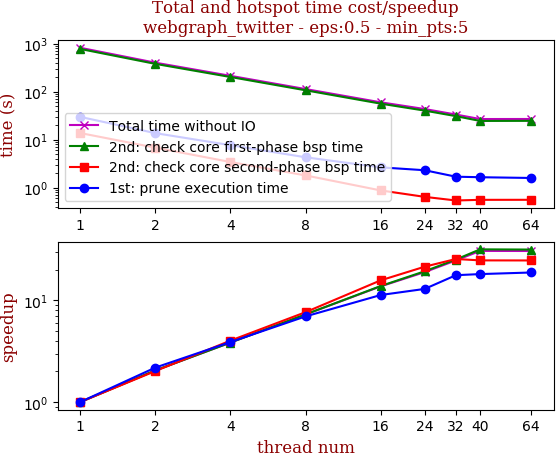

thread_num | prune | check-core 1st bsp | check-core 2nd bsp | cluster-core | cluster-non-core | total | total speedup
--- | --- | --- | --- | --- | --- | --- | ---
1 | 29.82s | 781.351s | 13.719s | 0.503s | 1.359s | 826.756s | 1.000
2 | 13.652s | 381.384s | 6.795s | 0.476s | 1.191s | 403.501s | 2.049
4 | 7.651s | 202.764s | 3.407s | 0.204s | 0.51s | 214.539s | 3.854
8 | 4.276s | 107.049s | 1.788s | 0.158s | 0.259s | 113.533s | 7.282
16 | 2.634s | 56.307s | 0.869s | 0.077s | 0.115s | 60.004s | 13.778
24 | 2.295s | 40.308s | 0.638s | 0.115s | 0.113s | 43.471s | 19.019
32 | 1.682s | 30.906s | 0.536s | 0.066s | 0.153s | 33.345s | 24.794
40 | 1.64s | 24.536s | 0.553s | 0.062s | 0.096s | 26.888s | 30.748
64 | 1.582s | 24.65s | 0.554s | 0.061s | 0.095s | 26.945s | 30.683
128 | 1.694s | 24.927s | 0.53s | 0.062s | 0.117s | 27.332s | 30.249
256 | 2.173s | 25.777s | 0.543s | 0.072s | 0.109s | 28.677s | 28.830

## eps:0.6

overview | speedup
--- | ---
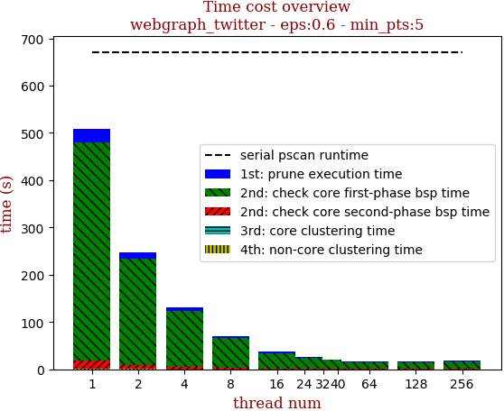 | 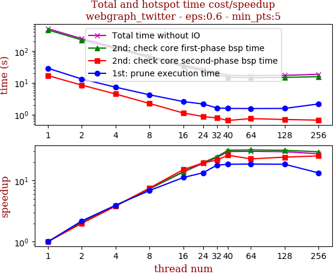

thread_num | prune | check-core 1st bsp | check-core 2nd bsp | cluster-core | cluster-non-core | total | total speedup
--- | --- | --- | --- | --- | --- | --- | ---
1 | 28.731s | 462.995s | 16.832s | 0.304s | 0.503s | 509.366s | 1.000
2 | 13.158s | 224.623s | 8.436s | 0.279s | 0.554s | 247.053s | 2.062
4 | 7.278s | 119.44s | 4.426s | 0.157s | 0.186s | 131.489s | 3.874
8 | 4.189s | 63.066s | 2.235s | 0.117s | 0.097s | 69.707s | 7.307
16 | 2.563s | 33.207s | 1.115s | 0.105s | 0.048s | 37.04s | 13.752
24 | 2.142s | 23.449s | 0.866s | 0.057s | 0.043s | 26.56s | 19.178
32 | 1.607s | 18.768s | 0.776s | 0.098s | 0.037s | 21.289s | 23.926
40 | 1.554s | 14.774s | 0.648s | 0.053s | 0.041s | 17.073s | 29.835
64 | 1.543s | 14.526s | 0.742s | 0.054s | 0.043s | 16.911s | 30.120
128 | 1.553s | 14.781s | 0.696s | 0.072s | 0.041s | 17.145s | 29.709
256 | 2.15s | 15.612s | 0.663s | 0.054s | 0.057s | 18.539s | 27.475

## eps:0.7

overview | speedup
--- | ---
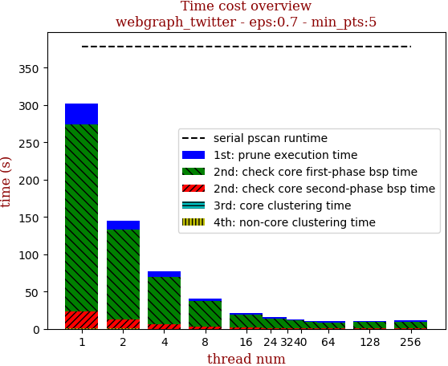 | 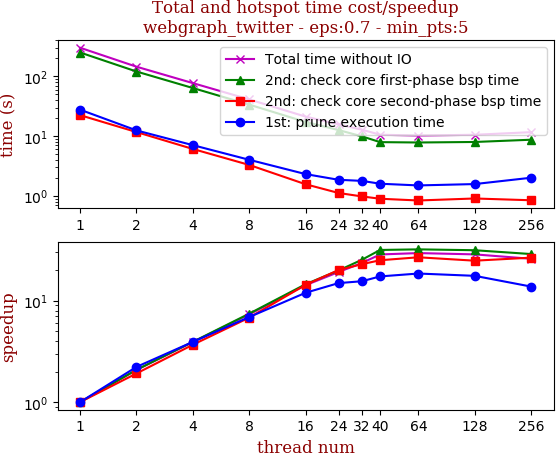

thread_num | prune | check-core 1st bsp | check-core 2nd bsp | cluster-core | cluster-non-core | total | total speedup
--- | --- | --- | --- | --- | --- | --- | ---
1 | 27.675s | 251.097s | 22.393s | 0.214s | 0.272s | 301.654s | 1.000
2 | 12.441s | 120.612s | 11.679s | 0.199s | 0.316s | 145.251s | 2.077
4 | 7.046s | 63.82s | 6.082s | 0.074s | 0.104s | 77.128s | 3.911
8 | 4.007s | 33.659s | 3.285s | 0.103s | 0.051s | 41.109s | 7.338
16 | 2.308s | 17.248s | 1.56s | 0.048s | 0.026s | 21.192s | 14.234
24 | 1.853s | 12.618s | 1.114s | 0.091s | 0.025s | 15.704s | 19.209
32 | 1.776s | 9.888s | 0.975s | 0.1s | 0.042s | 12.784s | 23.596
40 | 1.592s | 7.918s | 0.892s | 0.096s | 0.036s | 10.536s | 28.631
64 | 1.491s | 7.81s | 0.834s | 0.049s | 0.024s | 10.211s | 29.542
128 | 1.571s | 7.966s | 0.901s | 0.049s | 0.026s | 10.515s | 28.688
256 | 2.005s | 8.687s | 0.841s | 0.053s | 0.036s | 11.625s | 25.949

## eps:0.8

overview | speedup
--- | ---
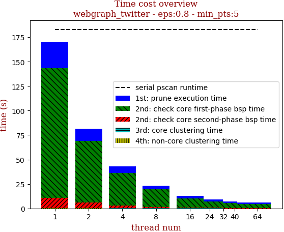 | 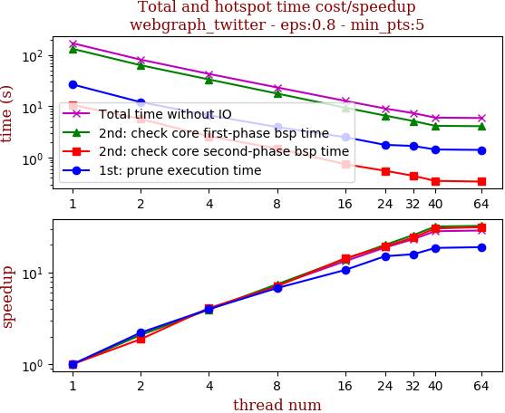

thread_num | prune | check-core 1st bsp | check-core 2nd bsp | cluster-core | cluster-non-core | total | total speedup
--- | --- | --- | --- | --- | --- | --- | ---
1 | 26.665s | 132.165s | 10.629s | 0.128s | 0.258s | 169.848s | 1.000
2 | 12.052s | 63.24s | 5.665s | 0.108s | 0.209s | 81.277s | 2.090
4 | 6.686s | 33.424s | 2.597s | 0.089s | 0.1s | 42.899s | 3.959
8 | 3.94s | 17.746s | 1.503s | 0.091s | 0.067s | 23.35s | 7.274
16 | 2.5s | 9.407s | 0.743s | 0.083s | 0.033s | 12.769s | 13.302
24 | 1.77s | 6.598s | 0.553s | 0.097s | 0.046s | 9.066s | 18.735
32 | 1.685s | 5.161s | 0.441s | 0.036s | 0.023s | 7.349s | 23.112
40 | 1.437s | 4.158s | 0.351s | 0.037s | 0.029s | 6.013s | 28.247
64 | 1.41s | 4.092s | 0.34s | 0.038s | 0.028s | 5.911s | 28.734
128 | 1.479s | 4.265s | 0.371s | 0.039s | 0.034s | 6.19s | 27.439
256 | 1.93s | 5.305s | 0.379s | 0.045s | 0.039s | 7.702s | 22.052

## eps:0.9

overview | speedup
--- | ---
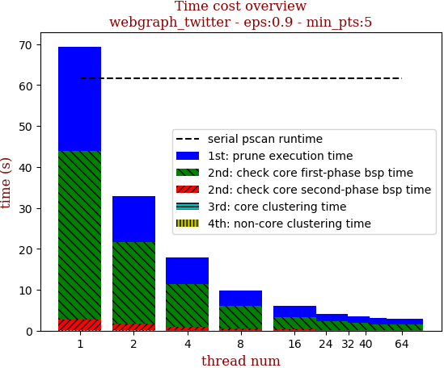 | 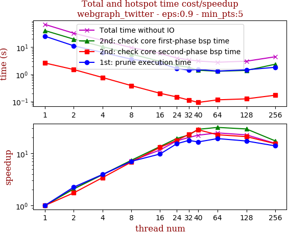

thread_num | prune | check-core 1st bsp | check-core 2nd bsp | cluster-core | cluster-non-core | total | total speedup
--- | --- | --- | --- | --- | --- | --- | ---
1 | 25.443s | 41.145s | 2.634s | 0.098s | 0.055s | 69.377s | 1.000
2 | 11.312s | 19.876s | 1.512s | 0.088s | 0.053s | 32.843s | 2.112
4 | 6.463s | 10.552s | 0.771s | 0.092s | 0.026s | 17.906s | 3.875
8 | 3.63s | 5.597s | 0.388s | 0.089s | 0.022s | 9.729s | 7.131
16 | 2.623s | 3.045s | 0.202s | 0.084s | 0.013s | 5.971s | 11.619
24 | 1.66s | 2.129s | 0.148s | 0.051s | 0.009s | 3.999s | 17.349
32 | 1.438s | 1.834s | 0.114s | 0.042s | 0.012s | 3.443s | 20.150
40 | 1.537s | 1.425s | 0.093s | 0.044s | 0.013s | 3.114s | 22.279
64 | 1.327s | 1.31s | 0.116s | 0.044s | 0.013s | 2.814s | 24.654
128 | 1.476s | 1.403s | 0.126s | 0.044s | 0.017s | 3.069s | 22.606
256 | 1.83s | 2.373s | 0.172s | 0.055s | 0.034s | 4.467s | 15.531

