## eps:0.1

overview | speedup
--- | ---
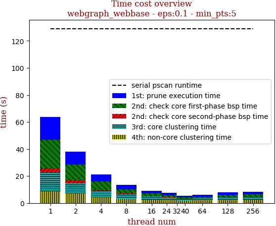 | 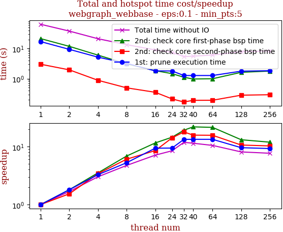

thread_num | prune | check-core 1st bsp | check-core 2nd bsp | cluster-core | cluster-non-core | total | total speedup
--- | --- | --- | --- | --- | --- | --- | ---
1 | 16.956s | 21.298s | 3.007s | 13.695s | 8.76s | 63.719s | 1.000
2 | 9.382s | 11.796s | 1.959s | 7.649s | 7.097s | 37.887s | 1.682
4 | 5.169s | 6.043s | 0.882s | 4.802s | 4.226s | 21.125s | 3.016
8 | 3.22s | 3.102s | 0.496s | 3.451s | 3.196s | 13.468s | 4.731
16 | 1.808s | 1.843s | 0.353s | 2.334s | 2.608s | 8.95s | 7.119
24 | 1.799s | 1.469s | 0.213s | 2.005s | 2.046s | 7.536s | 8.455
32 | 1.275s | 1.112s | 0.168s | 1.36s | 1.463s | 5.381s | 11.841
40 | 1.271s | 0.974s | 0.191s | 1.385s | 1.759s | 5.582s | 11.415
64 | 1.272s | 0.993s | 0.192s | 1.366s | 2.253s | 6.081s | 10.478
128 | 1.772s | 1.624s | 0.283s | 1.955s | 2.242s | 7.879s | 8.087
256 | 1.834s | 1.788s | 0.293s | 2.03s | 2.357s | 8.304s | 7.673

## eps:0.2

overview | speedup
--- | ---
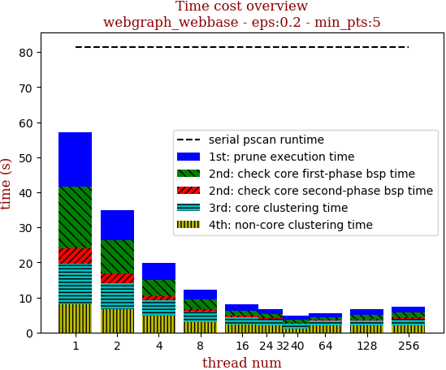 | 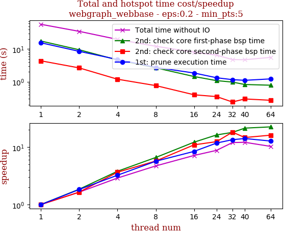

thread_num | prune | check-core 1st bsp | check-core 2nd bsp | cluster-core | cluster-non-core | total | total speedup
--- | --- | --- | --- | --- | --- | --- | ---
1 | 15.602s | 17.622s | 4.383s | 11.485s | 8.072s | 57.168s | 1.000
2 | 8.535s | 9.534s | 2.665s | 7.347s | 6.728s | 34.812s | 1.642
4 | 4.822s | 4.648s | 1.202s | 4.331s | 4.77s | 19.777s | 2.891
8 | 2.754s | 2.677s | 0.767s | 2.935s | 3.037s | 12.175s | 4.696
16 | 1.859s | 1.452s | 0.402s | 2.123s | 2.178s | 8.017s | 7.131
24 | 1.333s | 1.088s | 0.354s | 1.739s | 2.026s | 6.544s | 8.736
32 | 1.165s | 0.983s | 0.242s | 1.276s | 1.116s | 4.786s | 11.945
40 | 1.112s | 0.829s | 0.3s | 1.33s | 1.165s | 4.739s | 12.063
64 | 1.23s | 0.788s | 0.273s | 1.23s | 2.062s | 5.586s | 10.234
128 | 1.564s | 1.294s | 0.348s | 1.508s | 1.937s | 6.653s | 8.593
256 | 1.675s | 1.534s | 0.414s | 1.771s | 2.054s | 7.453s | 7.670

## eps:0.3

overview | speedup
--- | ---
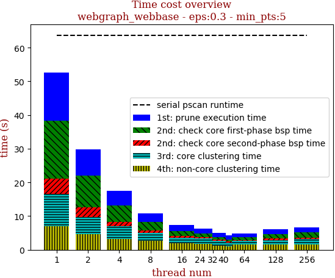 | 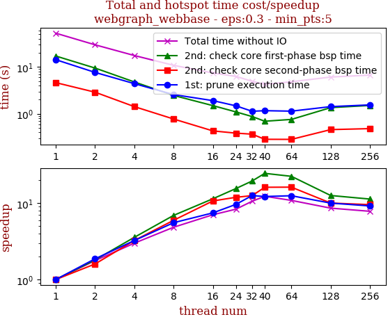

thread_num | prune | check-core 1st bsp | check-core 2nd bsp | cluster-core | cluster-non-core | total | total speedup
--- | --- | --- | --- | --- | --- | --- | ---
1 | 14.307s | 17.131s | 4.627s | 9.578s | 7.009s | 52.655s | 1.000
2 | 7.651s | 9.477s | 2.891s | 5.134s | 4.594s | 29.749s | 1.770
4 | 4.407s | 4.788s | 1.423s | 3.677s | 3.261s | 17.56s | 2.999
8 | 2.57s | 2.467s | 0.773s | 2.402s | 2.636s | 10.852s | 4.852
16 | 1.911s | 1.494s | 0.431s | 1.681s | 1.922s | 7.441s | 7.076
24 | 1.48s | 1.098s | 0.386s | 1.608s | 1.716s | 6.291s | 8.370
32 | 1.132s | 0.873s | 0.367s | 1.338s | 1.236s | 4.949s | 10.640
40 | 1.165s | 0.693s | 0.285s | 1.065s | 1.045s | 4.257s | 12.369
64 | 1.138s | 0.758s | 0.284s | 1.056s | 1.584s | 4.823s | 10.917
128 | 1.422s | 1.353s | 0.459s | 1.318s | 1.539s | 6.093s | 8.642
256 | 1.549s | 1.507s | 0.482s | 1.529s | 1.635s | 6.704s | 7.854

## eps:0.4

overview | speedup
--- | ---
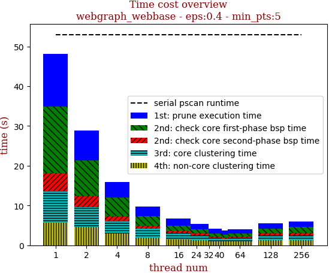 | 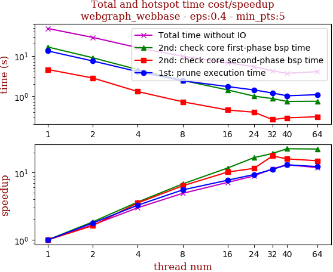

thread_num | prune | check-core 1st bsp | check-core 2nd bsp | cluster-core | cluster-non-core | total | total speedup
--- | --- | --- | --- | --- | --- | --- | ---
1 | 13.248s | 16.607s | 4.568s | 7.993s | 5.641s | 48.06s | 1.000
2 | 7.444s | 8.954s | 2.805s | 5.006s | 4.574s | 28.786s | 1.670
4 | 4.042s | 4.543s | 1.289s | 3.179s | 2.933s | 15.989s | 3.006
8 | 2.392s | 2.445s | 0.717s | 2.246s | 1.961s | 9.764s | 4.922
16 | 1.716s | 1.416s | 0.447s | 1.637s | 1.491s | 6.709s | 7.164
24 | 1.415s | 0.994s | 0.395s | 1.281s | 1.299s | 5.388s | 8.920
32 | 1.185s | 0.859s | 0.258s | 0.826s | 1.078s | 4.208s | 11.421
40 | 1.011s | 0.732s | 0.285s | 0.7s | 0.944s | 3.673s | 13.085
64 | 1.077s | 0.739s | 0.304s | 0.879s | 1.04s | 4.041s | 11.893
128 | 1.375s | 1.279s | 0.448s | 1.254s | 1.242s | 5.602s | 8.579
256 | 1.463s | 1.493s | 0.513s | 1.33s | 1.239s | 6.041s | 7.956

## eps:0.5

overview | speedup
--- | ---
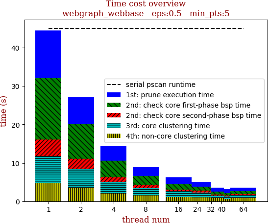 | 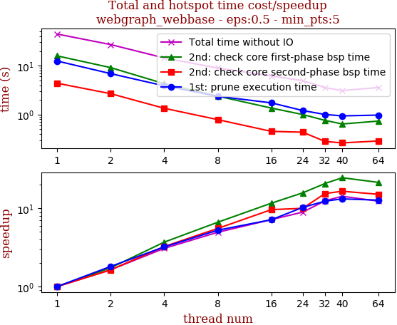

thread_num | prune | check-core 1st bsp | check-core 2nd bsp | cluster-core | cluster-non-core | total | total speedup
--- | --- | --- | --- | --- | --- | --- | ---
1 | 12.489s | 15.912s | 4.387s | 7.05s | 4.646s | 44.487s | 1.000
2 | 6.897s | 9.148s | 2.682s | 4.946s | 3.419s | 27.095s | 1.642
4 | 3.876s | 4.291s | 1.347s | 2.85s | 2.052s | 14.418s | 3.086
8 | 2.37s | 2.388s | 0.79s | 1.937s | 1.48s | 8.968s | 4.961
16 | 1.74s | 1.361s | 0.454s | 1.466s | 1.159s | 6.182s | 7.196
24 | 1.212s | 1.004s | 0.437s | 1.252s | 1.048s | 4.956s | 8.976
32 | 1.007s | 0.763s | 0.283s | 0.591s | 0.91s | 3.558s | 12.503
40 | 0.942s | 0.643s | 0.264s | 0.634s | 0.619s | 3.106s | 14.323
64 | 0.977s | 0.738s | 0.289s | 0.732s | 0.845s | 3.584s | 12.413
128 | 1.254s | 1.256s | 0.423s | 1.14s | 0.973s | 5.05s | 8.809
256 | 1.438s | 1.454s | 0.47s | 1.168s | 1.006s | 5.539s | 8.032

## eps:0.6

overview | speedup
--- | ---
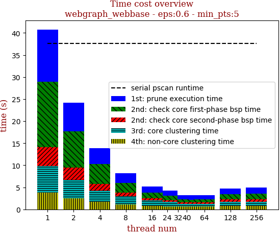 | 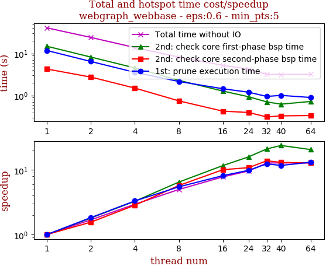

thread_num | prune | check-core 1st bsp | check-core 2nd bsp | cluster-core | cluster-non-core | total | total speedup
--- | --- | --- | --- | --- | --- | --- | ---
1 | 11.808s | 14.875s | 4.28s | 6.007s | 3.804s | 40.777s | 1.000
2 | 6.462s | 8.236s | 2.753s | 4.186s | 2.507s | 24.147s | 1.689
4 | 3.572s | 4.546s | 1.507s | 2.596s | 1.651s | 13.874s | 2.939
8 | 2.163s | 2.3s | 0.748s | 1.846s | 1.151s | 8.21s | 4.967
16 | 1.453s | 1.279s | 0.426s | 1.254s | 0.826s | 5.242s | 7.779
24 | 1.202s | 0.938s | 0.396s | 1.021s | 0.689s | 4.249s | 9.597
32 | 0.954s | 0.706s | 0.31s | 0.605s | 0.624s | 3.202s | 12.735
40 | 1.01s | 0.625s | 0.329s | 0.606s | 0.611s | 3.184s | 12.807
64 | 0.9s | 0.724s | 0.335s | 0.593s | 0.643s | 3.198s | 12.751
128 | 1.255s | 1.226s | 0.51s | 0.966s | 0.754s | 4.714s | 8.650
256 | 1.319s | 1.36s | 0.487s | 1.012s | 0.745s | 4.926s | 8.278

## eps:0.7

overview | speedup
--- | ---
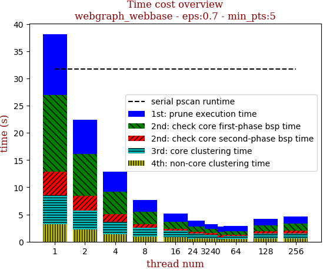 | 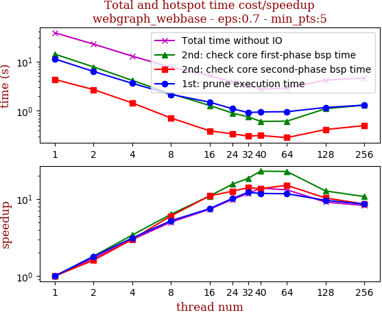

thread_num | prune | check-core 1st bsp | check-core 2nd bsp | cluster-core | cluster-non-core | total | total speedup
--- | --- | --- | --- | --- | --- | --- | ---
1 | 11.234s | 14.056s | 4.32s | 5.308s | 3.221s | 38.142s | 1.000
2 | 6.275s | 7.758s | 2.69s | 3.508s | 2.21s | 22.444s | 1.699
4 | 3.609s | 4.135s | 1.447s | 2.258s | 1.368s | 12.82s | 2.975
8 | 2.155s | 2.222s | 0.717s | 1.542s | 0.987s | 7.627s | 5.001
16 | 1.501s | 1.286s | 0.394s | 1.184s | 0.821s | 5.19s | 7.349
24 | 1.109s | 0.906s | 0.343s | 0.955s | 0.55s | 3.866s | 9.866
32 | 0.922s | 0.756s | 0.308s | 0.651s | 0.593s | 3.233s | 11.798
40 | 0.951s | 0.612s | 0.317s | 0.488s | 0.387s | 2.759s | 13.825
64 | 0.961s | 0.618s | 0.287s | 0.534s | 0.497s | 2.899s | 13.157
128 | 1.17s | 1.105s | 0.419s | 0.878s | 0.617s | 4.192s | 9.099
256 | 1.306s | 1.307s | 0.502s | 0.936s | 0.573s | 4.627s | 8.243

## eps:0.8

overview | speedup
--- | ---
 | 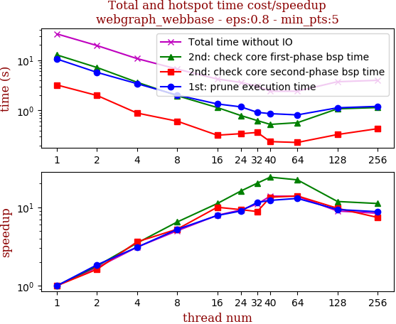

thread_num | prune | check-core 1st bsp | check-core 2nd bsp | cluster-core | cluster-non-core | total | total speedup
--- | --- | --- | --- | --- | --- | --- | ---
1 | 10.533s | 12.7s | 3.208s | 4.177s | 2.599s | 33.221s | 1.000
2 | 5.712s | 7.139s | 1.985s | 2.802s | 1.857s | 19.498s | 1.704
4 | 3.409s | 3.635s | 0.887s | 1.846s | 0.949s | 10.73s | 3.096
8 | 2.022s | 1.964s | 0.612s | 1.287s | 0.761s | 6.648s | 4.997
16 | 1.347s | 1.143s | 0.322s | 0.878s | 0.525s | 4.219s | 7.874
24 | 1.18s | 0.794s | 0.345s | 0.813s | 0.478s | 3.613s | 9.195
32 | 0.918s | 0.629s | 0.365s | 0.683s | 0.434s | 3.033s | 10.953
40 | 0.864s | 0.528s | 0.24s | 0.444s | 0.328s | 2.407s | 13.802
64 | 0.816s | 0.571s | 0.231s | 0.429s | 0.365s | 2.416s | 13.750
128 | 1.13s | 1.077s | 0.332s | 0.758s | 0.426s | 3.726s | 8.916
256 | 1.205s | 1.142s | 0.434s | 0.774s | 0.415s | 3.972s | 8.364

## eps:0.9

overview | speedup
--- | ---
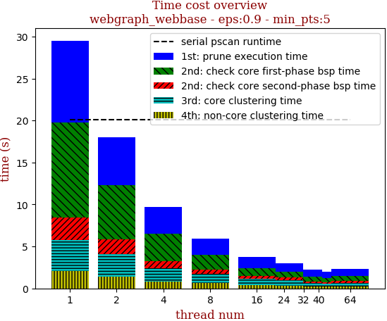 | 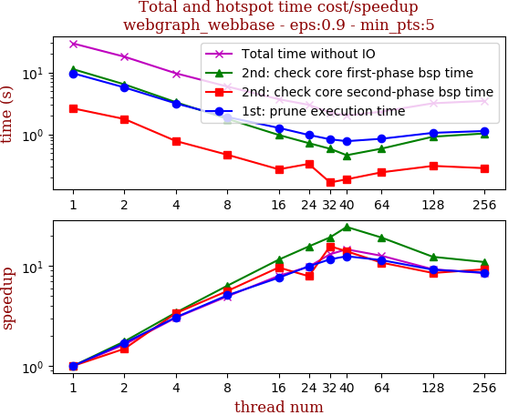

thread_num | prune | check-core 1st bsp | check-core 2nd bsp | cluster-core | cluster-non-core | total | total speedup
--- | --- | --- | --- | --- | --- | --- | ---
1 | 9.735s | 11.342s | 2.641s | 3.739s | 2.056s | 29.515s | 1.000
2 | 5.746s | 6.446s | 1.777s | 2.642s | 1.415s | 18.028s | 1.637
4 | 3.175s | 3.322s | 0.784s | 1.643s | 0.8s | 9.728s | 3.034
8 | 1.916s | 1.791s | 0.471s | 1.12s | 0.652s | 5.953s | 4.958
16 | 1.279s | 0.983s | 0.274s | 0.756s | 0.417s | 3.712s | 7.951
24 | 0.983s | 0.725s | 0.335s | 0.648s | 0.317s | 3.011s | 9.802
32 | 0.837s | 0.588s | 0.168s | 0.405s | 0.255s | 2.256s | 13.083
40 | 0.78s | 0.463s | 0.189s | 0.367s | 0.217s | 2.019s | 14.619
64 | 0.853s | 0.591s | 0.245s | 0.385s | 0.263s | 2.339s | 12.619
128 | 1.063s | 0.921s | 0.311s | 0.597s | 0.297s | 3.192s | 9.247
256 | 1.138s | 1.038s | 0.286s | 0.669s | 0.352s | 3.487s | 8.464

