## eps:0.1

overview | speedup
--- | ---
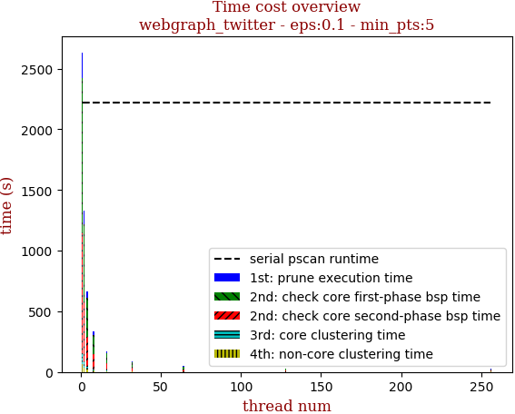 | 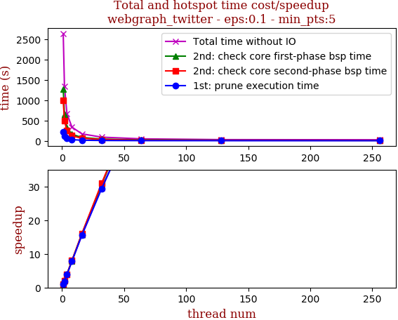

thread_num | prune | check-core 1st bsp | check-core 2nd bsp | cluster-core | cluster-non-core | total | total speedup
--- | --- | --- | --- | --- | --- | --- | ---
1 | 214.85s | 1275.503s | 986.014s | 90.406s | 66.856s | 2633.633s | 1.000
2 | 112.974s | 641.178s | 493.636s | 47.852s | 36.655s | 1332.299s | 1.977
4 | 56.054s | 320.68s | 246.399s | 24.149s | 18.942s | 666.23s | 3.953
8 | 27.62s | 160.661s | 123.447s | 12.199s | 11.799s | 335.733s | 7.844
16 | 13.802s | 80.598s | 61.695s | 6.292s | 7.868s | 170.261s | 15.468
32 | 7.311s | 41.606s | 31.813s | 3.627s | 4.561s | 88.924s | 29.617
64 | 3.875s | 21.711s | 16.67s | 2.356s | 3.23s | 47.848s | 55.042
128 | 2.784s | 12.406s | 9.576s | 1.856s | 2.207s | 28.833s | 91.341
256 | 2.05s | 9.645s | 7.72s | 2.011s | 3.425s | 24.854s | 105.964

## eps:0.2

overview | speedup
--- | ---
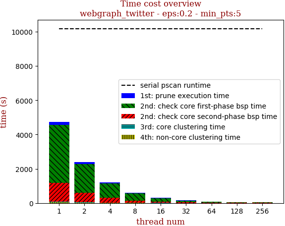 | 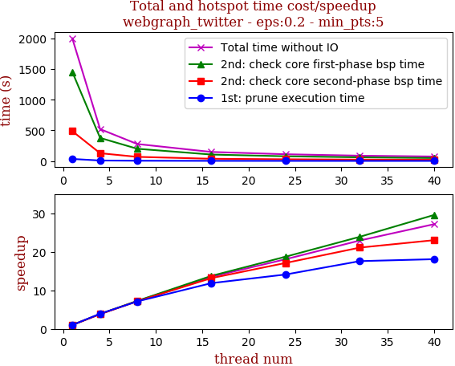

thread_num | prune | check-core 1st bsp | check-core 2nd bsp | cluster-core | cluster-non-core | total | total speedup
--- | --- | --- | --- | --- | --- | --- | ---
1 | 192.546s | 3360.94s | 1112.348s | 30.513s | 48.286s | 4744.637s | 1.000
2 | 100.95s | 1685.515s | 556.451s | 15.933s | 25.228s | 2384.081s | 1.990
4 | 50.262s | 845.22s | 278.74s | 8.179s | 12.853s | 1195.259s | 3.970
8 | 24.662s | 422.386s | 138.841s | 4.293s | 7.032s | 597.217s | 7.945
16 | 12.502s | 210.878s | 70.031s | 2.681s | 4.454s | 300.551s | 15.786
32 | 6.302s | 109.889s | 35.333s | 1.543s | 2.97s | 156.041s | 30.406
64 | 3.595s | 55.817s | 18.649s | 1.132s | 2.068s | 81.264s | 58.385
128 | 2.556s | 31.42s | 11.177s | 1.01s | 1.294s | 47.46s | 99.971
256 | 1.938s | 25.298s | 8.784s | 1.272s | 1.793s | 39.089s | 121.380

## eps:0.3

overview | speedup
--- | ---
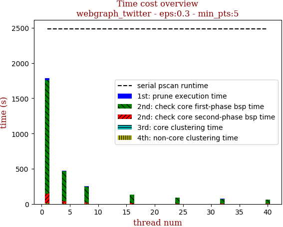 | 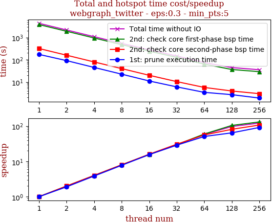

thread_num | prune | check-core 1st bsp | check-core 2nd bsp | cluster-core | cluster-non-core | total | total speedup
--- | --- | --- | --- | --- | --- | --- | ---
1 | 173.296s | 3807.022s | 318.899s | 10.935s | 25.5s | 4335.654s | 1.000
2 | 91.283s | 1907.208s | 159.441s | 5.694s | 13.063s | 2176.692s | 1.992
4 | 45.031s | 953.826s | 79.64s | 3.082s | 6.604s | 1088.186s | 3.984
8 | 22.395s | 476.741s | 39.894s | 1.782s | 3.514s | 544.329s | 7.965
16 | 11.092s | 243.606s | 19.943s | 1.041s | 2.067s | 277.752s | 15.610
32 | 6.018s | 127.896s | 10.393s | 0.792s | 1.519s | 146.622s | 29.570
64 | 3.41s | 63.739s | 5.684s | 0.726s | 1.087s | 74.648s | 58.081
128 | 2.688s | 36.374s | 3.926s | 0.603s | 0.837s | 44.431s | 97.582
256 | 1.892s | 28.993s | 2.976s | 0.798s | 0.872s | 35.534s | 122.014

## eps:0.4

overview | speedup
--- | ---
 | 

thread_num | prune | check-core 1st bsp | check-core 2nd bsp | cluster-core | cluster-non-core | total | total speedup
--- | --- | --- | --- | --- | --- | --- | ---
1 | 159.179s | 2855.694s | 69.536s | 7.367s | 12.024s | 3103.804s | 1.000
2 | 82.771s | 1430.811s | 34.476s | 3.824s | 6.078s | 1557.964s | 1.992
4 | 42.351s | 716.656s | 17.155s | 2.097s | 3.217s | 781.48s | 3.972
8 | 20.906s | 357.851s | 8.61s | 1.142s | 1.659s | 390.171s | 7.955
16 | 10.068s | 180.909s | 4.618s | 0.872s | 1.0s | 197.469s | 15.718
32 | 5.243s | 92.39s | 2.653s | 0.821s | 0.691s | 101.801s | 30.489
64 | 3.115s | 48.027s | 1.782s | 0.688s | 0.533s | 54.148s | 57.321
128 | 2.219s | 27.147s | 1.47s | 0.758s | 0.645s | 32.242s | 96.266
256 | 1.81s | 22.103s | 1.318s | 0.889s | 0.723s | 26.846s | 115.615

## eps:0.5

overview | speedup
--- | ---
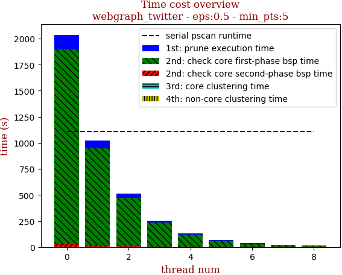 | 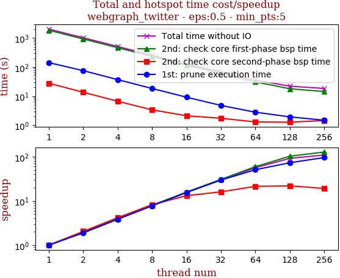

thread_num | prune | check-core 1st bsp | check-core 2nd bsp | cluster-core | cluster-non-core | total | total speedup
--- | --- | --- | --- | --- | --- | --- | ---
1 | 143.099s | 1859.217s | 27.976s | 1.89s | 4.363s | 2036.549s | 1.000
2 | 75.615s | 932.327s | 13.646s | 1.06s | 2.214s | 1024.866s | 1.987
4 | 37.198s | 466.663s | 6.694s | 0.702s | 1.138s | 512.398s | 3.975
8 | 18.44s | 232.784s | 3.389s | 0.453s | 0.648s | 255.717s | 7.964
16 | 9.239s | 116.953s | 2.126s | 0.333s | 0.453s | 129.107s | 15.774
32 | 4.814s | 60.368s | 1.741s | 0.331s | 0.388s | 67.644s | 30.107
64 | 2.811s | 31.179s | 1.305s | 0.351s | 0.405s | 36.053s | 56.488
128 | 1.951s | 18.08s | 1.272s | 0.377s | 0.419s | 22.102s | 92.143
256 | 1.49s | 14.498s | 1.458s | 0.486s | 0.579s | 18.514s | 110.000

## eps:0.6

overview | speedup
--- | ---
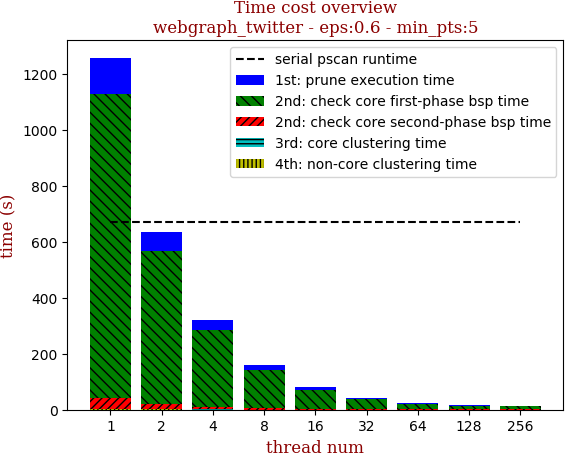 | 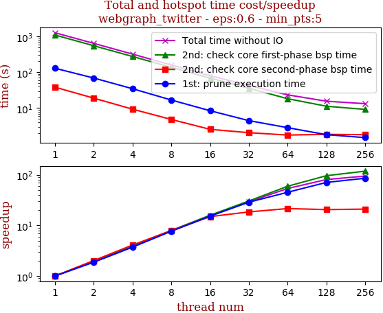

thread_num | prune | check-core 1st bsp | check-core 2nd bsp | cluster-core | cluster-non-core | total | total speedup
--- | --- | --- | --- | --- | --- | --- | ---
1 | 128.983s | 1088.589s | 38.222s | 1.131s | 1.953s | 1258.881s | 1.000
2 | 68.783s | 547.482s | 18.897s | 0.672s | 0.986s | 636.824s | 1.977
4 | 34.614s | 274.391s | 9.323s | 0.444s | 0.519s | 319.295s | 3.943
8 | 16.769s | 136.788s | 4.817s | 0.349s | 0.347s | 159.073s | 7.914
16 | 8.442s | 68.437s | 2.555s | 0.287s | 0.214s | 79.938s | 15.748
32 | 4.471s | 35.696s | 2.063s | 0.294s | 0.201s | 42.729s | 29.462
64 | 2.845s | 18.268s | 1.77s | 0.291s | 0.226s | 23.403s | 53.791
128 | 1.816s | 11.285s | 1.856s | 0.342s | 0.262s | 15.564s | 80.884
256 | 1.502s | 9.182s | 1.815s | 0.409s | 0.366s | 13.277s | 94.817

## eps:0.7

overview | speedup
--- | ---
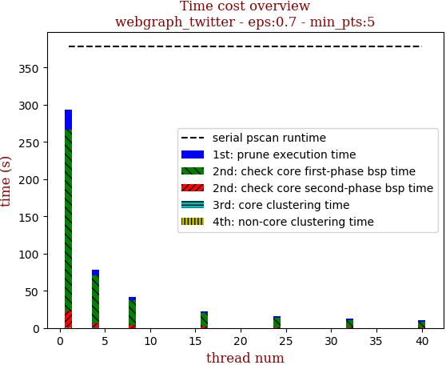 | 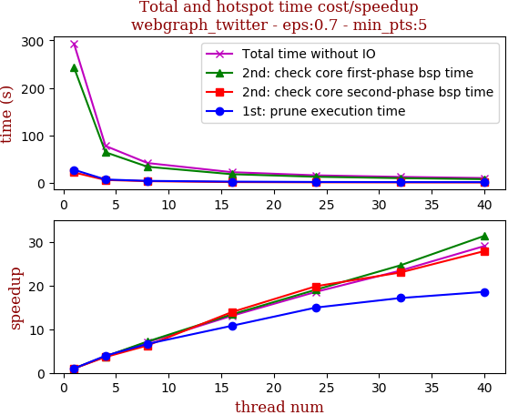

thread_num | prune | check-core 1st bsp | check-core 2nd bsp | cluster-core | cluster-non-core | total | total speedup
--- | --- | --- | --- | --- | --- | --- | ---
1 | 116.19s | 584.362s | 56.273s | 0.724s | 1.27s | 758.822s | 1.000
2 | 61.964s | 293.062s | 28.064s | 0.462s | 0.639s | 384.194s | 1.975
4 | 31.548s | 148.172s | 14.091s | 0.35s | 0.358s | 194.523s | 3.901
8 | 15.226s | 73.89s | 7.15s | 0.277s | 0.216s | 96.763s | 7.842
16 | 7.742s | 37.073s | 3.777s | 0.266s | 0.141s | 49.002s | 15.486
32 | 4.076s | 18.9s | 2.527s | 0.252s | 0.128s | 25.886s | 29.314
64 | 2.449s | 9.887s | 1.821s | 0.264s | 0.159s | 14.584s | 52.031
128 | 1.74s | 6.251s | 1.778s | 0.284s | 0.213s | 10.268s | 73.902
256 | 1.605s | 5.117s | 1.669s | 0.32s | 0.285s | 9.0s | 84.314

## eps:0.8

overview | speedup
--- | ---
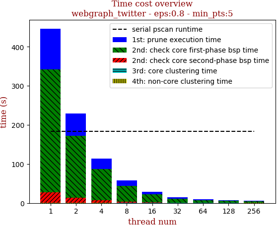 | 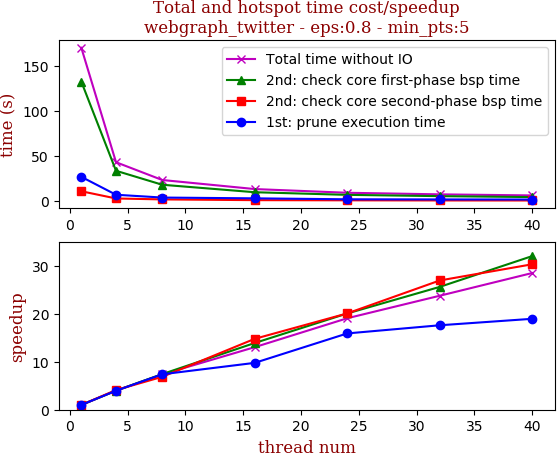

thread_num | prune | check-core 1st bsp | check-core 2nd bsp | cluster-core | cluster-non-core | total | total speedup
--- | --- | --- | --- | --- | --- | --- | ---
1 | 104.855s | 314.591s | 25.538s | 0.354s | 1.029s | 446.37s | 1.000
2 | 55.874s | 159.203s | 12.68s | 0.276s | 0.517s | 228.554s | 1.953
4 | 27.781s | 79.776s | 6.286s | 0.242s | 0.291s | 114.378s | 3.903
8 | 13.779s | 39.775s | 3.615s | 0.233s | 0.221s | 57.627s | 7.746
16 | 6.919s | 19.716s | 1.94s | 0.228s | 0.132s | 28.938s | 15.425
32 | 3.821s | 10.121s | 1.127s | 0.23s | 0.126s | 15.429s | 28.931
64 | 2.508s | 5.661s | 0.947s | 0.241s | 0.158s | 9.518s | 46.897
128 | 1.789s | 4.248s | 0.815s | 0.244s | 0.186s | 7.284s | 61.281
256 | 1.476s | 3.34s | 0.905s | 0.284s | 0.292s | 6.299s | 70.864

## eps:0.9

overview | speedup
--- | ---
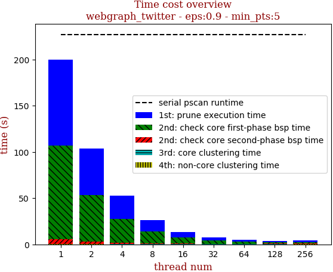 | 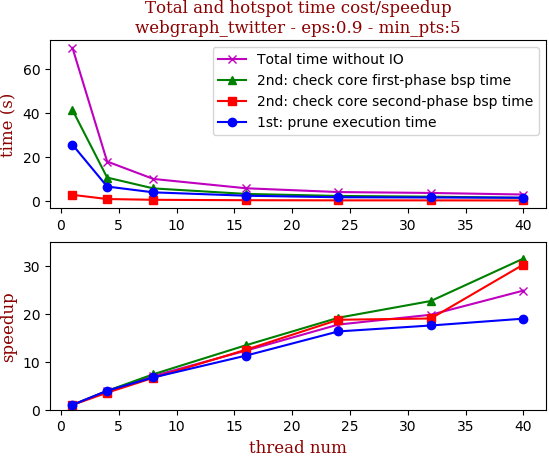

thread_num | prune | check-core 1st bsp | check-core 2nd bsp | cluster-core | cluster-non-core | total | total speedup
--- | --- | --- | --- | --- | --- | --- | ---
1 | 92.954s | 100.744s | 5.241s | 0.276s | 0.379s | 199.597s | 1.000
2 | 49.991s | 50.616s | 2.596s | 0.236s | 0.191s | 103.633s | 1.926
4 | 25.396s | 25.81s | 1.301s | 0.224s | 0.103s | 52.837s | 3.778
8 | 12.249s | 12.87s | 0.904s | 0.225s | 0.076s | 26.327s | 7.581
16 | 6.195s | 6.468s | 0.524s | 0.229s | 0.056s | 13.476s | 14.811
32 | 3.411s | 3.29s | 0.454s | 0.247s | 0.052s | 7.457s | 26.766
64 | 2.077s | 2.069s | 0.393s | 0.26s | 0.082s | 4.883s | 40.876
128 | 1.673s | 1.495s | 0.423s | 0.255s | 0.115s | 3.964s | 50.352
256 | 1.679s | 1.356s | 0.562s | 0.292s | 0.175s | 4.067s | 49.077

