## eps:0.1

overview | speedup
--- | ---
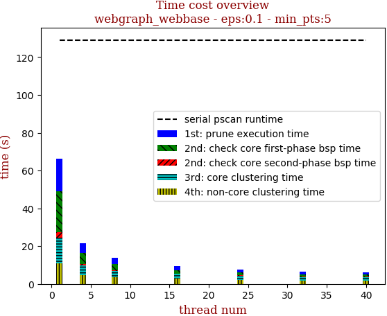 | 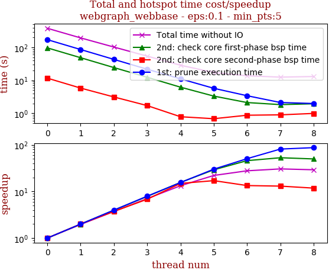

thread_num | prune | check-core 1st bsp | check-core 2nd bsp | cluster-core | cluster-non-core | total | total speedup
--- | --- | --- | --- | --- | --- | --- | ---
1 | 172.853s | 97.179s | 11.663s | 65.389s | 36.12s | 383.21s | 1.000
2 | 86.58s | 48.798s | 5.817s | 33.284s | 20.852s | 195.336s | 1.962
4 | 43.344s | 24.455s | 3.122s | 17.347s | 14.549s | 102.823s | 3.727
8 | 21.743s | 12.39s | 1.706s | 9.42s | 9.182s | 54.447s | 7.038
16 | 11.104s | 6.195s | 0.782s | 5.147s | 5.556s | 28.79s | 13.311
32 | 5.723s | 3.319s | 0.681s | 3.305s | 4.285s | 17.315s | 22.132
64 | 3.406s | 2.111s | 0.869s | 2.771s | 4.594s | 13.756s | 27.858
128 | 2.118s | 1.828s | 0.893s | 2.698s | 4.985s | 12.525s | 30.596
256 | 1.975s | 1.94s | 0.986s | 2.882s | 5.288s | 13.074s | 29.311

## eps:0.2

overview | speedup
--- | ---
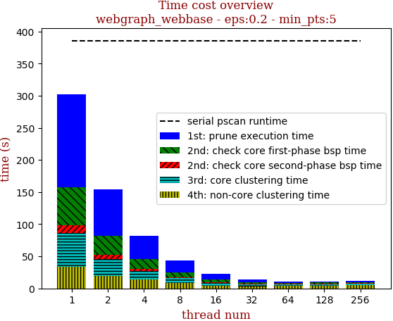 | 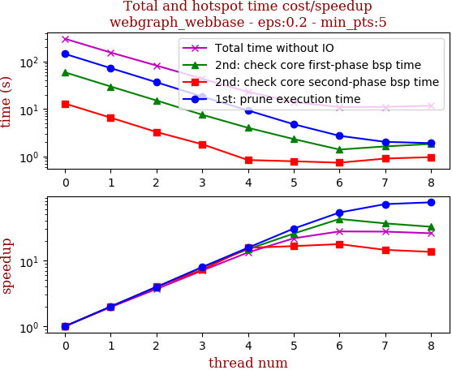

thread_num | prune | check-core 1st bsp | check-core 2nd bsp | cluster-core | cluster-non-core | total | total speedup
--- | --- | --- | --- | --- | --- | --- | ---
1 | 144.648s | 59.076s | 12.953s | 52.464s | 33.391s | 302.536s | 1.000
2 | 72.495s | 29.649s | 6.519s | 26.785s | 19.235s | 154.689s | 1.956
4 | 36.477s | 15.048s | 3.25s | 13.9s | 13.571s | 82.25s | 3.678
8 | 18.211s | 7.521s | 1.793s | 7.51s | 8.112s | 43.153s | 7.011
16 | 9.267s | 3.99s | 0.833s | 4.226s | 4.557s | 22.879s | 13.223
32 | 4.741s | 2.305s | 0.784s | 2.858s | 3.245s | 13.938s | 21.706
64 | 2.703s | 1.385s | 0.732s | 2.276s | 3.857s | 10.957s | 27.611
128 | 2.015s | 1.615s | 0.894s | 2.221s | 4.283s | 11.031s | 27.426
256 | 1.893s | 1.817s | 0.959s | 2.356s | 4.649s | 11.677s | 25.909

## eps:0.3

overview | speedup
--- | ---
 | 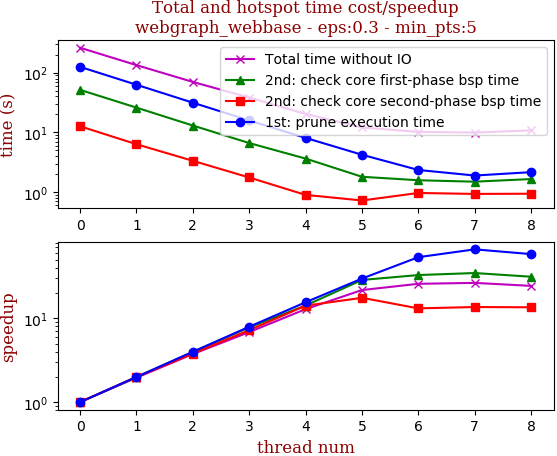

thread_num | prune | check-core 1st bsp | check-core 2nd bsp | cluster-core | cluster-non-core | total | total speedup
--- | --- | --- | --- | --- | --- | --- | ---
1 | 125.507s | 51.629s | 12.653s | 42.734s | 30.185s | 262.713s | 1.000
2 | 62.935s | 26.017s | 6.331s | 21.85s | 17.178s | 134.316s | 1.956
4 | 31.488s | 13.032s | 3.337s | 11.478s | 10.841s | 70.18s | 3.743
8 | 15.84s | 6.626s | 1.752s | 6.179s | 7.992s | 38.395s | 6.842
16 | 8.081s | 3.638s | 0.895s | 3.574s | 4.251s | 20.445s | 12.850
32 | 4.219s | 1.802s | 0.721s | 2.552s | 2.799s | 12.097s | 21.717
64 | 2.343s | 1.575s | 0.964s | 2.164s | 3.144s | 10.194s | 25.771
128 | 1.89s | 1.49s | 0.929s | 2.077s | 3.547s | 9.936s | 26.441
256 | 2.153s | 1.649s | 0.936s | 2.259s | 3.79s | 10.791s | 24.346

## eps:0.4

overview | speedup
--- | ---
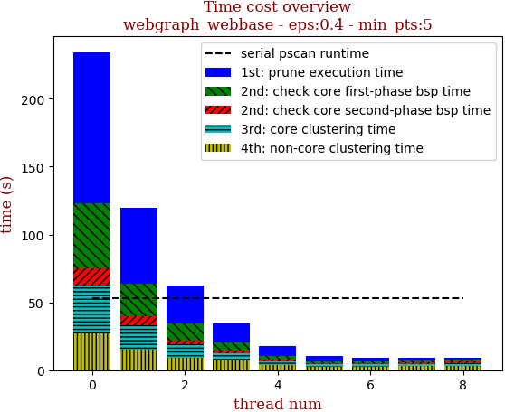 | 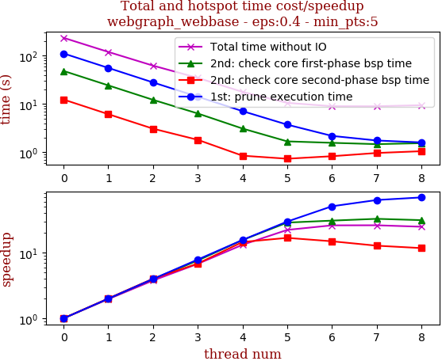

thread_num | prune | check-core 1st bsp | check-core 2nd bsp | cluster-core | cluster-non-core | total | total speedup
--- | --- | --- | --- | --- | --- | --- | ---
1 | 111.107s | 48.247s | 12.333s | 35.856s | 26.809s | 234.356s | 1.000
2 | 55.739s | 24.228s | 6.139s | 18.384s | 15.023s | 119.517s | 1.961
4 | 27.909s | 12.167s | 3.072s | 9.635s | 9.368s | 62.155s | 3.771
8 | 14.117s | 6.343s | 1.806s | 5.289s | 7.091s | 34.651s | 6.763
16 | 7.103s | 3.093s | 0.847s | 3.159s | 3.553s | 17.759s | 13.196
32 | 3.725s | 1.677s | 0.733s | 2.195s | 2.194s | 10.527s | 22.262
64 | 2.178s | 1.565s | 0.826s | 1.778s | 2.625s | 8.975s | 26.112
128 | 1.749s | 1.469s | 0.964s | 1.862s | 2.902s | 8.949s | 26.188
256 | 1.596s | 1.539s | 1.049s | 2.023s | 3.21s | 9.419s | 24.881

## eps:0.5

overview | speedup
--- | ---
 | 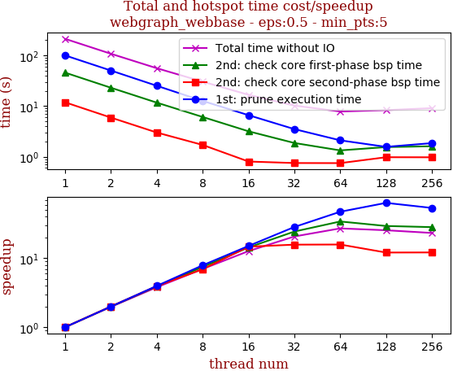

thread_num | prune | check-core 1st bsp | check-core 2nd bsp | cluster-core | cluster-non-core | total | total speedup
--- | --- | --- | --- | --- | --- | --- | ---
1 | 99.869s | 45.654s | 11.858s | 30.795s | 23.8s | 211.981s | 1.000
2 | 50.165s | 22.965s | 5.922s | 15.856s | 12.647s | 107.559s | 1.971
4 | 25.128s | 11.681s | 3.004s | 8.329s | 7.664s | 55.81s | 3.798
8 | 12.624s | 6.094s | 1.71s | 4.612s | 5.271s | 30.315s | 6.993
16 | 6.615s | 3.179s | 0.805s | 3.012s | 3.07s | 16.686s | 12.704
32 | 3.51s | 1.869s | 0.752s | 2.056s | 2.038s | 10.23s | 20.722
64 | 2.109s | 1.335s | 0.749s | 1.649s | 1.966s | 7.811s | 27.139
128 | 1.568s | 1.552s | 0.979s | 1.774s | 2.432s | 8.308s | 25.515
256 | 1.857s | 1.612s | 0.976s | 2.11s | 2.538s | 9.096s | 23.305

## eps:0.6

overview | speedup
--- | ---
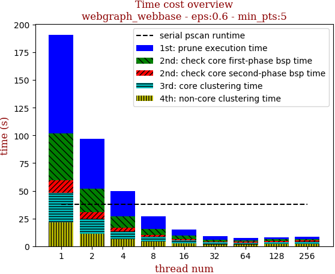 | 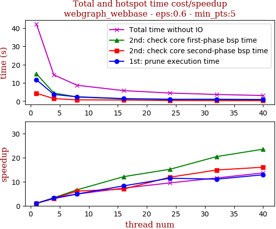

thread_num | prune | check-core 1st bsp | check-core 2nd bsp | cluster-core | cluster-non-core | total | total speedup
--- | --- | --- | --- | --- | --- | --- | ---
1 | 88.933s | 42.25s | 11.778s | 26.622s | 21.312s | 190.899s | 1.000
2 | 44.728s | 21.297s | 5.891s | 13.732s | 11.227s | 96.88s | 1.970
4 | 22.383s | 10.755s | 2.977s | 7.248s | 6.228s | 49.594s | 3.849
8 | 11.464s | 5.465s | 1.663s | 4.238s | 4.034s | 26.867s | 7.105
16 | 5.799s | 2.87s | 1.058s | 2.635s | 2.801s | 15.168s | 12.586
32 | 3.121s | 1.444s | 0.768s | 1.791s | 1.702s | 8.831s | 21.617
64 | 1.887s | 1.324s | 0.921s | 1.542s | 1.616s | 7.293s | 26.176
128 | 1.579s | 1.351s | 0.975s | 1.732s | 2.133s | 7.774s | 24.556
256 | 1.699s | 1.585s | 1.068s | 1.806s | 2.163s | 8.323s | 22.936

## eps:0.7

overview | speedup
--- | ---
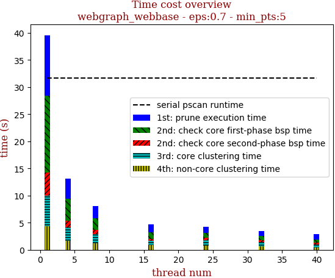 | 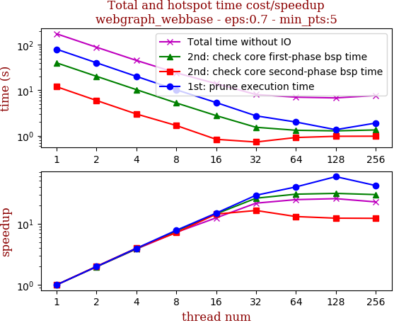

thread_num | prune | check-core 1st bsp | check-core 2nd bsp | cluster-core | cluster-non-core | total | total speedup
--- | --- | --- | --- | --- | --- | --- | ---
1 | 79.858s | 40.029s | 11.942s | 22.993s | 19.51s | 174.336s | 1.000
2 | 40.176s | 20.243s | 5.952s | 11.864s | 10.107s | 88.346s | 1.973
4 | 20.171s | 10.306s | 3.001s | 6.349s | 5.492s | 45.324s | 3.846
8 | 10.234s | 5.253s | 1.675s | 3.544s | 3.451s | 24.162s | 7.215
16 | 5.36s | 2.768s | 0.832s | 2.462s | 2.556s | 13.982s | 12.469
32 | 2.733s | 1.531s | 0.726s | 1.665s | 1.38s | 8.038s | 21.689
64 | 1.999s | 1.316s | 0.912s | 1.388s | 1.424s | 7.043s | 24.753
128 | 1.356s | 1.277s | 0.97s | 1.454s | 1.724s | 6.784s | 25.698
256 | 1.896s | 1.337s | 0.975s | 1.621s | 1.839s | 7.671s | 22.727

## eps:0.8

overview | speedup
--- | ---
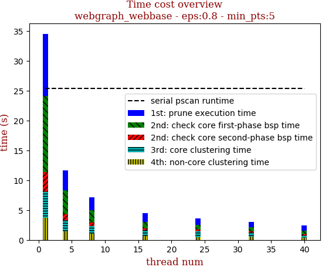 | 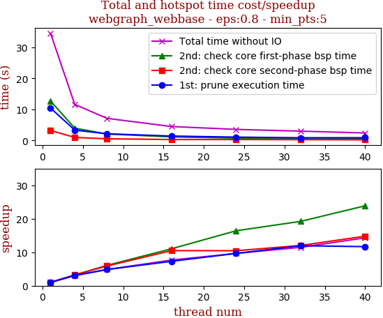

thread_num | prune | check-core 1st bsp | check-core 2nd bsp | cluster-core | cluster-non-core | total | total speedup
--- | --- | --- | --- | --- | --- | --- | ---
1 | 69.424s | 36.024s | 9.011s | 19.306s | 17.542s | 151.311s | 1.000
2 | 34.97s | 18.214s | 4.484s | 10.015s | 8.936s | 76.622s | 1.975
4 | 17.617s | 9.309s | 2.387s | 5.382s | 4.753s | 39.453s | 3.835
8 | 8.938s | 4.831s | 1.37s | 3.425s | 2.832s | 21.4s | 7.071
16 | 4.593s | 2.511s | 0.683s | 1.914s | 2.076s | 11.78s | 12.845
32 | 2.471s | 1.713s | 0.674s | 1.583s | 1.325s | 7.77s | 19.474
64 | 1.667s | 1.086s | 0.764s | 1.355s | 1.089s | 5.964s | 25.371
128 | 1.334s | 1.33s | 0.929s | 1.302s | 1.351s | 6.249s | 24.214
256 | 1.692s | 1.28s | 1.005s | 1.507s | 1.634s | 7.121s | 21.249

## eps:0.9

overview | speedup
--- | ---
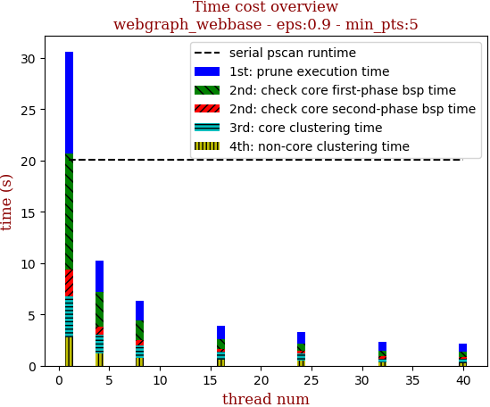 | 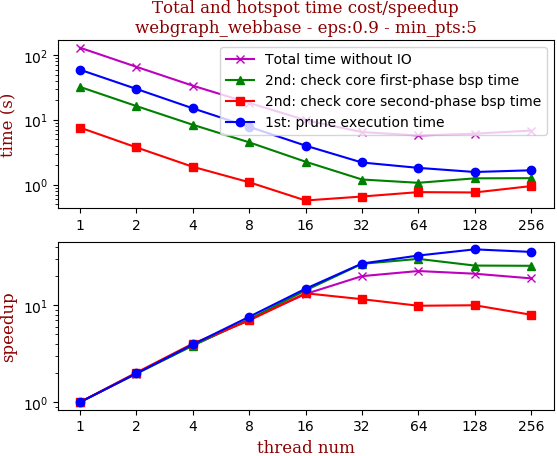

thread_num | prune | check-core 1st bsp | check-core 2nd bsp | cluster-core | cluster-non-core | total | total speedup
--- | --- | --- | --- | --- | --- | --- | ---
1 | 59.443s | 32.263s | 7.589s | 15.59s | 15.154s | 130.042s | 1.000
2 | 30.02s | 16.32s | 3.756s | 8.163s | 7.659s | 65.921s | 1.973
4 | 15.073s | 8.4s | 1.885s | 4.446s | 3.927s | 33.734s | 3.855
8 | 7.8s | 4.498s | 1.088s | 2.603s | 2.26s | 18.252s | 7.125
16 | 3.999s | 2.258s | 0.569s | 1.722s | 1.366s | 9.918s | 13.112
32 | 2.197s | 1.2s | 0.655s | 1.359s | 1.069s | 6.484s | 20.056
64 | 1.815s | 1.067s | 0.766s | 1.098s | 0.993s | 5.742s | 22.648
128 | 1.567s | 1.251s | 0.757s | 1.297s | 1.247s | 6.122s | 21.242
256 | 1.665s | 1.258s | 0.949s | 1.464s | 1.499s | 6.838s | 19.018

