## eps:0.1

overview | speedup
--- | ---
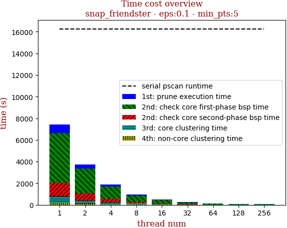 | 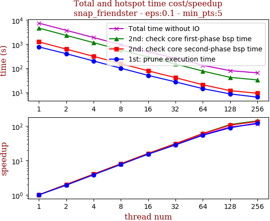

thread_num | prune | check-core 1st bsp | check-core 2nd bsp | cluster-core | cluster-non-core | total | total speedup
--- | --- | --- | --- | --- | --- | --- | ---
1 | 768.127s | 4626.873s | 1246.043s | 599.122s | 191.35s | 7431.525s | 1.000
2 | 401.961s | 2308.649s | 622.991s | 311.275s | 103.892s | 3748.776s | 1.982
4 | 200.741s | 1156.327s | 311.947s | 156.991s | 54.356s | 1880.371s | 3.952
8 | 100.422s | 579.151s | 155.69s | 80.039s | 31.06s | 946.371s | 7.853
16 | 50.494s | 288.892s | 78.215s | 41.091s | 21.398s | 480.094s | 15.479
32 | 27.164s | 150.297s | 40.694s | 23.297s | 17.725s | 259.19s | 28.672
64 | 14.251s | 76.344s | 20.645s | 12.594s | 8.732s | 132.579s | 56.054
128 | 8.625s | 41.822s | 11.757s | 8.9s | 8.307s | 79.413s | 93.581
256 | 6.311s | 32.764s | 9.191s | 6.556s | 9.591s | 64.425s | 115.352

## eps:0.2

overview | speedup
--- | ---
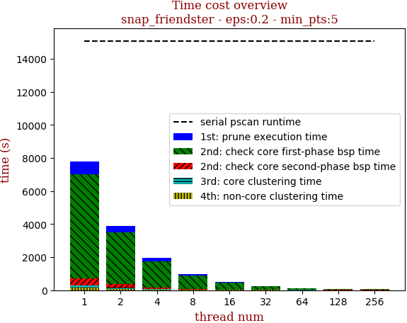 | 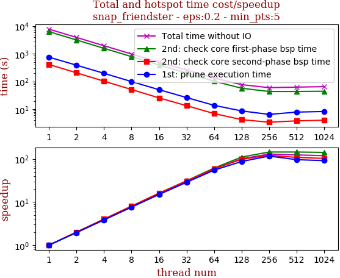

thread_num | prune | check-core 1st bsp | check-core 2nd bsp | cluster-core | cluster-non-core | total | total speedup
--- | --- | --- | --- | --- | --- | --- | ---
1 | 758.882s | 6321.695s | 413.781s | 123.246s | 168.869s | 7786.478s | 1.000
2 | 389.749s | 3158.71s | 207.062s | 64.276s | 86.589s | 3906.391s | 1.993
4 | 197.903s | 1581.68s | 102.933s | 32.951s | 44.265s | 1959.737s | 3.973
8 | 100.023s | 793.03s | 51.686s | 17.114s | 23.745s | 985.603s | 7.900
16 | 50.821s | 397.537s | 25.779s | 8.999s | 14.065s | 497.207s | 15.660
32 | 26.484s | 203.242s | 13.489s | 5.148s | 10.559s | 258.928s | 30.072
64 | 13.878s | 103.321s | 7.01s | 3.634s | 6.297s | 134.146s | 58.045
128 | 8.731s | 57.297s | 4.235s | 2.698s | 4.352s | 77.317s | 100.708
256 | 6.537s | 43.852s | 3.413s | 2.887s | 3.46s | 60.152s | 129.447

## eps:0.3

overview | speedup
--- | ---
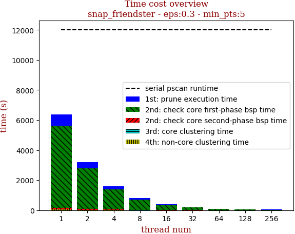 | 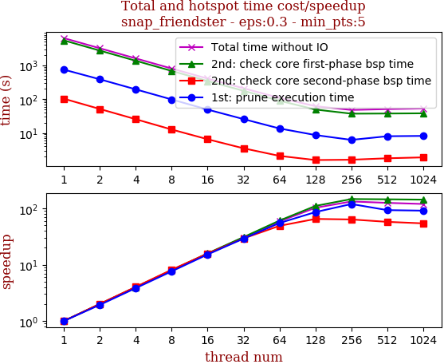

thread_num | prune | check-core 1st bsp | check-core 2nd bsp | cluster-core | cluster-non-core | total | total speedup
--- | --- | --- | --- | --- | --- | --- | ---
1 | 745.449s | 5445.463s | 102.73s | 17.782s | 47.117s | 6358.544s | 1.000
2 | 385.639s | 2718.476s | 51.104s | 9.606s | 23.954s | 3188.783s | 1.994
4 | 194.304s | 1361.22s | 25.451s | 5.13s | 12.153s | 1598.261s | 3.978
8 | 97.735s | 681.478s | 12.627s | 3.001s | 6.569s | 801.413s | 7.934
16 | 49.033s | 342.55s | 6.504s | 1.806s | 3.944s | 403.841s | 15.745
32 | 25.627s | 175.904s | 3.508s | 1.415s | 2.751s | 209.209s | 30.393
64 | 13.542s | 89.485s | 2.094s | 1.361s | 1.768s | 108.253s | 58.738
128 | 8.653s | 49.171s | 1.58s | 1.314s | 1.199s | 61.92s | 102.690
256 | 6.229s | 37.127s | 1.614s | 1.582s | 1.311s | 47.867s | 132.838

## eps:0.4

overview | speedup
--- | ---
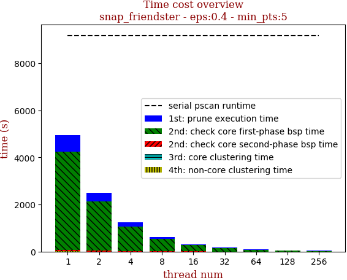 | 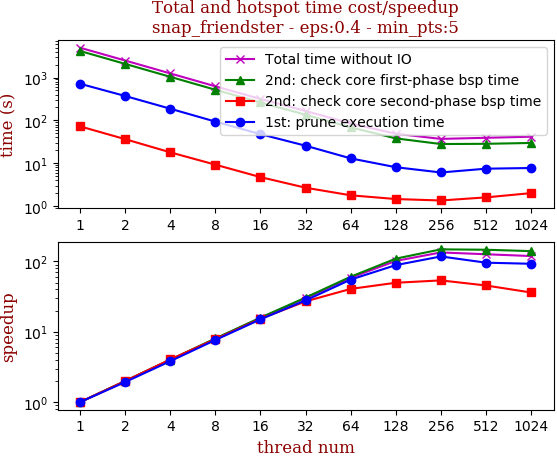

thread_num | prune | check-core 1st bsp | check-core 2nd bsp | cluster-core | cluster-non-core | total | total speedup
--- | --- | --- | --- | --- | --- | --- | ---
1 | 714.618s | 4152.363s | 72.534s | 2.896s | 6.711s | 4949.126s | 1.000
2 | 370.601s | 2078.721s | 36.445s | 1.778s | 3.419s | 2490.967s | 1.987
4 | 187.206s | 1037.361s | 17.97s | 1.213s | 1.774s | 1245.527s | 3.974
8 | 93.657s | 518.309s | 9.266s | 0.961s | 1.092s | 623.288s | 7.940
16 | 47.666s | 262.033s | 4.749s | 0.809s | 0.783s | 316.043s | 15.660
32 | 25.666s | 135.855s | 2.688s | 0.751s | 0.525s | 165.489s | 29.906
64 | 12.993s | 68.751s | 1.789s | 0.807s | 0.411s | 84.754s | 58.394
128 | 8.094s | 38.06s | 1.463s | 0.848s | 0.427s | 48.894s | 101.222
256 | 6.094s | 28.083s | 1.354s | 0.889s | 0.604s | 37.027s | 133.663

## eps:0.5

overview | speedup
--- | ---
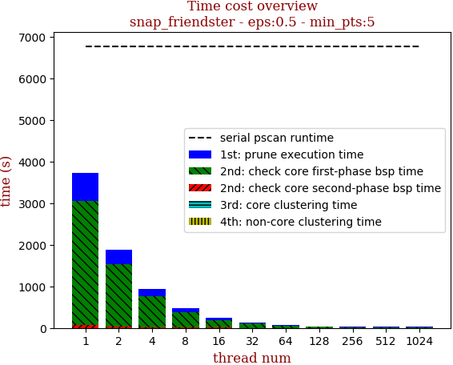 | 

thread_num | prune | check-core 1st bsp | check-core 2nd bsp | cluster-core | cluster-non-core | total | total speedup
--- | --- | --- | --- | --- | --- | --- | ---
1 | 669.527s | 2994.608s | 64.079s | 1.088s | 1.788s | 3731.093s | 1.000
2 | 348.639s | 1500.094s | 32.055s | 0.853s | 0.913s | 1882.557s | 1.982
4 | 174.151s | 746.591s | 15.924s | 0.731s | 0.509s | 937.909s | 3.978
8 | 87.301s | 375.852s | 8.028s | 0.683s | 0.322s | 472.189s | 7.902
16 | 44.886s | 189.63s | 4.115s | 0.655s | 0.198s | 239.487s | 15.580
32 | 23.388s | 97.899s | 2.43s | 0.657s | 0.17s | 124.546s | 29.958
64 | 11.877s | 49.013s | 1.629s | 0.663s | 0.187s | 63.373s | 58.875
128 | 7.966s | 27.141s | 1.365s | 0.682s | 0.207s | 37.365s | 99.855
256 | 5.878s | 19.962s | 1.334s | 0.719s | 0.287s | 28.182s | 132.393

## eps:0.6

overview | speedup
--- | ---
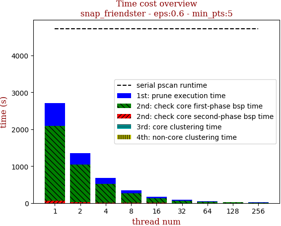 | 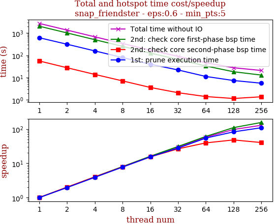

thread_num | prune | check-core 1st bsp | check-core 2nd bsp | cluster-core | cluster-non-core | total | total speedup
--- | --- | --- | --- | --- | --- | --- | ---
1 | 617.048s | 2031.993s | 55.959s | 0.756s | 1.11s | 2706.868s | 1.000
2 | 315.607s | 1014.361s | 27.81s | 0.677s | 0.56s | 1359.018s | 1.992
4 | 158.552s | 506.046s | 13.983s | 0.646s | 0.296s | 679.525s | 3.983
8 | 79.71s | 253.402s | 7.152s | 0.633s | 0.195s | 341.095s | 7.936
16 | 40.077s | 126.691s | 3.64s | 0.626s | 0.128s | 171.165s | 15.814
32 | 22.202s | 65.655s | 2.115s | 0.639s | 0.127s | 90.741s | 29.831
64 | 11.337s | 33.441s | 1.42s | 0.634s | 0.117s | 46.952s | 57.652
128 | 7.456s | 18.474s | 1.164s | 0.654s | 0.157s | 27.908s | 96.993
256 | 5.659s | 13.082s | 1.387s | 0.687s | 0.219s | 21.037s | 128.672

## eps:0.7

overview | speedup
--- | ---
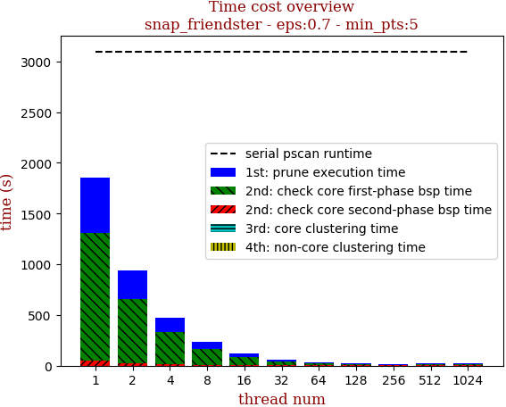 | 

thread_num | prune | check-core 1st bsp | check-core 2nd bsp | cluster-core | cluster-non-core | total | total speedup
--- | --- | --- | --- | --- | --- | --- | ---
1 | 542.729s | 1263.641s | 46.666s | 0.663s | 0.955s | 1854.657s | 1.000
2 | 281.517s | 634.46s | 23.34s | 0.633s | 0.48s | 940.433s | 1.972
4 | 141.685s | 315.83s | 11.551s | 0.619s | 0.285s | 469.972s | 3.946
8 | 71.343s | 157.656s | 5.812s | 0.617s | 0.178s | 235.609s | 7.872
16 | 36.594s | 79.465s | 3.046s | 0.619s | 0.121s | 119.849s | 15.475
32 | 18.489s | 41.322s | 1.811s | 0.632s | 0.111s | 62.368s | 29.737
64 | 10.23s | 20.904s | 1.258s | 0.629s | 0.106s | 33.131s | 55.980
128 | 7.057s | 11.825s | 1.28s | 0.644s | 0.158s | 20.967s | 88.456
256 | 4.989s | 8.368s | 1.168s | 0.677s | 0.241s | 15.445s | 120.081

## eps:0.8

overview | speedup
--- | ---
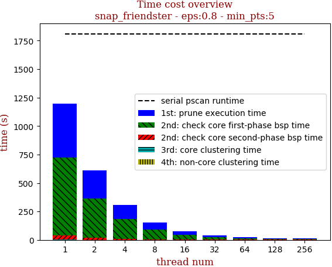 | 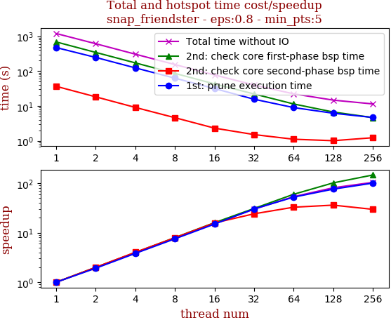

thread_num | prune | check-core 1st bsp | check-core 2nd bsp | cluster-core | cluster-non-core | total | total speedup
--- | --- | --- | --- | --- | --- | --- | ---
1 | 473.77s | 686.786s | 36.682s | 0.629s | 0.914s | 1198.784s | 1.000
2 | 246.97s | 343.965s | 18.33s | 0.612s | 0.459s | 610.338s | 1.964
4 | 123.924s | 172.412s | 9.113s | 0.611s | 0.232s | 306.294s | 3.914
8 | 62.892s | 86.227s | 4.63s | 0.611s | 0.16s | 154.523s | 7.758
16 | 31.669s | 43.031s | 2.325s | 0.612s | 0.114s | 77.755s | 15.417
32 | 15.663s | 22.194s | 1.52s | 0.617s | 0.11s | 40.107s | 29.890
64 | 9.029s | 11.465s | 1.118s | 0.621s | 0.097s | 22.332s | 53.680
128 | 6.218s | 6.741s | 1.015s | 0.639s | 0.151s | 14.767s | 81.180
256 | 4.704s | 4.668s | 1.234s | 0.673s | 0.207s | 11.489s | 104.342

## eps:0.9

overview | speedup
--- | ---
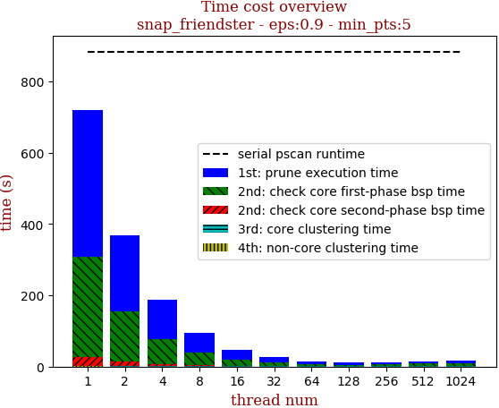 | 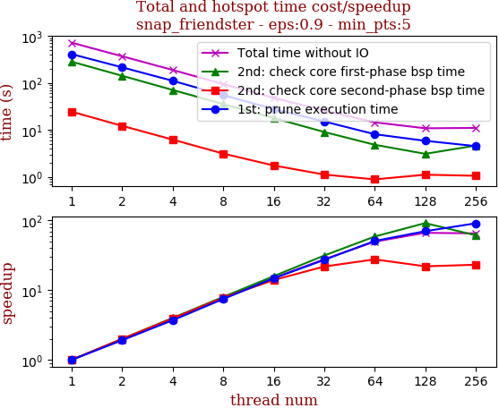

thread_num | prune | check-core 1st bsp | check-core 2nd bsp | cluster-core | cluster-non-core | total | total speedup
--- | --- | --- | --- | --- | --- | --- | ---
1 | 410.077s | 282.815s | 24.301s | 0.612s | 0.894s | 718.702s | 1.000
2 | 214.445s | 141.658s | 12.138s | 0.604s | 0.448s | 369.298s | 1.946
4 | 110.749s | 70.692s | 6.181s | 0.6s | 0.227s | 188.451s | 3.814
8 | 54.931s | 35.366s | 3.112s | 0.611s | 0.17s | 94.193s | 7.630
16 | 27.717s | 17.791s | 1.737s | 0.608s | 0.121s | 47.977s | 14.980
32 | 15.053s | 8.989s | 1.112s | 0.607s | 0.079s | 25.843s | 27.810
64 | 8.057s | 4.798s | 0.878s | 0.616s | 0.096s | 14.448s | 49.744
128 | 5.835s | 3.079s | 1.105s | 0.631s | 0.132s | 10.786s | 66.633
256 | 4.495s | 4.615s | 1.048s | 0.667s | 0.156s | 10.984s | 65.432

