## eps:0.1

overview | speedup
--- | ---
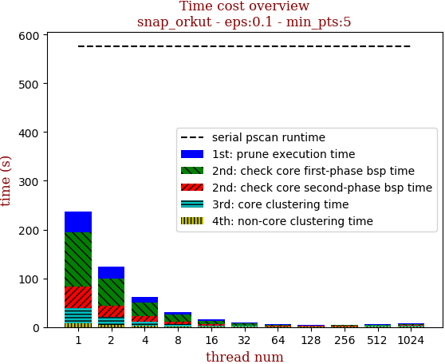 | 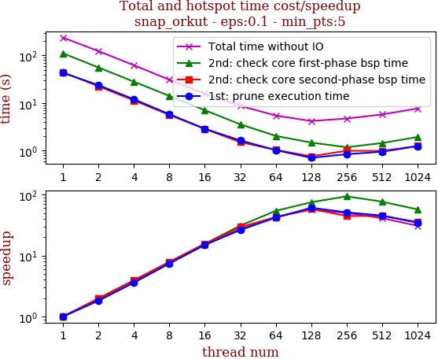

thread_num | prune | check-core 1st bsp | check-core 2nd bsp | cluster-core | cluster-non-core | total | total speedup
--- | --- | --- | --- | --- | --- | --- | ---
1 | 43.221s | 111.082s | 44.488s | 30.219s | 8.31s | 237.323s | 1.000
2 | 23.783s | 55.939s | 22.515s | 16.791s | 4.476s | 123.506s | 1.922
4 | 12.028s | 28.112s | 11.37s | 8.453s | 2.326s | 62.292s | 3.810
8 | 5.837s | 14.168s | 5.628s | 4.089s | 1.269s | 30.995s | 7.657
16 | 2.888s | 7.094s | 2.857s | 2.095s | 0.787s | 15.724s | 15.093
32 | 1.642s | 3.578s | 1.517s | 1.364s | 0.638s | 8.741s | 27.151
64 | 1.03s | 2.046s | 1.038s | 0.899s | 0.467s | 5.482s | 43.291
128 | 0.708s | 1.482s | 0.763s | 0.764s | 0.476s | 4.196s | 56.559
256 | 0.844s | 1.183s | 0.997s | 1.052s | 0.656s | 4.735s | 50.121

## eps:0.2

overview | speedup
--- | ---
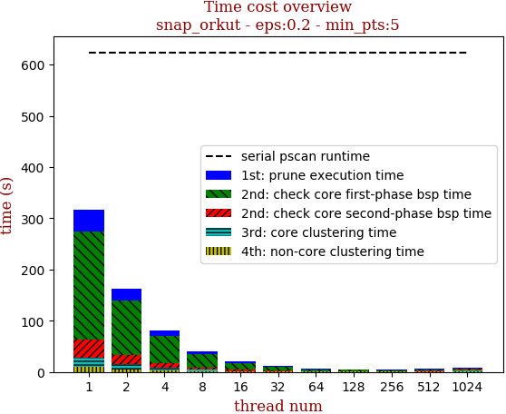 | 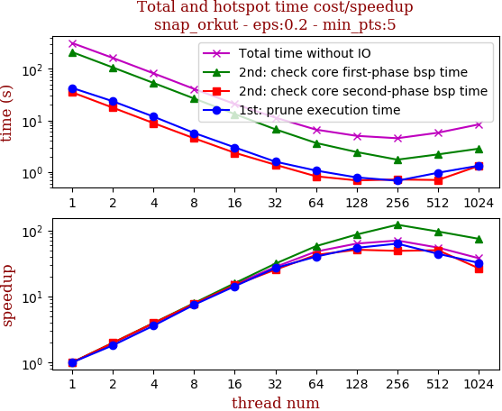

thread_num | prune | check-core 1st bsp | check-core 2nd bsp | cluster-core | cluster-non-core | total | total speedup
--- | --- | --- | --- | --- | --- | --- | ---
1 | 42.642s | 210.717s | 35.005s | 17.831s | 10.189s | 316.387s | 1.000
2 | 23.528s | 106.372s | 17.678s | 9.897s | 5.386s | 162.862s | 1.943
4 | 11.867s | 53.33s | 8.883s | 4.995s | 2.812s | 81.89s | 3.864
8 | 5.72s | 26.611s | 4.51s | 2.481s | 1.478s | 40.803s | 7.754
16 | 3.0s | 13.299s | 2.36s | 1.268s | 0.869s | 20.798s | 15.212
32 | 1.587s | 6.729s | 1.381s | 0.931s | 0.7s | 11.332s | 27.920
64 | 1.067s | 3.659s | 0.826s | 0.617s | 0.464s | 6.635s | 47.685
128 | 0.786s | 2.44s | 0.689s | 0.634s | 0.474s | 5.026s | 62.950
256 | 0.679s | 1.737s | 0.717s | 0.867s | 0.518s | 4.521s | 69.982

## eps:0.3

overview | speedup
--- | ---
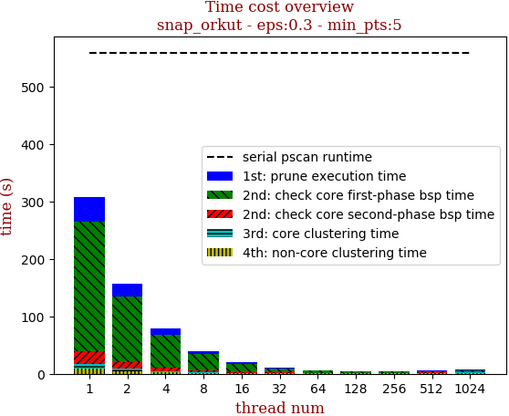 | 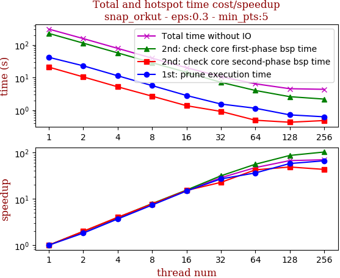

thread_num | prune | check-core 1st bsp | check-core 2nd bsp | cluster-core | cluster-non-core | total | total speedup
--- | --- | --- | --- | --- | --- | --- | ---
1 | 41.935s | 226.431s | 20.981s | 9.142s | 8.685s | 307.175s | 1.000
2 | 23.04s | 114.186s | 10.529s | 4.933s | 4.539s | 157.229s | 1.954
4 | 11.406s | 57.356s | 5.237s | 2.488s | 2.364s | 78.854s | 3.895
8 | 5.705s | 28.643s | 2.703s | 1.242s | 1.245s | 39.541s | 7.769
16 | 2.837s | 14.596s | 1.38s | 0.656s | 0.72s | 20.19s | 15.214
32 | 1.553s | 7.186s | 0.923s | 0.49s | 0.561s | 10.715s | 28.668
64 | 1.154s | 4.045s | 0.495s | 0.347s | 0.437s | 6.481s | 47.396
128 | 0.723s | 2.611s | 0.43s | 0.449s | 0.364s | 4.58s | 67.069
256 | 0.631s | 2.202s | 0.484s | 0.659s | 0.406s | 4.385s | 70.051

## eps:0.4

overview | speedup
--- | ---
 | 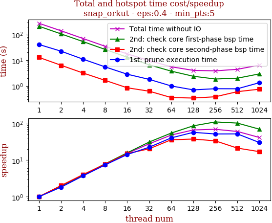

thread_num | prune | check-core 1st bsp | check-core 2nd bsp | cluster-core | cluster-non-core | total | total speedup
--- | --- | --- | --- | --- | --- | --- | ---
1 | 40.734s | 207.293s | 12.839s | 3.806s | 5.531s | 270.205s | 1.000
2 | 22.363s | 104.965s | 6.367s | 2.003s | 2.836s | 138.537s | 1.950
4 | 10.956s | 52.811s | 3.183s | 1.018s | 1.453s | 69.423s | 3.892
8 | 5.509s | 26.198s | 1.652s | 0.535s | 0.805s | 34.701s | 7.787
16 | 2.867s | 13.104s | 0.853s | 0.312s | 0.482s | 17.622s | 15.333
32 | 1.808s | 6.634s | 0.629s | 0.246s | 0.358s | 9.678s | 27.920
64 | 1.005s | 3.772s | 0.356s | 0.218s | 0.221s | 5.574s | 48.476
128 | 0.708s | 2.391s | 0.341s | 0.355s | 0.246s | 4.044s | 66.816
256 | 0.785s | 1.873s | 0.382s | 0.444s | 0.388s | 3.874s | 69.748

## eps:0.5

overview | speedup
--- | ---
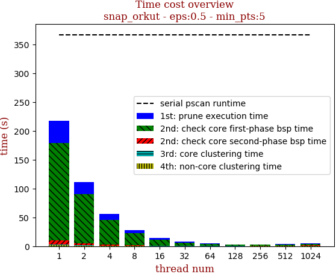 | 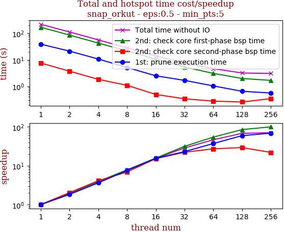

thread_num | prune | check-core 1st bsp | check-core 2nd bsp | cluster-core | cluster-non-core | total | total speedup
--- | --- | --- | --- | --- | --- | --- | ---
1 | 38.755s | 168.466s | 7.553s | 0.763s | 2.036s | 217.576s | 1.000
2 | 21.21s | 85.261s | 3.716s | 0.409s | 1.04s | 111.637s | 1.949
4 | 10.681s | 42.726s | 1.837s | 0.216s | 0.554s | 56.016s | 3.884
8 | 5.126s | 21.445s | 1.091s | 0.155s | 0.313s | 28.131s | 7.734
16 | 2.493s | 10.691s | 0.495s | 0.098s | 0.219s | 13.997s | 15.544
32 | 1.678s | 5.321s | 0.339s | 0.097s | 0.142s | 7.58s | 28.704
64 | 1.038s | 3.085s | 0.277s | 0.109s | 0.151s | 4.662s | 46.670
128 | 0.651s | 1.975s | 0.257s | 0.129s | 0.172s | 3.186s | 68.291
256 | 0.561s | 1.679s | 0.342s | 0.168s | 0.303s | 3.055s | 71.220

## eps:0.6

overview | speedup
--- | ---
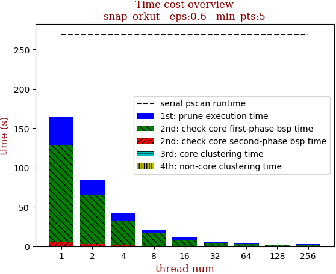 | 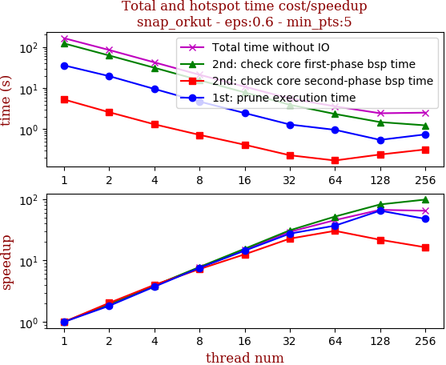

thread_num | prune | check-core 1st bsp | check-core 2nd bsp | cluster-core | cluster-non-core | total | total speedup
--- | --- | --- | --- | --- | --- | --- | ---
1 | 35.776s | 122.362s | 5.289s | 0.131s | 0.444s | 164.005s | 1.000
2 | 19.587s | 62.255s | 2.595s | 0.077s | 0.226s | 84.743s | 1.935
4 | 9.566s | 31.343s | 1.319s | 0.052s | 0.119s | 42.401s | 3.868
8 | 4.708s | 15.611s | 0.73s | 0.046s | 0.079s | 21.176s | 7.745
16 | 2.478s | 7.871s | 0.42s | 0.041s | 0.054s | 10.866s | 15.093
32 | 1.305s | 3.942s | 0.233s | 0.054s | 0.055s | 5.592s | 29.329
64 | 0.969s | 2.355s | 0.174s | 0.051s | 0.058s | 3.61s | 45.431
128 | 0.552s | 1.494s | 0.243s | 0.066s | 0.096s | 2.452s | 66.886
256 | 0.749s | 1.246s | 0.322s | 0.098s | 0.12s | 2.537s | 64.645

## eps:0.7

overview | speedup
--- | ---
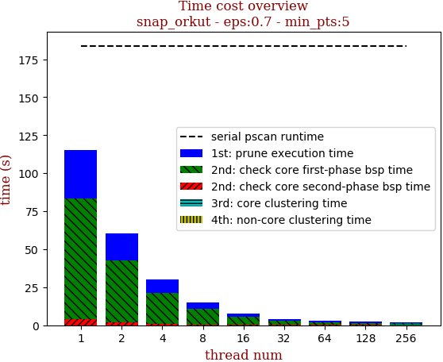 | 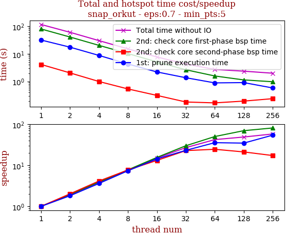

thread_num | prune | check-core 1st bsp | check-core 2nd bsp | cluster-core | cluster-non-core | total | total speedup
--- | --- | --- | --- | --- | --- | --- | ---
1 | 31.647s | 79.382s | 4.136s | 0.029s | 0.065s | 115.261s | 1.000
2 | 17.446s | 40.607s | 2.048s | 0.025s | 0.033s | 60.162s | 1.916
4 | 8.771s | 20.284s | 1.0s | 0.026s | 0.021s | 30.104s | 3.829
8 | 4.306s | 10.252s | 0.539s | 0.028s | 0.018s | 15.145s | 7.610
16 | 2.219s | 5.122s | 0.315s | 0.03s | 0.019s | 7.708s | 14.953
32 | 1.372s | 2.66s | 0.182s | 0.039s | 0.036s | 4.292s | 26.855
64 | 0.893s | 1.588s | 0.169s | 0.054s | 0.032s | 2.739s | 42.081
128 | 0.915s | 1.144s | 0.196s | 0.054s | 0.057s | 2.368s | 48.674
256 | 0.586s | 0.982s | 0.24s | 0.091s | 0.097s | 1.998s | 57.688

## eps:0.8

overview | speedup
--- | ---
 | 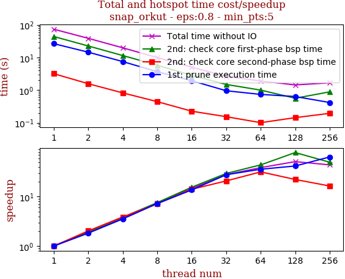

thread_num | prune | check-core 1st bsp | check-core 2nd bsp | cluster-core | cluster-non-core | total | total speedup
--- | --- | --- | --- | --- | --- | --- | ---
1 | 26.725s | 44.294s | 3.206s | 0.018s | 0.025s | 74.269s | 1.000
2 | 14.661s | 22.736s | 1.583s | 0.018s | 0.013s | 39.013s | 1.904
4 | 7.546s | 11.569s | 0.827s | 0.02s | 0.011s | 19.975s | 3.718
8 | 3.689s | 5.844s | 0.446s | 0.021s | 0.011s | 10.013s | 7.417
16 | 1.954s | 2.853s | 0.227s | 0.023s | 0.012s | 5.073s | 14.640
32 | 0.962s | 1.502s | 0.154s | 0.028s | 0.015s | 2.664s | 27.879
64 | 0.744s | 1.007s | 0.101s | 0.037s | 0.026s | 1.918s | 38.722
128 | 0.64s | 0.567s | 0.144s | 0.053s | 0.044s | 1.451s | 51.185
256 | 0.42s | 0.889s | 0.195s | 0.094s | 0.085s | 1.686s | 44.050

## eps:0.9

overview | speedup
--- | ---
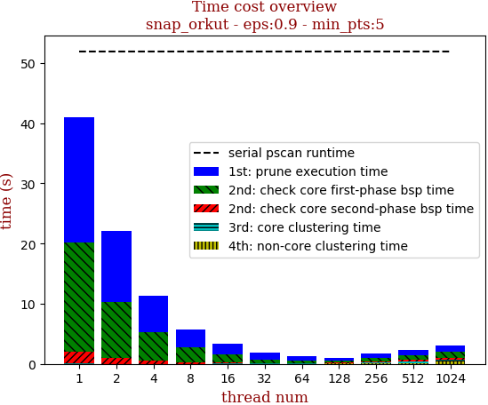 | 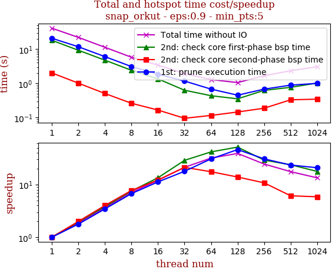

thread_num | prune | check-core 1st bsp | check-core 2nd bsp | cluster-core | cluster-non-core | total | total speedup
--- | --- | --- | --- | --- | --- | --- | ---
1 | 20.81s | 18.143s | 2.018s | 0.017s | 0.022s | 41.014s | 1.000
2 | 11.738s | 9.271s | 1.012s | 0.018s | 0.012s | 22.052s | 1.860
4 | 6.038s | 4.756s | 0.504s | 0.018s | 0.008s | 11.327s | 3.621
8 | 3.091s | 2.404s | 0.261s | 0.02s | 0.008s | 5.786s | 7.088
16 | 1.851s | 1.346s | 0.165s | 0.025s | 0.009s | 3.399s | 12.066
32 | 1.163s | 0.628s | 0.095s | 0.028s | 0.012s | 1.929s | 21.262
64 | 0.676s | 0.434s | 0.115s | 0.037s | 0.021s | 1.285s | 31.918
128 | 0.45s | 0.352s | 0.145s | 0.054s | 0.047s | 1.05s | 39.061
256 | 0.676s | 0.622s | 0.187s | 0.093s | 0.09s | 1.669s | 24.574

