## eps:0.1

overview | speedup
--- | ---
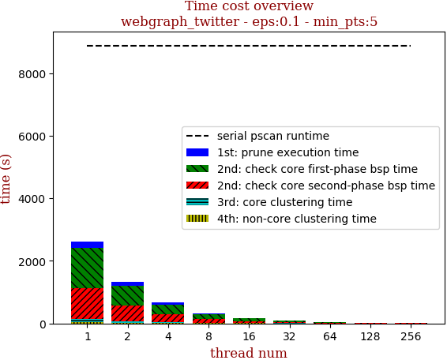 | 

thread_num | prune | check-core 1st bsp | check-core 2nd bsp | cluster-core | cluster-non-core | total | total speedup
--- | --- | --- | --- | --- | --- | --- | ---
1 | 214.44s | 1276.332s | 985.77s | 90.822s | 49.628s | 2616.997s | 1.000
2 | 112.45s | 641.986s | 493.576s | 47.828s | 26.414s | 1322.26s | 1.979
4 | 56.141s | 321.745s | 246.636s | 24.646s | 14.393s | 663.566s | 3.944
8 | 27.935s | 160.767s | 123.514s | 12.064s | 8.365s | 332.65s | 7.867
16 | 13.972s | 82.491s | 62.443s | 6.217s | 6.191s | 171.321s | 15.275
32 | 7.361s | 42.256s | 32.175s | 3.562s | 4.122s | 89.481s | 29.246
64 | 4.037s | 21.672s | 16.654s | 2.404s | 2.663s | 47.435s | 55.170
128 | 2.812s | 12.29s | 9.855s | 1.959s | 1.926s | 28.847s | 90.720
256 | 2.106s | 9.839s | 7.344s | 2.11s | 2.189s | 23.591s | 110.932
512 | 2.533s | 10.076s | 7.624s | 2.561s | 2.297s | 25.094s | 104.288
1024 | 2.968s | 11.126s | 8.337s | 3.365s | 2.416s | 28.216s | 92.749

## eps:0.2

overview | speedup
--- | ---
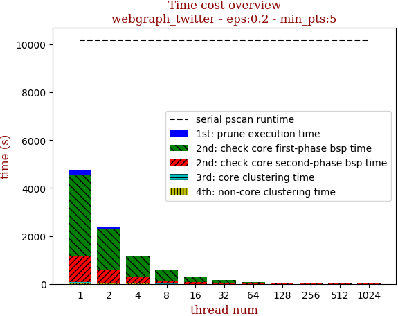 | 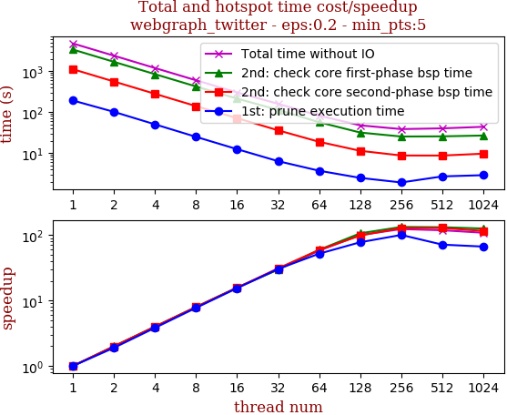

thread_num | prune | check-core 1st bsp | check-core 2nd bsp | cluster-core | cluster-non-core | total | total speedup
--- | --- | --- | --- | --- | --- | --- | ---
1 | 191.445s | 3361.338s | 1111.739s | 30.45s | 40.918s | 4735.893s | 1.000
2 | 100.982s | 1682.988s | 557.066s | 16.065s | 21.003s | 2378.107s | 1.991
4 | 50.034s | 841.241s | 278.759s | 8.117s | 10.805s | 1188.96s | 3.983
8 | 24.781s | 421.876s | 139.669s | 4.442s | 5.82s | 596.592s | 7.938
16 | 12.39s | 212.876s | 70.887s | 2.339s | 3.606s | 302.102s | 15.676
32 | 6.307s | 113.04s | 35.79s | 1.525s | 2.285s | 158.952s | 29.794
64 | 3.684s | 56.412s | 18.74s | 1.135s | 1.766s | 81.741s | 57.938
128 | 2.463s | 31.579s | 11.296s | 0.793s | 1.218s | 47.353s | 100.013
256 | 1.906s | 25.26s | 8.687s | 1.321s | 1.182s | 38.359s | 123.462
512 | 2.681s | 25.504s | 8.661s | 1.809s | 1.331s | 39.99s | 118.427
1024 | 2.872s | 26.708s | 9.62s | 2.617s | 1.858s | 43.679s | 108.425

## eps:0.3

overview | speedup
--- | ---
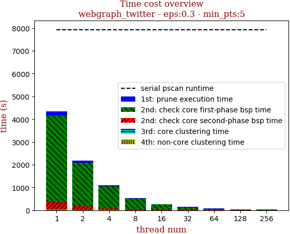 | 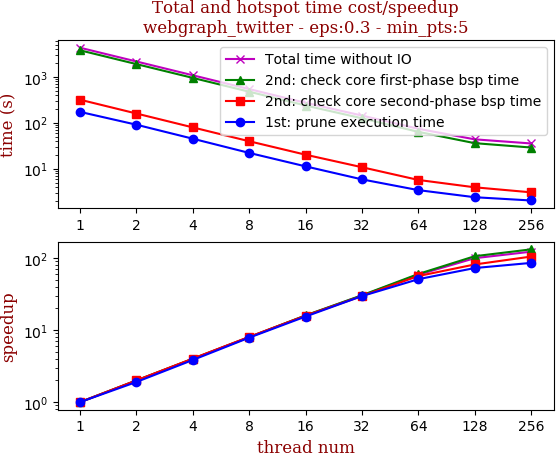

thread_num | prune | check-core 1st bsp | check-core 2nd bsp | cluster-core | cluster-non-core | total | total speedup
--- | --- | --- | --- | --- | --- | --- | ---
1 | 173.18s | 3812.839s | 319.255s | 10.97s | 23.203s | 4339.451s | 1.000
2 | 90.986s | 1907.637s | 159.65s | 5.716s | 11.723s | 2175.715s | 1.994
4 | 45.07s | 954.899s | 79.571s | 3.136s | 5.891s | 1088.569s | 3.986
8 | 22.1s | 477.616s | 39.71s | 1.83s | 3.067s | 544.327s | 7.972
16 | 11.252s | 238.979s | 20.201s | 1.205s | 1.82s | 273.46s | 15.869
32 | 5.856s | 125.648s | 10.781s | 0.78s | 1.078s | 144.147s | 30.104
64 | 3.414s | 63.653s | 5.692s | 0.61s | 0.835s | 74.208s | 58.477
128 | 2.391s | 36.071s | 3.933s | 0.662s | 0.657s | 43.717s | 99.262
256 | 2.029s | 28.979s | 3.056s | 0.794s | 0.669s | 35.531s | 122.131
512 | 2.541s | 29.218s | 3.442s | 1.136s | 1.179s | 37.519s | 115.660
1024 | 2.788s | 30.046s | 3.623s | 1.455s | 1.361s | 39.277s | 110.483

## eps:0.4

overview | speedup
--- | ---
 | 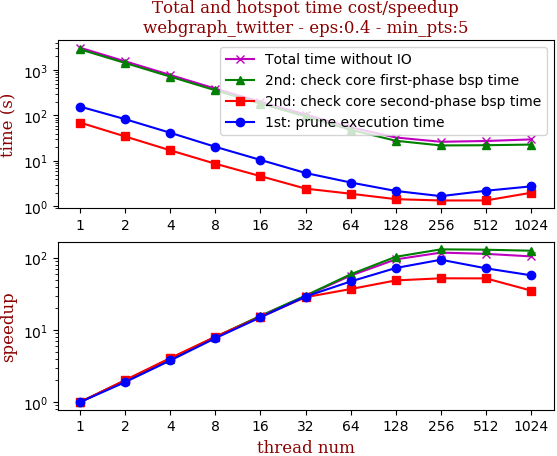

thread_num | prune | check-core 1st bsp | check-core 2nd bsp | cluster-core | cluster-non-core | total | total speedup
--- | --- | --- | --- | --- | --- | --- | ---
1 | 156.687s | 2858.974s | 69.525s | 7.371s | 11.114s | 3103.675s | 1.000
2 | 82.714s | 1432.725s | 34.438s | 3.827s | 5.592s | 1559.299s | 1.990
4 | 41.491s | 716.695s | 17.037s | 2.088s | 2.81s | 780.123s | 3.978
8 | 20.355s | 358.036s | 8.627s | 1.335s | 1.498s | 389.854s | 7.961
16 | 10.478s | 182.385s | 4.596s | 0.766s | 0.849s | 199.076s | 15.590
32 | 5.396s | 95.596s | 2.443s | 0.771s | 0.622s | 104.83s | 29.607
64 | 3.332s | 48.349s | 1.885s | 0.77s | 0.442s | 54.781s | 56.656
128 | 2.17s | 27.692s | 1.431s | 0.828s | 0.545s | 32.669s | 95.004
256 | 1.667s | 21.842s | 1.338s | 0.857s | 0.601s | 26.308s | 117.975
512 | 2.192s | 22.084s | 1.341s | 0.913s | 0.84s | 27.373s | 113.385
1024 | 2.74s | 22.818s | 1.98s | 1.124s | 1.001s | 29.665s | 104.624

## eps:0.5

overview | speedup
--- | ---
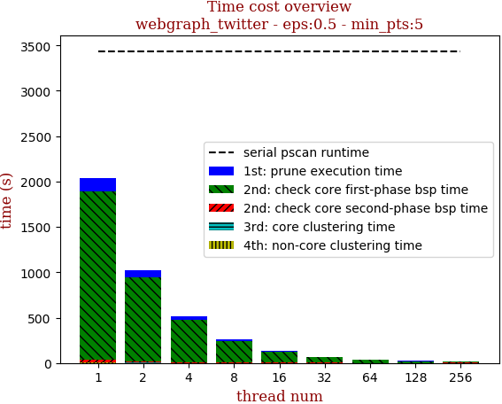 | 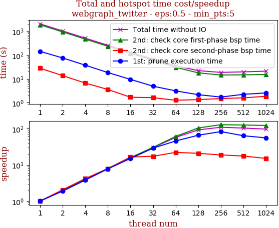

thread_num | prune | check-core 1st bsp | check-core 2nd bsp | cluster-core | cluster-non-core | total | total speedup
--- | --- | --- | --- | --- | --- | --- | ---
1 | 142.246s | 1859.721s | 27.887s | 1.887s | 3.925s | 2035.67s | 1.000
2 | 75.377s | 931.948s | 13.61s | 1.066s | 1.977s | 1023.981s | 1.988
4 | 37.496s | 465.841s | 6.655s | 0.64s | 0.993s | 511.628s | 3.979
8 | 18.359s | 233.014s | 3.581s | 0.472s | 0.606s | 256.035s | 7.951
16 | 9.495s | 117.993s | 1.69s | 0.359s | 0.303s | 129.843s | 15.678
32 | 4.927s | 61.2s | 1.621s | 0.325s | 0.31s | 68.386s | 29.767
64 | 3.124s | 30.564s | 1.264s | 0.313s | 0.32s | 35.588s | 57.201
128 | 2.166s | 17.891s | 1.342s | 0.385s | 0.344s | 22.132s | 91.979
256 | 1.719s | 14.492s | 1.487s | 0.538s | 0.428s | 18.666s | 109.058
512 | 2.239s | 14.791s | 1.594s | 0.533s | 0.522s | 19.682s | 103.428
1024 | 2.563s | 15.237s | 1.853s | 0.685s | 0.669s | 21.011s | 96.886

## eps:0.6

overview | speedup
--- | ---
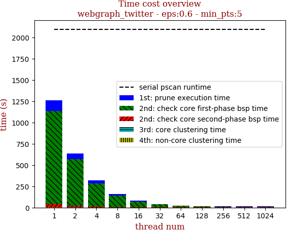 | 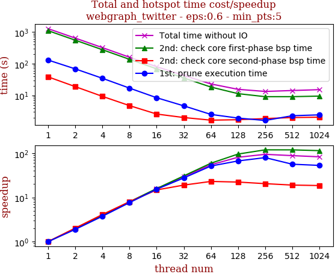

thread_num | prune | check-core 1st bsp | check-core 2nd bsp | cluster-core | cluster-non-core | total | total speedup
--- | --- | --- | --- | --- | --- | --- | ---
1 | 129.624s | 1090.639s | 38.29s | 1.131s | 1.713s | 1261.402s | 1.000
2 | 68.382s | 547.455s | 18.885s | 0.669s | 0.859s | 636.252s | 1.983
4 | 34.582s | 274.64s | 9.326s | 0.449s | 0.454s | 319.454s | 3.949
8 | 16.963s | 136.7s | 4.764s | 0.345s | 0.254s | 159.029s | 7.932
16 | 8.454s | 68.655s | 2.59s | 0.298s | 0.165s | 80.166s | 15.735
32 | 4.69s | 35.47s | 2.012s | 0.271s | 0.144s | 42.591s | 29.617
64 | 2.52s | 18.318s | 1.663s | 0.295s | 0.167s | 22.966s | 54.925
128 | 1.934s | 11.368s | 1.718s | 0.345s | 0.178s | 15.546s | 81.140
256 | 1.626s | 9.123s | 1.867s | 0.431s | 0.284s | 13.335s | 94.593
512 | 2.294s | 9.139s | 2.011s | 0.45s | 0.367s | 14.265s | 88.426
1024 | 2.441s | 9.513s | 2.06s | 0.608s | 0.55s | 15.175s | 83.124

## eps:0.7

overview | speedup
--- | ---
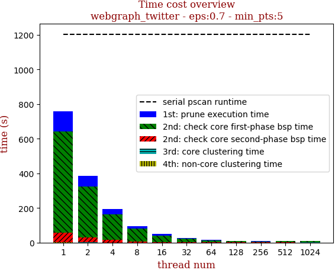 | 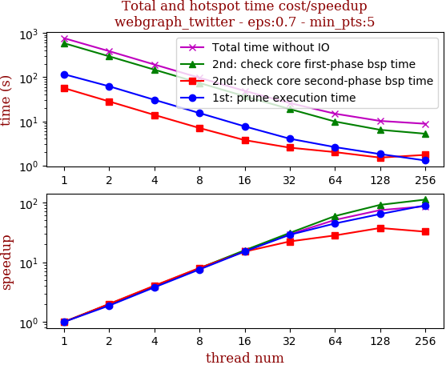

thread_num | prune | check-core 1st bsp | check-core 2nd bsp | cluster-core | cluster-non-core | total | total speedup
--- | --- | --- | --- | --- | --- | --- | ---
1 | 115.833s | 584.559s | 56.274s | 0.725s | 1.11s | 758.505s | 1.000
2 | 61.799s | 294.602s | 28.075s | 0.462s | 0.559s | 385.501s | 1.968
4 | 30.593s | 147.261s | 13.92s | 0.348s | 0.286s | 192.412s | 3.942
8 | 15.327s | 73.61s | 7.027s | 0.314s | 0.174s | 96.455s | 7.864
16 | 7.663s | 36.911s | 3.748s | 0.262s | 0.145s | 48.732s | 15.565
32 | 4.028s | 18.904s | 2.529s | 0.263s | 0.096s | 25.822s | 29.374
64 | 2.603s | 9.873s | 2.007s | 0.272s | 0.11s | 14.869s | 51.013
128 | 1.812s | 6.411s | 1.507s | 0.298s | 0.161s | 10.193s | 74.414
256 | 1.297s | 5.233s | 1.736s | 0.327s | 0.198s | 8.794s | 86.253
512 | 2.145s | 5.361s | 1.705s | 0.411s | 0.323s | 9.947s | 76.255
1024 | 2.467s | 5.53s | 1.966s | 0.541s | 0.483s | 10.99s | 69.018

## eps:0.8

overview | speedup
--- | ---
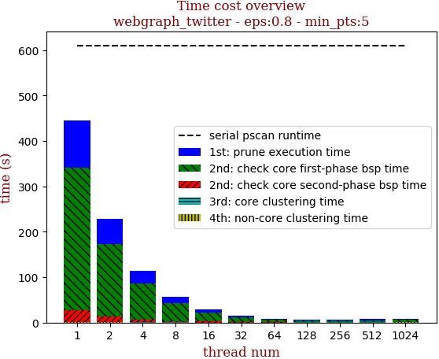 | 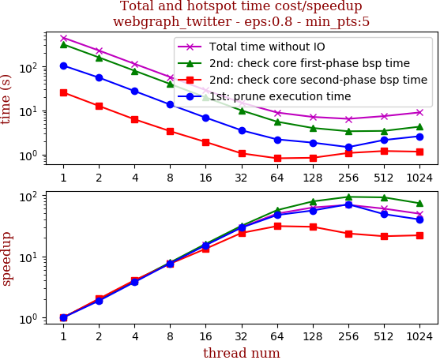

thread_num | prune | check-core 1st bsp | check-core 2nd bsp | cluster-core | cluster-non-core | total | total speedup
--- | --- | --- | --- | --- | --- | --- | ---
1 | 103.941s | 314.61s | 25.53s | 0.354s | 0.968s | 445.407s | 1.000
2 | 55.523s | 159.233s | 12.648s | 0.277s | 0.486s | 228.169s | 1.952
4 | 27.489s | 79.481s | 6.289s | 0.244s | 0.266s | 113.771s | 3.915
8 | 13.568s | 39.761s | 3.387s | 0.227s | 0.182s | 57.128s | 7.797
16 | 6.858s | 19.711s | 1.923s | 0.225s | 0.127s | 28.847s | 15.440
32 | 3.551s | 10.032s | 1.064s | 0.23s | 0.115s | 14.995s | 29.704
64 | 2.208s | 5.558s | 0.822s | 0.24s | 0.13s | 8.961s | 49.705
128 | 1.861s | 4.0s | 0.843s | 0.247s | 0.168s | 7.123s | 62.531
256 | 1.473s | 3.372s | 1.085s | 0.287s | 0.228s | 6.448s | 69.077
512 | 2.132s | 3.434s | 1.202s | 0.356s | 0.303s | 7.43s | 59.947
1024 | 2.604s | 4.281s | 1.162s | 0.495s | 0.45s | 8.996s | 49.512

## eps:0.9

overview | speedup
--- | ---
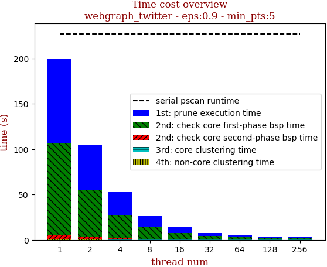 | 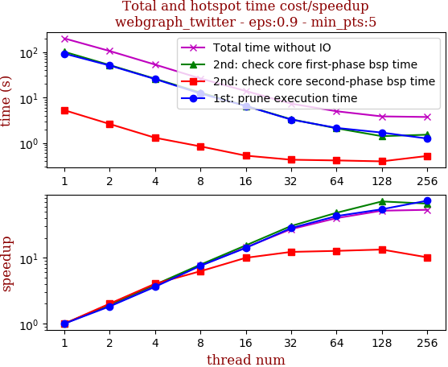

thread_num | prune | check-core 1st bsp | check-core 2nd bsp | cluster-core | cluster-non-core | total | total speedup
--- | --- | --- | --- | --- | --- | --- | ---
1 | 92.068s | 100.92s | 5.242s | 0.278s | 0.366s | 198.877s | 1.000
2 | 50.388s | 51.622s | 2.603s | 0.236s | 0.184s | 105.036s | 1.893
4 | 25.401s | 25.823s | 1.298s | 0.222s | 0.098s | 52.845s | 3.763
8 | 12.192s | 12.828s | 0.839s | 0.225s | 0.072s | 26.159s | 7.603
16 | 6.521s | 6.539s | 0.525s | 0.23s | 0.054s | 13.872s | 14.337
32 | 3.262s | 3.321s | 0.427s | 0.238s | 0.059s | 7.311s | 27.202
64 | 2.143s | 2.095s | 0.412s | 0.252s | 0.071s | 4.975s | 39.975
128 | 1.689s | 1.408s | 0.393s | 0.254s | 0.088s | 3.835s | 51.858
256 | 1.251s | 1.516s | 0.516s | 0.299s | 0.134s | 3.718s | 53.490
512 | 2.06s | 1.986s | 0.55s | 0.364s | 0.22s | 5.184s | 38.364
1024 | 2.41s | 2.501s | 0.72s | 0.509s | 0.402s | 6.546s | 30.381

