## eps:0.1

overview | speedup
--- | ---
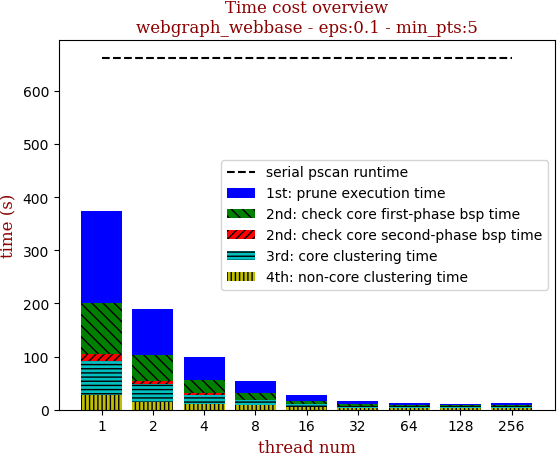 | 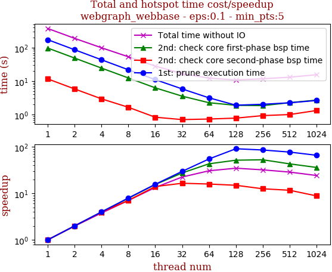

thread_num | prune | check-core 1st bsp | check-core 2nd bsp | cluster-core | cluster-non-core | total | total speedup
--- | --- | --- | --- | --- | --- | --- | ---
1 | 172.946s | 97.273s | 11.64s | 65.375s | 27.07s | 374.309s | 1.000
2 | 86.605s | 48.846s | 5.832s | 33.317s | 15.092s | 189.698s | 1.973
4 | 43.392s | 24.5s | 2.953s | 17.416s | 10.98s | 99.246s | 3.772
8 | 21.805s | 12.439s | 1.651s | 9.392s | 8.096s | 53.389s | 7.011
16 | 11.089s | 6.298s | 0.833s | 5.123s | 4.741s | 28.089s | 13.326
32 | 5.845s | 3.554s | 0.708s | 3.35s | 3.261s | 16.722s | 22.384
64 | 3.161s | 2.26s | 0.736s | 2.747s | 3.376s | 12.284s | 30.471
128 | 1.908s | 1.892s | 0.783s | 2.399s | 3.831s | 10.817s | 34.604
256 | 2.03s | 1.852s | 0.931s | 2.839s | 4.076s | 11.731s | 31.908

## eps:0.2

overview | speedup
--- | ---
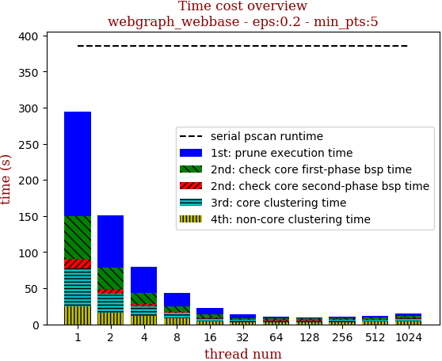 | 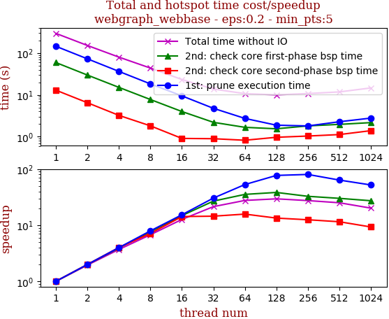

thread_num | prune | check-core 1st bsp | check-core 2nd bsp | cluster-core | cluster-non-core | total | total speedup
--- | --- | --- | --- | --- | --- | --- | ---
1 | 144.617s | 59.055s | 12.909s | 52.46s | 25.203s | 294.248s | 1.000
2 | 72.49s | 29.671s | 6.466s | 26.766s | 15.89s | 151.288s | 1.945
4 | 36.294s | 15.062s | 3.225s | 13.9s | 11.203s | 79.69s | 3.692
8 | 18.255s | 7.719s | 1.812s | 7.775s | 8.028s | 43.595s | 6.750
16 | 9.44s | 3.987s | 0.907s | 4.479s | 4.43s | 23.248s | 12.657
32 | 4.756s | 2.2s | 0.893s | 2.844s | 3.057s | 13.754s | 21.394
64 | 2.73s | 1.67s | 0.82s | 2.463s | 2.978s | 10.665s | 27.590
128 | 1.879s | 1.542s | 0.966s | 2.325s | 3.276s | 9.991s | 29.451
256 | 1.805s | 1.808s | 1.034s | 2.61s | 3.477s | 10.736s | 27.408

## eps:0.3

overview | speedup
--- | ---
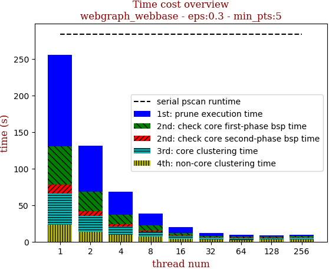 | 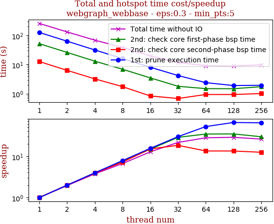

thread_num | prune | check-core 1st bsp | check-core 2nd bsp | cluster-core | cluster-non-core | total | total speedup
--- | --- | --- | --- | --- | --- | --- | ---
1 | 125.524s | 51.708s | 12.646s | 42.718s | 22.958s | 255.559s | 1.000
2 | 62.967s | 26.04s | 6.32s | 21.849s | 13.732s | 130.913s | 1.952
4 | 31.623s | 13.04s | 3.234s | 11.389s | 9.113s | 68.403s | 3.736
8 | 15.991s | 6.897s | 1.749s | 6.514s | 7.203s | 38.359s | 6.662
16 | 8.085s | 3.491s | 0.84s | 3.721s | 3.848s | 19.991s | 12.784
32 | 4.211s | 1.803s | 0.689s | 2.534s | 2.602s | 11.843s | 21.579
64 | 2.399s | 1.499s | 0.943s | 2.078s | 2.205s | 9.127s | 28.000
128 | 1.913s | 1.49s | 0.944s | 1.913s | 2.64s | 8.903s | 28.705
256 | 1.948s | 1.745s | 1.015s | 2.288s | 2.822s | 9.823s | 26.016

## eps:0.4

overview | speedup
--- | ---
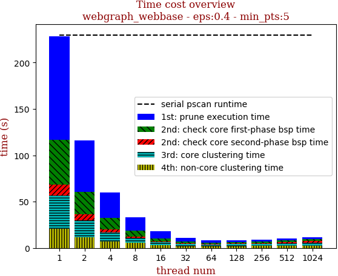 | 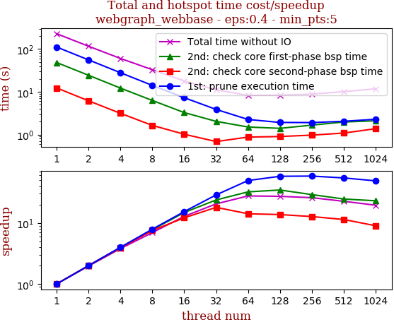

thread_num | prune | check-core 1st bsp | check-core 2nd bsp | cluster-core | cluster-non-core | total | total speedup
--- | --- | --- | --- | --- | --- | --- | ---
1 | 111.357s | 48.335s | 12.304s | 35.913s | 20.423s | 228.337s | 1.000
2 | 55.764s | 24.329s | 6.143s | 18.387s | 11.675s | 116.303s | 1.963
4 | 27.93s | 12.195s | 3.133s | 9.643s | 7.291s | 60.198s | 3.793
8 | 14.09s | 6.258s | 1.635s | 5.273s | 5.639s | 32.898s | 6.941
16 | 7.264s | 3.261s | 1.015s | 3.095s | 3.172s | 17.811s | 12.820
32 | 3.866s | 2.03s | 0.684s | 2.55s | 1.996s | 11.129s | 20.517
64 | 2.25s | 1.498s | 0.871s | 1.83s | 1.795s | 8.247s | 27.687
128 | 1.917s | 1.396s | 0.898s | 2.078s | 2.086s | 8.378s | 27.254
256 | 1.902s | 1.66s | 0.968s | 2.045s | 2.231s | 8.81s | 25.918

## eps:0.5

overview | speedup
--- | ---
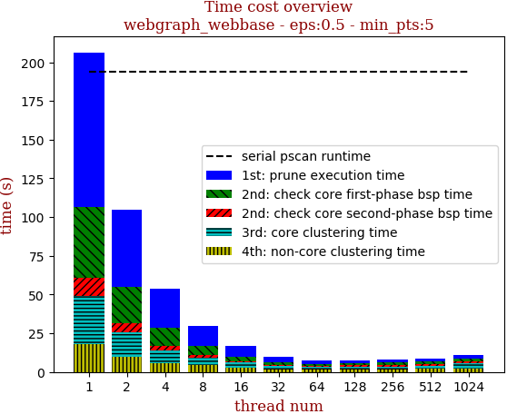 | 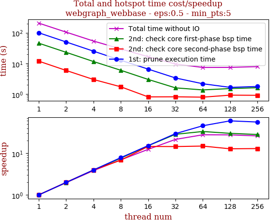

thread_num | prune | check-core 1st bsp | check-core 2nd bsp | cluster-core | cluster-non-core | total | total speedup
--- | --- | --- | --- | --- | --- | --- | ---
1 | 99.903s | 45.747s | 11.854s | 30.816s | 18.004s | 206.328s | 1.000
2 | 50.163s | 23.051s | 5.906s | 15.849s | 9.941s | 104.914s | 1.967
4 | 25.144s | 11.559s | 2.998s | 8.378s | 5.751s | 53.834s | 3.833
8 | 12.704s | 5.989s | 1.731s | 4.679s | 4.607s | 29.716s | 6.943
16 | 6.544s | 3.014s | 0.812s | 3.231s | 2.991s | 16.598s | 12.431
32 | 3.363s | 1.599s | 0.817s | 2.035s | 1.753s | 9.571s | 21.558
64 | 2.177s | 1.37s | 0.795s | 1.642s | 1.426s | 7.413s | 27.833
128 | 1.659s | 1.517s | 0.925s | 1.682s | 1.663s | 7.448s | 27.702
256 | 1.771s | 1.616s | 0.913s | 1.798s | 1.783s | 7.883s | 26.174

## eps:0.6

overview | speedup
--- | ---
 | 

thread_num | prune | check-core 1st bsp | check-core 2nd bsp | cluster-core | cluster-non-core | total | total speedup
--- | --- | --- | --- | --- | --- | --- | ---
1 | 88.974s | 42.289s | 11.751s | 26.629s | 16.27s | 185.918s | 1.000
2 | 44.729s | 21.341s | 5.881s | 13.752s | 8.667s | 94.375s | 1.970
4 | 22.41s | 10.699s | 3.035s | 7.25s | 4.897s | 48.294s | 3.850
8 | 11.331s | 5.871s | 1.725s | 4.427s | 3.336s | 26.695s | 6.965
16 | 5.804s | 2.944s | 0.803s | 2.431s | 2.563s | 14.549s | 12.779
32 | 3.077s | 1.526s | 0.788s | 1.881s | 1.463s | 8.739s | 21.275
64 | 1.823s | 1.341s | 0.959s | 1.529s | 1.061s | 6.716s | 27.683
128 | 1.649s | 1.44s | 0.989s | 1.542s | 1.277s | 6.901s | 26.941
256 | 1.809s | 1.563s | 1.091s | 1.716s | 1.464s | 7.647s | 24.313

## eps:0.7

overview | speedup
--- | ---
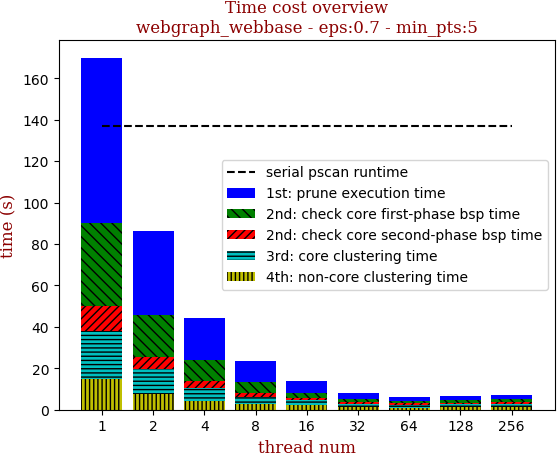 | 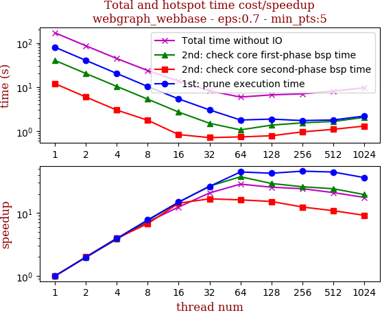

thread_num | prune | check-core 1st bsp | check-core 2nd bsp | cluster-core | cluster-non-core | total | total speedup
--- | --- | --- | --- | --- | --- | --- | ---
1 | 79.904s | 40.107s | 11.934s | 23.023s | 14.987s | 169.96s | 1.000
2 | 40.198s | 20.254s | 5.94s | 11.873s | 7.806s | 86.074s | 1.975
4 | 20.279s | 10.324s | 2.999s | 6.329s | 4.301s | 44.236s | 3.842
8 | 10.291s | 5.3s | 1.765s | 3.605s | 2.633s | 23.598s | 7.202
16 | 5.374s | 2.703s | 0.834s | 2.416s | 2.336s | 13.668s | 12.435
32 | 3.025s | 1.504s | 0.712s | 1.686s | 1.241s | 8.173s | 20.795
64 | 1.785s | 1.068s | 0.739s | 1.43s | 0.898s | 5.924s | 28.690
128 | 1.873s | 1.366s | 0.784s | 1.463s | 1.144s | 6.633s | 25.623
256 | 1.735s | 1.539s | 0.96s | 1.595s | 1.172s | 7.004s | 24.266

## eps:0.8

overview | speedup
--- | ---
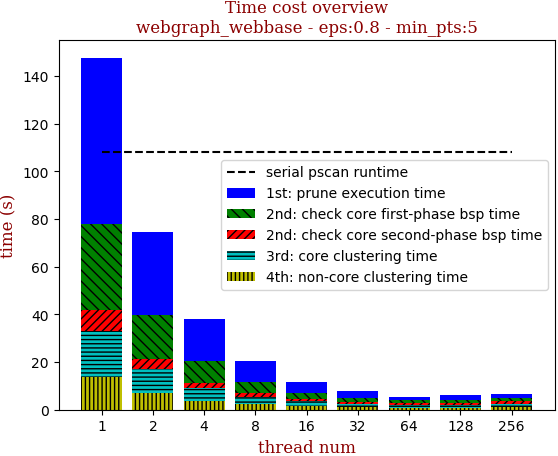 | 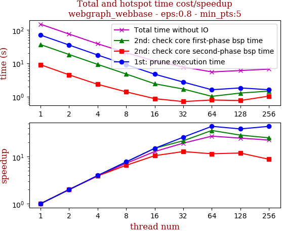

thread_num | prune | check-core 1st bsp | check-core 2nd bsp | cluster-core | cluster-non-core | total | total speedup
--- | --- | --- | --- | --- | --- | --- | ---
1 | 69.658s | 36.108s | 9.0s | 19.367s | 13.524s | 147.66s | 1.000
2 | 34.988s | 18.232s | 4.472s | 10.033s | 6.915s | 74.643s | 1.978
4 | 17.58s | 9.226s | 2.327s | 5.448s | 3.619s | 38.205s | 3.865
8 | 9.044s | 4.733s | 1.382s | 3.231s | 2.22s | 20.613s | 7.163
16 | 4.68s | 2.414s | 0.864s | 2.032s | 1.592s | 11.587s | 12.744
32 | 2.714s | 1.678s | 0.707s | 1.472s | 1.134s | 7.709s | 19.154
64 | 1.599s | 1.014s | 0.788s | 1.368s | 0.703s | 5.475s | 26.970
128 | 1.814s | 1.272s | 0.76s | 1.424s | 0.751s | 6.024s | 24.512
256 | 1.602s | 1.452s | 1.03s | 1.514s | 1.027s | 6.628s | 22.278

## eps:0.9

overview | speedup
--- | ---
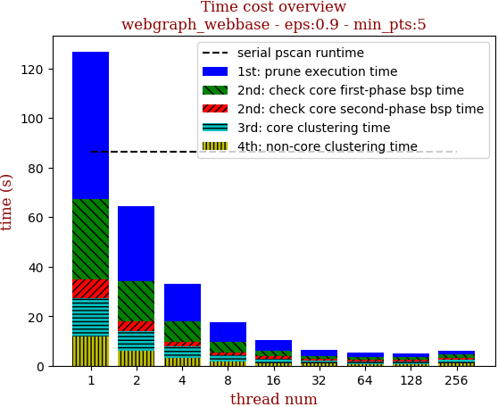 | 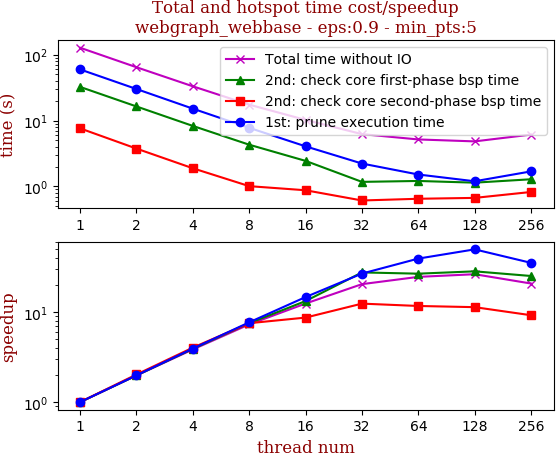

thread_num | prune | check-core 1st bsp | check-core 2nd bsp | cluster-core | cluster-non-core | total | total speedup
--- | --- | --- | --- | --- | --- | --- | ---
1 | 59.489s | 32.301s | 7.597s | 15.624s | 11.778s | 126.793s | 1.000
2 | 30.017s | 16.329s | 3.75s | 8.17s | 5.944s | 64.213s | 1.975
4 | 15.121s | 8.275s | 1.887s | 4.55s | 3.163s | 32.999s | 3.842
8 | 7.742s | 4.296s | 1.011s | 2.635s | 1.706s | 17.394s | 7.289
16 | 4.059s | 2.442s | 0.876s | 1.735s | 1.091s | 10.207s | 12.422
32 | 2.227s | 1.174s | 0.613s | 1.345s | 0.856s | 6.219s | 20.388
64 | 1.518s | 1.212s | 0.651s | 1.141s | 0.639s | 5.163s | 24.558
128 | 1.199s | 1.142s | 0.671s | 1.121s | 0.689s | 4.825s | 26.278
256 | 1.693s | 1.286s | 0.825s | 1.465s | 0.848s | 6.12s | 20.718

