## eps:0.1

with 40 full logical threads | with best thread num
--- | ---
 | 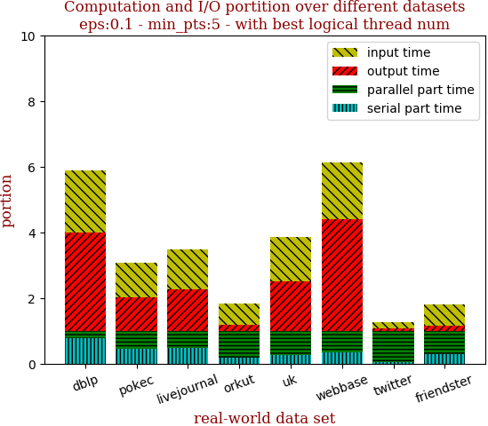
with 40 full logical threads | with best thread num
--- | ---
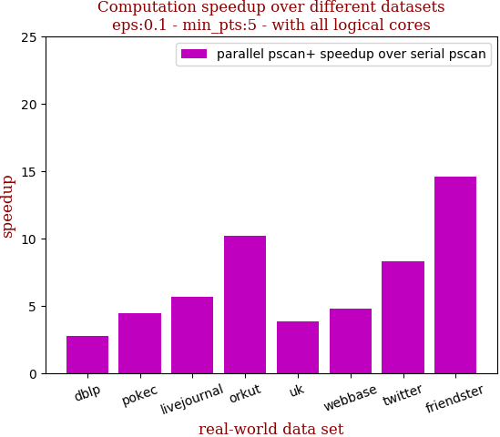 | 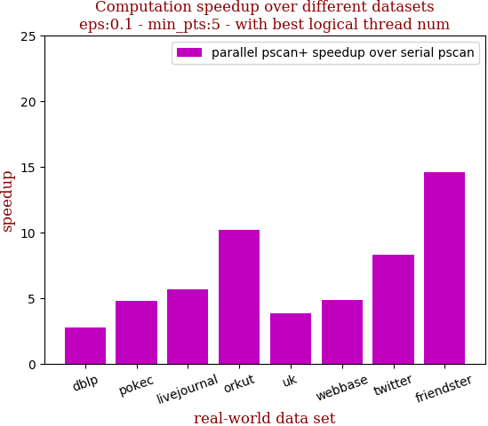

```zsh
best performance thread_num_lst:[40, 32, 40, 40, 40, 32, 40, 40]
```

dataset | edge num | pscan runtime | pscan+ 40 logical-core full speedup | pscan+ best thread_num speedup | thread_num choice
--- | --- | --- | --- | --- | ---
dblp | 2,099,732 | 0.318s | 2.765 | 2.765 | 40
pokec | 30,282,866 | 6.925s | 4.448 | 4.789 | 32
livejournal | 69,362,378 | 16.088s | 5.667 | 5.667 | 40
orkut | 234,370,166 | 149.207s | 10.191 | 10.191 | 40
uk | 301,136,554 | 37.3s | 3.834 | 3.834 | 40
webbase | 1,050,026,736 | 129.071s | 4.766 | 4.855 | 32
twitter | 1,369,000,750 | 2223.316s | 8.275 | 8.275 | 40
friendster | 3,612,134,270 | 4959.734s | 14.582 | 14.582 | 40

## eps:0.2

with 40 full logical threads | with best thread num
--- | ---
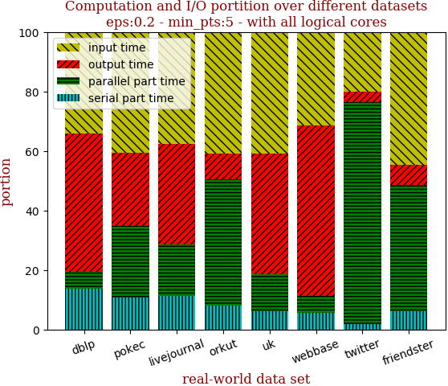 | 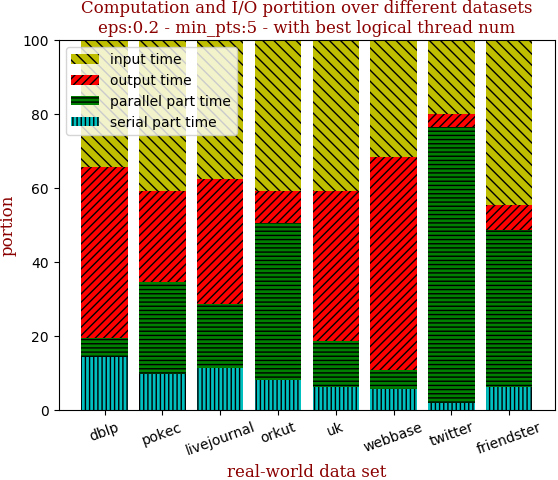
with 40 full logical threads | with best thread num
--- | ---
 | 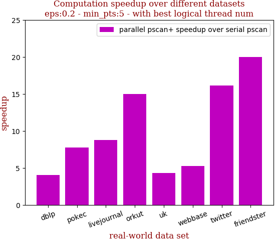

```zsh
best performance thread_num_lst:[32, 32, 40, 40, 40, 32, 40, 40]
```

dataset | edge num | pscan runtime | pscan+ 40 logical-core full speedup | pscan+ best thread_num speedup | thread_num choice
--- | --- | --- | --- | --- | ---
dblp | 2,099,732 | 0.504s | 3.969 | 4.065 | 32
pokec | 30,282,866 | 10.004s | 7.625 | 7.761 | 32
livejournal | 69,362,378 | 23.072s | 8.779 | 8.779 | 40
orkut | 234,370,166 | 179.55s | 14.961 | 14.961 | 40
uk | 301,136,554 | 26.048s | 4.325 | 4.325 | 40
webbase | 1,050,026,736 | 81.475s | 4.931 | 5.230 | 32
twitter | 1,369,000,750 | 2973.869s | 16.179 | 16.179 | 40
friendster | 3,612,134,270 | 4673.88s | 19.968 | 19.968 | 40

## eps:0.3

with 40 full logical threads | with best thread num
--- | ---
 | 
with 40 full logical threads | with best thread num
--- | ---
 | 

```zsh
best performance thread_num_lst:[40, 40, 40, 40, 32, 24, 40, 40]
```

dataset | edge num | pscan runtime | pscan+ 40 logical-core full speedup | pscan+ best thread_num speedup | thread_num choice
--- | --- | --- | --- | --- | ---
dblp | 2,099,732 | 0.555s | 4.703 | 4.703 | 40
pokec | 30,282,866 | 8.597s | 10.043 | 10.043 | 40
livejournal | 69,362,378 | 21.846s | 9.433 | 9.433 | 40
orkut | 234,370,166 | 164.248s | 16.992 | 16.992 | 40
uk | 301,136,554 | 18.498s | 4.301 | 4.487 | 32
webbase | 1,050,026,736 | 63.705s | 4.510 | 5.093 | 24
twitter | 1,369,000,750 | 2487.317s | 19.492 | 19.492 | 40
friendster | 3,612,134,270 | 3726.302s | 21.870 | 21.870 | 40

## eps:0.4

with 40 full logical threads | with best thread num
--- | ---
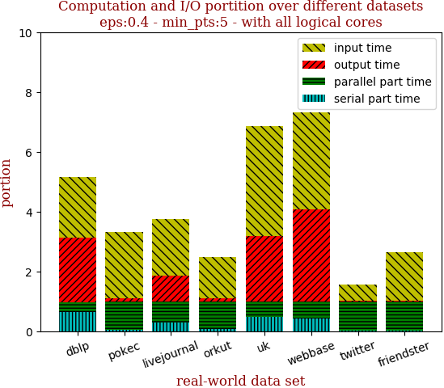 | 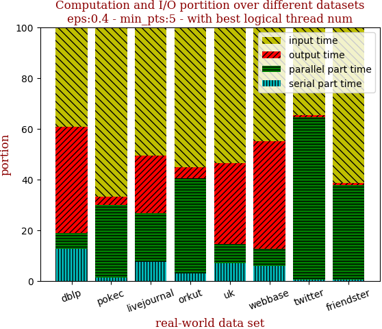
with 40 full logical threads | with best thread num
--- | ---
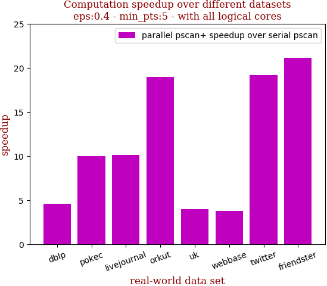 | 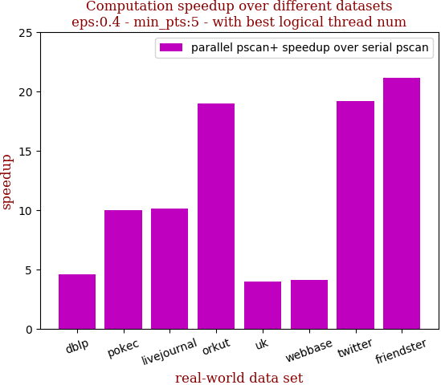

```zsh
best performance thread_num_lst:[40, 40, 40, 40, 40, 24, 40, 40]
```

dataset | edge num | pscan runtime | pscan+ 40 logical-core full speedup | pscan+ best thread_num speedup | thread_num choice
--- | --- | --- | --- | --- | ---
dblp | 2,099,732 | 0.491s | 4.589 | 4.589 | 40
pokec | 30,282,866 | 6.82s | 9.956 | 9.956 | 40
livejournal | 69,362,378 | 18.37s | 10.093 | 10.093 | 40
orkut | 234,370,166 | 135.772s | 19.008 | 19.008 | 40
uk | 301,136,554 | 14.356s | 3.971 | 3.971 | 40
webbase | 1,050,026,736 | 52.978s | 3.752 | 4.132 | 24
twitter | 1,369,000,750 | 1712.815s | 19.181 | 19.181 | 40
friendster | 3,612,134,270 | 2801.607s | 21.145 | 21.145 | 40

## eps:0.5

with 40 full logical threads | with best thread num
--- | ---
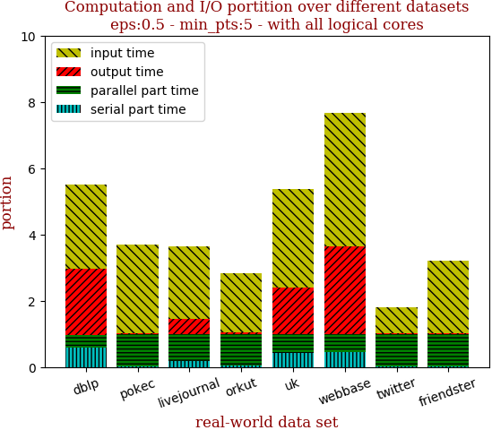 | 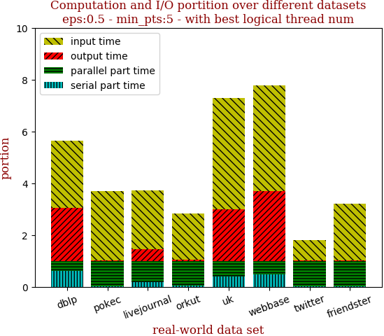
with 40 full logical threads | with best thread num
--- | ---
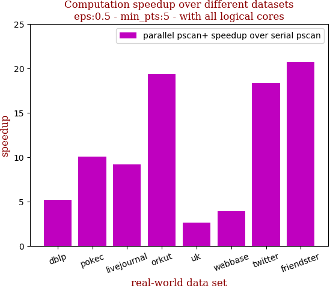 | 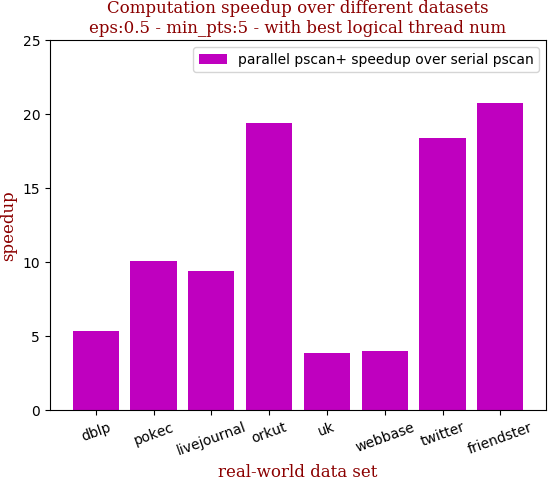

```zsh
best performance thread_num_lst:[24, 40, 32, 40, 24, 32, 40, 40]
```

dataset | edge num | pscan runtime | pscan+ 40 logical-core full speedup | pscan+ best thread_num speedup | thread_num choice
--- | --- | --- | --- | --- | ---
dblp | 2,099,732 | 0.441s | 5.188 | 5.313 | 24
pokec | 30,282,866 | 5.709s | 10.069 | 10.069 | 40
livejournal | 69,362,378 | 14.317s | 9.160 | 9.401 | 32
orkut | 234,370,166 | 105.36s | 19.393 | 19.393 | 40
uk | 301,136,554 | 11.721s | 2.644 | 3.808 | 24
webbase | 1,050,026,736 | 45.006s | 3.927 | 4.001 | 32
twitter | 1,369,000,750 | 1112.027s | 18.395 | 18.395 | 40
friendster | 3,612,134,270 | 2019.334s | 20.730 | 20.730 | 40

## eps:0.6

with 40 full logical threads | with best thread num
--- | ---
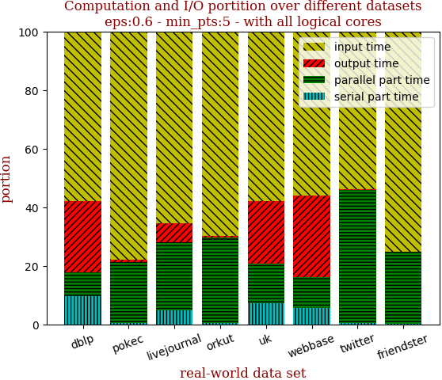 | 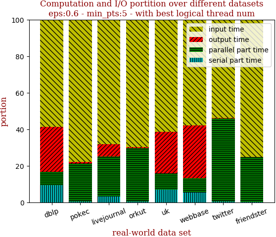
with 40 full logical threads | with best thread num
--- | ---
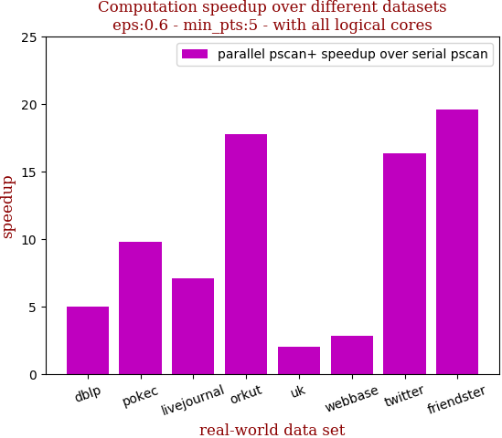 | 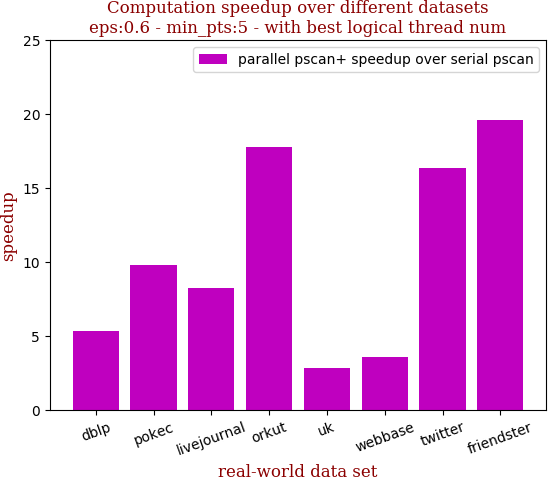

```zsh
best performance thread_num_lst:[32, 40, 32, 40, 16, 16, 40, 40]
```

dataset | edge num | pscan runtime | pscan+ 40 logical-core full speedup | pscan+ best thread_num speedup | thread_num choice
--- | --- | --- | --- | --- | ---
dblp | 2,099,732 | 0.346s | 5.014 | 5.323 | 32
pokec | 30,282,866 | 4.122s | 9.814 | 9.814 | 40
livejournal | 69,362,378 | 10.49s | 7.078 | 8.240 | 32
orkut | 234,370,166 | 73.887s | 17.796 | 17.796 | 40
uk | 301,136,554 | 9.737s | 2.041 | 2.849 | 16
webbase | 1,050,026,736 | 37.624s | 2.826 | 3.561 | 16
twitter | 1,369,000,750 | 671.103s | 16.381 | 16.381 | 40
friendster | 3,612,134,270 | 1382.493s | 19.565 | 19.565 | 40

## eps:0.7

with 40 full logical threads | with best thread num
--- | ---
 | 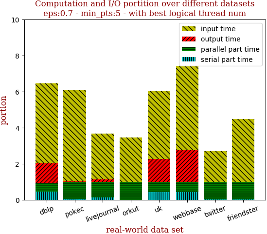
with 40 full logical threads | with best thread num
--- | ---
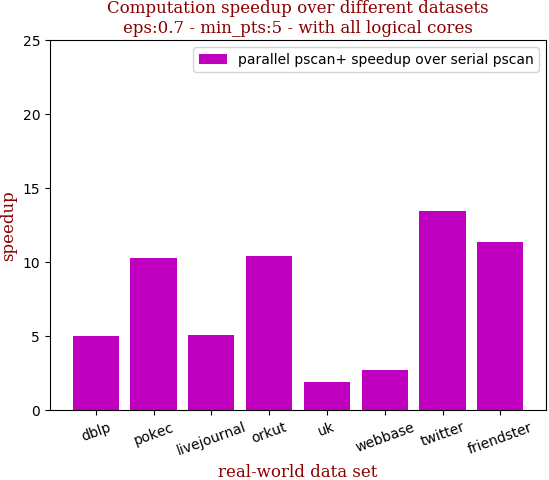 | 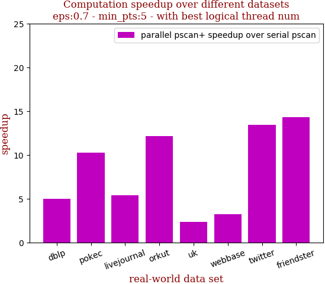

```zsh
best performance thread_num_lst:[40, 40, 24, 32, 24, 32, 40, 32]
```

dataset | edge num | pscan runtime | pscan+ 40 logical-core full speedup | pscan+ best thread_num speedup | thread_num choice
--- | --- | --- | --- | --- | ---
dblp | 2,099,732 | 0.245s | 5.000 | 5.000 | 40
pokec | 30,282,866 | 3.098s | 10.258 | 10.258 | 40
livejournal | 69,362,378 | 7.404s | 5.057 | 5.412 | 24
orkut | 234,370,166 | 48.46s | 10.417 | 12.155 | 32
uk | 301,136,554 | 8.152s | 1.892 | 2.316 | 24
webbase | 1,050,026,736 | 31.675s | 2.675 | 3.229 | 32
twitter | 1,369,000,750 | 378.662s | 13.440 | 13.440 | 40
friendster | 3,612,134,270 | 881.861s | 11.353 | 14.295 | 32

## eps:0.8

with 40 full logical threads | with best thread num
--- | ---
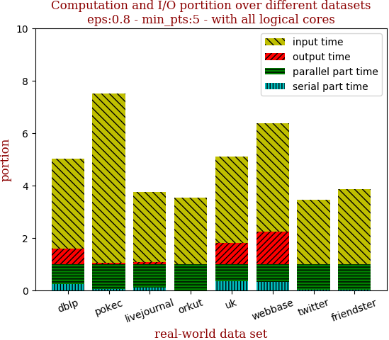 | 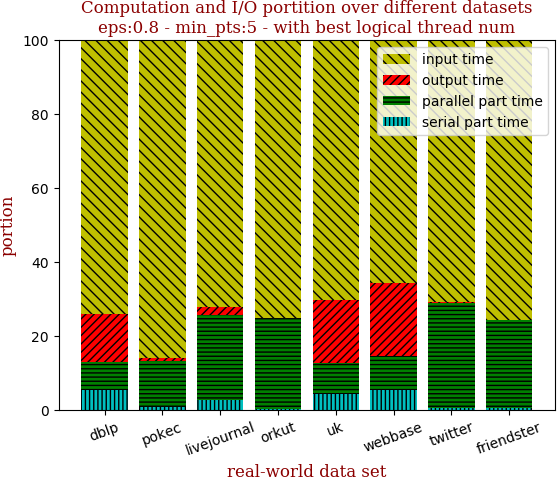
with 40 full logical threads | with best thread num
--- | ---
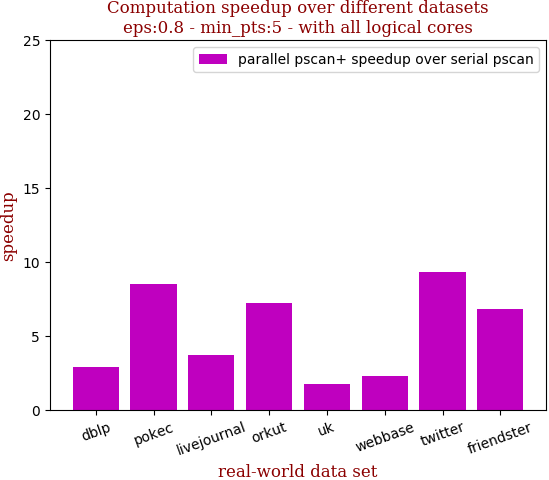 | 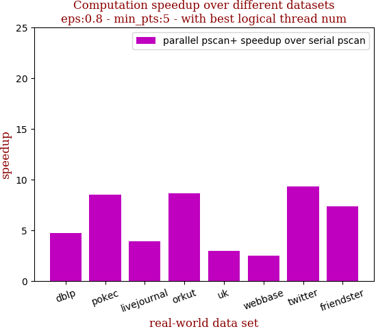

```zsh
best performance thread_num_lst:[24, 40, 32, 24, 32, 16, 40, 24]
```

dataset | edge num | pscan runtime | pscan+ 40 logical-core full speedup | pscan+ best thread_num speedup | thread_num choice
--- | --- | --- | --- | --- | ---
dblp | 2,099,732 | 0.183s | 2.905 | 4.692 | 24
pokec | 30,282,866 | 2.009s | 8.513 | 8.513 | 40
livejournal | 69,362,378 | 4.797s | 3.719 | 3.884 | 32
orkut | 234,370,166 | 27.708s | 7.202 | 8.616 | 24
uk | 301,136,554 | 7.054s | 1.763 | 2.942 | 32
webbase | 1,050,026,736 | 25.399s | 2.280 | 2.512 | 16
twitter | 1,369,000,750 | 183.012s | 9.342 | 9.342 | 40
friendster | 3,612,134,270 | 509.733s | 6.801 | 7.382 | 24

## eps:0.9

with 40 full logical threads | with best thread num
--- | ---
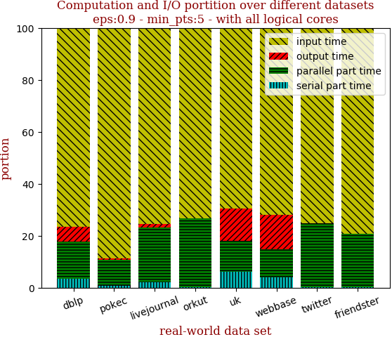 | 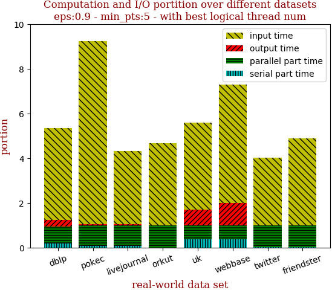
with 40 full logical threads | with best thread num
--- | ---
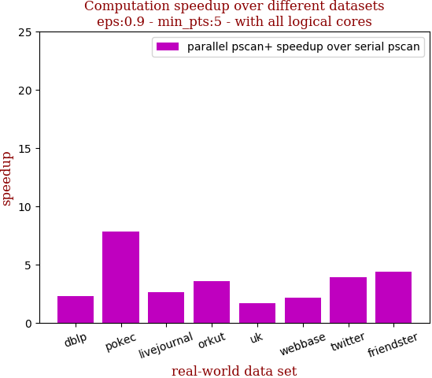 | 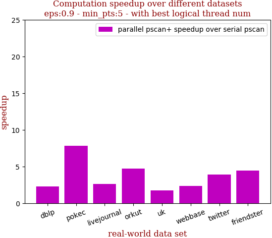

```zsh
best performance thread_num_lst:[40, 40, 40, 16, 24, 16, 40, 32]
```

dataset | edge num | pscan runtime | pscan+ 40 logical-core full speedup | pscan+ best thread_num speedup | thread_num choice
--- | --- | --- | --- | --- | ---
dblp | 2,099,732 | 0.121s | 2.283 | 2.283 | 40
pokec | 30,282,866 | 1.453s | 7.812 | 7.812 | 40
livejournal | 69,362,378 | 2.753s | 2.595 | 2.595 | 40
orkut | 234,370,166 | 12.535s | 3.533 | 4.741 | 16
uk | 301,136,554 | 5.814s | 1.677 | 1.714 | 24
webbase | 1,050,026,736 | 20.091s | 2.131 | 2.319 | 16
twitter | 1,369,000,750 | 61.578s | 3.890 | 3.890 | 40
friendster | 3,612,134,270 | 245.702s | 4.367 | 4.438 | 32

