## eps:0.1

overview | speedup
--- | ---
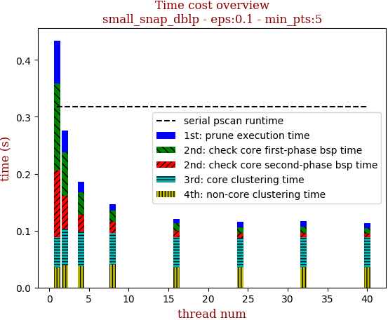 | 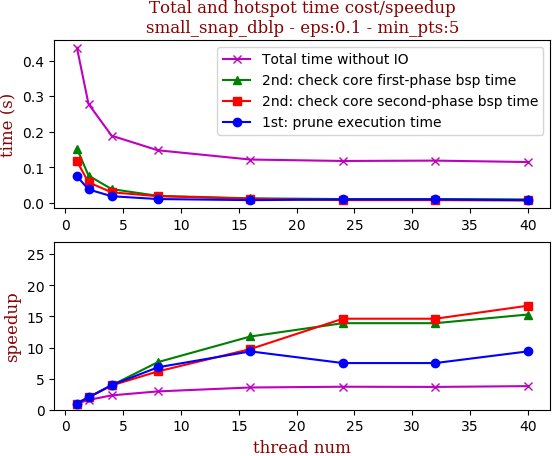

thread_num | prune | check-core 1st bsp | check-core 2nd bsp | cluster-core | cluster-non-core | total | total speedup
--- | --- | --- | --- | --- | --- | --- | ---
1 | 0.075s | 0.153s | 0.117s | 0.053s | 0.036s | 0.436s | 1.000
2 | 0.038s | 0.077s | 0.058s | 0.064s | 0.039s | 0.278s | 1.568
4 | 0.019s | 0.039s | 0.03s | 0.06s | 0.038s | 0.189s | 2.307
8 | 0.011s | 0.02s | 0.019s | 0.056s | 0.04s | 0.148s | 2.946
16 | 0.008s | 0.013s | 0.012s | 0.052s | 0.036s | 0.122s | 3.574
24 | 0.01s | 0.011s | 0.008s | 0.051s | 0.036s | 0.118s | 3.695
32 | 0.01s | 0.011s | 0.008s | 0.053s | 0.035s | 0.119s | 3.664
40 | 0.008s | 0.01s | 0.007s | 0.052s | 0.036s | 0.115s | 3.791

## eps:0.2

overview | speedup
--- | ---
 | 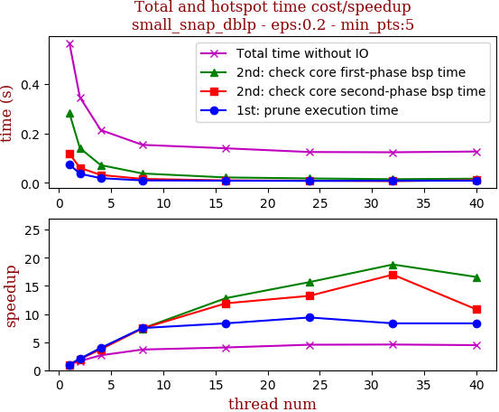

thread_num | prune | check-core 1st bsp | check-core 2nd bsp | cluster-core | cluster-non-core | total | total speedup
--- | --- | --- | --- | --- | --- | --- | ---
1 | 0.075s | 0.282s | 0.119s | 0.051s | 0.036s | 0.566s | 1.000
2 | 0.037s | 0.141s | 0.061s | 0.063s | 0.042s | 0.347s | 1.631
4 | 0.019s | 0.072s | 0.032s | 0.052s | 0.037s | 0.214s | 2.645
8 | 0.01s | 0.038s | 0.016s | 0.051s | 0.036s | 0.154s | 3.675
16 | 0.009s | 0.022s | 0.01s | 0.06s | 0.036s | 0.14s | 4.043
24 | 0.008s | 0.018s | 0.009s | 0.051s | 0.037s | 0.125s | 4.528
32 | 0.009s | 0.015s | 0.007s | 0.052s | 0.039s | 0.124s | 4.565
40 | 0.009s | 0.017s | 0.011s | 0.05s | 0.037s | 0.127s | 4.457

## eps:0.3

overview | speedup
--- | ---
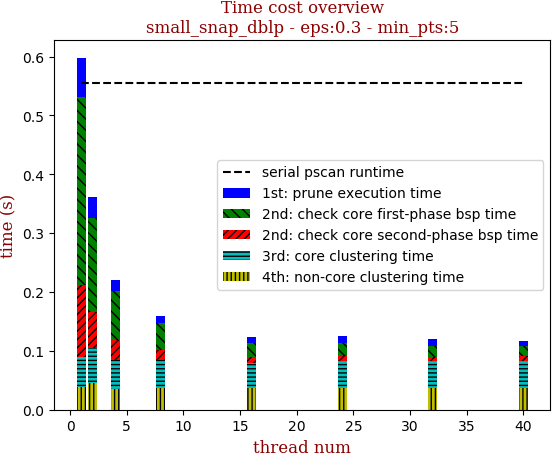 | 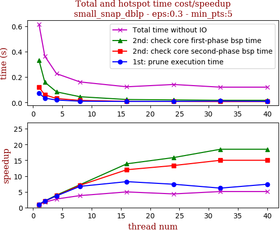

thread_num | prune | check-core 1st bsp | check-core 2nd bsp | cluster-core | cluster-non-core | total | total speedup
--- | --- | --- | --- | --- | --- | --- | ---
1 | 0.066s | 0.32s | 0.122s | 0.052s | 0.038s | 0.599s | 1.000
2 | 0.035s | 0.16s | 0.061s | 0.059s | 0.046s | 0.364s | 1.646
4 | 0.019s | 0.082s | 0.034s | 0.049s | 0.036s | 0.221s | 2.710
8 | 0.011s | 0.046s | 0.017s | 0.048s | 0.037s | 0.162s | 3.698
16 | 0.009s | 0.024s | 0.01s | 0.043s | 0.037s | 0.124s | 4.831
24 | 0.012s | 0.023s | 0.009s | 0.045s | 0.037s | 0.128s | 4.680
32 | 0.012s | 0.018s | 0.008s | 0.045s | 0.037s | 0.121s | 4.950
40 | 0.009s | 0.017s | 0.009s | 0.045s | 0.037s | 0.118s | 5.076

## eps:0.4

overview | speedup
--- | ---
 | 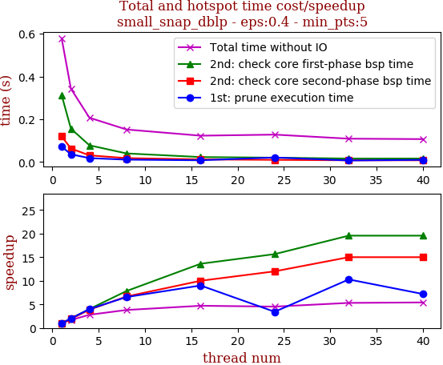

thread_num | prune | check-core 1st bsp | check-core 2nd bsp | cluster-core | cluster-non-core | total | total speedup
--- | --- | --- | --- | --- | --- | --- | ---
1 | 0.072s | 0.313s | 0.12s | 0.037s | 0.034s | 0.579s | 1.000
2 | 0.036s | 0.156s | 0.063s | 0.045s | 0.041s | 0.343s | 1.688
4 | 0.018s | 0.078s | 0.031s | 0.043s | 0.035s | 0.207s | 2.797
8 | 0.011s | 0.04s | 0.018s | 0.043s | 0.038s | 0.152s | 3.809
16 | 0.008s | 0.023s | 0.012s | 0.04s | 0.038s | 0.123s | 4.707
24 | 0.021s | 0.02s | 0.01s | 0.04s | 0.035s | 0.128s | 4.523
32 | 0.007s | 0.016s | 0.008s | 0.039s | 0.037s | 0.109s | 5.312
40 | 0.01s | 0.016s | 0.008s | 0.036s | 0.034s | 0.107s | 5.411

## eps:0.5

overview | speedup
--- | ---
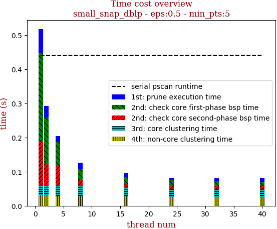 | 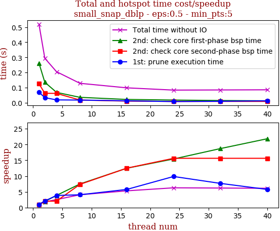

thread_num | prune | check-core 1st bsp | check-core 2nd bsp | cluster-core | cluster-non-core | total | total speedup
--- | --- | --- | --- | --- | --- | --- | ---
1 | 0.069s | 0.262s | 0.125s | 0.032s | 0.03s | 0.52s | 1.000
2 | 0.033s | 0.135s | 0.062s | 0.032s | 0.03s | 0.294s | 1.769
4 | 0.018s | 0.068s | 0.061s | 0.03s | 0.027s | 0.205s | 2.537
8 | 0.017s | 0.035s | 0.017s | 0.029s | 0.028s | 0.128s | 4.062
16 | 0.012s | 0.021s | 0.01s | 0.026s | 0.027s | 0.098s | 5.306
24 | 0.007s | 0.017s | 0.008s | 0.024s | 0.026s | 0.083s | 6.265
32 | 0.009s | 0.014s | 0.008s | 0.024s | 0.026s | 0.084s | 6.190
40 | 0.012s | 0.012s | 0.008s | 0.024s | 0.026s | 0.085s | 6.118

## eps:0.6

overview | speedup
--- | ---
 | 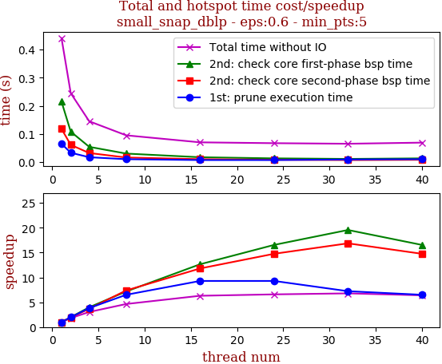

thread_num | prune | check-core 1st bsp | check-core 2nd bsp | cluster-core | cluster-non-core | total | total speedup
--- | --- | --- | --- | --- | --- | --- | ---
1 | 0.065s | 0.215s | 0.118s | 0.021s | 0.019s | 0.441s | 1.000
2 | 0.033s | 0.108s | 0.061s | 0.021s | 0.019s | 0.245s | 1.800
4 | 0.017s | 0.054s | 0.032s | 0.021s | 0.019s | 0.145s | 3.041
8 | 0.01s | 0.03s | 0.016s | 0.018s | 0.019s | 0.095s | 4.642
16 | 0.007s | 0.017s | 0.01s | 0.016s | 0.018s | 0.07s | 6.300
24 | 0.007s | 0.013s | 0.008s | 0.016s | 0.021s | 0.067s | 6.582
32 | 0.009s | 0.011s | 0.007s | 0.017s | 0.018s | 0.065s | 6.785
40 | 0.01s | 0.013s | 0.008s | 0.017s | 0.019s | 0.069s | 6.391

## eps:0.7

overview | speedup
--- | ---
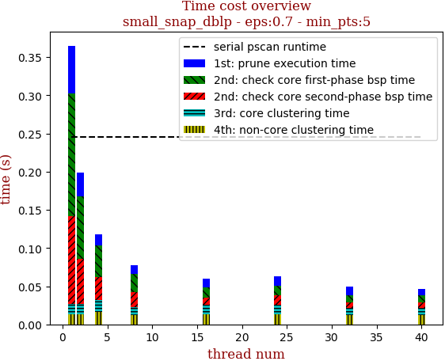 | 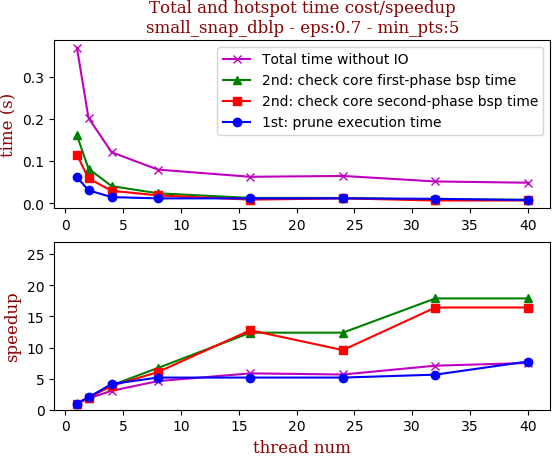

thread_num | prune | check-core 1st bsp | check-core 2nd bsp | cluster-core | cluster-non-core | total | total speedup
--- | --- | --- | --- | --- | --- | --- | ---
1 | 0.062s | 0.161s | 0.115s | 0.014s | 0.013s | 0.368s | 1.000
2 | 0.031s | 0.082s | 0.059s | 0.014s | 0.013s | 0.202s | 1.822
4 | 0.015s | 0.041s | 0.03s | 0.016s | 0.016s | 0.121s | 3.041
8 | 0.012s | 0.024s | 0.019s | 0.011s | 0.012s | 0.08s | 4.600
16 | 0.012s | 0.013s | 0.009s | 0.013s | 0.013s | 0.063s | 5.841
24 | 0.012s | 0.013s | 0.012s | 0.013s | 0.013s | 0.065s | 5.662
32 | 0.011s | 0.009s | 0.007s | 0.01s | 0.012s | 0.052s | 7.077
40 | 0.008s | 0.009s | 0.007s | 0.01s | 0.012s | 0.049s | 7.510

## eps:0.8

overview | speedup
--- | ---
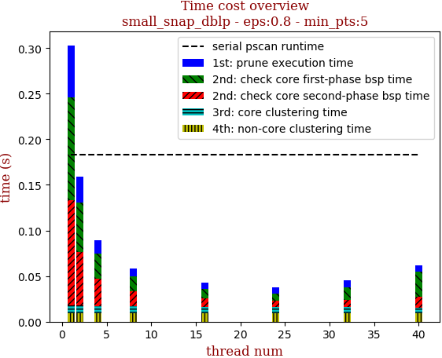 | 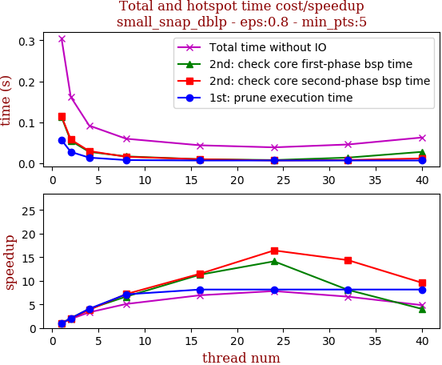

thread_num | prune | check-core 1st bsp | check-core 2nd bsp | cluster-core | cluster-non-core | total | total speedup
--- | --- | --- | --- | --- | --- | --- | ---
1 | 0.057s | 0.113s | 0.115s | 0.009s | 0.009s | 0.305s | 1.000
2 | 0.028s | 0.055s | 0.058s | 0.009s | 0.009s | 0.162s | 1.883
4 | 0.014s | 0.028s | 0.03s | 0.008s | 0.009s | 0.092s | 3.315
8 | 0.008s | 0.017s | 0.016s | 0.008s | 0.009s | 0.06s | 5.083
16 | 0.007s | 0.01s | 0.01s | 0.007s | 0.009s | 0.044s | 6.932
24 | 0.007s | 0.008s | 0.007s | 0.007s | 0.009s | 0.039s | 7.821
32 | 0.007s | 0.014s | 0.008s | 0.007s | 0.009s | 0.046s | 6.630
40 | 0.007s | 0.028s | 0.012s | 0.006s | 0.009s | 0.063s | 4.841

## eps:0.9

overview | speedup
--- | ---
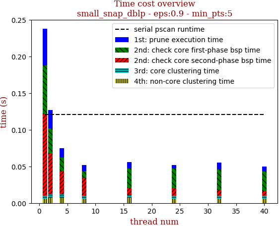 | 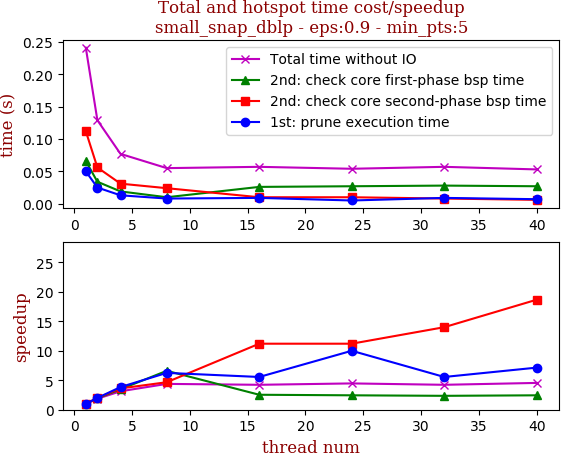

thread_num | prune | check-core 1st bsp | check-core 2nd bsp | cluster-core | cluster-non-core | total | total speedup
--- | --- | --- | --- | --- | --- | --- | ---
1 | 0.05s | 0.066s | 0.112s | 0.004s | 0.006s | 0.241s | 1.000
2 | 0.025s | 0.034s | 0.056s | 0.005s | 0.007s | 0.129s | 1.868
4 | 0.013s | 0.019s | 0.031s | 0.005s | 0.007s | 0.077s | 3.130
8 | 0.008s | 0.01s | 0.024s | 0.004s | 0.006s | 0.055s | 4.382
16 | 0.009s | 0.026s | 0.01s | 0.004s | 0.007s | 0.057s | 4.228
24 | 0.005s | 0.027s | 0.01s | 0.004s | 0.006s | 0.054s | 4.463
32 | 0.009s | 0.028s | 0.008s | 0.004s | 0.006s | 0.057s | 4.228
40 | 0.007s | 0.027s | 0.006s | 0.004s | 0.006s | 0.053s | 4.547

