## eps:0.1

overview | speedup
--- | ---
 | 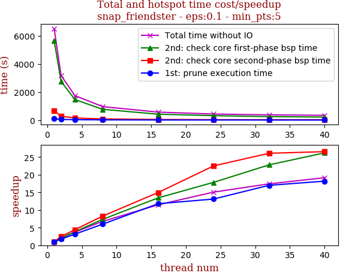

thread_num | prune | check-core 1st bsp | check-core 2nd bsp | cluster-core | cluster-non-core | total | total speedup
--- | --- | --- | --- | --- | --- | --- | ---
1 | 92.772s | 5643.261s | 681.008s | 44.241s | 50.303s | 6511.588s | 1.000
2 | 52.888s | 2749.401s | 272.274s | 44.288s | 50.413s | 3169.266s | 2.055
4 | 29.251s | 1461.936s | 153.358s | 44.425s | 50.312s | 1739.286s | 3.744
8 | 15.457s | 767.167s | 82.305s | 43.89s | 50.097s | 958.921s | 6.791
16 | 7.877s | 419.739s | 45.532s | 43.835s | 50.456s | 567.442s | 11.475
24 | 7.078s | 316.304s | 30.267s | 37.656s | 40.766s | 432.073s | 15.071
32 | 5.458s | 247.609s | 26.116s | 44.117s | 50.755s | 374.057s | 17.408
40 | 5.104s | 215.5s | 25.663s | 43.58s | 50.271s | 340.119s | 19.145

## eps:0.2

overview | speedup
--- | ---
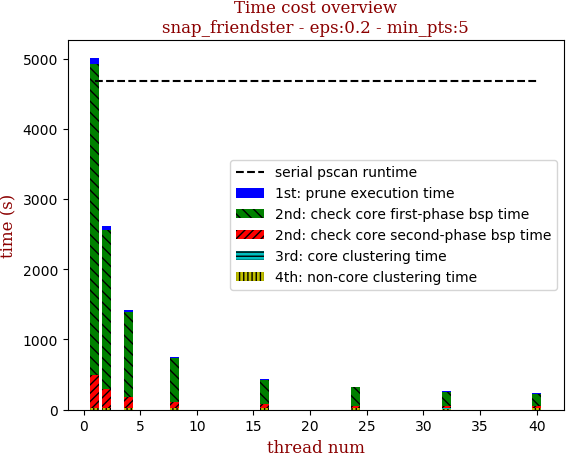 | 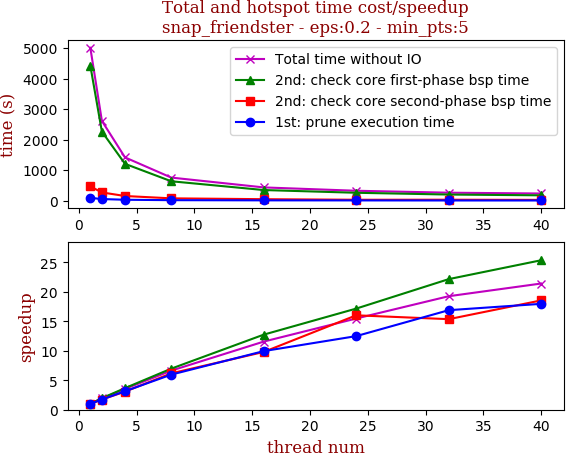

thread_num | prune | check-core 1st bsp | check-core 2nd bsp | cluster-core | cluster-non-core | total | total speedup
--- | --- | --- | --- | --- | --- | --- | ---
1 | 90.819s | 4425.364s | 465.797s | 10.911s | 18.765s | 5011.66s | 1.000
2 | 52.394s | 2262.593s | 268.843s | 11.223s | 18.814s | 2613.869s | 1.917
4 | 28.941s | 1206.525s | 151.738s | 11.249s | 18.908s | 1417.363s | 3.536
8 | 15.254s | 635.069s | 75.496s | 11.148s | 18.925s | 755.894s | 6.630
16 | 9.133s | 347.383s | 47.513s | 10.933s | 18.618s | 433.582s | 11.559
24 | 7.273s | 257.928s | 29.081s | 10.692s | 18.909s | 323.885s | 15.474
32 | 5.378s | 199.747s | 30.322s | 9.614s | 15.196s | 260.26s | 19.256
40 | 5.056s | 174.503s | 25.114s | 10.58s | 18.818s | 234.074s | 21.411

## eps:0.3

overview | speedup
--- | ---
 | 

thread_num | prune | check-core 1st bsp | check-core 2nd bsp | cluster-core | cluster-non-core | total | total speedup
--- | --- | --- | --- | --- | --- | --- | ---
1 | 129.735s | 3601.164s | 676.276s | 2.005s | 3.623s | 4412.806s | 1.000
2 | 51.745s | 1744.762s | 269.821s | 2.457s | 4.156s | 2072.944s | 2.129
4 | 28.604s | 901.12s | 153.828s | 2.304s | 4.056s | 1089.915s | 4.049
8 | 14.952s | 488.046s | 83.168s | 2.476s | 4.598s | 593.242s | 7.438
16 | 8.752s | 266.732s | 37.824s | 2.045s | 4.386s | 319.74s | 13.801
24 | 7.065s | 197.572s | 28.773s | 1.887s | 4.472s | 239.771s | 18.404
32 | 5.652s | 151.077s | 25.713s | 1.84s | 4.169s | 188.454s | 23.416
40 | 5.09s | 131.622s | 27.593s | 1.867s | 4.207s | 170.383s | 25.899

## eps:0.4

overview | speedup
--- | ---
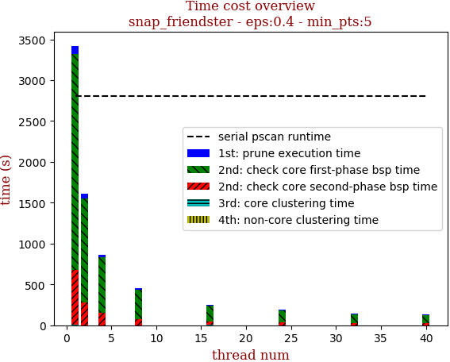 | 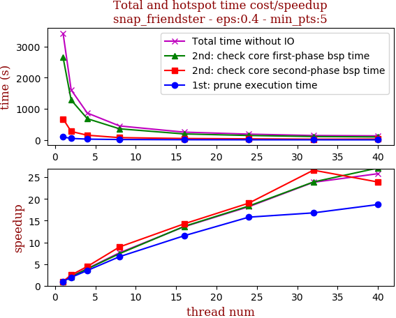

thread_num | prune | check-core 1st bsp | check-core 2nd bsp | cluster-core | cluster-non-core | total | total speedup
--- | --- | --- | --- | --- | --- | --- | ---
1 | 95.848s | 2647.163s | 675.556s | 0.574s | 1.916s | 3421.061s | 1.000
2 | 49.792s | 1280.697s | 273.765s | 0.544s | 1.159s | 1605.962s | 2.130
4 | 27.31s | 682.896s | 152.143s | 0.622s | 1.333s | 864.307s | 3.958
8 | 14.294s | 357.708s | 75.506s | 0.586s | 1.569s | 449.668s | 7.608
16 | 8.319s | 193.54s | 47.346s | 0.567s | 1.72s | 251.493s | 13.603
24 | 6.065s | 144.146s | 35.483s | 0.573s | 1.55s | 187.82s | 18.215
32 | 5.708s | 110.712s | 25.369s | 0.347s | 1.378s | 143.516s | 23.837
40 | 5.123s | 97.568s | 28.265s | 0.347s | 1.188s | 132.494s | 25.820

## eps:0.5

overview | speedup
--- | ---
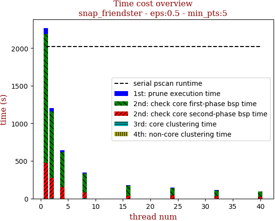 | 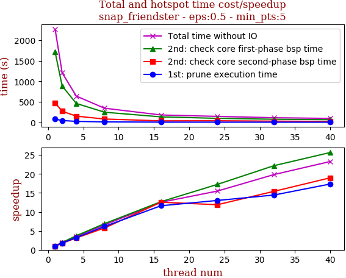

thread_num | prune | check-core 1st bsp | check-core 2nd bsp | cluster-core | cluster-non-core | total | total speedup
--- | --- | --- | --- | --- | --- | --- | ---
1 | 81.224s | 1709.935s | 474.675s | 0.19s | 1.172s | 2267.201s | 1.000
2 | 46.111s | 884.12s | 272.675s | 0.341s | 1.169s | 1204.419s | 1.882
4 | 25.159s | 461.316s | 152.498s | 0.186s | 1.174s | 640.338s | 3.541
8 | 13.211s | 248.134s | 82.548s | 0.172s | 1.352s | 345.42s | 6.564
16 | 6.996s | 134.919s | 37.87s | 0.111s | 1.133s | 181.032s | 12.524
24 | 6.246s | 99.191s | 39.938s | 0.107s | 0.974s | 146.461s | 15.480
32 | 5.63s | 77.149s | 30.827s | 0.107s | 0.671s | 114.388s | 19.820
40 | 4.684s | 66.669s | 25.011s | 0.13s | 0.915s | 97.412s | 23.274

## eps:0.6

overview | speedup
--- | ---
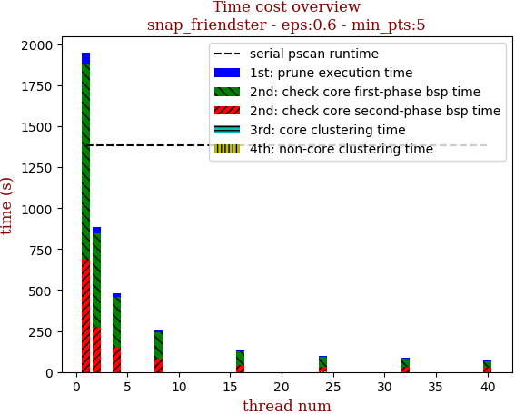 | 

thread_num | prune | check-core 1st bsp | check-core 2nd bsp | cluster-core | cluster-non-core | total | total speedup
--- | --- | --- | --- | --- | --- | --- | ---
1 | 72.349s | 1193.881s | 683.325s | 0.073s | 1.07s | 1950.704s | 1.000
2 | 39.891s | 569.529s | 273.19s | 0.218s | 0.973s | 883.805s | 2.207
4 | 21.896s | 302.181s | 153.513s | 0.105s | 1.09s | 478.792s | 4.074
8 | 11.702s | 157.504s | 83.555s | 0.085s | 0.652s | 253.501s | 7.695
16 | 5.824s | 82.721s | 40.657s | 0.072s | 0.887s | 130.163s | 14.987
24 | 4.716s | 61.452s | 28.196s | 0.063s | 5.133s | 99.561s | 19.593
32 | 4.995s | 47.709s | 31.464s | 0.058s | 0.791s | 85.025s | 22.943
40 | 4.193s | 41.098s | 24.566s | 0.053s | 0.748s | 70.662s | 27.606

## eps:0.7

overview | speedup
--- | ---
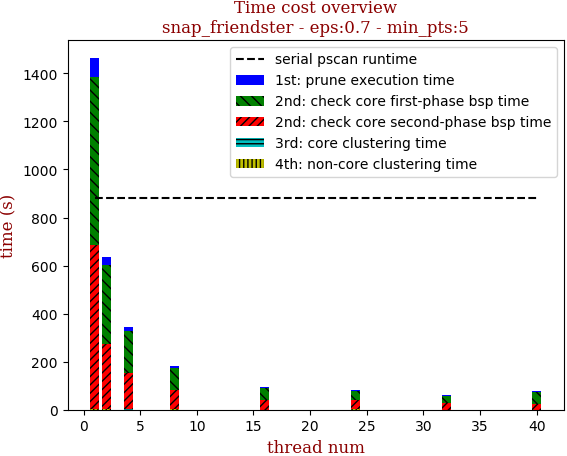 | 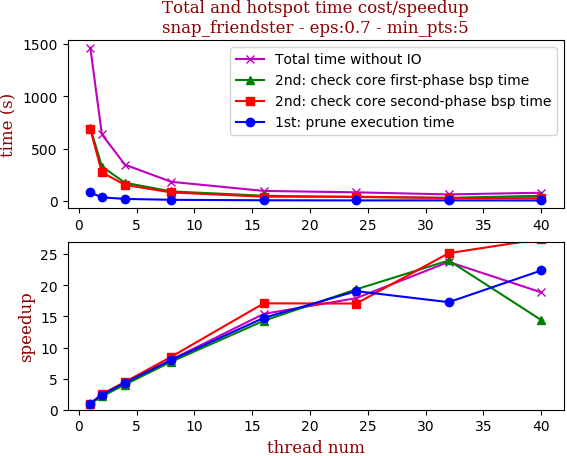

thread_num | prune | check-core 1st bsp | check-core 2nd bsp | cluster-core | cluster-non-core | total | total speedup
--- | --- | --- | --- | --- | --- | --- | ---
1 | 80.756s | 699.372s | 683.988s | 0.059s | 1.043s | 1465.221s | 1.000
2 | 33.654s | 328.756s | 272.411s | 0.069s | 0.968s | 635.861s | 2.304
4 | 18.566s | 173.112s | 153.116s | 0.086s | 0.924s | 345.806s | 4.237
8 | 10.117s | 90.62s | 80.39s | 0.066s | 1.072s | 182.268s | 8.039
16 | 5.472s | 48.937s | 40.011s | 0.043s | 0.687s | 95.153s | 15.399
24 | 4.238s | 36.147s | 40.072s | 0.08s | 1.174s | 81.717s | 17.930
32 | 4.672s | 29.157s | 27.185s | 0.041s | 0.632s | 61.691s | 23.751
40 | 3.609s | 48.511s | 24.924s | 0.036s | 0.594s | 77.676s | 18.863

## eps:0.8

overview | speedup
--- | ---
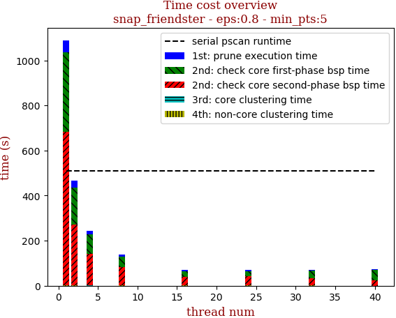 | 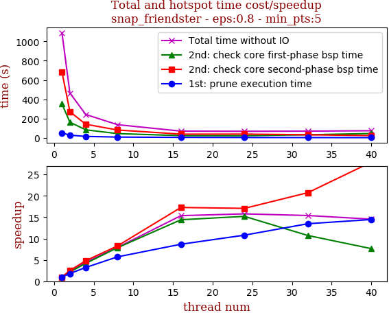

thread_num | prune | check-core 1st bsp | check-core 2nd bsp | cluster-core | cluster-non-core | total | total speedup
--- | --- | --- | --- | --- | --- | --- | ---
1 | 52.101s | 352.887s | 683.103s | 0.053s | 1.046s | 1089.196s | 1.000
2 | 28.888s | 163.206s | 271.827s | 0.056s | 0.953s | 464.932s | 2.343
4 | 16.121s | 84.368s | 141.911s | 0.028s | 0.676s | 243.111s | 4.480
8 | 9.128s | 44.959s | 82.576s | 0.06s | 0.916s | 137.642s | 7.913
16 | 6.014s | 24.51s | 39.544s | 0.041s | 0.809s | 70.92s | 15.358
24 | 4.83s | 23.229s | 40.042s | 0.054s | 0.892s | 69.049s | 15.774
32 | 3.869s | 32.942s | 32.943s | 0.054s | 0.981s | 70.792s | 15.386
40 | 3.606s | 46.239s | 24.497s | 0.03s | 0.57s | 74.945s | 14.533

## eps:0.9

overview | speedup
--- | ---
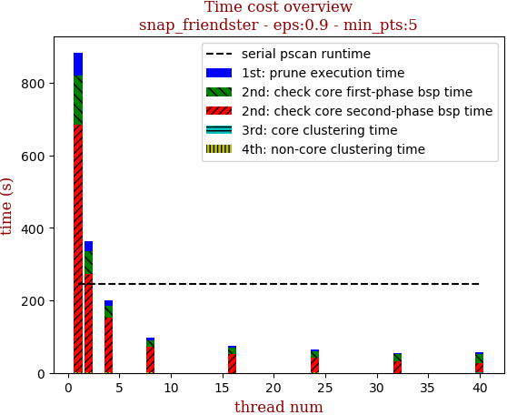 | 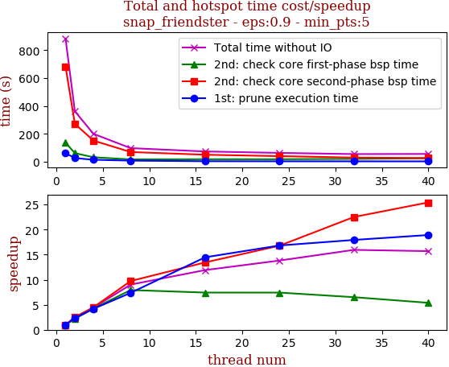

thread_num | prune | check-core 1st bsp | check-core 2nd bsp | cluster-core | cluster-non-core | total | total speedup
--- | --- | --- | --- | --- | --- | --- | ---
1 | 62.284s | 137.625s | 682.332s | 0.049s | 1.003s | 883.297s | 1.000
2 | 26.809s | 62.269s | 272.005s | 0.059s | 0.932s | 362.078s | 2.440
4 | 14.886s | 32.611s | 151.935s | 0.047s | 0.979s | 200.461s | 4.406
8 | 8.452s | 17.349s | 70.143s | 0.055s | 1.954s | 97.956s | 9.017
16 | 4.305s | 18.537s | 50.742s | 0.024s | 0.521s | 74.131s | 11.915
24 | 3.701s | 18.548s | 40.648s | 0.053s | 0.957s | 63.909s | 13.821
32 | 3.473s | 21.157s | 30.303s | 0.026s | 0.406s | 55.367s | 15.953
40 | 3.292s | 25.569s | 26.834s | 0.025s | 0.535s | 56.258s | 15.701

