## eps:0.1

overview | speedup
--- | ---
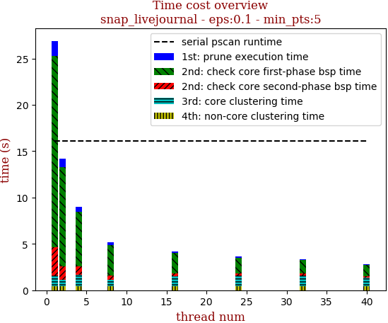 | 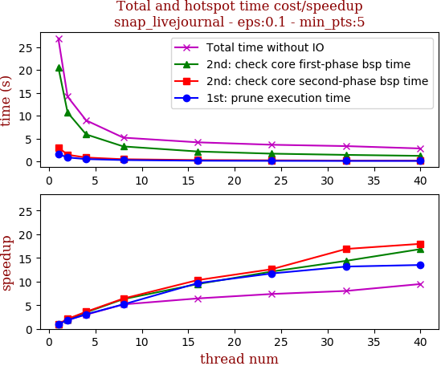

thread_num | prune | check-core 1st bsp | check-core 2nd bsp | cluster-core | cluster-non-core | total | total speedup
--- | --- | --- | --- | --- | --- | --- | ---
1 | 1.593s | 20.632s | 3.091s | 1.132s | 0.452s | 26.902s | 1.000
2 | 0.874s | 10.695s | 1.466s | 0.723s | 0.405s | 14.164s | 1.899
4 | 0.516s | 5.908s | 0.854s | 1.242s | 0.452s | 8.975s | 2.997
8 | 0.308s | 3.285s | 0.483s | 0.722s | 0.405s | 5.204s | 5.169
16 | 0.165s | 2.181s | 0.3s | 1.083s | 0.452s | 4.183s | 6.431
24 | 0.136s | 1.703s | 0.245s | 1.119s | 0.446s | 3.65s | 7.370
32 | 0.121s | 1.435s | 0.183s | 1.183s | 0.431s | 3.355s | 8.018
40 | 0.118s | 1.224s | 0.172s | 0.874s | 0.451s | 2.839s | 9.476

## eps:0.2

overview | speedup
--- | ---
 | 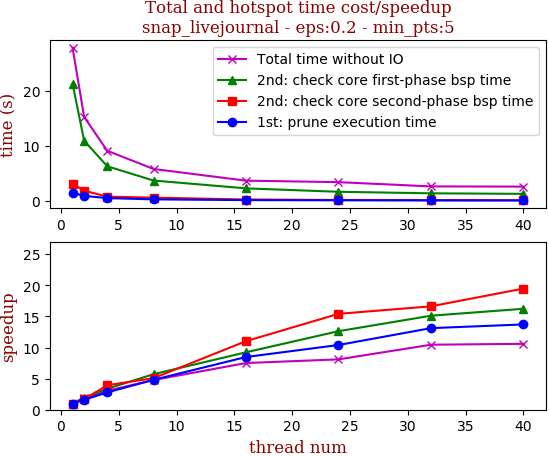

thread_num | prune | check-core 1st bsp | check-core 2nd bsp | cluster-core | cluster-non-core | total | total speedup
--- | --- | --- | --- | --- | --- | --- | ---
1 | 1.508s | 21.319s | 3.174s | 1.267s | 0.562s | 27.832s | 1.000
2 | 0.946s | 10.958s | 1.881s | 1.024s | 0.463s | 15.274s | 1.822
4 | 0.541s | 6.322s | 0.807s | 0.98s | 0.483s | 9.135s | 3.047
8 | 0.314s | 3.733s | 0.626s | 0.697s | 0.461s | 5.833s | 4.771
16 | 0.178s | 2.31s | 0.288s | 0.544s | 0.387s | 3.709s | 7.504
24 | 0.145s | 1.689s | 0.206s | 0.921s | 0.475s | 3.439s | 8.093
32 | 0.115s | 1.411s | 0.191s | 0.562s | 0.382s | 2.664s | 10.447
40 | 0.11s | 1.314s | 0.163s | 0.633s | 0.406s | 2.628s | 10.591

## eps:0.3

overview | speedup
--- | ---
 | 

thread_num | prune | check-core 1st bsp | check-core 2nd bsp | cluster-core | cluster-non-core | total | total speedup
--- | --- | --- | --- | --- | --- | --- | ---
1 | 1.416s | 18.79s | 3.129s | 0.764s | 0.406s | 24.507s | 1.000
2 | 0.94s | 9.729s | 1.798s | 0.478s | 0.449s | 13.396s | 1.829
4 | 0.517s | 5.458s | 0.789s | 0.704s | 0.399s | 7.869s | 3.114
8 | 0.265s | 3.194s | 0.447s | 0.369s | 0.308s | 4.585s | 5.345
16 | 0.168s | 1.984s | 0.259s | 0.538s | 0.43s | 3.381s | 7.248
24 | 0.124s | 1.582s | 0.257s | 0.368s | 0.306s | 2.638s | 9.290
32 | 0.12s | 1.226s | 0.227s | 0.531s | 0.387s | 2.494s | 9.826
40 | 0.101s | 1.238s | 0.172s | 0.431s | 0.373s | 2.316s | 10.582

## eps:0.4

overview | speedup
--- | ---
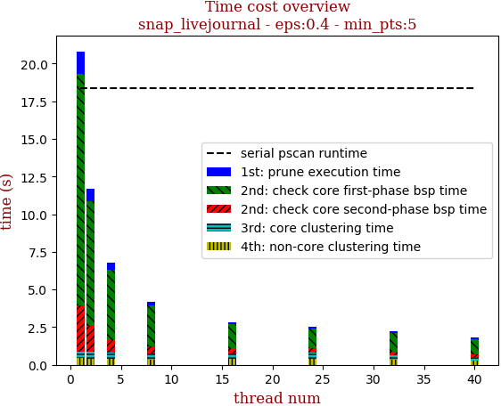 | 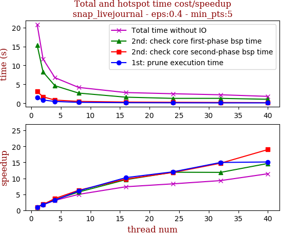

thread_num | prune | check-core 1st bsp | check-core 2nd bsp | cluster-core | cluster-non-core | total | total speedup
--- | --- | --- | --- | --- | --- | --- | ---
1 | 1.482s | 15.376s | 3.08s | 0.428s | 0.436s | 20.806s | 1.000
2 | 0.854s | 8.253s | 1.704s | 0.486s | 0.396s | 11.697s | 1.779
4 | 0.474s | 4.638s | 0.839s | 0.436s | 0.375s | 6.764s | 3.076
8 | 0.244s | 2.693s | 0.493s | 0.413s | 0.338s | 4.183s | 4.974
16 | 0.145s | 1.605s | 0.315s | 0.376s | 0.384s | 2.827s | 7.360
24 | 0.123s | 1.291s | 0.26s | 0.432s | 0.406s | 2.513s | 8.279
32 | 0.099s | 1.296s | 0.209s | 0.312s | 0.321s | 2.24s | 9.288
40 | 0.098s | 1.049s | 0.162s | 0.258s | 0.25s | 1.82s | 11.432

## eps:0.5

overview | speedup
--- | ---
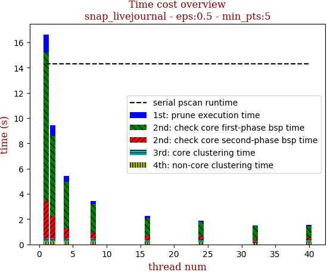 | 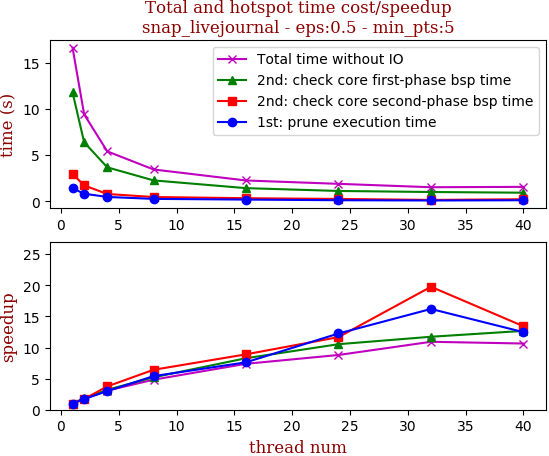

thread_num | prune | check-core 1st bsp | check-core 2nd bsp | cluster-core | cluster-non-core | total | total speedup
--- | --- | --- | --- | --- | --- | --- | ---
1 | 1.409s | 11.785s | 2.964s | 0.231s | 0.237s | 16.629s | 1.000
2 | 0.819s | 6.396s | 1.722s | 0.24s | 0.234s | 9.416s | 1.766
4 | 0.471s | 3.678s | 0.791s | 0.227s | 0.236s | 5.407s | 3.075
8 | 0.261s | 2.264s | 0.462s | 0.222s | 0.237s | 3.447s | 4.824
16 | 0.185s | 1.424s | 0.333s | 0.155s | 0.155s | 2.253s | 7.381
24 | 0.115s | 1.119s | 0.254s | 0.239s | 0.162s | 1.89s | 8.798
32 | 0.087s | 1.005s | 0.15s | 0.141s | 0.138s | 1.523s | 10.919
40 | 0.113s | 0.93s | 0.221s | 0.135s | 0.162s | 1.563s | 10.639

## eps:0.6

overview | speedup
--- | ---
 | 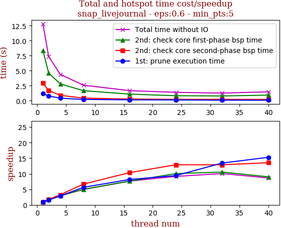

thread_num | prune | check-core 1st bsp | check-core 2nd bsp | cluster-core | cluster-non-core | total | total speedup
--- | --- | --- | --- | --- | --- | --- | ---
1 | 1.223s | 8.392s | 2.925s | 0.134s | 0.132s | 12.808s | 1.000
2 | 0.797s | 4.602s | 1.703s | 0.13s | 0.123s | 7.359s | 1.740
4 | 0.423s | 2.81s | 0.9s | 0.136s | 0.132s | 4.403s | 2.909
8 | 0.217s | 1.681s | 0.439s | 0.129s | 0.117s | 2.586s | 4.953
16 | 0.15s | 1.099s | 0.282s | 0.073s | 0.073s | 1.68s | 7.624
24 | 0.13s | 0.835s | 0.227s | 0.104s | 0.1s | 1.399s | 9.155
32 | 0.091s | 0.796s | 0.227s | 0.079s | 0.078s | 1.273s | 10.061
40 | 0.08s | 0.931s | 0.216s | 0.129s | 0.124s | 1.482s | 8.642

## eps:0.7

overview | speedup
--- | ---
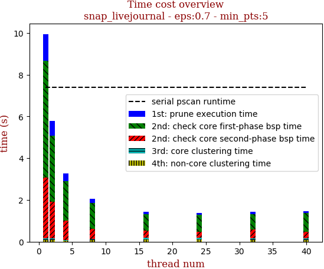 | 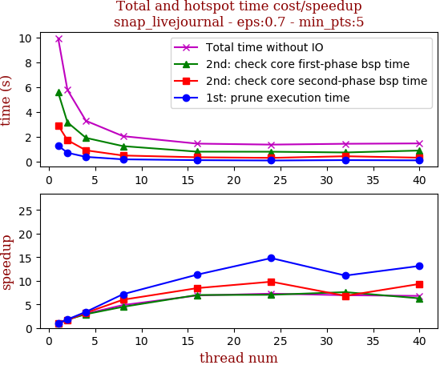

thread_num | prune | check-core 1st bsp | check-core 2nd bsp | cluster-core | cluster-non-core | total | total speedup
--- | --- | --- | --- | --- | --- | --- | ---
1 | 1.288s | 5.575s | 2.921s | 0.087s | 0.076s | 9.949s | 1.000
2 | 0.709s | 3.167s | 1.73s | 0.087s | 0.084s | 5.78s | 1.721
4 | 0.377s | 1.91s | 0.906s | 0.045s | 0.045s | 3.286s | 3.028
8 | 0.18s | 1.245s | 0.488s | 0.063s | 0.07s | 2.049s | 4.856
16 | 0.114s | 0.798s | 0.346s | 0.092s | 0.094s | 1.446s | 6.880
24 | 0.087s | 0.793s | 0.298s | 0.094s | 0.094s | 1.368s | 7.273
32 | 0.116s | 0.734s | 0.429s | 0.077s | 0.077s | 1.434s | 6.938
40 | 0.098s | 0.888s | 0.313s | 0.083s | 0.08s | 1.464s | 6.796

## eps:0.8

overview | speedup
--- | ---
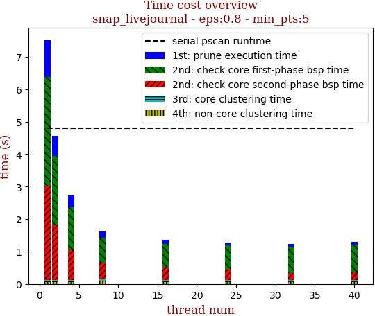 | 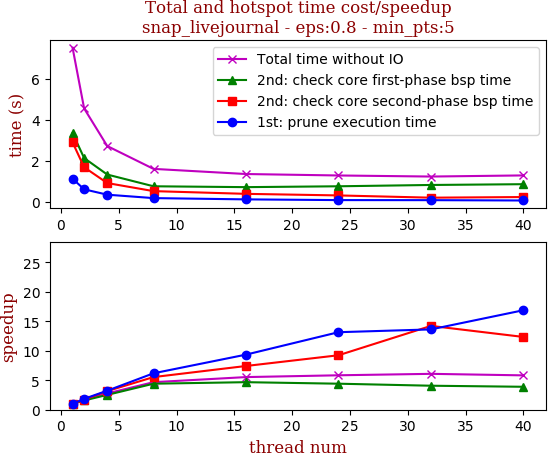

thread_num | prune | check-core 1st bsp | check-core 2nd bsp | cluster-core | cluster-non-core | total | total speedup
--- | --- | --- | --- | --- | --- | --- | ---
1 | 1.131s | 3.355s | 2.901s | 0.063s | 0.065s | 7.518s | 1.000
2 | 0.612s | 2.137s | 1.689s | 0.058s | 0.059s | 4.557s | 1.650
4 | 0.35s | 1.332s | 0.917s | 0.061s | 0.06s | 2.723s | 2.761
8 | 0.183s | 0.76s | 0.524s | 0.065s | 0.074s | 1.609s | 4.672
16 | 0.121s | 0.718s | 0.391s | 0.06s | 0.065s | 1.358s | 5.536
24 | 0.086s | 0.76s | 0.314s | 0.059s | 0.066s | 1.287s | 5.841
32 | 0.083s | 0.824s | 0.204s | 0.058s | 0.063s | 1.235s | 6.087
40 | 0.067s | 0.862s | 0.235s | 0.059s | 0.064s | 1.29s | 5.828

## eps:0.9

overview | speedup
--- | ---
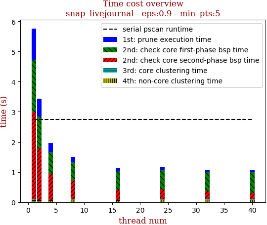 | 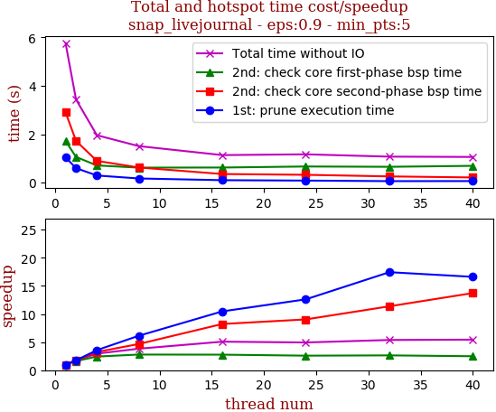

thread_num | prune | check-core 1st bsp | check-core 2nd bsp | cluster-core | cluster-non-core | total | total speedup
--- | --- | --- | --- | --- | --- | --- | ---
1 | 1.046s | 1.72s | 2.909s | 0.038s | 0.05s | 5.766s | 1.000
2 | 0.597s | 1.06s | 1.724s | 0.022s | 0.032s | 3.437s | 1.678
4 | 0.293s | 0.709s | 0.897s | 0.022s | 0.034s | 1.958s | 2.945
8 | 0.171s | 0.619s | 0.625s | 0.038s | 0.054s | 1.509s | 3.821
16 | 0.1s | 0.623s | 0.354s | 0.023s | 0.034s | 1.137s | 5.071
24 | 0.083s | 0.666s | 0.322s | 0.039s | 0.057s | 1.169s | 4.932
32 | 0.06s | 0.653s | 0.256s | 0.042s | 0.06s | 1.073s | 5.374
40 | 0.063s | 0.693s | 0.212s | 0.038s | 0.053s | 1.061s | 5.434

