## eps:0.1

overview | speedup
--- | ---
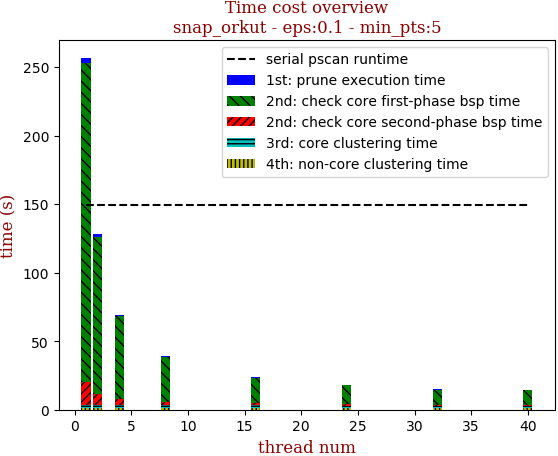 | 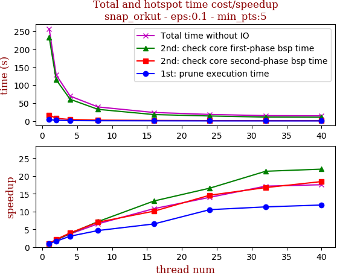

thread_num | prune | check-core 1st bsp | check-core 2nd bsp | cluster-core | cluster-non-core | total | total speedup
--- | --- | --- | --- | --- | --- | --- | ---
1 | 3.823s | 233.108s | 16.569s | 2.287s | 1.075s | 256.863s | 1.000
2 | 2.314s | 114.917s | 7.707s | 2.338s | 1.063s | 128.341s | 2.001
4 | 1.246s | 60.505s | 4.138s | 2.396s | 1.086s | 69.373s | 3.703
8 | 0.821s | 32.482s | 2.364s | 2.417s | 1.087s | 39.172s | 6.557
16 | 0.587s | 17.976s | 1.64s | 2.486s | 1.065s | 23.756s | 10.813
24 | 0.363s | 14.063s | 1.135s | 1.694s | 1.088s | 18.346s | 14.001
32 | 0.338s | 10.929s | 0.99s | 1.664s | 1.058s | 14.982s | 17.145
40 | 0.323s | 10.63s | 0.899s | 1.706s | 1.08s | 14.641s | 17.544

## eps:0.2

overview | speedup
--- | ---
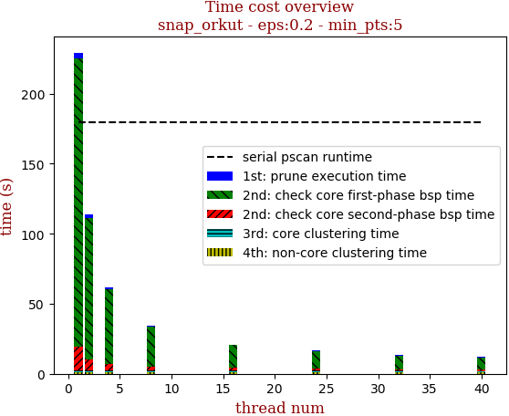 | 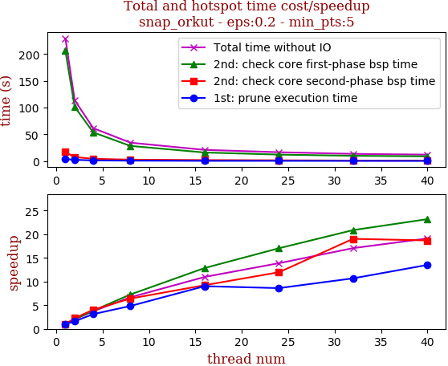

thread_num | prune | check-core 1st bsp | check-core 2nd bsp | cluster-core | cluster-non-core | total | total speedup
--- | --- | --- | --- | --- | --- | --- | ---
1 | 3.823s | 205.909s | 16.955s | 1.667s | 0.988s | 229.347s | 1.000
2 | 2.379s | 101.412s | 7.516s | 1.55s | 0.94s | 113.799s | 2.015
4 | 1.229s | 53.607s | 4.196s | 1.522s | 0.943s | 61.499s | 3.729
8 | 0.791s | 28.348s | 2.648s | 1.619s | 0.969s | 34.377s | 6.672
16 | 0.424s | 16.014s | 1.838s | 1.641s | 0.985s | 20.903s | 10.972
24 | 0.444s | 12.087s | 1.417s | 1.608s | 0.968s | 16.527s | 13.877
32 | 0.358s | 9.864s | 0.891s | 1.279s | 1.047s | 13.441s | 17.063
40 | 0.283s | 8.88s | 0.907s | 1.061s | 0.87s | 12.001s | 19.111

## eps:0.3

overview | speedup
--- | ---
 | 

thread_num | prune | check-core 1st bsp | check-core 2nd bsp | cluster-core | cluster-non-core | total | total speedup
--- | --- | --- | --- | --- | --- | --- | ---
1 | 3.861s | 163.193s | 16.555s | 0.992s | 0.753s | 185.356s | 1.000
2 | 2.201s | 83.07s | 7.35s | 1.006s | 0.752s | 94.381s | 1.964
4 | 1.301s | 42.57s | 4.142s | 1.006s | 0.748s | 49.77s | 3.724
8 | 0.726s | 23.727s | 2.366s | 1.036s | 0.745s | 28.601s | 6.481
16 | 0.436s | 13.147s | 1.58s | 0.942s | 0.738s | 16.845s | 11.004
24 | 0.433s | 9.955s | 1.164s | 0.921s | 0.746s | 13.221s | 14.020
32 | 0.371s | 8.131s | 1.007s | 0.595s | 0.599s | 10.706s | 17.313
40 | 0.449s | 7.131s | 0.899s | 0.591s | 0.595s | 9.666s | 19.176

## eps:0.4

overview | speedup
--- | ---
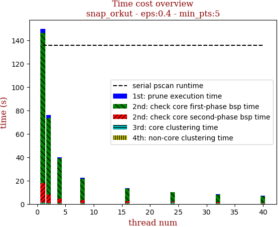 | 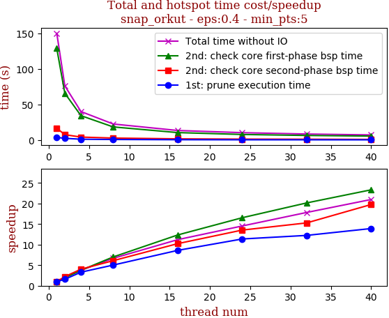

thread_num | prune | check-core 1st bsp | check-core 2nd bsp | cluster-core | cluster-non-core | total | total speedup
--- | --- | --- | --- | --- | --- | --- | ---
1 | 3.673s | 128.555s | 16.595s | 0.501s | 0.501s | 149.832s | 1.000
2 | 2.342s | 65.603s | 7.483s | 0.244s | 0.277s | 75.954s | 1.973
4 | 1.114s | 34.184s | 4.123s | 0.251s | 0.282s | 39.956s | 3.750
8 | 0.731s | 18.365s | 2.722s | 0.295s | 0.348s | 22.464s | 6.670
16 | 0.427s | 10.411s | 1.621s | 0.464s | 0.446s | 13.371s | 11.206
24 | 0.323s | 7.773s | 1.226s | 0.498s | 0.487s | 10.309s | 14.534
32 | 0.3s | 6.382s | 1.086s | 0.273s | 0.364s | 8.407s | 17.822
40 | 0.264s | 5.51s | 0.84s | 0.247s | 0.28s | 7.143s | 20.976

## eps:0.5

overview | speedup
--- | ---
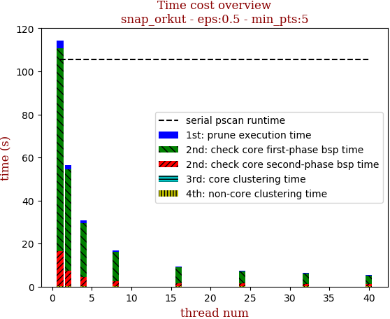 | 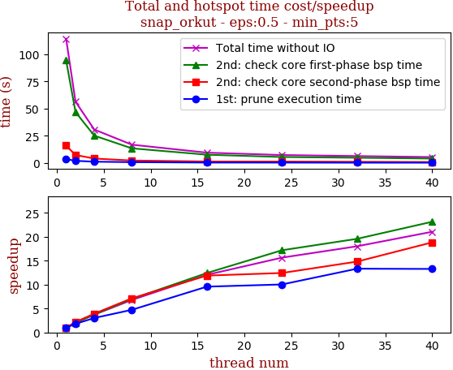

thread_num | prune | check-core 1st bsp | check-core 2nd bsp | cluster-core | cluster-non-core | total | total speedup
--- | --- | --- | --- | --- | --- | --- | ---
1 | 3.572s | 94.463s | 15.987s | 0.149s | 0.202s | 114.375s | 1.000
2 | 1.986s | 46.916s | 7.347s | 0.08s | 0.096s | 56.427s | 2.027
4 | 1.181s | 25.156s | 4.073s | 0.153s | 0.207s | 30.773s | 3.717
8 | 0.755s | 13.473s | 2.241s | 0.152s | 0.216s | 16.84s | 6.792
16 | 0.373s | 7.602s | 1.345s | 0.076s | 0.096s | 9.494s | 12.047
24 | 0.356s | 5.496s | 1.286s | 0.078s | 0.094s | 7.312s | 15.642
32 | 0.268s | 4.825s | 1.079s | 0.077s | 0.098s | 6.348s | 18.017
40 | 0.269s | 4.082s | 0.849s | 0.093s | 0.138s | 5.433s | 21.052

## eps:0.6

overview | speedup
--- | ---
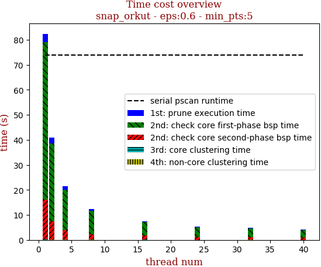 | 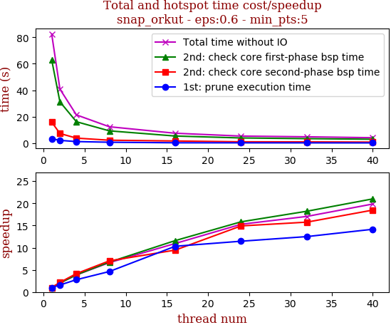

thread_num | prune | check-core 1st bsp | check-core 2nd bsp | cluster-core | cluster-non-core | total | total speedup
--- | --- | --- | --- | --- | --- | --- | ---
1 | 3.425s | 62.934s | 15.964s | 0.036s | 0.052s | 82.413s | 1.000
2 | 2.156s | 31.232s | 7.352s | 0.039s | 0.059s | 40.84s | 2.018
4 | 1.233s | 16.223s | 3.848s | 0.028s | 0.06s | 21.394s | 3.852
8 | 0.741s | 9.335s | 2.272s | 0.028s | 0.055s | 12.433s | 6.629
16 | 0.332s | 5.428s | 1.689s | 0.031s | 0.049s | 7.532s | 10.942
24 | 0.299s | 3.975s | 1.071s | 0.018s | 0.031s | 5.395s | 15.276
32 | 0.274s | 3.454s | 1.013s | 0.031s | 0.058s | 4.833s | 17.052
40 | 0.242s | 2.996s | 0.864s | 0.02s | 0.027s | 4.152s | 19.849

## eps:0.7

overview | speedup
--- | ---
 | 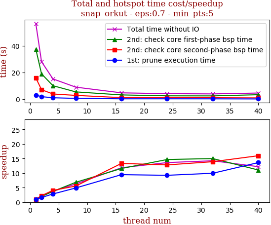

thread_num | prune | check-core 1st bsp | check-core 2nd bsp | cluster-core | cluster-non-core | total | total speedup
--- | --- | --- | --- | --- | --- | --- | ---
1 | 3.131s | 37.574s | 15.999s | 0.013s | 0.024s | 56.743s | 1.000
2 | 1.941s | 19.043s | 7.139s | 0.005s | 0.023s | 28.153s | 2.016
4 | 1.112s | 10.146s | 3.942s | 0.011s | 0.025s | 15.237s | 3.724
8 | 0.641s | 5.5s | 2.887s | 0.004s | 0.024s | 9.057s | 6.265
16 | 0.331s | 3.246s | 1.201s | 0.002s | 0.012s | 4.794s | 11.836
24 | 0.339s | 2.563s | 1.249s | 0.003s | 0.014s | 4.17s | 13.607
32 | 0.315s | 2.506s | 1.15s | 0.002s | 0.012s | 3.987s | 14.232
40 | 0.23s | 3.401s | 1.002s | 0.003s | 0.013s | 4.652s | 12.198

## eps:0.8

overview | speedup
--- | ---
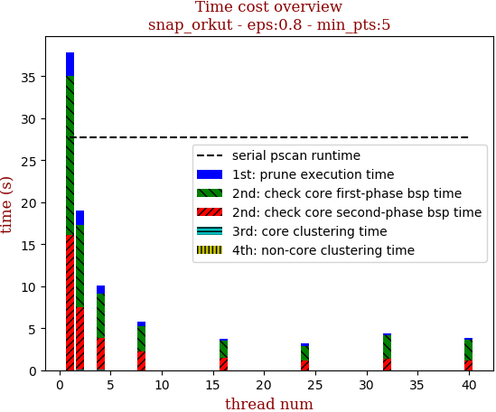 | 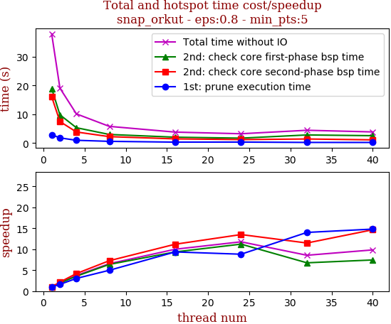

thread_num | prune | check-core 1st bsp | check-core 2nd bsp | cluster-core | cluster-non-core | total | total speedup
--- | --- | --- | --- | --- | --- | --- | ---
1 | 2.873s | 18.912s | 16.058s | 0.001s | 0.02s | 37.866s | 1.000
2 | 1.782s | 9.786s | 7.456s | 0.006s | 0.02s | 19.052s | 1.988
4 | 0.947s | 5.311s | 3.827s | 0.005s | 0.02s | 10.111s | 3.745
8 | 0.577s | 2.965s | 2.211s | 0.001s | 0.02s | 5.776s | 6.556
16 | 0.307s | 2.021s | 1.434s | 0.001s | 0.02s | 3.786s | 10.002
24 | 0.326s | 1.686s | 1.189s | 0.0s | 0.013s | 3.216s | 11.774
32 | 0.205s | 2.798s | 1.398s | 0.001s | 0.02s | 4.424s | 8.559
40 | 0.194s | 2.542s | 1.096s | 0.001s | 0.013s | 3.847s | 9.843

## eps:0.9

overview | speedup
--- | ---
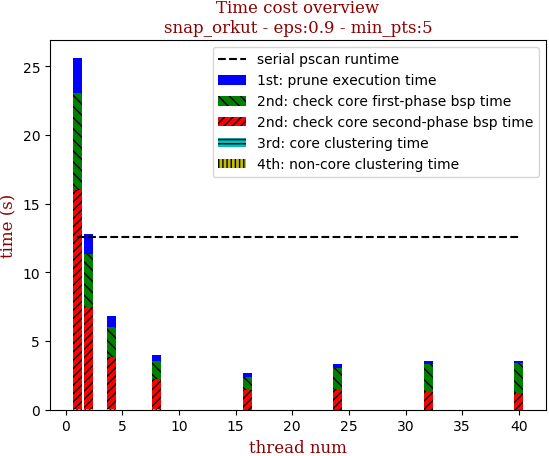 | 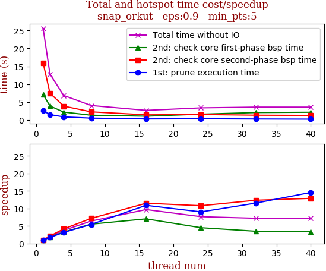

thread_num | prune | check-core 1st bsp | check-core 2nd bsp | cluster-core | cluster-non-core | total | total speedup
--- | --- | --- | --- | --- | --- | --- | ---
1 | 2.551s | 7.087s | 15.96s | 0.0s | 0.02s | 25.621s | 1.000
2 | 1.466s | 3.865s | 7.453s | 0.0s | 0.02s | 12.806s | 2.001
4 | 0.806s | 2.159s | 3.829s | 0.0s | 0.02s | 6.817s | 3.758
8 | 0.468s | 1.283s | 2.228s | 0.002s | 0.02s | 4.002s | 6.402
16 | 0.234s | 1.008s | 1.388s | 0.001s | 0.011s | 2.644s | 9.690
24 | 0.283s | 1.571s | 1.479s | 0.0s | 0.012s | 3.347s | 7.655
32 | 0.221s | 2.028s | 1.292s | 0.0s | 0.012s | 3.555s | 7.207
40 | 0.175s | 2.12s | 1.238s | 0.0s | 0.013s | 3.548s | 7.221

