## eps:0.1

overview | speedup
--- | ---
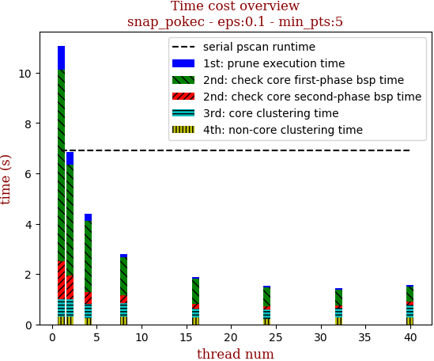 | 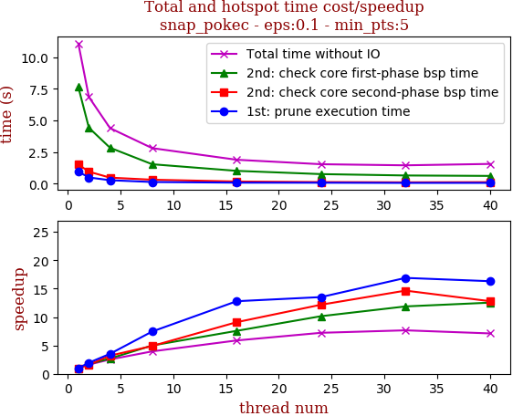

thread_num | prune | check-core 1st bsp | check-core 2nd bsp | cluster-core | cluster-non-core | total | total speedup
--- | --- | --- | --- | --- | --- | --- | ---
1 | 0.946s | 7.631s | 1.509s | 0.694s | 0.291s | 11.073s | 1.000
2 | 0.485s | 4.417s | 0.944s | 0.699s | 0.299s | 6.846s | 1.617
4 | 0.269s | 2.837s | 0.473s | 0.552s | 0.257s | 4.389s | 2.523
8 | 0.127s | 1.531s | 0.308s | 0.541s | 0.293s | 2.804s | 3.949
16 | 0.074s | 1.009s | 0.166s | 0.368s | 0.267s | 1.886s | 5.871
24 | 0.07s | 0.752s | 0.124s | 0.361s | 0.225s | 1.534s | 7.218
32 | 0.056s | 0.643s | 0.103s | 0.376s | 0.267s | 1.446s | 7.658
40 | 0.058s | 0.609s | 0.118s | 0.492s | 0.278s | 1.557s | 7.112

## eps:0.2

overview | speedup
--- | ---
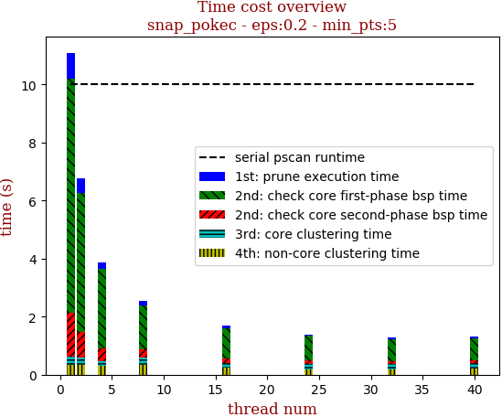 | 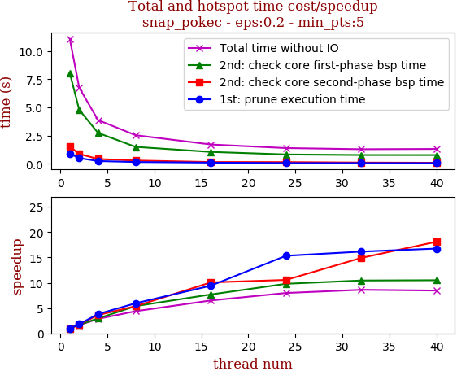

thread_num | prune | check-core 1st bsp | check-core 2nd bsp | cluster-core | cluster-non-core | total | total speedup
--- | --- | --- | --- | --- | --- | --- | ---
1 | 0.904s | 8.059s | 1.52s | 0.281s | 0.328s | 11.095s | 1.000
2 | 0.5s | 4.798s | 0.868s | 0.269s | 0.325s | 6.762s | 1.641
4 | 0.237s | 2.741s | 0.421s | 0.163s | 0.316s | 3.88s | 2.860
8 | 0.152s | 1.497s | 0.283s | 0.265s | 0.336s | 2.535s | 4.377
16 | 0.096s | 1.049s | 0.151s | 0.164s | 0.246s | 1.709s | 6.492
24 | 0.059s | 0.823s | 0.144s | 0.172s | 0.192s | 1.391s | 7.976
32 | 0.056s | 0.772s | 0.102s | 0.173s | 0.184s | 1.289s | 8.607
40 | 0.054s | 0.768s | 0.084s | 0.193s | 0.21s | 1.312s | 8.457

## eps:0.3

overview | speedup
--- | ---
 | 

thread_num | prune | check-core 1st bsp | check-core 2nd bsp | cluster-core | cluster-non-core | total | total speedup
--- | --- | --- | --- | --- | --- | --- | ---
1 | 0.861s | 6.919s | 1.392s | 0.061s | 0.086s | 9.322s | 1.000
2 | 0.454s | 4.153s | 0.881s | 0.064s | 0.086s | 5.64s | 1.653
4 | 0.236s | 2.386s | 0.456s | 0.065s | 0.085s | 3.23s | 2.886
8 | 0.118s | 1.392s | 0.226s | 0.065s | 0.098s | 1.901s | 4.904
16 | 0.075s | 0.934s | 0.112s | 0.073s | 0.101s | 1.297s | 7.187
24 | 0.102s | 0.818s | 0.141s | 0.051s | 0.062s | 1.175s | 7.934
32 | 0.062s | 0.656s | 0.123s | 0.045s | 0.059s | 0.946s | 9.854
40 | 0.059s | 0.543s | 0.117s | 0.055s | 0.079s | 0.856s | 10.890

## eps:0.4

overview | speedup
--- | ---
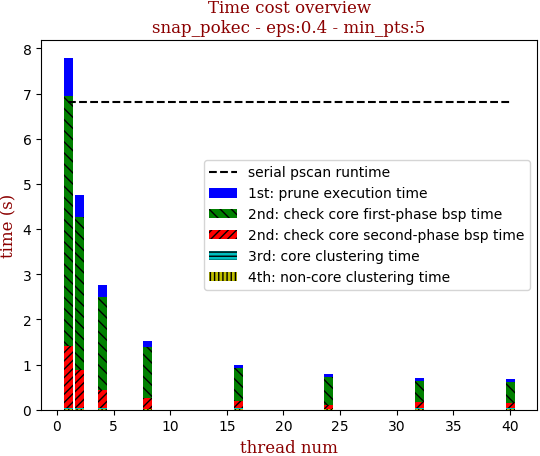 | 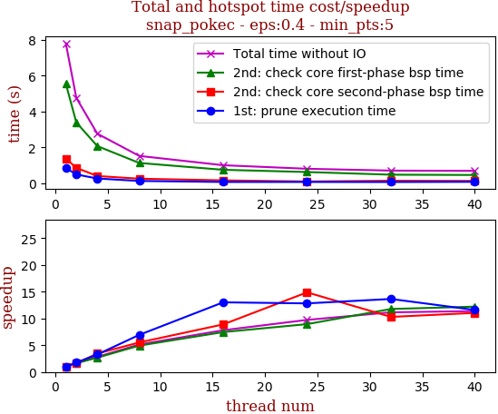

thread_num | prune | check-core 1st bsp | check-core 2nd bsp | cluster-core | cluster-non-core | total | total speedup
--- | --- | --- | --- | --- | --- | --- | ---
1 | 0.846s | 5.544s | 1.369s | 0.01s | 0.023s | 7.794s | 1.000
2 | 0.484s | 3.383s | 0.852s | 0.01s | 0.022s | 4.754s | 1.639
4 | 0.259s | 2.067s | 0.397s | 0.01s | 0.023s | 2.759s | 2.825
8 | 0.122s | 1.125s | 0.248s | 0.006s | 0.014s | 1.518s | 5.134
16 | 0.065s | 0.744s | 0.154s | 0.01s | 0.023s | 0.999s | 7.802
24 | 0.066s | 0.62s | 0.092s | 0.006s | 0.014s | 0.801s | 9.730
32 | 0.062s | 0.471s | 0.133s | 0.009s | 0.021s | 0.699s | 11.150
40 | 0.073s | 0.454s | 0.124s | 0.01s | 0.021s | 0.685s | 11.378

## eps:0.5

overview | speedup
--- | ---
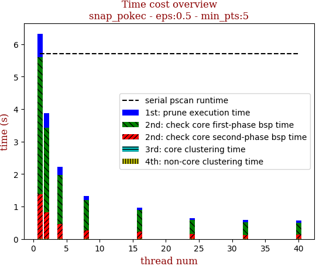 | 

thread_num | prune | check-core 1st bsp | check-core 2nd bsp | cluster-core | cluster-non-core | total | total speedup
--- | --- | --- | --- | --- | --- | --- | ---
1 | 0.732s | 4.215s | 1.362s | 0.002s | 0.013s | 6.326s | 1.000
2 | 0.454s | 2.6s | 0.808s | 0.002s | 0.013s | 3.88s | 1.630
4 | 0.251s | 1.51s | 0.446s | 0.001s | 0.012s | 2.223s | 2.846
8 | 0.119s | 0.936s | 0.256s | 0.001s | 0.012s | 1.326s | 4.771
16 | 0.075s | 0.665s | 0.218s | 0.002s | 0.013s | 0.975s | 6.488
24 | 0.055s | 0.42s | 0.146s | 0.002s | 0.015s | 0.64s | 9.884
32 | 0.057s | 0.407s | 0.101s | 0.002s | 0.013s | 0.583s | 10.851
40 | 0.065s | 0.357s | 0.128s | 0.002s | 0.013s | 0.567s | 11.157

## eps:0.6

overview | speedup
--- | ---
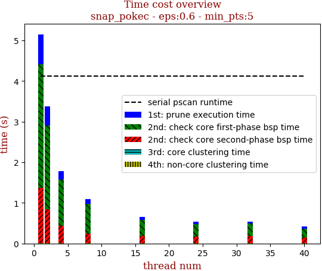 | 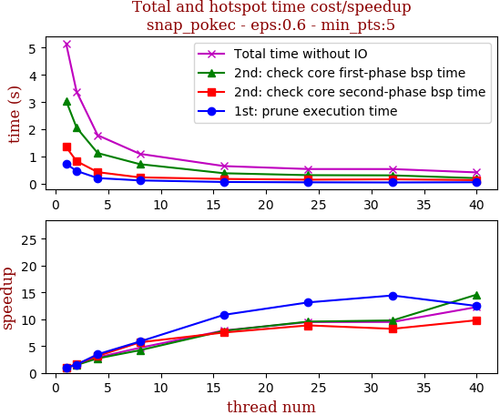

thread_num | prune | check-core 1st bsp | check-core 2nd bsp | cluster-core | cluster-non-core | total | total speedup
--- | --- | --- | --- | --- | --- | --- | ---
1 | 0.736s | 3.05s | 1.355s | 0.0s | 0.011s | 5.154s | 1.000
2 | 0.473s | 2.061s | 0.832s | 0.0s | 0.01s | 3.379s | 1.525
4 | 0.212s | 1.13s | 0.429s | 0.0s | 0.012s | 1.785s | 2.887
8 | 0.126s | 0.723s | 0.238s | 0.0s | 0.012s | 1.102s | 4.677
16 | 0.068s | 0.389s | 0.18s | 0.0s | 0.012s | 0.652s | 7.905
24 | 0.056s | 0.319s | 0.153s | 0.001s | 0.012s | 0.544s | 9.474
32 | 0.051s | 0.312s | 0.165s | 0.001s | 0.013s | 0.543s | 9.492
40 | 0.059s | 0.209s | 0.138s | 0.0s | 0.011s | 0.42s | 12.271

## eps:0.7

overview | speedup
--- | ---
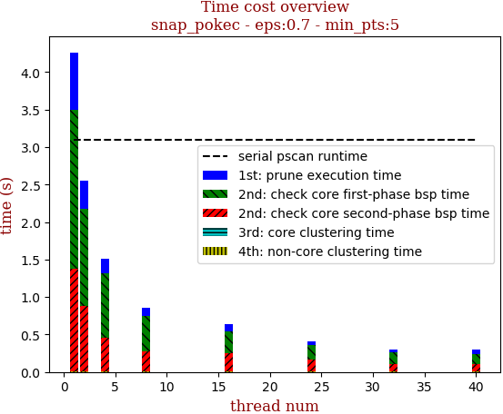 | 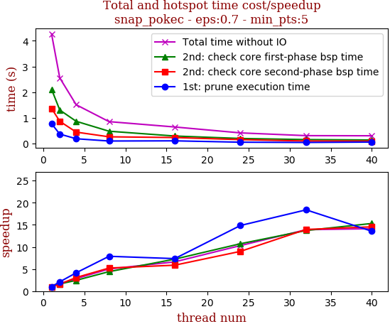

thread_num | prune | check-core 1st bsp | check-core 2nd bsp | cluster-core | cluster-non-core | total | total speedup
--- | --- | --- | --- | --- | --- | --- | ---
1 | 0.772s | 2.112s | 1.367s | 0.0s | 0.011s | 4.265s | 1.000
2 | 0.368s | 1.304s | 0.866s | 0.0s | 0.012s | 2.553s | 1.671
4 | 0.186s | 0.865s | 0.444s | 0.0s | 0.012s | 1.509s | 2.826
8 | 0.098s | 0.479s | 0.262s | 0.0s | 0.012s | 0.852s | 5.006
16 | 0.105s | 0.292s | 0.233s | 0.0s | 0.012s | 0.644s | 6.623
24 | 0.052s | 0.197s | 0.152s | 0.0s | 0.011s | 0.414s | 10.302
32 | 0.042s | 0.154s | 0.098s | 0.0s | 0.011s | 0.307s | 13.893
40 | 0.057s | 0.138s | 0.094s | 0.0s | 0.011s | 0.302s | 14.123

## eps:0.8

overview | speedup
--- | ---
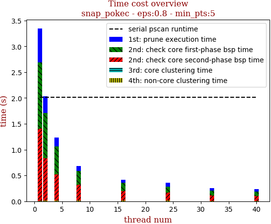 | 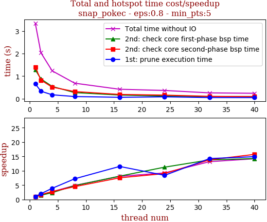

thread_num | prune | check-core 1st bsp | check-core 2nd bsp | cluster-core | cluster-non-core | total | total speedup
--- | --- | --- | --- | --- | --- | --- | ---
1 | 0.656s | 1.283s | 1.398s | 0.0s | 0.01s | 3.348s | 1.000
2 | 0.328s | 0.872s | 0.822s | 0.0s | 0.012s | 2.036s | 1.644
4 | 0.169s | 0.541s | 0.51s | 0.0s | 0.012s | 1.234s | 2.713
8 | 0.091s | 0.266s | 0.313s | 0.0s | 0.012s | 0.685s | 4.888
16 | 0.057s | 0.158s | 0.185s | 0.0s | 0.013s | 0.415s | 8.067
24 | 0.078s | 0.114s | 0.155s | 0.0s | 0.012s | 0.362s | 9.249
32 | 0.046s | 0.093s | 0.101s | 0.0s | 0.011s | 0.254s | 13.181
40 | 0.044s | 0.09s | 0.089s | 0.0s | 0.011s | 0.236s | 14.186

## eps:0.9

overview | speedup
--- | ---
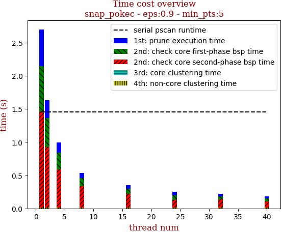 | 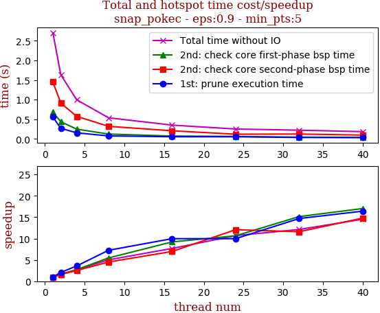

thread_num | prune | check-core 1st bsp | check-core 2nd bsp | cluster-core | cluster-non-core | total | total speedup
--- | --- | --- | --- | --- | --- | --- | ---
1 | 0.558s | 0.681s | 1.449s | 0.0s | 0.011s | 2.702s | 1.000
2 | 0.27s | 0.437s | 0.912s | 0.0s | 0.01s | 1.632s | 1.656
4 | 0.156s | 0.25s | 0.575s | 0.0s | 0.013s | 0.996s | 2.713
8 | 0.077s | 0.125s | 0.322s | 0.0s | 0.013s | 0.539s | 5.013
16 | 0.056s | 0.074s | 0.208s | 0.0s | 0.013s | 0.352s | 7.676
24 | 0.056s | 0.064s | 0.12s | 0.0s | 0.011s | 0.253s | 10.680
32 | 0.038s | 0.045s | 0.125s | 0.0s | 0.012s | 0.223s | 12.117
40 | 0.034s | 0.04s | 0.098s | 0.0s | 0.011s | 0.186s | 14.527

