## eps:0.1

overview | speedup
--- | ---
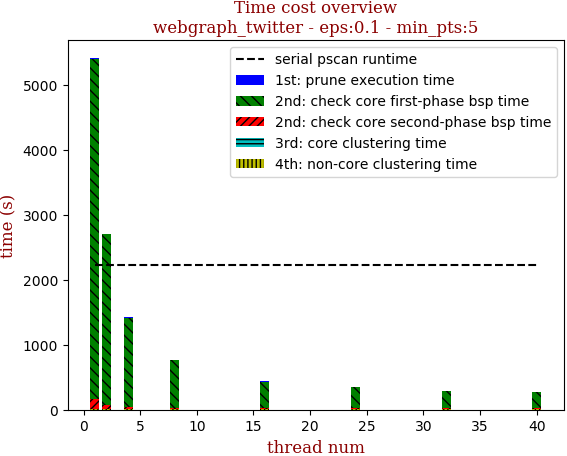 | 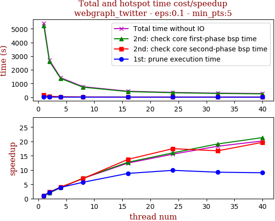

thread_num | prune | check-core 1st bsp | check-core 2nd bsp | cluster-core | cluster-non-core | total | total speedup
--- | --- | --- | --- | --- | --- | --- | ---
1 | 20.428s | 5235.389s | 148.66s | 4.611s | 7.055s | 5416.144s | 1.000
2 | 9.175s | 2623.218s | 65.979s | 4.671s | 6.909s | 2709.955s | 1.999
4 | 5.236s | 1370.963s | 36.665s | 4.626s | 6.535s | 1424.027s | 3.803
8 | 3.576s | 730.813s | 21.248s | 4.546s | 6.724s | 766.909s | 7.062
16 | 2.319s | 411.757s | 10.84s | 4.637s | 6.484s | 436.039s | 12.421
24 | 2.067s | 327.32s | 8.506s | 4.123s | 6.543s | 348.567s | 15.538
32 | 2.213s | 273.824s | 8.895s | 4.204s | 6.627s | 295.765s | 18.312
40 | 2.261s | 245.332s | 7.55s | 5.157s | 8.374s | 268.676s | 20.159

## eps:0.2

overview | speedup
--- | ---
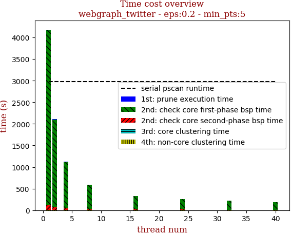 | 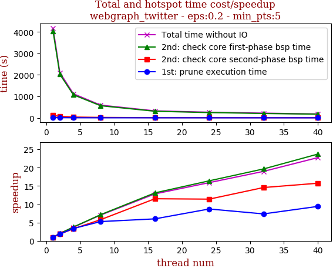

thread_num | prune | check-core 1st bsp | check-core 2nd bsp | cluster-core | cluster-non-core | total | total speedup
--- | --- | --- | --- | --- | --- | --- | ---
1 | 15.91s | 4040.264s | 120.595s | 1.833s | 3.1s | 4181.704s | 1.000
2 | 8.592s | 2029.237s | 65.5s | 1.802s | 2.904s | 2108.039s | 1.984
4 | 4.72s | 1074.351s | 36.599s | 1.844s | 3.124s | 1120.644s | 3.732
8 | 3.026s | 565.782s | 20.89s | 1.8s | 2.882s | 594.387s | 7.035
16 | 2.652s | 308.43s | 10.485s | 1.207s | 3.289s | 326.066s | 12.825
24 | 1.828s | 246.331s | 10.583s | 1.299s | 2.839s | 262.882s | 15.907
32 | 2.163s | 205.592s | 8.278s | 1.326s | 2.892s | 220.253s | 18.986
40 | 1.691s | 170.385s | 7.661s | 1.212s | 2.863s | 183.816s | 22.749

## eps:0.3

overview | speedup
--- | ---
 | 

thread_num | prune | check-core 1st bsp | check-core 2nd bsp | cluster-core | cluster-non-core | total | total speedup
--- | --- | --- | --- | --- | --- | --- | ---
1 | 17.415s | 2813.298s | 129.6s | 0.945s | 1.1s | 2962.36s | 1.000
2 | 7.805s | 1409.66s | 65.557s | 0.442s | 0.973s | 1484.439s | 1.996
4 | 4.792s | 744.448s | 36.408s | 0.935s | 1.102s | 787.69s | 3.761
8 | 3.287s | 393.054s | 19.357s | 1.003s | 1.137s | 417.839s | 7.090
16 | 2.658s | 218.43s | 12.158s | 0.522s | 0.971s | 234.741s | 12.620
24 | 2.241s | 168.751s | 9.394s | 0.454s | 0.996s | 181.839s | 16.291
32 | 1.71s | 130.77s | 8.241s | 0.81s | 1.014s | 142.547s | 20.782
40 | 1.54s | 117.239s | 7.397s | 0.468s | 0.959s | 127.605s | 23.215

## eps:0.4

overview | speedup
--- | ---
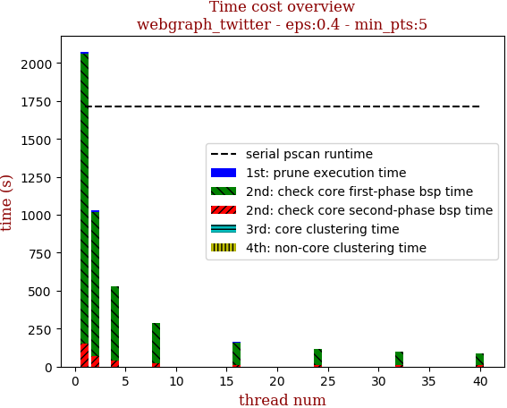 | 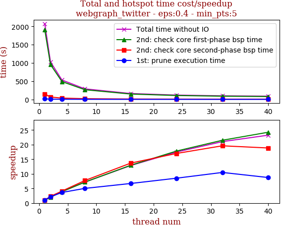

thread_num | prune | check-core 1st bsp | check-core 2nd bsp | cluster-core | cluster-non-core | total | total speedup
--- | --- | --- | --- | --- | --- | --- | ---
1 | 16.226s | 1907.72s | 150.024s | 0.518s | 0.609s | 2075.099s | 1.000
2 | 7.49s | 954.126s | 65.415s | 0.548s | 0.674s | 1028.255s | 2.018
4 | 4.468s | 489.088s | 36.559s | 0.537s | 0.659s | 531.313s | 3.906
8 | 3.23s | 265.903s | 19.445s | 0.51s | 0.595s | 289.693s | 7.163
16 | 2.421s | 147.392s | 10.969s | 0.238s | 0.463s | 161.486s | 12.850
24 | 1.905s | 107.168s | 8.834s | 0.282s | 0.587s | 118.778s | 17.470
32 | 1.548s | 88.74s | 7.653s | 0.26s | 0.458s | 98.66s | 21.033
40 | 1.856s | 78.698s | 7.958s | 0.26s | 0.522s | 89.297s | 23.238

## eps:0.5

overview | speedup
--- | ---
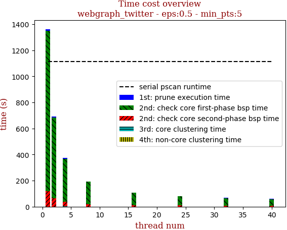 | 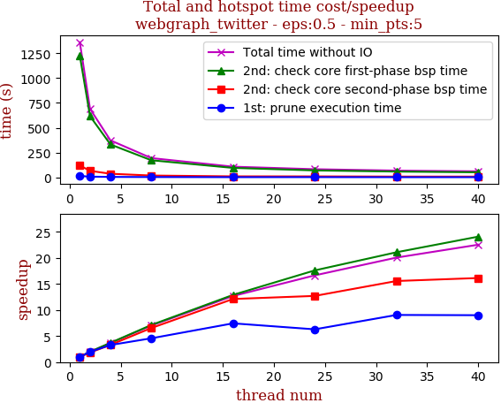

thread_num | prune | check-core 1st bsp | check-core 2nd bsp | cluster-core | cluster-non-core | total | total speedup
--- | --- | --- | --- | --- | --- | --- | ---
1 | 13.973s | 1227.533s | 119.861s | 0.324s | 0.531s | 1362.224s | 1.000
2 | 7.099s | 616.763s | 65.403s | 0.323s | 0.506s | 690.096s | 1.974
4 | 4.26s | 331.372s | 36.239s | 0.328s | 0.554s | 372.764s | 3.654
8 | 3.058s | 172.265s | 18.318s | 0.157s | 0.34s | 194.147s | 7.016
16 | 1.878s | 95.139s | 9.894s | 0.182s | 0.293s | 107.388s | 12.685
24 | 2.221s | 69.729s | 9.434s | 0.145s | 0.279s | 81.811s | 16.651
32 | 1.544s | 58.219s | 7.7s | 0.155s | 0.279s | 67.9s | 20.062
40 | 1.552s | 50.971s | 7.426s | 0.158s | 0.345s | 60.453s | 22.534

## eps:0.6

overview | speedup
--- | ---
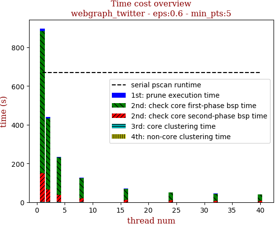 | 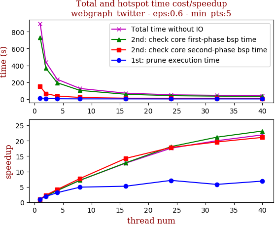

thread_num | prune | check-core 1st bsp | check-core 2nd bsp | cluster-core | cluster-non-core | total | total speedup
--- | --- | --- | --- | --- | --- | --- | ---
1 | 12.473s | 734.725s | 149.564s | 0.217s | 0.479s | 897.475s | 1.000
2 | 6.726s | 367.611s | 65.456s | 0.217s | 0.466s | 440.492s | 2.037
4 | 4.023s | 193.874s | 36.286s | 0.217s | 0.467s | 234.882s | 3.821
8 | 2.549s | 103.121s | 19.417s | 0.216s | 0.463s | 125.778s | 7.135
16 | 2.401s | 57.369s | 10.496s | 0.099s | 0.253s | 70.625s | 12.708
24 | 1.758s | 40.582s | 8.385s | 0.086s | 0.218s | 51.035s | 17.585
32 | 2.154s | 34.715s | 7.628s | 0.1s | 0.227s | 44.827s | 20.021
40 | 1.819s | 31.713s | 7.09s | 0.104s | 0.234s | 40.968s | 21.907

## eps:0.7

overview | speedup
--- | ---
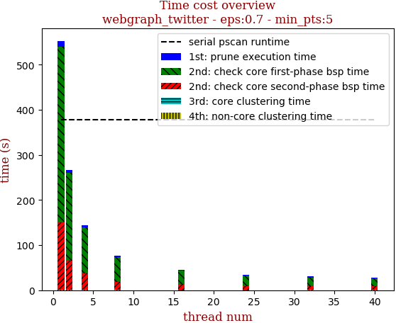 | 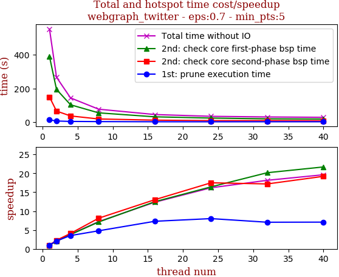

thread_num | prune | check-core 1st bsp | check-core 2nd bsp | cluster-core | cluster-non-core | total | total speedup
--- | --- | --- | --- | --- | --- | --- | ---
1 | 13.471s | 389.353s | 149.196s | 0.119s | 0.422s | 552.576s | 1.000
2 | 6.378s | 193.985s | 65.321s | 0.116s | 0.414s | 266.227s | 2.076
4 | 3.815s | 102.636s | 36.388s | 0.118s | 0.42s | 143.389s | 3.854
8 | 2.815s | 54.714s | 18.379s | 0.131s | 0.413s | 76.455s | 7.227
16 | 1.844s | 31.186s | 11.461s | 0.049s | 0.192s | 44.737s | 12.352
24 | 1.681s | 23.725s | 8.532s | 0.047s | 0.189s | 34.176s | 16.169
32 | 1.91s | 19.319s | 8.682s | 0.12s | 0.41s | 30.451s | 18.146
40 | 1.903s | 17.961s | 7.774s | 0.126s | 0.406s | 28.174s | 19.613

## eps:0.8

overview | speedup
--- | ---
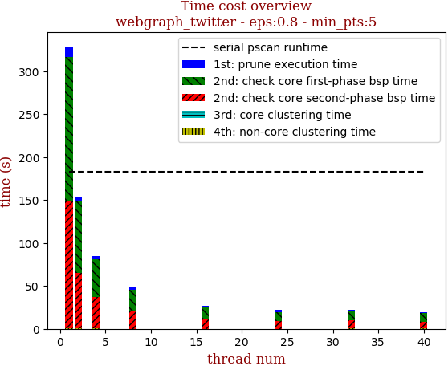 | 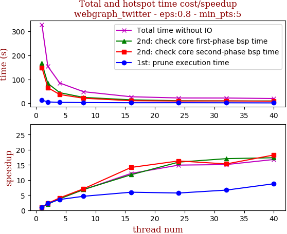

thread_num | prune | check-core 1st bsp | check-core 2nd bsp | cluster-core | cluster-non-core | total | total speedup
--- | --- | --- | --- | --- | --- | --- | ---
1 | 12.71s | 166.71s | 148.991s | 0.038s | 0.315s | 328.777s | 1.000
2 | 5.553s | 82.875s | 65.001s | 0.038s | 0.312s | 153.791s | 2.138
4 | 3.571s | 44.142s | 36.375s | 0.038s | 0.336s | 84.474s | 3.892
8 | 2.749s | 24.341s | 20.967s | 0.016s | 0.154s | 48.232s | 6.817
16 | 2.131s | 14.195s | 10.525s | 0.017s | 0.152s | 27.024s | 12.166
24 | 2.23s | 10.475s | 9.138s | 0.019s | 0.162s | 22.027s | 14.926
32 | 1.909s | 9.773s | 9.728s | 0.039s | 0.32s | 21.772s | 15.101
40 | 1.451s | 9.601s | 8.158s | 0.044s | 0.333s | 19.59s | 16.783

## eps:0.9

overview | speedup
--- | ---
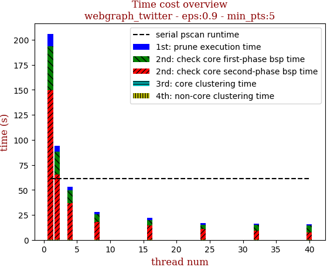 | 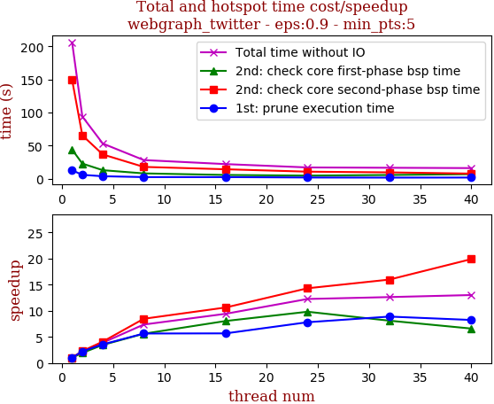

thread_num | prune | check-core 1st bsp | check-core 2nd bsp | cluster-core | cluster-non-core | total | total speedup
--- | --- | --- | --- | --- | --- | --- | ---
1 | 12.576s | 43.851s | 149.272s | 0.017s | 0.294s | 206.012s | 1.000
2 | 5.616s | 22.641s | 65.276s | 0.016s | 0.274s | 93.826s | 2.196
4 | 3.528s | 12.658s | 36.421s | 0.017s | 0.275s | 52.901s | 3.894
8 | 2.227s | 7.823s | 17.625s | 0.017s | 0.274s | 27.973s | 7.365
16 | 2.217s | 5.453s | 14.045s | 0.01s | 0.137s | 21.865s | 9.422
24 | 1.611s | 4.468s | 10.431s | 0.017s | 0.276s | 16.805s | 12.259
32 | 1.415s | 5.411s | 9.346s | 0.009s | 0.139s | 16.321s | 12.623
40 | 1.526s | 6.649s | 7.504s | 0.013s | 0.136s | 15.831s | 13.013

