## eps:0.1

overview | speedup
--- | ---
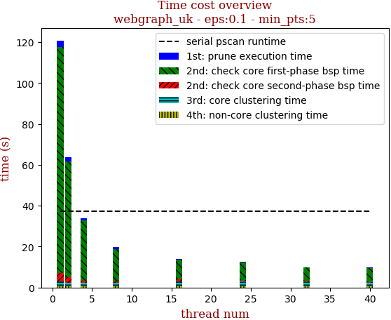 | 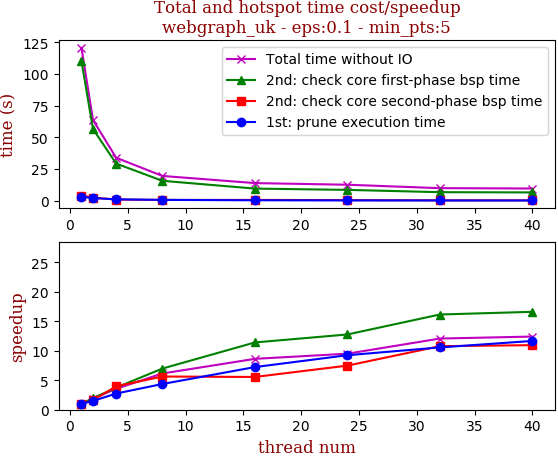

thread_num | prune | check-core 1st bsp | check-core 2nd bsp | cluster-core | cluster-non-core | total | total speedup
--- | --- | --- | --- | --- | --- | --- | ---
1 | 3.255s | 110.294s | 4.107s | 2.422s | 0.678s | 120.764s | 1.000
2 | 2.18s | 56.626s | 2.557s | 1.695s | 0.675s | 63.742s | 1.895
4 | 1.186s | 29.409s | 1.033s | 1.698s | 0.676s | 34.01s | 3.551
8 | 0.746s | 15.794s | 0.729s | 1.698s | 0.676s | 19.648s | 6.146
16 | 0.45s | 9.664s | 0.739s | 2.461s | 0.674s | 13.993s | 8.630
24 | 0.352s | 8.639s | 0.549s | 2.459s | 0.705s | 12.705s | 9.505
32 | 0.308s | 6.828s | 0.381s | 1.773s | 0.713s | 10.004s | 12.072
40 | 0.279s | 6.641s | 0.375s | 1.727s | 0.705s | 9.73s | 12.412

## eps:0.2

overview | speedup
--- | ---
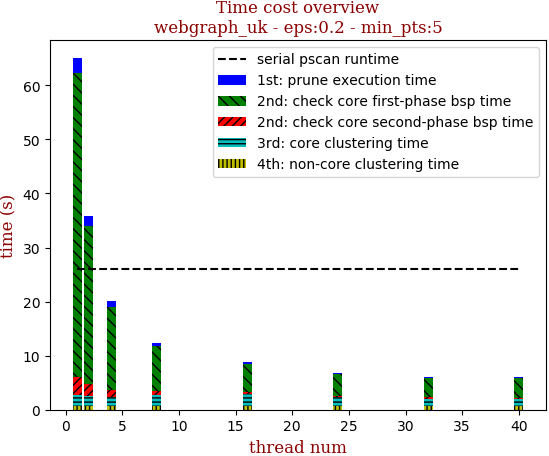 | 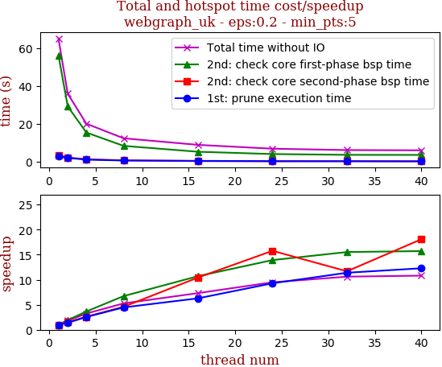

thread_num | prune | check-core 1st bsp | check-core 2nd bsp | cluster-core | cluster-non-core | total | total speedup
--- | --- | --- | --- | --- | --- | --- | ---
1 | 2.812s | 56.245s | 3.327s | 1.999s | 0.713s | 65.099s | 1.000
2 | 2.024s | 29.206s | 2.214s | 1.76s | 0.704s | 35.91s | 1.813
4 | 1.102s | 15.4s | 1.277s | 1.619s | 0.678s | 20.078s | 3.242
8 | 0.63s | 8.368s | 0.726s | 1.938s | 0.707s | 12.371s | 5.262
16 | 0.448s | 5.254s | 0.319s | 2.119s | 0.753s | 8.895s | 7.319
24 | 0.303s | 4.043s | 0.211s | 1.613s | 0.694s | 6.867s | 9.480
32 | 0.247s | 3.624s | 0.285s | 1.288s | 0.692s | 6.14s | 10.602
40 | 0.229s | 3.58s | 0.184s | 1.332s | 0.695s | 6.022s | 10.810

## eps:0.3

overview | speedup
--- | ---
 | 

thread_num | prune | check-core 1st bsp | check-core 2nd bsp | cluster-core | cluster-non-core | total | total speedup
--- | --- | --- | --- | --- | --- | --- | ---
1 | 2.655s | 26.275s | 3.271s | 1.545s | 0.734s | 34.484s | 1.000
2 | 1.72s | 13.784s | 2.258s | 1.548s | 0.738s | 20.052s | 1.720
4 | 0.868s | 7.234s | 1.306s | 1.583s | 0.743s | 11.738s | 2.938
8 | 0.557s | 4.236s | 0.568s | 1.62s | 0.764s | 7.748s | 4.451
16 | 0.381s | 2.767s | 0.345s | 1.628s | 0.753s | 5.876s | 5.869
24 | 0.231s | 2.155s | 0.28s | 1.416s | 0.627s | 4.713s | 7.317
32 | 0.238s | 2.073s | 0.209s | 0.974s | 0.626s | 4.123s | 8.364
40 | 0.204s | 2.184s | 0.193s | 1.092s | 0.627s | 4.301s | 8.018

## eps:0.4

overview | speedup
--- | ---
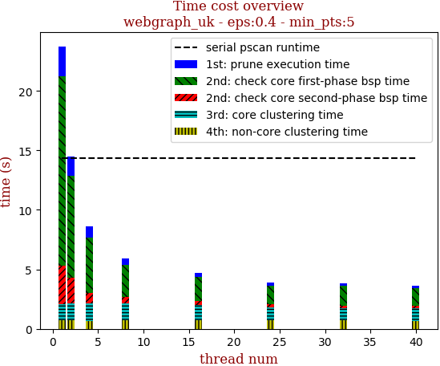 | 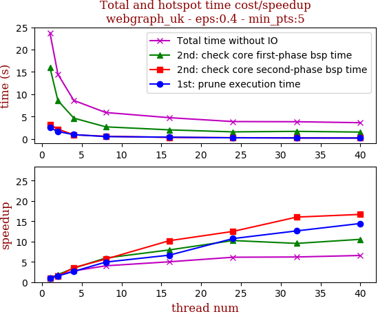

thread_num | prune | check-core 1st bsp | check-core 2nd bsp | cluster-core | cluster-non-core | total | total speedup
--- | --- | --- | --- | --- | --- | --- | ---
1 | 2.5s | 15.967s | 3.237s | 1.32s | 0.722s | 23.75s | 1.000
2 | 1.629s | 8.551s | 2.166s | 1.427s | 0.69s | 14.466s | 1.642
4 | 0.944s | 4.638s | 0.904s | 1.426s | 0.686s | 8.601s | 2.761
8 | 0.506s | 2.688s | 0.57s | 1.413s | 0.722s | 5.901s | 4.025
16 | 0.376s | 2.012s | 0.317s | 1.313s | 0.719s | 4.738s | 5.013
24 | 0.233s | 1.558s | 0.259s | 1.121s | 0.697s | 3.871s | 6.135
32 | 0.198s | 1.673s | 0.202s | 1.06s | 0.698s | 3.833s | 6.196
40 | 0.173s | 1.514s | 0.194s | 1.096s | 0.635s | 3.615s | 6.570

## eps:0.5

overview | speedup
--- | ---
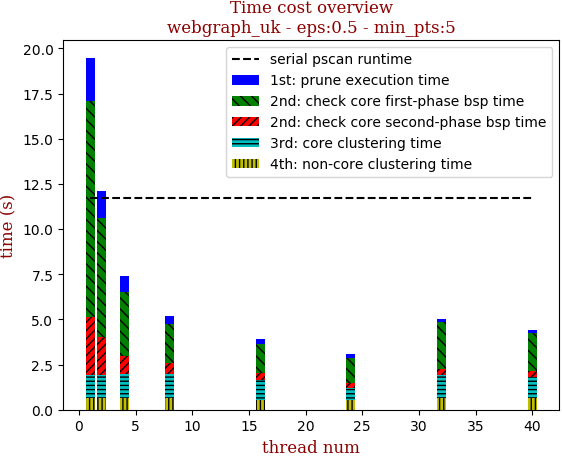 | 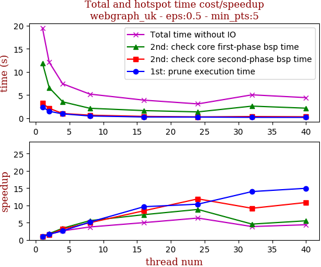

thread_num | prune | check-core 1st bsp | check-core 2nd bsp | cluster-core | cluster-non-core | total | total speedup
--- | --- | --- | --- | --- | --- | --- | ---
1 | 2.423s | 11.918s | 3.198s | 1.286s | 0.661s | 19.489s | 1.000
2 | 1.477s | 6.585s | 2.116s | 1.247s | 0.66s | 12.088s | 1.612
4 | 0.925s | 3.523s | 1.008s | 1.293s | 0.666s | 7.418s | 2.627
8 | 0.47s | 2.135s | 0.643s | 1.289s | 0.661s | 5.201s | 3.747
16 | 0.252s | 1.631s | 0.379s | 1.094s | 0.536s | 3.893s | 5.006
24 | 0.234s | 1.35s | 0.269s | 0.701s | 0.522s | 3.078s | 6.332
32 | 0.173s | 2.6s | 0.349s | 1.255s | 0.66s | 5.039s | 3.868
40 | 0.162s | 2.152s | 0.295s | 1.161s | 0.661s | 4.433s | 4.396

## eps:0.6

overview | speedup
--- | ---
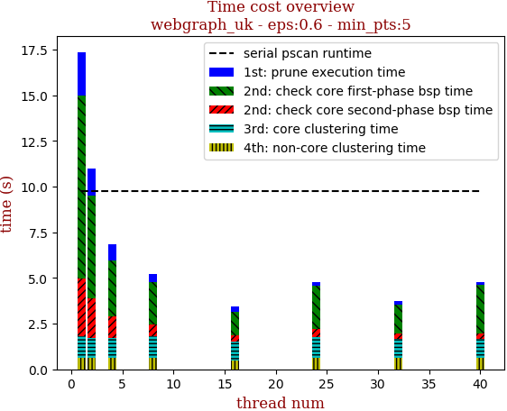 | 

thread_num | prune | check-core 1st bsp | check-core 2nd bsp | cluster-core | cluster-non-core | total | total speedup
--- | --- | --- | --- | --- | --- | --- | ---
1 | 2.369s | 10.013s | 3.182s | 1.176s | 0.616s | 17.358s | 1.000
2 | 1.48s | 5.649s | 2.136s | 1.116s | 0.611s | 10.995s | 1.579
4 | 0.852s | 3.09s | 1.156s | 1.109s | 0.612s | 6.821s | 2.545
8 | 0.45s | 2.305s | 0.634s | 1.189s | 0.618s | 5.198s | 3.339
16 | 0.255s | 1.31s | 0.359s | 1.004s | 0.488s | 3.418s | 5.078
24 | 0.191s | 2.391s | 0.455s | 1.137s | 0.612s | 4.788s | 3.625
32 | 0.159s | 1.597s | 0.277s | 1.073s | 0.613s | 3.721s | 4.665
40 | 0.159s | 2.63s | 0.318s | 1.057s | 0.604s | 4.77s | 3.639

## eps:0.7

overview | speedup
--- | ---
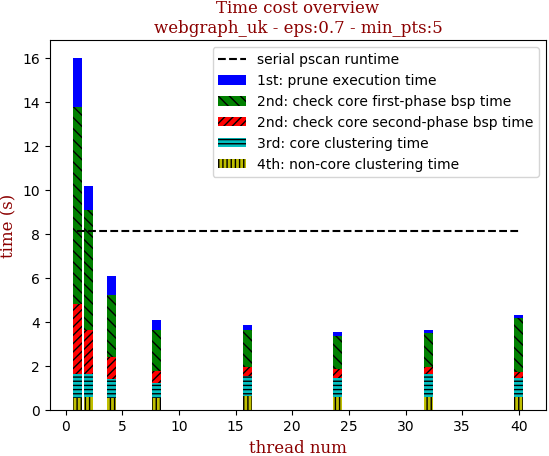 | 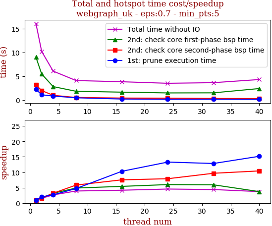

thread_num | prune | check-core 1st bsp | check-core 2nd bsp | cluster-core | cluster-non-core | total | total speedup
--- | --- | --- | --- | --- | --- | --- | ---
1 | 2.246s | 8.979s | 3.179s | 1.062s | 0.55s | 16.018s | 1.000
2 | 1.107s | 5.459s | 1.997s | 1.048s | 0.577s | 10.189s | 1.572
4 | 0.844s | 2.827s | 0.998s | 0.845s | 0.554s | 6.07s | 2.639
8 | 0.477s | 1.842s | 0.545s | 0.676s | 0.553s | 4.096s | 3.911
16 | 0.218s | 1.659s | 0.422s | 0.937s | 0.605s | 3.843s | 4.168
24 | 0.169s | 1.498s | 0.403s | 0.882s | 0.566s | 3.52s | 4.551
32 | 0.175s | 1.517s | 0.329s | 1.052s | 0.576s | 3.651s | 4.387
40 | 0.148s | 2.418s | 0.305s | 0.866s | 0.568s | 4.308s | 3.718

## eps:0.8

overview | speedup
--- | ---
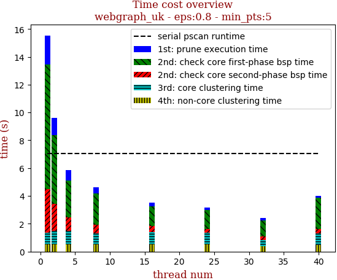 | 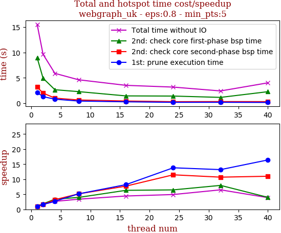

thread_num | prune | check-core 1st bsp | check-core 2nd bsp | cluster-core | cluster-non-core | total | total speedup
--- | --- | --- | --- | --- | --- | --- | ---
1 | 2.084s | 8.962s | 3.154s | 0.827s | 0.511s | 15.539s | 1.000
2 | 1.274s | 4.912s | 1.976s | 0.942s | 0.525s | 9.631s | 1.613
4 | 0.773s | 2.637s | 0.982s | 0.953s | 0.526s | 5.873s | 2.646
8 | 0.405s | 2.266s | 0.613s | 0.809s | 0.509s | 4.605s | 3.374
16 | 0.254s | 1.419s | 0.409s | 0.893s | 0.528s | 3.504s | 4.435
24 | 0.151s | 1.386s | 0.275s | 0.832s | 0.511s | 3.158s | 4.921
32 | 0.158s | 1.126s | 0.295s | 0.429s | 0.388s | 2.398s | 6.480
40 | 0.127s | 2.253s | 0.287s | 0.841s | 0.49s | 4.001s | 3.884

## eps:0.9

overview | speedup
--- | ---
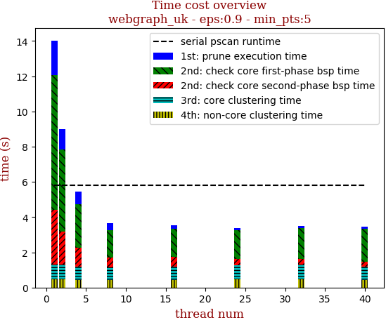 | 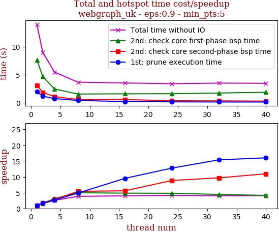

thread_num | prune | check-core 1st bsp | check-core 2nd bsp | cluster-core | cluster-non-core | total | total speedup
--- | --- | --- | --- | --- | --- | --- | ---
1 | 1.951s | 7.677s | 3.112s | 0.806s | 0.481s | 14.03s | 1.000
2 | 1.169s | 4.676s | 1.844s | 0.862s | 0.461s | 9.014s | 1.556
4 | 0.734s | 2.46s | 1.092s | 0.736s | 0.445s | 5.47s | 2.565
8 | 0.401s | 1.546s | 0.577s | 0.703s | 0.442s | 3.67s | 3.823
16 | 0.205s | 1.588s | 0.558s | 0.728s | 0.445s | 3.526s | 3.979
24 | 0.153s | 1.604s | 0.352s | 0.826s | 0.455s | 3.392s | 4.136
32 | 0.127s | 1.733s | 0.322s | 0.848s | 0.472s | 3.503s | 4.005
40 | 0.122s | 1.865s | 0.284s | 0.747s | 0.446s | 3.466s | 4.048

