## eps:0.1

overview | speedup
--- | ---
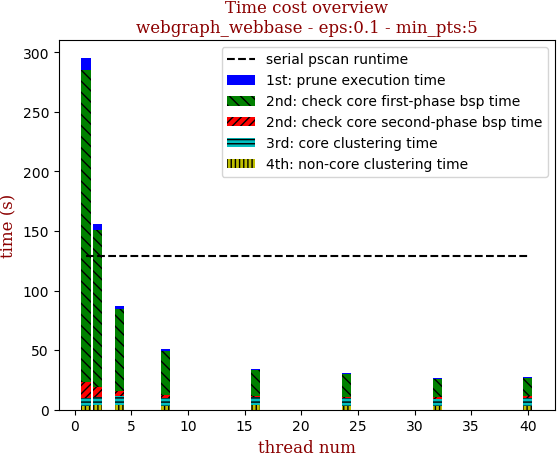 | 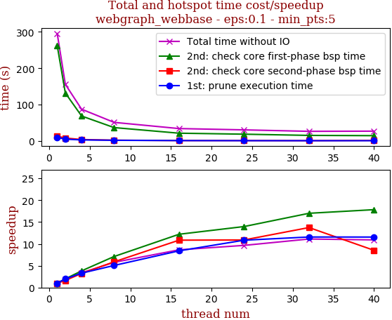

thread_num | prune | check-core 1st bsp | check-core 2nd bsp | cluster-core | cluster-non-core | total | total speedup
--- | --- | --- | --- | --- | --- | --- | ---
1 | 10.045s | 262.106s | 13.145s | 6.681s | 3.462s | 295.443s | 1.000
2 | 5.088s | 131.87s | 8.055s | 6.969s | 3.774s | 155.761s | 1.897
4 | 3.055s | 68.704s | 4.086s | 7.574s | 3.997s | 87.418s | 3.380
8 | 1.988s | 36.901s | 2.235s | 6.66s | 3.458s | 51.244s | 5.765
16 | 1.196s | 21.486s | 1.212s | 6.673s | 3.632s | 34.201s | 8.638
24 | 0.927s | 18.771s | 1.207s | 6.26s | 3.454s | 30.621s | 9.648
32 | 0.868s | 15.416s | 0.957s | 5.892s | 3.453s | 26.587s | 11.112
40 | 0.869s | 14.699s | 1.542s | 6.507s | 3.46s | 27.081s | 10.910

## eps:0.2

overview | speedup
--- | ---
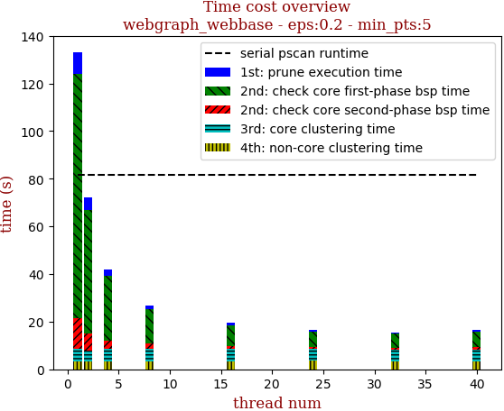 | 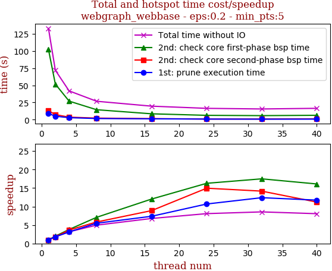

thread_num | prune | check-core 1st bsp | check-core 2nd bsp | cluster-core | cluster-non-core | total | total speedup
--- | --- | --- | --- | --- | --- | --- | ---
1 | 9.057s | 102.504s | 13.129s | 5.287s | 3.191s | 133.171s | 1.000
2 | 5.025s | 51.88s | 7.408s | 4.55s | 3.208s | 72.075s | 1.848
4 | 2.897s | 27.036s | 3.615s | 5.215s | 3.207s | 41.972s | 3.173
8 | 1.653s | 14.475s | 2.258s | 5.233s | 3.21s | 26.833s | 4.963
16 | 1.23s | 8.524s | 1.476s | 5.23s | 3.209s | 19.671s | 6.770
24 | 0.848s | 6.296s | 0.878s | 4.743s | 3.723s | 16.489s | 8.076
32 | 0.731s | 5.862s | 0.927s | 4.844s | 3.212s | 15.578s | 8.549
40 | 0.772s | 6.366s | 1.172s | 5.027s | 3.185s | 16.523s | 8.060

## eps:0.3

overview | speedup
--- | ---
 | 

thread_num | prune | check-core 1st bsp | check-core 2nd bsp | cluster-core | cluster-non-core | total | total speedup
--- | --- | --- | --- | --- | --- | --- | ---
1 | 8.371s | 62.205s | 13.137s | 4.383s | 2.737s | 90.836s | 1.000
2 | 4.846s | 31.408s | 7.334s | 4.245s | 2.745s | 50.58s | 1.796
4 | 2.667s | 16.27s | 3.728s | 4.206s | 2.737s | 29.61s | 3.068
8 | 1.829s | 8.924s | 2.155s | 3.685s | 2.741s | 19.336s | 4.698
16 | 1.137s | 5.121s | 1.281s | 3.544s | 2.739s | 13.824s | 6.571
24 | 0.776s | 4.393s | 1.057s | 3.541s | 2.738s | 12.508s | 7.262
32 | 0.742s | 4.38s | 1.041s | 4.27s | 2.743s | 13.178s | 6.893
40 | 0.685s | 4.939s | 1.094s | 4.28s | 3.125s | 14.125s | 6.431

## eps:0.4

overview | speedup
--- | ---
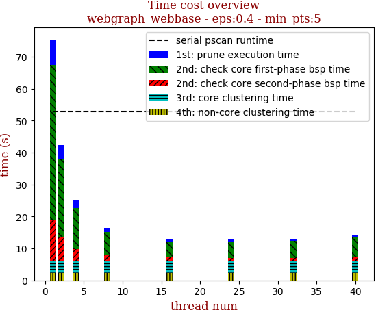 | 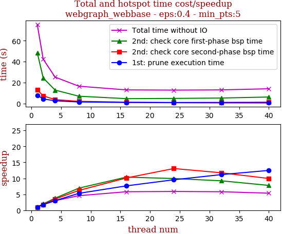

thread_num | prune | check-core 1st bsp | check-core 2nd bsp | cluster-core | cluster-non-core | total | total speedup
--- | --- | --- | --- | --- | --- | --- | ---
1 | 7.925s | 48.485s | 13.078s | 3.606s | 2.356s | 75.453s | 1.000
2 | 4.425s | 24.441s | 7.366s | 3.77s | 2.365s | 42.37s | 1.781
4 | 2.631s | 12.843s | 3.723s | 3.702s | 2.341s | 25.243s | 2.989
8 | 1.497s | 7.001s | 2.11s | 3.585s | 2.358s | 16.552s | 4.559
16 | 1.038s | 4.672s | 1.294s | 3.664s | 2.353s | 13.024s | 5.793
24 | 0.83s | 4.884s | 1.001s | 3.768s | 2.336s | 12.822s | 5.885
32 | 0.71s | 5.26s | 1.115s | 3.587s | 2.35s | 13.025s | 5.793
40 | 0.635s | 6.233s | 1.315s | 3.58s | 2.355s | 14.121s | 5.343

## eps:0.5

overview | speedup
--- | ---
 | 

thread_num | prune | check-core 1st bsp | check-core 2nd bsp | cluster-core | cluster-non-core | total | total speedup
--- | --- | --- | --- | --- | --- | --- | ---
1 | 8.273s | 44.236s | 13.886s | 3.22s | 2.08s | 71.697s | 1.000
2 | 4.354s | 22.017s | 7.211s | 3.288s | 2.074s | 38.945s | 1.841
4 | 2.432s | 11.339s | 3.903s | 3.086s | 2.056s | 22.818s | 3.142
8 | 1.612s | 6.446s | 1.99s | 3.172s | 2.065s | 15.288s | 4.690
16 | 0.937s | 4.613s | 1.222s | 2.446s | 2.071s | 11.291s | 6.350
24 | 0.888s | 4.21s | 1.144s | 3.101s | 2.072s | 11.417s | 6.280
32 | 0.695s | 4.33s | 0.822s | 3.319s | 2.082s | 11.25s | 6.373
40 | 0.618s | 4.534s | 1.126s | 3.105s | 2.075s | 11.46s | 6.256

## eps:0.6

overview | speedup
--- | ---
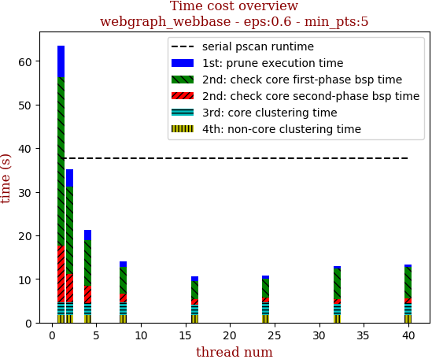 | 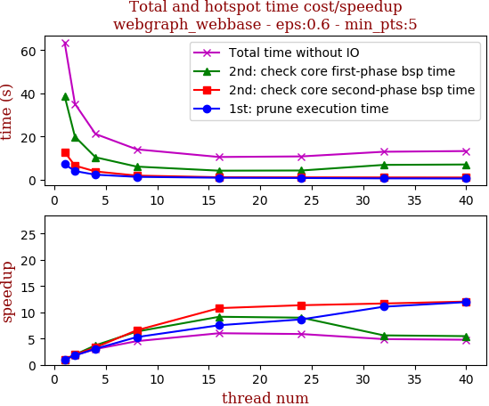

thread_num | prune | check-core 1st bsp | check-core 2nd bsp | cluster-core | cluster-non-core | total | total speedup
--- | --- | --- | --- | --- | --- | --- | ---
1 | 7.227s | 38.737s | 12.864s | 2.903s | 1.825s | 63.558s | 1.000
2 | 4.05s | 19.966s | 6.56s | 2.781s | 1.814s | 35.175s | 1.807
4 | 2.36s | 10.426s | 3.872s | 2.714s | 1.834s | 21.209s | 2.997
8 | 1.369s | 6.114s | 1.956s | 2.845s | 1.821s | 14.109s | 4.505
16 | 0.959s | 4.233s | 1.191s | 2.354s | 1.826s | 10.565s | 6.016
24 | 0.835s | 4.312s | 1.133s | 2.738s | 1.817s | 10.838s | 5.864
32 | 0.653s | 6.91s | 1.101s | 2.509s | 1.817s | 12.992s | 4.892
40 | 0.605s | 7.093s | 1.068s | 2.725s | 1.82s | 13.314s | 4.774

## eps:0.7

overview | speedup
--- | ---
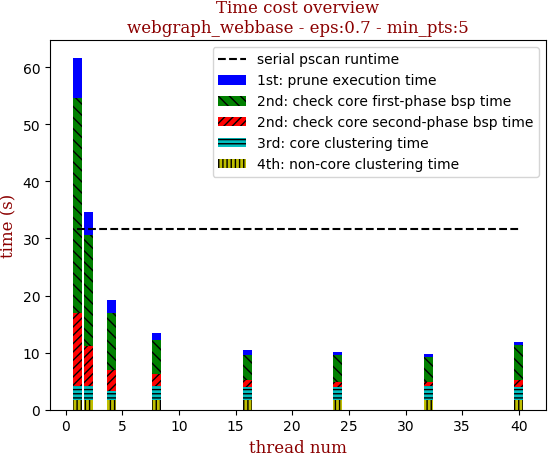 | 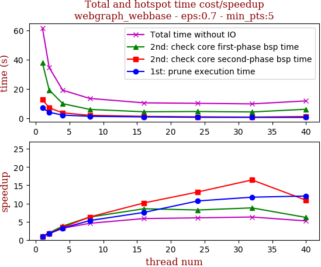

thread_num | prune | check-core 1st bsp | check-core 2nd bsp | cluster-core | cluster-non-core | total | total speedup
--- | --- | --- | --- | --- | --- | --- | ---
1 | 6.975s | 37.78s | 12.723s | 2.558s | 1.631s | 61.67s | 1.000
2 | 4.056s | 19.347s | 7.109s | 2.47s | 1.631s | 34.615s | 1.782
4 | 2.158s | 9.959s | 3.678s | 1.74s | 1.627s | 19.165s | 3.218
8 | 1.313s | 6.03s | 2.024s | 2.521s | 1.64s | 13.531s | 4.558
16 | 0.925s | 4.421s | 1.255s | 2.289s | 1.629s | 10.522s | 5.861
24 | 0.652s | 4.599s | 0.967s | 2.334s | 1.631s | 10.186s | 6.054
32 | 0.595s | 4.299s | 0.773s | 2.484s | 1.655s | 9.81s | 6.286
40 | 0.579s | 6.127s | 1.167s | 2.328s | 1.637s | 11.841s | 5.208

## eps:0.8

overview | speedup
--- | ---
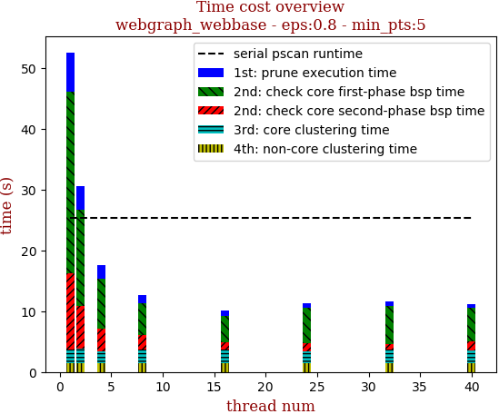 | 

thread_num | prune | check-core 1st bsp | check-core 2nd bsp | cluster-core | cluster-non-core | total | total speedup
--- | --- | --- | --- | --- | --- | --- | ---
1 | 6.416s | 29.954s | 12.5s | 2.217s | 1.457s | 52.546s | 1.000
2 | 3.925s | 15.812s | 7.033s | 2.326s | 1.454s | 30.552s | 1.720
4 | 2.205s | 8.254s | 3.637s | 2.008s | 1.436s | 17.543s | 2.995
8 | 1.353s | 5.11s | 2.378s | 2.285s | 1.461s | 12.59s | 4.174
16 | 0.929s | 4.232s | 1.227s | 2.272s | 1.449s | 10.112s | 5.196
24 | 0.671s | 5.82s | 1.312s | 2.008s | 1.438s | 11.252s | 4.670
32 | 0.614s | 6.267s | 1.018s | 2.157s | 1.473s | 11.531s | 4.557
40 | 0.522s | 5.636s | 1.429s | 2.113s | 1.439s | 11.141s | 4.716

## eps:0.9

overview | speedup
--- | ---
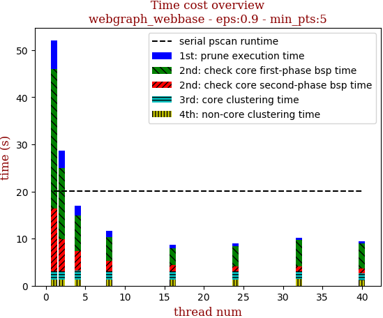 | 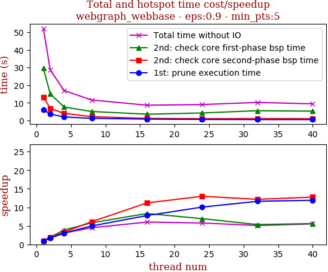

thread_num | prune | check-core 1st bsp | check-core 2nd bsp | cluster-core | cluster-non-core | total | total speedup
--- | --- | --- | --- | --- | --- | --- | ---
1 | 6.072s | 29.591s | 13.294s | 1.843s | 1.278s | 52.081s | 1.000
2 | 3.639s | 15.069s | 6.817s | 1.814s | 1.252s | 28.593s | 1.821
4 | 1.99s | 7.646s | 4.048s | 1.978s | 1.283s | 16.947s | 3.073
8 | 1.222s | 5.095s | 2.168s | 1.847s | 1.258s | 11.593s | 4.492
16 | 0.782s | 3.556s | 1.19s | 1.876s | 1.258s | 8.664s | 6.011
24 | 0.604s | 4.266s | 1.025s | 1.877s | 1.26s | 9.034s | 5.765
32 | 0.523s | 5.544s | 1.095s | 1.678s | 1.395s | 10.237s | 5.088
40 | 0.51s | 5.271s | 1.044s | 1.398s | 1.203s | 9.428s | 5.524

